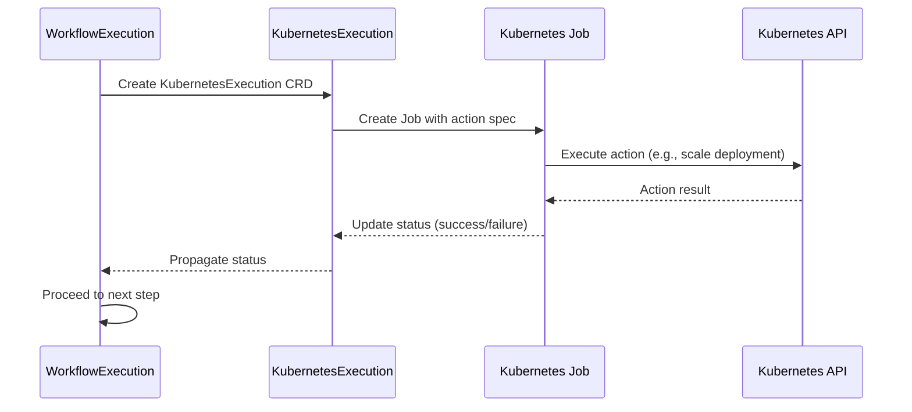
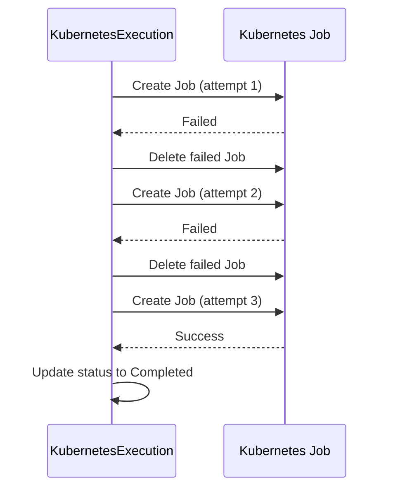

# Integration Points

> **DEPRECATED**: KubernetesExecution CRD and KubernetesExecutor service were eliminated by ADR-025 and replaced by Tekton TaskRun via WorkflowExecution. This documentation is retained for historical reference only. API types and CRD manifests have been removed from the codebase.

## Overview

The Kubernetes Executor service integrates with:
1. **Upstream**: WorkflowExecution Controller (creates Kubernetes Execution CRDs)
2. **Downstream**: Kubernetes API (executes actions via Jobs)
3. **External**: Storage Service (audit trail persistence)

**Integration Pattern**: CRD-based coordination with Job execution

---

## 1. Upstream Integration: WorkflowExecution Controller

**Integration Pattern**: Watch-based CRD creation per workflow step

### How KubernetesExecution is Created

```go
// In WorkflowExecutionReconciler
func (r *WorkflowExecutionReconciler) reconcileWorkflowStep(
    ctx context.Context,
    workflow *workflowv1.WorkflowExecution,
    step *workflowv1.WorkflowStep,
) error {
    // For each step in workflow, create KubernetesExecution CRD
    if step.Status.KubernetesExecutionRef == nil {
        execution := &executionv1.KubernetesExecution{
            ObjectMeta: metav1.ObjectMeta{
                Name:      fmt.Sprintf("%s-step-%d", workflow.Name, step.Index),
                Namespace: workflow.Namespace,
                OwnerReferences: []metav1.OwnerReference{
                    *metav1.NewControllerRef(workflow, workflowv1.GroupVersion.WithKind("WorkflowExecution")),
                },
                Labels: map[string]string{
                    "workflow-execution": workflow.Name,
                    "step-index":         fmt.Sprintf("%d", step.Index),
                    "action-type":        step.Action.Type,
                },
            },
            Spec: executionv1.KubernetesExecutionSpec{
                WorkflowExecutionRef: executionv1.WorkflowExecutionReference{
                    Name:      workflow.Name,
                    Namespace: workflow.Namespace,
                },
                StepIndex: step.Index,
                Action: executionv1.ActionSpec{
                    Type:       step.Action.Type,
                    Parameters: step.Action.Parameters,
                    Target: executionv1.TargetSpec{
                        Namespace:    step.Action.Target.Namespace,
                        ResourceKind: step.Action.Target.ResourceKind,
                        ResourceName: step.Action.Target.ResourceName,
                    },
                },
                Timeout: metav1.Duration{Duration: step.Timeout},
            },
        }

        return r.Create(ctx, execution)
    }

    return nil
}
```

**Note**: WorkflowExecution controller creates one KubernetesExecution CRD per workflow step.

### Upstream Data Flow

```
WorkflowExecution (parent)
├── Step 1 → KubernetesExecution CRD #1 (scale deployment)
├── Step 2 → KubernetesExecution CRD #2 (restart pod)
└── Step 3 → KubernetesExecution CRD #3 (collect logs)
```

**Owner References**:
- KubernetesExecution is owned by WorkflowExecution
- Cascade deletion: Deleting WorkflowExecution deletes all KubernetesExecution CRDs

---

## 2. Downstream Integration: Kubernetes API via Jobs

**Integration Pattern**: Job-based action execution with result collection

### Job Creation Pattern

```go
// In KubernetesExecutionReconciler
func (r *KubernetesExecutionReconciler) executeAction(
    ctx context.Context,
    execution *executionv1.KubernetesExecution,
) error {
    // Create Kubernetes Job to execute action
    job := &batchv1.Job{
        ObjectMeta: metav1.ObjectMeta{
            Name:      fmt.Sprintf("%s-job", execution.Name),
            Namespace: execution.Namespace,
            Labels: map[string]string{
                "kubernetes-execution": execution.Name,
                "action-type":          execution.Spec.Action.Type,
            },
            OwnerReferences: []metav1.OwnerReference{
                *metav1.NewControllerRef(execution, executionv1.GroupVersion.WithKind("KubernetesExecution")),
            },
        },
        Spec: batchv1.JobSpec{
            Template: corev1.PodTemplateSpec{
                Spec: corev1.PodSpec{
                    ServiceAccountName: fmt.Sprintf("action-%s", execution.Spec.Action.Type),
                    Containers: []corev1.Container{
                        {
                            Name:  "executor",
                            Image: r.getExecutorImage(execution.Spec.Action.Type),
                            Env: []corev1.EnvVar{
                                {Name: "ACTION_TYPE", Value: execution.Spec.Action.Type},
                                {Name: "TARGET_NAMESPACE", Value: execution.Spec.Action.Target.Namespace},
                                {Name: "TARGET_KIND", Value: execution.Spec.Action.Target.ResourceKind},
                                {Name: "TARGET_NAME", Value: execution.Spec.Action.Target.ResourceName},
                                {Name: "ACTION_PARAMETERS", Value: string(execution.Spec.Action.Parameters)},
                            },
                        },
                    },
                    RestartPolicy: corev1.RestartPolicyNever,
                },
            },
            BackoffLimit: ptr.To(int32(0)), // No retries - controller handles retries
        },
    }

    return r.Create(ctx, job)
}
```

### Job Result Collection

```go
// In KubernetesExecutionReconciler
func (r *KubernetesExecutionReconciler) collectJobResult(
    ctx context.Context,
    execution *executionv1.KubernetesExecution,
    job *batchv1.Job,
) error {
    // Wait for Job completion
    if !isJobComplete(job) {
        return fmt.Errorf("job not complete")
    }

    // Get Job logs
    logs, err := r.getPodLogs(ctx, job)
    if err != nil {
        return fmt.Errorf("failed to get job logs: %w", err)
    }

    // Parse execution result from logs
    result := parseExecutionResult(logs)

    // Update KubernetesExecution status
    execution.Status.Phase = executionv1.PhaseCompleted
    execution.Status.Result = &executionv1.ExecutionResult{
        Success:   result.Success,
        Output:    result.Output,
        Error:     result.Error,
        StartTime: job.Status.StartTime,
        EndTime:   job.Status.CompletionTime,
    }

    return r.Status().Update(ctx, execution)
}
```

---

## 3. Integration with WorkflowExecution Status Updates

**Integration Pattern**: Status propagation via watch

### How WorkflowExecution Watches KubernetesExecution Status

```go
// In WorkflowExecutionReconciler
func (r *WorkflowExecutionReconciler) watchStepExecution(
    ctx context.Context,
    workflow *workflowv1.WorkflowExecution,
    step *workflowv1.WorkflowStep,
) error {
    // Get KubernetesExecution CRD for this step
    var execution executionv1.KubernetesExecution
    if err := r.Get(ctx, types.NamespacedName{
        Name:      step.Status.KubernetesExecutionRef.Name,
        Namespace: workflow.Namespace,
    }, &execution); err != nil {
        return err
    }

    // Update step status based on execution status
    step.Status.Phase = convertExecutionPhase(execution.Status.Phase)
    step.Status.StartTime = execution.Status.Result.StartTime
    step.Status.EndTime = execution.Status.Result.EndTime

    if execution.Status.Phase == executionv1.PhaseCompleted {
        if execution.Status.Result.Success {
            step.Status.Phase = workflowv1.StepCompleted
            // Proceed to next step
            return r.reconcileNextStep(ctx, workflow, step.Index+1)
        } else {
            step.Status.Phase = workflowv1.StepFailed
            step.Status.Error = execution.Status.Result.Error
            // Handle step failure (retry or fail workflow)
            return r.handleStepFailure(ctx, workflow, step)
        }
    }

    return nil
}
```

### SetupWithManager Configuration

```go
// In KubernetesExecutionReconciler
func (r *KubernetesExecutionReconciler) SetupWithManager(mgr ctrl.Manager) error {
    return ctrl.NewControllerManagedBy(mgr).
        For(&executionv1.KubernetesExecution{}).
        Owns(&batchv1.Job{}). // Watch Jobs created by this controller
        Named("kubernetes-kubernetesexecution").
        Complete(r)
}
```

---

## 4. External Integration: Storage Service (Audit Trail)

**Integration Pattern**: HTTP-based audit persistence

### Audit Event Publishing

```go
// In KubernetesExecutionReconciler
func (r *KubernetesExecutionReconciler) publishAuditEvent(
    ctx context.Context,
    execution *executionv1.KubernetesExecution,
    job *batchv1.Job,
) error {
    auditEvent := &storage.AuditEvent{
        EventType:     "kubernetes.execution",
        Timestamp:     time.Now(),
        ExecutionName: execution.Name,
        ActionType:    execution.Spec.Action.Type,
        Target: storage.TargetInfo{
            Namespace:    execution.Spec.Action.Target.Namespace,
            ResourceKind: execution.Spec.Action.Target.ResourceKind,
            ResourceName: execution.Spec.Action.Target.ResourceName,
        },
        Result: storage.ExecutionResult{
            Success:   execution.Status.Result.Success,
            Output:    execution.Status.Result.Output,
            Error:     execution.Status.Result.Error,
            Duration:  execution.Status.Result.EndTime.Sub(execution.Status.Result.StartTime.Time),
        },
        JobInfo: storage.JobInfo{
            Name:         job.Name,
            PodName:      getPodName(job),
            ExitCode:     getJobExitCode(job),
            ResourceUsage: getResourceUsage(job),
        },
    }

    return r.storageClient.PublishAudit(ctx, auditEvent)
}
```

**Audit Storage Schema**: See [database-integration.md](./database-integration.md) for complete schema.

---

## 5. RBAC Permissions

### Kubernetes Execution Controller Permissions

```yaml
# Required for KubernetesExecution CRD management
apiVersion: rbac.authorization.k8s.io/v1
kind: ClusterRole
metadata:
  name: kubernetes-execution-controller
rules:
# KubernetesExecution CRD
- apiGroups: ["kubernetesexecution.kubernaut.io"]
  resources: ["kubernetesexecutions"]
  verbs: ["get", "list", "watch", "update", "patch"]
- apiGroups: ["kubernetesexecution.kubernaut.io"]
  resources: ["kubernetesexecutions/status"]
  verbs: ["get", "update", "patch"]
- apiGroups: ["kubernetesexecution.kubernaut.io"]
  resources: ["kubernetesexecutions/finalizers"]
  verbs: ["update"]

# Job creation and monitoring
- apiGroups: ["batch"]
  resources: ["jobs"]
  verbs: ["get", "list", "watch", "create", "update", "patch", "delete"]
- apiGroups: ["batch"]
  resources: ["jobs/status"]
  verbs: ["get"]

# Pod log collection
- apiGroups: [""]
  resources: ["pods"]
  verbs: ["get", "list"]
- apiGroups: [""]
  resources: ["pods/log"]
  verbs: ["get"]

# ServiceAccount for Job execution
- apiGroups: [""]
  resources: ["serviceaccounts"]
  verbs: ["get", "list", "watch"]
```

### Per-Action ServiceAccount Permissions

Each action type has its own ServiceAccount with minimal permissions:

```yaml
# Example: scale-deployment action
apiVersion: rbac.authorization.k8s.io/v1
kind: Role
metadata:
  name: action-scale-deployment
  namespace: target-namespace
rules:
- apiGroups: ["apps"]
  resources: ["deployments"]
  verbs: ["get", "list", "patch"]
- apiGroups: ["apps"]
  resources: ["deployments/scale"]
  verbs: ["get", "update", "patch"]
```

**See Also**: [security-configuration.md](./security-configuration.md) for complete RBAC design.

---

## 6. Action Execution Patterns

### Predefined Actions (V1)

| Action Type | Target Resource | Job Image | RBAC Permissions |
|-------------|-----------------|-----------|------------------|
| `scale-deployment` | Deployment | `kubernaut/action-scale:v1` | deployments, deployments/scale |
| `restart-pod` | Pod | `kubernaut/action-restart:v1` | pods, pods/eviction |
| `rollback-deployment` | Deployment | `kubernaut/action-rollback:v1` | deployments, replicasets |
| `cordon-node` | Node | `kubernaut/action-cordon:v1` | nodes, nodes/status |
| `collect-logs` | Pod | `kubernaut/action-logs:v1` | pods, pods/log |

**See Also**: [predefined-actions.md](./predefined-actions.md) for complete action catalog.

### Custom Actions (Future)

Custom actions will be supported via CRD-defined action templates:

```yaml
apiVersion: kubernetesexecution.kubernaut.io/v1alpha1
kind: ActionTemplate
metadata:
  name: custom-scale-statefulset
spec:
  image: custom-registry/scale-statefulset:v1
  rbac:
    rules:
    - apiGroups: ["apps"]
      resources: ["statefulsets"]
      verbs: ["get", "patch"]
```

---

## 7. Error Handling & Retries

### Job Failure Handling

```go
// In KubernetesExecutionReconciler
func (r *KubernetesExecutionReconciler) handleJobFailure(
    ctx context.Context,
    execution *executionv1.KubernetesExecution,
    job *batchv1.Job,
) error {
    // Check retry count
    if execution.Status.RetryCount >= execution.Spec.MaxRetries {
        execution.Status.Phase = executionv1.PhaseFailed
        execution.Status.Result = &executionv1.ExecutionResult{
            Success: false,
            Error:   "max retries exceeded",
        }
        return r.Status().Update(ctx, execution)
    }

    // Increment retry count and requeue
    execution.Status.RetryCount++
    execution.Status.Phase = executionv1.PhaseRetrying

    // Delete failed Job
    if err := r.Delete(ctx, job); err != nil {
        return err
    }

    // Controller will create new Job on next reconcile
    return r.Status().Update(ctx, execution)
}
```

### Timeout Handling

```go
// In KubernetesExecutionReconciler
func (r *KubernetesExecutionReconciler) checkTimeout(
    ctx context.Context,
    execution *executionv1.KubernetesExecution,
) error {
    if execution.Status.StartTime == nil {
        return nil
    }

    elapsed := time.Since(execution.Status.StartTime.Time)
    if elapsed > execution.Spec.Timeout.Duration {
        execution.Status.Phase = executionv1.PhaseTimedOut
        execution.Status.Result = &executionv1.ExecutionResult{
            Success: false,
            Error:   fmt.Sprintf("execution timed out after %s", elapsed),
        }
        return r.Status().Update(ctx, execution)
    }

    return nil
}
```

---

## 8. Multi-Cluster Support (V2)

**Note**: V2 will add multi-cluster execution capabilities.

### V2 Architecture

```
KubernetesExecution CRD (Hub Cluster)
└── Executes on → Target Cluster (via kubeconfig)
    └── Creates Job in target cluster
        └── Executes action on target resources
```

### V2 Integration Changes

1. **Cluster Selection**: Add cluster selector to KubernetesExecution spec
2. **Dynamic Kubeconfig**: Load kubeconfig for target cluster from Secret
3. **Multi-Cluster RBAC**: Separate RBAC per cluster
4. **Cross-Cluster Status**: Propagate status from target cluster to hub

**See Also**: [overview.md#v2-multi-cluster](./overview.md#v2-multi-cluster) for V2 roadmap.

---

## 9. Integration Testing

### Unit Tests (Mock Kubernetes API)

```go
func TestExecuteAction_Success(t *testing.T) {
    // Use fake Kubernetes client
    client := fake.NewClientBuilder().
        WithScheme(scheme).
        Build()

    reconciler := &KubernetesExecutionReconciler{
        Client: client,
        Scheme: scheme,
    }

    execution := &executionv1.KubernetesExecution{
        ObjectMeta: metav1.ObjectMeta{Name: "test-exec", Namespace: "default"},
        Spec: executionv1.KubernetesExecutionSpec{
            Action: executionv1.ActionSpec{
                Type: "scale-deployment",
                Parameters: []byte(`{"replicas": 3}`),
            },
        },
    }

    err := reconciler.executeAction(context.TODO(), execution)
    assert.NoError(t, err)

    // Verify Job created
    var job batchv1.Job
    err = client.Get(context.TODO(), types.NamespacedName{
        Name:      "test-exec-job",
        Namespace: "default",
    }, &job)
    assert.NoError(t, err)
}
```

### Integration Tests (Real Kubernetes Cluster)

```go
func TestIntegration_ExecuteAndCollectResult(t *testing.T) {
    // Uses Kind cluster or test cluster
    testEnv := &envtest.Environment{
        CRDDirectoryPaths: []string{"../../../config/crd/bases"},
    }

    cfg, err := testEnv.Start()
    require.NoError(t, err)
    defer testEnv.Stop()

    client, err := client.New(cfg, client.Options{Scheme: scheme})
    require.NoError(t, err)

    // Create execution
    execution := createTestExecution()
    err = client.Create(context.TODO(), execution)
    require.NoError(t, err)

    // Wait for Job creation
    job := waitForJob(client, execution.Name)
    assert.NotNil(t, job)

    // Simulate Job completion
    job.Status.Succeeded = 1
    job.Status.CompletionTime = &metav1.Time{Time: time.Now()}
    err = client.Status().Update(context.TODO(), job)
    require.NoError(t, err)

    // Verify execution status updated
    updated := waitForExecutionPhase(client, execution.Name, executionv1.PhaseCompleted)
    assert.Equal(t, executionv1.PhaseCompleted, updated.Status.Phase)
}
```

**See Also**: [testing-strategy.md](./testing-strategy.md) for comprehensive testing patterns.

---

## 10. Common Pitfalls & Best Practices

### Don't ❌

- **Don't execute actions directly from controller**: Always use Jobs for isolation
- **Don't use unlimited retries**: Set reasonable `maxRetries` (default: 3)
- **Don't reuse Job names**: Each retry should create new Job with unique name
- **Don't grant excessive RBAC**: Use per-action ServiceAccounts with minimal permissions
- **Don't skip audit logging**: Every action must be audited
- **Don't ignore timeouts**: Set reasonable timeouts per action type

### Do ✅

- **Use Jobs for execution**: Provides isolation, resource limits, and retry capability
- **Implement proper RBAC**: One ServiceAccount per action type
- **Audit all executions**: Persist to storage service for compliance
- **Set owner references**: Enable cascade deletion when WorkflowExecution is deleted
- **Handle Job failures gracefully**: Implement retry logic with exponential backoff
- **Monitor Job resource usage**: Track CPU/memory for cost optimization

---

## 11. Sequence Diagrams

### Action Execution Flow



### Retry Flow



---

## 11. Action Validation Framework (DD-002)

**Integration Pattern**: KubernetesExecutor evaluates action-specific preconditions and postconditions during execution

**New in V1**: Per-action precondition/postcondition validation framework (BR-EXEC-016, BR-EXEC-036)
**Design Decision**: [DD-002 - Per-Step Validation Framework](../../architecture/DESIGN_DECISIONS.md#dd-002-per-step-validation-framework-alternative-2)

### Integration with Existing Dry-Run Validation

The action validation framework **extends** (not replaces) existing validation:

```
Validation Flow:
1. Parameter validation (existing)
2. RBAC validation (existing)
3. Resource existence check (existing)
4. Rego policy validation (existing)
5. ✅ NEW: Precondition evaluation (BR-EXEC-016)
6. Dry-run execution (existing)
7. Create Kubernetes Job (existing)
8. Monitor Job execution (existing)
9. ✅ NEW: Postcondition verification (BR-EXEC-036)
10. Mark execution complete (existing)
```

### Precondition Evaluation (BR-EXEC-016)

**When**: During "validating" phase, after dry-run, before Job creation
**Purpose**: Action-specific validation beyond workflow-level checks

```go
// Evaluate action preconditions
func (r *KubernetesExecutorReconciler) evaluateActionPreconditions(
    ctx context.Context,
    ke *executionv1.KubernetesExecution,
) ([]executionv1.ConditionResult, error) {
    results := make([]executionv1.ConditionResult, 0)

    for _, condition := range ke.Spec.PreConditions {
        // Query cluster state specific to action
        clusterState, err := r.queryActionState(ctx, ke.Spec.Action, ke.Spec.Parameters)
        if err != nil {
            return nil, fmt.Errorf("failed to query action state: %w", err)
        }

        // Evaluate Rego policy
        result := &executionv1.ConditionResult{
            ConditionType:  condition.Type,
            Evaluated:      true,
            EvaluationTime: metav1.Now(),
        }

        allowed, err := r.regoEvaluator.Evaluate(ctx, condition.Rego, clusterState)
        if err != nil {
            result.Passed = false
            result.ErrorMessage = fmt.Sprintf("Policy evaluation error: %v", err)
        } else if !allowed {
            result.Passed = false
            result.ErrorMessage = fmt.Sprintf("Precondition %s not met", condition.Type)
        } else {
            result.Passed = true
        }

        results = append(results, *result)

        // Block Job creation if required precondition failed
        if condition.Required && !result.Passed {
            return results, fmt.Errorf("required precondition %s failed", condition.Type)
        }
    }

    return results, nil
}
```

### Postcondition Verification (BR-EXEC-036)

**When**: During "executing" phase, after Job completion
**Purpose**: Verify kubectl action achieved intended effect

```go
// Verify action postconditions
func (r *KubernetesExecutorReconciler) verifyActionPostconditions(
    ctx context.Context,
    ke *executionv1.KubernetesExecution,
) ([]executionv1.ConditionResult, error) {
    results := make([]executionv1.ConditionResult, 0)

    for _, condition := range ke.Spec.PostConditions {
        result := &executionv1.ConditionResult{
            ConditionType:  condition.Type,
            Evaluated:      true,
            EvaluationTime: metav1.Now(),
        }

        // Async verification with timeout
        timeout, _ := time.ParseDuration(condition.Timeout)
        if timeout == 0 {
            timeout = 2 * time.Minute // Default for action verification
        }

        verifyCtx, cancel := context.WithTimeout(ctx, timeout)
        defer cancel()

        // Poll for condition satisfaction
        ticker := time.NewTicker(10 * time.Second)
        defer ticker.Stop()

        for {
            select {
            case <-verifyCtx.Done():
                result.Passed = false
                result.ErrorMessage = fmt.Sprintf(
                    "Verification timeout: %s not met within %s",
                    condition.Type, condition.Timeout)
                goto done

            case <-ticker.C:
                clusterState, err := r.queryActionState(ctx, ke.Spec.Action, ke.Spec.Parameters)
                if err != nil {
                    continue
                }

                allowed, err := r.regoEvaluator.Evaluate(ctx, condition.Rego, clusterState)
                if err != nil {
                    continue
                }

                if allowed {
                    result.Passed = true
                    goto done
                }
            }
        }

    done:
        results = append(results, *result)

        // Mark execution failed if required postcondition failed
        if condition.Required && !result.Passed {
            // Capture rollback information before failing
            r.captureRollbackInformation(ke)
            return results, fmt.Errorf("required postcondition %s failed", condition.Type)
        }
    }

    return results, nil
}
```

### Rollback Information Capture on Postcondition Failure

```go
// Enhanced rollback capture when postconditions fail
func (r *KubernetesExecutorReconciler) captureRollbackInformation(
    ke *executionv1.KubernetesExecution,
) {
    ke.Status.RollbackInformation = &executionv1.RollbackInfo{
        Available: true,
        RollbackAction: determineRollbackAction(ke.Spec.Action),
        RollbackParameters: extractRollbackParameters(ke.Spec.Parameters),
        // ✅ NEW: Include postcondition failure details
        FailureReason: "Postcondition verification failed",
        PostConditionResults: ke.Status.ValidationResults.PostConditionResults,
    }
}
```

### Benefits of Action Validation Framework

| Aspect | Before | After (DD-002) | Improvement |
|--------|--------|----------------|-------------|
| **kubectl Success ≠ Actual Success** | 15-20% "successful" Jobs don't achieve effect | <5% gap | 75% reduction |
| **Cluster State Verification** | Assumed from Job exit code | Verified via Rego policies | Direct validation |
| **Rollback Trigger Accuracy** | Based on Job failure only | Based on postcondition + Job status | More accurate |
| **Integration with Workflow** | Action-level only | Step-level + action-level validation | Defense-in-depth |

---

## 12. References

- **Upstream CRD**: [WorkflowExecution CRD Schema](../../design/CRD/06_WORKFLOW_EXECUTION_CRD.md)
- **Downstream**: [Predefined Actions](./predefined-actions.md)
- **Security**: [RBAC Configuration](./security-configuration.md)
- **Monitoring**: [Metrics & SLOs](./metrics-slos.md)
- **Testing**: [Testing Strategy](./testing-strategy.md)
- **Architecture**: [Multi-CRD Reconciliation](../../../architecture/MULTI_CRD_RECONCILIATION_ARCHITECTURE.md)
