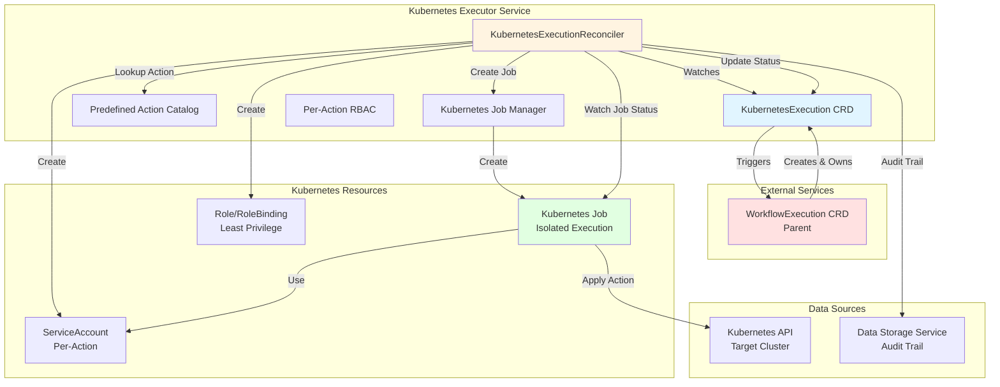
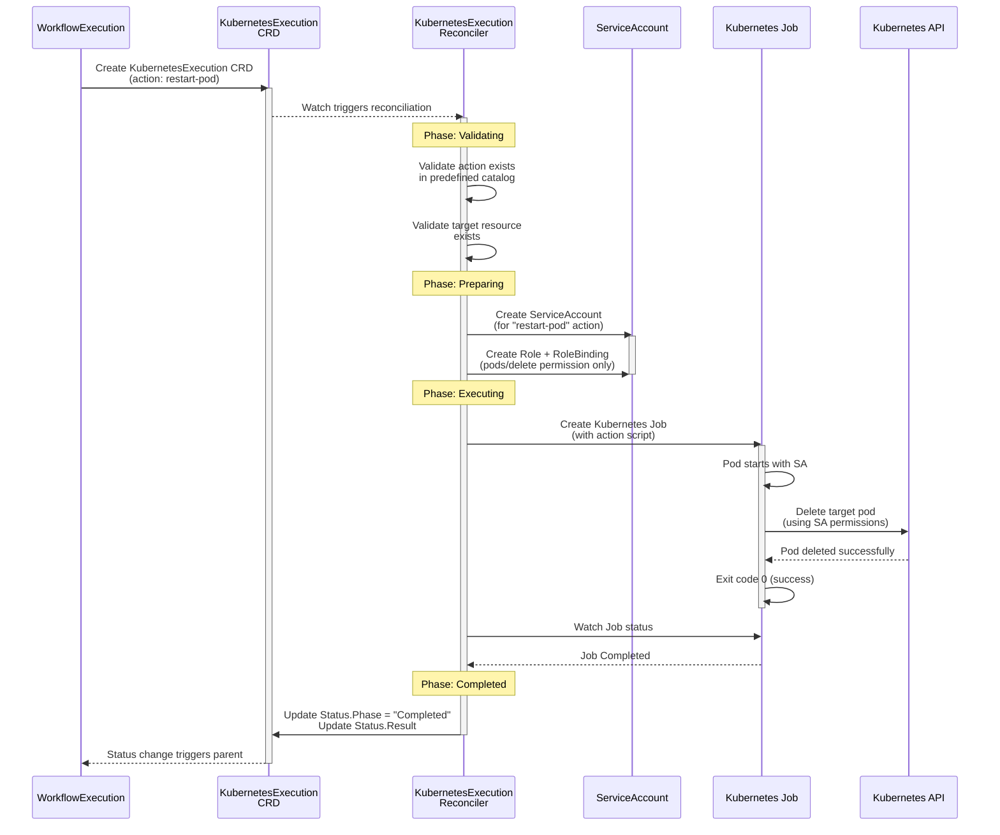
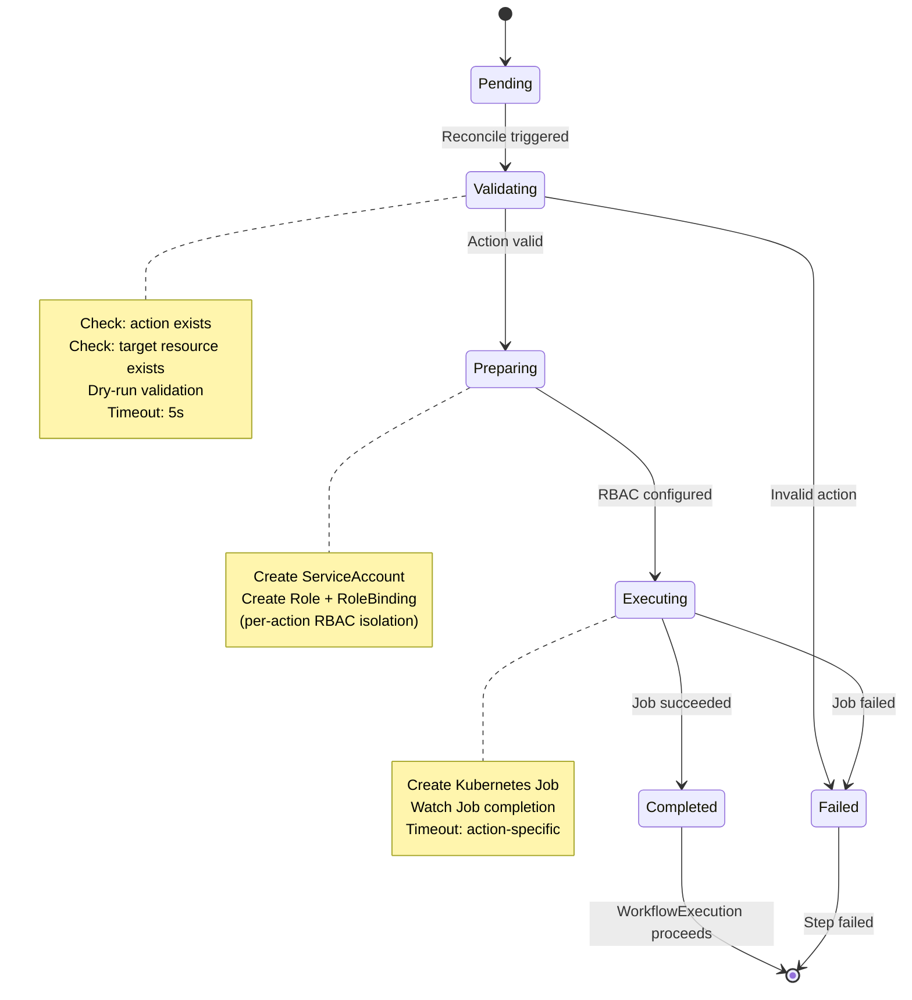

## Overview

> **DEPRECATED**: KubernetesExecution CRD and KubernetesExecutor service were eliminated by ADR-025 and replaced by Tekton TaskRun via WorkflowExecution. This documentation is retained for historical reference only. API types and CRD manifests have been removed from the codebase.

**Purpose**: Execute individual Kubernetes remediation actions with safety validation, dry-run testing, and comprehensive audit trails using native Kubernetes Jobs.

**Core Responsibilities**:
1. Execute predefined Kubernetes actions (scale, restart, delete pod, patch, etc.)
2. Validate actions through dry-run execution before real changes
3. Enforce safety policies using Rego-based validation
4. Provide per-action RBAC isolation through dedicated ServiceAccounts
5. Track execution results and provide rollback capability
6. Maintain comprehensive audit trails for compliance

**V1 Scope - Single Cluster Native Jobs**:
- Native Kubernetes Jobs for step execution (zero external dependencies)
- 10 predefined actions covering 80% of remediation scenarios
- Single cluster execution (local cluster only)
- Rego-based safety policy validation
- Per-action ServiceAccount for RBAC isolation
- Synchronous dry-run validation before execution
- Configurable timeouts with sensible defaults

**Future V2 Enhancements** (Out of Scope):
- Multi-cluster execution support
- Advanced action types (Helm, Kustomize, custom operators)
- Asynchronous validation workflows
- Cross-cluster orchestration
- Custom action plugin system
- **Multi-Cloud Infrastructure Execution**: AWS, Azure, GCP provider actions

---

## Business Requirements Coverage

**KubernetesExecutor** implements infrastructure action execution across Kubernetes and (V2) cloud providers:

### V1 Scope: Kubernetes Actions (BR-EXEC-001 to BR-EXEC-088)

**Range**: BR-EXEC-001 to BR-EXEC-180
**V1 Active**: BR-EXEC-001 to BR-EXEC-088 (41 BRs total)
**V2 Reserved**: BR-EXEC-089 to BR-EXEC-180 (multi-cloud expansion)

**V1 Business Requirements Breakdown**:

#### Core Execution (BR-EXEC-001 to BR-EXEC-059)
- BR-EXEC-001 to BR-EXEC-015: Core action execution patterns
- BR-EXEC-016: **Action precondition framework** (NEW) - See [DD-002](../../../architecture/DESIGN_DECISIONS.md#dd-002-per-step-validation-framework-alternative-2)
- BR-EXEC-020 to BR-EXEC-035: Kubernetes Job creation and monitoring
- BR-EXEC-036: **Action postcondition verification** (NEW) - See [DD-002](../../../architecture/DESIGN_DECISIONS.md#dd-002-per-step-validation-framework-alternative-2)
- BR-EXEC-037 to BR-EXEC-040: Job result handling
- BR-EXEC-045 to BR-EXEC-055: Timeout, RBAC, and safety validation

#### Migrated from BR-KE-* (BR-EXEC-060 to BR-EXEC-088)
- BR-EXEC-060 to BR-EXEC-066: Safety validation, dry-run, audit (was BR-KE-001 to BR-KE-016)
- BR-EXEC-067 to BR-EXEC-069: Job lifecycle and monitoring (was BR-KE-020 to BR-KE-022)
- BR-EXEC-070 to BR-EXEC-080: Per-action execution patterns (was BR-KE-030 to BR-KE-040)
- BR-EXEC-081 to BR-EXEC-088: Testing, security, multi-cluster (was BR-KE-045 to BR-KE-060, extended with validation framework)

**Rationale for BR Migration (BR-KE-* → BR-EXEC-*)**:
KubernetesExecutor will expand to **Multi-Cloud Executor** in V2, executing infrastructure actions across Kubernetes, AWS, Azure, and GCP. The generic "BR-EXEC-*" prefix is cloud-agnostic and scales naturally to multi-cloud scenarios, while "BR-KE-*" (Kubernetes Executor) would be misleading when executing AWS EC2 or Azure VM actions. See [BR Migration Mapping](./BR_MIGRATION_MAPPING.md) for complete details.

**New in V1**: Action-level validation framework (BR-EXEC-016, BR-EXEC-036) extends existing dry-run validation with per-action precondition/postcondition checking. See [DD-002](../../../architecture/DESIGN_DECISIONS.md#dd-002-per-step-validation-framework-alternative-2) and [STEP_VALIDATION_BUSINESS_REQUIREMENTS.md](../../../requirements/STEP_VALIDATION_BUSINESS_REQUIREMENTS.md).

### V2 Expansion (BR-EXEC-087 to BR-EXEC-180) - MANDATORY FOR V2

**⚠️ V2 Requirement**: Multi-cloud support is **MANDATORY** for V2 release, not optional.

**Reserved Cloud Provider Actions** (V2 Implementation Required):
- BR-EXEC-100 to BR-EXEC-120: **AWS infrastructure actions** (MANDATORY V2)
  - EC2 instance management (start, stop, terminate, reboot)
  - ECS/EKS container orchestration
  - Lambda function operations
  - Auto Scaling Group adjustments
  - CloudWatch alarm management
- BR-EXEC-121 to BR-EXEC-140: **Azure infrastructure actions** (MANDATORY V2)
  - Virtual Machine operations (start, stop, restart, delete)
  - AKS cluster management
  - Azure Functions operations
  - VM Scale Set adjustments
  - Azure Monitor alert management
- BR-EXEC-141 to BR-EXEC-160: **GCP infrastructure actions** (MANDATORY V2)
  - Compute Engine instance management
  - GKE cluster operations
  - Cloud Functions management
  - Managed Instance Group scaling
  - Cloud Monitoring alert handling
- BR-EXEC-161 to BR-EXEC-180: **Cross-cloud orchestration** (MANDATORY V2)
  - Unified action interface across providers
  - Provider-agnostic safety validation
  - Cross-cloud workflow coordination
  - Multi-cloud rollback strategies

**V1 Scope Boundaries**:
- ✅ **V1 Includes**: Kubernetes actions only (BR-EXEC-001 to BR-EXEC-086)
- ❌ **V1 Excludes**: All cloud provider actions (AWS, Azure, GCP)
- 📅 **V2 Requires**: Complete implementation of AWS, Azure, and GCP actions (not optional)

### ⚠️ Clarification: BR-EXEC-* vs BR-EXECUTION-*

**BR-EXEC-* (KubernetesExecutor / Multi-Cloud Executor)**:
- Executes **individual infrastructure actions** (single operations)
- Action-level scope: create pod, scale deployment, start EC2 instance, etc.
- Handles execution details, job creation, monitoring, timeout, rollback
- V1: Kubernetes actions | V2: Kubernetes + AWS + Azure + GCP

**BR-EXECUTION-* (WorkflowExecution)**:
- Monitors **overall workflow execution progress** (multi-step coordination)
- Workflow-level scope: entire remediation workflow with 5+ steps
- Handles workflow orchestration, step ordering, dependencies, workflow health

**Example**:
```
WorkflowExecution (BR-EXECUTION-*):
  ├─ Step 1: Scale deployment (calls BR-EXEC-001)
  ├─ Step 2: Restart pods (calls BR-EXEC-005)
  └─ Step 3: Update config (calls BR-EXEC-010)

Overall workflow health: BR-EXECUTION-001 (workflow monitoring)
Individual action execution: BR-EXEC-001/005/010 (action execution)
```

---

**Key Architectural Decisions**:
1. **Native Kubernetes Jobs** - Zero dependencies, production-ready, simple mental model
2. **Per-Step Resource Isolation** - Each action runs in isolated Job pod
3. **Per-Action ServiceAccounts** - Dedicated RBAC for each action type (scale-deployment-sa, restart-pod-sa, etc.)
4. **Synchronous Dry-Run** - Validation completes before execution phase
5. **Rego Policy Engine** - Flexible, testable safety validation
6. **Configurable Timeouts** - Per-action timeouts with sensible defaults (5m default, 15m max)
7. **Single Cluster V1** - CRD spec supports multi-cluster, implementation focuses on local cluster

---

## Service Configuration

### Port Configuration
- **Port 9090**: Metrics endpoint
- **Port 8080**: Health probes (follows kube-apiserver pattern)
- **Endpoint**: `/metrics`
- **Format**: Prometheus text format
- **Authentication**: Kubernetes TokenReviewer API (validates ServiceAccount tokens)
  - **See**: [METRICS_AUTHENTICATION.md](../METRICS_AUTHENTICATION.md) for complete implementation examples

### ServiceAccount
- **Name**: `kubernetes-executor-sa`
- **Namespace**: `kubernaut-system`
- **Purpose**: Controller authentication and authorization

### Notes
- CRD controllers do not expose REST APIs
- Health checks (`/healthz`, `/readyz`) are for Kubernetes liveness/readiness probes
- Metrics endpoint requires valid Kubernetes ServiceAccount token

---

## 📊 Visual Architecture

### Architecture Diagram


### Sequence Diagram - Job Execution Flow


### State Machine - Job Execution Phases


---

## 📊 **DOCUMENT COMPLETION STATUS**

The Kubernetes Executor Service design document has been completed with the following comprehensive sections:

### ✅ **Completed Sections (100%)**:

1. **Overview & Business Requirements** - Core purpose and 50+ BR references
2. **Development Methodology** - APDC-TDD workflow with 6 phases
3. **Package Structure** - `pkg/kubernetesexecution/` layout
4. **Reconciliation Architecture** - 6-phase async workflow with native Jobs
5. **Predefined Actions** - 10 action types covering 80% of remediation scenarios
6. **Current State & Migration** - Existing code analysis from `pkg/platform/executor/`
7. **CRD Schema Specification** - Complete type-safe schema with 30+ structured types
8. **Controller Implementation** - Job creation, monitoring, phase transitions (1,185 lines)
9. **Prometheus Metrics** - 15+ metrics with Grafana dashboard queries
10. **Testing Strategy** - Unit (70%+), Integration (20%), E2E (10%) with Ginkgo examples
11. **Performance Targets** - Action-specific targets (scale: 30s, node drain: 5m)
12. **Database Integration** - Comprehensive audit trail schema for compliance
13. **Integration Points** - WorkflowExecution coordination, Rego policy evaluation
14. **RBAC Configuration** - 10 ServiceAccounts with per-action minimal permissions (complete YAML)
15. **Implementation Checklist** - Detailed 15-day plan with APDC-TDD phases
16. **Critical Architectural Patterns** - 8 key patterns (Owner References, Job-Based Execution, RBAC Isolation, etc.)
17. **Common Pitfalls** - 10 specific issues to avoid
18. **Summary** - Production-ready specification with 80% confidence

### 📈 **Key Metrics**:

- **Total Lines**: 3,000+ lines of comprehensive documentation
- **Structured Types**: 30+ type-safe definitions (zero `map[string]interface{}`)
- **Code Examples**: 50+ Go code snippets with complete implementations
- **Test Examples**: 15+ Ginkgo/Gomega test cases
- **RBAC Manifests**: 10 ServiceAccounts with complete YAML
- **Business Requirements**: 50+ BR references mapped
- **Estimated Implementation**: 2-3 weeks (10-15 days)

### 🎯 **Core Architectural Highlights**:

**Native Kubernetes Jobs**:
- Zero external dependencies (no Tekton/ArgoCD)
- Per-step resource and process isolation
- Automatic cleanup with TTLSecondsAfterFinished
- ServiceAccount-based RBAC per action type

**Type-Safe Action Parameters**:
- Discriminated unions for compile-time validation
- 10 action types: scale, restart, delete pod, patch, node management, etc.
- OpenAPI v3 validation ready
- Rollback information extraction for each action

**Rego-Based Policy Validation**:
- Flexible safety enforcement
- ConfigMap-based policy storage
- Version-controlled policy updates
- Test-driven policy development

**Multi-Phase Validation**:
```
validating (5-30s) → validated → waiting_approval → executing (1-15m) → rollback_ready
```

### 🔄 **Integration Flow**:

```
WorkflowExecution Controller
       ↓ (creates)
KubernetesExecution CRD
       ↓ (validates & creates)
Native Kubernetes Job
       ↓ (executes with dedicated SA)
kubectl Command in Pod
       ↓ (captures)
Rollback Information
       ↓ (watches status)
WorkflowExecution Controller (triggers rollback if needed)
```

### 📊 **V1 Design Phase Progress Update**:

With Kubernetes Executor complete:
- **CRD Services Designed**: 5/5 (100%) ✅
  1. ✅ Remediation Processor (17 types, 3 violations fixed)
  2. ✅ AI Analysis (clean, 0 violations)
  3. ✅ Workflow Execution (30+ types, 5 violations fixed)
  4. ✅ Remediation Orchestrator (clean, 0 violations)
  5. ✅ **Kubernetes Executor (30+ types, clean)** ← Just completed

- **Total Structured Types Defined**: 77+ types across all services
- **Total Violations Fixed**: 8 critical violations
- **Overall Progress**: 5/10 V1 services (50% complete)

### 🚀 **Ready for Implementation**:

✅ Complete CRD schema with type-safe parameters
✅ Comprehensive controller reconciliation logic
✅ Per-action RBAC configuration
✅ Rego policy integration design
✅ Testing strategy with 70%+ unit coverage target
✅ Prometheus metrics for full observability
✅ Database audit trail schema
✅ Integration patterns with WorkflowExecution
✅ 15-day implementation timeline
✅ Common pitfalls and best practices documented

### 📝 **Next Steps**:

**Option 1**: Proceed to next V1 service design (5 stateless services remaining)
**Option 2**: Review and approve all 5 CRD service designs before moving forward
**Option 3**: Begin implementation of approved CRD services

---

**Document Version**: 1.0
**Last Updated**: 2025-10-02
**Status**: ✅ **DESIGN COMPLETE - READY FOR IMPLEMENTATION APPROVAL**
**Confidence**: 80% (High confidence for V1 single-cluster scope with native Jobs)
