## Testing Strategy

> **DEPRECATED**: KubernetesExecution CRD and KubernetesExecutor service were eliminated by ADR-025 and replaced by Tekton TaskRun via WorkflowExecution. This documentation is retained for historical reference only. API types and CRD manifests have been removed from the codebase.

**Testing Framework Reference**: [.cursor/rules/03-testing-strategy.mdc](../../../.cursor/rules/03-testing-strategy.mdc)

### Testing Pyramid

Following Kubernaut's defense-in-depth testing strategy:

| Test Type | Target Coverage | Focus | Confidence |
|-----------|----------------|-------|------------|
| **Unit Tests** | 70%+ | Controller logic, Job creation, action validation, dry-run testing | 85-90% |
| **Integration Tests** | >50% | CRD interactions, real Kubernetes Job execution, kubectl commands | 80-85% |
| **E2E Tests** | 10-15% | Complete remediation action workflows, actual cluster changes | 90-95% |

**Rationale**: CRD controllers require high integration test coverage (>50%) to validate Kubernetes API interactions, CRD lifecycle management, native Kubernetes Job creation, and actual cluster state changes that cannot be adequately tested in unit tests alone. KubernetesExecutor is the final execution point for remediation actions, demanding thorough real-cluster validation.

### Unit Tests (Primary Coverage Layer)

**Test Directory**: [test/unit/](../../../test/unit/)
**Service Tests**: Create `test/unit/kubernetesexecutor/controller_test.go`
**Coverage Target**: 73% of business requirements (BR-EXEC-060 to BR-EXEC-086)
**Confidence**: 85-90%
**Execution**: `make test`

**Testing Strategy**: Use fake K8s client for compile-time API safety. Mock ONLY external dependencies (Git clients for GitOps). Use REAL business logic components (action validators, kubectl command builders).

**Rationale for Fake K8s Client**:
- ✅ **Compile-Time API Safety**: Job API changes/deprecations caught at build time, not runtime
- ✅ **Type-Safe Resource Handling**: Job, Pod, ServiceAccount schema changes validated by compiler
- ✅ **Real K8s Errors**: `apierrors.IsForbidden()`, `apierrors.IsTimeout()` behavior for RBAC failures
- ✅ **Per-Action RBAC Testing**: Validate ServiceAccount permissions for each action type
- ✅ **Upgrade Protection**: Breaking API changes explicit, not hidden

**Test File Structure** (aligned with package name `kubernetesexecutor`):
```
test/unit/
├── kubernetesexecutor/                  # Matches pkg/kubernetesexecutor/
│   ├── controller_test.go               # Main controller reconciliation tests
│   ├── job_creation_test.go             # Kubernetes Job creation tests
│   ├── action_validation_test.go        # Action validation and dry-run tests
│   ├── per_action_tests.go              # Individual action type tests (10 predefined)
│   ├── rbac_validation_test.go          # Per-action RBAC permission tests
│   ├── kubectl_command_test.go          # kubectl command builder tests
│   ├── gitops_detection_test.go         # GitOps annotation detection tests
│   └── suite_test.go                    # Ginkgo test suite setup
└── ...
```

**Migration Note**: Create new `test/unit/kubernetesexecutor/` directory (no legacy tests exist for this new service).

```go
package kubernetesexecutor

import (
    . "github.com/onsi/ginkgo/v2"
    . "github.com/onsi/gomega"
    "context"
    "time"

    kubernetesexecutionv1 "github.com/jordigilh/kubernaut/api/kubernetesexecution/v1"
    workflowexecutionv1 "github.com/jordigilh/kubernaut/api/workflowexecution/v1"
    "github.com/jordigilh/kubernaut/internal/controller/kubernetesexecutor"
    "github.com/jordigilh/kubernaut/pkg/executor/actions"
    "github.com/jordigilh/kubernaut/pkg/executor/validation"
    "github.com/jordigilh/kubernaut/pkg/testutil"
    "github.com/jordigilh/kubernaut/pkg/testutil/mocks"

    batchv1 "k8s.io/api/batch/v1"
    v1 "k8s.io/api/core/v1"
    rbacv1 "k8s.io/api/rbac/v1"
    apierrors "k8s.io/apimachinery/pkg/api/errors"
    metav1 "k8s.io/apimachinery/pkg/apis/meta/v1"
    "k8s.io/apimachinery/pkg/runtime"
    "sigs.k8s.io/controller-runtime/pkg/client"
    "sigs.k8s.io/controller-runtime/pkg/client/fake"
)

var _ = Describe("BR-EXEC-060: Kubernetes Executor Controller", func() {
    var (
        // Fake K8s client for compile-time API safety
        fakeK8sClient      client.Client
        scheme             *runtime.Scheme

        // Mock ONLY external dependencies
        mockGitClient      *mocks.MockGitClient

        // Use REAL business logic components
        actionValidator    *validation.ActionValidator
        dryRunValidator    *validation.DryRunValidator
        actionCatalog      *actions.Catalog
        reconciler         *kubernetesexecutor.KubernetesExecutionReconciler
        ctx                context.Context
    )

    BeforeEach(func() {
        ctx = context.Background()

        // Minimal scheme: Only types needed for these tests
        scheme = runtime.NewScheme()
        _ = v1.AddToScheme(scheme)
        _ = batchv1.AddToScheme(scheme)
        _ = rbacv1.AddToScheme(scheme)
        _ = kubernetesexecutionv1.AddToScheme(scheme)
        _ = workflowexecutionv1.AddToScheme(scheme)

        // Fake K8s client with compile-time API safety
        fakeK8sClient = fake.NewClientBuilder().
            WithScheme(scheme).
            Build()

        // Mock external Git client
        mockGitClient = mocks.NewMockGitClient()

        // Use REAL business logic
        actionCatalog = actions.NewCatalog()
        actionValidator = validation.NewActionValidator(actionCatalog)
        dryRunValidator = validation.NewDryRunValidator(fakeK8sClient)

        reconciler = &kubernetesexecutor.KubernetesExecutionReconciler{
            Client:          fakeK8sClient,
            Scheme:          scheme,
            ActionCatalog:   actionCatalog,
            ActionValidator: actionValidator,
            DryRunValidator: dryRunValidator,
            GitClient:       mockGitClient,
        }
    })

    Context("BR-EXEC-061: Dry-Run Validation Phase", func() {
        It("should validate action with dry-run before Job creation", func() {
            // Setup test action for pod restart
            ke := &kubernetesexecutionv1.KubernetesExecution{
                ObjectMeta: metav1.ObjectMeta{
                    Name:      "test-dryrun-restart-pod",
                    Namespace: "kubernaut-system",
                },
                Spec: kubernetesexecutionv1.KubernetesExecutionSpec{
                    Action: kubernetesexecutionv1.Action{
                        Type: "restart-pod",
                        TargetResource: kubernetesexecutionv1.TargetResource{
                            APIVersion: "v1",
                            Kind:       "Pod",
                            Name:       "webapp-789",
                            Namespace:  "production",
                        },
                    },
                    ValidationConfig: kubernetesexecutionv1.ValidationConfig{
                        DryRun:          true,
                        ValidateRBAC:    true,
                        ValidateTarget:  true,
                    },
                },
            }

            // Create target pod for validation
            targetPod := &v1.Pod{
                ObjectMeta: metav1.ObjectMeta{
                    Name:      "webapp-789",
                    Namespace: "production",
                },
                Spec: v1.PodSpec{
                    Containers: []v1.Container{{Name: "webapp", Image: "webapp:v1.2.3"}},
                },
            }
            Expect(fakeK8sClient.Create(ctx, targetPod)).To(Succeed())

            // Create ServiceAccount with RBAC permissions
            sa := &v1.ServiceAccount{
                ObjectMeta: metav1.ObjectMeta{
                    Name:      "ke-restart-pod-sa",
                    Namespace: "kubernaut-system",
                },
            }
            Expect(fakeK8sClient.Create(ctx, sa)).To(Succeed())

            // Create KubernetesExecution CRD
            Expect(fakeK8sClient.Create(ctx, ke)).To(Succeed())

            // Execute reconciliation
            result, err := reconciler.Reconcile(ctx, testutil.NewReconcileRequest(ke))

            // Validate dry-run validation succeeded
            Expect(err).ToNot(HaveOccurred())
            Expect(result.Requeue).To(BeTrue(), "should requeue for Job creation phase")
            Expect(ke.Status.Phase).To(Equal("creating-job"))
            Expect(ke.Status.ValidationResults).ToNot(BeNil())
            Expect(ke.Status.ValidationResults.DryRunSuccess).To(BeTrue())
            Expect(ke.Status.ValidationResults.TargetExists).To(BeTrue())
            Expect(ke.Status.ValidationResults.RBACValid).To(BeTrue())
        })

        It("BR-EXEC-062: should fail validation if target resource not found", func() {
            ke := &kubernetesexecutionv1.KubernetesExecution{
                ObjectMeta: metav1.ObjectMeta{
                    Name:      "test-dryrun-target-missing",
                    Namespace: "kubernaut-system",
                },
                Spec: kubernetesexecutionv1.KubernetesExecutionSpec{
                    Action: kubernetesexecutionv1.Action{
                        Type: "restart-pod",
                        TargetResource: kubernetesexecutionv1.TargetResource{
                            APIVersion: "v1",
                            Kind:       "Pod",
                            Name:       "nonexistent-pod",
                            Namespace:  "production",
                        },
                    },
                    ValidationConfig: kubernetesexecutionv1.ValidationConfig{
                        DryRun:         true,
                        ValidateTarget: true,
                    },
                },
            }

            Expect(fakeK8sClient.Create(ctx, ke)).To(Succeed())

            result, err := reconciler.Reconcile(ctx, testutil.NewReconcileRequest(ke))

            // Validate failure due to missing target
            Expect(err).To(HaveOccurred())
            Expect(result.Requeue).To(BeFalse())
            Expect(ke.Status.Phase).To(Equal("failed"))
            Expect(ke.Status.ValidationResults.TargetExists).To(BeFalse())
            Expect(ke.Status.ValidationResults.ErrorMessage).To(ContainSubstring("target not found"))
        })

        It("BR-EXEC-063: should fail validation if RBAC permissions insufficient", func() {
            ke := testutil.NewKubernetesExecution("test-dryrun-rbac-fail", "kubernaut-system")
            ke.Spec.Action.Type = "scale-deployment"
            ke.Spec.ValidationConfig.ValidateRBAC = true

            // Create ServiceAccount without required permissions
            sa := &v1.ServiceAccount{
                ObjectMeta: metav1.ObjectMeta{
                    Name:      "ke-scale-deployment-sa",
                    Namespace: "kubernaut-system",
                },
            }
            Expect(fakeK8sClient.Create(ctx, sa)).To(Succeed())

            // No Role/RoleBinding created → RBAC should fail

            Expect(fakeK8sClient.Create(ctx, ke)).To(Succeed())

            result, err := reconciler.Reconcile(ctx, testutil.NewReconcileRequest(ke))

            // Validate RBAC validation failure
            Expect(err).To(HaveOccurred())
            Expect(ke.Status.Phase).To(Equal("failed"))
            Expect(ke.Status.ValidationResults.RBACValid).To(BeFalse())
            Expect(ke.Status.ValidationResults.ErrorMessage).To(ContainSubstring("insufficient RBAC permissions"))
        })

        It("BR-EXEC-064: should detect GitOps annotations and skip direct modification", func() {
            // Create Deployment with ArgoCD annotation
            deployment := testutil.NewDeployment("webapp", "production")
            deployment.Annotations = map[string]string{
                "argocd.argoproj.io/instance": "webapp-app",
            }
            Expect(fakeK8sClient.Create(ctx, deployment)).To(Succeed())

            ke := testutil.NewKubernetesExecution("test-gitops-detection", "kubernaut-system")
            ke.Spec.Action.Type = "scale-deployment"
            ke.Spec.Action.TargetResource = kubernetesexecutionv1.TargetResource{
                APIVersion: "apps/v1",
                Kind:       "Deployment",
                Name:       "webapp",
                Namespace:  "production",
            }
            ke.Spec.Action.Parameters = map[string]string{"replicas": "10"}

            Expect(fakeK8sClient.Create(ctx, ke)).To(Succeed())

            result, err := reconciler.Reconcile(ctx, testutil.NewReconcileRequest(ke))

            // Validate GitOps detection prevented direct modification
            Expect(err).ToNot(HaveOccurred())
            Expect(ke.Status.Phase).To(Equal("failed"))
            Expect(ke.Status.GitOpsDetected).To(BeTrue())
            Expect(ke.Status.ValidationResults.ErrorMessage).To(ContainSubstring("GitOps-managed resource"))
            Expect(ke.Status.RecommendedAction).To(Equal("escalate"))
        })
    })

    Context("BR-EXEC-067: Kubernetes Job Creation Phase", func() {
        It("should create Job with per-action ServiceAccount and RBAC", func() {
            ke := &kubernetesexecutionv1.KubernetesExecution{
                ObjectMeta: metav1.ObjectMeta{
                    Name:      "test-job-creation-restart-pod",
                    Namespace: "kubernaut-system",
                },
                Spec: kubernetesexecutionv1.KubernetesExecutionSpec{
                    Action: kubernetesexecutionv1.Action{
                        Type: "restart-pod",
                        TargetResource: kubernetesexecutionv1.TargetResource{
                            APIVersion: "v1",
                            Kind:       "Pod",
                            Name:       "webapp-789",
                            Namespace:  "production",
                        },
                    },
                },
                Status: kubernetesexecutionv1.KubernetesExecutionStatus{
                    Phase: "creating-job",
                    ValidationResults: &kubernetesexecutionv1.ValidationResults{
                        DryRunSuccess: true,
                        TargetExists:  true,
                        RBACValid:     true,
                    },
                },
            }

            Expect(fakeK8sClient.Create(ctx, ke)).To(Succeed())

            // Execute reconciliation
            result, err := reconciler.Reconcile(ctx, testutil.NewReconcileRequest(ke))

            // Validate Job creation
            Expect(err).ToNot(HaveOccurred())
            Expect(result.Requeue).To(BeTrue())
            Expect(ke.Status.Phase).To(Equal("executing"))

            // Verify Job was created with correct spec
            jobList := &batchv1.JobList{}
            Expect(fakeK8sClient.List(ctx, jobList, client.InNamespace("kubernaut-system"))).To(Succeed())
            Expect(jobList.Items).To(HaveLen(1))

            job := jobList.Items[0]
            Expect(job.Name).To(ContainSubstring("ke-restart-pod-"))
            Expect(job.Spec.Template.Spec.ServiceAccountName).To(Equal("ke-restart-pod-sa"))
            Expect(job.Spec.Template.Spec.RestartPolicy).To(Equal(v1.RestartPolicyNever))
            Expect(job.Spec.BackoffLimit).To(PointTo(Equal(int32(0))))  // No retries for safety

            // Verify kubectl command in Job container
            container := job.Spec.Template.Spec.Containers[0]
            Expect(container.Image).To(Equal("bitnami/kubectl:latest"))
            Expect(container.Command).To(ContainElements("kubectl", "delete", "pod", "webapp-789", "-n", "production"))
        })

        It("BR-EXEC-068: should create Job with resource limits for isolation", func() {
            ke := testutil.NewKubernetesExecution("test-job-resource-limits", "kubernaut-system")
            ke.Spec.Action.Type = "apply-configmap"
            ke.Spec.ExecutionConfig = kubernetesexecutionv1.ExecutionConfig{
                ResourceLimits: &kubernetesexecutionv1.ResourceLimits{
                    CPULimit:    "500m",
                    MemoryLimit: "512Mi",
                },
            }
            ke.Status.Phase = "creating-job"
            ke.Status.ValidationResults = &kubernetesexecutionv1.ValidationResults{DryRunSuccess: true}

            Expect(fakeK8sClient.Create(ctx, ke)).To(Succeed())

            result, err := reconciler.Reconcile(ctx, testutil.NewReconcileRequest(ke))

            Expect(err).ToNot(HaveOccurred())
            Expect(ke.Status.Phase).To(Equal("executing"))

            // Verify resource limits
            jobList := &batchv1.JobList{}
            Expect(fakeK8sClient.List(ctx, jobList)).To(Succeed())
            container := jobList.Items[0].Spec.Template.Spec.Containers[0]
            Expect(container.Resources.Limits.Cpu().String()).To(Equal("500m"))
            Expect(container.Resources.Limits.Memory().String()).To(Equal("512Mi"))
        })

        It("BR-EXEC-069: should handle Job creation failure gracefully", func() {
            ke := testutil.NewKubernetesExecution("test-job-creation-error", "kubernaut-system")
            ke.Status.Phase = "creating-job"
            ke.Status.ValidationResults = &kubernetesexecutionv1.ValidationResults{DryRunSuccess: true}

            // Simulate Job creation failure (e.g., quota exceeded)
            fakeK8sClient = fake.NewClientBuilder().
                WithScheme(scheme).
                WithInterceptorFuncs(testutil.FailOnJobCreate()).
                Build()
            reconciler.Client = fakeK8sClient

            Expect(fakeK8sClient.Create(ctx, ke)).To(Succeed())

            result, err := reconciler.Reconcile(ctx, testutil.NewReconcileRequest(ke))

            // Validate error handling
            Expect(err).To(HaveOccurred())
            Expect(result.RequeueAfter).To(Equal(30 * time.Second))
            Expect(ke.Status.Phase).To(Equal("failed"))
            Expect(ke.Status.ErrorMessage).To(ContainSubstring("job creation failed"))
        })
    })

    Context("BR-EXEC-070: Per-Action Testing (10 Predefined Actions)", func() {
        DescribeTable("should validate and execute predefined actions",
            func(actionType string, expectedKubectlCmd []string, targetResource kubernetesexecutionv1.TargetResource) {
                ke := testutil.NewKubernetesExecution("test-action-"+actionType, "kubernaut-system")
                ke.Spec.Action.Type = actionType
                ke.Spec.Action.TargetResource = targetResource
                ke.Status.Phase = "creating-job"
                ke.Status.ValidationResults = &kubernetesexecutionv1.ValidationResults{
                    DryRunSuccess: true,
                    TargetExists:  true,
                    RBACValid:     true,
                }

                Expect(fakeK8sClient.Create(ctx, ke)).To(Succeed())

                result, err := reconciler.Reconcile(ctx, testutil.NewReconcileRequest(ke))

                Expect(err).ToNot(HaveOccurred())
                Expect(ke.Status.Phase).To(Equal("executing"))

                // Verify kubectl command built correctly
                jobList := &batchv1.JobList{}
                Expect(fakeK8sClient.List(ctx, jobList)).To(Succeed())
                container := jobList.Items[0].Spec.Template.Spec.Containers[0]
                Expect(container.Command).To(Equal(expectedKubectlCmd))
            },
            Entry("BR-EXEC-071: restart-pod",
                "restart-pod",
                []string{"kubectl", "delete", "pod", "webapp-789", "-n", "production", "--grace-period=30"},
                kubernetesexecutionv1.TargetResource{Kind: "Pod", Name: "webapp-789", Namespace: "production"},
            ),
            Entry("BR-EXEC-072: scale-deployment",
                "scale-deployment",
                []string{"kubectl", "scale", "deployment", "webapp", "--replicas=10", "-n", "production"},
                kubernetesexecutionv1.TargetResource{Kind: "Deployment", Name: "webapp", Namespace: "production"},
            ),
            Entry("BR-EXEC-073: update-resource-limits",
                "update-resource-limits",
                []string{"kubectl", "set", "resources", "deployment", "webapp", "-c=webapp", "--limits=memory=2Gi", "-n", "production"},
                kubernetesexecutionv1.TargetResource{Kind: "Deployment", Name: "webapp", Namespace: "production"},
            ),
            Entry("BR-EXEC-074: rollback-deployment",
                "rollback-deployment",
                []string{"kubectl", "rollout", "undo", "deployment", "webapp", "-n", "production"},
                kubernetesexecutionv1.TargetResource{Kind: "Deployment", Name: "webapp", Namespace: "production"},
            ),
            Entry("BR-EXEC-075: cordon-node",
                "cordon-node",
                []string{"kubectl", "cordon", "node-worker-03"},
                kubernetesexecutionv1.TargetResource{Kind: "Node", Name: "node-worker-03"},
            ),
            Entry("BR-EXEC-076: drain-node",
                "drain-node",
                []string{"kubectl", "drain", "node-worker-03", "--ignore-daemonsets", "--delete-emptydir-data", "--grace-period=300"},
                kubernetesexecutionv1.TargetResource{Kind: "Node", Name: "node-worker-03"},
            ),
            Entry("BR-EXEC-077: apply-configmap",
                "apply-configmap",
                []string{"kubectl", "apply", "-f", "/workspace/configmap.yaml", "-n", "production"},
                kubernetesexecutionv1.TargetResource{Kind: "ConfigMap", Name: "app-config", Namespace: "production"},
            ),
            Entry("BR-EXEC-078: patch-resource",
                "patch-resource",
                []string{"kubectl", "patch", "deployment", "webapp", "-n", "production", "--type=strategic", "-p", `{"spec":{"replicas":10}}`},
                kubernetesexecutionv1.TargetResource{Kind: "Deployment", Name: "webapp", Namespace: "production"},
            ),
            Entry("BR-EXEC-079: label-resource",
                "label-resource",
                []string{"kubectl", "label", "pod", "webapp-789", "-n", "production", "environment=production"},
                kubernetesexecutionv1.TargetResource{Kind: "Pod", Name: "webapp-789", Namespace: "production"},
            ),
            Entry("BR-EXEC-080: annotate-resource",
                "annotate-resource",
                []string{"kubectl", "annotate", "deployment", "webapp", "-n", "production", "last-remediation=2024-01-15T10:30:00Z"},
                kubernetesexecutionv1.TargetResource{Kind: "Deployment", Name: "webapp", Namespace: "production"},
            ),
        )
    })

    Context("BR-EXEC-083: Job Execution Monitoring Phase", func() {
        It("should watch Job status and transition to completed on success", func() {
            ke := testutil.NewKubernetesExecution("test-job-success", "kubernaut-system")
            ke.Status.Phase = "executing"
            ke.Status.JobName = "ke-restart-pod-abc123"

            // Create successful Job
            job := &batchv1.Job{
                ObjectMeta: metav1.ObjectMeta{
                    Name:      "ke-restart-pod-abc123",
                    Namespace: "kubernaut-system",
                },
                Status: batchv1.JobStatus{
                    Succeeded: 1,
                    Conditions: []batchv1.JobCondition{
                        {Type: batchv1.JobComplete, Status: v1.ConditionTrue},
                    },
                },
            }
            Expect(fakeK8sClient.Create(ctx, job)).To(Succeed())
            Expect(fakeK8sClient.Create(ctx, ke)).To(Succeed())

            result, err := reconciler.Reconcile(ctx, testutil.NewReconcileRequest(ke))

            // Validate successful completion
            Expect(err).ToNot(HaveOccurred())
            Expect(result.Requeue).To(BeFalse(), "terminal state should not requeue")
            Expect(ke.Status.Phase).To(Equal("completed"))
            Expect(ke.Status.ExecutionResults).ToNot(BeNil())
            Expect(ke.Status.ExecutionResults.Success).To(BeTrue())
            Expect(ke.Status.ExecutionTime).To(MatchRegexp(`\d+(\.\d+)?s`))
        })

        It("BR-EXEC-084: should transition to failed when Job fails", func() {
            ke := testutil.NewKubernetesExecution("test-job-failure", "kubernaut-system")
            ke.Status.Phase = "executing"
            ke.Status.JobName = "ke-restart-pod-xyz789"

            // Create failed Job
            job := &batchv1.Job{
                ObjectMeta: metav1.ObjectMeta{
                    Name:      "ke-restart-pod-xyz789",
                    Namespace: "kubernaut-system",
                },
                Status: batchv1.JobStatus{
                    Failed: 1,
                    Conditions: []batchv1.JobCondition{
                        {Type: batchv1.JobFailed, Status: v1.ConditionTrue, Reason: "BackoffLimitExceeded", Message: "Pod failed with exit code 1"},
                    },
                },
            }
            Expect(fakeK8sClient.Create(ctx, job)).To(Succeed())
            Expect(fakeK8sClient.Create(ctx, ke)).To(Succeed())

            result, err := reconciler.Reconcile(ctx, testutil.NewReconcileRequest(ke))

            // Validate failure handling
            Expect(err).ToNot(HaveOccurred())
            Expect(result.Requeue).To(BeFalse())
            Expect(ke.Status.Phase).To(Equal("failed"))
            Expect(ke.Status.ExecutionResults.Success).To(BeFalse())
            Expect(ke.Status.ExecutionResults.ErrorMessage).To(ContainSubstring("BackoffLimitExceeded"))
        })

        It("BR-EXEC-085: should timeout and fail if Job exceeds execution timeout", func() {
            ke := testutil.NewKubernetesExecution("test-job-timeout", "kubernaut-system")
            ke.Spec.ExecutionConfig.Timeout = 30 * time.Second
            ke.Status.Phase = "executing"
            ke.Status.JobName = "ke-restart-pod-timeout123"
            ke.Status.PhaseStartTime = metav1.NewTime(time.Now().Add(-60 * time.Second))  // Started 60s ago

            // Create Job still running (not completed)
            job := &batchv1.Job{
                ObjectMeta: metav1.ObjectMeta{
                    Name:      "ke-restart-pod-timeout123",
                    Namespace: "kubernaut-system",
                },
                Status: batchv1.JobStatus{
                    Active: 1,  // Still running
                },
            }
            Expect(fakeK8sClient.Create(ctx, job)).To(Succeed())
            Expect(fakeK8sClient.Create(ctx, ke)).To(Succeed())

            result, err := reconciler.Reconcile(ctx, testutil.NewReconcileRequest(ke))

            // Validate timeout handling
            Expect(err).ToNot(HaveOccurred())
            Expect(ke.Status.Phase).To(Equal("failed"))
            Expect(ke.Status.ExecutionResults.ErrorMessage).To(ContainSubstring("execution timeout"))

            // Verify Job was deleted to clean up resources
            deletedJob := &batchv1.Job{}
            err = fakeK8sClient.Get(ctx, client.ObjectKey{Name: "ke-restart-pod-timeout123", Namespace: "kubernaut-system"}, deletedJob)
            Expect(apierrors.IsNotFound(err)).To(BeTrue())
        })
    })

    Context("BR-EXEC-086: Performance and Metrics", func() {
        It("should complete action execution within SLO targets", func() {
            startTime := time.Now()

            ke := testutil.NewKubernetesExecution("perf-test", "kubernaut-system")
            ke.Spec.Action.Type = "restart-pod"
            ke.Status.Phase = "validating"

            Expect(fakeK8sClient.Create(ctx, ke)).To(Succeed())

            // Execute all phases
            for ke.Status.Phase != "completed" && ke.Status.Phase != "failed" {
                _, err := reconciler.Reconcile(ctx, testutil.NewReconcileRequest(ke))
                Expect(err).ToNot(HaveOccurred())
            }

            executionDuration := time.Since(startTime)

            // Validate performance target: P95 < 30s (aim for much faster in unit tests)
            Expect(executionDuration).To(BeNumerically("<", 5*time.Second))
            Expect(ke.Status.Phase).To(Equal("completed"))
        })
    })
})
```

### Integration Tests (Component Interaction Layer)

**Test Directory**: [test/integration/](../../../test/integration/)
**Service Tests**: Create `test/integration/kubernetesexecutor/integration_test.go`
**Coverage Target**: 56% of business requirements (overlap with unit tests for defense-in-depth)
**Confidence**: 80-85%
**Execution**: `make test-integration-kind` (local) or `make test-integration-kind-ci` (CI)

**Strategy**: Test real Kubernetes Job creation, actual kubectl execution, and Job lifecycle with live K8s API.

**Test File Structure** (aligned with package name `kubernetesexecutor`):
```
test/integration/
├── kubernetesexecutor/                      # Matches pkg/kubernetesexecutor/
│   ├── integration_test.go                  # Real Kubernetes Job execution tests
│   ├── real_action_execution_test.go        # Actual kubectl command execution
│   ├── per_action_rbac_test.go              # Real RBAC permission validation
│   ├── job_lifecycle_test.go                # Job Pod creation, execution, completion
│   ├── gitops_real_detection_test.go        # Real ArgoCD/Flux annotation detection
│   └── suite_test.go                        # Integration test suite setup
└── ...
```

**Migration Note**: Create new `test/integration/kubernetesexecutor/` directory (no legacy tests exist).

```go
package kubernetesexecutor_test

import (
    . "github.com/onsi/ginkgo/v2"
    . "github.com/onsi/gomega"
    "context"

    kubernetesexecutionv1 "github.com/jordigilh/kubernaut/api/kubernetesexecution/v1"
    workflowexecutionv1 "github.com/jordigilh/kubernaut/api/workflowexecution/v1"
    "github.com/jordigilh/kubernaut/pkg/testutil"

    appsv1 "k8s.io/api/apps/v1"
    batchv1 "k8s.io/api/batch/v1"
    v1 "k8s.io/api/core/v1"
    rbacv1 "k8s.io/api/rbac/v1"
    "sigs.k8s.io/controller-runtime/pkg/client"
)

var _ = Describe("BR-INTEGRATION-KE-001: Kubernetes Executor Integration", func() {
    var (
        k8sClient client.Client
        ctx       context.Context
        namespace string
    )

    BeforeEach(func() {
        ctx = context.Background()
        namespace = testutil.CreateTestNamespace(k8sClient)

        // Create per-action ServiceAccounts with RBAC
        testutil.CreateActionServiceAccounts(k8sClient, namespace)
    })

    AfterEach(func() {
        testutil.CleanupNamespace(k8sClient, namespace)
    })

    It("should execute real pod restart via Kubernetes Job", func() {
        // Create target pod
        targetPod := testutil.NewPod("webapp-test", namespace)
        Expect(k8sClient.Create(ctx, targetPod)).To(Succeed())

        // Wait for pod to be running
        Eventually(func() v1.PodPhase {
            k8sClient.Get(ctx, client.ObjectKeyFromObject(targetPod), targetPod)
            return targetPod.Status.Phase
        }, "30s", "1s").Should(Equal(v1.PodRunning))

        // Create KubernetesExecution CRD
        ke := testutil.NewKubernetesExecution("integration-restart", namespace)
        ke.Spec.Action.Type = "restart-pod"
        ke.Spec.Action.TargetResource = kubernetesexecutionv1.TargetResource{
            APIVersion: "v1",
            Kind:       "Pod",
            Name:       "webapp-test",
            Namespace:  namespace,
        }
        Expect(k8sClient.Create(ctx, ke)).To(Succeed())

        // Wait for controller to complete execution
        Eventually(func() string {
            k8sClient.Get(ctx, client.ObjectKeyFromObject(ke), ke)
            return ke.Status.Phase
        }, "60s", "2s").Should(Equal("completed"))

        // Verify pod was actually restarted (new UID)
        newPod := &v1.Pod{}
        Eventually(func() bool {
            k8sClient.Get(ctx, client.ObjectKey{Name: "webapp-test", Namespace: namespace}, newPod)
            return newPod.UID != targetPod.UID  // New pod created
        }, "30s", "1s").Should(BeTrue())

        // Verify Job was created and succeeded
        jobList := &batchv1.JobList{}
        Expect(k8sClient.List(ctx, jobList, client.InNamespace(namespace))).To(Succeed())
        Expect(jobList.Items).To(HaveLen(1))
        Expect(jobList.Items[0].Status.Succeeded).To(Equal(int32(1)))
    })

    It("BR-INTEGRATION-KE-002: should execute real deployment scaling via kubectl", func() {
        // Create target deployment
        deployment := testutil.NewDeployment("webapp", namespace)
        deployment.Spec.Replicas = pointerInt32(3)
        Expect(k8sClient.Create(ctx, deployment)).To(Succeed())

        // Create KubernetesExecution CRD for scaling
        ke := testutil.NewKubernetesExecution("integration-scale", namespace)
        ke.Spec.Action.Type = "scale-deployment"
        ke.Spec.Action.TargetResource = kubernetesexecutionv1.TargetResource{
            APIVersion: "apps/v1",
            Kind:       "Deployment",
            Name:       "webapp",
            Namespace:  namespace,
        }
        ke.Spec.Action.Parameters = map[string]string{"replicas": "10"}
        Expect(k8sClient.Create(ctx, ke)).To(Succeed())

        // Wait for execution to complete
        Eventually(func() string {
            k8sClient.Get(ctx, client.ObjectKeyFromObject(ke), ke)
            return ke.Status.Phase
        }, "60s", "2s").Should(Equal("completed"))

        // Verify deployment was actually scaled
        scaledDeployment := &appsv1.Deployment{}
        Expect(k8sClient.Get(ctx, client.ObjectKey{Name: "webapp", Namespace: namespace}, scaledDeployment)).To(Succeed())
        Expect(*scaledDeployment.Spec.Replicas).To(Equal(int32(10)))
    })

    It("BR-INTEGRATION-KE-003: should respect per-action RBAC permissions", func() {
        // Create ServiceAccount with NO scale permissions
        sa := testutil.NewServiceAccount("restricted-sa", namespace)
        Expect(k8sClient.Create(ctx, sa)).To(Succeed())

        // Create Role with only pod restart permissions (no scale)
        role := testutil.NewRole("restart-only-role", namespace)
        role.Rules = []rbacv1.PolicyRule{
            {
                APIGroups: []string{""},
                Resources: []string{"pods"},
                Verbs:     []string{"get", "list", "delete"},
            },
        }
        Expect(k8sClient.Create(ctx, role)).To(Succeed())

        // Bind Role to ServiceAccount
        roleBinding := testutil.NewRoleBinding("restricted-binding", namespace)
        roleBinding.RoleRef = rbacv1.RoleRef{Kind: "Role", Name: "restart-only-role"}
        roleBinding.Subjects = []rbacv1.Subject{{Kind: "ServiceAccount", Name: "restricted-sa", Namespace: namespace}}
        Expect(k8sClient.Create(ctx, roleBinding)).To(Succeed())

        // Create target deployment
        deployment := testutil.NewDeployment("webapp", namespace)
        Expect(k8sClient.Create(ctx, deployment)).To(Succeed())

        // Attempt scale with restricted ServiceAccount
        ke := testutil.NewKubernetesExecution("integration-rbac-fail", namespace)
        ke.Spec.Action.Type = "scale-deployment"
        ke.Spec.Action.TargetResource = kubernetesexecutionv1.TargetResource{
            APIVersion: "apps/v1",
            Kind:       "Deployment",
            Name:       "webapp",
            Namespace:  namespace,
        }
        ke.Spec.Action.Parameters = map[string]string{"replicas": "5"}
        ke.Spec.ValidationConfig.ValidateRBAC = true
        ke.Spec.ExecutionConfig.ServiceAccountName = "restricted-sa"
        Expect(k8sClient.Create(ctx, ke)).To(Succeed())

        // Wait for validation to fail
        Eventually(func() string {
            k8sClient.Get(ctx, client.ObjectKeyFromObject(ke), ke)
            return ke.Status.Phase
        }, "30s", "1s").Should(Equal("failed"))

        // Verify RBAC validation detected insufficient permissions
        Expect(ke.Status.ValidationResults.RBACValid).To(BeFalse())
        Expect(ke.Status.ValidationResults.ErrorMessage).To(ContainSubstring("insufficient RBAC"))
    })
})
```

### E2E Tests (End-to-End Workflow Layer)

**Test Directory**: [test/e2e/](../../../test/e2e/)
**Service Tests**: Create `test/e2e/kubernetesexecutor/e2e_test.go`
**Coverage Target**: 8% of critical business workflows
**Confidence**: 90-95%
**Execution**: `make test-e2e-kind` (KIND) or `make test-e2e-ocp` (Kubernetes)

**Test File Structure** (aligned with package name `kubernetesexecutor`):
```
test/e2e/
├── kubernetesexecutor/                      # Matches pkg/kubernetesexecutor/
│   ├── e2e_test.go                          # End-to-end remediation action tests
│   ├── multi_action_workflow_test.go        # Multiple sequential actions
│   ├── rollback_scenario_test.go            # Failed action rollback
│   └── suite_test.go                        # E2E test suite setup
└── ...
```

**Migration Note**: Create new `test/e2e/kubernetesexecutor/` directory (no legacy tests exist).

```go
package kubernetesexecutor_test

import (
    . "github.com/onsi/ginkgo/v2"
    . "github.com/onsi/gomega"
    "context"

    kubernetesexecutionv1 "github.com/jordigilh/kubernaut/api/kubernetesexecution/v1"
    workflowexecutionv1 "github.com/jordigilh/kubernaut/api/workflowexecution/v1"
    "github.com/jordigilh/kubernaut/pkg/testutil"

    appsv1 "k8s.io/api/apps/v1"
    "sigs.k8s.io/controller-runtime/pkg/client"
)

var _ = Describe("BR-E2E-KE-001: Complete Remediation Action Workflow", func() {
    It("should execute pod restart remediation from alert to completion", func() {
        // Simulate Prometheus alert webhook for OOMKilled pod
        alertPayload := testutil.NewPrometheusAlert("PodOOMKilled", "production")
        alertPayload.Labels["pod"] = "webapp-789"
        response := testutil.SendWebhookAlert(gatewayURL, alertPayload)
        Expect(response.StatusCode).To(Equal(200))

        // Wait for complete processing pipeline:
        // Alert → RemediationRequest → RemediationProcessing → AIAnalysis → WorkflowExecution → KubernetesExecution
        Eventually(func() bool {
            keList := &kubernetesexecutionv1.KubernetesExecutionList{}
            k8sClient.List(ctx, keList, client.MatchingLabels{
                "alert-fingerprint": alertPayload.Fingerprint,
                "action":            "restart-pod",
            })
            return len(keList.Items) > 0 && keList.Items[0].Status.Phase == "completed"
        }, "120s", "5s").Should(BeTrue())

        // Validate end-to-end business outcome
        // Verify pod was restarted and remediation completed
    })

    It("BR-E2E-KE-002: should execute multi-step workflow (scale + update limits)", func() {
        // Create workflow with 2 sequential actions
        workflow := testutil.NewWorkflowExecution("multi-action-workflow", "kubernaut-system")
        workflow.Spec.Steps = []workflowexecutionv1.Step{
            {
                Name:   "increase-memory-limit",
                Action: "update-resource-limits",
                TargetResource: kubernetesexecutionv1.TargetResource{
                    Kind:      "Deployment",
                    Name:      "webapp",
                    Namespace: "production",
                },
                Parameters: map[string]string{"memory": "2Gi"},
            },
            {
                Name:   "scale-up-replicas",
                Action: "scale-deployment",
                TargetResource: kubernetesexecutionv1.TargetResource{
                    Kind:      "Deployment",
                    Name:      "webapp",
                    Namespace: "production",
                },
                Parameters: map[string]string{"replicas": "10"},
                DependsOn:  []string{"increase-memory-limit"},
            },
        }
        Expect(k8sClient.Create(ctx, workflow)).To(Succeed())

        // Wait for both KubernetesExecution CRDs to complete
        Eventually(func() int {
            keList := &kubernetesexecutionv1.KubernetesExecutionList{}
            k8sClient.List(ctx, keList, client.MatchingLabels{"workflow": workflow.Name})
            completed := 0
            for _, ke := range keList.Items {
                if ke.Status.Phase == "completed" {
                    completed++
                }
            }
            return completed
        }, "180s", "5s").Should(Equal(2))

        // Verify deployment has both changes applied
        deployment := &appsv1.Deployment{}
        Expect(k8sClient.Get(ctx, client.ObjectKey{Name: "webapp", Namespace: "production"}, deployment)).To(Succeed())
        Expect(*deployment.Spec.Replicas).To(Equal(int32(10)))
        Expect(deployment.Spec.Template.Spec.Containers[0].Resources.Limits.Memory().String()).To(Equal("2Gi"))
    })
})
```

### Test Coverage Requirements

**Business Requirement Mapping**:
- **BR-EXEC-060 to BR-EXEC-065**: Dry-run validation logic (Unit + Integration)
- **BR-EXEC-066 to BR-EXEC-070**: Kubernetes Job creation and lifecycle (Unit + Integration)
- **BR-EXEC-071 to BR-EXEC-081**: Per-action execution (10 predefined actions) (Unit + Integration)
- **BR-EXEC-082 to BR-EXEC-086**: Job monitoring, timeout, RBAC validation (Unit + E2E)

### Mock Usage Decision Matrix

| Component | Unit Tests | Integration | E2E | Justification |
|-----------|------------|-------------|-----|---------------|
| **Kubernetes API** | **FAKE K8S CLIENT** (`sigs.k8s.io/controller-runtime/pkg/client/fake`) | REAL (KIND) | REAL (OCP/KIND) | Compile-time API safety, Job/Pod schema validation, RBAC permission testing |
| **Kubernetes Jobs** | **FAKE K8S CLIENT** | REAL | REAL | Type-safe Job spec validation, Pod lifecycle testing |
| **Git Client (GitOps)** | **CUSTOM MOCK** (`pkg/testutil/mocks`) | REAL | REAL | External Git service dependency - controlled test data |
| **Action Validator** | REAL | REAL | REAL | Core business logic |
| **Dry-Run Validator** | REAL | REAL | REAL | Critical safety validation |
| **kubectl Command Builder** | REAL | REAL | REAL | Command construction business logic |
| **Metrics Recording** | REAL | REAL | REAL | Business observability |

**Terminology**:
- **FAKE K8S CLIENT**: In-memory K8s API server (`fake.NewClientBuilder()`) - provides compile-time type safety for Job/Pod specs
- **CUSTOM MOCK**: Test doubles from `pkg/testutil/mocks` for external services (Git, etc.)
- **REAL**: Actual implementation (business logic or live external service)

### Anti-Patterns to AVOID

**❌ NULL-TESTING** (Forbidden):
```go
// BAD: Weak assertions
Expect(job).ToNot(BeNil())
Expect(job.Spec.Template.Spec.Containers).To(HaveLen(1))
```

**✅ BUSINESS OUTCOME TESTING** (Required):
```go
// GOOD: Business-meaningful validations
Expect(job.Spec.Template.Spec.ServiceAccountName).To(Equal("ke-restart-pod-sa"))
Expect(job.Spec.Template.Spec.Containers[0].Command).To(ContainElements("kubectl", "delete", "pod"))
Expect(ke.Status.ValidationResults.DryRunSuccess).To(BeTrue())
```

**❌ IMPLEMENTATION TESTING** (Forbidden):
```go
// BAD: Testing internal implementation
Expect(reconciler.jobCreateCount).To(Equal(1))
```

**✅ BEHAVIOR TESTING** (Required):
```go
// GOOD: Testing business behavior
Expect(ke.Status.Phase).To(Equal("completed"))
Expect(ke.Status.ExecutionResults.Success).To(BeTrue())
Expect(ke.Status.ExecutionTime).To(MatchRegexp(`\d+(\.\d+)?s`))
```

### Defense-in-Depth Overlap Rationale

**Kubernetes Executor is the final execution point** for remediation actions. Critical safety requirements demand multiple layers of validation:

**Unit Tests (73%)**:
- Action validation logic (all 10 predefined actions)
- Dry-run validation (target existence, RBAC permissions)
- kubectl command construction
- Job spec generation
- GitOps annotation detection

**Integration Tests (56% overlap)**:
- **Overlaps with Unit Tests**: Same action validation, but with REAL Kubernetes API
- Real Job creation and Pod lifecycle
- Actual kubectl execution in Jobs
- Real RBAC permission checks
- Live GitOps annotation detection

**E2E Tests (8% overlap)**:
- **Overlaps with Integration**: Multi-step workflows with real actions
- End-to-end alert-to-remediation pipelines
- Failed action rollback scenarios
- Production-like cluster state changes

**Why Intentional Overlap?**:
1. **Safety**: Final execution point → multiple validation layers prevent destructive actions
2. **Real API Validation**: Job/Pod specs must work with actual Kubernetes API
3. **RBAC Safety**: Per-action permissions must be verified in real cluster
4. **kubectl Safety**: Commands must execute correctly against live API server
5. **GitOps Protection**: Annotation detection must work with real ArgoCD/Flux resources

**Total Coverage**: 137% (73% + 56% + 8%)

---

## 🎯 Test Level Selection: Maintainability First

**Principle**: Prioritize maintainability and simplicity when choosing between unit, integration, and e2e tests.

### Decision Framework

```mermaid
flowchart TD
    Start[New Executor Test] --> Question1{Can test with<br/>simple mocks?<br/>&lt;20 lines setup}

    Question1 -->|Yes| Question2{Testing action logic<br/>or K8s Job execution?}
    Question1 -->|No| Integration[Integration Test]

    Question2 -->|Action Logic| Question3{Test readable<br/>and maintainable?}
    Question2 -->|Job Execution| Integration

    Question3 -->|Yes| Unit[Unit Test]
    Question3 -->|No| Integration

    Unit --> Validate1[✅ Use Unit Test]
    Integration --> Validate2{Complete remediation<br/>workflow with<br/>real actions?}

    Validate2 -->|Yes| E2E[E2E Test]
    Validate2 -->|No| Validate3[✅ Use Integration Test]

    E2E --> Validate4[✅ Use E2E Test]

    style Unit fill:#90EE90
    style Integration fill:#87CEEB
    style E2E fill:#FFB6C1
```



### Test at Unit Level WHEN

- ✅ Scenario can be tested with **simple action mocks** (dry-run validation)
- ✅ Focus is on **action validation logic** (RBAC checks, dry-run testing, kubectl command building)
- ✅ Setup is **straightforward** (< 20 lines of mock configuration)
- ✅ Test remains **readable and maintainable** with mocking

**KubernetesExecutor Unit Test Examples**:
- Action validation rules (RBAC permission checks)
- Dry-run validation logic
- kubectl command construction (scale, restart, update, etc.)
- GitOps annotation detection
- Per-action RBAC requirement verification
- Action safety rules enforcement

---

### Move to Integration Level WHEN

- ✅ Scenario requires **real Kubernetes Job execution** (actual Pod creation and monitoring)
- ✅ Validating **real kubectl command execution** in Jobs
- ✅ Unit test would require **excessive mocking** (>50 lines of Job/Pod lifecycle mocks)
- ✅ Integration test is **simpler to understand** and maintain
- ✅ Testing **real RBAC permission enforcement** with ServiceAccounts

**KubernetesExecutor Integration Test Examples**:
- Complete Job creation and Pod lifecycle (with real K8s API)
- Actual kubectl command execution in Job containers
- Per-action ServiceAccount and RBAC validation
- Real GitOps resource mutation detection (ArgoCD/Flux)
- Job timeout and failure handling with real Pods
- Multi-action workflow coordination

---

### Move to E2E Level WHEN

- ✅ Testing **complete remediation with actual cluster changes** (scale deployment → verify success)
- ✅ Validating **real cluster state modifications** (not just Job execution)
- ✅ Lower-level tests **cannot reproduce real action effects** (e.g., actual pod restarts)

**KubernetesExecutor E2E Test Examples**:
- Complete remediation action execution (restart pod → pod running → logs verified)
- Real cluster modifications (scale deployment from 3→5 replicas → verify 5 running)
- Rollback scenarios (failed action → revert to previous state)
- Production-like failure recovery (action timeout → cleanup → retry)

---

## 🧭 Maintainability Decision Criteria

**Ask these 5 questions before implementing a unit test:**

### 1. Mock Complexity
**Question**: Will mock setup be >30 lines?
- ✅ **YES** → Consider integration test
- ❌ **NO** → Unit test acceptable

**KubernetesExecutor Example**:
```go
// ❌ COMPLEX: 80+ lines of Job/Pod lifecycle mock setup
mockK8sClient.On("Create", job).Return(nil)
mockK8sClient.On("Watch", job).Return(watchMock)
mockK8sClient.On("Get", pod).Return(podMock)
// ... 70+ more lines of Pod status transitions
// BETTER: Integration test with real Job execution
```

---

### 2. Readability
**Question**: Would a new developer understand this test in 2 minutes?
- ✅ **YES** → Unit test is good
- ❌ **NO** → Consider higher test level

**KubernetesExecutor Example**:
```go
// ✅ READABLE: Clear action validation test
It("should validate restart-pod action requires pods.delete permission", func() {
    action := testutil.NewRestartPodAction()
    validator := NewActionValidator()

    err := validator.ValidateRBAC(action, rbacRules)
    Expect(err).ToNot(HaveOccurred())
    Expect(validator.RequiredPermissions).To(ContainElement("pods.delete"))
})
```

---

### 3. Fragility
**Question**: Does test break when internal implementation changes?
- ✅ **YES** → Move to integration test (testing implementation, not behavior)
- ❌ **NO** → Unit test is appropriate

**KubernetesExecutor Example**:
```go
// ❌ FRAGILE: Breaks if we change internal Job creation logic
Expect(executor.jobCreationCounter).To(Equal(3))

// ✅ STABLE: Tests execution behavior, not implementation
Expect(ke.Status.Phase).To(Equal("completed"))
Expect(ke.Status.Result.Success).To(BeTrue())
```

---

### 4. Real Value
**Question**: Is this testing action validation or Job execution?
- **Action Validation** → Unit test
- **Job Execution** → Integration test

**KubernetesExecutor Decision**:
- **Unit**: Action validation, dry-run testing, kubectl command building (validation logic)
- **Integration**: Job creation, Pod monitoring, real kubectl execution (infrastructure)

---

### 5. Maintenance Cost
**Question**: How much effort to maintain this vs integration test?
- **Lower cost** → Choose that option

**KubernetesExecutor Example**:
- **Unit test with 90-line Job mock**: HIGH maintenance (breaks on Job API changes)
- **Integration test with real Jobs**: LOW maintenance (automatically adapts to Kubernetes API changes)

---

## 🎯 Realistic vs. Exhaustive Testing

**Principle**: Test realistic action scenarios necessary to validate business requirements - not more, not less.

### KubernetesExecutor: Requirement-Driven Coverage

**Business Requirement Analysis** (BR-EXEC-060 to BR-EXEC-086):

| Action Dimension | Realistic Values | Test Strategy |
|---|---|---|
| **Action Types** | restart-pod, scale-deployment, update-config, migrate, rollback, etc. (10 predefined) | Test distinct behaviors per type |
| **RBAC Permissions** | read-only, namespace-scoped, cluster-scoped, admin | Test permission enforcement |
| **Execution Modes** | dry-run, real-execution, with-approval | Test mode-specific behavior |
| **GitOps Scenarios** | no-annotations, argocd-managed, flux-managed | Test detection and handling |

**Total Possible Combinations**: 10 × 4 × 3 × 3 = 360 combinations
**Distinct Business Behaviors**: 27 behaviors (per BR-EXEC-060 to BR-EXEC-086)
**Tests Needed**: ~40 tests (covering 27 distinct behaviors with boundaries)

---

### ✅ DO: Test Distinct Action Behaviors Using DescribeTable

**BEST PRACTICE**: Use Ginkgo's `DescribeTable` for action validation and RBAC testing.

```go
// ✅ GOOD: Tests distinct action validation using data table
var _ = Describe("BR-EXEC-070: Action RBAC Validation", func() {
    DescribeTable("Per-action RBAC permission requirements",
        func(actionType string, targetResource string, expectedPermissions []string, shouldRequireClusterScope bool) {
            // Single test function handles all action types
            action := testutil.NewAction(actionType, targetResource)
            validator := NewActionValidator()

            result, err := validator.ValidateRBAC(action)
            Expect(err).ToNot(HaveOccurred())
            Expect(result.RequiredPermissions).To(ConsistOf(expectedPermissions))
            Expect(result.RequiresClusterScope).To(Equal(shouldRequireClusterScope))
        },
        // BR-EXEC-070.1: restart-pod requires pods.delete (namespace-scoped)
        Entry("restart-pod requires pods.delete permission",
            "restart-pod", "pods/webapp-123",
            []string{"pods.get", "pods.delete"}, false),

        // BR-EXEC-070.2: scale-deployment requires deployments.update (namespace-scoped)
        Entry("scale-deployment requires deployments.update permission",
            "scale-deployment", "deployments/api-server",
            []string{"deployments.get", "deployments.update"}, false),

        // BR-EXEC-070.3: update-config requires configmaps.update (namespace-scoped)
        Entry("update-config requires configmaps.update permission",
            "update-config", "configmaps/app-config",
            []string{"configmaps.get", "configmaps.update"}, false),

        // BR-EXEC-070.4: cordon-node requires nodes.update (cluster-scoped)
        Entry("cordon-node requires cluster-scoped nodes.update permission",
            "cordon-node", "nodes/worker-3",
            []string{"nodes.get", "nodes.update"}, true),

        // BR-EXEC-070.5: migrate-workload requires multiple resources (namespace-scoped)
        Entry("migrate-workload requires multiple resource permissions",
            "migrate-workload", "deployments/database",
            []string{"deployments.get", "deployments.update", "pods.list", "services.get"}, false),

        // BR-EXEC-070.6: rollback-deployment requires deployments.update (namespace-scoped)
        Entry("rollback-deployment requires deployments.update permission",
            "rollback-deployment", "deployments/frontend",
            []string{"deployments.get", "deployments.update", "replicasets.list"}, false),
    )
})
```

**Why DescribeTable is Better for Action Testing**:
- ✅ 6 action types in single function (vs. 6 separate It blocks)
- ✅ Change RBAC validation logic once, all actions tested
- ✅ Clear permission matrix visible
- ✅ Easy to add new action types
- ✅ Perfect for testing per-action security requirements

---

### ❌ DON'T: Test Redundant Action Combinations

```go
// ❌ BAD: Redundant action tests that validate SAME RBAC logic
It("should validate restart-pod for pod-1", func() {})
It("should validate restart-pod for pod-2", func() {})
It("should validate restart-pod for pod-3", func() {})
// All 3 tests validate SAME RBAC permission requirements
// BETTER: One test for action type, one for boundary (cluster-scoped resource)

// ❌ BAD: Exhaustive kubectl command variations
It("should generate kubectl scale --replicas=3", func() {})
It("should generate kubectl scale --replicas=4", func() {})
It("should generate kubectl scale --replicas=5", func() {})
// ... 357 more combinations
// These don't test DISTINCT kubectl command logic
```

---

### Decision Criteria: Is This Action Test Necessary?

Ask these 4 questions:

1. **Does this test validate a distinct action type or RBAC rule?**
   - ✅ YES: Cordon-node requires cluster-scoped permissions (BR-EXEC-070.4)
   - ❌ NO: Testing restart-pod on different pod names (same permissions)

2. **Does this action scenario actually occur in production?**
   - ✅ YES: Scale deployment from 3→5 replicas
   - ❌ NO: Scale deployment to 10000 replicas (unrealistic)

3. **Would this test catch an action validation bug the other tests wouldn't?**
   - ✅ YES: GitOps annotation detection prevents mutations
   - ❌ NO: Testing 20 different deployment names with same action

4. **Is this testing action behavior or implementation variation?**
   - ✅ Action: RBAC permissions affect execution authorization
   - ❌ Implementation: Internal Job creation counter

**If answer is "NO" to all 4 questions** → Skip the test, it adds maintenance cost without action value

---

### KubernetesExecutor Test Coverage Example with DescribeTable

**BR-EXEC-075: Dry-Run Validation (10 distinct behaviors)**

```go
Describe("BR-EXEC-075: Dry-Run Validation", func() {
    // ANALYSIS: 10 action types × 5 resource states × 3 validation levels = 150 combinations
    // REQUIREMENT ANALYSIS: Only 10 distinct dry-run behaviors per BR-EXEC-075
    // TEST STRATEGY: Use DescribeTable for 10 behaviors + 2 error conditions

    DescribeTable("Dry-run validation for action safety",
        func(actionType string, targetResource string, resourceState string, shouldPass bool, expectedReason string) {
            // Single test function for all dry-run validation
            action := &kubernetesexecutionv1.Action{
                Type:           actionType,
                TargetResource: targetResource,
            }
            resource := testutil.NewResourceWithState(targetResource, resourceState)

            result, err := executor.DryRunValidation(action, resource)

            if shouldPass {
                Expect(err).ToNot(HaveOccurred())
                Expect(result.Safe).To(BeTrue())
            } else {
                Expect(err).ToNot(HaveOccurred())
                Expect(result.Safe).To(BeFalse())
                Expect(result.Reason).To(ContainSubstring(expectedReason))
            }
        },
        // Behavior 1: restart-pod safe when pod is running
        Entry("restart-pod safe on running pod",
            "restart-pod", "pods/webapp", "Running", true, ""),

        // Behavior 2: restart-pod unsafe when pod is terminating
        Entry("restart-pod unsafe on terminating pod",
            "restart-pod", "pods/webapp", "Terminating", false, "already terminating"),

        // Behavior 3: scale-deployment safe when deployment is healthy
        Entry("scale-deployment safe on healthy deployment",
            "scale-deployment", "deployments/api", "Available", true, ""),

        // Behavior 4: scale-deployment unsafe below minimum replicas
        Entry("scale-deployment unsafe below minimum threshold",
            "scale-deployment", "deployments/api", "Available", false, "below minimum replicas"),

        // Behavior 5: cordon-node safe when node has multiple pods
        Entry("cordon-node safe on node with failover capacity",
            "cordon-node", "nodes/worker-1", "Ready", true, ""),

        // Behavior 6: cordon-node unsafe when node is last healthy
        Entry("cordon-node unsafe on last healthy node",
            "cordon-node", "nodes/worker-1", "Ready", false, "last healthy node"),

        // Behavior 7: update-config safe when config is valid
        Entry("update-config safe with valid configuration",
            "update-config", "configmaps/app", "Valid", true, ""),

        // Behavior 8: update-config unsafe with syntax errors
        Entry("update-config unsafe with invalid syntax",
            "update-config", "configmaps/app", "Invalid", false, "syntax error"),

        // Behavior 9: migrate-workload safe when target available
        Entry("migrate-workload safe with target capacity",
            "migrate-workload", "deployments/db", "Available", true, ""),

        // Behavior 10: migrate-workload unsafe when target at capacity
        Entry("migrate-workload unsafe when target exhausted",
            "migrate-workload", "deployments/db", "Available", false, "target capacity exceeded"),
    )

    // Result: 10 Entry() lines cover 10 dry-run validation behaviors
    // NOT testing all 150 combinations - only distinct safety rules
    // Coverage: 100% of dry-run validation requirements
    // Maintenance: Change validation logic once, all actions adapt
})
```

**Benefits for Action Execution Testing**:
- ✅ **10 dry-run validations tested in ~12 lines** (vs. ~200 lines with separate Its)
- ✅ **Single validation engine** - changes apply to all actions
- ✅ **Clear safety matrix** - validation rules immediately visible
- ✅ **Easy to add actions** - new Entry for new action types
- ✅ **90% less maintenance** for complex safety validation testing

---

## ⚠️ Anti-Patterns to AVOID

### ❌ OVER-EXTENDED UNIT TESTS (Forbidden)

**Problem**: Excessive mocking (>50 lines) makes action tests unmaintainable

```go
// ❌ BAD: 100+ lines of Job/Pod lifecycle mock setup
var _ = Describe("Complex Multi-Action Execution", func() {
    BeforeEach(func() {
        // 100+ lines of Job creation, Pod monitoring, kubectl output mocking
        mockK8sClient.On("Create", job1).Return(nil)
        mockK8sClient.On("Watch", pod1).Return(watchMock1)
        // ... 90+ more lines
        // THIS SHOULD BE AN INTEGRATION TEST
    })
})
```

**Solution**: Move to integration test with real Jobs

```go
// ✅ GOOD: Integration test with real Job execution
var _ = Describe("BR-INTEGRATION-EXEC-010: Multi-Action Execution", func() {
    It("should execute 5 actions with real Kubernetes Jobs", func() {
        // 25 lines with real K8s API - much clearer
        actions := testutil.New5ActionWorkflow()
        for _, action := range actions {
            job := executor.CreateJob(action)
            Expect(k8sClient.Create(ctx, job)).To(Succeed())
        }

        Eventually(func() int {
            return executor.CompletedActions()
        }).Should(Equal(5))
    })
})
```

---

### ❌ WRONG TEST LEVEL (Forbidden)

**Problem**: Testing real kubectl execution in unit tests

```go
// ❌ BAD: Testing actual kubectl commands in unit test
It("should execute kubectl scale command", func() {
    // Complex mocking of kubectl output, exit codes, etc.
    // Real command execution - belongs in integration test
})
```

**Solution**: Use integration test for real kubectl execution

```go
// ✅ GOOD: Integration test for kubectl execution
It("should execute kubectl scale and verify result", func() {
    // Test with real kubectl in Job - validates actual behavior
})
```

---

### ❌ REDUNDANT COVERAGE (Forbidden)

**Problem**: Testing same RBAC validation at multiple levels

```go
// ❌ BAD: Testing exact same permission checks at all 3 levels
// Unit test: RBAC permission validation
// Integration test: RBAC permission validation (duplicate)
// E2E test: RBAC permission validation (duplicate)
// NO additional value
```

**Solution**: Test RBAC logic in unit tests, test EXECUTION in integration

```go
// ✅ GOOD: Each level tests distinct aspect
// Unit test: RBAC permission requirement correctness
// Integration test: RBAC + actual ServiceAccount authorization with K8s API
// E2E test: RBAC + execution + cluster state change verification
// Each level adds unique execution value
```

---
