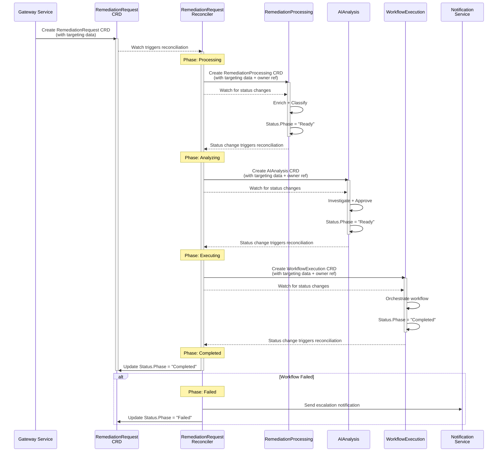
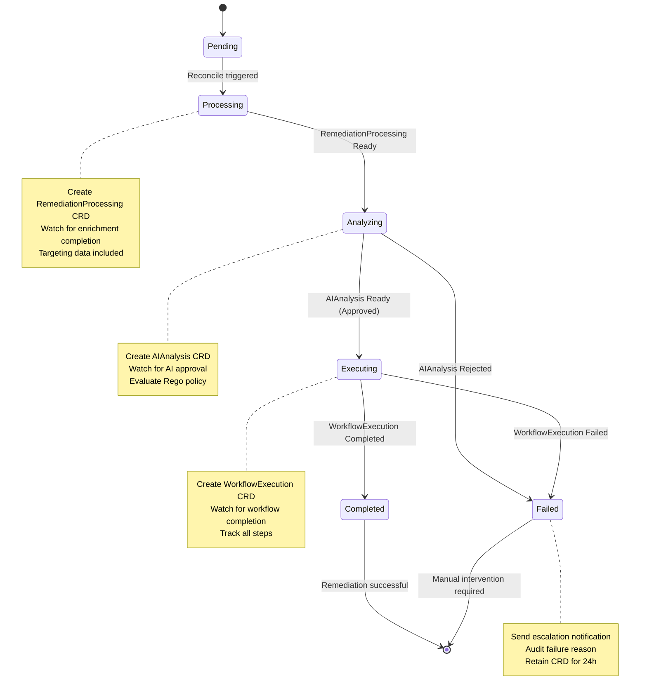
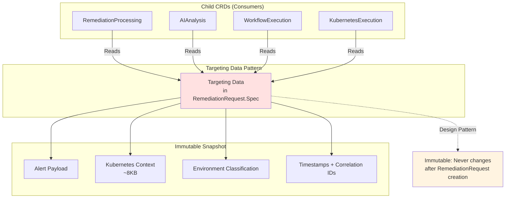

## Overview

**Purpose**: Coordinates end-to-end alert remediation workflow through watch-based state aggregation and lifecycle management.

**Core Responsibilities**:
1. **CRD Orchestration** - Create service CRDs (RemediationProcessing, AIAnalysis, WorkflowExecution, KubernetesExecution) based on phase progression
2. **Status Aggregation** - Watch all service CRD statuses and aggregate overall remediation state
3. **Lifecycle Management** - 24-hour retention with automatic cleanup and cascade deletion
4. **Timeout Management** - Detect phase timeouts and trigger escalation (BR-AP-062 (RemediationProcessor))
5. **Event Coordination** - Event-driven phase transitions via Kubernetes watches

**V1 Scope - Remediation Coordination Only**:
- Single RemediationRequest CRD per alert (created by Gateway Service)
- Watch-based event-driven coordination (no polling)
- Sequential phase CRD creation (RemediationProcessing → AIAnalysis → WorkflowExecution → KubernetesExecution)
- **V1.0 Approval Notification Triggering** (ADR-018): Watches AIAnalysis phase and creates NotificationRequest CRDs when approval is required (BR-ORCH-001), reducing approval miss rate from 40-60% to <5% and enabling $392K savings per approval-required incident
- 24-hour retention with configurable cleanup
- Per-phase timeout detection with escalation

**Future V2 Enhancements** (Out of Scope):
- Parallel remediation workflows for complex scenarios
- Cross-alert correlation and batch remediation
- ML-based timeout prediction
- Multi-cluster remediation coordination
- Advanced retry strategies with exponential backoff

**Key Architectural Decisions**:
- **Watch-based coordination** (event-driven, not polling)
- **Data snapshot pattern** - Copy complete data from service status to next service spec
- **Owner references** - All service CRDs owned by RemediationRequest for cascade deletion
- **No duplicate detection** (Gateway Service responsibility - BR-WH-008)
- **Sequential CRD creation** - One service CRD at a time based on completion
- **24-hour retention** - Configurable cleanup with review window
- **Timeout escalation** - Per-phase and overall workflow timeouts

---

## Business Requirements Coverage

**RemediationOrchestrator** implements end-to-end CRD lifecycle orchestration for alert remediation:

### V1 Scope: Remediation Orchestration (BR-AR-001 to BR-AR-067)

**Range**: BR-AR-001 to BR-AR-180
**V1 Active**: BR-AR-001 to BR-AR-067 (25 BRs total)
**V2 Reserved**: BR-AR-068 to BR-AR-180 (multi-cluster orchestration, advanced coordination)

**V1 Business Requirements Breakdown**:

#### Core Orchestration (BR-AR-001 to BR-AR-060)
**Count**: 18 BRs
**Focus**: CRD lifecycle coordination, status aggregation, and event-driven phase transitions

**Primary Functions**:
- RemediationRequest CRD creation and ownership management
- Sequential service CRD creation (RemediationProcessing → AIAnalysis → WorkflowExecution)
- Watch-based status aggregation from service CRDs
- Data snapshot pattern implementation (copy status → next spec)
- Owner reference management for cascade deletion
- 24-hour retention and automatic cleanup
- Event coordination and phase transitions

#### CRD Monitoring (BR-AR-061 to BR-AR-067)
**Count**: 7 BRs (migrated from BR-ALERT-*)
**Focus**: CRD lifecycle monitoring, timeout detection, and escalation

**Migrated BRs**:
- BR-AR-061: CRD lifecycle monitoring (was BR-ALERT-021)
- BR-AR-062: Status aggregation across CRDs (was BR-ALERT-024)
- BR-AR-063: Event coordination between controllers (was BR-ALERT-025)
- BR-AR-064: Cross-controller integration (was BR-ALERT-026)
- BR-AR-065: Workflow orchestration (was BR-ALERT-027)
- BR-AR-066: Remediation completion tracking (was BR-ALERT-028)
- BR-AR-067: Reserved for future expansion

**Note on BR-ALERT-006**: Originally shared with RemediationProcessor. Primary owner is RemediationProcessor (BR-AP-062) as it handles alert-level timeout/escalation logic. RemediationOrchestrator references BR-AP-062 when needed.

**Rationale**: BR-ALERT-* was shared between RemediationProcessor and RemediationOrchestrator. To follow single-prefix-per-service pattern, all RemediationOrchestrator BRs were migrated to BR-AR-*.

### V2 Expansion (BR-AR-068 to BR-AR-180)

**Reserved for Future**:
- Parallel remediation workflows for complex multi-issue scenarios
- Cross-alert correlation and batch remediation coordination
- ML-based timeout prediction and adaptive phase management
- Multi-cluster remediation orchestration
- Advanced retry strategies with exponential backoff
- Cross-namespace remediation coordination
- Workflow templates and reusable patterns

---

## Service Configuration

### Port Configuration
- **Port 9090**: Metrics endpoint
- **Port 8080**: Health probes (follows kube-apiserver pattern)
- **Endpoint**: `/metrics`
- **Format**: Prometheus text format
- **Authentication**: Kubernetes TokenReviewer API (validates ServiceAccount tokens)
  - **See**: [METRICS_AUTHENTICATION.md](../METRICS_AUTHENTICATION.md) for complete implementation examples

### ServiceAccount
- **Name**: `remediation-orchestrator-sa`
- **Namespace**: `kubernaut-system`
- **Purpose**: Controller authentication and authorization

### Notes
- CRD controllers do not expose REST APIs
- Health checks (`/healthz`, `/readyz`) are for Kubernetes liveness/readiness probes
- Metrics endpoint requires valid Kubernetes ServiceAccount token

---

## 📊 Visual Architecture

### Architecture Diagram
```mermaid
graph TB
    subgraph "Remediation Orchestrator (RemediationRequest Service)"
        AR[RemediationRequest CRD]
        Controller[RemediationRequestReconciler]
        StateMachine[State Machine]
        TargetingData[Targeting Data Pattern]
    end

    subgraph "Upstream"
        Gateway[Gateway Service<br/>Port 8080]
    end

    subgraph "Child CRDs (Flat Sibling Hierarchy)"
        AP[RemediationProcessing CRD]
        AIA[AIAnalysis CRD]
        WE[WorkflowExecution CRD]
    end

    subgraph "External Services"
        Notification[Notification Service<br/>Port 8080]
        DB[Data Storage Service<br/>Audit Trail]
    end

    Gateway -->|Creates| AR
    AR -->|Owns (owner ref)| AP
    AR -->|Owns (owner ref)| AIA
    AR -->|Owns (owner ref)| WE
    Controller -->|Watches| AR
    Controller -->|Create with TargetingData| AP
    Controller -->|Create with TargetingData| AIA
    Controller -->|Create with TargetingData| WE
    Controller -->|Watch Status| AP
    Controller -->|Watch Status| AIA
    Controller -->|Watch Status| WE
    Controller -->|State Transitions| StateMachine
    Controller -->|Escalate if Failed| Notification
    Controller -->|Update Status| AR
    Controller -->|Audit Trail| DB

    style AR fill:#ffe1e1
    style Controller fill:#fff4e1
    style AP fill:#e1f5ff
    style AIA fill:#e1f5ff
    style WE fill:#e1f5ff
```

### Sequence Diagram - Central Orchestration Flow


### State Machine - Central Orchestration Phases


### Targeting Data Pattern


---

## Summary

**RemediationRequest Remediation Coordinator - V1 Design Specification (100% Complete)**

### Core Purpose
Coordinates end-to-end alert remediation workflow through watch-based state aggregation, sequential service CRD creation, and 24-hour retention lifecycle management.

### Key Architectural Decisions
1. **Watch-Based Event-Driven Coordination** - Kubernetes watches trigger reconciliation on service CRD status changes (<1s latency)
2. **Sequential CRD Creation** - One service CRD at a time: RemediationProcessing → AIAnalysis → WorkflowExecution → KubernetesExecution
3. **Data Snapshot Pattern** - Copy complete data from service status to next service spec (no cross-CRD dependencies)
4. **Owner References for Cascade Deletion** - All service CRDs owned by RemediationRequest (automatic cleanup)
5. **Finalizer Pattern for 24-Hour Retention** - CRD persists for review window after completion
6. **Per-Phase Timeout Detection** - Individual service timeouts with escalation before overall workflow timeout
7. **Gateway Creates RemediationRequest Only** - RemediationRequest controller creates all service CRDs

### Integration Model
```
Gateway Service → RemediationRequest CRD (this controller)
                       ↓
        (creates & watches service CRDs)
                       ↓
    RemediationProcessing → AIAnalysis → WorkflowExecution → KubernetesExecution
         (watch)        (watch)         (watch)           (watch)
                       ↓
    Sequential phase progression based on completion events
                       ↓
          RemediationRequest.status = "completed"
                       ↓
              24-hour retention begins
```

### V1 Scope Boundaries
**Included**:
- Sequential service CRD creation with watch-based coordination
- Per-phase and overall workflow timeout detection
- 24-hour retention with automatic cleanup
- Cascade deletion via owner references
- Status aggregation from all service CRDs

**Excluded** (V2):
- Parallel remediation workflows
- Cross-alert correlation and batch remediation
- ML-based timeout prediction
- Multi-cluster remediation coordination

### Business Requirements Coverage
- **BR-AP-062 (RemediationProcessor)**: Timeout management with escalation
- **BR-AR-061**: Alert lifecycle state tracking
- **BR-AR-062**: Remediation workflow orchestration
- **BR-AR-063**: State persistence across restarts
- **BR-AR-064**: Automatic failure recovery
- **BR-AR-065**: 24-hour retention window
- **BR-AR-066**: Cascade deletion of service CRDs

### Implementation Status
- **CRD Schema**: Complete design with spec/status types
- **Controller Logic**: Complete reconciliation flow with phase orchestration
- **Watch Configuration**: Complete setup for all 4 service CRDs
- **External Integrations**: Notification Service (escalation) and Data Storage Service (audit)
- **Testing Strategy**: Unit, integration, and E2E test plans

### Next Steps
1. ✅ **Approved Design Specification** (100% complete)
2. **Kubebuilder Setup**: Install framework and generate CRD scaffolds
3. **CRD Schema Implementation**: Define API types in `api/v1/alertremediation_types.go`
4. **Controller Implementation**: Core reconciliation logic with watch-based coordination
5. **Integration Testing**: End-to-end workflow validation

### Critical Success Factors
- Watch-based coordination (no polling, <1s latency)
- Sequential CRD creation prevents premature service execution
- Data snapshot pattern ensures service independence
- Owner references enable cascade deletion
- Finalizer pattern enforces 24-hour retention
- Per-phase timeouts catch stuck services before overall timeout

**Design Specification Status**: Production-Ready (100% Confidence)

---

**🚀 Ready for implementation! This is the P0 CRITICAL foundation - implement BEFORE service CRDs.**

