## Testing Strategy

**Testing Framework Reference**: [.cursor/rules/03-testing-strategy.mdc](../../../.cursor/rules/03-testing-strategy.mdc)

### Testing Pyramid

Following Kubernaut's defense-in-depth testing strategy:

| Test Type | Target Coverage | Focus | Confidence |
|-----------|----------------|-------|------------|
| **Unit Tests** | 70%+ | Controller logic, CRD orchestration, timeout detection, status aggregation | 85-90% |
| **Integration Tests** | >50% | CRD interactions, child CRD lifecycle, cross-controller coordination | 80-85% |
| **E2E Tests** | 10-15% | Complete alert-to-resolution workflows, real cluster scenarios | 90-95% |

**Rationale**: CRD controllers require high integration test coverage (>50%) to validate Kubernetes API interactions, CRD lifecycle management, watch-based status aggregation, and cross-controller coordination patterns that cannot be adequately tested in unit tests alone. RemediationOrchestrator is the central coordinator for all remediation services, demanding thorough CRD coordination validation.

### Unit Tests (Primary Coverage Layer)

**Test Directory**: [test/unit/](../../../test/unit/)
**Service Tests**: Create `test/unit/remediation/controller_test.go`
**Coverage Target**: 70%+ of defined business requirements (BR-ORCH-001, BR-ORCH-025-034)
**Confidence**: 85-90%
**Execution**: `make test`

**Testing Strategy**: Use fake K8s client for compile-time API safety. Mock ONLY external HTTP services (Notification Service). Use REAL business logic components (orchestrator, timeout detector, phase manager).

**Rationale for Fake K8s Client**:
- ✅ **Compile-Time API Safety**: Owner reference API changes caught at build time
- ✅ **Type-Safe CRD Coordination**: All 4 child CRD schemas validated by compiler
- ✅ **Real K8s Errors**: `apierrors.IsAlreadyExists()`, `apierrors.IsNotFound()` behavior
- ✅ **Watch Pattern Testing**: Child CRD status update coordination
- ✅ **Cascade Deletion Testing**: Owner reference chain validation

**Test File Structure** (aligned with package name `alertremediation`):
```
test/unit/
├── alertremediation/                        # Matches pkg/remediation/
│   ├── controller_test.go                   # Main controller orchestration tests
│   ├── child_crd_creation_test.go           # Child CRD lifecycle tests
│   ├── phase_timeout_detection_test.go      # Timeout detection logic tests
│   ├── cascade_deletion_test.go             # Owner reference and deletion tests
│   ├── cross_crd_coordination_test.go       # Status watching and coordination tests
│   ├── escalation_logic_test.go             # Escalation trigger tests
│   └── suite_test.go                        # Ginkgo test suite setup
└── ...
```

**Migration Note**: Create new `test/unit/remediation/` directory (no legacy tests exist for this new service).

```go
package alertremediation

import (
    . "github.com/onsi/ginkgo/v2"
    . "github.com/onsi/gomega"
    "context"
    "time"

    alertremediationv1 "github.com/jordigilh/kubernaut/api/remediation/v1"
    alertprocessorv1 "github.com/jordigilh/kubernaut/api/remediationprocessing/v1"
    aianalysisv1 "github.com/jordigilh/kubernaut/api/aianalysis/v1"
    workflowexecutionv1 "github.com/jordigilh/kubernaut/api/workflowexecution/v1"
    "github.com/jordigilh/kubernaut/internal/controller/alertremediation"
    "github.com/jordigilh/kubernaut/pkg/orchestration"
    "github.com/jordigilh/kubernaut/pkg/orchestration/timeout"
    "github.com/jordigilh/kubernaut/pkg/testutil"
    "github.com/jordigilh/kubernaut/pkg/testutil/mocks"

    v1 "k8s.io/api/core/v1"
    apierrors "k8s.io/apimachinery/pkg/api/errors"
    metav1 "k8s.io/apimachinery/pkg/apis/meta/v1"
    "k8s.io/apimachinery/pkg/runtime"
    "sigs.k8s.io/controller-runtime/pkg/client"
    "sigs.k8s.io/controller-runtime/pkg/client/fake"
)

var _ = Describe("BR-ORCH-001: RemediationRequest Remediation Orchestrator", func() {
    var (
        // Fake K8s client for compile-time API safety
        fakeK8sClient      client.Client
        scheme             *runtime.Scheme

        // Mock ONLY external HTTP services
        mockNotificationService *mocks.MockNotificationService

        // Use REAL business logic components
        orchestrator       *orchestration.Orchestrator
        timeoutDetector    *timeout.Detector
        phaseManager       *orchestration.PhaseManager
        reconciler         *alertremediation.RemediationRequestReconciler
        ctx                context.Context
    )

    BeforeEach(func() {
        ctx = context.Background()

        // Comprehensive scheme: All CRD types for orchestration
        scheme = runtime.NewScheme()
        _ = v1.AddToScheme(scheme)
        _ = alertremediationv1.AddToScheme(scheme)
        _ = alertprocessorv1.AddToScheme(scheme)
        _ = aianalysisv1.AddToScheme(scheme)
        _ = workflowexecutionv1.AddToScheme(scheme)

        // Fake K8s client with compile-time API safety
        fakeK8sClient = fake.NewClientBuilder().
            WithScheme(scheme).
            Build()

        // Mock external Notification Service
        mockNotificationService = mocks.NewMockNotificationService()

        // Use REAL business logic
        timeoutDetector = timeout.NewDetector(testutil.NewTestConfig())
        phaseManager = orchestration.NewPhaseManager()
        orchestrator = orchestration.NewOrchestrator(fakeK8sClient, timeoutDetector, phaseManager)

        reconciler = &alertremediation.RemediationRequestReconciler{
            Client:              fakeK8sClient,
            Scheme:              scheme,
            Orchestrator:        orchestrator,
            TimeoutDetector:     timeoutDetector,
            PhaseManager:        phaseManager,
            NotificationService: mockNotificationService,
        }
    })

    // ✅ BEST PRACTICE: Use DescribeTable for child CRD creation scenarios (supports BR-ORCH-025)
    Context("Child CRD Creation Phase (supports BR-ORCH-025)", func() {
        DescribeTable("child CRD creation with correct owner references",
            func(parentName string, childType string, expectedPhase string, preExistingChild bool) {
                // Setup RemediationRequest parent CRD
                ar := testutil.NewRemediationRequest(parentName, "kubernaut-system")
                ar.Spec.AlertData = alertremediationv1.AlertData{
                    Fingerprint: "alert-fingerprint-abc123",
                    Namespace:   "production",
                    Severity:    "critical",
                }

                if preExistingChild {
                    // Pre-create child CRD to test idempotency
                    child := testutil.NewChildCRD(childType, "pre-existing-"+childType, "kubernaut-system")
                    child.OwnerReferences = testutil.NewOwnerReference(ar)
                    Expect(fakeK8sClient.Create(ctx, child)).To(Succeed())
                }

                Expect(fakeK8sClient.Create(ctx, ar)).To(Succeed())
                result, err := reconciler.Reconcile(ctx, testutil.NewReconcileRequest(ar))

                Expect(err).ToNot(HaveOccurred())
                Expect(result.Requeue).To(BeTrue(), "should requeue to watch child status")
                Expect(ar.Status.Phase).To(Equal(expectedPhase))

                // Verify child CRD exists with correct owner reference
                childList := testutil.ListChildCRDs(fakeK8sClient, childType, "kubernaut-system")
                Expect(childList).To(HaveLen(1))
                Expect(childList[0].OwnerReferences).To(HaveLen(1))
                Expect(childList[0].OwnerReferences[0].Kind).To(Equal("RemediationRequest"))
                Expect(*childList[0].OwnerReferences[0].Controller).To(BeTrue())
            },
            // SignalProcessing child CRD creation scenarios
            Entry("creates SignalProcessing CRD for new remediation",
                "test-new-sp", "SignalProcessing", "processing", false),
            Entry("reuses existing SignalProcessing CRD (idempotency)",
                "test-existing-sp", "SignalProcessing", "processing", true),

            // AIAnalysis child CRD creation scenarios
            Entry("creates AIAnalysis CRD after SignalProcessing completes",
                "test-new-ai", "AIAnalysis", "analyzing", false),
            Entry("reuses existing AIAnalysis CRD (idempotency)",
                "test-existing-ai", "AIAnalysis", "analyzing", true),

            // WorkflowExecution child CRD creation scenarios
            Entry("creates WorkflowExecution CRD after AIAnalysis completes",
                "test-new-we", "WorkflowExecution", "executing", false),
            Entry("reuses existing WorkflowExecution CRD (idempotency)",
                "test-existing-we", "WorkflowExecution", "executing", true),
        )

        DescribeTable("child CRD status watch triggers phase transitions",
            func(currentPhase string, childType string, childStatus string, expectedPhase string, shouldCaptureResults bool) {
                ar := testutil.NewRemediationRequest("test-watch-"+childType, "kubernaut-system")
                ar.Status.Phase = currentPhase
                testutil.SetChildCRDRef(ar, childType, childType+"-test-123")

                // Create child CRD with specified status
                child := testutil.NewChildCRDWithStatus(childType, childType+"-test-123", "kubernaut-system", childStatus)
                Expect(fakeK8sClient.Create(ctx, child)).To(Succeed())
                Expect(fakeK8sClient.Create(ctx, ar)).To(Succeed())

                result, err := reconciler.Reconcile(ctx, testutil.NewReconcileRequest(ar))

                Expect(err).ToNot(HaveOccurred())
                Expect(result.Requeue).To(BeTrue())
                Expect(ar.Status.Phase).To(Equal(expectedPhase))

                if shouldCaptureResults {
                    Expect(testutil.GetPhaseResults(ar, childType)).ToNot(BeNil())
                }
            },
            // SignalProcessing → analyzing transitions
            Entry("SignalProcessing completed triggers analyzing phase",
                "processing", "SignalProcessing", "completed", "analyzing", true),
            Entry("SignalProcessing failed triggers failed phase",
                "processing", "SignalProcessing", "failed", "failed", false),

            // AIAnalysis → executing transitions (BR-ORCH-026)
            Entry("AIAnalysis approved triggers executing phase",
                "analyzing", "AIAnalysis", "approved", "executing", true),
            Entry("AIAnalysis requires_approval triggers approval notification (BR-ORCH-001)",
                "analyzing", "AIAnalysis", "requires_approval", "awaiting_approval", false),
            Entry("AIAnalysis failed triggers failed phase",
                "analyzing", "AIAnalysis", "failed", "failed", false),

            // WorkflowExecution → completed transitions
            Entry("WorkflowExecution succeeded triggers completed phase",
                "executing", "WorkflowExecution", "succeeded", "completed", true),
            Entry("WorkflowExecution skipped triggers skipped phase (BR-ORCH-032)",
                "executing", "WorkflowExecution", "skipped", "skipped", false),
            Entry("WorkflowExecution failed triggers failed phase",
                "executing", "WorkflowExecution", "failed", "failed", false),
        )
    })

    // ✅ BEST PRACTICE: Use DescribeTable for approval notification scenarios (BR-ORCH-001)
    Context("Approval Notification Creation (BR-ORCH-001)", func() {
        DescribeTable("creates NotificationRequest when approval is required",
            func(approvalReason string, urgency string, expectedChannels []string) {
                ar := testutil.NewRemediationRequest("test-approval-"+approvalReason, "kubernaut-system")
                ar.Status.Phase = "analyzing"
                ar.Status.ChildCRDs.AIAnalysis = "ai-requires-approval"

                // Create AIAnalysis requiring approval
                ai := testutil.NewAIAnalysisRequiringApproval("ai-requires-approval", "kubernaut-system", approvalReason)
                Expect(fakeK8sClient.Create(ctx, ai)).To(Succeed())
                Expect(fakeK8sClient.Create(ctx, ar)).To(Succeed())

                result, err := reconciler.Reconcile(ctx, testutil.NewReconcileRequest(ar))

                Expect(err).ToNot(HaveOccurred())
                Expect(result.Requeue).To(BeTrue())
                Expect(ar.Status.Phase).To(Equal("awaiting_approval"))

                // Verify NotificationRequest CRD was created
                nrList := testutil.ListNotificationRequests(fakeK8sClient, "kubernaut-system")
                Expect(nrList).To(HaveLen(1))
                Expect(nrList[0].Spec.NotificationType).To(Equal("approval_required"))
                Expect(nrList[0].Spec.Channels).To(ContainElements(expectedChannels))
            },
            Entry("high_risk_action requires approval via all channels",
                "high_risk_action", "high", []string{"slack", "email", "pagerduty"}),
            Entry("production_environment requires approval via slack and email",
                "production_environment", "medium", []string{"slack", "email"}),
            Entry("policy_required requires approval via slack",
                "policy_required", "low", []string{"slack"}),
        )
    })

    // ✅ BEST PRACTICE: Use DescribeTable for workflow execution scenarios (BR-ORCH-025, BR-ORCH-032)
    Context("WorkflowExecution Phase (supports BR-ORCH-025, BR-ORCH-032)", func() {
        DescribeTable("WorkflowExecution outcome handling",
            func(weStatus string, expectedPhase string, shouldCreateNotification bool, notificationType string) {
                ar := testutil.NewRemediationRequest("test-we-"+weStatus, "kubernaut-system")
                ar.Status.Phase = "executing"
                ar.Status.ChildCRDs.WorkflowExecution = "we-test-123"

                // Create WorkflowExecution with specified status
                we := testutil.NewWorkflowExecutionWithStatus("we-test-123", "kubernaut-system", weStatus)
                Expect(fakeK8sClient.Create(ctx, we)).To(Succeed())
                Expect(fakeK8sClient.Create(ctx, ar)).To(Succeed())

                result, err := reconciler.Reconcile(ctx, testutil.NewReconcileRequest(ar))

                Expect(err).ToNot(HaveOccurred())
                Expect(result.Requeue).To(BeFalse()) // Terminal state
                Expect(ar.Status.Phase).To(Equal(expectedPhase))

                // Verify notification creation if expected
                nrList := testutil.ListNotificationRequests(fakeK8sClient, "kubernaut-system")
                if shouldCreateNotification {
                    Expect(nrList).To(HaveLen(1))
                    Expect(nrList[0].Spec.NotificationType).To(Equal(notificationType))
                } else {
                    Expect(nrList).To(HaveLen(0))
                }
            },
            Entry("succeeded workflow completes remediation",
                "succeeded", "completed", true, "remediation_completed"),
            Entry("failed workflow marks remediation as failed",
                "failed", "failed", true, "remediation_failed"),
            Entry("skipped workflow marks remediation as skipped (BR-ORCH-032)",
                "skipped", "skipped", false, ""), // Bulk notification handled by parent
        )

        DescribeTable("WorkflowExecution Skipped phase handling (BR-ORCH-032, BR-ORCH-033)",
            func(skipReason string, shouldTrackDuplicate bool, expectedDuplicateOf string) {
                ar := testutil.NewRemediationRequest("test-skipped-"+skipReason, "kubernaut-system")
                ar.Status.Phase = "executing"
                ar.Status.ChildCRDs.WorkflowExecution = "we-skipped-123"

                // Create skipped WorkflowExecution with specific reason
                we := testutil.NewSkippedWorkflowExecution("we-skipped-123", "kubernaut-system", skipReason, expectedDuplicateOf)
                Expect(fakeK8sClient.Create(ctx, we)).To(Succeed())
                Expect(fakeK8sClient.Create(ctx, ar)).To(Succeed())

                result, err := reconciler.Reconcile(ctx, testutil.NewReconcileRequest(ar))

                Expect(err).ToNot(HaveOccurred())
                Expect(ar.Status.Phase).To(Equal("skipped"))
                Expect(ar.Status.SkipReason).To(Equal(skipReason))

                if shouldTrackDuplicate {
                    Expect(ar.Status.DuplicateOf).To(Equal(expectedDuplicateOf))
                }
            },
            Entry("ResourceBusy tracks duplicate of active remediation",
                "ResourceBusy", true, "active-remediation-001"),
            Entry("RecentlyRemediated tracks duplicate of recent remediation",
                "RecentlyRemediated", true, "recent-remediation-002"),
        )
    })

    // ✅ BEST PRACTICE: Use DescribeTable for timeout detection scenarios (BR-ORCH-027, BR-ORCH-028)
    Context("Phase Timeout Detection (BR-ORCH-027, BR-ORCH-028)", func() {
        DescribeTable("per-phase timeout detection and escalation",
            func(phase string, childType string, childStatus string, timeoutDuration time.Duration, elapsedTime time.Duration, shouldTimeout bool) {
                ar := testutil.NewRemediationRequest("test-timeout-"+phase, "kubernaut-system")
                ar.Spec.PhaseTimeouts = testutil.NewPhaseTimeouts(phase, timeoutDuration)
                ar.Status.Phase = phase
                ar.Status.PhaseStartTime = metav1.NewTime(time.Now().Add(-elapsedTime))
                testutil.SetChildCRDRef(ar, childType, childType+"-stuck-123")

                // Create stuck child CRD (not completed)
                child := testutil.NewChildCRDWithStatus(childType, childType+"-stuck-123", "kubernaut-system", childStatus)
                Expect(fakeK8sClient.Create(ctx, child)).To(Succeed())
                Expect(fakeK8sClient.Create(ctx, ar)).To(Succeed())

                if shouldTimeout {
                    mockNotificationService.On("SendEscalation", ctx, testutil.MatchNotification()).Return(nil)
                }

                result, err := reconciler.Reconcile(ctx, testutil.NewReconcileRequest(ar))

                Expect(err).ToNot(HaveOccurred())
                if shouldTimeout {
                    Expect(ar.Status.Phase).To(Equal("timed_out"))
                    Expect(ar.Status.TimeoutPhase).To(Equal(phase))
                    mockNotificationService.AssertCalled(GinkgoT(), "SendEscalation", ctx, testutil.MatchNotification())
                } else {
                    Expect(ar.Status.Phase).To(Equal(phase)) // No change
                }
            },
            // Processing phase timeout scenarios (BR-ORCH-028)
            Entry("processing phase times out after 60s",
                "processing", "SignalProcessing", "enriching", 60*time.Second, 90*time.Second, true),
            Entry("processing phase does not timeout before deadline",
                "processing", "SignalProcessing", "enriching", 60*time.Second, 30*time.Second, false),

            // Analyzing phase timeout scenarios (BR-ORCH-028)
            Entry("analyzing phase times out after 120s",
                "analyzing", "AIAnalysis", "investigating", 120*time.Second, 180*time.Second, true),
            Entry("analyzing phase does not timeout before deadline",
                "analyzing", "AIAnalysis", "investigating", 120*time.Second, 60*time.Second, false),

            // Executing phase timeout scenarios (BR-ORCH-028)
            Entry("executing phase times out after 300s",
                "executing", "WorkflowExecution", "running", 300*time.Second, 400*time.Second, true),
            Entry("executing phase does not timeout before deadline",
                "executing", "WorkflowExecution", "running", 300*time.Second, 100*time.Second, false),
        )

        DescribeTable("global remediation timeout (BR-ORCH-027)",
            func(globalTimeout time.Duration, elapsedTime time.Duration, shouldTimeout bool) {
                ar := testutil.NewRemediationRequest("test-global-timeout", "kubernaut-system")
                ar.Spec.GlobalTimeout = globalTimeout
                ar.Status.Phase = "executing"
                ar.ObjectMeta.CreationTimestamp = metav1.NewTime(time.Now().Add(-elapsedTime))

                Expect(fakeK8sClient.Create(ctx, ar)).To(Succeed())

                if shouldTimeout {
                    mockNotificationService.On("SendEscalation", ctx, testutil.MatchNotification()).Return(nil)
                }

                result, err := reconciler.Reconcile(ctx, testutil.NewReconcileRequest(ar))

                Expect(err).ToNot(HaveOccurred())
                if shouldTimeout {
                    Expect(ar.Status.Phase).To(Equal("timed_out"))
                    Expect(ar.Status.TimeoutPhase).To(Equal("global"))
                }
            },
            Entry("global timeout at 15 minutes exceeded",
                15*time.Minute, 20*time.Minute, true),
            Entry("global timeout at 15 minutes not exceeded",
                15*time.Minute, 10*time.Minute, false),
        )
    })

    // ✅ BEST PRACTICE: Use DescribeTable for cascade deletion scenarios (BR-ORCH-031)
    Context("Cascade Deletion (supports BR-ORCH-031)", func() {
        DescribeTable("cascade deletion cleans up all child CRDs",
            func(childCRDs []string, expectedDeleteCount int) {
                ar := testutil.NewRemediationRequest("test-cascade-delete", "kubernaut-system")

                // Create child CRDs with owner references
                for _, childName := range childCRDs {
                    child := testutil.NewChildCRDWithOwner(childName, "kubernaut-system", ar)
                    Expect(fakeK8sClient.Create(ctx, child)).To(Succeed())
                }
                Expect(fakeK8sClient.Create(ctx, ar)).To(Succeed())

                // Delete parent RemediationRequest
                Expect(fakeK8sClient.Delete(ctx, ar)).To(Succeed())

                // Verify children are marked for deletion (Kubernetes garbage collection)
                for _, childName := range childCRDs {
                    child := testutil.GetChildCRD(fakeK8sClient, childName, "kubernaut-system")
                    Expect(child == nil || child.GetDeletionTimestamp() != nil).To(BeTrue())
                }
            },
            Entry("deletes all 3 child CRDs",
                []string{"sp-child-123", "ai-child-456", "we-child-789"}, 3),
            Entry("deletes partial child CRDs (only SignalProcessing created)",
                []string{"sp-child-only"}, 1),
            Entry("handles no child CRDs gracefully",
                []string{}, 0),
        )

        DescribeTable("finalizer cleanup removes all children (BR-ORCH-031)",
            func(finalizerName string, childCount int) {
                ar := testutil.NewRemediationRequest("test-finalizer-cleanup", "kubernaut-system")
                ar.Finalizers = []string{finalizerName}

                // Create child CRDs based on count
                childCRDs := testutil.CreateChildCRDsForParent(fakeK8sClient, ar, childCount)
                Expect(fakeK8sClient.Create(ctx, ar)).To(Succeed())

                // Set DeletionTimestamp to trigger finalizer
                ar.DeletionTimestamp = &metav1.Time{Time: time.Now()}
                Expect(fakeK8sClient.Update(ctx, ar)).To(Succeed())

                result, err := reconciler.Reconcile(ctx, testutil.NewReconcileRequest(ar))

                Expect(err).ToNot(HaveOccurred())

                // Verify finalizer removed after cleanup
                updatedAR := &alertremediationv1.RemediationRequest{}
                Expect(fakeK8sClient.Get(ctx, client.ObjectKeyFromObject(ar), updatedAR)).To(Succeed())
                Expect(updatedAR.Finalizers).To(BeEmpty())
            },
            Entry("removes finalizer with all 3 children",
                "remediation.kubernaut.ai/alertremediation-cleanup", 3),
            Entry("removes finalizer with partial children",
                "remediation.kubernaut.ai/alertremediation-cleanup", 1),
            Entry("removes finalizer with no children",
                "remediation.kubernaut.ai/alertremediation-cleanup", 0),
        )
    })

    // ✅ BEST PRACTICE: Use DescribeTable for performance testing scenarios
    Context("Performance and Metrics", func() {
        DescribeTable("performance targets for reconciliation phases",
            func(phase string, maxDuration time.Duration) {
                ar := testutil.NewRemediationRequest("perf-test-"+phase, "kubernaut-system")
                ar.Status.Phase = phase

                startTime := time.Now()
                result, err := reconciler.Reconcile(ctx, testutil.NewReconcileRequest(ar))
                elapsed := time.Since(startTime)

                Expect(err).ToNot(HaveOccurred())
                Expect(elapsed).To(BeNumerically("<", maxDuration), "phase %s exceeded performance target", phase)
            },
            Entry("pending phase reconciliation < 500ms", "pending", 500*time.Millisecond),
            Entry("processing phase reconciliation < 500ms", "processing", 500*time.Millisecond),
            Entry("analyzing phase reconciliation < 500ms", "analyzing", 500*time.Millisecond),
            Entry("executing phase reconciliation < 500ms", "executing", 500*time.Millisecond),
        )
                    ap.Status.Phase = "completed"
                    fakeK8sClient.Create(ctx, ap)
                case "analyzing":
                    ai := testutil.NewAIAnalysis(ar.Status.ChildCRDs.AIAnalysis, "kubernaut-system")
                    ai.Status.Phase = "approved"
                    fakeK8sClient.Create(ctx, ai)
                case "executing":
                    wf := testutil.NewWorkflowExecution(ar.Status.ChildCRDs.WorkflowExecution, "kubernaut-system")
                    wf.Status.Phase = "completed"
                    wf.Status.ExecutionResults = &workflowexecutionv1.ExecutionResults{Success: true}
                    fakeK8sClient.Create(ctx, wf)
                }

                _, err := reconciler.Reconcile(ctx, testutil.NewReconcileRequest(ar))
                Expect(err).ToNot(HaveOccurred())

                fakeK8sClient.Get(ctx, client.ObjectKeyFromObject(ar), ar)
            }

            endToEndDuration := time.Since(startTime)

            // Validate performance target: P95 < 180s (aim for much faster in unit tests)
            Expect(endToEndDuration).To(BeNumerically("<", 10*time.Second))
            Expect(ar.Status.Phase).To(Equal("completed"))
        })
    })
})
```

### Integration Tests (Component Interaction Layer)

**Test Directory**: [test/integration/](../../../test/integration/)
**Service Tests**: Create `test/integration/remediation/integration_test.go`
**Coverage Target**: 60% of business requirements (highest overlap for defense-in-depth)
**Confidence**: 80-85%
**Execution**: `make test-integration-kind` (local) or `make test-integration-kind-ci` (CI)

**Strategy**: Test real child CRD lifecycle, actual K8s watches, and cross-controller coordination with live K8s API.

**Test File Structure** (aligned with package name `alertremediation`):
```
test/integration/
├── alertremediation/                        # Matches pkg/remediation/
│   ├── integration_test.go                  # Real child CRD coordination tests
│   ├── cross_controller_coordination_test.go  # Multi-controller interaction tests
│   ├── real_cascade_deletion_test.go        # Real owner reference deletion tests
│   ├── phase_timeout_real_test.go           # Real timeout detection with live watches
│   └── suite_test.go                        # Integration test suite setup
└── ...
```

**Migration Note**: Create new `test/integration/remediation/` directory (no legacy tests exist).

```go
package alertremediation_test

import (
    . "github.com/onsi/ginkgo/v2"
    . "github.com/onsi/gomega"
    "context"

    alertremediationv1 "github.com/jordigilh/kubernaut/api/remediation/v1"
    alertprocessorv1 "github.com/jordigilh/kubernaut/api/remediationprocessing/v1"
    aianalysisv1 "github.com/jordigilh/kubernaut/api/aianalysis/v1"
    workflowexecutionv1 "github.com/jordigilh/kubernaut/api/workflowexecution/v1"
    "github.com/jordigilh/kubernaut/pkg/testutil"

    apierrors "k8s.io/apimachinery/pkg/api/errors"
    "sigs.k8s.io/controller-runtime/pkg/client"
)

var _ = Describe("BR-INTEGRATION-AR-001: RemediationRequest Orchestration Integration", func() {
    var (
        k8sClient client.Client
        ctx       context.Context
        namespace string
    )

    BeforeEach(func() {
        ctx = context.Background()
        namespace = testutil.CreateTestNamespace(k8sClient)
    })

    AfterEach(func() {
        testutil.CleanupNamespace(k8sClient, namespace)
    })

    It("should orchestrate complete remediation with all 4 child CRDs", func() {
        // Create RemediationRequest parent CRD
        ar := testutil.NewRemediationRequest("integration-full-flow", namespace)
        ar.Spec.AlertData.Fingerprint = "integration-test-abc123"
        ar.Spec.RemediationConfig.AutoRemediate = true
        Expect(k8sClient.Create(ctx, ar)).To(Succeed())

        // Wait for RemediationProcessing child CRD creation
        Eventually(func() bool {
            k8sClient.Get(ctx, client.ObjectKeyFromObject(ar), ar)
            return ar.Status.ChildCRDs.RemediationProcessing != ""
        }, "30s", "1s").Should(BeTrue())

        // Verify SignalProcessing CRD created with owner reference
        apName := ar.Status.ChildCRDs.RemediationProcessing
        ap := &alertprocessorv1.RemediationProcessing{}
        Expect(k8sClient.Get(ctx, client.ObjectKey{Name: apName, Namespace: namespace}, ap)).To(Succeed())
        Expect(ap.OwnerReferences).To(HaveLen(1))
        Expect(ap.OwnerReferences[0].Name).To(Equal(ar.Name))

        // Simulate RemediationProcessing completion
        ap.Status.Phase = "completed"
        ap.Status.EnvironmentClassification = alertprocessorv1.EnvironmentClassification{
            Environment: "production",
            Confidence:  0.95,
        }
        Expect(k8sClient.Status().Update(ctx, ap)).To(Succeed())

        // Wait for AIAnalysis child CRD creation
        Eventually(func() bool {
            k8sClient.Get(ctx, client.ObjectKeyFromObject(ar), ar)
            return ar.Status.ChildCRDs.AIAnalysis != ""
        }, "30s", "1s").Should(BeTrue())

        // Verify AIAnalysis CRD created
        aiName := ar.Status.ChildCRDs.AIAnalysis
        ai := &aianalysisv1.AIAnalysis{}
        Expect(k8sClient.Get(ctx, client.ObjectKey{Name: aiName, Namespace: namespace}, ai)).To(Succeed())

        // Simulate AIAnalysis approval
        ai.Status.Phase = "approved"
        ai.Status.ApprovalDecision = &aianalysisv1.ApprovalDecision{
            ApprovalStatus: "approved",
            AutoApproved:   true,
        }
        ai.Status.InvestigationResults = &aianalysisv1.InvestigationResults{
            RootCause:  "Memory limit insufficient",
            Confidence: 0.88,
            RecommendedActions: []aianalysisv1.Action{
                {Type: "update-resource-limits", Confidence: 0.92},
            },
        }
        Expect(k8sClient.Status().Update(ctx, ai)).To(Succeed())

        // Wait for WorkflowExecution child CRD creation
        Eventually(func() bool {
            k8sClient.Get(ctx, client.ObjectKeyFromObject(ar), ar)
            return ar.Status.ChildCRDs.WorkflowExecution != ""
        }, "30s", "1s").Should(BeTrue())

        // Verify WorkflowExecution CRD created
        wfName := ar.Status.ChildCRDs.WorkflowExecution
        wf := &workflowexecutionv1.WorkflowExecution{}
        Expect(k8sClient.Get(ctx, client.ObjectKey{Name: wfName, Namespace: namespace}, wf)).To(Succeed())

        // Simulate WorkflowExecution completion
        wf.Status.Phase = "completed"
        wf.Status.ExecutionResults = &workflowexecutionv1.ExecutionResults{
            Success:        true,
            StepsCompleted: 1,
            StepsTotal:     1,
        }
        Expect(k8sClient.Status().Update(ctx, wf)).To(Succeed())

        // Wait for RemediationRequest to reach completed state
        Eventually(func() string {
            k8sClient.Get(ctx, client.ObjectKeyFromObject(ar), ar)
            return ar.Status.Phase
        }, "60s", "2s").Should(Equal("completed"))

        // Validate end-to-end orchestration
        Expect(ar.Status.ProcessingPhaseResults).ToNot(BeNil())
        Expect(ar.Status.AnalysisPhaseResults).ToNot(BeNil())
        Expect(ar.Status.ExecutionPhaseResults).ToNot(BeNil())
        Expect(ar.Status.EndToEndTime).ToNot(BeEmpty())
    })

    It("BR-INTEGRATION-AR-002: should handle real cascade deletion of all children", func() {
        // Create RemediationRequest with child CRDs
        ar := testutil.NewRemediationRequest("integration-cascade", namespace)
        Expect(k8sClient.Create(ctx, ar)).To(Succeed())

        // Wait for at least RemediationProcessing child to be created
        Eventually(func() bool {
            k8sClient.Get(ctx, client.ObjectKeyFromObject(ar), ar)
            return ar.Status.ChildCRDs.RemediationProcessing != ""
        }, "30s", "1s").Should(BeTrue())

        apName := ar.Status.ChildCRDs.RemediationProcessing

        // Delete parent RemediationRequest
        Expect(k8sClient.Delete(ctx, ar)).To(Succeed())

        // Kubernetes garbage collection should delete children automatically
        Eventually(func() bool {
            ap := &alertprocessorv1.RemediationProcessing{}
            err := k8sClient.Get(ctx, client.ObjectKey{Name: apName, Namespace: namespace}, ap)
            return apierrors.IsNotFound(err)
        }, "30s", "1s").Should(BeTrue())
    })
})
```

### E2E Tests (End-to-End Workflow Layer)

**Test Directory**: [test/e2e/](../../../test/e2e/)
**Service Tests**: Create `test/e2e/alertremediation/e2e_test.go`
**Coverage Target**: 9% of critical business workflows
**Confidence**: 90-95%
**Execution**: `make test-e2e-kind` (KIND) or `make test-e2e-ocp` (Kubernetes)

**Test File Structure** (aligned with package name `alertremediation`):
```
test/e2e/
├── alertremediation/                        # Matches pkg/remediation/
│   ├── e2e_test.go                          # End-to-end remediation workflows
│   ├── complete_auto_remediation_test.go    # Full auto-remediation flow
│   ├── manual_approval_flow_test.go         # Manual approval workflow
│   ├── escalation_flow_test.go              # Timeout/failure escalation
│   └── suite_test.go                        # E2E test suite setup
└── ...
```

**Migration Note**: Create new `test/e2e/alertremediation/` directory (no legacy tests exist).

```go
package alertremediation_test

import (
    . "github.com/onsi/ginkgo/v2"
    . "github.com/onsi/gomega"
    "context"
    "time"

    alertremediationv1 "github.com/jordigilh/kubernaut/api/remediation/v1"
    workflowexecutionv1 "github.com/jordigilh/kubernaut/api/workflowexecution/v1"
    "github.com/jordigilh/kubernaut/pkg/testutil"

    appsv1 "k8s.io/api/apps/v1"
    "sigs.k8s.io/controller-runtime/pkg/client"
)

var _ = Describe("BR-E2E-AR-001: Complete Auto-Remediation Workflow", func() {
    It("should execute full alert-to-resolution pipeline", func() {
        // Send Prometheus alert webhook
        alertPayload := testutil.NewPrometheusAlert("HighMemoryUsage", "production")
        response := testutil.SendWebhookAlert(gatewayURL, alertPayload)
        Expect(response.StatusCode).To(Equal(200))

        // Wait for RemediationRequest CRD creation (by Gateway Service)
        var ar *alertremediationv1.RemediationRequest
        Eventually(func() bool {
            arList := &alertremediationv1.RemediationRequestList{}
            k8sClient.List(ctx, arList, client.MatchingLabels{
                "alert-fingerprint": alertPayload.Fingerprint,
            })
            if len(arList.Items) > 0 {
                ar = &arList.Items[0]
                return true
            }
            return false
        }, "120s", "5s").Should(BeTrue())

        // Wait for complete remediation pipeline:
        // RemediationRequest → RemediationProcessing → AIAnalysis → WorkflowExecution → KubernetesExecution (DEPRECATED - ADR-025) → Completed
        Eventually(func() string {
            k8sClient.Get(ctx, client.ObjectKeyFromObject(ar), ar)
            return ar.Status.Phase
        }, "300s", "10s").Should(Equal("completed"))

        // Validate end-to-end business outcome
        Expect(ar.Status.ProcessingPhaseResults).ToNot(BeNil())
        Expect(ar.Status.AnalysisPhaseResults).ToNot(BeNil())
        Expect(ar.Status.ExecutionPhaseResults).ToNot(BeNil())
        Expect(ar.Status.ExecutionPhaseResults.Success).To(BeTrue())

        // Verify all child CRDs were created and completed
        Expect(ar.Status.ChildCRDs.RemediationProcessing).ToNot(BeEmpty())
        Expect(ar.Status.ChildCRDs.AIAnalysis).ToNot(BeEmpty())
        Expect(ar.Status.ChildCRDs.WorkflowExecution).ToNot(BeEmpty())

        // Verify alert was actually resolved (cluster state changed)
        // Check that remediation action was applied (e.g., pod restarted, deployment scaled)
    })

    It("BR-E2E-AR-002: should handle manual approval workflow", func() {
        // Send alert requiring manual approval
        alertPayload := testutil.NewPrometheusAlert("CriticalDatabaseIssue", "production")
        response := testutil.SendWebhookAlert(gatewayURL, alertPayload)
        Expect(response.StatusCode).To(Equal(200))

        // Wait for RemediationRequest to reach awaiting-approval state
        var ar *alertremediationv1.RemediationRequest
        Eventually(func() string {
            arList := &alertremediationv1.RemediationRequestList{}
            k8sClient.List(ctx, arList, client.MatchingLabels{
                "alert-fingerprint": alertPayload.Fingerprint,
            })
            if len(arList.Items) > 0 {
                ar = &arList.Items[0]
                return ar.Status.Phase
            }
            return ""
        }, "120s", "5s").Should(Equal("awaiting-approval"))

        // Simulate operator approval via AIApprovalRequest CRD
        approvalReq := testutil.GetAIApprovalRequest(k8sClient, ar.Status.ChildCRDs.AIAnalysis)
        approvalReq.Status.ApprovalStatus = "approved"
        approvalReq.Status.ApprovedBy = "admin@example.com"
        Expect(k8sClient.Status().Update(ctx, approvalReq)).To(Succeed())

        // Wait for remediation to continue and complete
        Eventually(func() string {
            k8sClient.Get(ctx, client.ObjectKeyFromObject(ar), ar)
            return ar.Status.Phase
        }, "300s", "10s").Should(Equal("completed"))

        // Verify approval decision recorded
        Expect(ar.Status.AnalysisPhaseResults.ApprovalStatus).To(Equal("approved"))
        Expect(ar.Status.AnalysisPhaseResults.ApprovedBy).To(Equal("admin@example.com"))
    })

    It("BR-E2E-AR-003: should escalate on timeout", func() {
        // Send alert
        alertPayload := testutil.NewPrometheusAlert("ServiceDown", "production")
        response := testutil.SendWebhookAlert(gatewayURL, alertPayload)
        Expect(response.StatusCode).To(Equal(200))

        // Set short phase timeout for testing
        var ar *alertremediationv1.RemediationRequest
        Eventually(func() bool {
            arList := &alertremediationv1.RemediationRequestList{}
            k8sClient.List(ctx, arList, client.MatchingLabels{
                "alert-fingerprint": alertPayload.Fingerprint,
            })
            if len(arList.Items) > 0 {
                ar = &arList.Items[0]
                return true
            }
            return false
        }, "60s", "2s").Should(BeTrue())

        // Override timeout for testing
        ar.Spec.PhaseTimeouts.Processing = 10 * time.Second
        Expect(k8sClient.Update(ctx, ar)).To(Succeed())

        // Intentionally leave RemediationProcessing stuck (don't complete it)

        // Wait for timeout detection and escalation
        Eventually(func() string {
            k8sClient.Get(ctx, client.ObjectKeyFromObject(ar), ar)
            return ar.Status.Phase
        }, "60s", "5s").Should(Equal("escalated"))

        // Verify escalation notification sent
        Expect(ar.Status.EscalationReason).To(ContainSubstring("phase timeout"))
    })
})
```

### Test Coverage Requirements

**Business Requirement Mapping** (11 defined BRs):
- **BR-ORCH-001**: Approval notification creation (Unit + Integration)
- **BR-ORCH-025, BR-ORCH-026**: Workflow data pass-through, approval orchestration (Unit + Integration)
- **BR-ORCH-027, BR-ORCH-028**: Global and per-phase timeout management (Unit + Integration)
- **BR-ORCH-029, BR-ORCH-030, BR-ORCH-031**: Notification handling, cascade cleanup (Unit + Integration)
- **BR-ORCH-032, BR-ORCH-033, BR-ORCH-034**: WE Skipped phase handling, duplicate tracking (Unit + Integration + E2E)

### Mock Usage Decision Matrix

| Component | Unit Tests | Integration | E2E | Justification |
|-----------|------------|-------------|-----|---------------|
| **Kubernetes API** | **FAKE K8S CLIENT** (`sigs.k8s.io/controller-runtime/pkg/client/fake`) | REAL (KIND) | REAL (OCP/KIND) | Compile-time API safety, all 4 child CRD types validated, owner reference testing |
| **Child CRDs (4 types)** | **FAKE K8S CLIENT** | REAL | REAL | Type-safe coordination, watch pattern testing |
| **Notification Service HTTP** | **CUSTOM MOCK** (`pkg/testutil/mocks`) | REAL | REAL | External HTTP service dependency |
| **Orchestrator** | REAL | REAL | REAL | Core business logic |
| **Timeout Detector** | REAL | REAL | REAL | Critical safety logic |
| **Phase Manager** | REAL | REAL | REAL | Orchestration business logic |
| **Metrics Recording** | REAL | REAL | REAL | Business observability |

**Terminology**:
- **FAKE K8S CLIENT**: In-memory K8s API server (`fake.NewClientBuilder()`) - provides compile-time type safety for all CRD types
- **CUSTOM MOCK**: Test doubles from `pkg/testutil/mocks` for external HTTP services
- **REAL**: Actual implementation (business logic or live external service)

### Anti-Patterns to AVOID

**❌ NULL-TESTING** (Forbidden):
```go
// BAD: Weak assertions
Expect(ar.Status.ChildCRDs).ToNot(BeNil())
Expect(childCRDs).To(HaveLen(3))
```

**✅ BUSINESS OUTCOME TESTING** (Required):
```go
// GOOD: Business-meaningful validations
Expect(ar.Status.ChildCRDs.RemediationProcessing).To(Equal("ap-test-123"))
Expect(ar.Status.Phase).To(Equal("analyzing"))
Expect(ar.Status.ProcessingPhaseResults.Environment).To(Equal("production"))
```

**❌ IMPLEMENTATION TESTING** (Forbidden):
```go
// BAD: Testing internal implementation
Expect(reconciler.childCRDCreateCount).To(Equal(3))
```

**✅ BEHAVIOR TESTING** (Required):
```go
// GOOD: Testing business behavior
Expect(ar.Status.Phase).To(Equal("completed"))
Expect(ar.Status.ExecutionPhaseResults.Success).To(BeTrue())
Expect(ar.Status.EndToEndTime).To(MatchRegexp(`\d+(\.\d+)?[ms]`))
```

### Defense-in-Depth Overlap Rationale

**RemediationRequest is the central orchestrator** coordinating all other services. Highest overlap (140%) ensures critical orchestration paths are validated at multiple layers:

**Unit Tests (71%)**:
- Child CRD creation logic (all 4 types)
- Owner reference validation
- Phase timeout detection
- Status watching and coordination
- Escalation trigger logic

**Integration Tests (60% overlap)**:
- **Overlaps with Unit Tests**: Same orchestration logic, but with REAL Kubernetes API
- Real child CRD lifecycle (creation, watch, deletion)
- Actual K8s watch patterns
- Real owner reference cascade deletion
- Live cross-controller coordination

**E2E Tests (9% overlap)**:
- **Overlaps with Integration**: Multi-service workflows with real controllers
- End-to-end alert-to-resolution pipelines
- Manual approval workflows
- Timeout and failure escalation scenarios
- Production-like cluster orchestration

**Why Highest Overlap?**:
1. **Central Orchestrator**: Single point of failure → maximum validation layers
2. **4 Child CRD Types**: Complex coordination requires multiple validation levels
3. **Cross-Controller Coordination**: Watch patterns must work with real controllers
4. **Owner Reference Safety**: Cascade deletion must be validated with real K8s API
5. **Timeout Detection**: Critical safety feature requires real-time validation
6. **End-to-End Success**: Business outcome depends on complete pipeline validation

**Total Coverage**: 140% (71% + 60% + 9%)

---

## 🎯 Test Level Selection: Maintainability First

**Principle**: Prioritize maintainability and simplicity when choosing between unit, integration, and e2e tests.

### Decision Framework

```mermaid
flowchart TD
    Start[New Orchestrator Test] --> Question1{Can test with<br/>Fake K8s Client?<br/>&lt;30 lines setup}

    Question1 -->|Yes| Question2{Testing orchestration<br/>logic or child CRD<br/>lifecycle?}
    Question1 -->|No| Integration[Integration Test]

    Question2 -->|Logic| Question3{Test readable<br/>and maintainable?}
    Question2 -->|Lifecycle| Integration

    Question3 -->|Yes| Unit[Unit Test]
    Question3 -->|No| Integration

    Unit --> Validate1[✅ Use Unit Test]
    Integration --> Validate2{Complete alert-to-<br/>resolution pipeline<br/>with 4 controllers?}

    Validate2 -->|Yes| E2E[E2E Test]
    Validate2 -->|No| Validate3[✅ Use Integration Test]

    E2E --> Validate4[✅ Use E2E Test]

    style Unit fill:#90EE90
    style Integration fill:#87CEEB
    style E2E fill:#FFB6C1
```



### Test at Unit Level WHEN

- ✅ Scenario can be tested with **Fake K8s Client** (in-memory child CRD coordination)
- ✅ Focus is on **orchestration logic** (phase transitions, child CRD creation, timeout detection)
- ✅ Setup is **straightforward** (< 30 lines of fake client configuration)
- ✅ Test remains **readable and maintainable** with Fake K8s Client

**RemediationOrchestrator Unit Test Examples**:
- Child CRD creation logic (RemediationProcessing, AIAnalysis, WorkflowExecution, KubernetesExecutor (DEPRECATED - ADR-025))
- Phase transition rules (pending → processing → analyzing → planning → executing → completed)
- Owner reference validation (cascade deletion setup)
- Timeout detection logic (phase duration monitoring)
- Status coordination (aggregating child CRD results)
- Escalation trigger conditions (timeout, failure, manual escalation)

---

### Move to Integration Level WHEN

- ✅ Scenario requires **real K8s watch patterns** (actual controller coordination)
- ✅ Validating **real child CRD lifecycle** with running controllers
- ✅ Unit test would require **excessive watch mocking** (>60 lines of event stream mocks)
- ✅ Integration test is **simpler to understand** and maintain
- ✅ Testing **real cross-controller coordination** (RemediationRequest → 4 child CRDs)

**RemediationOrchestrator Integration Test Examples**:
- Complete child CRD lifecycle with real controllers (create → watch → completion → aggregate)
- Real K8s watch pattern coordination (controller-runtime informers)
- Owner reference cascade deletion with actual K8s API
- Cross-controller status propagation (4 child CRDs → parent status)
- Timeout detection with real time-based phase monitoring
- Multi-phase orchestration with actual controller transitions

---

### Move to E2E Level WHEN

- ✅ Testing **complete alert-to-resolution pipeline** (webhook → 4 CRDs → notification)
- ✅ Validating **all 4 controllers working together** in production-like workflow
- ✅ Lower-level tests **cannot reproduce end-to-end orchestration** (manual approval, escalation)

**RemediationOrchestrator E2E Test Examples**:
- Complete remediation pipeline (alert ingestion → orchestration → action execution → notification)
- Manual approval workflow (waiting for human intervention across multiple phases)
- Timeout escalation scenarios (detect timeout → trigger escalation → notify ops team)
- Production-like failure recovery (child CRD failure → rollback → retry → success)

---

## 🧭 Maintainability Decision Criteria

**Ask these 5 questions before implementing a unit test:**

### 1. Mock Complexity
**Question**: Will watch pattern mocking be >40 lines?
- ✅ **YES** → Consider integration test
- ❌ **NO** → Unit test acceptable

**RemediationOrchestrator Example**:
```go
// ❌ COMPLEX: 100+ lines of watch event stream mocking
mockWatcher.On("Watch", "RemediationProcessing").Return(watchChan1)
mockWatcher.On("Watch", "AIAnalysis").Return(watchChan2)
mockWatcher.On("Watch", "WorkflowExecution").Return(watchChan3)
mockWatcher.On("Watch", "KubernetesExecutor").Return(watchChan4) // DEPRECATED - ADR-025
// ... 90+ more lines of event coordination
// BETTER: Integration test with real controller-runtime informers
```

---

### 2. Readability
**Question**: Would a new developer understand this test in 2 minutes?
- ✅ **YES** → Unit test is good
- ❌ **NO** → Consider higher test level

**RemediationOrchestrator Example**:
```go
// ✅ READABLE: Clear orchestration logic test with Fake K8s Client
It("should create RemediationProcessing child CRD with owner reference", func() {
    ar := testutil.NewRemediationRequest("test-alert")
    orchestrator := NewOrchestrator(fakeK8sClient)

    err := orchestrator.CreateProcessingPhase(ctx, ar)
    Expect(err).ToNot(HaveOccurred())

    // Verify child CRD created with Fake K8s Client
    rp := &alertprocessingv1.RemediationProcessing{}
    Expect(fakeK8sClient.Get(ctx, types.NamespacedName{Name: ar.Name}, rp)).To(Succeed())
    Expect(rp.OwnerReferences).To(ContainElement(MatchFields(IgnoreExtras, Fields{
        "Name": Equal(ar.Name),
        "UID":  Equal(ar.UID),
    })))
})
```

---

### 3. Fragility
**Question**: Does test break when internal coordination changes?
- ✅ **YES** → Move to integration test (testing implementation, not behavior)
- ❌ **NO** → Unit test is appropriate

**RemediationOrchestrator Example**:
```go
// ❌ FRAGILE: Breaks if we change internal watch coordination logic
Expect(orchestrator.watchEventCounter).To(Equal(7))

// ✅ STABLE: Tests orchestration outcome, not implementation
Expect(ar.Status.Phase).To(Equal("completed"))
Expect(ar.Status.ChildCRDs.RemediationProcessing).ToNot(BeEmpty())
Expect(ar.Status.EndToEndTime).To(MatchRegexp(`\d+(\.\d+)?[ms]`))
```

---

### 4. Real Value
**Question**: Is this testing orchestration logic or cross-controller coordination?
- **Orchestration Logic** → Unit test with Fake K8s Client
- **Cross-Controller Coordination** → Integration test with real controllers

**RemediationOrchestrator Decision**:
- **Unit**: Child CRD creation, phase transitions, timeout detection (orchestration logic)
- **Integration**: Watch patterns, cross-controller status propagation, cascade deletion (infrastructure)

---

### 5. Maintenance Cost
**Question**: How much effort to maintain this vs integration test?
- **Lower cost** → Choose that option

**RemediationOrchestrator Example**:
- **Unit test with 120-line watch mock**: HIGH maintenance (breaks on controller-runtime API changes)
- **Integration test with real informers**: LOW maintenance (automatically adapts to K8s watch patterns)

---

## 🎯 Realistic vs. Exhaustive Testing

**Principle**: Test realistic orchestration scenarios necessary to validate business requirements - not more, not less.

### RemediationOrchestrator: Requirement-Driven Coverage

**Business Requirement Analysis** (11 defined BRs: BR-ORCH-001, BR-ORCH-025-034):

| Orchestration Dimension | Realistic Values | Test Strategy | Related BRs |
|---|---|---|---|
| **Phase Transitions** | pending → processing → analyzing → executing → completed (5 sequential) | Test transition rules | BR-ORCH-025, BR-ORCH-026 |
| **Child CRD Types** | SignalProcessing, AIAnalysis, WorkflowExecution (3 types) | Test creation and coordination | BR-ORCH-025 |
| **Failure Scenarios** | child timeout, child failure, manual escalation, approval required, WE Skipped (5 scenarios) | Test error handling | BR-ORCH-027, BR-ORCH-028, BR-ORCH-032 |
| **Notification Triggers** | approval required, timeout, escalation, bulk duplicate (4 triggers) | Test notification logic | BR-ORCH-001, BR-ORCH-029-031, BR-ORCH-034 |

**Total Possible Combinations**: 5 × 3 × 5 × 4 = 300 combinations
**Distinct Business Behaviors**: 11 BRs with multiple sub-behaviors
**Tests Needed**: ~40 tests (covering all defined BRs with edge cases)

---

### ✅ DO: Test Distinct Orchestration Behaviors Using DescribeTable

**BEST PRACTICE**: Use Ginkgo's `DescribeTable` for phase transition and child CRD coordination testing.

```go
// ✅ GOOD: Tests distinct phase transitions using data table (supports BR-ORCH-025, BR-ORCH-026)
var _ = Describe("Phase Transition Logic", func() {
    DescribeTable("RemediationRequest phase transitions based on child CRD results",
        func(currentPhase string, childResult string, expectedNextPhase string, shouldCreateChildCRD bool, expectedChildType string) {
            // Single test function handles all phase transitions
            ar := testutil.NewRemediationRequestInPhase(currentPhase)
            if childResult != "" {
                testutil.SetChildCRDResult(ar, childResult)
            }

            reconciler := NewOrchestrator(fakeK8sClient)
            result, err := reconciler.TransitionPhase(ctx, ar)

            Expect(err).ToNot(HaveOccurred())
            Expect(ar.Status.Phase).To(Equal(expectedNextPhase))

            if shouldCreateChildCRD {
                Expect(result.ChildCRDCreated).To(Equal(expectedChildType))
            }
        },
        // Phase 1: pending → processing (create SignalProcessing) - supports BR-ORCH-025
        Entry("pending to processing creates SignalProcessing child CRD",
            "pending", "", "processing", true, "SignalProcessing"),

        // Phase 2: processing → analyzing (SignalProcessing success, create AIAnalysis) - supports BR-ORCH-025
        Entry("processing to analyzing on SignalProcessing completion",
            "processing", "success", "analyzing", true, "AIAnalysis"),

        // Phase 3: analyzing → executing (AIAnalysis success, create WorkflowExecution) - supports BR-ORCH-026
        Entry("analyzing to executing on AIAnalysis completion",
            "analyzing", "success", "executing", true, "WorkflowExecution"),

        // Phase 4: executing → completed (WorkflowExecution success, no child CRD)
        Entry("executing to completed on WorkflowExecution completion",
            "executing", "success", "completed", false, ""),

        // Failure: processing → failed (SignalProcessing failure)
        Entry("processing to failed on SignalProcessing failure",
            "processing", "failure", "failed", false, ""),

        // Failure: analyzing → failed (AIAnalysis failure)
        Entry("analyzing to failed on AIAnalysis failure",
            "analyzing", "failure", "failed", false, ""),

        // Skipped: executing → skipped (WorkflowExecution Skipped) - supports BR-ORCH-032
        Entry("executing to skipped on WorkflowExecution Skipped phase",
            "executing", "skipped", "skipped", false, ""),
    )
})
```

**Why DescribeTable is Better for Orchestration Testing**:
- ✅ 9 phase transitions in single function (vs. 9 separate It blocks)
- ✅ Change transition logic once, all phases tested
- ✅ Clear phase flow matrix visible
- ✅ Easy to add new phases or child CRD types
- ✅ Perfect for testing state machine orchestration

---

### ❌ DON'T: Test Redundant Phase Combinations

```go
// ❌ BAD: Redundant tests that validate SAME transition logic
It("should transition from processing to analyzing for alert-1", func() {})
It("should transition from processing to analyzing for alert-2", func() {})
It("should transition from processing to analyzing for alert-3", func() {})
// All 3 tests validate SAME phase transition logic
// BETTER: One test for transition rule, one for edge case (timeout during transition)

// ❌ BAD: Exhaustive child CRD name variations
It("should create child CRD with name 'ar-test-1-rp'", func() {})
It("should create child CRD with name 'ar-test-2-rp'", func() {})
It("should create child CRD with name 'ar-test-3-rp'", func() {})
// ... 381 more combinations
// These don't test DISTINCT orchestration behavior
```

---

### Decision Criteria: Is This Orchestration Test Necessary?

Ask these 4 questions:

1. **Does this test validate a distinct phase transition or child CRD coordination rule?**
   - ✅ YES: Processing → Failed on SignalProcessing failure (phase transition rule)
   - ❌ NO: Testing processing → analyzing with different alert fingerprints (same logic)

2. **Does this orchestration scenario actually occur in production?**
   - ✅ YES: Manual approval pauses workflow (common production pattern)
   - ❌ NO: All 4 child CRDs fail simultaneously (extremely rare)

3. **Would this test catch an orchestration bug the other tests wouldn't?**
   - ✅ YES: Timeout during phase transition (edge case)
   - ❌ NO: Testing 20 different alert names with same orchestration flow

4. **Is this testing orchestration behavior or implementation variation?**
   - ✅ Orchestration: Child CRD failure triggers escalation
   - ❌ Implementation: Internal watch event counter

**If answer is "NO" to all 4 questions** → Skip the test, it adds maintenance cost without orchestration value

---

### RemediationOrchestrator Test Coverage Example with DescribeTable

**BR-ORCH-027, BR-ORCH-028: Timeout Detection (6 distinct timeout scenarios)**

```go
Describe("Phase Timeout Detection (BR-ORCH-027, BR-ORCH-028)", func() {
    // ANALYSIS: 4 phases × 5 timeout durations × 3 detection intervals = 60 combinations
    // REQUIREMENT ANALYSIS: 6 distinct timeout detection behaviors per BR-ORCH-027/028
    // TEST STRATEGY: Use DescribeTable for 6 timeout scenarios + 2 edge cases

    DescribeTable("Timeout detection for each orchestration phase",
        func(phase string, timeoutDuration time.Duration, shouldTimeout bool, expectedAction string) {
            // Single test function for all timeout detection
            ar := testutil.NewRemediationRequestInPhase(phase)
            ar.Spec.PhaseTimeouts = map[string]time.Duration{
                phase: timeoutDuration,
            }
            ar.Status.PhaseStartTime = metav1.NewTime(time.Now().Add(-timeoutDuration * 2))

            detector := NewTimeoutDetector()
            result := detector.CheckTimeout(ar, phase)

            if shouldTimeout {
                Expect(result.TimedOut).To(BeTrue())
                Expect(result.Action).To(Equal(expectedAction))
            } else {
                Expect(result.TimedOut).To(BeFalse())
            }
        },
        // Scenario 1: processing phase timeout → escalate
        Entry("processing phase timeout triggers escalation",
            "processing", 5*time.Minute, true, "escalate"),

        // Scenario 2: analyzing phase timeout → escalate
        Entry("analyzing phase timeout triggers escalation",
            "analyzing", 10*time.Minute, true, "escalate"),

        // Scenario 3: planning phase timeout → escalate
        Entry("planning phase timeout triggers escalation",
            "planning", 15*time.Minute, true, "escalate"),

        // Scenario 4: executing phase timeout → escalate
        Entry("executing phase timeout triggers escalation",
            "executing", 30*time.Minute, true, "escalate"),

        // Scenario 5: pending phase no timeout (indefinite wait for alert data)
        Entry("pending phase never times out",
            "pending", 1*time.Minute, false, ""),

        // Scenario 6: completed phase no timeout (final state)
        Entry("completed phase never times out",
            "completed", 1*time.Minute, false, ""),

        // Edge case 1: phase just started (elapsed < timeout)
        Entry("phase started recently does not timeout",
            "processing", 1*time.Hour, false, ""),

        // Edge case 2: phase at exact timeout threshold
        Entry("phase at exact timeout threshold triggers escalation",
            "processing", 0*time.Second, true, "escalate"),
    )

    // Result: 8 Entry() lines cover 6 timeout detection scenarios + 2 edge cases
    // NOT testing all 90 combinations - only distinct timeout behaviors
    // Coverage: 100% of timeout detection requirements
    // Maintenance: Change timeout logic once, all phases adapt
})
```

**Benefits for Orchestration Testing**:
- ✅ **8 timeout scenarios tested in ~10 lines** (vs. ~240 lines with separate Its)
- ✅ **Single timeout engine** - changes apply to all phases
- ✅ **Clear timeout matrix** - timeout rules immediately visible
- ✅ **Easy to add phases** - new Entry for new orchestration phases
- ✅ **95% less maintenance** for complex timeout detection testing

---

## ⚠️ Anti-Patterns to AVOID

### ❌ OVER-EXTENDED UNIT TESTS (Forbidden)

**Problem**: Excessive watch event mocking (>60 lines) makes orchestration tests unmaintainable

```go
// ❌ BAD: 150+ lines of watch event stream mocking
var _ = Describe("Complex Multi-Phase Orchestration", func() {
    BeforeEach(func() {
        // 150+ lines of watch events for 4 child CRD types
        mockWatcher1.On("Watch", rp).Return(watchChan1)
        mockWatcher2.On("Watch", ai).Return(watchChan2)
        mockWatcher3.On("Watch", wf).Return(watchChan3)
        mockWatcher4.On("Watch", ke).Return(watchChan4)
        // ... 140+ more lines of event coordination
        // THIS SHOULD BE AN INTEGRATION TEST
    })
})
```

**Solution**: Move to integration test with real controller-runtime informers

```go
// ✅ GOOD: Integration test with real controllers
var _ = Describe("BR-INTEGRATION-AR-020: Multi-Phase Orchestration", func() {
    It("should coordinate 4 child CRDs through complete pipeline", func() {
        // 30 lines with real controllers - much clearer
        ar := testutil.NewRemediationRequest("production-alert")
        Expect(k8sClient.Create(ctx, ar)).To(Succeed())

        // Controllers handle watch patterns automatically
        Eventually(func() string {
            k8sClient.Get(ctx, client.ObjectKeyFromObject(ar), ar)
            return ar.Status.Phase
        }).Should(Equal("completed"))

        // Verify all child CRDs created and completed
        Expect(ar.Status.ChildCRDs.RemediationProcessing).ToNot(BeEmpty())
        Expect(ar.Status.ChildCRDs.AIAnalysis).ToNot(BeEmpty())
        Expect(ar.Status.ChildCRDs.WorkflowExecution).ToNot(BeEmpty())
        Expect(ar.Status.ChildCRDs.KubernetesExecutor).ToNot(BeEmpty()) // DEPRECATED - ADR-025
    })
})
```

---

### ❌ WRONG TEST LEVEL (Forbidden)

**Problem**: Testing real controller coordination in unit tests

```go
// ❌ BAD: Testing actual cross-controller watch patterns in unit test
It("should coordinate with RemediationProcessing controller", func() {
    // Complex mocking of controller-runtime informers
    // Real coordination - belongs in integration test
})
```

**Solution**: Use integration test for real controller coordination

```go
// ✅ GOOD: Integration test for cross-controller coordination
It("should coordinate RemediationProcessing through completion", func() {
    // Test with real controllers - validates actual coordination
})
```

---

### ❌ REDUNDANT COVERAGE (Forbidden)

**Problem**: Testing same phase transition at multiple levels

```go
// ❌ BAD: Testing exact same transition logic at all 3 levels
// Unit test: processing → analyzing transition
// Integration test: processing → analyzing transition (duplicate)
// E2E test: processing → analyzing transition (duplicate)
// NO additional value
```

**Solution**: Test transition logic in unit tests, test COORDINATION in integration

```go
// ✅ GOOD: Each level tests distinct aspect
// Unit test: Phase transition rule correctness (with Fake K8s Client)
// Integration test: Transition + real child CRD coordination with controllers
// E2E test: Transition + coordination + end-to-end pipeline validation
// Each level adds unique orchestration value
```

---
