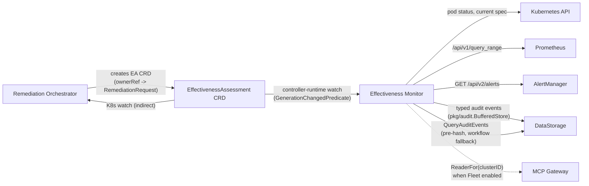

# Effectiveness Monitor Service - Integration Points

**Version**: v2.0
**Last Updated**: 2026-08-02
**Service Type**: Kubernetes CRD controller — **no HTTP business API, no HTTP clients calling it**

---

## Changelog

| Version | Date | Changes | Reference |
|---------|------|---------|-----------|
| **v2.0** | 2026-08-02 | **#1806 CORRECTION**: Full rewrite. Removed the fictional "Context API Service" upstream client (Context API itself was deprecated, [DD-CONTEXT-006](../../../architecture/decisions/DD-CONTEXT-006-CONTEXT-API-DEPRECATION.md)), the fictional `pkg/monitor/` controller package, the fictional "Infrastructure Monitoring Service" (port 8094) and its circuit breaker, and the selective `HolmesGPT` `POST /api/v1/postexec/analyze` call with `shouldCallAI()` decision logic. Replaced with the real integration surface: RO creates the EA CRD (only trigger), EM reads K8s/Prometheus/AlertManager, EM writes typed audit events to DataStorage (and reads back via `ogenDataStorageQuerier` for a pre-hash lookup and a workflow-execution fallback check), and optional Fleet-federated multi-cluster reads. | [#1806](https://github.com/jordigilh/kubernaut/issues/1806) |
| v1.1 | 2025-10-16 | ⚠️ **STALE (superseded by v2.0)** — "Corrected" the direction of a HolmesGPT call that never existed in the implementation | — |
| v1.0 | 2025-10-06 | ⚠️ **STALE** — Original fictional stateless-HTTP-service integration spec | — |

---

## Integration Summary

EM has exactly **one inbound trigger** and **four outbound dependencies**. There is no HTTP server for business logic (only `/metrics` on 9090 and `/healthz`/`/readyz` on 8081), so nothing "calls EM" in the traditional upstream-client sense — the Remediation Orchestrator's only interaction with EM is creating a CRD that EM's controller-runtime watch picks up.



---

## Upstream: Trigger (Not an API Client)

### Remediation Orchestrator — creates the `EffectivenessAssessment` CRD

**Mechanism**: Standard Kubernetes CRD create, not an HTTP call.

The Remediation Orchestrator creates one `EffectivenessAssessment` per `RemediationRequest`, with an `ownerRef` back to the RR, when the RR reaches `Verifying` (happy path — WorkflowExecution succeeded, RR now awaits assessment before final completion, Issue #280) or a terminal phase (`Completed`, `Failed`, `TimedOut`). The RO also copies `PreRemediationSpecHash`, `RemediationCreatedAt`, and `SignalName` from the RR onto the EA spec at creation time.

**EM's only trigger**: The controller-runtime watch registered in `SetupWithManager` (`internal/controller/effectivenessmonitor/reconciler.go`):

```go
func (r *Reconciler) SetupWithManager(mgr ctrl.Manager, maxConcurrentReconciles ...int) error {
    // Field index on spec.correlationID for efficient lookups and kubectl UX
    mgr.GetFieldIndexer().IndexField(context.Background(), &eav1.EffectivenessAssessment{},
        "spec.correlationID", func(obj client.Object) []string { /* ... */ })

    builder := ctrl.NewControllerManagedBy(mgr).
        For(&eav1.EffectivenessAssessment{}).
        // Issue #1466: EA spec is immutable and EM is the sole status writer —
        // filtering to generation changes avoids a hot reconciliation loop from
        // EM's own status writes (matches the WorkflowExecution controller pattern,
        // DD-CONTROLLER-001 v4.0 Pattern B-WE).
        WithEventFilter(predicate.GenerationChangedPredicate{})

    return builder.Complete(r)
}
```

Because generation only changes at creation (the spec is immutable), **progression through phases after creation is driven entirely by `ctrl.Result{RequeueAfter: ...}`** inside `Reconcile()`, not by further watch events.

**Downstream feedback (also CRD-based, not a call)**: The RO separately watches the EA for completion and sets the `EffectivenessAssessed` condition on the parent `RemediationRequest`. EM does not call the RO to report this — it simply updates `EA.Status` and the RO's own watch picks it up.

---

## Downstream Dependencies

### 1. Kubernetes API — target resource reads

**Purpose**: Pod/health status for the health scorer, current spec for hash comparison and drift detection.

**Client**: The controller's own `client.Client`/`client.Reader` (via `mgr.GetClient()`), or, for Fleet-managed targets, a cluster-specific reader:

```go
// ReaderFor returns the appropriate client.Reader for the given clusterID.
func (r *Reconciler) ReaderFor(ctx context.Context, clusterID string) (client.Reader, error) {
    if clusterID == "" || r.readerFactory == nil {
        return r.targetReader, nil
    }
    return r.readerFactory.ReaderFor(ctx, clusterID)
}
```

`ea.Spec.ClusterID` (BR-FLEET-054) selects the reader — empty means the local/hub cluster.

**Failure mode**: Transient K8s API errors requeue the reconcile; a target genuinely not found is scored as health=0.0 (`"target resource not found"`), not treated as an error.

---

### 2. Prometheus — metric comparison

**Purpose**: Pre/post remediation metric comparison (BR-EM-003).

**Client**: `pkg/effectivenessmonitor/client/prometheus_http.go` (`emclient.PrometheusQuerier`), constructed only when `cfg.External.PrometheusEnabled`. Uses `/api/v1/query_range`.

**5 namespace-scoped PromQL queries** (`internal/controller/effectivenessmonitor/assess_components.go`, `buildMetricQuerySpecs`):

```go
{Name: "container_cpu_usage_seconds_total", Query: `sum(rate(container_cpu_usage_seconds_total{namespace="%s"}[5m]))`, LowerIsBetter: true}
{Name: "container_memory_working_set_bytes", Query: `sum(container_memory_working_set_bytes{namespace="%s"})`, LowerIsBetter: true}
{Name: "http_request_duration_p95_ms", Query: `histogram_quantile(0.95, rate(http_request_duration_seconds_bucket{namespace="%s"}[5m])) * 1000`}
{Name: "http_error_rate", Query: `sum(rate(http_requests_total{namespace="%s",code=~"5.."}[5m])) / sum(rate(http_requests_total{namespace="%s"}[5m]))`}
{Name: "http_throughput_rps", Query: `sum(rate(http_requests_total{namespace="%s"}[5m]))`}
```

**Cluster-scoped queries** (Node/PersistentVolume targets, no namespace, DD-EM-005) use kube-state-metrics series instead: `kube_node_status_condition{condition="Ready"|"MemoryPressure"|"DiskPressure"}`, `kube_persistentvolume_status_phase`, and a `kubelet_volume_stats_used_bytes` / `kube_persistentvolume_capacity_bytes` join for usage ratio.

Each metric's improvement is `(pre-post)/|pre|`, clamped to `[0,1]`; the overall metrics score is the average across metrics that returned data.

**Startup behavior** (Issue #331): Prometheus is an **optional enrichment source, not a startup dependency**. `pkg/effectivenessmonitor/startup/readiness.go` performs a best-effort `Ready(ctx)` check — an unreachable Prometheus at startup logs a warning and EM continues; a missing `PrometheusURL` while `PrometheusEnabled=true` is the only startup-fatal condition (config error). Query-time failures cause `metricsAssessed=false` for that reconcile, retried on the next pass.

---

### 3. AlertManager — alert resolution check

**Purpose**: Confirms whether the original triggering alert has resolved (BR-EM-002) and detects alert decay (BR-EM-012).

**Client**: `pkg/effectivenessmonitor/client/alertmanager_http.go` (`emclient.AlertManagerClient`), constructed only when `cfg.External.AlertManagerEnabled`.

**Scoring** (`pkg/effectivenessmonitor/alert/alert.go`): Filters by alert name/labels/namespace matchers, then by currently-running pods (`filterByActivePods`, Issue #269 — strips alerts correlated to pods a rolling restart already replaced). 1.0 if no matching alert is `active`; 0.0 if one is; `nil` (not assessed) if AlertManager is unreachable.

**Alert decay detection** (Issue #369, BR-EM-012): When health/metrics/hash are all positive but the alert is still firing, EM suspects a Prometheus lookback-window artifact rather than a genuine failure. It re-probes health live on each decay pass (metrics/hash are checked but not re-probed) and keeps the EA open (`AlertDecayRetries` increments, `AlertDecayDetected` condition = `DecayActive`) until either the alert clears (`DecayResolved`) or the validity window expires (`AlertDecayTimeout`). If any non-alert probe turns negative, the decay hypothesis is killed and the alert is accepted at face value.

**Startup behavior**: Same best-effort pattern as Prometheus — unreachability at startup is a warning, not fatal; only a missing `AlertManagerURL` while enabled is fatal.

---

### 4. DataStorage — audit sink (writes) and query (reads)

DataStorage is EM's only **required** external dependency (buffered/retried, never optional).

#### Writes: typed audit events via `pkg/audit.BufferedStore`

`cmd/effectivenessmonitor/main.go` wires a DD-AUDIT-003 Pattern 2 buffered store, wrapped by the EM-specific `pkg/effectivenessmonitor/audit.Manager`:

```go
dataStorageClient, _ := audit.NewOpenAPIClientAdapter(cfg.DataStorage.URL, cfg.DataStorage.Timeout)
auditStore, _ := audit.NewBufferedStore(dataStorageClient, audit.Config{
    BufferSize: cfg.DataStorage.Buffer.BufferSize,
    BatchSize:  cfg.DataStorage.Buffer.BatchSize,
    // ...
}, "effectiveness-monitor", auditLogger)

auditManager := emaudit.NewManager(auditStore, ctrl.Log.WithName("em-audit"))
```

Every audit event carries `CorrelationID = ea.Spec.CorrelationID` (`pkgaudit.SetCorrelationID`) and, when set, `ClusterID = ea.Spec.ClusterID` (`pkgaudit.SetClusterID`, fleet cluster provenance, CC8.1). On graceful shutdown, `main.go` calls `auditStore.Close()` to flush any buffered events before exiting.

See [Audit Event Catalog](./security/AUDIT_EVENT_CATALOG.md) for the full schema of all 7 event types.

#### Reads: `ogenDataStorageQuerier` (`pkg/effectivenessmonitor/client/ds_querier.go`)

Two read-paths, both via the ogen-generated DataStorage client (DD-API-001) with ServiceAccount token auth (DD-AUTH-005):

```go
// Pre-hash lookup for spec-drift comparison (DD-EM-002) — used as a fallback
// when the RO's PreRemediationSpecHash is unavailable on the EA spec.
func (q *ogenDataStorageQuerier) QueryPreRemediationHash(ctx context.Context, correlationID string) (string, error)

// ADR-EM-001 §5: distinguishes "workflow never started" (NoExecution outcome)
// from "workflow started but produced no completion event" (Partial outcome).
func (q *ogenDataStorageQuerier) HasWorkflowStarted(ctx context.Context, correlationID string) (bool, error)   // remediation.workflow_created event*
func (q *ogenDataStorageQuerier) HasWorkflowCompleted(ctx context.Context, correlationID string) (bool, error) // workflowexecution.workflow.completed event
```

\* Despite the method's doc comment referencing `workflowexecution.execution.started`, the actual query in `QueryPreRemediationHash`/`HasWorkflowStarted` filters on `remediation.workflow_created` — the event type the Remediation Orchestrator emits when it creates the WorkflowExecution CRD; verify against `pkg/effectivenessmonitor/client/ds_querier.go` if this matters for your change.

---

### 5. MCP Gateway — Fleet federation (optional)

**Purpose**: Multi-cluster target reads (BR-FLEET-054) when the signal's `RemediationRequest.Spec.ClusterID` (propagated onto `EA.Spec.ClusterID` by the RO) identifies a remote cluster.

**Wiring** (`cmd/effectivenessmonitor/main.go`, `buildFleetReaderFactory`): Only activated when `cfg.Fleet.Enabled` and an MCP Gateway endpoint is configured. Connects via `mcpclient.NewResilient`, discovers managed clusters via `registry.NewClusterRegistry`, and builds a `fleet.ReaderFactory` the reconciler uses through `ReaderFor(ctx, clusterID)`.

**Failure mode**: A connectivity failure at startup degrades gracefully to hub-only mode (remote-cluster routing disabled, not a startup abort). Once wired, a separate `fleet` readyz check (`pkg/fleet/readiness.Gate`) fails the pod's `/readyz` closed if the Gateway becomes unreachable at runtime (Issue #1553, ADR-068, BR-INTEGRATION-065) — this is the **only** fail-closed dependency in EM; Prometheus/AlertManager are fail-open by design.

See [ADR-068](../../../architecture/decisions/ADR-068-fleet-federation-architecture.md).

---

## Audit Event Contract

EM emits 7 typed audit event types, all under `event_category: "effectiveness"`, actor `service:effectivenessmonitor-controller`, correlated by `ea.Spec.CorrelationID`:

| Event Type | Emitted When | Payload Highlights |
|------------|--------------|---------------------|
| `effectiveness.assessment.scheduled` | First reconciliation | Derived timing: `validityDeadline`, `prometheusCheckAfter`, `alertManagerCheckAfter`, `hashComputeAfter`, `stabilizationWindow` (BR-EM-009.4) |
| `effectiveness.health.assessed` | Health check completes | `health_checks{pod_running, readiness_pass, total_replicas, ready_replicas, restart_delta, crash_loops, oom_killed, pending_count}` |
| `effectiveness.hash.computed` | Spec hash comparison completes | `pre_remediation_spec_hash`, `post_remediation_spec_hash`, `hash_match` (DD-EM-002) |
| `effectiveness.alert.assessed` | Alert resolution check completes | `alert_resolution{alert_resolved, active_count, resolution_time_seconds}` |
| `effectiveness.alert_decay.detected` | First alert-decay detection only (subsequent re-checks are silent) | Same `alert_resolution` shape; `Details` includes health/alert scores and retry count (Issue #369) |
| `effectiveness.metrics.assessed` | Metric comparison completes | `metric_deltas{cpu_before/after, memory_*, latency_p95_*, error_rate_*, throughput_*, node_*, pv_*}` |
| `effectiveness.assessment.completed` | Assessment reaches a terminal phase | `signal_name`, `components_assessed[]`, `completed_at`, `assessment_duration_seconds`, `reason` |

**Authoritative reference**: [Audit Event Catalog](./security/AUDIT_EVENT_CATALOG.md) — includes exact ogen constants and Go type names.

⚠️ Two event types are defined as no-ops or absent per the Audit Event Catalog: `effectiveness.learning.triggered` and `effectiveness.crd.updated` are **not implemented** — do not treat their presence in older docs or design discussions as current behavior.

### What DataStorage does with these events

Per [ADR-EM-001](../../../architecture/decisions/ADR-EM-001-effectiveness-monitor-service-integration.md) §6, DataStorage aggregates the per-component audit events for a given `correlation_id` and computes, on demand:

```
effectiveness_score = health×0.40 + alert×0.35 + metrics×0.25   (weights redistributed over available components)
```

EM never computes or stores this weighted score itself — it is not a field on the EA CRD, and EM has no code path that produces it.

---

## Error Handling Strategy

| Dependency | Failure Mode | Handling |
|------------|--------------|----------|
| **Kubernetes API** | Transient error | `ctrl.Result{RequeueAfter}` and retry |
| **Kubernetes API** | Target not found | Treated as a valid health outcome (score 0.0), not an error |
| **Prometheus** | Disabled | Metrics component skipped entirely (`metricsAssessed` stays false) |
| **Prometheus** | Unreachable at startup | Warning logged; EM starts normally; retried at query time |
| **Prometheus** | Query fails/times out | `metricsAssessed=false` for this reconcile; requeued |
| **AlertManager** | Disabled | Alert component skipped entirely |
| **AlertManager** | Unreachable (startup or query time) | Alert score = `nil` (`Assessed=false`); does not block health/metrics/hash |
| **DataStorage** | Unavailable | `pkg/audit.BufferedStore` buffers and retries; audit writes are never silently dropped |
| **MCP Gateway (Fleet)** | Unreachable at startup | Degrades to hub-only mode |
| **MCP Gateway (Fleet)** | Unreachable at runtime | `/readyz` fails closed via the `fleet` check (the one fail-closed dependency in EM) |

---

## Integration Checklist

### Pre-deployment
- [ ] DataStorage URL configured and reachable (`internal/config/effectivenessmonitor/config.go` → `dataStorage.url`)
- [ ] Prometheus/AlertManager URLs configured if `external.prometheusEnabled`/`external.alertManagerEnabled` are true
- [ ] RBAC granted for target-resource kinds EM health-checks (see [CRD Schema](./crd-schema.md) RBAC section)
- [ ] Fleet MCP Gateway endpoint configured if `fleet.enabled` is true

### Runtime
- [ ] `EffectivenessAssessment` CRDs are being created by the Remediation Orchestrator with the correct `ownerRef`
- [ ] Audit events are visible in DataStorage, queryable by `correlation_id`
- [ ] `kubernaut_effectivenessmonitor_external_call_errors_total{service,operation,error_type}` is not climbing for `prometheus`/`alertmanager`

### Monitoring
- [ ] `kubernaut_effectivenessmonitor_component_assessments_total{component,result}` tracked per component
- [ ] `kubernaut_effectivenessmonitor_validity_expirations_total{cluster}` alerted on sustained increase (assessments timing out without completing)
- [ ] `/readyz` `fleet` check monitored if Fleet federation is enabled

---

## Related Documents

- [Overview](./overview.md)
- [CRD Schema](./crd-schema.md)
- [Observability & Logging](./observability-logging.md)
- [Audit Event Catalog](./security/AUDIT_EVENT_CATALOG.md)
- [ADR-EM-001](../../../architecture/decisions/ADR-EM-001-effectiveness-monitor-service-integration.md)
- [DD-CONTEXT-006](../../../architecture/decisions/DD-CONTEXT-006-CONTEXT-API-DEPRECATION.md) — Context API deprecation (why EM has no such upstream client)
- [ADR-068](../../../architecture/decisions/ADR-068-fleet-federation-architecture.md) — Fleet federation
