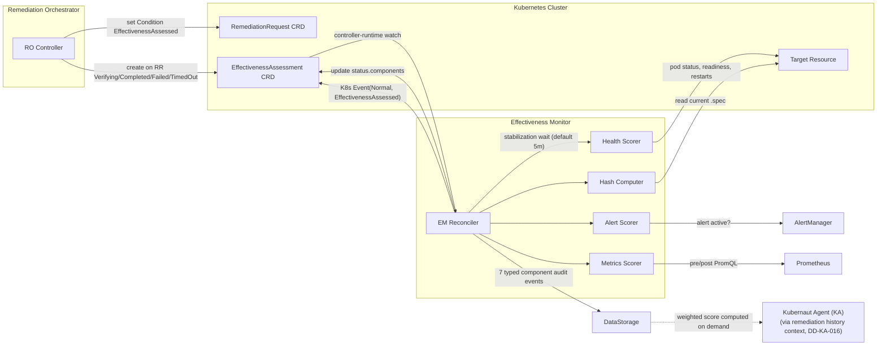

# Effectiveness Monitor Service - Overview

**Version**: v2.0
**Last Updated**: 2026-08-02
**Status**: ✅ Implemented (V1.0 Level 1 scope) — Corrected for [#1806](https://github.com/jordigilh/kubernaut/issues/1806)

---

## Changelog

| Version | Date | Changes | Reference |
|---------|------|---------|-----------|
| v2.0 | 2026-08-02 | **#1806 CORRECTION**: Full rewrite. Replaced the fictional "stateless HTTP API service with selective HolmesGPT post-execution analysis" architecture with the real Kubernetes CRD controller: EM watches `EffectivenessAssessment` (EA) CRDs created by the Remediation Orchestrator, runs 4 deterministic component scorers (health, alert, metrics, hash — zero AI/LLM calls in V1.0), and emits raw per-component audit events. DataStorage — not EM — computes the final weighted score on demand. Removed all references to a "Context API Service" client (deprecated, DD-CONTEXT-006), `pkg/monitor/`, direct PostgreSQL persistence, `shouldCallAI()`, and fictional `effectiveness_ai_*`/`effectiveness_data_availability_weeks` metrics. The `POST /api/v1/postexec/analyze` endpoint does not exist anywhere in the codebase today — it is a genuinely planned V1.1 (Level 2) feature, tracked in [DD-017](../../../architecture/decisions/DD-017-effectiveness-monitor-v1.1-deferral.md). | [#1806](https://github.com/jordigilh/kubernaut/issues/1806), [ADR-EM-001](../../../architecture/decisions/ADR-EM-001-effectiveness-monitor-service-integration.md), [DD-017](../../../architecture/decisions/DD-017-effectiveness-monitor-v1.1-deferral.md) |
| v1.1 | 2025-10-16 | ⚠️ **STALE (superseded by v2.0)** — Described a "Self-Documenting JSON" HolmesGPT prompt format and a Week 5/Week 13+ graceful-degradation timeline. Neither exists in the current implementation. | — |
| v1.0 | 2025-10-06 | Initial design specification (pre-implementation; described a fictional stateless HTTP architecture, never built as such) | — |

---

## Purpose

The Effectiveness Monitor (EM) is a **Kubernetes CRD controller** that closes the remediation feedback loop: after a remediation completes, it deterministically measures whether the remediation actually improved the situation, and emits the raw measurements as audit events so DataStorage can compute an effectiveness score on demand. That score becomes part of the remediation history context Kubernaut Agent (KA) uses when investigating future signals against the same resource (`DD-KA-016`), preventing the LLM from repeatedly recommending an ineffective remediation.

**Core Responsibilities (V1.0 / Level 1 — fully implemented)**:
1. **Watch** `EffectivenessAssessment` (EA) CRDs created by the Remediation Orchestrator (RO) when a `RemediationRequest` reaches a terminal or verifying phase
2. **Wait** for a configurable stabilization window before assessing (default 5m), so measurements reflect the post-remediation steady state
3. **Run 4 independent, deterministic component checks** — health (K8s API), alert resolution (AlertManager), metric comparison (Prometheus), and spec hash comparison (K8s API) — no LLM/AI call is made for any of them
4. **Emit typed audit events** per component to DataStorage; DataStorage (not EM) computes the final weighted effectiveness score on demand, per correlation ID
5. **Detect spec drift and alert decay** as first-class outcomes, short-circuiting or extending the assessment as appropriate

EM has **zero AI/LLM dependency in V1.0**. There is no HolmesGPT, HAPI, or Kubernaut Agent (KA) client anywhere in `pkg/effectivenessmonitor/` or `internal/controller/effectivenessmonitor/` — every score EM produces is rule-based and reproducible.

---

## V1.0 Scope

### What EM DOES (V1.0 / Level 1 — implemented)

| Capability | Description | Reference |
|------------|-------------|-----------|
| **Health check** | K8s API pod status decision tree (readiness, restarts, CrashLoopBackOff, OOMKilled, pending pods) | BR-EM-001, `pkg/effectivenessmonitor/health/health.go` |
| **Alert resolution check** | Queries AlertManager for the triggering alert; includes stale-pod alert filtering and multi-probe alert-decay detection | BR-EM-002, BR-EM-012, `pkg/effectivenessmonitor/alert/alert.go` |
| **Metric comparison** | 5 PromQL queries (CPU, memory, p95 latency, error rate, throughput) compared pre/post remediation, plus cluster-scoped Node/PV metrics | BR-EM-003, `pkg/effectivenessmonitor/metrics/scorer.go` |
| **Spec hash / drift detection** | SHA-256 canonical fingerprint comparison (pre/post/current) — detects whether the workflow changed the spec, and whether something else changed it afterward | BR-EM-004, `pkg/effectivenessmonitor/hash/hash.go` |
| **Phase state machine + derived timing** | `Pending → [WaitingForPropagation] → Stabilizing → Assessing → Completed/Failed`, with validity/stabilization deadlines computed and persisted in status | BR-EM-005, BR-EM-009 |
| **Component audit events** | 7 typed audit event types emitted to DataStorage per assessment lifecycle | BR-AUDIT-006, [Audit Event Catalog](./security/AUDIT_EVENT_CATALOG.md) |
| **Fleet-aware target reads** | When Fleet federation is enabled, routes health/hash reads to the correct remote cluster via `fleet.ReaderFactory` | BR-FLEET-054, [ADR-068](../../../architecture/decisions/ADR-068-fleet-federation-architecture.md) |

### What EM Does NOT Do (V1.0)

| Excluded Capability | Reason | Deferred To |
|---------------------|--------|-------------|
| **Any AI/LLM analysis** (root cause validation, oscillation detection, lesson extraction) | Requires historical patterns from Level 1 data; no Level 2 code exists today | V1.1 (Level 2), [DD-017](../../../architecture/decisions/DD-017-effectiveness-monitor-v1.1-deferral.md) |
| **`POST /api/v1/postexec/analyze` endpoint** | ⚠️ **Planned V1.1 — NOT YET IMPLEMENTED.** Does not exist in EM, in Kubernaut Agent's `openapi.json`, or anywhere else in the codebase | V1.1, DD-017 §"V1.1 Scope: Level 2" |
| **Computing the final weighted effectiveness score** | EM is a **data collector**, not a scorer. It emits raw per-component audit events; **DataStorage** aggregates them and computes `health×0.40 + alert×0.35 + metrics×0.25` (weight-redistributed) on demand | ADR-EM-001 §6, DD-017 |
| **Side-effect / collateral-damage detection** | Determining causality across namespaces/nodes is out of scope for the V1.0 formula-based approach | Post-V1.0 |
| **Any HTTP business API** (assessment request/response endpoints) | EM has no such API — it is purely watch-driven | N/A — was never real |
| **Direct database persistence** | EM has no database connection of its own; all writes go through DataStorage's audit pipeline (`pkg/audit.BufferedStore`) | N/A |

---

## Architecture Overview



EM has **zero HTTP business API surface**. The only network listeners are:

| Port | Purpose |
|------|---------|
| **9090** | Prometheus metrics scrape (`/metrics`) |
| **8081** | Health/readiness probes (`/healthz`, `/readyz`, plus a `fleet` readyz check when Fleet federation is enabled) |

There is **no port 8080** and no REST endpoint for requesting or retrieving an assessment — the only trigger is the controller-runtime watch on the EA CRD (`internal/controller/effectivenessmonitor/reconciler.go`, `SetupWithManager`).

---

## Phase Transitions (V1.0)

```
Pending → [WaitingForPropagation] → Stabilizing → Assessing → Completed/Failed
```

- **Sync targets** (no `hashComputeDelay`): `Pending → Stabilizing → Assessing → Completed/Failed` (or directly `Pending → Assessing` when `StabilizationWindow == 0`)
- **Async targets** (GitOps/operator-managed, `hashComputeDelay` set): `Pending → WaitingForPropagation → Stabilizing → Assessing → Completed/Failed`

| Phase | Meaning |
|-------|---------|
| **Pending** | EA created by RO; EM has not yet reconciled it |
| **WaitingForPropagation** | Async targets only — EM is waiting for `HashComputeDelay` to elapse before computing the post-remediation spec hash (DD-EM-004, Issue #253/#277) |
| **Stabilizing** | Waiting for `StabilizationWindow` to elapse; derived timing (`validityDeadline`, `prometheusCheckAfter`, `alertManagerCheckAfter`) is computed and persisted here |
| **Assessing** | EM is actively running component checks |
| **Completed** | All applicable components assessed (or validity window forced completion); `assessmentReason` records why (`Full`, `Partial`, `NoExecution`, `MetricsTimedOut`, `Expired`, `SpecDrift`, `AlertDecayTimeout`, `Unrecoverable`) |
| **Failed** | Assessment could not be performed (e.g., target namespace deleted, unrecoverable error) |

The controller-runtime watch uses `predicate.GenerationChangedPredicate{}` (the EA spec is immutable, so generation only changes at creation) — progression through phases after creation is driven entirely by explicit `RequeueAfter` scheduling inside the reconciler, not by further watch events. See [CRD Schema](./crd-schema.md) for the full spec/status field reference.

---

## Component Scorers (Level 1 — the "how")

Each scorer produces a `types.ComponentResult{Component, Assessed, Score *float64, Details, Error}` (`pkg/effectivenessmonitor/types/types.go`). All four run independently; a failure in one does not block the others.

| Component | Package | Scoring |
|-----------|---------|---------|
| **Health** | `pkg/effectivenessmonitor/health/health.go` | Decision tree over K8s pod status, evaluated in priority order: target missing/0 replicas → 0.0; CrashLoopBackOff → 0.0; 0 ready → 0.0; partial ready → 0.5; all-ready + OOMKilled → 0.25; all-ready + restarts → 0.75; all-ready clean → 1.0. Kind-aware: non-pod-owning kinds (ConfigMap, Secret, Node) return `Assessed=true, Score=nil` ("not applicable"), no audit event emitted. |
| **Alert** | `pkg/effectivenessmonitor/alert/alert.go` | 1.0 if the triggering alert is no longer active in AlertManager, 0.0 if still active, `nil` if AlertManager is unreachable. Filters out alerts correlated to pods that no longer exist post-rollout (`filterByActivePods`, Issue #269). Includes multi-probe alert-decay detection (BR-EM-012, Issue #369) — see [Integration Points](./integration-points.md). |
| **Metrics** | `pkg/effectivenessmonitor/metrics/scorer.go` + `internal/controller/effectivenessmonitor/assess_components.go` | 5 namespace-scoped PromQL queries (CPU, memory, `http_request_duration_p95_ms`, `http_error_rate`, `http_throughput_rps`) plus cluster-scoped Node/PV kube-state-metrics queries (DD-EM-005). Per-metric improvement ratio `(pre-post)/|pre|` clamped to `[0,1]`; overall score is the average of available metric scores. |
| **Hash** | `pkg/effectivenessmonitor/hash/hash.go` | SHA-256 canonical-fingerprint comparison (pre/post/current) via `pkg/shared/hash.CanonicalResourceFingerprint`. Not scored — metadata only, used for spec-drift detection (DD-EM-002). |

**EM never computes a final weighted score.** Per [ADR-EM-001](../../../architecture/decisions/ADR-EM-001-effectiveness-monitor-service-integration.md) §6 and [DD-017](../../../architecture/decisions/DD-017-effectiveness-monitor-v1.1-deferral.md), EM emits raw per-component audit events; **DataStorage computes** `health×0.40 + alert×0.35 + metrics×0.25` on demand, normalizing weights over whichever components have audit events for a given `correlation_id`. This lets the scoring formula evolve without EM re-emitting historical events.

---

## Input/Output Contract

### Input: `EffectivenessAssessment.Spec` (set once by RO, immutable via CEL)

| Field | Purpose |
|-------|---------|
| `correlationID` | `RemediationRequest.Name` — the correlation ID for all audit events and DataStorage queries |
| `remediationRequestPhase` | RR's `OverallPhase` at EA creation time (`Verifying`\|`Completed`\|`Failed`\|`TimedOut`) — lets EM branch on outcome |
| `signalTarget` / `remediationTarget` | Dual targets (DD-EM-003) — the resource that alerted vs. the resource the workflow actually modified; each component uses the appropriate one |
| `config.stabilizationWindow` | Wait time before assessment begins (set by RO) |
| `config.hashComputeDelay` / `config.alertCheckDelay` | Optional deferrals for async-managed targets and proactive signals |
| `preRemediationSpecHash` | SHA-256 hash captured by RO before the workflow ran, copied from `RR.Status.PreRemediationSpecHash` |

### Output: `EffectivenessAssessment.Status` (written only by EM)

| Field | Purpose |
|-------|---------|
| `phase` | Current lifecycle phase (see [Phase Transitions](#phase-transitions-v10)) |
| `validityDeadline`, `prometheusCheckAfter`, `alertManagerCheckAfter` | Derived timing, computed by EM on first reconcile |
| `components.*Assessed` / `*Score` | Per-component completion flags and scores, enabling restart recovery |
| `assessmentReason` | Why the assessment reached its terminal state |
| `conditions` | 5 Kubernetes Conditions (`Ready`, `AssessmentComplete`, `SpecIntegrity`, `AlertDecayDetected`, `PostHashCaptured`) per [DD-CRD-002-EA](../../../architecture/decisions/DD-CRD-002-effectivenessassessment-conditions.md) |

Full field-level reference: [CRD Schema](./crd-schema.md).

### Downstream Output: Audit Events (to DataStorage, not the EA CRD)

The scored data itself (health checks, metric deltas, alert resolution) lives in **typed audit event sub-objects**, not in the EA status. See [Integration Points](./integration-points.md) and the [Audit Event Catalog](./security/AUDIT_EVENT_CATALOG.md) for the full event schema.

---

## Service Configuration

### Ports

| Port | Purpose | Endpoint | Auth |
|------|---------|----------|------|
| **9090** | Prometheus metrics | `/metrics` | Network Policy |
| **8081** | Health probes | `/healthz`, `/readyz` (+ `fleet` readyz check when enabled) | None (K8s probes) |

### External Dependencies

| Service | Purpose | Failure Mode |
|---------|---------|---------------|
| **DataStorage** | Audit event sink (writes) + `remediation.workflow_created` fallback query and pre-hash lookup (reads) | Required — buffered/retried, never optional |
| **Prometheus** | Pre/post metric comparison | Optional per config (`external.prometheusEnabled`); startup only fails if enabled with an **empty URL** (config error) — unreachability at startup is logged as a warning and retried at query time (`pkg/effectivenessmonitor/startup/readiness.go`, Issue #331) |
| **AlertManager** | Alert resolution check | Optional per config (`external.alertManagerEnabled`); same best-effort startup behavior — connectivity failures never block startup |
| **Kubernetes API** | Pod/health status, current spec for hashing; Fleet-aware via `fleet.ReaderFactory` | Required — assessment fails and requeues on transient errors |
| **MCP Gateway** (Fleet federation only) | Multi-cluster target reads (BR-FLEET-054) | Optional; when enabled, a `fleet` readyz check fails closed on Gateway unreachability ([ADR-068](../../../architecture/decisions/ADR-068-fleet-federation-architecture.md)) |

Config file: `internal/config/effectivenessmonitor/config.go` defines `DefaultConfigPath = "/etc/effectivenessmonitor/config.yaml"` (ADR-030); the Helm chart mounts its rendered ConfigMap at `/etc/effectivenessmonitor/effectivenessmonitor.yaml` and passes it via `--config` (`charts/kubernaut/templates/effectivenessmonitor/effectivenessmonitor.yaml`), so production deployments override the default filename. No `LLMProvider`, `HolmesGPT`, or agent-client configuration exists.

---

## Owner Reference Architecture

**Created By**: Remediation Orchestrator, when a `RemediationRequest` reaches `Verifying` (happy path) or a terminal phase (`Completed`/`Failed`/`TimedOut`)
**Owned By**: `RemediationRequest` (ownerRef, `blockOwnerDeletion: false` — RR deletion garbage-collects the EA, but audit events already emitted to DataStorage survive)
**Creates**: Nothing — EM never creates other CRDs

```
RemediationRequest (root orchestrator)
        │
        ├── SignalProcessing
        ├── AIAnalysis
        ├── WorkflowExecution
        ├── NotificationRequest
        └── EffectivenessAssessment ← This service watches this CRD
```

The RO also watches EA completion (via the standard K8s watch, not a direct call to EM) to flip the `EffectivenessAssessed` condition on the parent `RemediationRequest`.

---

## Business Requirements Coverage (V1.0)

| Category | Key BRs |
|----------|---------|
| **Health assessment** | BR-EM-001 |
| **Alert resolution** | BR-EM-002, BR-EM-012 (alert decay, Issue #369) |
| **Metric comparison** | BR-EM-003 |
| **Spec hash / drift** | BR-EM-004 |
| **Phase state machine** | BR-EM-005 |
| **Stabilization / validity windows** | BR-EM-006, BR-EM-007, BR-EM-008, BR-EM-009 ([derived timing](../../../requirements/BR-EM-009-derived-timing-computation.md)), BR-EM-010 ([async hash deferral](../../../requirements/BR-EM-010-async-hash-deferral.md)) |
| **Audit trail** | BR-AUDIT-006 (SOC2 CC7.2) |

⚠️ **STALE ID note**: Legacy versions of this document (and sibling docs still pending correction, e.g. `security-configuration.md`, `testing-strategy.md`) reference `BR-INS-001` through `BR-INS-010`. No `BR-INS-*` requirement document backs the current implementation — the code-aligned namespace is `BR-EM-001` through `BR-EM-012` (see `pkg/effectivenessmonitor/types/types.go` and sibling package doc comments). This rewrite does not renumber `BR-INS-*` — it is flagged here for a future requirements-mapping pass, not silently resolved.

---

## Related Documents

| Document | Purpose |
|----------|---------|
| [CRD Schema](./crd-schema.md) | `EffectivenessAssessment` spec/status field reference (renamed from `api-specification.md` — EM has no REST API) |
| [Integration Points](./integration-points.md) | Upstream/downstream services, audit event contract |
| [Observability & Logging](./observability-logging.md) | Structured logging, Prometheus metrics, alert rules |
| [Audit Event Catalog](./security/AUDIT_EVENT_CATALOG.md) | Authoritative reference for all 7 audit events EM emits |
| [ADR-EM-001](../../../architecture/decisions/ADR-EM-001-effectiveness-monitor-service-integration.md) | Authoritative integration architecture (sequence diagrams, scoring formula, SOC2 chain of custody) |
| [DD-017](../../../architecture/decisions/DD-017-effectiveness-monitor-v1.1-deferral.md) | V1.0 Level 1 / V1.1 Level 2 scoping decision |
| [DD-EM-002](../../../architecture/decisions/DD-EM-002-canonical-spec-hash.md) | Canonical spec hash algorithm and Spec Drift Guard |
| [DD-EM-003](../../../architecture/decisions/DD-EM-003-dual-target-assessment.md) | Dual-target (signal vs. remediation) assessment |
| [DD-EM-004](../../../architecture/decisions/DD-EM-004-async-hash-deferral.md) | Async hash deferral for GitOps/operator-managed targets |
| [DD-EM-005](../../../architecture/decisions/DD-EM-005-cluster-scoped-metrics-alert-assessment.md) | Cluster-scoped Node/PV metrics |

---

## Summary

| Aspect | Value |
|--------|-------|
| **Service** | Effectiveness Monitor Controller |
| **CRD watched** | `EffectivenessAssessment` (`effectiveness.kubernaut.io/v1alpha1`) |
| **Entrypoint** | `cmd/effectivenessmonitor/main.go` |
| **Controller package** | `internal/controller/effectivenessmonitor/` |
| **Business logic package** | `pkg/effectivenessmonitor/` |
| **Phases** | Pending → [WaitingForPropagation] → Stabilizing → Assessing → Completed/Failed |
| **Metrics Port** | 9090 (`/metrics`) |
| **Health Port** | 8081 (`/healthz`, `/readyz`) |
| **AI/LLM dependency** | None in V1.0 (planned V1.1, DD-017) |
| **Scoring** | Computed by DataStorage on demand, not by EM |
