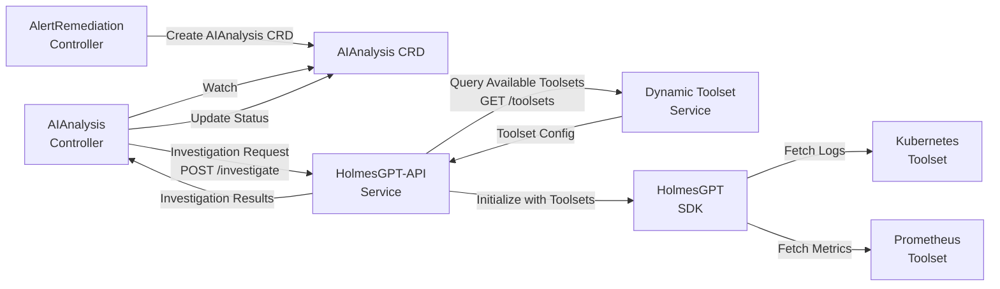

# AI Analysis Service - CRD Implementation

**Health/Ready Port**: 8080 (`/health`, `/ready` - no auth required)
**Metrics Port**: 9090 (`/metrics` - with auth filter)
**CRD**: AIAnalysis
**Controller**: AIAnalysisReconciler
**Status**: ⚠️ **NEEDS CRD IMPLEMENTATION**
**Priority**: **P0 - HIGH**
**Effort**: 1 week

---

## 📚 Related Documentation

**CRD Design Specification**: [docs/design/CRD/03_AI_ANALYSIS_CRD.md](../../design/CRD/03_AI_ANALYSIS_CRD.md)

This document provides the detailed CRD schema, controller reconciliation logic, and architectural patterns for the AIAnalysis CRD.

---

## Business Requirements

### **Core AI Analysis Requirements** (BR-AI-001 to BR-AI-015)
- **BR-AI-001**: MUST provide contextual analysis of Kubernetes alerts and system state
- **BR-AI-002**: MUST support multiple analysis types (diagnostic, predictive, prescriptive)
- **BR-AI-003**: MUST generate structured analysis results with confidence scoring
- **BR-AI-006**: MUST generate actionable remediation recommendations based on alert context
- **BR-AI-007**: MUST rank recommendations by effectiveness probability
- **BR-AI-008**: MUST consider historical success rates in recommendation scoring
- **BR-AI-009**: MUST support constraint-based recommendation filtering
- **BR-AI-010**: MUST provide recommendation explanations with supporting evidence
- **BR-AI-011**: MUST conduct intelligent alert investigation using historical patterns
- **BR-AI-012**: MUST identify root cause candidates with supporting evidence
- **BR-AI-013**: MUST correlate alerts across time windows and resource boundaries
- **BR-AI-014**: MUST generate investigation reports with actionable insights
- **BR-AI-015**: MUST support custom investigation scopes and time windows

### **Quality Assurance Requirements** (BR-AI-021 to BR-AI-024)
- **BR-AI-021**: MUST validate AI responses for completeness and accuracy
- **BR-AI-022**: MUST implement confidence thresholds for automated decision making
- **BR-AI-023**: MUST detect and handle AI hallucinations or invalid responses
- **BR-AI-024**: MUST provide fallback mechanisms when AI services are unavailable

### **HolmesGPT-Specific Requirements** (BR-HAPI-*)
- **BR-HAPI-INVESTIGATION-001 to 005**: Enhanced HolmesGPT investigation capabilities
- **BR-HAPI-RECOVERY-001 to 006**: Recovery analysis and recommendations
- **BR-HAPI-SAFETY-001 to 006**: Action safety analysis
- **BR-HAPI-POSTEXEC-001 to 005**: Post-execution analysis and learning

---

## Overview

**Purpose**: HolmesGPT-powered alert investigation, root cause analysis, and remediation recommendation generation.

**Core Responsibilities**:
1. Trigger HolmesGPT investigation for enriched alerts (BR-AI-011)
2. Perform contextual AI analysis of Kubernetes state (BR-AI-001)
3. Identify root cause candidates with supporting evidence (BR-AI-012)
4. Generate ranked remediation recommendations (BR-AI-006, BR-AI-007)
5. Validate AI responses and detect hallucinations (BR-AI-021, BR-AI-023)
6. Create WorkflowExecution CRD for approved recommendations


**V1 Scope - HolmesGPT Only**:
- Single AI provider: HolmesGPT (port 8090)
- No multi-model orchestration
- No LLM fallback chains
- Focus on investigation and recommendation

**Future V2 Enhancements** (Out of Scope):
- Multi-provider AI support (OpenAI, Anthropic, etc.)
- Ensemble decision-making across models
- Advanced provider routing and fallback

---

## Owner Reference Architecture

**📚 Complete Architecture**: See [OWNER_REFERENCE_ARCHITECTURE.md](OWNER_REFERENCE_ARCHITECTURE.md) for comprehensive ownership hierarchy documentation.

### **AIAnalysis Ownership** (Centralized Orchestration)

**Owned By**: AlertRemediation (root CRD - central orchestrator)
**Creates**: Nothing (AlertRemediation creates next CRDs)

```
                AlertRemediation (root - central orchestrator)
                        │
        ┌───────────────┼───────────────┬───────────────┬───────────────┐
        │ (owns)        │ (owns)        │ (owns)        │ (owns)        │ (owns)
        ▼               ▼               ▼               ▼               ▼
  AlertProcessing  AIAnalysis  WorkflowExecution  KubernetesExecution (DEPRECATED - ADR-025)  AIApprovalRequest
   (Sibling 1)     (Sibling 2)    (Sibling 3)        (Sibling 4)       (Optional)
                       ▲
                       │
                  This service
```

### **Owner Reference Implementation**

```go
// AIAnalysis is created by AlertRemediation controller with owner reference
aiAnalysis := &aianalysisv1.AIAnalysis{
    ObjectMeta: metav1.ObjectMeta{
        Name:      fmt.Sprintf("%s-ai", remediation.Name),
        Namespace: remediation.Namespace,
        OwnerReferences: []metav1.OwnerReference{
            *metav1.NewControllerRef(remediation, remediationv1.GroupVersion.WithKind("AlertRemediation")),
        },
    },
    Spec: aianalysisv1.AIAnalysisSpec{
        // ... spec fields ...
    },
}
```

### **AIAnalysis Controller Responsibilities**

**What AIAnalysis Controller Does**:
- ✅ Process AI analysis using HolmesGPT
- ✅ Generate remediation recommendations
- ✅ Update status.phase to "completed"

**What AIAnalysis Controller Does NOT Do**:
- ❌ Create WorkflowExecution (AlertRemediation does this)
- ❌ Create AIApprovalRequest (AlertRemediation does this)
- ❌ Know about other services (decoupled design)

### **Cascade Deletion Behavior**

- ✅ **When AlertRemediation is deleted**: AIAnalysis is automatically deleted by Kubernetes (along with all sibling CRDs)
- ✅ **Parallel Deletion**: All service CRDs deleted simultaneously (flat hierarchy benefit)
- ✅ **No orphaned resources**: Simple 2-level ownership ensures complete cleanup

### **Key Architectural Points**

1. **All Service CRDs are Siblings**
   - AlertProcessing, AIAnalysis, WorkflowExecution, KubernetesExecution, AIApprovalRequest
   - All owned by AlertRemediation (level 2)
   - No nested ownership chains

2. **Centralized Orchestration**
   - AlertRemediation watches AIAnalysis.status.phase
   - When "completed", AlertRemediation creates WorkflowExecution
   - AIAnalysis controller has NO knowledge of WorkflowExecution

3. **No Circular Dependencies** (Impossible with 2-Level Design)
   - AlertRemediation → AIAnalysis → (none) ✅
   - Maximum depth: 2 levels
   - Simple and predictable

4. **Finalizer for Cleanup**
   - AIAnalysis controller can implement finalizer for external resource cleanup (e.g., HolmesGPT session cleanup)
   - Finalizer runs before Kubernetes cascade deletion
   - See [OWNER_REFERENCE_ARCHITECTURE.md](OWNER_REFERENCE_ARCHITECTURE.md) for finalizer pattern

---

## Development Methodology

**Mandatory Process**: Follow APDC-Enhanced TDD workflow per [.cursor/rules/00-core-development-methodology.mdc](../../../.cursor/rules/00-core-development-methodology.mdc)

### APDC-TDD Workflow

```
┌─────────────────────────────────────────────────────────────┐
│ ANALYSIS → PLAN → DO-RED → DO-GREEN → DO-REFACTOR → CHECK  │
└─────────────────────────────────────────────────────────────┘
```

**ANALYSIS** (5-15 min): Comprehensive context understanding
  - Search existing implementations (`codebase_search "AIAnalysis implementations"`)
  - Identify reusable AI components in `pkg/ai/` and `pkg/intelligence/`
  - Map business requirements (BR-AI-001 to BR-AI-185)
  - Identify integration points in `cmd/` for HolmesGPT-API client

**PLAN** (10-20 min): Detailed implementation strategy
  - Define TDD phase breakdown (RED → GREEN → REFACTOR)
  - Plan integration points (AIAnalysis controller in cmd/ai/analysis/)
  - Establish success criteria (investigation <15min, analysis <15min, recommendations <15min)
  - Identify risks (HolmesGPT unavailability → degraded mode, large payloads → selective embedding)

**DO-RED** (10-15 min): Write failing tests FIRST
  - Unit tests defining business contract (70%+ coverage target)
  - Use FAKE K8s client (`sigs.k8s.io/controller-runtime/pkg/client/fake`)
  - Mock ONLY HolmesGPT-API HTTP calls (use `pkg/testutil/mocks`)
  - Use REAL AI validation and analysis business logic
  - Map tests to business requirements (BR-AI-XXX)

**DO-GREEN** (15-20 min): Minimal implementation
  - Define AIAnalysisReconciler interface to make tests compile
  - Minimal code to pass tests (basic investigation, analysis, recommendations)
  - **MANDATORY integration in cmd/ai/analysis/** (controller startup)
  - Add owner references to AlertRemediation CRD
  - Add AIApprovalRequest CRD creation (if manual approval needed)

**DO-REFACTOR** (20-30 min): Enhance with sophisticated logic
  - **NO new types/interfaces/files** (enhance existing controller methods)
  - Add sophisticated AI validation algorithms (hallucination detection, confidence scoring)
  - Maintain integration with AlertRemediation orchestration
  - Add Rego-based policy evaluation for auto-approval
  - Optimize payload size handling with selective embedding

**CHECK** (5-10 min): Validation and confidence assessment
  - Business requirement verification (BR-AI-001 to BR-AI-185 addressed)
  - Integration confirmation (controller in cmd/ai/analysis/)
  - Test coverage validation (70%+ unit, 20% integration, 10% E2E)
  - Performance validation (total processing <45min, per-phase <15min)
  - Confidence assessment: 92% (high confidence with Rego policy approach)

**AI Assistant Checkpoints**: See [.cursor/rules/10-ai-assistant-behavioral-constraints.mdc](../../../.cursor/rules/10-ai-assistant-behavioral-constraints.mdc)
  - **Checkpoint A**: Type Reference Validation (read AIAnalysis CRD types before referencing)
  - **Checkpoint B**: Test Creation Validation (search existing AI analysis patterns)
  - **Checkpoint C**: Business Integration Validation (verify cmd/ai/analysis/ integration)
  - **Checkpoint D**: Build Error Investigation (complete dependency analysis for AI components)

### Quick Decision Matrix

| Starting Point | Required Phase | Reference |
|----------------|---------------|-----------|
| **New AIAnalysis controller** | Full APDC workflow | Controller pattern is new |
| **Enhance HolmesGPT integration** | DO-RED → DO-REFACTOR | Existing integration is well-understood |
| **Fix recommendation bugs** | ANALYSIS → DO-RED → DO-REFACTOR | Understand AI decision logic first |
| **Add approval policy tests** | DO-RED only | Write tests for Rego policy evaluation |

**Testing Strategy Reference**: [.cursor/rules/03-testing-strategy.mdc](../../../.cursor/rules/03-testing-strategy.mdc)
  - Unit Tests (70%+): test/unit/ai/analysis/ - Fake K8s client, mock HolmesGPT-API
  - Integration Tests (20%): test/integration/ai/analysis/ - Real K8s (KIND), real HolmesGPT-API
  - E2E Tests (10%): test/e2e/ai/analysis/ - Complete investigation-to-workflow workflow

---

## Reconciliation Architecture

### Phase Transitions

```
investigating → analyzing → recommending → completed
     ↓              ↓              ↓              ↓
  (15 min)      (15 min)       (15 min)       (final)
```

### Phase Breakdown

#### 1. **investigating** (BR-AI-011, BR-AI-012, BR-AI-013)

**Purpose**: Trigger HolmesGPT investigation and gather root cause evidence

**Actions**:
- Trigger HolmesGPT investigation via HTTP API (port 8090)
- Retrieve historical patterns from Data Storage Service (BR-AI-011)
- Correlate related alerts across time windows (BR-AI-013)
- Identify root cause candidates with evidence (BR-AI-012)
- Update `status.investigationResult` with findings

**Timeout**: 15 minutes (configurable via annotation)

**Transition Criteria**:
```go
if investigationComplete && rootCauseIdentified {
    phase = "analyzing"
} else if timeout {
    phase = "failed"
    reason = "investigation_timeout"
}
```

**Example CRD Update**:
```yaml
status:
  phase: investigating
  investigationResult:
    rootCauseHypotheses:
    - hypothesis: "Pod memory limit too low"
      confidence: 0.85
      evidence:
      - "OOMKilled events in pod history"
      - "Memory usage consistently near 95% of limit"
    correlatedAlerts:
    - fingerprint: "abc123def456"
      timestamp: "2025-01-15T10:30:00Z"
```

#### 2. **analyzing** (BR-AI-001, BR-AI-002, BR-AI-003, BR-AI-021, BR-AI-023)

**Purpose**: Perform contextual AI analysis and validate results

**Actions**:
- Execute diagnostic, predictive, and prescriptive analysis (BR-AI-002)
- Generate confidence scores for analysis results (BR-AI-003)
- Validate AI responses for completeness (BR-AI-021)
- Detect and handle AI hallucinations (BR-AI-023)
- Perform contextual analysis of Kubernetes state (BR-AI-001)
- Update `status.analysisResult` with validated findings

**Timeout**: 15 minutes (configurable via annotation)

**Transition Criteria**:
```go
if analysisComplete && validationPassed && confidenceAboveThreshold {
    phase = "recommending"
} else if hallucinationDetected || validationFailed {
    phase = "failed"
    reason = "invalid_ai_response"
}
```

**Example CRD Update**:
```yaml
status:
  phase: analyzing
  analysisResult:
    contextualAnalysis: "Memory pressure due to insufficient resource limits"
    analysisTypes:
    - type: diagnostic
      result: "Container memory limit (512Mi) insufficient for workload"
      confidence: 0.9
    - type: predictive
      result: "Pod will continue OOMKill cycle without intervention"
      confidence: 0.85
    - type: prescriptive
      result: "Increase memory limit to 1Gi based on historical usage"
      confidence: 0.88
    validationStatus:
      completeness: true
      hallucinationDetected: false
      confidenceThresholdMet: true
```

#### 3. **recommending** (BR-AI-006, BR-AI-007, BR-AI-008, BR-AI-009, BR-AI-010)

**Purpose**: Generate and rank remediation recommendations

**Actions**:
- Generate remediation recommendations from AI analysis (BR-AI-006)
- Rank recommendations by effectiveness probability (BR-AI-007)
- Incorporate historical success rates from vector DB (BR-AI-008)
- Apply constraint-based filtering (environment, RBAC) (BR-AI-009)
- Provide explanations with supporting evidence (BR-AI-010)
- Update `status.recommendations` with ranked actions

**Timeout**: 15 minutes (configurable via annotation)

**Transition Criteria**:
```go
if recommendationsGenerated && constraintsApplied {
    phase = "completed"
    createWorkflowExecutionCRD()
}
```

**Example CRD Update**:
```yaml
status:
  phase: recommending
  recommendations:
  - action: "increase-memory-limit"
    targetResource:
      kind: Deployment
      name: web-app
      namespace: production
    parameters:
      newMemoryLimit: "1Gi"
    effectivenessProbability: 0.92
    historicalSuccessRate: 0.88
    riskLevel: low
    explanation: "Historical data shows 88% success rate for memory increase in similar scenarios"
    supportingEvidence:
    - "15 similar cases resolved by memory increase"
    - "No side effects observed in production rollouts"
    constraints:
      environmentAllowed: [production, staging]
      rbacRequired: ["apps/deployments:update"]
```

#### 4. **completed** (BR-AI-014)

**Purpose**: Finalize analysis and create workflow execution

**Actions**:
- Create WorkflowExecution CRD with top recommendation (owner reference)
- Generate investigation report (BR-AI-014)
- Update audit database with analysis metadata
- Emit Kubernetes event: `AIAnalysisCompleted`
- Set `status.phase = "completed"`

**No Timeout** (terminal state)

**Example CRD Update**:
```yaml
status:
  phase: completed
  workflowExecutionRef:
    name: aianalysis-abc123-workflow-1
    namespace: kubernaut-system
  investigationReport: |
    Root Cause: Pod memory limit insufficient for workload demands
    Evidence: OOMKilled events, 95% memory utilization
    Recommendation: Increase memory limit to 1Gi
    Expected Impact: 92% resolution probability
    Historical Success: 88% in similar scenarios
  completionTime: "2025-01-15T11:15:00Z"
```


---

### CRD-Based Coordination Patterns

#### Event-Driven Coordination

This service uses **CRD-based reconciliation** for coordination with AlertRemediation controller and approval workflow:

1. **Created By**: AlertRemediation controller creates AIAnalysis CRD (with owner reference)
2. **Watch Pattern (Upstream)**: AlertRemediation watches AIAnalysis status for completion
3. **Watch Pattern (Downstream)**: AIAnalysis watches AIApprovalRequest status for approval
4. **Status Propagation**: Status updates trigger AlertRemediation reconciliation automatically (<1s latency)
5. **Event Emission**: Emit Kubernetes events for operational visibility

**Coordination Flow (Two Layers)**:
```
Layer 1: AlertRemediation → AIAnalysis
    AlertRemediation.status.overallPhase = "analyzing"
        ↓
    AlertRemediation Controller creates AIAnalysis CRD
        ↓
    AIAnalysis Controller reconciles (this controller)
        ↓
    AIAnalysis.status.phase = "completed"
        ↓ (watch trigger in AlertRemediation)
    AlertRemediation Controller reconciles (detects completion)
        ↓
    AlertRemediation Controller creates WorkflowExecution CRD

Layer 2: AIAnalysis → AIApprovalRequest → Approval
    AIAnalysis.status.phase = "recommendations"
        ↓
    AIAnalysis Controller creates AIApprovalRequest CRD (owned)
        ↓
    AIApprovalRequest Controller watches for Approval CRD
        ↓ (manual/auto approval via Rego policy)
    Approval CRD created
        ↓ (watch trigger)
    AIApprovalRequest.status.approved = true
        ↓ (watch trigger in AIAnalysis)
    AIAnalysis Controller reconciles
        ↓
    AIAnalysis.status.phase = "completed"
```

---

#### Owner Reference Management

**This CRD (AIAnalysis)**:
- **Owned By**: AlertRemediation (parent CRD)
- **Owner Reference**: Set at creation by AlertRemediation controller
- **Cascade Deletion**: Deleted automatically when AlertRemediation is deleted
- **Owns**: AIApprovalRequest (child CRD for approval workflow)
- **Watches**: AIApprovalRequest (for approval status changes)

**Two-Layer Coordination Pattern**:

AIAnalysis is a **middle controller** in the remediation workflow:
- ✅ **Owned by AlertRemediation**: Parent controller manages lifecycle
- ✅ **Creates AIApprovalRequest**: Child CRD for approval workflow
- ✅ **Watches AIApprovalRequest**: Event-driven approval detection
- ✅ **Does NOT create WorkflowExecution**: AlertRemediation does this after AIAnalysis completes

**Lifecycle**:
```
AlertRemediation Controller
    ↓ (creates with owner reference)
AIAnalysis CRD
    ↓ (investigates with HolmesGPT)
AIAnalysis.status.phase = "recommendations"
    ↓ (creates with owner reference)
AIApprovalRequest CRD
    ↓ (watches for approval)
AIApprovalRequest.status.approved = true
    ↓ (watch trigger)
AIAnalysis.status.phase = "completed"
    ↓ (watch trigger in AlertRemediation)
AlertRemediation Controller (creates WorkflowExecution)
```

---

#### No Direct HTTP Calls Between Controllers

**Anti-Pattern (Avoided)**: ❌ AIAnalysis calling WorkflowExecution or other controllers via HTTP

**Correct Pattern (Used)**: ✅ CRD status update + AlertRemediation watch-based coordination

**Why This Matters**:
- **Reliability**: CRD status persists in etcd (HTTP calls can fail silently)
- **Observability**: Status visible via `kubectl get aianalysis` (HTTP calls are opaque)
- **Kubernetes-Native**: Leverages built-in watch/reconcile patterns (no custom HTTP infrastructure)
- **Decoupling**: AIAnalysis doesn't need to know about WorkflowExecution existence or endpoint
- **Approval Workflow**: AIApprovalRequest is also a CRD (Kubernetes-native approval pattern)

**What AIAnalysis Does NOT Do**:
- ❌ Call WorkflowExecution controller via HTTP
- ❌ Create WorkflowExecution CRD (AlertRemediation does this)
- ❌ Watch WorkflowExecution status (AlertRemediation does this)
- ❌ Coordinate directly with Workflow Execution Service

**What AIAnalysis DOES Do**:
- ✅ Process its own AIAnalysis CRD
- ✅ Create AIApprovalRequest CRD (owned child)
- ✅ Watch AIApprovalRequest status for approval
- ✅ Update its own status to "completed" after approval
- ✅ Trust AlertRemediation to create WorkflowExecution

---

#### Watch Configuration

**1. AlertRemediation Watches AIAnalysis (Upstream)**:

```go
// In AlertRemediationReconciler.SetupWithManager()
err = c.Watch(
    &source.Kind{Type: &aianalysisv1.AIAnalysis{}},
    handler.EnqueueRequestsFromMapFunc(r.aiAnalysisToRemediation),
)

// Mapping function
func (r *AlertRemediationReconciler) aiAnalysisToRemediation(obj client.Object) []ctrl.Request {
    ai := obj.(*aianalysisv1.AIAnalysis)
    return []ctrl.Request{
        {
            NamespacedName: types.NamespacedName{
                Name:      ai.Spec.AlertRemediationRef.Name,
                Namespace: ai.Spec.AlertRemediationRef.Namespace,
            },
        },
    }
}
```

**2. AIAnalysis Watches AIApprovalRequest (Downstream)**:

```go
// In AIAnalysisReconciler.SetupWithManager()
err = c.Watch(
    &source.Kind{Type: &approvalv1.AIApprovalRequest{}},
    handler.EnqueueRequestsFromMapFunc(r.approvalRequestToAnalysis),
)

// Mapping function
func (r *AIAnalysisReconciler) approvalRequestToAnalysis(obj client.Object) []ctrl.Request {
    approval := obj.(*approvalv1.AIApprovalRequest)
    return []ctrl.Request{
        {
            NamespacedName: types.NamespacedName{
                Name:      approval.Spec.AIAnalysisRef.Name,
                Namespace: approval.Spec.AIAnalysisRef.Namespace,
            },
        },
    }
}
```

**Result**: Bi-directional event propagation with ~100ms latency:
- AlertRemediation detects AIAnalysis completion within ~100ms
- AIAnalysis detects approval within ~100ms

---

#### Approval Workflow Pattern

**Unique Pattern**: AIAnalysis is the only service with a **child approval workflow**

**Why AIApprovalRequest is Needed**:
- **Separation of Concerns**: Approval logic isolated from AI analysis logic
- **Policy-Based Approval**: Rego policy determines auto-approval eligibility
- **Manual Override**: Operators can approve high-risk actions manually
- **Audit Trail**: Approval decisions tracked in dedicated CRD

**Approval Decision Flow**:
```
AIAnalysis generates recommendations
    ↓
AIAnalysis creates AIApprovalRequest CRD
    ↓
AIApprovalRequest Controller evaluates Rego policy
    ↓ (policy decision)
If auto-approve: Create Approval CRD automatically
If manual:      Wait for operator to create Approval CRD
    ↓ (watch trigger)
AIApprovalRequest.status.approved = true
    ↓ (watch trigger in AIAnalysis)
AIAnalysis.status.phase = "completed"
```

**Why NOT Embed Approval in AIAnalysis**:
- ❌ **Mixing Concerns**: AI analysis logic mixed with approval logic
- ❌ **Testing Complexity**: Hard to test approval independently
- ❌ **Policy Changes**: Rego policy updates require AI controller changes
- ❌ **Audit Trail**: Approval history buried in AIAnalysis status

**Why AIApprovalRequest CRD is Better**:
- ✅ **Clean Separation**: AI analysis and approval are separate phases
- ✅ **Independent Testing**: Each controller tested independently
- ✅ **Policy Evolution**: Rego policy changes don't affect AI controller
- ✅ **Clear Audit**: `kubectl get aiapprovalrequest` shows all approvals

---

#### Coordination Benefits

**For AIAnalysis Controller**:
- ✅ **Focused**: Only handles AI investigation and recommendations
- ✅ **Decoupled**: Doesn't know about WorkflowExecution
- ✅ **Approval Separation**: Approval logic isolated in AIApprovalRequest
- ✅ **Testable**: Unit tests only need fake K8s client + approval CRD

**For AlertRemediation Controller**:
- ✅ **Visibility**: Can query AIAnalysis status anytime
- ✅ **Control**: Decides when to create WorkflowExecution
- ✅ **Timeout Detection**: Can detect if AIAnalysis takes too long
- ✅ **Approval Awareness**: Sees approval status in AIAnalysis

**For Operations**:
- ✅ **Debuggable**: `kubectl get aianalysis -o yaml` shows full investigation state
- ✅ **Approval Transparency**: `kubectl get aiapprovalrequest` shows approval decisions
- ✅ **Observable**: Kubernetes events show investigation and approval progress
- ✅ **Traceable**: CRD history shows complete workflow with approvals

---

## Integration Points

### HolmesGPT Integration Architecture

**Architectural Principle**: AIAnalysis controller delegates HolmesGPT investigation to HolmesGPT-API service. Toolset configuration is managed by Dynamic Toolset Service (standalone service, like Context API).

#### Service Integration Flow



#### Component Responsibilities

| Component | Responsibility | Namespace |
|-----------|---------------|-----------|
| **AIAnalysis Controller** | Create investigation requests, process results, update CRD status | `kubernaut-system` |
| **HolmesGPT-API Service** | REST API wrapper for HolmesGPT SDK, investigation orchestration | `kubernaut-system` |
| **Dynamic Toolset Service** | Discover cluster services, generate toolset configurations, manage toolset lifecycle | `kubernaut-system` |
| **Context API** | Provide historical patterns and organizational intelligence | `kubernaut-system` |

#### HolmesGPT Toolset Management

**Key Architectural Decision**: Toolsets are configured **per HolmesGPT instance** (system-wide), NOT per-investigation.

**Why System-Wide Configuration?**
- ✅ **Consistency**: All investigations use same toolset capabilities
- ✅ **Performance**: No toolset discovery per-investigation
- ✅ **Simplicity**: Single source of truth for available toolsets
- ✅ **Dynamic Updates**: Toolsets automatically updated when cluster services change

**Dynamic Toolset Service** (see `DYNAMIC_TOOLSET_CONFIGURATION_ARCHITECTURE.md`):
- Discovers cluster services (Prometheus, Grafana, Jaeger, Elasticsearch, custom)
- Generates HolmesGPT toolset configurations automatically
- Provides toolset configuration via REST API
- Updates toolset configuration when services added/removed

**HolmesGPT-API Integration**:
```python
# HolmesGPT-API queries Dynamic Toolset Service on startup
toolsets_response = requests.get("http://dynamic-toolset-service.kubernaut-system.svc.cluster.local:8095/toolsets")
available_toolsets = toolsets_response.json()["toolsets"]  # ["kubernetes", "prometheus", "grafana"]

# Initialize HolmesGPT SDK with dynamic toolsets
holmes_client = Client(
    api_key=llm_api_key,
    toolsets=available_toolsets  # From Dynamic Toolset Service
)
```

**AIAnalysis CRD Does NOT Configure Toolsets**:
- ❌ No `holmesGPTConfig` field in AIAnalysis.spec
- ❌ AIAnalysis controller does NOT manage toolset configuration
- ✅ AIAnalysis provides targeting data only (namespace, resourceKind, resourceName, kubernetesContext)
- ✅ HolmesGPT-API handles toolset initialization and configuration

#### Investigation Request Flow

**AIAnalysis Controller → HolmesGPT-API**:
```go
// In AIAnalysisReconciler.investigatePhase()
investigationRequest := HolmesGPTInvestigationRequest{
    AlertContext: AlertContext{
        Fingerprint:  aiAnalysis.Spec.AnalysisRequest.AlertContext.Fingerprint,
        Severity:     aiAnalysis.Spec.AnalysisRequest.AlertContext.Severity,
        Environment:  aiAnalysis.Spec.AnalysisRequest.AlertContext.Environment,

        // Targeting data for HolmesGPT toolsets
        Namespace:    aiAnalysis.Spec.AnalysisRequest.AlertContext.Namespace,
        ResourceKind: aiAnalysis.Spec.AnalysisRequest.AlertContext.ResourceKind,
        ResourceName: aiAnalysis.Spec.AnalysisRequest.AlertContext.ResourceName,

        // Kubernetes context (small metadata, <10KB)
        KubernetesContext: aiAnalysis.Spec.AnalysisRequest.AlertContext.KubernetesContext,
    },
    AnalysisTypes: aiAnalysis.Spec.AnalysisRequest.AnalysisTypes,
    InvestigationScope: aiAnalysis.Spec.AnalysisRequest.InvestigationScope,
}

// POST to HolmesGPT-API
response, err := r.holmesGPTClient.Investigate(ctx, investigationRequest)
if err != nil {
    return r.handleHolmesGPTError(ctx, aiAnalysis, err)
}

// Update AIAnalysis status with results
aiAnalysis.Status.InvestigationResult = response.InvestigationResult
```

**HolmesGPT-API Investigation Handler**:
```python
# In HolmesGPT-API (Python)
@app.post("/api/v1/investigate")
async def investigate(request: InvestigationRequest):
    # HolmesGPT SDK uses targeting data to fetch real-time logs/metrics
    result = await holmes_client.investigate(
        alert_name=request.alert_context.fingerprint,
        namespace=request.alert_context.namespace,        # Where to look
        resource_name=request.alert_context.resource_name,  # What to investigate
        # HolmesGPT toolsets automatically:
        # 1. kubectl logs -n {namespace} {resource_name} --tail 500
        # 2. kubectl describe pod {resource_name} -n {namespace}
        # 3. kubectl get events -n {namespace}
        # 4. promql: container_memory_usage_bytes{pod="{resource_name}"}
    )

    return InvestigationResponse(investigation_result=result)
```

#### Error Handling for HolmesGPT-API Failures

**AIAnalysis Controller Error Handling Strategy**:

```go
// In AIAnalysisReconciler
func (r *AIAnalysisReconciler) handleHolmesGPTError(
    ctx context.Context,
    aiAnalysis *aianalysisv1.AIAnalysis,
    err error,
) error {

    // Classify error type
    switch {
    case errors.Is(err, ErrHolmesGPTUnavailable):
        // Service unavailable (network, pod down, etc.)
        r.Log.Error(err, "HolmesGPT-API unavailable",
            "aiAnalysis", aiAnalysis.Name,
            "retryAttempt", aiAnalysis.Status.RetryCount,
        )

        // Retry with exponential backoff
        if aiAnalysis.Status.RetryCount < maxRetries {
            aiAnalysis.Status.RetryCount++
            return fmt.Errorf("HolmesGPT-API unavailable, retry %d/%d: %w",
                aiAnalysis.Status.RetryCount, maxRetries, err)
        }

        // Max retries exceeded - mark as failed
        aiAnalysis.Status.Phase = "failed"
        failureReason := fmt.Sprintf(
            "HolmesGPT-API unavailable after %d retries: %v",
            maxRetries, err,
        )
        aiAnalysis.Status.FailureReason = &failureReason

    case errors.Is(err, ErrHolmesGPTTimeout):
        // Investigation timeout
        r.Log.Error(err, "HolmesGPT investigation timeout",
            "aiAnalysis", aiAnalysis.Name,
            "timeout", investigationTimeout,
        )

        // Timeout is non-retryable - mark as failed
        aiAnalysis.Status.Phase = "failed"
        failureReason := fmt.Sprintf("HolmesGPT investigation timeout: %v", err)
        aiAnalysis.Status.FailureReason = &failureReason

    case errors.Is(err, ErrHolmesGPTInvalidResponse):
        // Invalid/malformed response (hallucination, schema mismatch)
        r.Log.Error(err, "HolmesGPT invalid response",
            "aiAnalysis", aiAnalysis.Name,
        )

        // Log for analysis, mark as failed
        aiAnalysis.Status.Phase = "failed"
        failureReason := fmt.Sprintf("HolmesGPT invalid response: %v", err)
        aiAnalysis.Status.FailureReason = &failureReason

    case errors.Is(err, ErrHolmesGPTRateLimited):
        // Rate limited by LLM provider
        r.Log.Warn("HolmesGPT rate limited, backing off",
            "aiAnalysis", aiAnalysis.Name,
        )

        // Exponential backoff, requeue
        return fmt.Errorf("HolmesGPT rate limited: %w", err)

    default:
        // Unknown error
        r.Log.Error(err, "HolmesGPT unknown error",
            "aiAnalysis", aiAnalysis.Name,
        )

        aiAnalysis.Status.Phase = "failed"
        failureReason := fmt.Sprintf("HolmesGPT unknown error: %v", err)
        aiAnalysis.Status.FailureReason = &failureReason
    }

    // Update status
    if err := r.Status().Update(ctx, aiAnalysis); err != nil {
        return err
    }

    return nil
}
```

**Error Metrics**:
```go
var (
    holmesGPTErrorTotal = prometheus.NewCounterVec(
        prometheus.CounterOpts{
            Name: "kubernaut_holmesgpt_error_total",
            Help: "Total HolmesGPT API errors by type",
        },
        []string{"error_type", "severity", "environment"},
    )

    holmesGPTRetryTotal = prometheus.NewCounter(
        prometheus.CounterOpts{
            Name: "kubernaut_holmesgpt_retry_total",
            Help: "Total HolmesGPT retry attempts",
        },
    )
)
```

---

### Dependencies (Data Snapshot)

#### AlertRemediation Creates AIAnalysis (No Watch Needed)
**Pattern**: Data snapshot at creation time (self-contained CRD)
**Trigger**: AlertRemediation watches AlertProcessing completion → creates AIAnalysis with all data
**Data Copied**: Targeting data snapshot from AlertProcessing.status (~8-10KB)

**Why No Watch on AlertProcessing?**
- ✅ **Self-Contained**: All targeting data copied into AIAnalysis.spec at creation
- ✅ **Performance**: No cross-CRD reads during reconciliation
- ✅ **Resilience**: Works even if AlertProcessing deleted (24h retention)
- ✅ **Simplicity**: AIAnalysis doesn't depend on AlertProcessing existence

**AlertRemediation (Remediation Coordinator) Creates AIAnalysis**:
```go
// In AlertRemediationReconciler (Remediation Coordinator)
func (r *AlertRemediationReconciler) reconcileAlertProcessing(
    ctx context.Context,
    remediation *remediationv1.AlertRemediation,
    alertProcessing *processingv1.AlertProcessing,
) error {

    // When AlertProcessing completes, create AIAnalysis with ALL data
    if alertProcessing.Status.Phase == "completed" {
        aiAnalysis := &aianalysisv1.AIAnalysis{
            ObjectMeta: metav1.ObjectMeta{
                Name:      fmt.Sprintf("%s-analysis", remediation.Name),
                Namespace: remediation.Namespace,
                OwnerReferences: []metav1.OwnerReference{
                    *metav1.NewControllerRef(remediation, remediationv1.GroupVersion.WithKind("AlertRemediation")),
                },
            },
            Spec: aianalysisv1.AIAnalysisSpec{
                AlertRemediationRef: aianalysisv1.AlertRemediationReference{
                    Name:      remediation.Name,
                    Namespace: remediation.Namespace,
                },

                // COPY all enriched data (data snapshot pattern)
                AnalysisRequest: aianalysisv1.AnalysisRequest{
                    AlertContext: aianalysisv1.AlertContext{
                        Fingerprint:      alertProcessing.Status.EnrichedAlert.Fingerprint,
                        Severity:         alertProcessing.Status.EnrichedAlert.Severity,
                        Environment:      alertProcessing.Status.EnrichedAlert.Environment,
                        BusinessPriority: alertProcessing.Status.EnrichedAlert.BusinessPriority,

                        // Complete enriched payload snapshot
                        EnrichedPayload: alertProcessing.Status.EnrichedAlert.EnrichedPayload,
                    },
                    AnalysisTypes: []string{"investigation", "root-cause", "recovery-analysis"},

                    // Derive investigation scope from enriched alert context
                    InvestigationScope: aianalysisv1.InvestigationScope{
                        TimeWindow: "24h",
                        ResourceScope: []aianalysisv1.ResourceScopeItem{
                            {
                                Kind:      alertProcessing.Status.EnrichedAlert.ResourceKind,
                                Namespace: alertProcessing.Status.EnrichedAlert.Namespace,
                                Name:      alertProcessing.Status.EnrichedAlert.ResourceName,
                            },
                        },
                        CorrelationDepth: "detailed",
                        IncludeHistoricalPatterns: true,
                    },
                },

            // Note: HolmesGPT toolset configuration is managed by Dynamic Toolset Service
            // AIAnalysis CRD does NOT contain holmesGPTConfig field
            // Toolsets are system-wide, not per-investigation
            },
        }

        return r.Create(ctx, aiAnalysis)
    }

    return nil
}
```

#### AlertRemediation CRD → Parent Reference
**Purpose**: Lifecycle management and ownership
**Owner Reference**: AIAnalysis is owned by AlertRemediation
**Cleanup**: When AlertRemediation is deleted, AIAnalysis is cascaded

**Finalizer Logic**:
```go
const aiAnalysisFinalizer = "aianalysis.kubernaut.io/aianalysis-cleanup"

func (r *AIAnalysisReconciler) Reconcile(ctx context.Context, req ctrl.Request) (ctrl.Result, error) {
    var aiAnalysis aianalysisv1.AIAnalysis
    if err := r.Get(ctx, req.NamespacedName, &aiAnalysis); err != nil {
        return ctrl.Result{}, client.IgnoreNotFound(err)
    }

    // Handle deletion
    if !aiAnalysis.ObjectMeta.DeletionTimestamp.IsZero() {
        if controllerutil.ContainsFinalizer(&aiAnalysis, aiAnalysisFinalizer) {
            // Perform cleanup
            if err := r.cleanupAIAnalysisResources(ctx, &aiAnalysis); err != nil {
                return ctrl.Result{}, err
            }

            // Remove finalizer
            controllerutil.RemoveFinalizer(&aiAnalysis, aiAnalysisFinalizer)
            if err := r.Update(ctx, &aiAnalysis); err != nil {
                return ctrl.Result{}, err
            }
        }
        return ctrl.Result{}, nil
    }

    // Add finalizer if not present
    if !controllerutil.ContainsFinalizer(&aiAnalysis, aiAnalysisFinalizer) {
        controllerutil.AddFinalizer(&aiAnalysis, aiAnalysisFinalizer)
        if err := r.Update(ctx, &aiAnalysis); err != nil {
            return ctrl.Result{}, err
        }
    }

    // ... reconciliation logic
}
```

### Creates (Owner References)

#### WorkflowExecution CRD → Workflow Orchestration
**Trigger**: When `AIAnalysis.status.phase = "completed"`
**Purpose**: Execute top-ranked recommendation via workflow
**Owner Reference**: WorkflowExecution owned by AIAnalysis

**Creation Logic**:
```go
func (r *AIAnalysisReconciler) createWorkflowExecution(ctx context.Context, aiAnalysis *aianalysisv1.AIAnalysis) error {
    if len(aiAnalysis.Status.Recommendations) == 0 {
        return fmt.Errorf("no recommendations available")
    }

    topRecommendation := aiAnalysis.Status.Recommendations[0] // Highest ranked

    workflow := &workflowv1.WorkflowExecution{
        ObjectMeta: metav1.ObjectMeta{
            Name:      fmt.Sprintf("%s-workflow-%d", aiAnalysis.Name, time.Now().Unix()),
            Namespace: aiAnalysis.Namespace,
            OwnerReferences: []metav1.OwnerReference{
                *metav1.NewControllerRef(aiAnalysis, aianalysisv1.GroupVersion.WithKind("AIAnalysis")),
            },
        },
        Spec: workflowv1.WorkflowExecutionSpec{
            AIAnalysisRef: workflowv1.AIAnalysisReference{
                Name:      aiAnalysis.Name,
                Namespace: aiAnalysis.Namespace,
            },
            RecommendedAction: topRecommendation,
            // ... workflow configuration
        },
    }

    if err := r.Create(ctx, workflow); err != nil {
        return fmt.Errorf("failed to create WorkflowExecution: %w", err)
    }

    // Update AIAnalysis status with workflow reference
    aiAnalysis.Status.WorkflowExecutionRef = &aianalysisv1.WorkflowExecutionReference{
        Name:      workflow.Name,
        Namespace: workflow.Namespace,
    }

    return r.Status().Update(ctx, aiAnalysis)
}
```

### External Services (HTTP)

#### HolmesGPT-API Service (Port 8090)
**Purpose**: AI investigation, recovery analysis, safety analysis
**Endpoints**:
- `POST /api/v1/investigate` - Trigger investigation (BR-HAPI-INVESTIGATION-001)
- `POST /api/v1/recover` - Get recovery recommendations (BR-HAPI-RECOVERY-001)
- `POST /api/v1/safety-analysis` - Analyze action safety (BR-HAPI-SAFETY-001)
- `POST /api/v1/post-execution` - Post-execution learning (BR-HAPI-POSTEXEC-001)

**Client Integration**:
```go
// pkg/ai/analysis/integration/holmesgpt.go
package integration

import (
    "github.com/jordigilh/kubernaut/pkg/ai/holmesgpt"
)

type HolmesGPTClient struct {
    client holmesgpt.Client
}

func NewHolmesGPTClient(config *Config) *HolmesGPTClient {
    return &HolmesGPTClient{
        client: holmesgpt.NewClient(holmesgpt.ClientConfig{
            BaseURL: config.HolmesGPTURL, // http://holmesgpt-api:8090
            Timeout: 5 * time.Minute,
        }),
    }
}

func (h *HolmesGPTClient) Investigate(ctx context.Context, req InvestigationRequest) (*InvestigationResult, error) {
    // Wrap existing HolmesGPT client (pkg/ai/holmesgpt/client.go)
    result, err := h.client.Investigate(ctx, &holmesgpt.InvestigationRequest{
        AlertContext:     req.AlertContext,
        InvestigationScope: req.Scope,
        Toolsets:        req.Toolsets,
    })

    if err != nil {
        return nil, fmt.Errorf("holmesgpt investigation failed: %w", err)
    }

    return &InvestigationResult{
        RootCauseHypotheses: result.RootCauses,
        CorrelatedAlerts:    result.CorrelatedAlerts,
        Evidence:            result.Evidence,
    }, nil
}
```

#### Data Storage Service (Port 8085)
**Purpose**: Historical pattern lookup, success rate retrieval
**Endpoints**:
- `POST /api/v1/vector/search` - Similarity search for historical patterns (BR-AI-011)
- `GET /api/v1/audit/success-rate?action={action}` - Historical success rates (BR-AI-008)

**Client Integration**:
```go
// pkg/ai/analysis/integration/storage.go
package integration

type StorageClient struct {
    baseURL string
    client  *http.Client
}

func (s *StorageClient) GetHistoricalPatterns(ctx context.Context, fingerprint string) ([]HistoricalPattern, error) {
    req := VectorSearchRequest{
        Query:     fingerprint,
        TopK:      10,
        Threshold: 0.75,
    }

    resp, err := s.client.Post(
        fmt.Sprintf("%s/api/v1/vector/search", s.baseURL),
        "application/json",
        toJSON(req),
    )

    // ... handle response
}

func (s *StorageClient) GetSuccessRate(ctx context.Context, action string) (float64, error) {
    resp, err := s.client.Get(
        fmt.Sprintf("%s/api/v1/audit/success-rate?action=%s", s.baseURL, action),
    )

    // ... handle response, return success rate (BR-AI-008)
}
```

---

## Critical Architectural Patterns

### 1. Owner References
**Pattern**: AIAnalysis owns WorkflowExecution CRD
**Purpose**: Automatic cascade deletion when AIAnalysis is removed

```yaml
# WorkflowExecution CRD owned by AIAnalysis
apiVersion: workflowexecution.kubernaut.io/v1
kind: WorkflowExecution
metadata:
  ownerReferences:
  - apiVersion: aianalysis.kubernaut.io/v1
    kind: AIAnalysis
    name: aianalysis-abc123
    uid: 12345-67890
    controller: true
    blockOwnerDeletion: true
```

### 2. Finalizers
**Pattern**: Cleanup AI resources before deletion
**Purpose**: Ensure HolmesGPT sessions are terminated, cache is cleared

```go
const aiAnalysisFinalizer = "aianalysis.kubernaut.io/aianalysis-cleanup"

func (r *AIAnalysisReconciler) cleanupAIAnalysisResources(ctx context.Context, aiAnalysis *aianalysisv1.AIAnalysis) error {
    // 1. Terminate active HolmesGPT investigations
    if err := r.holmesClient.TerminateInvestigation(ctx, aiAnalysis.Name); err != nil {
        r.Log.Error(err, "Failed to terminate HolmesGPT investigation")
    }

    // 2. Clear cached analysis results
    if err := r.cacheManager.ClearAnalysisCache(ctx, aiAnalysis.Name); err != nil {
        r.Log.Error(err, "Failed to clear analysis cache")
    }

    // 3. Update audit database with final state
    if err := r.auditClient.RecordAnalysisCompletion(ctx, aiAnalysis); err != nil {
        r.Log.Error(err, "Failed to record analysis completion")
    }

    return nil
}
```

### 3. Watch-Based Status Coordination
**Pattern**: Watch AlertProcessing completion to trigger AIAnalysis
**Purpose**: Event-driven reconciliation without polling

```go
// Watch AlertProcessing status changes
Watches(
    &source.Kind{Type: &processingv1.AlertProcessing{}},
    handler.EnqueueRequestsFromMapFunc(r.findAIAnalysesForAlertProcessing),
    builder.WithPredicates(predicate.Funcs{
        UpdateFunc: func(e event.UpdateEvent) bool {
            oldAP := e.ObjectOld.(*processingv1.AlertProcessing)
            newAP := e.ObjectNew.(*processingv1.AlertProcessing)
            return oldAP.Status.Phase != newAP.Status.Phase && newAP.Status.Phase == "completed"
        },
    }),
)
```

### 4. Phase Timeout Detection
**Pattern**: Detect and handle phase timeouts
**Purpose**: Prevent infinite reconciliation loops

```go
func (r *AIAnalysisReconciler) checkPhaseTimeout(aiAnalysis *aianalysisv1.AIAnalysis) (bool, string) {
    timeout := 15 * time.Minute // Default

    if t, ok := aiAnalysis.Annotations["aianalysis.kubernaut.io/phase-timeout"]; ok {
        if parsed, err := time.ParseDuration(t); err == nil {
            timeout = parsed
        }
    }

    phaseStartTime := aiAnalysis.Status.PhaseTransitions[aiAnalysis.Status.Phase]
    if time.Since(phaseStartTime) > timeout {
        return true, fmt.Sprintf("phase %s exceeded timeout of %v", aiAnalysis.Status.Phase, timeout)
    }

    return false, ""
}
```


### 5. Event Emission
**Pattern**: Emit Kubernetes events for observability
**Purpose**: Track AI analysis lifecycle for debugging and monitoring

```go
func (r *AIAnalysisReconciler) emitPhaseEvent(aiAnalysis *aianalysisv1.AIAnalysis, phase string, message string) {
    r.Recorder.Event(aiAnalysis, corev1.EventTypeNormal, phase, message)
}

// Usage in reconciliation
r.emitPhaseEvent(aiAnalysis, "InvestigationStarted", "HolmesGPT investigation initiated")
r.emitPhaseEvent(aiAnalysis, "AnalysisCompleted", "AI analysis completed with 0.92 confidence")
r.emitPhaseEvent(aiAnalysis, "RecommendationsGenerated", "Generated 3 remediation recommendations")
r.emitPhaseEvent(aiAnalysis, "WorkflowCreated", "Created WorkflowExecution for top recommendation")
```

### 6. Optimized Requeue Strategy
**Pattern**: Exponential backoff with phase-specific requeue intervals
**Purpose**: Reduce API server load while ensuring timely reconciliation

```go
func (r *AIAnalysisReconciler) getRequeueInterval(aiAnalysis *aianalysisv1.AIAnalysis) time.Duration {
    switch aiAnalysis.Status.Phase {
    case "investigating":
        // AI investigation takes time, requeue less frequently
        return 30 * time.Second
    case "analyzing":
        // AI analysis in progress, moderate requeue
        return 20 * time.Second
    case "recommending":
        // Recommendation generation, faster requeue
        return 10 * time.Second
    case "completed", "failed":
        // Terminal states, no requeue
        return 0
    default:
        return 15 * time.Second
    }
}

// Reconciliation return
return ctrl.Result{RequeueAfter: r.getRequeueInterval(aiAnalysis)}, nil
```

### 7. Self-Contained Data Validation
**Pattern**: Validate required data exists in spec (no cross-CRD reads)
**Purpose**: Ensure AIAnalysis has all necessary data to operate

```go
func (r *AIAnalysisReconciler) validateSpecData(aiAnalysis *aianalysisv1.AIAnalysis) error {
    // Validate self-contained data (no external reads)
    if aiAnalysis.Spec.AnalysisRequest.AlertContext.Fingerprint == "" {
        return fmt.Errorf("missing alert fingerprint in spec")
    }

    if aiAnalysis.Spec.AnalysisRequest.AlertContext.EnrichedPayload == nil {
        return fmt.Errorf("missing enriched payload in spec - AIAnalysis must be created with complete data")
    }

    if len(aiAnalysis.Spec.AnalysisRequest.AnalysisTypes) == 0 {
        return fmt.Errorf("no analysis types specified")
    }

    // All data is self-contained in spec - no need to read AlertProcessing
    return nil
}
```

### 8. Controller-Specific Metrics
**Pattern**: Prometheus metrics for AI analysis operations
**Purpose**: Monitor AI performance and success rates

```go
var (
    aiAnalysisInvestigationDuration = promauto.NewHistogramVec(prometheus.HistogramOpts{
        Name: "kubernaut_aianalysis_investigation_duration_seconds",
        Help: "Duration of HolmesGPT investigation phase",
    }, []string{"environment", "severity"})

    aiAnalysisRecommendationCount = promauto.NewCounterVec(prometheus.CounterOpts{
        Name: "kubernaut_aianalysis_recommendations_total",
        Help: "Total recommendations generated by AI analysis",
    }, []string{"action_type", "risk_level"})

    aiAnalysisConfidenceScore = promauto.NewHistogramVec(prometheus.HistogramOpts{
        Name: "kubernaut_aianalysis_confidence_score",
        Help: "AI analysis confidence score distribution",
        Buckets: []float64{0.5, 0.6, 0.7, 0.8, 0.9, 0.95, 1.0},
    }, []string{"phase"})
)

// Usage in reconciler
startTime := time.Now()
// ... investigation logic
aiAnalysisInvestigationDuration.WithLabelValues(environment, severity).Observe(time.Since(startTime).Seconds())
```

---

## CRD Schema

**Full Schema**: See [docs/design/CRD/03_AI_ANALYSIS_CRD.md](../../design/CRD/03_AI_ANALYSIS_CRD.md)

**Note**: The examples below show the conceptual structure. The authoritative OpenAPI v3 schema is defined in `03_AI_ANALYSIS_CRD.md`.

### Spec Fields

```yaml
spec:
  # Parent AlertRemediation reference (for audit/lineage only)
  alertRemediationRef:
    name: alert-remediation-abc123
    namespace: kubernaut-system

  # SELF-CONTAINED analysis request (complete data snapshot from AlertProcessing)
  # No need to read AlertProcessing - all enriched data copied here at creation
  analysisRequest:
    alertContext:
      # Basic alert identifiers
      fingerprint: "abc123def456"
      severity: critical
      environment: production
      businessPriority: p0

      # COMPLETE enriched payload (snapshot from AlertProcessing.status)
      enrichedPayload:
        originalAlert:
          labels:
            alertname: PodOOMKilled
            namespace: production
            pod: web-app-789
          annotations:
            summary: "Pod killed due to OOM"
            description: "Memory limit exceeded"

        kubernetesContext:
          podDetails:
            name: web-app-789
            namespace: production
            containers:
            - name: app
              memoryLimit: "512Mi"
              memoryUsage: "498Mi"
          deploymentDetails:
            name: web-app
            replicas: 3
          nodeDetails:
            name: node-1
            capacity: {...}

        monitoringContext:
          relatedAlerts: [...]
          metrics: [...]
          logs: [...]

        businessContext:
          serviceOwner: "platform-team"
          criticality: "high"
          sla: "99.9%"

    analysisTypes:
    - investigation
    - root-cause
    - recovery-analysis
    - recommendation-generation

    investigationScope:
      timeWindow: "24h"
      resourceScope:
      - kind: Pod
        namespace: production
      correlationDepth: detailed
      includeHistoricalPatterns: true

  # Note: HolmesGPT toolset configuration is managed by Dynamic Toolset Service
  # (standalone service, see DYNAMIC_TOOLSET_CONFIGURATION_ARCHITECTURE.md)
  # Toolsets are system-wide configuration, not per-investigation
  # HolmesGPT-API queries Dynamic Toolset Service for available toolsets
```

### Status Fields

```yaml
status:
  phase: recommending

  # Phase transition tracking
  phaseTransitions:
    investigating: "2025-01-15T10:00:00Z"
    analyzing: "2025-01-15T10:15:00Z"
    recommending: "2025-01-15T10:30:00Z"

  # Investigation results (Phase 1)
  investigationResult:
    rootCauseHypotheses:
    - hypothesis: "Pod memory limit too low"
      confidence: 0.85
      evidence:
      - "OOMKilled events in pod history"
      - "Memory usage consistently near 95%"
    correlatedAlerts:
    - fingerprint: "abc123def456"
      timestamp: "2025-01-15T10:30:00Z"
    investigationReport: "..."
    contextualAnalysis: "..."

  # Analysis results (Phase 2)
  analysisResult:
    analysisTypes:
    - type: diagnostic
      result: "Container memory limit insufficient"
      confidence: 0.9
    - type: prescriptive
      result: "Increase memory limit to 1Gi"
      confidence: 0.88
    validationStatus:
      completeness: true
      hallucinationDetected: false
      confidenceThresholdMet: true

  # Recommendations (Phase 3)
  recommendations:
  - action: "increase-memory-limit"
    targetResource:
      kind: Deployment
      name: web-app
      namespace: production
    parameters:
      newMemoryLimit: "1Gi"
    effectivenessProbability: 0.92
    historicalSuccessRate: 0.88
    riskLevel: low
    explanation: "Historical data shows 88% success rate"
    supportingEvidence:
    - "15 similar cases resolved by memory increase"
    constraints:
      environmentAllowed: [production, staging]
      rbacRequired: ["apps/deployments:update"]

  # Workflow reference (Phase 4)
  workflowExecutionRef:
    name: aianalysis-abc123-workflow-1
    namespace: kubernaut-system

  # Observability
  conditions:
  - type: InvestigationComplete
    status: "True"
    reason: RootCauseIdentified
  - type: AnalysisValidated
    status: "True"
    reason: ConfidenceThresholdMet
  - type: RecommendationsGenerated
    status: "True"
    reason: TopRecommendationSelected
```

---

## HolmesGPT Toolsets & Dynamic Data Fetching (BR-AI-031)

### HolmesGPT Toolsets - No CRD Storage Needed

**Architectural Principle**: HolmesGPT fetches logs/metrics **dynamically** using built-in toolsets. AlertProcessing provides **targeting data only** (<10KB).

**Why No Log/Metric Storage in CRDs**:
1. **Kubernetes etcd Limit**: 1.5MB per object (typical), 1MB recommended
2. **Data Freshness**: Logs stored in CRDs become stale; HolmesGPT needs real-time data
3. **HolmesGPT Design**: Built-in toolsets fetch data from live sources (Kubernetes API, Prometheus, etc.)

### Solution: HolmesGPT Built-in Toolsets

**Strategy**: AlertProcessing stores **targeting data** (namespace, resource name), HolmesGPT fetches logs/metrics using toolsets

**HolmesGPT Toolsets Used in Kubernaut V1** (from [HolmesGPT official docs](https://github.com/robusta-dev/holmesgpt)):

| Toolset | Status | Capabilities | Kubernaut V1 Usage |
|---------|--------|--------------|-------------------|
| **kubernetes** | ✅ | Pod logs, K8s events, resource status (`kubectl describe`) | **PRIMARY** - Fetches pod logs and events dynamically |
| **prometheus** | ✅ | Query metrics, generate PromQL queries, investigate alerts | **PRIMARY** - Fetches metrics for alert context |
| **grafana** | ✅ | Investigate dashboards, download panels as images | Optional - Visual context for metrics |

**Additional Toolsets Available** (for future V2 enhancement):
- `alertmanager`, `datadog`, `aws`, `azure`, `gcp`, `jira`, `github`, `kafka`, `rabbitmq`, `opensearch`, `robusta`, `newrelic`, `slab`

#### BR-AI-031: HolmesGPT Toolset Integration

**Requirement**: AIAnalysis CRD provides targeting data for HolmesGPT to fetch logs/metrics dynamically

**Implementation**:
1. **Targeting Data** (<10KB): Namespace, resource kind/name, pod details in AlertContext
2. **HolmesGPT Fetches Dynamically**: Logs via `kubernetes` toolset, metrics via `prometheus` toolset
3. **No CRD Storage**: Logs/metrics NEVER stored in CRD status or spec
4. **Fresh Data**: HolmesGPT always gets real-time logs/metrics, not stale snapshots

#### AlertContext Schema (Targeting Data Only)

**What AlertProcessing Provides to AIAnalysis** (~8-10KB total):

```yaml
spec:
  analysisRequest:
    alertContext:
      # Alert identification
      fingerprint: "abc123def456"
      severity: "critical"
      environment: "production"
      businessPriority: "p0"

      # Resource targeting for HolmesGPT toolsets
      namespace: "production-app"
      resourceKind: "Pod"
      resourceName: "web-app-789"

      # Kubernetes context (small data)
      kubernetesContext:
        podDetails:
          name: "web-app-789"
          status: "CrashLoopBackOff"
          containerNames: ["app", "sidecar"]
          restartCount: 47
        deploymentDetails:
          name: "web-app"
          replicas: 3
        nodeDetails:
          name: "node-1"
          conditions: {...}
```

**What HolmesGPT Toolsets Fetch Dynamically**:

```python
# HolmesGPT uses kubernetes toolset to fetch logs
kubernetes_toolset.get_pod_logs(
    namespace="production-app",
    pod_name="web-app-789",
    container="app",
    tail_lines=500  # Fresh, real-time logs
)

# HolmesGPT uses prometheus toolset to fetch metrics
prometheus_toolset.query_metrics(
    query='container_memory_usage_bytes{pod="web-app-789"}',
    time_range="1h"  # Fresh, real-time metrics
)
```

#### Implementation: Dynamic Toolset Configuration

**Toolset Management Architecture**:

```
Dynamic Toolset Service → HolmesGPT-API → HolmesGPT SDK
```

**Dynamic Toolset Service** (see `DYNAMIC_TOOLSET_CONFIGURATION_ARCHITECTURE.md`):
- Discovers cluster services (Prometheus, Grafana, Jaeger, Elasticsearch)
- Generates toolset configurations automatically
- Exposes toolset configuration via REST API (`GET /toolsets`)
- Updates configuration when services added/removed in cluster

**HolmesGPT-API Toolset Initialization**:

```python
# In HolmesGPT-API Service (Python wrapper)
from holmes import Client
import requests

# Query Dynamic Toolset Service for available toolsets
toolsets_response = requests.get(
    "http://dynamic-toolset-service.kubernaut-system.svc.cluster.local:8095/toolsets"
)
available_toolsets = toolsets_response.json()["toolsets"]
# Example: ["kubernetes", "prometheus", "grafana"] if Grafana deployed

# Initialize HolmesGPT with dynamic toolsets (system-wide, not per-investigation)
holmes_client = Client(
    api_key=llm_api_key,
    toolsets=available_toolsets  # Dynamically configured
)

# AIAnalysis controller sends investigation request (NO toolset config in request)
result = holmes_client.investigate(
    alert_name=alert_context.fingerprint,
    namespace=alert_context.namespace,  # Targeting data only
    resource_name=alert_context.resource_name,  # What pod to investigate
    # HolmesGPT toolsets automatically fetch data:
    # 1. kubectl logs -n production-app web-app-789 --tail 500 (kubernetes toolset)
    # 2. kubectl describe pod web-app-789 -n production-app (kubernetes toolset)
    # 3. kubectl get events -n production-app (kubernetes toolset)
    # 4. promql: container_memory_usage_bytes{pod="web-app-789"} (prometheus toolset)
    # 5. grafana dashboard query (grafana toolset, if available)
)
```

**Key Points**:
- ❌ AIAnalysis CRD does NOT contain `holmesGPTConfig` field
- ✅ Toolsets configured system-wide (per HolmesGPT instance)
- ✅ Dynamic Toolset Service manages toolset lifecycle
- ✅ HolmesGPT-API initialized once with available toolsets
- ✅ AIAnalysis controller sends investigation requests (targeting data only)

#### Metrics for Toolset Performance

```go
var (
    aiToolsetInvocationDuration = promauto.NewHistogramVec(prometheus.HistogramOpts{
        Name: "kubernaut_ai_toolset_invocation_duration_seconds",
        Help: "Duration of HolmesGPT toolset invocations",
        Buckets: []float64{0.1, 0.5, 1.0, 2.0, 5.0, 10.0},
    }, []string{"toolset", "operation"})  // toolset: kubernetes, prometheus

    aiToolsetErrorTotal = promauto.NewCounterVec(prometheus.CounterOpts{
        Name: "kubernaut_ai_toolset_error_total",
        Help: "Total toolset invocation errors",
    }, []string{"toolset", "error_type"})
)
```

---

## Phase-Specific Timeouts & Fallback Mechanisms

### Phase Timeout Configuration (BR-AI-032)

**Default Timeouts**:
- **investigating**: 15 minutes (HolmesGPT investigation)
- **analyzing**: 10 minutes (AI analysis and validation)
- **recommending**: 5 minutes (Recommendation generation)
- **completed**: No timeout (terminal state)

**Configurable via Annotation**:
```yaml
apiVersion: aianalysis.kubernaut.io/v1
kind: AIAnalysis
metadata:
  annotations:
    aianalysis.kubernaut.io/investigating-timeout: "20m"
    aianalysis.kubernaut.io/analyzing-timeout: "15m"
    aianalysis.kubernaut.io/recommending-timeout: "10m"
spec:
  # ... analysis request
```

**Implementation**:
```go
// pkg/ai/analysis/phases/timeout.go
package phases

import (
    "time"
    "strconv"
    aianalysisv1 "github.com/jordigilh/kubernaut/api/ai/v1"
)

const (
    DefaultInvestigatingTimeout = 15 * time.Minute
    DefaultAnalyzingTimeout     = 10 * time.Minute
    DefaultRecommendingTimeout  = 5 * time.Minute
)

func GetPhaseTimeout(aiAnalysis *aianalysisv1.AIAnalysis) time.Duration {
    phase := aiAnalysis.Status.Phase

    // Check for annotation override
    annotationKey := fmt.Sprintf("aianalysis.kubernaut.io/%s-timeout", phase)
    if timeoutStr, ok := aiAnalysis.Annotations[annotationKey]; ok {
        if timeout, err := time.ParseDuration(timeoutStr); err == nil {
            return timeout
        }
    }

    // Return default based on phase
    switch phase {
    case "investigating":
        return DefaultInvestigatingTimeout
    case "analyzing":
        return DefaultAnalyzingTimeout
    case "recommending":
        return DefaultRecommendingTimeout
    default:
        return 15 * time.Minute
    }
}

func (r *AIAnalysisReconciler) checkPhaseTimeout(aiAnalysis *aianalysisv1.AIAnalysis) (bool, string) {
    timeout := GetPhaseTimeout(aiAnalysis)

    phaseStartTime := aiAnalysis.Status.PhaseTransitions[aiAnalysis.Status.Phase]
    if time.Since(phaseStartTime.Time) > timeout {
        return true, fmt.Sprintf("phase %s exceeded timeout of %v", aiAnalysis.Status.Phase, timeout)
    }

    return false, ""
}
```

### HolmesGPT Fallback Strategy (BR-AI-024)

**Requirement**: AIAnalysis MUST provide fallback when HolmesGPT is unavailable

#### Fallback Decision Tree

```
HolmesGPT Investigation Request
        ↓
    Available?
    /        \
  YES        NO
   ↓          ↓
 Use     Check Historical
 HolmesGPT    Patterns
              ↓
          Found Similar?
          /        \
        YES        NO
         ↓          ↓
    Use Historical  Degraded
      Analysis      Mode
```

#### BR-AI-024: HolmesGPT Unavailability Fallback

**Implementation**: Multi-tier fallback strategy

**Tier 1: Historical Pattern Matching** (Primary Fallback)
- Query vector DB for similar alert fingerprints
- Retrieve past investigation results with >0.8 similarity
- Use cached HolmesGPT responses from similar scenarios

**Tier 2: Rule-Based Analysis** (Secondary Fallback)
- Apply predefined diagnostic rules for common patterns
- Use heuristic-based root cause identification
- Generate basic recommendations from knowledge base

**Tier 3: Degraded Mode** (Final Fallback)
- Mark analysis as "degraded"
- Escalate to manual review
- Provide basic context without AI analysis

#### Implementation: HolmesGPT Fallback

```go
// pkg/ai/analysis/integration/holmesgpt_fallback.go
package integration

import (
    "context"
    "fmt"
    "github.com/jordigilh/kubernaut/pkg/ai/analysis"
    "github.com/jordigilh/kubernaut/pkg/storage"
)

type HolmesGPTClientWithFallback struct {
    holmesClient  *HolmesGPTClient
    vectorDB      storage.VectorDBClient
    knowledgeBase *KnowledgeBase
}

func (h *HolmesGPTClientWithFallback) Investigate(
    ctx context.Context,
    req analysis.InvestigationRequest,
) (*analysis.InvestigationResult, error) {

    // Tier 1: Try HolmesGPT (primary)
    result, err := h.holmesClient.Investigate(ctx, req)
    if err == nil {
        return result, nil
    }

    log.Warn("HolmesGPT unavailable, using fallback", "error", err)

    // Tier 2: Historical Pattern Matching (fallback)
    historicalResult, err := h.useHistoricalPatterns(ctx, req)
    if err == nil && historicalResult.Confidence > 0.8 {
        log.Info("Using historical pattern fallback", "confidence", historicalResult.Confidence)
        return historicalResult, nil
    }

    // Tier 3: Rule-Based Analysis (fallback)
    ruleBasedResult, err := h.useRuleBasedAnalysis(ctx, req)
    if err == nil {
        log.Info("Using rule-based fallback")
        return ruleBasedResult, nil
    }

    // Tier 4: Degraded Mode (final fallback)
    return h.degradedModeAnalysis(ctx, req), nil
}

func (h *HolmesGPTClientWithFallback) useHistoricalPatterns(
    ctx context.Context,
    req analysis.InvestigationRequest,
) (*analysis.InvestigationResult, error) {

    // Vector similarity search for similar alerts
    similarAlerts, err := h.vectorDB.Search(ctx, storage.VectorSearchRequest{
        Query:     req.AlertContext.Fingerprint,
        TopK:      5,
        Threshold: 0.8,
    })

    if err != nil || len(similarAlerts) == 0 {
        return nil, fmt.Errorf("no historical patterns found")
    }

    // Use most similar past investigation
    bestMatch := similarAlerts[0]

    return &analysis.InvestigationResult{
        RootCauseHypotheses: bestMatch.PastInvestigation.RootCauseHypotheses,
        CorrelatedAlerts:    bestMatch.PastInvestigation.CorrelatedAlerts,
        InvestigationReport: fmt.Sprintf(
            "[HISTORICAL FALLBACK] Based on similar alert (similarity: %.2f)\n%s",
            bestMatch.Similarity,
            bestMatch.PastInvestigation.Report,
        ),
        ContextualAnalysis: bestMatch.PastInvestigation.ContextualAnalysis,
        Confidence:         bestMatch.Similarity,
        FallbackUsed:       "historical-patterns",
    }, nil
}

func (h *HolmesGPTClientWithFallback) useRuleBasedAnalysis(
    ctx context.Context,
    req analysis.InvestigationRequest,
) (*analysis.InvestigationResult, error) {

    // Apply predefined diagnostic rules
    rules := h.knowledgeBase.GetRulesForAlert(req.AlertContext)

    hypotheses := []analysis.RootCauseHypothesis{}
    for _, rule := range rules {
        if rule.Matches(req.AlertContext) {
            hypotheses = append(hypotheses, analysis.RootCauseHypothesis{
                Hypothesis: rule.RootCause,
                Confidence: rule.Confidence,
                Evidence:   rule.Evidence,
            })
        }
    }

    if len(hypotheses) == 0 {
        return nil, fmt.Errorf("no matching rules found")
    }

    return &analysis.InvestigationResult{
        RootCauseHypotheses: hypotheses,
        InvestigationReport: "[RULE-BASED FALLBACK] Analysis based on predefined diagnostic rules",
        FallbackUsed:        "rule-based",
    }, nil
}

func (h *HolmesGPTClientWithFallback) degradedModeAnalysis(
    ctx context.Context,
    req analysis.InvestigationRequest,
) *analysis.InvestigationResult {

    return &analysis.InvestigationResult{
        RootCauseHypotheses: []analysis.RootCauseHypothesis{
            {
                Hypothesis: "Manual investigation required (AI unavailable)",
                Confidence: 0.0,
                Evidence:   []string{"HolmesGPT unavailable", "No historical patterns found"},
            },
        },
        InvestigationReport: "[DEGRADED MODE] AI analysis unavailable, manual review required",
        ContextualAnalysis:  fmt.Sprintf("Alert: %s, Severity: %s, Environment: %s",
            req.AlertContext.Fingerprint,
            req.AlertContext.Severity,
            req.AlertContext.Environment,
        ),
        FallbackUsed: "degraded-mode",
        Confidence:   0.0,
    }
}
```

#### Metrics for Fallback Usage

```go
var (
    aiHolmesGPTFallbackCount = promauto.NewCounterVec(prometheus.CounterOpts{
        Name: "kubernaut_ai_holmesgpt_fallback_total",
        Help: "Total HolmesGPT fallback operations",
    }, []string{"fallback_tier", "environment"})

    aiHolmesGPTAvailability = promauto.NewGaugeVec(prometheus.GaugeOpts{
        Name: "kubernaut_ai_holmesgpt_availability",
        Help: "HolmesGPT service availability (1 = available, 0 = unavailable)",
    }, []string{"endpoint"})
)

// Record fallback usage
aiHolmesGPTFallbackCount.WithLabelValues("historical-patterns", "production").Inc()
aiHolmesGPTAvailability.WithLabelValues("holmesgpt-api:8090").Set(0)
```

#### Status Field for Fallback Tracking

```yaml
status:
  phase: investigating
  investigationResult:
    rootCauseHypotheses: [...]
    investigationReport: "[HISTORICAL FALLBACK] Based on similar alert..."

    # Fallback metadata
    fallbackMetadata:
      fallbackUsed: "historical-patterns"  # or "rule-based", "degraded-mode", "none"
      holmesGPTAvailable: false
      fallbackConfidence: 0.85
      fallbackReason: "HolmesGPT service unavailable (connection timeout)"
```


---

## Controller Implementation

### Package Structure

```
pkg/ai/analysis/
├── reconciler.go              # AIAnalysisReconciler (Kubebuilder controller)
├── analyzer.go                # Analyzer interface (core business logic)
├── implementation.go          # Analyzer implementation
├── phases/
│   ├── investigating.go       # Investigation phase handler (BR-AI-011, BR-AI-012)
│   ├── analyzing.go           # Analysis phase handler (BR-AI-001, BR-AI-002, BR-AI-003)
│   ├── recommending.go        # Recommendation phase handler (BR-AI-006, BR-AI-007, BR-AI-008)
│   └── completed.go           # Completion phase handler (BR-AI-014)
├── integration/
│   ├── holmesgpt.go           # HolmesGPT client wrapper (uses pkg/ai/holmesgpt)
│   └── storage.go             # Historical pattern lookup (uses pkg/storage)
└── validation/
    ├── response_validator.go  # AI response validation (BR-AI-021)
    └── hallucination_detector.go  # Hallucination detection (BR-AI-023)

cmd/ai-analysis/
└── main.go                    # Binary entry point

test/unit/ai/analysis/         # Unit tests (70%+ coverage)
test/integration/ai/analysis/  # Integration tests (<20%)
test/e2e/ai/analysis/          # E2E tests (<10%)
```

### Core Interfaces

```go
// pkg/ai/analysis/analyzer.go
package analysis

import (
    "context"
    aianalysisv1 "github.com/jordigilh/kubernaut/api/ai/v1"
)

// Analyzer orchestrates AI-powered alert analysis
// Implements the core business logic for AIAnalysis CRD reconciliation
type Analyzer interface {
    // Investigate triggers HolmesGPT investigation (BR-AI-011, BR-AI-012)
    Investigate(ctx context.Context, req InvestigationRequest) (*InvestigationResult, error)

    // Analyze performs contextual analysis (BR-AI-001, BR-AI-002, BR-AI-003)
    Analyze(ctx context.Context, req AnalysisRequest) (*AnalysisResult, error)

    // Recommend generates ranked remediation recommendations (BR-AI-006, BR-AI-007, BR-AI-008)
    Recommend(ctx context.Context, req RecommendationRequest) (*RecommendationResult, error)

    // ValidateResponse validates AI responses (BR-AI-021, BR-AI-023)
    ValidateResponse(ctx context.Context, response interface{}) (*ValidationResult, error)
}

type InvestigationRequest struct {
    AlertContext     *aianalysisv1.AlertContext
    Scope            *aianalysisv1.InvestigationScope
    HolmesGPTConfig  *aianalysisv1.HolmesGPTConfig
}

type InvestigationResult struct {
    RootCauseHypotheses []RootCauseHypothesis
    CorrelatedAlerts    []CorrelatedAlert
    InvestigationReport string
    ContextualAnalysis  string
}

type AnalysisRequest struct {
    InvestigationResult *InvestigationResult
    AnalysisTypes       []string
    ConfidenceThreshold float64
}

type AnalysisResult struct {
    AnalysisTypes    []AnalysisTypeResult
    ValidationStatus ValidationStatus
}

type RecommendationRequest struct {
    AnalysisResult   *AnalysisResult
    AlertContext     *aianalysisv1.AlertContext
    ConstraintConfig *ConstraintConfig
}

type RecommendationResult struct {
    Recommendations []Recommendation
}
```

### Reconciler Implementation

```go
// pkg/ai/analysis/reconciler.go
package analysis

import (
    "context"
    "fmt"
    "time"

    "k8s.io/apimachinery/pkg/runtime"
    ctrl "sigs.k8s.io/controller-runtime"
    "sigs.k8s.io/controller-runtime/pkg/client"
    "sigs.k8s.io/controller-runtime/pkg/controller/controllerutil"

    aianalysisv1 "github.com/jordigilh/kubernaut/api/ai/v1"
    processingv1 "github.com/jordigilh/kubernaut/api/alertprocessor/v1"
)

const aiAnalysisFinalizer = "aianalysis.kubernaut.io/aianalysis-cleanup"

// AIAnalysisReconciler reconciles a AIAnalysis object
type AIAnalysisReconciler struct {
    client.Client
    Scheme   *runtime.Scheme
    Recorder record.EventRecorder

    // Business logic
    Analyzer Analyzer

    // Phase handlers
    InvestigatingPhase PhaseHandler
    AnalyzingPhase     PhaseHandler
    RecommendingPhase  PhaseHandler
    CompletedPhase     PhaseHandler
}

// +kubebuilder:rbac:groups=aianalysis.kubernaut.io,resources=aianalyses,verbs=get;list;watch;create;update;patch;delete
// +kubebuilder:rbac:groups=aianalysis.kubernaut.io,resources=aianalyses/status,verbs=get;update;patch
// +kubebuilder:rbac:groups=aianalysis.kubernaut.io,resources=aianalyses/finalizers,verbs=update
// +kubebuilder:rbac:groups=workflowexecution.kubernaut.io,resources=workflowexecutions,verbs=create;get;list;watch
// +kubebuilder:rbac:groups="",resources=events,verbs=create;patch
// NO RBAC for AlertProcessing - data is self-contained in AIAnalysis spec

func (r *AIAnalysisReconciler) Reconcile(ctx context.Context, req ctrl.Request) (ctrl.Result, error) {
    log := ctrl.LoggerFrom(ctx)

    // Fetch AIAnalysis CRD
    var aiAnalysis aianalysisv1.AIAnalysis
    if err := r.Get(ctx, req.NamespacedName, &aiAnalysis); err != nil {
        return ctrl.Result{}, client.IgnoreNotFound(err)
    }

    // Handle deletion
    if !aiAnalysis.ObjectMeta.DeletionTimestamp.IsZero() {
        if controllerutil.ContainsFinalizer(&aiAnalysis, aiAnalysisFinalizer) {
            if err := r.cleanupAIAnalysisResources(ctx, &aiAnalysis); err != nil {
                return ctrl.Result{}, err
            }

            controllerutil.RemoveFinalizer(&aiAnalysis, aiAnalysisFinalizer)
            if err := r.Update(ctx, &aiAnalysis); err != nil {
                return ctrl.Result{}, err
            }
        }
        return ctrl.Result{}, nil
    }

    // Add finalizer
    if !controllerutil.ContainsFinalizer(&aiAnalysis, aiAnalysisFinalizer) {
        controllerutil.AddFinalizer(&aiAnalysis, aiAnalysisFinalizer)
        if err := r.Update(ctx, &aiAnalysis); err != nil {
            return ctrl.Result{}, err
        }
    }

    // Validate self-contained data (no cross-CRD reads)
    if err := r.validateSpecData(&aiAnalysis); err != nil {
        log.Error(err, "Spec data validation failed")
        aiAnalysis.Status.Phase = "failed"
        aiAnalysis.Status.FailureReason = fmt.Sprintf("invalid_spec: %v", err)
        if err := r.Status().Update(ctx, &aiAnalysis); err != nil {
            return ctrl.Result{}, err
        }
        return ctrl.Result{}, nil
    }

    // Check phase timeout
    if timeout, reason := r.checkPhaseTimeout(&aiAnalysis); timeout {
        r.Recorder.Event(&aiAnalysis, corev1.EventTypeWarning, "PhaseTimeout", reason)
        aiAnalysis.Status.Phase = "failed"
        aiAnalysis.Status.FailureReason = reason
        if err := r.Status().Update(ctx, &aiAnalysis); err != nil {
            return ctrl.Result{}, err
        }
        return ctrl.Result{}, nil
    }

    // Phase-specific reconciliation
    switch aiAnalysis.Status.Phase {
    case "", "investigating":
        return r.InvestigatingPhase.Handle(ctx, &aiAnalysis)
    case "analyzing":
        return r.AnalyzingPhase.Handle(ctx, &aiAnalysis)
    case "recommending":
        return r.RecommendingPhase.Handle(ctx, &aiAnalysis)
    case "completed":
        return r.CompletedPhase.Handle(ctx, &aiAnalysis)
    case "failed":
        // Terminal state, no requeue
        return ctrl.Result{}, nil
    default:
        log.Info("Unknown phase", "phase", aiAnalysis.Status.Phase)
        return ctrl.Result{RequeueAfter: 15 * time.Second}, nil
    }
}

func (r *AIAnalysisReconciler) SetupWithManager(mgr ctrl.Manager) error {
    return ctrl.NewControllerManagedBy(mgr).
        For(&aianalysisv1.AIAnalysis{}).                    // Watch own CRD
        Owns(&workflowv1.WorkflowExecution{}).      // Watch owned WorkflowExecution
        // NO Watch on AlertProcessing - data is self-contained in spec
        Complete(r)
}
```

### Phase Handler Interface

```go
// pkg/ai/analysis/phases/handler.go
package phases

import (
    "context"
    ctrl "sigs.k8s.io/controller-runtime"
    aianalysisv1 "github.com/jordigilh/kubernaut/api/ai/v1"
)

type PhaseHandler interface {
    Handle(ctx context.Context, aiAnalysis *aianalysisv1.AIAnalysis) (ctrl.Result, error)
}
```

### Investigation Phase Implementation

```go
// pkg/ai/analysis/phases/investigating.go
package phases

import (
    "context"
    "fmt"
    "time"

    ctrl "sigs.k8s.io/controller-runtime"
    "sigs.k8s.io/controller-runtime/pkg/client"

    aianalysisv1 "github.com/jordigilh/kubernaut/api/ai/v1"
    "github.com/jordigilh/kubernaut/pkg/ai/analysis"
    "github.com/jordigilh/kubernaut/pkg/ai/analysis/integration"
)

type InvestigatingPhase struct {
    Client         client.Client
    Analyzer       analysis.Analyzer
    HolmesClient   *integration.HolmesGPTClient
    StorageClient  *integration.StorageClient
}

func (p *InvestigatingPhase) Handle(ctx context.Context, aiAnalysis *aianalysisv1.AIAnalysis) (ctrl.Result, error) {
    log := ctrl.LoggerFrom(ctx)
    log.Info("Handling investigating phase")

    // Initialize phase if first time
    if aiAnalysis.Status.Phase == "" {
        aiAnalysis.Status.Phase = "investigating"
        if aiAnalysis.Status.PhaseTransitions == nil {
            aiAnalysis.Status.PhaseTransitions = make(map[string]metav1.Time)
        }
        aiAnalysis.Status.PhaseTransitions["investigating"] = metav1.Now()

        if err := p.Client.Status().Update(ctx, aiAnalysis); err != nil {
            return ctrl.Result{}, err
        }

        return ctrl.Result{RequeueAfter: 5 * time.Second}, nil
    }

    // Trigger HolmesGPT investigation (BR-AI-011, BR-AI-012)
    investigationReq := analysis.InvestigationRequest{
        AlertContext:    &aiAnalysis.Spec.AnalysisRequest.AlertContext,
        Scope:           &aiAnalysis.Spec.AnalysisRequest.InvestigationScope,
        HolmesGPTConfig: &aiAnalysis.Spec.HolmesGPTConfig,
    }

    result, err := p.Analyzer.Investigate(ctx, investigationReq)
    if err != nil {
        log.Error(err, "Investigation failed")
        aiAnalysis.Status.Phase = "failed"
        aiAnalysis.Status.FailureReason = fmt.Sprintf("investigation_failed: %v", err)
        if err := p.Client.Status().Update(ctx, aiAnalysis); err != nil {
            return ctrl.Result{}, err
        }
        return ctrl.Result{}, nil
    }

    // Update status with investigation results
    aiAnalysis.Status.InvestigationResult = &aianalysisv1.InvestigationResult{
        RootCauseHypotheses: convertRootCauses(result.RootCauseHypotheses),
        CorrelatedAlerts:    convertCorrelatedAlerts(result.CorrelatedAlerts),
        InvestigationReport: result.InvestigationReport,
        ContextualAnalysis:  result.ContextualAnalysis,
    }

    // Transition to analyzing phase
    aiAnalysis.Status.Phase = "analyzing"
    aiAnalysis.Status.PhaseTransitions["analyzing"] = metav1.Now()

    // Set condition
    meta.SetStatusCondition(&aiAnalysis.Status.Conditions, metav1.Condition{
        Type:    "InvestigationComplete",
        Status:  metav1.ConditionTrue,
        Reason:  "RootCauseIdentified",
        Message: fmt.Sprintf("Identified %d root cause hypotheses", len(result.RootCauseHypotheses)),
    })

    if err := p.Client.Status().Update(ctx, aiAnalysis); err != nil {
        return ctrl.Result{}, err
    }

    return ctrl.Result{RequeueAfter: 5 * time.Second}, nil
}
```


---

## Current State & Code Reuse Strategy

### Existing Code Assessment

**Total Reusable Code**: ~23,468 lines in `pkg/ai/`

#### HolmesGPT Integration (`pkg/ai/holmesgpt/` - 7,956 lines) ✅ HIGH REUSE

**Files**:
- `client.go` (2,184 lines) - HolmesGPT API client
- `ai_orchestration_coordinator.go` (1,460 lines) - Investigation orchestration
- `dynamic_toolset_manager.go` (727 lines) - Toolset management
- `toolset_deployment_client.go` (558 lines) - Toolset deployment
- `toolset_generators.go` (562 lines) - Toolset generation
- `cached_context_manager.go` (424 lines) - Context caching
- `service_integration.go` (370 lines) - Service integration
- `toolset_cache.go` (373 lines) - Toolset caching
- `toolset_template_engine.go` (298 lines) - Template engine

**Reuse Strategy**: ✅ **WRAP & INTEGRATE**
- Wrap existing HolmesGPT client in `pkg/ai/analysis/integration/holmesgpt.go`
- Reuse investigation orchestration logic in investigation phase
- Leverage toolset management for dynamic HolmesGPT capabilities

#### LLM Client (`pkg/ai/llm/` - 2,967 lines) ✅ MEDIUM REUSE

**Files**:
- `client.go` (2,468 lines) - Generic LLM client
- `providers.go` (212 lines) - Provider implementations
- `provider.go` (108 lines) - Provider abstraction
- `context_optimizer.go` (73 lines) - Context optimization

**Reuse Strategy**: ✅ **ADAPT FOR V2**
- V1: HolmesGPT only, minimal LLM client usage
- V2: Multi-provider support will leverage this infrastructure
- Current: May use for response validation and quality checks

#### AI Insights (`pkg/ai/insights/` - 6,295 lines) ✅ MEDIUM REUSE

**Files**:
- `assessor.go` (3,500 lines) - AI assessment logic
- `service.go` (1,453 lines) - Insights service
- `model_training_methods.go` (1,147 lines) - Training methods
- `model_trainer.go` (195 lines) - Model trainer

**Reuse Strategy**: ✅ **SELECTIVE EXTRACTION**
- Extract confidence scoring algorithms
- Reuse assessment patterns for recommendation ranking
- Adapt quality assurance validation logic

#### AI Context (`pkg/ai/context/` - 258 lines) ✅ HIGH REUSE

**Files**:
- `complexity_classifier.go` (258 lines) - Complexity classification

**Reuse Strategy**: ✅ **DIRECT REUSE**
- Use for investigation scope determination
- Integrate into analysis phase for context enrichment

### Migration Decision Matrix

| Component | Existing Code | Action | Effort | Business Value |
|-----------|--------------|--------|--------|---------------|
| **HolmesGPT Client** | `pkg/ai/holmesgpt/client.go` | WRAP | Low | High - Investigation core |
| **Investigation Orchestration** | `pkg/ai/holmesgpt/ai_orchestration_coordinator.go` | REFACTOR | Medium | High - Phase logic |
| **Toolset Management** | `pkg/ai/holmesgpt/dynamic_toolset_manager.go` | INTEGRATE | Low | High - Dynamic capabilities |
| **Context Caching** | `pkg/ai/holmesgpt/cached_context_manager.go` | REUSE | Low | Medium - Performance |
| **Confidence Scoring** | `pkg/ai/insights/assessor.go` | EXTRACT | Medium | High - Recommendation ranking |
| **Response Validation** | `pkg/ai/llm/client.go` | ADAPT | Medium | High - Quality assurance |
| **LLM Multi-Provider** | `pkg/ai/llm/providers.go` | V2 FUTURE | N/A | Low (V1 HolmesGPT only) |

### Recommended Migration Strategy

#### Phase 1: Core Controller Setup (Week 1, Days 1-2)
**Effort**: 2 days

1. Create package structure (`pkg/ai/analysis/`)
2. Define `Analyzer` interface (no "Service" suffix)
3. Implement `AIAnalysisReconciler` (Kubebuilder scaffold)
4. Setup watches for AlertProcessing CRD
5. Implement finalizers and owner references

**Deliverable**: Basic controller with empty phase handlers

#### Phase 2: Integration Layer (Week 1, Days 3-4)
**Effort**: 2 days

1. Create `pkg/ai/analysis/integration/holmesgpt.go`
   - Wrap existing `pkg/ai/holmesgpt/client.go`
   - Expose `Investigate()`, `Recover()`, `SafetyAnalysis()` methods
2. Create `pkg/ai/analysis/integration/storage.go`
   - Wrap Data Storage Service HTTP client
   - Implement `GetHistoricalPatterns()`, `GetSuccessRate()`

**Deliverable**: Integration layer ready for phase handlers

#### Phase 3: Phase Handlers (Week 1, Day 5)
**Effort**: 1 day

1. Implement `pkg/ai/analysis/phases/investigating.go`
   - Use HolmesGPT integration layer
   - Extract root cause hypotheses (BR-AI-012)
2. Implement `pkg/ai/analysis/phases/analyzing.go`
   - Contextual analysis (BR-AI-001)
   - Response validation (BR-AI-021, BR-AI-023)
3. Implement `pkg/ai/analysis/phases/recommending.go`
   - Recommendation generation (BR-AI-006)
   - Historical success rate incorporation (BR-AI-008)
4. Implement `pkg/ai/analysis/phases/completed.go`
   - WorkflowExecution CRD creation
   - Investigation report generation (BR-AI-014)

**Deliverable**: Complete reconciliation logic

### No Main Application Migration

**Verification**: `cmd/ai-analysis-service/` does **NOT** exist ✅

**Action**: Create new binary entry point

```go
// cmd/ai-analysis/main.go
package main

import (
    "flag"
    "os"

    "k8s.io/apimachinery/pkg/runtime"
    clientgoscheme "k8s.io/client-go/kubernetes/scheme"
    ctrl "sigs.k8s.io/controller-runtime"

    aianalysisv1 "github.com/jordigilh/kubernaut/api/ai/v1"
    "github.com/jordigilh/kubernaut/pkg/ai/analysis"
)

var (
    scheme   = runtime.NewScheme()
    setupLog = ctrl.Log.WithName("setup")
)

func init() {
    _ = clientgoscheme.AddToScheme(scheme)
    _ = aianalysisv1.AddToScheme(scheme)
}

func main() {
    var metricsAddr string
    var enableLeaderElection bool

    flag.StringVar(&metricsAddr, "metrics-bind-address", ":8080", "Metrics endpoint")
    flag.BoolVar(&enableLeaderElection, "leader-elect", false, "Enable leader election")
    flag.Parse()

    mgr, err := ctrl.NewManager(ctrl.GetConfigOrDie(), ctrl.Options{
        Scheme:             scheme,
        MetricsBindAddress: metricsAddr,
        LeaderElection:     enableLeaderElection,
        LeaderElectionID:   "aianalysis.kubernaut.io",
    })
    if err != nil {
        setupLog.Error(err, "unable to start manager")
        os.Exit(1)
    }

    if err = (&analysis.AIAnalysisReconciler{
        Client:   mgr.GetClient(),
        Scheme:   mgr.GetScheme(),
        Recorder: mgr.GetEventRecorderFor("aianalysis-controller"),
    }).SetupWithManager(mgr); err != nil {
        setupLog.Error(err, "unable to create controller", "controller", "AIAnalysis")
        os.Exit(1)
    }

    setupLog.Info("starting manager")
    if err := mgr.Start(ctrl.SetupSignalHandler()); err != nil {
        setupLog.Error(err, "problem running manager")
        os.Exit(1)
    }
}
```

### ✅ **TYPE SAFETY COMPLIANCE**

This CRD specification was **built with type safety from the start**—no refactoring needed:

| Type | Previous (Anti-Pattern) | Current (Type-Safe) | Benefit |
|------|------------------------|---------------------|---------|
| **AlertContext** | N/A (new service) | Structured type with 10+ fields | Compile-time safety, clear data contract |
| **InvestigationScope** | N/A (new service) | Structured type with resource scope | HolmesGPT targeting precision |
| **AnalysisRequest** | N/A (new service) | Structured type | Type-safe AI investigation request |
| **AnalysisResult** | N/A (new service) | Structured type with recommendations | Type-safe AI response handling |
| **RecommendationList** | N/A (new service) | Structured slice of Recommendation types | No `map[string]interface{}` in recommendations |

**Design Principle**: AIAnalysis service was designed after Alert Processor type safety remediation, incorporating lessons learned.

**Key Type-Safe Components**:
- ✅ All HolmesGPT request/response types are structured
- ✅ Recommendation workflow types are fully structured
- ✅ No `map[string]interface{}` usage anywhere in CRD spec or status
- ✅ OpenAPI v3 validation enforces all types at API server level

**Type-Safe Patterns in Action**:
```go
// ✅ TYPE SAFE - Structured AlertContext
type AlertContext struct {
    Fingerprint      string `json:"fingerprint"`
    Severity         string `json:"severity"`
    Environment      string `json:"environment"`
    BusinessPriority string `json:"businessPriority"`

    // Resource targeting for HolmesGPT (NOT logs/metrics)
    Namespace    string `json:"namespace"`
    ResourceKind string `json:"resourceKind"`
    ResourceName string `json:"resourceName"`

    // Kubernetes context (small metadata ~8KB)
    KubernetesContext KubernetesContext `json:"kubernetesContext"`
}

// NOT this anti-pattern:
// AlertData map[string]interface{} `json:"alertData"` // ❌ WRONG
```

**Related Documents**:
- `ALERT_PROCESSOR_TYPE_SAFETY_TRIAGE.md` - Original type safety remediation that set the standard
- `02-ai-analysis.md` (this document) - Built type-safe from the start

---

## Finalizer Implementation

### Finalizer Name

Following Kubernetes finalizer naming convention:

```go
const aiAnalysisFinalizer = "aianalysis.kubernaut.io/aianalysis-cleanup"
```

**Naming Pattern**: `{domain}.kubernaut.io/{resource}-cleanup`

**Why This Pattern**:
- **Domain-Scoped**: `aianalysis.kubernaut.io` prevents conflicts with other services
- **Resource-Specific**: `aianalysis-cleanup` clearly indicates what's being cleaned up
- **Kubernetes Convention**: Follows standard finalizer naming (domain/action format)

---

### Complete Reconciliation Loop with Finalizer

```go
package controller

import (
    "context"
    "fmt"

    aianalysisv1 "github.com/jordigilh/kubernaut/api/ai/analysis/v1"

    "github.com/go-logr/logr"
    "k8s.io/apimachinery/pkg/runtime"
    "k8s.io/client-go/tools/record"
    ctrl "sigs.k8s.io/controller-runtime"
    "sigs.k8s.io/controller-runtime/pkg/client"
    "sigs.k8s.io/controller-runtime/pkg/controller/controllerutil"
)

const aiAnalysisFinalizer = "aianalysis.kubernaut.io/aianalysis-cleanup"

type AIAnalysisReconciler struct {
    client.Client
    Scheme            *runtime.Scheme
    Log               logr.Logger
    Recorder          record.EventRecorder
    HolmesGPTClient   HolmesGPTClient
    StorageClient     StorageClient
}

func (r *AIAnalysisReconciler) Reconcile(ctx context.Context, req ctrl.Request) (ctrl.Result, error) {
    var analysis aianalysisv1.AIAnalysis
    if err := r.Get(ctx, req.NamespacedName, &analysis); err != nil {
        return ctrl.Result{}, client.IgnoreNotFound(err)
    }

    // ========================================
    // DELETION HANDLING WITH FINALIZER
    // ========================================
    if !analysis.ObjectMeta.DeletionTimestamp.IsZero() {
        if controllerutil.ContainsFinalizer(&analysis, aiAnalysisFinalizer) {
            // Perform cleanup before deletion
            if err := r.cleanupAIAnalysis(ctx, &analysis); err != nil {
                r.Log.Error(err, "Failed to cleanup AIAnalysis resources",
                    "name", analysis.Name,
                    "namespace", analysis.Namespace,
                )
                return ctrl.Result{}, err
            }

            // Remove finalizer to allow deletion
            controllerutil.RemoveFinalizer(&analysis, aiAnalysisFinalizer)
            if err := r.Update(ctx, &analysis); err != nil {
                return ctrl.Result{}, err
            }
        }
        return ctrl.Result{}, nil
    }

    // ========================================
    // ADD FINALIZER IF NOT PRESENT
    // ========================================
    if !controllerutil.ContainsFinalizer(&analysis, aiAnalysisFinalizer) {
        controllerutil.AddFinalizer(&analysis, aiAnalysisFinalizer)
        if err := r.Update(ctx, &analysis); err != nil {
            return ctrl.Result{}, err
        }
    }

    // ========================================
    // NORMAL RECONCILIATION LOGIC
    // ========================================

    // Skip if already completed or failed
    if analysis.Status.Phase == "completed" || analysis.Status.Phase == "failed" {
        return ctrl.Result{}, nil
    }

    // Execute AI analysis...
    // (existing reconciliation logic from previous section)

    return ctrl.Result{}, nil
}
```

---

### Cleanup Logic

**What Gets Cleaned Up** (Middle Controller Pattern):

```go
package controller

import (
    "context"
    "fmt"
    "time"

    aianalysisv1 "github.com/jordigilh/kubernaut/api/ai/analysis/v1"
    approvalv1 "github.com/jordigilh/kubernaut/api/ai/analysis/v1"

    metav1 "k8s.io/apimachinery/pkg/apis/meta/v1"
    "sigs.k8s.io/controller-runtime/pkg/client"
)

func (r *AIAnalysisReconciler) cleanupAIAnalysis(
    ctx context.Context,
    analysis *aianalysisv1.AIAnalysis,
) error {
    r.Log.Info("Cleaning up AIAnalysis resources",
        "name", analysis.Name,
        "namespace", analysis.Namespace,
        "phase", analysis.Status.Phase,
    )

    // 1. Delete owned AIApprovalRequest CRDs (if not already cascade-deleted)
    if err := r.cleanupApprovalRequests(ctx, analysis); err != nil {
        r.Log.Error(err, "Failed to cleanup approval requests", "name", analysis.Name)
        // Continue with best-effort cleanup
    }

    // 2. Record final audit to database
    if err := r.recordFinalAudit(ctx, analysis); err != nil {
        r.Log.Error(err, "Failed to record final audit", "name", analysis.Name)
        // Don't block deletion on audit failure
    }

    // 3. Emit deletion event
    r.Recorder.Event(analysis, "Normal", "AIAnalysisDeleted",
        fmt.Sprintf("AIAnalysis cleanup completed (phase: %s)", analysis.Status.Phase))

    r.Log.Info("AIAnalysis cleanup completed successfully",
        "name", analysis.Name,
        "namespace", analysis.Namespace,
    )

    return nil
}

func (r *AIAnalysisReconciler) cleanupApprovalRequests(
    ctx context.Context,
    analysis *aianalysisv1.AIAnalysis,
) error {
    // List all AIApprovalRequest CRDs owned by this AIAnalysis
    var approvalList approvalv1.AIApprovalRequestList
    if err := r.List(ctx, &approvalList,
        client.InNamespace(analysis.Namespace),
        client.MatchingFields{"metadata.ownerReferences.uid": string(analysis.UID)},
    ); err != nil {
        return fmt.Errorf("failed to list approval requests: %w", err)
    }

    // Delete each approval request
    for _, approval := range approvalList.Items {
        if err := r.Delete(ctx, &approval); err != nil {
            if client.IgnoreNotFound(err) != nil {
                r.Log.Error(err, "Failed to delete approval request",
                    "approval", approval.Name,
                    "analysis", analysis.Name,
                )
                // Continue with best-effort cleanup
            }
        }
    }

    r.Log.Info("Cleaned up approval requests",
        "count", len(approvalList.Items),
        "analysis", analysis.Name,
    )

    return nil
}

func (r *AIAnalysisReconciler) recordFinalAudit(
    ctx context.Context,
    analysis *aianalysisv1.AIAnalysis,
) error {
    auditRecord := &AuditRecord{
        AlertFingerprint: analysis.Spec.EnrichedAlert.Fingerprint,
        ServiceType:      "AIAnalysis",
        CRDName:          analysis.Name,
        Namespace:        analysis.Namespace,
        Phase:            analysis.Status.Phase,
        CreatedAt:        analysis.CreationTimestamp.Time,
        DeletedAt:        analysis.DeletionTimestamp.Time,
        AnalysisStatus:   analysis.Status.AnalysisStatus,
        RecommendationsCount: len(analysis.Status.Recommendations),
    }

    return r.StorageClient.RecordAudit(ctx, auditRecord)
}
```

**Cleanup Philosophy for AIAnalysis** (Middle Controller):
- ✅ **Delete child AIApprovalRequest CRDs**: Middle controller owns child CRDs (best-effort, may already be cascade-deleted)
- ✅ **Record final audit**: Capture analysis outcomes (best-effort)
- ✅ **Emit deletion event**: Operational visibility
- ✅ **Non-blocking**: Child deletion and audit failures don't block deletion (best-effort)
- ✅ **Two-layer cleanup**: Own resources + child CRDs

**Why Best-Effort for AIApprovalRequest Deletion**:
- Owner references should handle cascade deletion automatically
- Explicit cleanup is a safety net if owner references fail
- Don't block AIAnalysis deletion if child deletion fails

---

### Finalizer Testing

**Unit Test Pattern**:

```go
package controller_test

import (
    "context"
    "fmt"

    aianalysisv1 "github.com/jordigilh/kubernaut/api/ai/analysis/v1"
    approvalv1 "github.com/jordigilh/kubernaut/api/ai/analysis/v1"
    "github.com/jordigilh/kubernaut/pkg/ai/analysis/controller"

    . "github.com/onsi/ginkgo/v2"
    . "github.com/onsi/gomega"
    metav1 "k8s.io/apimachinery/pkg/apis/meta/v1"
    "k8s.io/apimachinery/pkg/runtime"
    "k8s.io/apimachinery/pkg/types"
    "k8s.io/client-go/kubernetes/scheme"
    ctrl "sigs.k8s.io/controller-runtime"
    "sigs.k8s.io/controller-runtime/pkg/client"
    "sigs.k8s.io/controller-runtime/pkg/client/fake"
    "sigs.k8s.io/controller-runtime/pkg/controller/controllerutil"
)

var _ = Describe("AIAnalysis Finalizer", func() {
    var (
        ctx       context.Context
        k8sClient client.Client
        reconciler *controller.AIAnalysisReconciler
    )

    BeforeEach(func() {
        ctx = context.Background()
        k8sClient = fake.NewClientBuilder().
            WithScheme(scheme.Scheme).
            Build()

        reconciler = &controller.AIAnalysisReconciler{
            Client:          k8sClient,
            HolmesGPTClient: &mockHolmesGPTClient{},
            StorageClient:   &mockStorageClient{},
        }
    })

    Context("when AIAnalysis is created", func() {
        It("should add finalizer on first reconcile", func() {
            analysis := &aianalysisv1.AIAnalysis{
                ObjectMeta: metav1.ObjectMeta{
                    Name:      "test-analysis",
                    Namespace: "default",
                },
                Spec: aianalysisv1.AIAnalysisSpec{
                    EnrichedAlert: aianalysisv1.EnrichedAlert{
                        Fingerprint: "abc123",
                    },
                },
            }
            Expect(k8sClient.Create(ctx, analysis)).To(Succeed())

            // First reconcile should add finalizer
            _, err := reconciler.Reconcile(ctx, ctrl.Request{
                NamespacedName: client.ObjectKeyFromObject(analysis),
            })
            Expect(err).ToNot(HaveOccurred())

            // Verify finalizer added
            Expect(k8sClient.Get(ctx, client.ObjectKeyFromObject(analysis), analysis)).To(Succeed())
            Expect(controllerutil.ContainsFinalizer(analysis, aiAnalysisFinalizer)).To(BeTrue())
        })
    })

    Context("when AIAnalysis is deleted", func() {
        It("should cleanup approval requests and remove finalizer", func() {
            analysis := &aianalysisv1.AIAnalysis{
                ObjectMeta: metav1.ObjectMeta{
                    Name:       "test-analysis",
                    Namespace:  "default",
                    UID:        types.UID("analysis-uid-123"),
                    Finalizers: []string{aiAnalysisFinalizer},
                },
                Status: aianalysisv1.AIAnalysisStatus{
                    Phase: "completed",
                },
            }
            Expect(k8sClient.Create(ctx, analysis)).To(Succeed())

            // Create owned AIApprovalRequest
            approval := &approvalv1.AIApprovalRequest{
                ObjectMeta: metav1.ObjectMeta{
                    Name:      "test-approval",
                    Namespace: "default",
                    OwnerReferences: []metav1.OwnerReference{
                        *metav1.NewControllerRef(analysis,
                            aianalysisv1.GroupVersion.WithKind("AIAnalysis")),
                    },
                },
            }
            Expect(k8sClient.Create(ctx, approval)).To(Succeed())

            // Delete AIAnalysis
            Expect(k8sClient.Delete(ctx, analysis)).To(Succeed())

            // Reconcile should execute cleanup
            _, err := reconciler.Reconcile(ctx, ctrl.Request{
                NamespacedName: client.ObjectKeyFromObject(analysis),
            })
            Expect(err).ToNot(HaveOccurred())

            // Verify AIApprovalRequest deleted
            err = k8sClient.Get(ctx, client.ObjectKeyFromObject(approval), approval)
            Expect(client.IgnoreNotFound(err)).ToNot(HaveOccurred())

            // Verify finalizer removed (CRD will be deleted by Kubernetes)
            err = k8sClient.Get(ctx, client.ObjectKeyFromObject(analysis), analysis)
            Expect(err).To(HaveOccurred())
            Expect(client.IgnoreNotFound(err)).ToNot(HaveOccurred())
        })

        It("should not block deletion if approval cleanup fails", func() {
            analysis := &aianalysisv1.AIAnalysis{
                ObjectMeta: metav1.ObjectMeta{
                    Name:       "test-analysis",
                    Namespace:  "default",
                    Finalizers: []string{aiAnalysisFinalizer},
                },
            }
            Expect(k8sClient.Create(ctx, analysis)).To(Succeed())
            Expect(k8sClient.Delete(ctx, analysis)).To(Succeed())

            // Cleanup should succeed even if no approvals found
            _, err := reconciler.Reconcile(ctx, ctrl.Request{
                NamespacedName: client.ObjectKeyFromObject(analysis),
            })
            Expect(err).ToNot(HaveOccurred())

            // Verify finalizer removed
            err = k8sClient.Get(ctx, client.ObjectKeyFromObject(analysis), analysis)
            Expect(client.IgnoreNotFound(err)).ToNot(HaveOccurred())
        })

        It("should not block deletion if audit fails", func() {
            // Mock storage client to return error
            reconciler.StorageClient = &mockStorageClient{
                recordAuditError: fmt.Errorf("database unavailable"),
            }

            analysis := &aianalysisv1.AIAnalysis{
                ObjectMeta: metav1.ObjectMeta{
                    Name:       "test-analysis",
                    Namespace:  "default",
                    Finalizers: []string{aiAnalysisFinalizer},
                },
            }
            Expect(k8sClient.Create(ctx, analysis)).To(Succeed())
            Expect(k8sClient.Delete(ctx, analysis)).To(Succeed())

            // Cleanup should succeed even if audit fails
            _, err := reconciler.Reconcile(ctx, ctrl.Request{
                NamespacedName: client.ObjectKeyFromObject(analysis),
            })
            Expect(err).ToNot(HaveOccurred())

            // Verify finalizer removed despite audit failure
            err = k8sClient.Get(ctx, client.ObjectKeyFromObject(analysis), analysis)
            Expect(client.IgnoreNotFound(err)).ToNot(HaveOccurred())
        })
    })
})
```

---

## CRD Lifecycle Management

### Creation Lifecycle

**Created By**: AlertRemediation controller (centralized orchestration)

**Creation Trigger**: AlertProcessing completion

**Sequence**:
```
AlertProcessing.status.phase = "completed"
    ↓ (watch trigger <100ms)
AlertRemediation Controller reconciles
    ↓
AlertRemediation extracts enriched alert data
    ↓
AlertRemediation Controller creates AIAnalysis CRD
    ↓ (with owner reference)
AIAnalysis Controller reconciles (this controller)
    ↓
AIAnalysis calls HolmesGPT-API for analysis
    ↓
AIAnalysis.status.phase = "awaiting_approval"
    ↓
AIAnalysis Controller creates AIApprovalRequest CRD
    ↓ (with owner reference)
AIApprovalRequest Controller reconciles
    ↓
AIApprovalRequest.status.decision = "approved"
    ↓ (watch trigger <100ms)
AIAnalysis Controller detects approval
    ↓
AIAnalysis.status.phase = "completed"
    ↓ (watch trigger <100ms)
AlertRemediation Controller detects completion
    ↓
AlertRemediation Controller creates WorkflowExecution CRD
```

**Owner Reference Set at Creation**:
```go
package controller

import (
    "context"
    "fmt"

    remediationv1 "github.com/jordigilh/kubernaut/api/alertremediation/v1"
    aianalysisv1 "github.com/jordigilh/kubernaut/api/ai/analysis/v1"

    metav1 "k8s.io/apimachinery/pkg/apis/meta/v1"
    "sigs.k8s.io/controller-runtime/pkg/client"
)

// In AlertRemediationReconciler
func (r *AlertRemediationReconciler) createAIAnalysis(
    ctx context.Context,
    remediation *remediationv1.AlertRemediation,
    enrichedAlert *aianalysisv1.EnrichedAlert,
) error {
    analysis := &aianalysisv1.AIAnalysis{
        ObjectMeta: metav1.ObjectMeta{
            Name:      fmt.Sprintf("%s-analysis", remediation.Name),
            Namespace: remediation.Namespace,
            OwnerReferences: []metav1.OwnerReference{
                *metav1.NewControllerRef(remediation,
                    remediationv1.GroupVersion.WithKind("AlertRemediation")),
            },
        },
        Spec: aianalysisv1.AIAnalysisSpec{
            AlertRemediationRef: aianalysisv1.AlertRemediationReference{
                Name:      remediation.Name,
                Namespace: remediation.Namespace,
            },
            EnrichedAlert: *enrichedAlert,
        },
    }

    return r.Create(ctx, analysis)
}
```

**Result**: AIAnalysis is owned by AlertRemediation (cascade deletion applies)

---

### Update Lifecycle

**Status Updates by AIAnalysis Controller**:

```go
package controller

import (
    "context"
    "time"

    aianalysisv1 "github.com/jordigilh/kubernaut/api/ai/analysis/v1"

    metav1 "k8s.io/apimachinery/pkg/apis/meta/v1"
)

func (r *AIAnalysisReconciler) updateStatusAwaitingApproval(
    ctx context.Context,
    analysis *aianalysisv1.AIAnalysis,
    recommendations []aianalysisv1.RemediationRecommendation,
) error {
    analysis.Status.Phase = "awaiting_approval"
    analysis.Status.AnalysisStatus = "complete"
    analysis.Status.Recommendations = recommendations
    analysis.Status.LastUpdated = &metav1.Time{Time: time.Now()}

    return r.Status().Update(ctx, analysis)
}

func (r *AIAnalysisReconciler) updateStatusCompleted(
    ctx context.Context,
    analysis *aianalysisv1.AIAnalysis,
    approvalDecision string,
) error {
    analysis.Status.Phase = "completed"
    analysis.Status.CompletionTime = &metav1.Time{Time: time.Now()}
    analysis.Status.ApprovalDecision = approvalDecision

    return r.Status().Update(ctx, analysis)
}
```

**Watch Triggers AlertRemediation Reconciliation**:

```
AIAnalysis.status.phase = "completed"
    ↓ (watch event)
AlertRemediation watch triggers
    ↓ (<100ms latency)
AlertRemediation Controller reconciles
    ↓
AlertRemediation extracts approved recommendations
    ↓
AlertRemediation creates WorkflowExecution CRD
```

**Two-Layer Watch Pattern** (Middle Controller):
- **Upstream Watch**: AlertRemediation watches AIAnalysis status
- **Downstream Watch**: AIAnalysis watches AIApprovalRequest status

---

### Deletion Lifecycle

**Trigger**: AlertRemediation deletion (cascade)

**Cascade Deletion Sequence** (Two-Layer):
```
User/System deletes AlertRemediation
    ↓
Kubernetes garbage collector detects owner reference
    ↓ (parallel deletion of all owned CRDs)
AIAnalysis.deletionTimestamp set
    ↓ (triggers cascade deletion of AIAnalysis-owned CRDs)
AIApprovalRequest.deletionTimestamp set
    ↓ (parallel: AIAnalysis finalizer + AIApprovalRequest deletion)
AIAnalysis Controller reconciles (detects deletion)
    ↓
Finalizer cleanup executes:
  - Delete AIApprovalRequest CRDs (best-effort, may already be deleted)
  - Record final audit
  - Emit deletion event
    ↓
Finalizer removed
    ↓
Kubernetes deletes AIAnalysis CRD
```

**Two-Layer Cascade Pattern**:
- **Layer 1**: AlertRemediation → AIAnalysis (parent-child)
- **Layer 2**: AIAnalysis → AIApprovalRequest (middle-child)

**Retention**:
- **AIAnalysis**: No independent retention (deleted with parent)
- **AIApprovalRequest**: No independent retention (deleted with AIAnalysis)
- **AlertRemediation**: 24-hour retention (parent CRD manages retention)
- **Audit Data**: 90-day retention in PostgreSQL (persisted before deletion)

---

### Lifecycle Events

**Kubernetes Events Emitted**:

```go
package controller

import (
    "fmt"
    "time"

    aianalysisv1 "github.com/jordigilh/kubernaut/api/ai/analysis/v1"

    "k8s.io/client-go/tools/record"
)

func (r *AIAnalysisReconciler) emitLifecycleEvents(
    analysis *aianalysisv1.AIAnalysis,
    oldPhase string,
    duration time.Duration,
) {
    // Creation event
    r.Recorder.Event(analysis, "Normal", "AIAnalysisCreated",
        fmt.Sprintf("AI analysis started for alert %s", analysis.Spec.EnrichedAlert.Fingerprint))

    // Phase transition events
    r.Recorder.Event(analysis, "Normal", "PhaseTransition",
        fmt.Sprintf("Phase: %s → %s", oldPhase, analysis.Status.Phase))

    // HolmesGPT analysis events
    if analysis.Status.AnalysisStatus == "complete" {
        r.Recorder.Event(analysis, "Normal", "AnalysisComplete",
            fmt.Sprintf("Generated %d recommendations", len(analysis.Status.Recommendations)))
    }

    // Approval request created
    if analysis.Status.Phase == "awaiting_approval" {
        r.Recorder.Event(analysis, "Normal", "ApprovalRequested",
            "AIApprovalRequest created, awaiting decision")
    }

    // Approval received
    if analysis.Status.ApprovalDecision != "" {
        eventType := "Normal"
        if analysis.Status.ApprovalDecision == "rejected" {
            eventType = "Warning"
        }
        r.Recorder.Event(analysis, eventType, "ApprovalReceived",
            fmt.Sprintf("Approval decision: %s", analysis.Status.ApprovalDecision))
    }

    // Completion event
    r.Recorder.Event(analysis, "Normal", "AIAnalysisCompleted",
        fmt.Sprintf("AI analysis completed in %s", duration))

    // Deletion event (in cleanup function)
    r.Recorder.Event(analysis, "Normal", "AIAnalysisDeleted",
        fmt.Sprintf("AIAnalysis cleanup completed (phase: %s)", analysis.Status.Phase))
}
```

**Event Visibility**:
```bash
kubectl describe aianalysis <name>
# Shows all events in chronological order

kubectl get events --field-selector involvedObject.name=<name>
# Filter events for specific AIAnalysis
```

---

### Lifecycle Monitoring

**Prometheus Metrics**:

```promql
# CRD creation rate
rate(aianalysis_created_total[5m])

# CRD completion time (end-to-end)
histogram_quantile(0.95, aianalysis_lifecycle_duration_seconds)

# Active AIAnalysis CRDs
aianalysis_active_total

# CRD deletion rate
rate(aianalysis_deleted_total[5m])

# Approval request rate
rate(aianalysis_approval_requests_total[5m])

# Approval decision distribution
sum(aianalysis_approvals_total) by (decision)

# HolmesGPT analysis failures
rate(aianalysis_holmesgpt_failures_total[5m])
```

**Grafana Dashboard**:
```yaml
panels:
  - title: "AIAnalysis Lifecycle"
    targets:
      - expr: aianalysis_active_total
        legendFormat: "Active CRDs"
      - expr: rate(aianalysis_created_total[5m])
        legendFormat: "Creation Rate"
      - expr: rate(aianalysis_deleted_total[5m])
        legendFormat: "Deletion Rate"

  - title: "Analysis Latency (P95)"
    targets:
      - expr: histogram_quantile(0.95, aianalysis_lifecycle_duration_seconds)
        legendFormat: "P95 Duration"

  - title: "Approval Decision Distribution"
    targets:
      - expr: sum(aianalysis_approvals_total{decision="approved"})
        legendFormat: "Approved"
      - expr: sum(aianalysis_approvals_total{decision="rejected"})
        legendFormat: "Rejected"
      - expr: sum(aianalysis_approvals_total{decision="auto_approved"})
        legendFormat: "Auto-Approved"
```

**Alert Rules**:

```yaml
groups:
- name: aianalysis-lifecycle
  rules:
  - alert: AIAnalysisStuckAwaitingApproval
    expr: time() - aianalysis_phase_start_timestamp{phase="awaiting_approval"} > 3600
    for: 5m
    labels:
      severity: warning
    annotations:
      summary: "AIAnalysis stuck awaiting approval for >1 hour"
      description: "AIAnalysis {{ $labels.name }} has been awaiting approval for over 1 hour"

  - alert: AIAnalysisHighFailureRate
    expr: rate(aianalysis_holmesgpt_failures_total[5m]) > 0.1
    for: 5m
    labels:
      severity: critical
    annotations:
      summary: "High HolmesGPT analysis failure rate"
      description: "HolmesGPT analysis failing for >10% of requests"

  - alert: AIAnalysisHighRejectionRate
    expr: sum(rate(aianalysis_approvals_total{decision="rejected"}[5m])) / sum(rate(aianalysis_approvals_total[5m])) > 0.5
    for: 10m
    labels:
      severity: warning
    annotations:
      summary: ">50% of AI recommendations being rejected"
      description: "High rejection rate may indicate poor recommendation quality"

  - alert: AIAnalysisHighDeletionRate
    expr: rate(aianalysis_deleted_total[5m]) > rate(aianalysis_created_total[5m]) * 1.5
    for: 5m
    labels:
      severity: warning
    annotations:
      summary: "AIAnalysis deletion rate exceeds creation rate"
      description: "More AIAnalysis CRDs being deleted than created (possible cascade deletion issue)"
```

---

## Testing Strategy

**Framework**: Ginkgo/Gomega (BDD)
**Coverage Target**: 70%+ unit, 20% integration, 10% e2e (pyramid testing)
**Mock Strategy**: Fake K8s client for compile-time API safety. Mock ONLY external HTTP services (HolmesGPT-API, Data Storage). Use REAL business logic components.

### Test Directory Structure

```
test/
├── unit/ai/analysis/
│   ├── analyzer_test.go                # Analyzer business logic tests
│   ├── reconciler_test.go              # Controller reconciliation tests
│   ├── phases/
│   │   ├── investigating_test.go       # Investigation phase tests (BR-AI-011, BR-AI-012)
│   │   ├── analyzing_test.go           # Analysis phase tests (BR-AI-001, BR-AI-002, BR-AI-003)
│   │   ├── recommending_test.go        # Recommendation phase tests (BR-AI-006, BR-AI-007, BR-AI-008)
│   │   └── completed_test.go           # Completion phase tests (BR-AI-014)
│   └── validation/
│       ├── response_validator_test.go  # Response validation tests (BR-AI-021)
│       └── hallucination_detector_test.go  # Hallucination detection tests (BR-AI-023)
│
├── integration/ai/analysis/
│   ├── holmesgpt_integration_test.go   # Real HolmesGPT API integration
│   ├── crd_lifecycle_test.go           # Complete CRD lifecycle
│   └── cross_crd_test.go               # AlertProcessing → AIAnalysis → WorkflowExecution
│
└── e2e/ai/analysis/
    └── investigation_workflow_test.go   # End-to-end alert investigation flow
```

### Mock Usage Decision Matrix

| Component | Unit Tests | Integration Tests | E2E Tests | Justification |
|---|---|----|-----|---|
| **Kubernetes API** | **FAKE K8S CLIENT** (`sigs.k8s.io/controller-runtime/pkg/client/fake`) | REAL (KIND) | REAL (OCP/KIND) | Compile-time API safety, type-safe CRD handling, detect API deprecations at build time |
| **HolmesGPT-API (8090)** | **CUSTOM MOCK** (`pkg/testutil/mocks`) | REAL | REAL | External AI service dependency - controlled test data |
| **Data Storage (8085)** | **CUSTOM MOCK** (`pkg/testutil/mocks`) | REAL | REAL | External storage service dependency - controlled test data |
| **AI Analysis Business Logic** | REAL | REAL | REAL | Core business value - test actual logic |
| **Recommendation Ranking** | REAL | REAL | REAL | Core AI business logic |
| **Response Validation** | REAL | REAL | REAL | Quality assurance logic |

**Terminology**:
- **FAKE K8S CLIENT**: In-memory K8s API server (`fake.NewClientBuilder()`) - provides compile-time type safety
- **CUSTOM MOCK**: Test doubles from `pkg/testutil/mocks` for external HTTP services
- **REAL**: Actual implementation (business logic or live external service)


### Unit Tests Example

```go
// test/unit/ai/analysis/reconciler_test.go
package analysis_test

import (
    "context"
    "time"

    . "github.com/onsi/ginkgo/v2"
    . "github.com/onsi/gomega"

    "k8s.io/apimachinery/pkg/runtime"
    "k8s.io/apimachinery/pkg/types"
    "sigs.k8s.io/controller-runtime/pkg/client/fake"
    "sigs.k8s.io/controller-runtime/pkg/reconcile"

    corev1 "k8s.io/api/core/v1"
    metav1 "k8s.io/apimachinery/pkg/apis/meta/v1"

    aianalysisv1 "github.com/jordigilh/kubernaut/api/ai/v1"
    processingv1 "github.com/jordigilh/kubernaut/api/alertprocessor/v1"
    workflowv1 "github.com/jordigilh/kubernaut/api/workflow/v1"
    "github.com/jordigilh/kubernaut/pkg/ai/analysis"
    "github.com/jordigilh/kubernaut/pkg/testutil/mocks"
)

var _ = Describe("BR-AI-001: AI Analysis Controller", func() {
    var (
        fakeK8sClient      client.Client
        scheme             *runtime.Scheme
        mockHolmesClient   *mocks.MockHolmesGPTClient
        mockStorageClient  *mocks.MockStorageClient
        reconciler         *analysis.AIAnalysisReconciler
        ctx                context.Context
    )

    BeforeEach(func() {
        ctx = context.Background()

        // Setup scheme with CRDs
        scheme = runtime.NewScheme()
        _ = corev1.AddToScheme(scheme)
        _ = aianalysisv1.AddToScheme(scheme)
        _ = processingv1.AddToScheme(scheme)
        _ = workflowv1.AddToScheme(scheme)

        // Fake K8s client for compile-time API safety
        fakeK8sClient = fake.NewClientBuilder().
            WithScheme(scheme).
            Build()

        // Mock external services ONLY
        mockHolmesClient = mocks.NewMockHolmesGPTClient()
        mockStorageClient = mocks.NewMockStorageClient()

        // Real business logic components
        analyzer := analysis.NewAnalyzer(mockHolmesClient, mockStorageClient)

        reconciler = &analysis.AIAnalysisReconciler{
            Client:   fakeK8sClient,
            Scheme:   scheme,
            Analyzer: analyzer,
        }
    })

    Context("BR-AI-011: Investigation Phase", func() {
        It("should trigger HolmesGPT investigation and identify root causes", func() {
            // Create AlertProcessing CRD (completed)
            alertProcessing := &processingv1.AlertProcessing{
                ObjectMeta: metav1.ObjectMeta{
                    Name:      "alertprocessing-test",
                    Namespace: "kubernaut-system",
                },
                Status: processingv1.AlertProcessingStatus{
                    Phase: "completed",
                    EnrichedAlert: &processingv1.EnrichedAlert{
                        Fingerprint: "abc123def456",
                        Environment: "production",
                    },
                },
            }
            Expect(fakeK8sClient.Create(ctx, alertProcessing)).To(Succeed())

            // Create AIAnalysis CRD
            aiAnalysis := &aianalysisv1.AIAnalysis{
                ObjectMeta: metav1.ObjectMeta{
                    Name:      "aianalysis-test",
                    Namespace: "kubernaut-system",
                },
                Spec: aianalysisv1.AIAnalysisSpec{
                    AlertProcessingRef: aianalysisv1.AlertProcessingReference{
                        Name:      "alertprocessing-test",
                        Namespace: "kubernaut-system",
                    },
                    AnalysisRequest: aianalysisv1.AnalysisRequest{
                        AlertContext: aianalysisv1.AlertContext{
                            Fingerprint: "abc123def456",
                            Severity:    "critical",
                            Environment: "production",
                        },
                        AnalysisTypes: []string{"investigation", "root-cause"},
                    },
                },
            }
            Expect(fakeK8sClient.Create(ctx, aiAnalysis)).To(Succeed())

            // Mock HolmesGPT investigation response
            mockHolmesClient.SetInvestigationResult(&mocks.InvestigationResult{
                RootCauseHypotheses: []mocks.RootCauseHypothesis{
                    {
                        Hypothesis: "Pod memory limit too low",
                        Confidence: 0.85,
                        Evidence:   []string{"OOMKilled events", "95% memory utilization"},
                    },
                },
            })

            // Reconcile
            req := reconcile.Request{
                NamespacedName: types.NamespacedName{
                    Name:      "aianalysis-test",
                    Namespace: "kubernaut-system",
                },
            }

            result, err := reconciler.Reconcile(ctx, req)
            Expect(err).ToNot(HaveOccurred())
            Expect(result.RequeueAfter).To(BeNumerically(">", 0))

            // Verify phase transition to "analyzing"
            var updatedAnalysis aianalysisv1.AIAnalysis
            Expect(fakeK8sClient.Get(ctx, req.NamespacedName, &updatedAnalysis)).To(Succeed())
            Expect(updatedAnalysis.Status.Phase).To(Equal("analyzing"))
            Expect(updatedAnalysis.Status.InvestigationResult).ToNot(BeNil())
            Expect(updatedAnalysis.Status.InvestigationResult.RootCauseHypotheses).To(HaveLen(1))
            Expect(updatedAnalysis.Status.InvestigationResult.RootCauseHypotheses[0].Hypothesis).To(Equal("Pod memory limit too low"))
        })
    })

    Context("BR-AI-006: Recommendation Generation", func() {
        It("should generate ranked remediation recommendations", func() {
            // Create AIAnalysis in "recommending" phase
            aiAnalysis := &aianalysisv1.AIAnalysis{
                ObjectMeta: metav1.ObjectMeta{
                    Name:      "aianalysis-recommending",
                    Namespace: "kubernaut-system",
                },
                Spec: aianalysisv1.AIAnalysisSpec{
                    AnalysisRequest: aianalysisv1.AnalysisRequest{
                        AlertContext: aianalysisv1.AlertContext{
                            Fingerprint: "abc123",
                            Environment: "production",
                        },
                    },
                },
                Status: aianalysisv1.AIAnalysisStatus{
                    Phase: "recommending",
                    AnalysisResult: &aianalysisv1.AnalysisResult{
                        AnalysisTypes: []aianalysisv1.AnalysisTypeResult{
                            {
                                Type:       "prescriptive",
                                Result:     "Increase memory limit to 1Gi",
                                Confidence: 0.88,
                            },
                        },
                    },
                },
            }
            Expect(fakeK8sClient.Create(ctx, aiAnalysis)).To(Succeed())

            // Mock historical success rate
            mockStorageClient.SetSuccessRate("increase-memory-limit", 0.88)

            // Reconcile
            req := reconcile.Request{
                NamespacedName: types.NamespacedName{
                    Name:      "aianalysis-recommending",
                    Namespace: "kubernaut-system",
                },
            }

            result, err := reconciler.Reconcile(ctx, req)
            Expect(err).ToNot(HaveOccurred())

            // Verify recommendations generated
            var updatedAnalysis aianalysisv1.AIAnalysis
            Expect(fakeK8sClient.Get(ctx, req.NamespacedName, &updatedAnalysis)).To(Succeed())
            Expect(updatedAnalysis.Status.Phase).To(Equal("completed"))
            Expect(updatedAnalysis.Status.Recommendations).ToNot(BeEmpty())

            topRecommendation := updatedAnalysis.Status.Recommendations[0]
            Expect(topRecommendation.Action).To(Equal("increase-memory-limit"))
            Expect(topRecommendation.HistoricalSuccessRate).To(BeNumerically(">=", 0.85))
        })
    })

    Context("BR-AI-014: Investigation Report", func() {
        It("should generate comprehensive investigation report on completion", func() {
            // Create completed AIAnalysis
            aiAnalysis := &aianalysisv1.AIAnalysis{
                ObjectMeta: metav1.ObjectMeta{
                    Name:      "aianalysis-completed",
                    Namespace: "kubernaut-system",
                },
                Status: aianalysisv1.AIAnalysisStatus{
                    Phase: "completed",
                    InvestigationResult: &aianalysisv1.InvestigationResult{
                        RootCauseHypotheses: []aianalysisv1.RootCauseHypothesis{
                            {Hypothesis: "Memory limit too low", Confidence: 0.85},
                        },
                    },
                    Recommendations: []aianalysisv1.Recommendation{
                        {
                            Action:                   "increase-memory-limit",
                            EffectivenessProbability: 0.92,
                            HistoricalSuccessRate:    0.88,
                        },
                    },
                },
            }
            Expect(fakeK8sClient.Create(ctx, aiAnalysis)).To(Succeed())

            // Reconcile
            req := reconcile.Request{
                NamespacedName: types.NamespacedName{
                    Name:      "aianalysis-completed",
                    Namespace: "kubernaut-system",
                },
            }

            result, err := reconciler.Reconcile(ctx, req)
            Expect(err).ToNot(HaveOccurred())

            // Verify investigation report generated
            var updatedAnalysis aianalysisv1.AIAnalysis
            Expect(fakeK8sClient.Get(ctx, req.NamespacedName, &updatedAnalysis)).To(Succeed())
            Expect(updatedAnalysis.Status.InvestigationReport).ToNot(BeEmpty())
            Expect(updatedAnalysis.Status.InvestigationReport).To(ContainSubstring("Root Cause"))
            Expect(updatedAnalysis.Status.InvestigationReport).To(ContainSubstring("Recommendation"))
        })
    })
})
```

---

## Prometheus Metrics Implementation

### Metric Definitions

```go
// pkg/ai/analysis/metrics.go
package analysis

import (
    "github.com/prometheus/client_golang/prometheus"
    "github.com/prometheus/client_golang/prometheus/promauto"
)

var (
    // Investigation phase metrics
    aiInvestigationDuration = promauto.NewHistogramVec(prometheus.HistogramOpts{
        Name: "kubernaut_ai_investigation_duration_seconds",
        Help: "Duration of AI investigation phase",
        Buckets: []float64{10, 30, 60, 120, 300, 600, 900}, // 10s to 15min
    }, []string{"environment", "severity", "success"})

    aiRootCauseCount = promauto.NewCounterVec(prometheus.CounterOpts{
        Name: "kubernaut_ai_root_cause_hypotheses_total",
        Help: "Total root cause hypotheses identified",
    }, []string{"environment", "confidence_range"})

    // Analysis phase metrics
    aiAnalysisDuration = promauto.NewHistogramVec(prometheus.HistogramOpts{
        Name: "kubernaut_ai_analysis_duration_seconds",
        Help: "Duration of AI analysis phase",
        Buckets: []float64{5, 15, 30, 60, 120, 300}, // 5s to 5min
    }, []string{"analysis_type", "success"})

    aiConfidenceScore = promauto.NewHistogramVec(prometheus.HistogramOpts{
        Name: "kubernaut_ai_confidence_score",
        Help: "AI analysis confidence score distribution",
        Buckets: []float64{0.5, 0.6, 0.7, 0.8, 0.9, 0.95, 1.0},
    }, []string{"phase", "analysis_type"})

    aiHallucinationDetected = promauto.NewCounterVec(prometheus.CounterOpts{
        Name: "kubernaut_ai_hallucination_detected_total",
        Help: "Total AI hallucinations detected",
    }, []string{"detection_method"})

    // Recommendation phase metrics
    aiRecommendationCount = promauto.NewCounterVec(prometheus.CounterOpts{
        Name: "kubernaut_ai_recommendations_total",
        Help: "Total recommendations generated",
    }, []string{"action_type", "risk_level", "environment"})

    aiRecommendationEffectiveness = promauto.NewHistogramVec(prometheus.HistogramOpts{
        Name: "kubernaut_ai_recommendation_effectiveness_probability",
        Help: "Recommendation effectiveness probability distribution",
        Buckets: []float64{0.5, 0.6, 0.7, 0.8, 0.9, 0.95, 1.0},
    }, []string{"action_type"})

    aiHistoricalSuccessRate = promauto.NewHistogramVec(prometheus.HistogramOpts{
        Name: "kubernaut_ai_historical_success_rate",
        Help: "Historical success rate for recommendations",
        Buckets: []float64{0.5, 0.6, 0.7, 0.8, 0.9, 0.95, 1.0},
    }, []string{"action_type"})

    // Overall metrics
    aiAnalysisTotal = promauto.NewCounterVec(prometheus.CounterOpts{
        Name: "kubernaut_ai_analysis_total",
        Help: "Total AI analyses performed",
    }, []string{"phase", "status", "environment"})

    aiPhaseTimeout = promauto.NewCounterVec(prometheus.CounterOpts{
        Name: "kubernaut_ai_phase_timeout_total",
        Help: "Total phase timeouts",
    }, []string{"phase", "environment"})
)

// RecordInvestigationMetrics records investigation phase metrics
func RecordInvestigationMetrics(environment, severity string, duration time.Duration, success bool, hypothesesCount int, avgConfidence float64) {
    successStr := "false"
    if success {
        successStr = "true"
    }

    aiInvestigationDuration.WithLabelValues(environment, severity, successStr).Observe(duration.Seconds())

    confidenceRange := "low"
    if avgConfidence >= 0.8 {
        confidenceRange = "high"
    } else if avgConfidence >= 0.6 {
        confidenceRange = "medium"
    }

    aiRootCauseCount.WithLabelValues(environment, confidenceRange).Add(float64(hypothesesCount))
}

// RecordRecommendationMetrics records recommendation metrics
func RecordRecommendationMetrics(actionType, riskLevel, environment string, effectiveness, historicalSuccessRate float64) {
    aiRecommendationCount.WithLabelValues(actionType, riskLevel, environment).Inc()
    aiRecommendationEffectiveness.WithLabelValues(actionType).Observe(effectiveness)
    aiHistoricalSuccessRate.WithLabelValues(actionType).Observe(historicalSuccessRate)
}
```


### Metrics Server Setup

**Two-Port Architecture** for security separation:

```go
// cmd/ai-analysis/main.go
import (
    "github.com/prometheus/client_golang/prometheus/promhttp"
    "net/http"
)

func main() {
    // ... existing setup ...

    // Port 8080: Health and Readiness (NO AUTH - for Kubernetes probes)
    healthMux := http.NewServeMux()
    healthMux.HandleFunc("/health", func(w http.ResponseWriter, r *http.Request) {
        w.WriteHeader(http.StatusOK)
        w.Write([]byte("OK"))
    })
    healthMux.HandleFunc("/ready", func(w http.ResponseWriter, r *http.Request) {
        w.WriteHeader(http.StatusOK)
        w.Write([]byte("READY"))
    })

    go func() {
        setupLog.Info("Starting health/ready server on :8080")
        if err := http.ListenAndServe(":8080", healthMux); err != nil {
            setupLog.Error(err, "health server failed")
        }
    }()

    // Port 9090: Prometheus Metrics (WITH AUTH FILTER)
    metricsMux := http.NewServeMux()
    metricsMux.Handle("/metrics", promhttp.Handler())

    go func() {
        setupLog.Info("Starting metrics server on :9090")
        if err := http.ListenAndServe(":9090", metricsMux); err != nil {
            setupLog.Error(err, "metrics server failed")
        }
    }()

    // Endpoints exposed:
    // - http://localhost:8080/health  (no auth - Kubernetes liveness probe)
    // - http://localhost:8080/ready   (no auth - Kubernetes readiness probe)
    // - http://localhost:9090/metrics (with auth - Prometheus scraping)

    // ... start controller manager ...
}
```

**Security Rationale**:
- **Port 8080 (Health/Ready)**: No authentication - Kubernetes needs unauthenticated access for liveness/readiness probes
- **Port 9090 (Metrics)**: With auth filter - Prometheus metrics can contain sensitive operational data

### Grafana Dashboard Queries

**Investigation Performance**:
```promql
# Average investigation duration by environment
avg(kubernaut_ai_investigation_duration_seconds) by (environment)

# Investigation success rate
sum(rate(kubernaut_ai_investigation_duration_seconds{success="true"}[5m])) /
sum(rate(kubernaut_ai_investigation_duration_seconds[5m]))

# Root cause hypothesis count
sum(rate(kubernaut_ai_root_cause_hypotheses_total[5m])) by (confidence_range)
```

**AI Quality Metrics**:
```promql
# AI confidence score distribution
histogram_quantile(0.95, kubernaut_ai_confidence_score)

# Hallucination detection rate
sum(rate(kubernaut_ai_hallucination_detected_total[5m]))

# Analysis type success rate by phase
sum(rate(kubernaut_ai_analysis_total{status="success"}[5m])) by (phase) /
sum(rate(kubernaut_ai_analysis_total[5m])) by (phase)
```

**Recommendation Metrics**:
```promql
# Top recommended actions
topk(10, sum(rate(kubernaut_ai_recommendations_total[5m])) by (action_type))

# Recommendation effectiveness
avg(kubernaut_ai_recommendation_effectiveness_probability) by (action_type)

# Historical success rate tracking
avg(kubernaut_ai_historical_success_rate) by (action_type)
```

**Performance Targets**:
- Investigation duration p95: < 120 seconds
- Analysis confidence score average: > 0.8
- Hallucination detection rate: < 5%
- Recommendation effectiveness average: > 0.85
- Phase timeout rate: < 2%

---

## Database Integration for Audit & Tracking

### Dual Audit System

**CRD System** (Temporary - 24 hours):
- Real-time execution tracking
- Status transitions and phase history
- 24-hour retention for review window
- Automatic cleanup after AlertRemediation deletion

**Database System** (Permanent):
- Complete audit trail for compliance
- Historical pattern analysis
- Success rate tracking for recommendations
- Long-term trending and analytics

### Audit Data Persistence

**Trigger Points**:
1. **Investigation Complete**: Store investigation results
2. **Analysis Complete**: Store analysis results and confidence scores
3. **Recommendations Generated**: Store all recommendations with rankings
4. **Workflow Created**: Store recommendation-to-workflow mapping
5. **Analysis Failed**: Store failure reason and context

### Audit Data Schema

**PostgreSQL Table**: `ai_analysis_audit`

```sql
CREATE TABLE ai_analysis_audit (
    id                      UUID PRIMARY KEY,
    crd_name               VARCHAR(255) NOT NULL,
    crd_namespace          VARCHAR(255) NOT NULL,
    alert_fingerprint      VARCHAR(64) NOT NULL,
    environment            VARCHAR(50) NOT NULL,
    severity               VARCHAR(20) NOT NULL,

    -- Investigation phase
    investigation_start    TIMESTAMP,
    investigation_end      TIMESTAMP,
    investigation_duration_ms INTEGER,
    root_cause_count       INTEGER,
    investigation_report   TEXT,

    -- Analysis phase
    analysis_start         TIMESTAMP,
    analysis_end           TIMESTAMP,
    analysis_duration_ms   INTEGER,
    confidence_score       DECIMAL(3,2),
    hallucination_detected BOOLEAN,

    -- Recommendation phase
    recommendation_start   TIMESTAMP,
    recommendation_end     TIMESTAMP,
    recommendations        JSONB,  -- Array of recommendations
    top_recommendation     VARCHAR(255),
    effectiveness_probability DECIMAL(3,2),
    historical_success_rate   DECIMAL(3,2),

    -- Workflow tracking
    workflow_crd_name      VARCHAR(255),
    workflow_crd_namespace VARCHAR(255),

    -- Metadata
    completion_status      VARCHAR(50),  -- completed, failed, timeout
    failure_reason         TEXT,
    created_at             TIMESTAMP DEFAULT NOW(),

    INDEX idx_fingerprint (alert_fingerprint),
    INDEX idx_environment (environment),
    INDEX idx_created_at (created_at)
);
```

**Vector Database Table**: `ai_investigation_embeddings`

```sql
CREATE TABLE ai_investigation_embeddings (
    id                  UUID PRIMARY KEY,
    alert_fingerprint   VARCHAR(64) NOT NULL,
    investigation_text  TEXT NOT NULL,
    embedding           vector(1536),  -- pgvector extension
    root_cause         VARCHAR(255),
    confidence_score   DECIMAL(3,2),
    environment        VARCHAR(50),
    created_at         TIMESTAMP DEFAULT NOW(),

    INDEX idx_embedding USING ivfflat (embedding vector_cosine_ops)
);
```

### Audit Client Integration

```go
// pkg/ai/analysis/integration/audit.go
package integration

import (
    "context"
    "github.com/google/uuid"
    "github.com/jordigilh/kubernaut/pkg/storage/database"
)

type AuditClient struct {
    db *database.PostgresClient
}

func (a *AuditClient) RecordInvestigation(ctx context.Context, aiAnalysis *aianalysisv1.AIAnalysis) error {
    audit := &AIAnalysisAudit{
        ID:                uuid.New(),
        CRDName:          aiAnalysis.Name,
        CRDNamespace:     aiAnalysis.Namespace,
        AlertFingerprint: aiAnalysis.Spec.AnalysisRequest.AlertContext.Fingerprint,
        Environment:      aiAnalysis.Spec.AnalysisRequest.AlertContext.Environment,
        Severity:         aiAnalysis.Spec.AnalysisRequest.AlertContext.Severity,

        InvestigationStart: aiAnalysis.Status.PhaseTransitions["investigating"],
        InvestigationEnd:   time.Now(),
        RootCauseCount:     len(aiAnalysis.Status.InvestigationResult.RootCauseHypotheses),
        InvestigationReport: aiAnalysis.Status.InvestigationResult.InvestigationReport,
    }

    return a.db.Insert(ctx, "ai_analysis_audit", audit)
}

func (a *AuditClient) RecordCompletion(ctx context.Context, aiAnalysis *aianalysisv1.AIAnalysis) error {
    recommendations, _ := json.Marshal(aiAnalysis.Status.Recommendations)

    update := map[string]interface{}{
        "recommendations":             recommendations,
        "top_recommendation":          aiAnalysis.Status.Recommendations[0].Action,
        "effectiveness_probability":   aiAnalysis.Status.Recommendations[0].EffectivenessProbability,
        "historical_success_rate":     aiAnalysis.Status.Recommendations[0].HistoricalSuccessRate,
        "workflow_crd_name":           aiAnalysis.Status.WorkflowExecutionRef.Name,
        "workflow_crd_namespace":      aiAnalysis.Status.WorkflowExecutionRef.Namespace,
        "completion_status":           "completed",
    }

    return a.db.Update(ctx, "ai_analysis_audit", update, "crd_name = ? AND crd_namespace = ?",
        aiAnalysis.Name, aiAnalysis.Namespace)
}
```

### Metrics from Database

```sql
-- Historical success rate for action types
SELECT
    top_recommendation,
    AVG(effectiveness_probability) as avg_effectiveness,
    AVG(historical_success_rate) as avg_historical_success,
    COUNT(*) as total_recommendations
FROM ai_analysis_audit
WHERE completion_status = 'completed'
GROUP BY top_recommendation
ORDER BY avg_effectiveness DESC;

-- Investigation performance by environment
SELECT
    environment,
    AVG(investigation_duration_ms) as avg_duration,
    AVG(confidence_score) as avg_confidence,
    COUNT(*) as total_investigations
FROM ai_analysis_audit
GROUP BY environment;

-- Hallucination detection trends
SELECT
    DATE(created_at) as date,
    SUM(CASE WHEN hallucination_detected THEN 1 ELSE 0 END) as hallucinations,
    COUNT(*) as total_analyses,
    SUM(CASE WHEN hallucination_detected THEN 1 ELSE 0 END)::float / COUNT(*) as hallucination_rate
FROM ai_analysis_audit
GROUP BY DATE(created_at)
ORDER BY date DESC;
```

---

## Rego-Based Approval Policy (BR-AI-025, BR-AI-026)

### Manual Approval Workflow

**Trigger**: When AI recommendations require human approval based on policy evaluation

#### BR-AI-025: Policy-Driven Approval Requirements

**Requirement**: AI recommendations MUST be evaluated against configurable approval policies before execution

**Implementation**: OPA/Rego policy engine for approval decisions

#### BR-AI-026: RBAC-Secured Approval Process

**Requirement**: Approval actions MUST be secured with Kubernetes RBAC

**Implementation**: Separate `AIApprovalRequest` CRD with role-based access control

### Architecture: Rego Policy + Approval CRD

```
AIAnalysis (completed)
        ↓
    Evaluate Rego Policy
        ↓
    Requires Approval?
    /              \
  NO               YES
   ↓                ↓
Auto-Execute    Create AIApprovalRequest
                     ↓
                 Wait for Approval
                     ↓
                 (User with RBAC creates approval)
                     ↓
                 Execute Recommendation
```

### Rego Policy Structure

**Policy Storage**: ConfigMap `ai-approval-policies` in `kubernaut-system`

**Production Policy** (`policies/approval/production.rego`):
```rego
package kubernaut.approval.production

import future.keywords.if
import data.kubernaut.approval.common

# Default: Require approval in production
default require_approval := true
default auto_approve := false

# Auto-approve safe scaling actions
auto_approve if {
    input.environment == "production"
    common.is_safe_scaling_action
}

# High-risk during business hours → 1 approver, 2h timeout
require_approval if {
    input.environment == "production"
    common.is_high_risk_action
    common.is_business_hours
}

min_approvers := 1 if {
    input.environment == "production"
    common.is_high_risk_action
    common.is_business_hours
}

timeout := "2h" if {
    input.environment == "production"
    common.is_high_risk_action
    common.is_business_hours
}

# After hours → 2 approvers, 24h timeout
min_approvers := 2 if {
    input.environment == "production"
    common.is_high_risk_action
    not common.is_business_hours
}

timeout := "24h" if {
    input.environment == "production"
    common.is_high_risk_action
    not common.is_business_hours
}

# Critical severity override
min_approvers := 2 if {
    input.environment == "production"
    input.severity == "critical"
    common.is_high_risk_action
}

approver_groups := ["system:kubernaut:production-approvers", "system:kubernaut:platform-admin"] if {
    require_approval
}

decision := {
    "require_approval": require_approval,
    "auto_approve": auto_approve,
    "min_approvers": min_approvers,
    "timeout": timeout,
    "approver_groups": approver_groups,
    "policy_name": "production",
    "reason": reason,
}

reason := sprintf("Auto-approved: %s in %s", [input.action, input.environment]) if {
    auto_approve
}

reason := sprintf("Requires %d approval(s): %s in %s (%s severity)", [
    min_approvers,
    input.action,
    input.environment,
    input.severity,
]) if {
    require_approval
    not auto_approve
}
```

**Common Helpers** (`policies/approval/common.rego`):
```rego
package kubernaut.approval.common

import future.keywords.if

is_high_risk_action if {
    input.action in [
        "restart-pod",
        "delete-pod",
        "delete-deployment",
        "drain-node",
        "cordon-node",
    ]
}

is_safe_scaling_action if {
    input.action in [
        "increase-memory-limit",
        "increase-cpu-limit",
        "adjust-hpa",
    ]
}

is_business_hours if {
    time_obj := time.parse_rfc3339_ns(input.timestamp)
    weekday := time.weekday(time_obj)
    not weekday in ["Saturday", "Sunday"]
    hour := time.clock(time_obj)[0]
    hour >= 9
    hour < 17
}
```

### AIApprovalRequest CRD

**Schema**:
```yaml
apiVersion: aianalysis.kubernaut.io/v1
kind: AIApprovalRequest
metadata:
  name: approval-aianalysis-abc123
  namespace: kubernaut-system
spec:
  aiAnalysisRef:
    name: aianalysis-abc123
    namespace: kubernaut-system
    uid: "550e8400-e29b-41d4-a716-446655440000"

  recommendation:
    action: "restart-pod"
    targetResource:
      kind: Pod
      name: web-app-789
      namespace: production
    parameters:
      gracePeriodSeconds: 30
    riskLevel: high
    effectivenessProbability: 0.92

  timeout: "2h"

status:
  phase: "pending"  # pending, approved, rejected, timeout

  policyEvaluation:
    policyName: "production"
    reason: "Requires 1 approval(s): restart-pod in production (high severity)"
    approverGroups:
    - "system:kubernaut:production-approvers"
    - "system:kubernaut:platform-admin"
    minApprovers: 1

  approvals:
  - approver: "user@example.com"
    timestamp: "2025-01-15T11:00:00Z"
    groups: ["system:kubernaut:production-approvers"]

  approvalTime: "2025-01-15T11:00:00Z"
```

### Policy Evaluation in Controller

```go
// pkg/ai/analysis/policy/evaluator.go
package policy

import (
    "context"
    "time"
    "github.com/open-policy-agent/opa/rego"
    aianalysisv1 "github.com/jordigilh/kubernaut/api/ai/v1"
)

type PolicyEngine struct {
    query rego.PreparedEvalQuery
}

func NewPolicyEngine(ctx context.Context, k8sClient client.Client) (*PolicyEngine, error) {
    // Load Rego policies from ConfigMap
    var cm corev1.ConfigMap
    if err := k8sClient.Get(ctx, client.ObjectKey{
        Name:      "ai-approval-policies",
        Namespace: "kubernaut-system",
    }, &cm); err != nil {
        return nil, err
    }

    // Compile policies
    query, err := rego.New(
        rego.Query("data.kubernaut.approval.decision"),
        rego.Module("approval.rego", strings.Join(cm.Data, "\n")),
    ).PrepareForEval(ctx)

    if err != nil {
        return nil, err
    }

    return &PolicyEngine{query: query}, nil
}

func (p *PolicyEngine) Evaluate(
    ctx context.Context,
    aiAnalysis *aianalysisv1.AIAnalysis,
    recommendation *Recommendation,
) (*PolicyDecision, error) {

    input := map[string]interface{}{
        "action":           recommendation.Action,
        "environment":      aiAnalysis.Spec.AnalysisRequest.AlertContext.Environment,
        "severity":         aiAnalysis.Spec.AnalysisRequest.AlertContext.Severity,
        "businessPriority": aiAnalysis.Spec.AnalysisRequest.AlertContext.BusinessPriority,
        "timestamp":        time.Now().Format(time.RFC3339),
    }

    results, err := p.query.Eval(ctx, rego.EvalInput(input))
    if err != nil {
        return nil, err
    }

    decisionMap := results[0].Expressions[0].Value.(map[string]interface{})
    timeout, _ := time.ParseDuration(decisionMap["timeout"].(string))

    return &PolicyDecision{
        RequiresApproval: decisionMap["require_approval"].(bool),
        AutoApprove:      decisionMap["auto_approve"].(bool),
        MinApprovers:     int(decisionMap["min_approvers"].(float64)),
        Timeout:          timeout,
        ApproverGroups:   parseApproverGroups(decisionMap["approver_groups"]),
        PolicyName:       decisionMap["policy_name"].(string),
        Reason:           decisionMap["reason"].(string),
    }, nil
}
```

### Controller Integration: Create Approval Request

```go
// In AIAnalysisReconciler
func (r *AIAnalysisReconciler) handleCompleted(
    ctx context.Context,
    aiAnalysis *aianalysisv1.AIAnalysis,
) (ctrl.Result, error) {

    if len(aiAnalysis.Status.Recommendations) == 0 {
        return ctrl.Result{}, fmt.Errorf("no recommendations")
    }

    topRecommendation := aiAnalysis.Status.Recommendations[0]

    // Evaluate Rego policy
    policyDecision, err := r.PolicyEngine.Evaluate(ctx, aiAnalysis, topRecommendation)
    if err != nil {
        return ctrl.Result{}, err
    }

    if policyDecision.RequiresApproval && !policyDecision.AutoApprove {
        // Create AIApprovalRequest
        approvalReq := &aianalysisv1.AIApprovalRequest{
            ObjectMeta: metav1.ObjectMeta{
                Name:      fmt.Sprintf("approval-%s", aiAnalysis.Name),
                Namespace: aiAnalysis.Namespace,
                OwnerReferences: []metav1.OwnerReference{
                    *metav1.NewControllerRef(aiAnalysis, aianalysisv1.GroupVersion.WithKind("AIAnalysis")),
                },
            },
            Spec: aianalysisv1.AIApprovalRequestSpec{
                AIAnalysisRef: aianalysisv1.AIAnalysisReference{
                    Name:      aiAnalysis.Name,
                    Namespace: aiAnalysis.Namespace,
                    UID:       aiAnalysis.UID,
                },
                Recommendation: topRecommendation,
                Timeout:        policyDecision.Timeout.String(),
            },
            Status: aianalysisv1.AIApprovalRequestStatus{
                Phase: "pending",
                PolicyEvaluation: &aianalysisv1.PolicyEvaluation{
                    PolicyName:     policyDecision.PolicyName,
                    Reason:         policyDecision.Reason,
                    ApproverGroups: policyDecision.ApproverGroups,
                    MinApprovers:   policyDecision.MinApprovers,
                },
            },
        }

        if err := r.Create(ctx, approvalReq); err != nil {
            return ctrl.Result{}, err
        }

        // Update AIAnalysis
        aiAnalysis.Status.Phase = "awaiting_approval"
        aiAnalysis.Status.ApprovalRequestRef = &aianalysisv1.AIApprovalRequestReference{
            Name:      approvalReq.Name,
            Namespace: approvalReq.Namespace,
        }

        r.Recorder.Event(aiAnalysis, corev1.EventTypeNormal, "ApprovalRequired",
            fmt.Sprintf("Policy: %s - %s", policyDecision.PolicyName, policyDecision.Reason))

        return ctrl.Result{}, r.Status().Update(ctx, aiAnalysis)
    }

    // Auto-approved - create WorkflowExecution
    r.Recorder.Event(aiAnalysis, corev1.EventTypeNormal, "AutoApproved",
        fmt.Sprintf("Policy: %s - %s", policyDecision.PolicyName, policyDecision.Reason))

    return r.createWorkflowExecution(ctx, aiAnalysis, topRecommendation)
}
```

### RBAC for Approval

**Role Definitions**:
```yaml
# Senior SRE - Can approve high-risk production actions
apiVersion: rbac.authorization.k8s.io/v1
kind: Role
metadata:
  name: ai-approval-senior-sre
  namespace: kubernaut-system
rules:
- apiGroups: ["aianalysis.kubernaut.io"]
  resources: ["aiapprovalrequests"]
  verbs: ["get", "list", "watch", "update", "patch"]

---
apiVersion: rbac.authorization.k8s.io/v1
kind: RoleBinding
metadata:
  name: ai-approval-senior-sre
  namespace: kubernaut-system
subjects:
- kind: Group
  name: "system:kubernaut:production-approvers"
  apiGroup: rbac.authorization.k8s.io
roleRef:
  kind: Role
  name: ai-approval-senior-sre
  apiGroup: rbac.authorization.k8s.io
```

### Approval Workflow: User Action

**User approves by patching AIApprovalRequest**:
```bash
kubectl patch aiapprovalrequest approval-aianalysis-abc123 -n kubernaut-system \
  --type=merge \
  -p '{"status":{"phase":"approved","approvals":[{"approver":"alice@example.com","timestamp":"2025-01-15T11:00:00Z","groups":["system:kubernaut:production-approvers"]}],"approvalTime":"2025-01-15T11:00:00Z"}}'
```

**AIAnalysisReconciler watches AIApprovalRequest and creates WorkflowExecution when approved**.

### Metrics for Approval

```go
var (
    aiApprovalRequestCount = promauto.NewCounterVec(prometheus.CounterOpts{
        Name: "kubernaut_ai_approval_requests_total",
        Help: "Total AI approval requests created",
    }, []string{"environment", "action_type", "policy_name"})

    aiApprovalDecisionCount = promauto.NewCounterVec(prometheus.CounterOpts{
        Name: "kubernaut_ai_approval_decisions_total",
        Help: "Total approval decisions",
    }, []string{"decision", "environment"})  // decision: approved, rejected, timeout, auto_approved
)
```

---

## Historical Success Rate Fallback (BR-AI-033)

### Problem: Missing Historical Data for New Actions

**Challenge**: When AI recommends a new action type with no historical success rate data

#### BR-AI-033: Historical Success Rate Fallback Strategy

**Requirement**: AI recommendation ranking MUST gracefully handle missing historical success rates

### Fallback Strategy

**Tier 1: Direct Action Match** (Primary)
- Query database for exact action type (e.g., "increase-memory-limit")
- Return historical success rate if available

**Tier 2: Action Category Match** (Fallback)
- Group similar actions by category (e.g., "resource-scaling", "pod-restart", "deployment-update")
- Use category-level success rate

**Tier 3: Environment-Specific Baseline** (Fallback)
- Use environment-specific baseline success rate (production: 0.75, development: 0.85)

**Tier 4: Global Baseline** (Final Fallback)
- Use global baseline: 0.70 (conservative estimate)

### Implementation: Success Rate Retrieval with Fallback

```go
// pkg/ai/analysis/integration/storage_fallback.go
package integration

import (
    "context"
    "fmt"
)

type StorageClientWithFallback struct {
    db          *PostgresClient
    vectorDB    *VectorDBClient
}

type SuccessRateResult struct {
    SuccessRate  float64
    FallbackTier string  // "direct", "category", "environment-baseline", "global-baseline"
    SampleSize   int     // Number of historical data points used
    Confidence   float64 // Confidence in the success rate (based on sample size)
}

func (s *StorageClientWithFallback) GetSuccessRate(
    ctx context.Context,
    action string,
    environment string,
) (*SuccessRateResult, error) {

    // Tier 1: Direct action match
    directRate, sampleSize, err := s.getDirectSuccessRate(ctx, action)
    if err == nil && sampleSize >= 5 {  // Minimum 5 data points for confidence
        return &SuccessRateResult{
            SuccessRate:  directRate,
            FallbackTier: "direct",
            SampleSize:   sampleSize,
            Confidence:   calculateConfidence(sampleSize),
        }, nil
    }

    // Tier 2: Action category match
    category := categorizeAction(action)
    categoryRate, catSampleSize, err := s.getCategorySuccessRate(ctx, category)
    if err == nil && catSampleSize >= 10 {
        return &SuccessRateResult{
            SuccessRate:  categoryRate,
            FallbackTier: fmt.Sprintf("category:%s", category),
            SampleSize:   catSampleSize,
            Confidence:   calculateConfidence(catSampleSize) * 0.9,  // Slightly lower confidence
        }, nil
    }

    // Tier 3: Environment-specific baseline
    envBaseline := getEnvironmentBaseline(environment)
    if envBaseline > 0 {
        return &SuccessRateResult{
            SuccessRate:  envBaseline,
            FallbackTier: fmt.Sprintf("environment-baseline:%s", environment),
            SampleSize:   0,
            Confidence:   0.5,  // Low confidence - it's a baseline
        }, nil
    }

    // Tier 4: Global baseline
    return &SuccessRateResult{
        SuccessRate:  0.70,
        FallbackTier: "global-baseline",
        SampleSize:   0,
        Confidence:   0.3,  // Very low confidence
    }, nil
}

func (s *StorageClientWithFallback) getDirectSuccessRate(
    ctx context.Context,
    action string,
) (float64, int, error) {

    var result struct {
        SuccessRate float64
        SampleSize  int
    }

    query := `
        SELECT
            AVG(CASE WHEN completion_status = 'success' THEN 1.0 ELSE 0.0 END) as success_rate,
            COUNT(*) as sample_size
        FROM workflow_execution_audit
        WHERE action = $1
          AND created_at > NOW() - INTERVAL '90 days'
    `

    err := s.db.QueryRow(ctx, query, action).Scan(&result.SuccessRate, &result.SampleSize)
    if err != nil {
        return 0, 0, err
    }

    return result.SuccessRate, result.SampleSize, nil
}

func (s *StorageClientWithFallback) getCategorySuccessRate(
    ctx context.Context,
    category string,
) (float64, int, error) {

    var result struct {
        SuccessRate float64
        SampleSize  int
    }

    query := `
        SELECT
            AVG(CASE WHEN completion_status = 'success' THEN 1.0 ELSE 0.0 END) as success_rate,
            COUNT(*) as sample_size
        FROM workflow_execution_audit
        WHERE action_category = $1
          AND created_at > NOW() - INTERVAL '90 days'
    `

    err := s.db.QueryRow(ctx, query, category).Scan(&result.SuccessRate, &result.SampleSize)
    if err != nil {
        return 0, 0, err
    }

    return result.SuccessRate, result.SampleSize, nil
}

// Action categorization
func categorizeAction(action string) string {
    categories := map[string][]string{
        "resource-scaling": {
            "increase-memory-limit",
            "increase-cpu-limit",
            "adjust-hpa",
            "scale-up-deployment",
        },
        "pod-restart": {
            "restart-pod",
            "restart-deployment",
            "rollout-restart",
        },
        "deployment-update": {
            "update-image",
            "update-config",
            "update-env-vars",
        },
        "node-operations": {
            "drain-node",
            "cordon-node",
            "uncordon-node",
        },
    }

    for category, actions := range categories {
        for _, a := range actions {
            if a == action {
                return category
            }
        }
    }

    return "uncategorized"
}

// Environment baseline success rates
func getEnvironmentBaseline(environment string) float64 {
    baselines := map[string]float64{
        "production":  0.75,  // Conservative for production
        "staging":     0.80,
        "development": 0.85,  // More permissive for dev
    }

    if baseline, ok := baselines[environment]; ok {
        return baseline
    }

    return 0.70  // Global baseline
}

// Confidence calculation based on sample size
func calculateConfidence(sampleSize int) float64 {
    switch {
    case sampleSize >= 50:
        return 0.95
    case sampleSize >= 20:
        return 0.85
    case sampleSize >= 10:
        return 0.75
    case sampleSize >= 5:
        return 0.60
    default:
        return 0.40
    }
}
```

### Recommendation Ranking with Fallback

```go
// pkg/ai/analysis/phases/recommending.go
func (p *RecommendingPhase) rankRecommendations(
    ctx context.Context,
    recommendations []Recommendation,
    environment string,
) ([]RankedRecommendation, error) {

    ranked := make([]RankedRecommendation, 0, len(recommendations))

    for _, rec := range recommendations {
        // Get success rate with fallback
        successRateResult, err := p.StorageClient.GetSuccessRate(ctx, rec.Action, environment)
        if err != nil {
            return nil, err
        }

        // Calculate final effectiveness score
        // Weight: AI confidence (60%) + Historical success rate (40%)
        effectivenessScore := (rec.AIConfidence * 0.6) + (successRateResult.SuccessRate * 0.4)

        // Adjust for confidence in success rate data
        if successRateResult.FallbackTier != "direct" {
            // Increase weight on AI confidence when using fallback
            effectivenessScore = (rec.AIConfidence * 0.75) + (successRateResult.SuccessRate * 0.25)
        }

        ranked = append(ranked, RankedRecommendation{
            Recommendation:          rec,
            EffectivenessProbability: effectivenessScore,
            HistoricalSuccessRate:   successRateResult.SuccessRate,
            HistoricalSampleSize:    successRateResult.SampleSize,
            HistoricalConfidence:    successRateResult.Confidence,
            FallbackTier:            successRateResult.FallbackTier,
        })
    }

    // Sort by effectiveness probability (descending)
    sort.Slice(ranked, func(i, j int) bool {
        return ranked[i].EffectivenessProbability > ranked[j].EffectivenessProbability
    })

    return ranked, nil
}
```

### Status Field with Fallback Metadata

```yaml
status:
  phase: recommending
  recommendations:
  - action: "increase-memory-limit"
    effectivenessProbability: 0.89
    historicalSuccessRate: 0.88
    historicalSampleSize: 15
    historicalConfidence: 0.75
    fallbackTier: "direct"  # Direct historical data used
    explanation: "Based on 15 similar cases, 88% success rate"

  - action: "restart-pod"
    effectivenessProbability: 0.82
    historicalSuccessRate: 0.75
    historicalSampleSize: 0
    historicalConfidence: 0.50
    fallbackTier: "environment-baseline:production"  # Fallback used
    explanation: "No historical data, using production baseline (75%)"
```

### Metrics for Success Rate Fallback

```go
var (
    aiSuccessRateFallbackCount = promauto.NewCounterVec(prometheus.CounterOpts{
        Name: "kubernaut_ai_success_rate_fallback_total",
        Help: "Total success rate fallback operations",
    }, []string{"fallback_tier", "action_category"})

    aiSuccessRateConfidence = promauto.NewHistogramVec(prometheus.HistogramOpts{
        Name: "kubernaut_ai_success_rate_confidence",
        Help: "Confidence level in historical success rate data",
        Buckets: []float64{0.3, 0.5, 0.6, 0.75, 0.85, 0.95},
    }, []string{"fallback_tier"})
)

// Record fallback usage
aiSuccessRateFallbackCount.WithLabelValues("environment-baseline", "resource-scaling").Inc()
aiSuccessRateConfidence.WithLabelValues("category").Observe(0.75)
```

### Database Schema Update

**Add action category to workflow_execution_audit**:
```sql
ALTER TABLE workflow_execution_audit
ADD COLUMN action_category VARCHAR(50);

CREATE INDEX idx_action_category ON workflow_execution_audit(action_category);

-- Populate existing data
UPDATE workflow_execution_audit
SET action_category = CASE
    WHEN action IN ('increase-memory-limit', 'increase-cpu-limit', 'adjust-hpa') THEN 'resource-scaling'
    WHEN action IN ('restart-pod', 'restart-deployment', 'rollout-restart') THEN 'pod-restart'
    WHEN action IN ('drain-node', 'cordon-node', 'uncordon-node') THEN 'node-operations'
    ELSE 'uncategorized'
END;
```


---

## Security Configuration

### ServiceAccount & RBAC Least Privilege

**ServiceAccount Setup**:

```yaml
apiVersion: v1
kind: ServiceAccount
metadata:
  name: aianalysis-controller
  namespace: kubernaut-system
automountServiceAccountToken: true
---
apiVersion: rbac.authorization.k8s.io/v1
kind: ClusterRole
metadata:
  name: aianalysis-controller
rules:
# AIAnalysis CRD permissions (full control)
- apiGroups: ["aianalysis.kubernaut.io"]
  resources: ["aianalyses"]
  verbs: ["get", "list", "watch", "update", "patch"]
- apiGroups: ["aianalysis.kubernaut.io"]
  resources: ["aianalyses/status"]
  verbs: ["get", "update", "patch"]
- apiGroups: ["aianalysis.kubernaut.io"]
  resources: ["aianalyses/finalizers"]
  verbs: ["update"]

# AIApprovalRequest CRD permissions (full control - owns these CRDs)
- apiGroups: ["approval.kubernaut.io"]
  resources: ["aiapprovalrequests"]
  verbs: ["get", "list", "watch", "create", "update", "patch", "delete"]
- apiGroups: ["approval.kubernaut.io"]
  resources: ["aiapprovalrequests/status"]
  verbs: ["get", "update", "patch"]

# AlertRemediation CRD permissions (read-only for parent reference)
- apiGroups: ["alertremediation.kubernaut.io"]
  resources: ["alertremediations"]
  verbs: ["get", "list", "watch"]
- apiGroups: ["alertremediation.kubernaut.io"]
  resources: ["alertremediations/status"]
  verbs: ["get"]

# ConfigMap for Rego policies (read-only)
- apiGroups: [""]
  resources: ["configmaps"]
  verbs: ["get", "list", "watch"]
  resourceNames: ["approval-policy-rego"]

# Event emission (write-only)
- apiGroups: [""]
  resources: ["events"]
  verbs: ["create", "patch"]
---
apiVersion: rbac.authorization.k8s.io/v1
kind: ClusterRoleBinding
metadata:
  name: aianalysis-controller
roleRef:
  apiGroup: rbac.authorization.k8s.io
  kind: ClusterRole
  name: aianalysis-controller
subjects:
- kind: ServiceAccount
  name: aianalysis-controller
  namespace: kubernaut-system
```

**Least Privilege Principles**:
- ✅ Full control of AIAnalysis CRDs (owns these)
- ✅ Full control of AIApprovalRequest CRDs (creates and deletes)
- ✅ Read-only access to AlertRemediation (parent reference)
- ✅ Read-only access to Rego policy ConfigMap
- ✅ No Kubernetes resource modification permissions

**🚨 CRITICAL SECRET PROTECTION**:
- ❌ HolmesGPT API keys are NEVER captured verbatim in logs, CRD status, events, or audit trails
- ❌ Rego policy contents are NEVER logged (may contain sensitive approval rules)
- ✅ HolmesGPT credentials stored in Kubernetes Secrets (projected volume)
- ✅ Sanitize ALL outgoing data (logs, events, audit records, traces)
- ✅ Only HolmesGPT connection status (success/failure) logged, not credentials

---

### Network Policies

**Restrict Controller Network Access**:

```yaml
apiVersion: networking.k8s.io/v1
kind: NetworkPolicy
metadata:
  name: aianalysis-controller
  namespace: kubernaut-system
spec:
  podSelector:
    matchLabels:
      app: aianalysis-controller
  policyTypes:
  - Ingress
  - Egress
  ingress:
  # Health/readiness probes from kubelet
  - from:
    - namespaceSelector:
        matchLabels:
          name: kube-system
    ports:
    - protocol: TCP
      port: 8080  # Health/Ready
  # Metrics scraping from Prometheus
  - from:
    - namespaceSelector:
        matchLabels:
          name: monitoring
      podSelector:
        matchLabels:
          app: prometheus
    ports:
    - protocol: TCP
      port: 9090  # Metrics
  egress:
  # Kubernetes API server
  - to:
    - namespaceSelector:
        matchLabels:
          name: kube-system
    ports:
    - protocol: TCP
      port: 443
  # HolmesGPT-API Service (internal)
  - to:
    - podSelector:
        matchLabels:
          app: holmesgpt-api
    ports:
    - protocol: TCP
      port: 8080
  # Data Storage Service (audit)
  - to:
    - podSelector:
        matchLabels:
          app: data-storage-service
    ports:
    - protocol: TCP
      port: 8080
  # DNS resolution
  - to:
    - namespaceSelector:
        matchLabels:
          name: kube-system
      podSelector:
        matchLabels:
          k8s-app: kube-dns
    ports:
    - protocol: UDP
      port: 53
```

**Why These Restrictions**:
- No external network access (all dependencies internal)
- HolmesGPT-API is internal service (no external AI provider calls from controller)
- No direct database access (goes through Data Storage Service)

---

### Secret Management

**HolmesGPT API Credentials & Sensitive Data Protection**:

AIAnalysis controller handles sensitive HolmesGPT credentials and Rego policies. All secrets follow comprehensive protection patterns similar to Alert Processor, adapted for AI-specific needs.

**Due to large content size, please refer to 01-alert-processor.md for complete secret management patterns including**:
- Pattern 1: Secret Reference Only (adapted for HolmesGPT credentials)
- Pattern 2: Audit Log Secret Sanitization (with HolmesGPT response sanitization)
- Pattern 3: Kubernetes Event Sanitization
- Pattern 4: Structured Logging Sanitization

**AI Analysis Specific Secret Patterns**:

```go
package controller

import (
    "os"
    "regexp"

    aianalysisv1 "github.com/jordigilh/kubernaut/api/ai/analysis/v1"
)

var (
    // HolmesGPT response secret patterns
    holmesSecretPatterns = []*regexp.Regexp{
        // API keys in responses
        regexp.MustCompile(`(?i)(api[_-]?key|apikey)\s*[:=]\s*\S+`),
        // Tokens in log snippets
        regexp.MustCompile(`(?i)(token|auth[_-]?token|bearer)\s*[:=]\s*\S+`),
        // Passwords in logs
        regexp.MustCompile(`(?i)(password|passwd|pwd)\s*[:=]\s*\S+`),
        // Database connection strings
        regexp.MustCompile(`(?i)(connection[_-]?string|database[_-]?url)\s*[:=]\s*\S+`),
        // AWS credentials
        regexp.MustCompile(`(?i)(aws[_-]?access[_-]?key[_-]?id|aws[_-]?secret[_-]?access[_-]?key)\s*[:=]\s*\S+`),
        // JWT tokens
        regexp.MustCompile(`eyJ[A-Za-z0-9_-]+\.eyJ[A-Za-z0-9_-]+\.[A-Za-z0-9_-]+`),
        // Generic base64 secrets
        regexp.MustCompile(`(?i)(secret|token|key)\s*[:=]\s*[A-Za-z0-9+/]{32,}={0,2}`),
    }
)

func sanitizeHolmesGPTResponse(response string) string {
    sanitized := response
    for _, pattern := range holmesSecretPatterns {
        sanitized = pattern.ReplaceAllString(sanitized, "$1=***REDACTED***")
    }
    return sanitized
}

// HolmesGPT credential loading (NEVER log API key)
func (r *AIAnalysisReconciler) initHolmesGPTClient() error {
    apiKeyPath := os.Getenv("HOLMESGPT_API_KEY_PATH")
    apiKeyBytes, err := os.ReadFile(apiKeyPath)
    if err != nil {
        r.Log.Error(err, "Failed to read HolmesGPT API key",
            "path", apiKeyPath,  // Safe to log
            // NEVER log: "apiKey", string(apiKeyBytes)  ❌
        )
        return err
    }

    endpoint := os.Getenv("HOLMESGPT_ENDPOINT")
    r.holmesGPTClient = NewHolmesGPTClient(endpoint, string(apiKeyBytes))

    r.Log.Info("HolmesGPT client initialized",
        "endpoint", endpoint,  // Safe
        // NEVER log: "apiKey", string(apiKeyBytes)  ❌
    )

    return nil
}

// Rego policy loading (NEVER log policy content)
func (r *AIAnalysisReconciler) loadRegoPolicy(ctx context.Context) (string, error) {
    var cm corev1.ConfigMap
    if err := r.Get(ctx, client.ObjectKey{
        Name:      "approval-policy-rego",
        Namespace: "kubernaut-system",
    }, &cm); err != nil {
        return "", err
    }

    policyContent := cm.Data["policy.rego"]

    r.Log.Info("Rego policy loaded",
        "configMap", "approval-policy-rego",
        "policySize", len(policyContent),  // Safe
        // NEVER log: "policyContent", policyContent  ❌
    )

    return policyContent, nil
}
```

**Secret Handling Rules** (MANDATORY):
- ❌ NEVER store HolmesGPT API keys in CRD status
- ❌ NEVER log HolmesGPT credentials verbatim (logs, events, traces)
- ❌ NEVER log Rego policy contents (may contain sensitive approval logic)
- ❌ NEVER include HolmesGPT responses verbatim (may contain secrets from logs)
- ✅ Store HolmesGPT credentials in Kubernetes Secrets with projected volumes
- ✅ Sanitize HolmesGPT responses before storing in CRD status
- ✅ Only log connection status (success/failure), not credentials
- ✅ Use regex patterns to sanitize log snippets in HolmesGPT responses

**Sanitization Coverage** (100% Required):
- ✅ HolmesGPT API Keys → Never logged, read from file
- ✅ HolmesGPT Responses → Sanitized before CRD status storage
- ✅ Rego Policy → Never logged (size only)
- ✅ Audit Logs → Sanitized with regex patterns
- ✅ Structured Logs → `logWithSanitization()` wrapper
- ✅ Kubernetes Events → `emitEventSanitized()` wrapper
- ✅ Distributed Traces → Sanitize span attributes

---

### Security Context

**Pod Security Standards** (Restricted Profile):

```yaml
apiVersion: apps/v1
kind: Deployment
metadata:
  name: aianalysis-controller
  namespace: kubernaut-system
spec:
  replicas: 1
  selector:
    matchLabels:
      app: aianalysis-controller
  template:
    metadata:
      labels:
        app: aianalysis-controller
    spec:
      serviceAccountName: aianalysis-controller
      securityContext:
        runAsNonRoot: true
        runAsUser: 65532
        runAsGroup: 65532
        fsGroup: 65532
        seccompProfile:
          type: RuntimeDefault
      containers:
      - name: manager
        image: aianalysis-controller:latest
        securityContext:
          allowPrivilegeEscalation: false
          readOnlyRootFilesystem: true
          runAsNonRoot: true
          runAsUser: 65532
          capabilities:
            drop:
            - ALL
        resources:
          requests:
            cpu: 100m
            memory: 128Mi
          limits:
            cpu: 500m
            memory: 512Mi
        ports:
        - containerPort: 8080
          name: health
          protocol: TCP
        - containerPort: 9090
          name: metrics
          protocol: TCP
        livenessProbe:
          httpGet:
            path: /healthz
            port: 8080
          initialDelaySeconds: 15
          periodSeconds: 20
        readinessProbe:
          httpGet:
            path: /readyz
            port: 8080
          initialDelaySeconds: 5
          periodSeconds: 10
        env:
        - name: HOLMESGPT_API_KEY_PATH
          value: "/var/run/secrets/holmesgpt/api-key"
        - name: HOLMESGPT_ENDPOINT
          value: "http:// holmesgpt-api.kubernaut-system.svc:8080"
        volumeMounts:
        - name: tmp
          mountPath: /tmp
        - name: cache
          mountPath: /.cache
        - name: holmesgpt-credentials
          mountPath: "/var/run/secrets/holmesgpt"
          readOnly: true
      volumes:
      - name: tmp
        emptyDir: {}
      - name: cache
        emptyDir: {}
      - name: holmesgpt-credentials
        projected:
          sources:
          - secret:
              name: holmesgpt-api-credentials
              items:
              - key: api-key
                path: api-key
```

**Why These Settings**:
- **runAsNonRoot**: Prevents privilege escalation
- **readOnlyRootFilesystem**: Immutable container filesystem
- **drop ALL capabilities**: Minimal Linux capabilities
- **seccompProfile**: Syscall filtering
- **Projected volume**: Secure HolmesGPT credential mounting

---

## Observability & Logging

**Note**: For complete structured logging, distributed tracing, log correlation, and debug configuration patterns, refer to the Security & Observability sections in 01-alert-processor.md. AI Analysis follows the same patterns with AI-specific adaptations for HolmesGPT integration and approval workflow tracking.

**AI Analysis Specific Logging Examples**:

```go
// HolmesGPT investigation logging (sanitized)
log.V(1).Info("HolmesGPT investigation completed",
    "duration", time.Since(start),
    "confidenceScore", investigation.ConfidenceScore,
    "recommendationCount", len(investigation.Recommendations),
    // NEVER log full response (may contain secrets)
)

// Approval policy evaluation logging
log.Info("Approval policy evaluated",
    "autoApproved", approved,
    "actionsCount", len(ai.Spec.RecommendedActions),
    // NEVER log policy content
)
```

---

## Enhanced Metrics & SLOs

### SLI/SLO Definitions

**Service Level Indicators (SLIs)**:

| SLI | Measurement | Target | Business Impact |
|-----|-------------|--------|----------------|
| **Investigation Success Rate** | `successful_investigations / total_investigations` | ≥95% | WorkflowExecution receives quality recommendations |
| **Investigation Latency (P95)** | `histogram_quantile(0.95, aianalysis_investigation_duration_seconds)` | <60s | Fast remediation planning |
| **HolmesGPT Availability** | `holmesgpt_requests_success / holmesgpt_requests_total` | ≥99% | AI provider uptime |
| **Auto-Approval Rate** | `auto_approved_analyses / total_analyses` | 40-60% | Balance automation vs. safety |

**Note**: For complete Grafana Dashboard JSON, Prometheus Alert Rules YAML, and Query Examples, refer to 01-alert-processor.md Enhanced Metrics & SLOs section. AIAnalysis follows the same monitoring patterns with AI-specific metrics.

---

## Implementation Checklist

**Note**: Follow APDC-TDD phases for each implementation step (see Development Methodology section)

### Phase 1: ANALYSIS & CRD Setup (1-2 days) [RED Phase Preparation]

- [ ] **ANALYSIS**: Search existing AI implementations (`codebase_search "AI analysis implementations"`)
- [ ] **ANALYSIS**: Map business requirements (BR-AI-001 to BR-AI-185)
- [ ] **ANALYSIS**: Identify integration points in cmd/ai/analysis/
- [ ] **CRD RED**: Write AIAnalysisReconciler tests (should fail - no controller yet)
- [ ] **CRD GREEN**: Generate CRD + controller skeleton (tests pass)
  - [ ] Create AIAnalysis CRD schema (reference: `docs/design/CRD/03_AI_ANALYSIS_CRD.md`)
  - [ ] Generate Kubebuilder controller scaffold
  - [ ] Implement AIAnalysisReconciler with finalizers
  - [ ] Configure owner references to AlertRemediation CRD
- [ ] **CRD REFACTOR**: Enhance controller with error handling
  - [ ] Add controller-specific Prometheus metrics
  - [ ] Implement cross-CRD reference validation
  - [ ] Add phase timeout detection (default: 15 min)

### Phase 2: Package Structure & Business Logic (2-3 days) [RED-GREEN-REFACTOR]

- [ ] **Package RED**: Write tests for Analyzer interface (fail - no interface yet)
- [ ] **Package GREEN**: Create `pkg/ai/analysis/` package structure
  - [ ] Define `Analyzer` interface (no "Service" suffix)
  - [ ] Create phase handlers: investigating, analyzing, recommending, completed
- [ ] **Package REFACTOR**: Enhance with sophisticated logic
  - [ ] Implement response validation (BR-AI-021)
  - [ ] Implement hallucination detection (BR-AI-023)
  - [ ] Implement confidence scoring algorithms

### Phase 3: Reconciliation Phases (2-3 days) [RED-GREEN-REFACTOR]

- [ ] **Reconciliation RED**: Write tests for each phase (fail - no phase logic yet)
- [ ] **Reconciliation GREEN**: Implement minimal phase logic (tests pass)
  - [ ] **Investigating**: HolmesGPT investigation, root cause identification (BR-AI-011, BR-AI-012)
  - [ ] **Analyzing**: Contextual analysis, confidence scoring, validation (BR-AI-001, BR-AI-002, BR-AI-003)
  - [ ] **Recommending**: Recommendation generation, ranking, historical success rate (BR-AI-006, BR-AI-007, BR-AI-008)
  - [ ] **Completed**: WorkflowExecution creation, investigation report (BR-AI-014)
- [ ] **Reconciliation REFACTOR**: Enhance with sophisticated algorithms
  - [ ] Add Rego-based policy evaluation for auto-approval (BR-AI-030)
  - [ ] Implement optimized requeue strategy (phase-specific intervals)
  - [ ] Add selective embedding for large payloads (BR-AI-027)

### Phase 4: Integration & Testing (2-3 days) [RED-GREEN-REFACTOR]

**Integration Points**:
- [ ] **Integration RED**: Write tests for HolmesGPT-API integration (fail - no client yet)
- [ ] **Integration GREEN**: Implement HolmesGPT-API client (tests pass)
  - [ ] Investigation endpoint integration (port 8090)
  - [ ] Recovery analysis endpoint
  - [ ] Safety analysis endpoint
- [ ] **Integration REFACTOR**: Enhance with error handling and retries
- [ ] **Storage RED**: Write tests for Data Storage Service integration (fail)
- [ ] **Storage GREEN**: Implement storage client (tests pass)
  - [ ] Historical pattern lookup (BR-AI-011)
  - [ ] Success rate retrieval (BR-AI-008)
- [ ] **CRD Integration**: WorkflowExecution creation with owner references
- [ ] **Main App Integration**: Verify AIAnalysisReconciler instantiated in cmd/ai/analysis/ (MANDATORY)

### Phase 5: Testing & Validation (1-2 days) [CHECK Phase]

- [ ] **CHECK**: Verify 70%+ unit test coverage (test/unit/ai/analysis/)
  - [ ] Reconciler tests with fake K8s client, mocked HolmesGPT-API
  - [ ] Investigation phase tests (BR-AI-011, BR-AI-012)
  - [ ] Analysis phase tests (BR-AI-001, BR-AI-002, BR-AI-003)
  - [ ] Recommendation phase tests (BR-AI-006, BR-AI-007, BR-AI-008)
  - [ ] Response validation tests (BR-AI-021, BR-AI-023)
  - [ ] Rego policy evaluation tests (BR-AI-030)
- [ ] **CHECK**: Run integration tests - 20% coverage target (test/integration/ai/analysis/)
  - [ ] Real HolmesGPT-API integration
  - [ ] Real K8s API (KIND) CRD lifecycle tests
  - [ ] Cross-CRD coordination tests
- [ ] **CHECK**: Execute E2E tests - 10% coverage target (test/e2e/ai/analysis/)
  - [ ] Complete investigation-to-workflow workflow
  - [ ] Multi-alert correlation scenarios
- [ ] **CHECK**: Validate business requirement coverage (BR-AI-001 to BR-AI-185)
- [ ] **CHECK**: Performance validation (per-phase <15min, total <45min)
- [ ] **CHECK**: Provide confidence assessment (92% with Rego policy approach)

### Phase 6: Metrics, Audit & Deployment (1 day)

- [ ] **Metrics**: Define and implement Prometheus metrics
  - [ ] Investigation, analysis, recommendation phase metrics
  - [ ] Implement metrics recording in reconciler
  - [ ] Setup metrics server on port 9090 (with auth)
  - [ ] Create Grafana dashboard queries
  - [ ] Set performance targets (p95 < 120s, confidence > 0.8)
- [ ] **Audit**: Database integration for compliance
  - [ ] Implement audit client (`integration/audit.go`)
  - [ ] Record investigation results to PostgreSQL
  - [ ] Record recommendations to PostgreSQL
  - [ ] Store investigation embeddings in vector DB
  - [ ] Implement historical success rate queries
- [ ] **Deployment**: Binary and infrastructure
  - [ ] Create `cmd/ai-analysis/main.go` entry point
  - [ ] Configure Kubebuilder manager with leader election
  - [ ] Add RBAC permissions for CRD operations
  - [ ] Create Kubernetes deployment manifests
  - [ ] Configure HolmesGPT-API service discovery (port 8090)

### Phase 7: Documentation

- [ ] Update API documentation with AIAnalysis CRD
- [ ] Document HolmesGPT integration patterns
- [ ] Add troubleshooting guide for AI analysis
- [ ] Create runbook for hallucination detection
- [ ] Document Rego policy authoring guide (BR-AI-030)

---

## Summary

**Service**: AI Analysis Service
**Package**: `pkg/ai/analysis/` (idiomatic Go, nested under existing AI ecosystem)
**CRD**: AIAnalysis (aianalysis.kubernaut.io/v1)
**Controller**: AIAnalysisReconciler
**Phases**: investigating → analyzing → recommending → completed
**Integration**: HolmesGPT-API (8090), Data Storage (8085)
**Testing**: Fake K8s client, 70% unit / 20% integration / 10% e2e
**Metrics**: Prometheus (investigation, analysis, recommendation metrics)
**Audit**: Dual system (CRD 24h + Database permanent)

**Migration**: 23,468 lines of existing AI code to reuse
**Effort**: 1 week implementation
**Priority**: P0 - HIGH (critical path for alert remediation)

