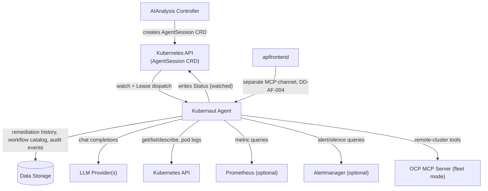

# Kubernaut Agent - Integration Points

**Version**: 1.0
**Last Updated**: 2026-08-02
**Status**: ✅ Current

---

## Purpose

Documents every upstream (calls into KA) and downstream (KA calls out to) dependency, grounded in
actual Go imports and client wiring rather than the original design-phase proposal.

---

## Upstream: Who Calls KA

| Caller | Mechanism | Notes |
|---|---|---|
| **AIAnalysis Controller** | Kubernetes API — creates and watches the `AgentSession` CRD | Per [DD-AA-KA-001](../../architecture/decisions/DD-AA-KA-001-agentsession-crd-http-removal.md), AA creates one `AgentSession` per investigation; KA's dispatch `Reconciler` (`internal/kubernautagent/agentsession/dispatcher.go`) watches for it, races other KA replicas for a per-object dispatch `Lease`, and exclusively writes `Status`. AA observes the result via watch — no polling, no HTTP request. The retired HTTP channel (`pkg/agentclient`, `ogen`-generated) is fully deleted (issue #2190). See [api-specification.md](./api-specification.md). |
| **apifrontend (AF)** | MCP, via `pkg/apifrontend/ka/mcp_sdk_client.go` | Separate, independent channel — "AF owns triage, KA owns investigation" ([DD-AF-004](../../architecture/decisions/DD-AF-004-investigation-tool-split.md)). Untouched by DD-AA-KA-001; not documented further here. |

---

## Downstream: What KA Calls

### Data Storage

KA uses the generated `pkg/datastorage/ogen-client` for three distinct purposes:

| Purpose | Client usage | Reference |
|---|---|---|
| **Remediation history enrichment** | Fetches Tier 1 (24h detailed) and Tier 2 (90d summary) remediation history | [DD-KA-016](../../architecture/decisions/DD-KA-016-remediation-history-context.md) |
| **Workflow catalog discovery** | `list_available_actions` / `list_workflows` / `get_workflow` three-step protocol | [DD-KA-017](../../architecture/decisions/DD-KA-017-three-step-workflow-discovery-integration.md) |
| **Audit event persistence** | Buffered audit event store (`internal/kubernautagent/audit/ds_buffered_store.go`) writes to the unified audit table | [security/AUDIT_EVENT_CATALOG.md](./security/AUDIT_EVENT_CATALOG.md), [ADR-034](../../architecture/decisions/ADR-034-unified-audit-table-design.md) |

### LLM Providers

Direct SDK/HTTP clients (no `langchaingo`) for: VertexAI, Anthropic, Gemini, OpenAI, Azure OpenAI,
Ollama, vLLM, LlamaStack, Mistral, HuggingFace TGI, DeepSeek. Bedrock is partially scaffolded but
not fully implemented. Provider/model identity is configured per-phase (RCA, workflow discovery,
validation) — see [configuration-reference.md](./configuration-reference.md).

### Kubernetes API

Built-in toolset — read access to cluster resources (Get/List/Describe), pod logs, node info, plus
limited event-write capability for investigation annotations. Every Secret Get/List emits a
dedicated audit event (detective control) per
[BR-AUDIT-011](../../requirements/BR-AUDIT-011-kubernautagent-secret-read-audit.md). RBAC is
documented in [security-configuration.md](./security-configuration.md).

### Prometheus (configurable toolset)

Queries metrics for RCA evidence when enabled in the toolset configuration.

### Alertmanager (configurable toolset)

Queries alerts/silences for RCA evidence when enabled. **Not** Grafana — Grafana integration does
not exist despite being mentioned in some older design-phase documents (see
[overview.md](./overview.md) for the corrected toolset list).

### OCP MCP Server (Fleet / Multi-Cluster mode only)

For investigations spanning multiple clusters, KA contacts remote clusters' MCP servers directly
(rather than through an intermediate MCP Gateway hop) — see
[ADR-064](../../architecture/decisions/ADR-064-multi-cluster-mcp-gateway.md).

---

## Dependency Diagram

---

## Related Documentation

- [overview.md](./overview.md) — architecture overview
- [api-specification.md](./api-specification.md) — the API AIAnalysis calls
- [security-configuration.md](./security-configuration.md) — RBAC for the Kubernetes toolset
- [configuration-reference.md](./configuration-reference.md) — LLM provider configuration
