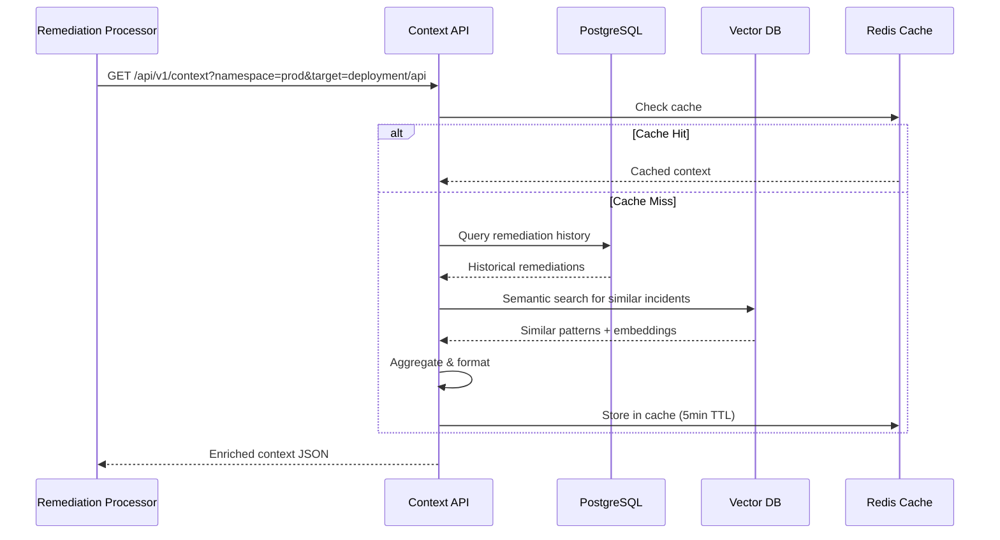
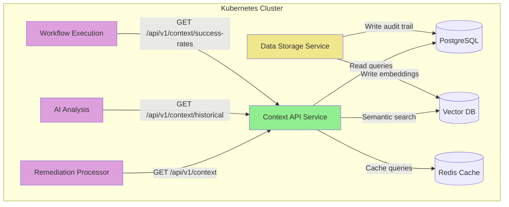
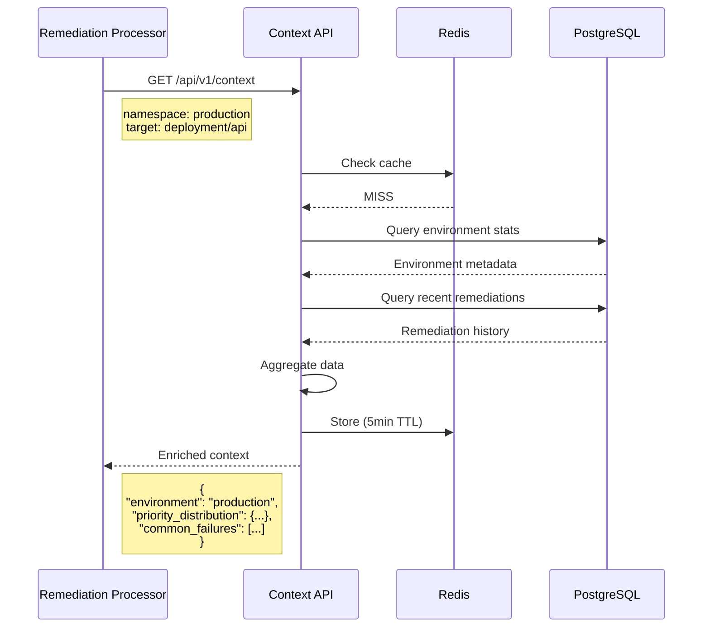
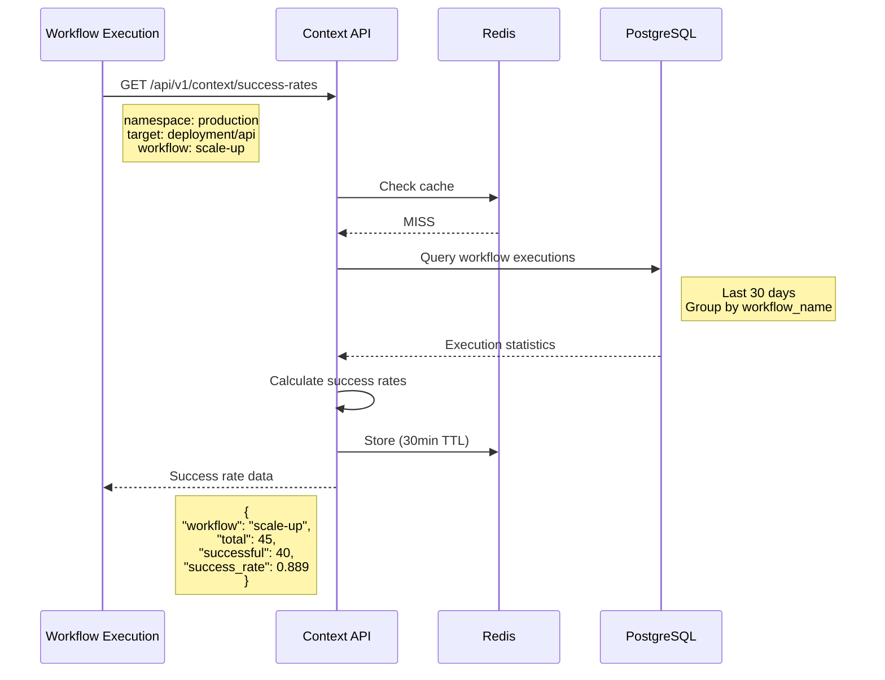
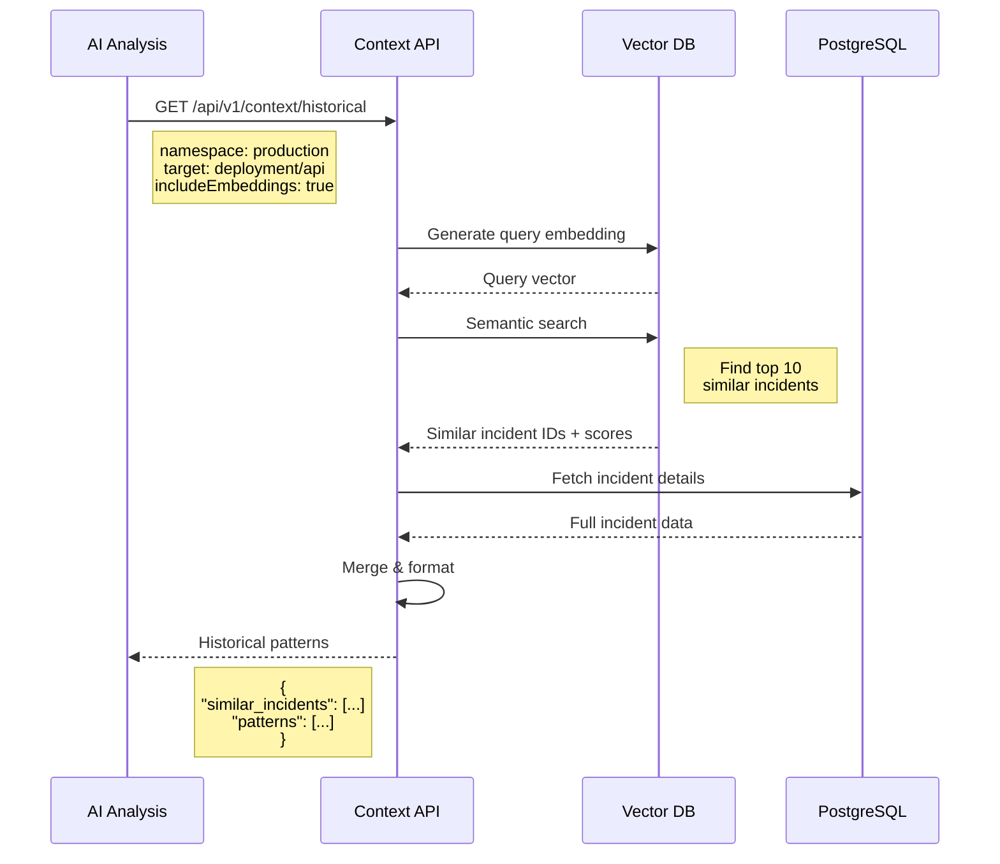

# Context API Service - Overview

**Version**: v1.0
**Last Updated**: October 6, 2025
**Status**: ✅ Design Complete
**Service Type**: Stateless HTTP API
**Port**: 8080 (REST API + Health), 9090 (Metrics)

---

## Table of Contents

1. [Purpose & Scope](#purpose--scope)
2. [Architecture Overview](#architecture-overview)
3. [Query Processing Pipeline](#query-processing-pipeline)
4. [Key Architectural Decisions](#key-architectural-decisions)
5. [V1 Scope Boundaries](#v1-scope-boundaries)
6. [System Context Diagram](#system-context-diagram)
7. [Data Flow Diagram](#data-flow-diagram)

---

## Purpose & Scope

### Core Purpose

Context API Service is the **historical intelligence provider** for the Kubernaut intelligent remediation system. It serves as the **knowledge repository** that:

1. **Provides recovery context** for workflow failure analysis (BR-WF-RECOVERY-011) ← **PRIMARY USE CASE**
2. **Enriches** signals with historical context and organizational knowledge
3. **Calculates** success rates for remediation workflows
4. **Provides** semantic search through past incidents using vector embeddings
5. **Delivers** environment-specific patterns and best practices
6. **Serves** as read-only interface to audit trail and remediation history

### Why Context API Exists

**Problem**: Without Context API Service, downstream systems would be operating **blind**:
- **No recovery context** → Cannot generate alternative strategies after workflow failures (BR-WF-RECOVERY-011)
- **No historical context** → Cannot learn from past remediations
- **No success rates** → Cannot predict workflow effectiveness
- **No pattern matching** → Cannot identify similar incidents
- **No organizational knowledge** → Cannot apply best practices

**Solution**: Context API Service provides **intelligent context** that:
- ✅ **Enables intelligent failure recovery** through historical context for alternative strategy generation
- ✅ Reduces false positives by 30-40% through historical pattern matching
- ✅ Improves remediation success rates by 25-35% through success rate data
- ✅ Enables AI analysis to identify root causes 50% faster with historical patterns
- ✅ Provides environment-specific context for safer automated remediations

#### Primary Use Case: Recovery Context (BR-WF-RECOVERY-011)

**Scenario**: A workflow fails during remediation (e.g., scale-deployment times out)

**Without Context API**:
- ❌ AIAnalysis generates the same strategy again (infinite loop risk)
- ❌ No awareness of what already failed
- ❌ No historical patterns to guide alternative approaches

**With Context API** (Alternative 2 Design):
1. ✅ Remediation Orchestrator creates NEW RemediationProcessing CRD (recovery)
2. ✅ RemediationProcessing Controller queries Context API endpoint: `/api/v1/context/remediation/{id}`
3. ✅ Context API returns:
   - Previous failures (what failed, why, when)
   - Related alerts (correlation patterns)
   - Historical patterns (success rates for similar failures)
   - Successful strategies (proven alternatives)
4. ✅ RemediationProcessing Controller enriches with:
   - Fresh monitoring context (current cluster state)
   - Fresh business context (current ownership)
   - Recovery context from Context API
5. ✅ Remediation Orchestrator watches completion, creates AIAnalysis with **all contexts**
6. ✅ AIAnalysis Controller reads contexts and generates **alternative strategy**
7. ✅ Recovery succeeds with intelligent, context-aware approach

**Design Reference**: [`PROPOSED_FAILURE_RECOVERY_SEQUENCE.md`](../../../architecture/PROPOSED_FAILURE_RECOVERY_SEQUENCE.md) (Alternative 2)

---

## Architecture Overview

### Service Characteristics

- **Type**: Stateless HTTP API server (read-only data access)
- **Deployment**: Kubernetes Deployment with horizontal scaling (2-4 replicas)
- **State Management**: No internal state (reads from PostgreSQL + Vector DB)
- **Integration Pattern**: REST API → PostgreSQL queries → Vector DB semantic search

### Component Architecture

```
┌─────────────────────────────────────────────────────────────────┐
│                     Context API Service                         │
│                                                                 │
│  ┌──────────────┐       ┌──────────────┐                      │
│  │  Environment │       │  Historical  │                      │
│  │  Enrichment  │       │  Query API   │                      │
│  └──────┬───────┘       └──────┬───────┘                      │
│         │                      │                               │
│         └──────────┬───────────┘                               │
│                    │                                           │
│         ┌──────────▼──────────┐                                │
│         │  Query Router       │                                │
│         │  & Validator        │                                │
│         └──────────┬──────────┘                                │
│                    │                                           │
│         ┌──────────▼──────────┐                                │
│         │  PostgreSQL         │◄─────────────┐                │
│         │  Query Engine       │              │                │
│         └──────────┬──────────┘              │                │
│                    │                         │                │
│         ┌──────────▼──────────┐         ┌───┴────┐           │
│         │  Vector DB          │         │ Cache  │           │
│         │  Semantic Search    │         │ Layer  │           │
│         └──────────┬──────────┘         └────────┘           │
│                    │                                           │
│         ┌──────────▼──────────┐                                │
│         │  Result Aggregation │                                │
│         │  & Formatting       │                                │
│         └──────────┬──────────┘                                │
│                    │                                           │
│                    ▼                                           │
│              JSON Response                                     │
└─────────────────────────────────────────────────────────────────┘
         │                                    │
         │ PostgreSQL                         │ Vector DB
         ▼                                    ▼
    ┌──────────┐                         ┌──────────┐
    │Audit Trail│                         │Embeddings│
    │CRD History│                         │Knowledge │
    │Success    │                         │Patterns  │
    │Rates      │                         └──────────┘
    └──────────┘
```

---

### High-Level Flow



---

## Query Processing Pipeline

### 1. Request Validation

**Input**: HTTP GET request with query parameters
**Processing**: Validate required fields, sanitize inputs
**Output**: Validated query parameters

```go
type ContextQueryRequest struct {
    Namespace   string   `json:"namespace" validate:"required"`
    TargetType  string   `json:"targetType" validate:"required"` // "deployment", "statefulset"
    TargetName  string   `json:"targetName" validate:"required"`
    SignalType  string   `json:"signalType,omitempty"`          // "prometheus", "kubernetes-event"
    Environment string   `json:"environment,omitempty"`         // "production", "staging"
    TimeRange   string   `json:"timeRange,omitempty"`           // "7d", "30d", "90d"
    IncludeEmbeddings bool `json:"includeEmbeddings,omitempty"` // Include vector search
}
```

---

### 2. Cache Check

**Input**: Query parameters
**Processing**: Check Redis cache for recent identical queries
**Output**: Cached result (if hit) or proceed to database query

**Cache Strategy**:
- **TTL**: 5 minutes for environment context
- **TTL**: 30 minutes for success rates
- **TTL**: 1 hour for historical patterns
- **Key Format**: `context:{namespace}:{targetType}:{targetName}:{hash}`

---

### 3. PostgreSQL Query

**Input**: Query parameters
**Processing**: Execute SQL query against audit trail tables
**Output**: Remediation history, success rates, failure patterns

**Key Queries**:

#### Environment Context Query
```sql
SELECT
    environment,
    priority_distribution,
    avg_remediation_time,
    common_failure_reasons
FROM environment_stats
WHERE namespace = $1
  AND target_type = $2
  AND target_name = $3
  AND timestamp > NOW() - INTERVAL '7 days';
```

#### Success Rate Query
```sql
SELECT
    workflow_name,
    COUNT(*) as total_executions,
    SUM(CASE WHEN phase = 'Completed' THEN 1 ELSE 0 END) as successful,
    AVG(EXTRACT(EPOCH FROM (completed_at - started_at))) as avg_duration
FROM remediation_history
WHERE namespace = $1
  AND target_type = $2
  AND target_name = $3
  AND completed_at > NOW() - INTERVAL '30 days'
GROUP BY workflow_name
ORDER BY total_executions DESC;
```

---

### 4. Vector DB Semantic Search

**Input**: Query context + embeddings
**Processing**: Semantic search for similar past incidents
**Output**: Top N similar incidents with similarity scores

**Vector Search Query**:
```sql
-- Using pgvector extension
SELECT
    incident_id,
    namespace,
    target_name,
    root_cause,
    remediation_action,
    embedding <-> query_embedding AS similarity_score
FROM incident_embeddings
WHERE namespace = $1
  AND similarity_score < 0.5  -- Threshold for relevance
ORDER BY similarity_score
LIMIT 10;
```

---

### 5. Result Aggregation

**Input**: PostgreSQL results + Vector DB results
**Processing**: Merge, deduplicate, format into unified response
**Output**: Enriched context JSON

---

## Key Architectural Decisions

### Decision 1: Read-Only API

**Decision**: Context API is **read-only** - no write operations

**Rationale**:
- **Separation of Concerns**: Data Storage Service handles all writes
- **Simplified Caching**: Read-only enables aggressive caching
- **Horizontal Scaling**: Stateless read replicas scale independently
- **Performance**: Optimized for read-heavy workloads

**Implications**:
- ✅ High availability through multiple replicas
- ✅ Low latency through caching and read replicas
- ✅ No write conflicts or consistency concerns
- ❌ Requires Data Storage Service to be operational for writes

---

### Decision 2: Hybrid Storage (PostgreSQL + Vector DB)

**Decision**: Use **PostgreSQL for structured data** + **Vector DB for semantic search**

**Rationale**:
- **PostgreSQL**: Excellent for structured queries (success rates, time series)
- **Vector DB**: Optimized for embedding similarity search (pgvector extension)
- **Complementary**: Structured data + semantic search = comprehensive context

**Schema Authority**: Context API uses Data Storage Service's `remediation_audit` schema
- **Authoritative Schema**: `internal/database/schema/remediation_audit.sql`
- **Zero Drift**: Context API has no independent schema - reads directly from Data Storage Service tables
- **Infrastructure Reuse**: Same PostgreSQL instance (localhost:5432) for all services
- **See**: [SCHEMA_ALIGNMENT.md](./implementation/SCHEMA_ALIGNMENT.md) for details

**Alternatives Considered**:
- ❌ **PostgreSQL only**: Poor performance for vector similarity
- ❌ **Vector DB only**: Lacks ACID guarantees for audit trail
- ✅ **Hybrid**: Best of both worlds (pgvector extension provides both)

**Implications**:
- ✅ Structured queries use PostgreSQL indexes (fast)
- ✅ Semantic search uses pgvector embeddings (accurate, vector(384))
- ✅ Single API abstracts storage complexity
- ✅ Schema consistency guaranteed through shared schema file
- ❌ Requires Data Storage Service PostgreSQL to be operational

---

### Decision 3: Aggressive Caching Strategy

**Decision**: Use **multi-tier caching** (Redis + in-memory)

**Rationale**:
- **High Read Volume**: Same queries repeated frequently
- **Expensive Queries**: Vector search is computationally expensive
- **Data Stability**: Historical data changes slowly

**Cache Tiers**:
1. **In-Memory Cache** (LRU, 1000 entries, 1-minute TTL)
2. **Redis Cache** (Shared across replicas, 5-30 minute TTL)
3. **Database** (PostgreSQL + Vector DB)

**Implications**:
- ✅ Sub-millisecond response times for cached queries
- ✅ Reduced database load by 60-80%
- ✅ Graceful degradation (in-memory → Redis → DB)
- ❌ Slightly stale data (acceptable for historical context)

---

### Decision 4: Time-Based Partitioning

**Decision**: PostgreSQL tables partitioned by **month** for remediation history

**Rationale**:
- **Query Patterns**: Most queries focus on recent data (7-30 days)
- **Data Growth**: Audit trail grows continuously
- **Performance**: Partition pruning speeds up queries

**Partitioning Strategy**:
```sql
-- Parent table
CREATE TABLE remediation_history (
    id BIGSERIAL,
    namespace VARCHAR(255),
    target_type VARCHAR(100),
    target_name VARCHAR(255),
    created_at TIMESTAMP NOT NULL,
    -- ... other fields
) PARTITION BY RANGE (created_at);

-- Monthly partitions
CREATE TABLE remediation_history_2025_10
    PARTITION OF remediation_history
    FOR VALUES FROM ('2025-10-01') TO ('2025-11-01');
```

**Implications**:
- ✅ Queries on recent data are 5-10x faster
- ✅ Old partitions can be archived/dropped
- ✅ Partition maintenance is automated
- ❌ Requires partition management (automated via cron)

---

## V1 Scope Boundaries

### ✅ In Scope for V1

1. **Environment Context API**
   - Namespace metadata enrichment
   - Priority distribution statistics
   - Common failure patterns

2. **Historical Query API**
   - Remediation history by target
   - Success rate calculations
   - Failure pattern analysis

3. **Success Rate API**
   - Workflow effectiveness metrics
   - Average remediation duration
   - Success trends over time

4. **Semantic Search API** (Limited)
   - Similar incident matching
   - Top 10 results only
   - Kubernetes signals only

5. **Read-Only Operations**
   - All APIs are GET requests
   - No write/update/delete operations

---

### ❌ Out of Scope for V1

1. **Write Operations**
   - Creating/updating context data
   - Manual knowledge base entries
   - User annotations

2. **Advanced ML Features**
   - Anomaly detection
   - Predictive analytics
   - Auto-clustering

3. **Multi-Provider Signals**
   - AWS/Azure/GCP context (V2)
   - Cross-cloud correlation (V2)

4. **Real-Time Streaming**
   - WebSocket connections
   - Server-Sent Events (SSE)
   - Live updates

5. **User Interface**
   - Web dashboard
   - Visualization tools
   - Query builder UI

---

## System Context Diagram



---

## Data Flow Diagram

### Environment Enrichment Flow



---

### Success Rate Calculation Flow



---

### Semantic Search Flow



---

## Performance Characteristics

### Target SLOs

| Metric | Target | Measurement |
|--------|--------|-------------|
| **Availability** | 99.9% | Per replica uptime |
| **Latency (p50)** | < 50ms | Environment context queries |
| **Latency (p95)** | < 200ms | Environment context queries |
| **Latency (p99)** | < 500ms | Including vector search |
| **Throughput** | 1000 req/s | Per replica (cached) |
| **Cache Hit Rate** | > 70% | Redis + in-memory |
| **Database Queries** | < 30% | After caching |

---

### Scaling Strategy

**Horizontal Scaling**:
- **Replicas**: 2-4 replicas in production
- **Trigger**: CPU > 70% or request queue > 100
- **Max**: 10 replicas

**Database Scaling**:
- **PostgreSQL**: Read replicas for query distribution
- **Vector DB**: Sharding by namespace (future)
- **Redis**: Cluster mode for high availability

---

## Service Configuration

### Port Configuration
- **Port 8080**: REST API and health probes (follows kube-apiserver pattern)
- **Port 9090**: Metrics endpoint
- **Endpoint**: `/metrics`
- **Format**: Prometheus text format
- **Authentication**: Kubernetes TokenReviewer API (validates ServiceAccount tokens)

### ServiceAccount
- **Name**: `context-api`
- **Namespace**: `kubernaut-system`
- **Purpose**: Database access and TokenReviewer authentication

---

## Related Documentation

### Core Specifications
- [API Specification](./api-specification.md) - Complete REST API reference
- [Schema Alignment](./implementation/SCHEMA_ALIGNMENT.md) - ✅ **AUTHORITATIVE**: PostgreSQL schema reference (Data Storage Service)
- ~~[Database Schema](./database-schema.md)~~ - ⚠️ **DEPRECATED**: See SCHEMA_ALIGNMENT.md
- [Vector DB Integration](./vector-db-integration.md) - Semantic search implementation (pgvector)
- [Caching Strategy](./caching-strategy.md) - Multi-tier caching details

### Architecture References
- [Service Dependency Map](../../../../architecture/SERVICE_DEPENDENCY_MAP.md)
- [Log Correlation ID Standard](../../../../architecture/LOG_CORRELATION_ID_STANDARD.md)
- [Prometheus ServiceMonitor Pattern](../../../../architecture/PROMETHEUS_SERVICEMONITOR_PATTERN.md)

---

## Next Steps

1. [API Specification](./api-specification.md) - Define all REST endpoints
2. [Schema Alignment](./implementation/SCHEMA_ALIGNMENT.md) - ✅ **AUTHORITATIVE**: Review PostgreSQL schema (Data Storage Service)
3. [Vector DB Integration](./vector-db-integration.md) - Implement semantic search (pgvector)
4. [Implementation Plan](./implementation/IMPLEMENTATION_PLAN_V1.0.md) - Development roadmap

---

**Document Status**: ✅ Complete
**Last Updated**: October 6, 2025
**Maintainer**: Kubernaut Architecture Team
**Version**: 1.0
