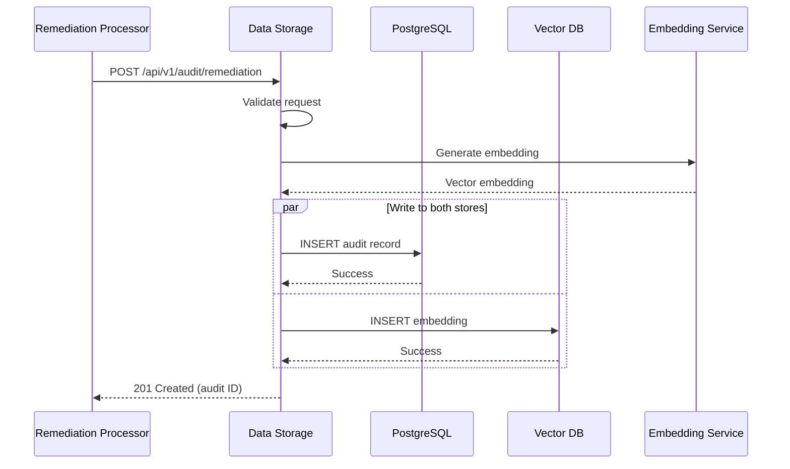
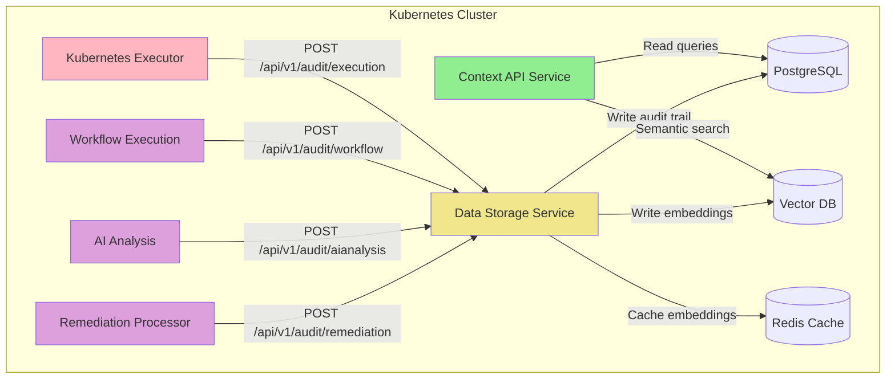
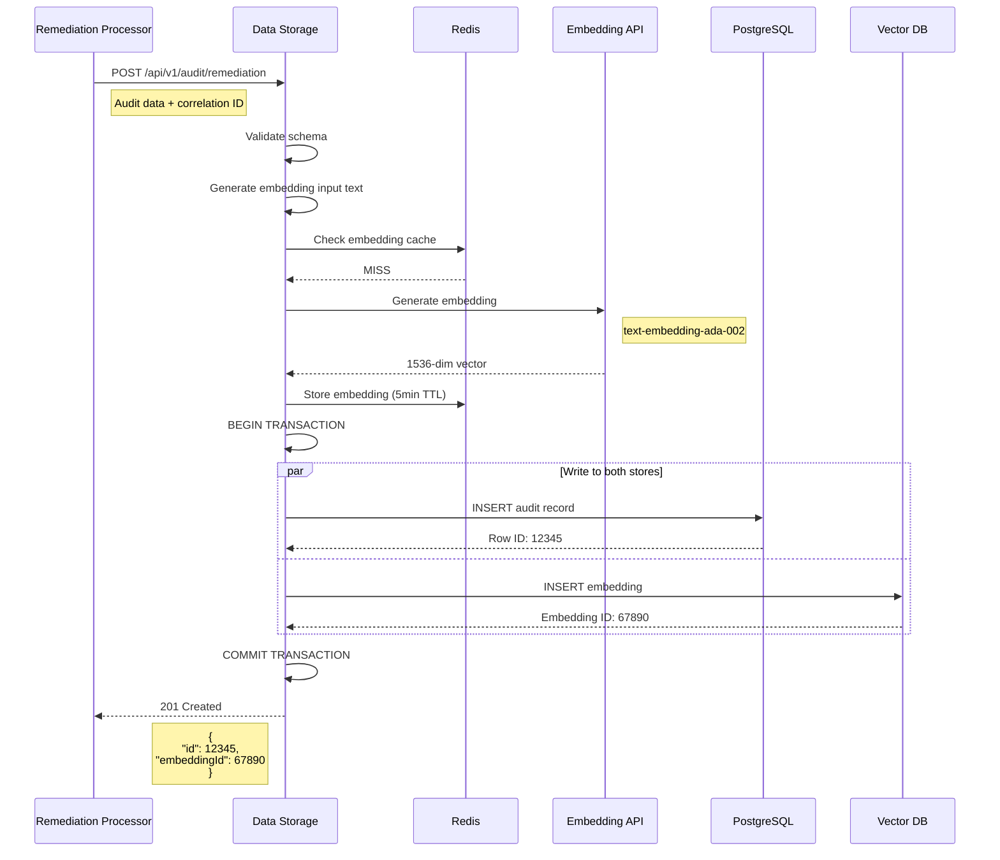

# Data Storage Service - Overview

**Version**: v1.0
**Last Updated**: October 6, 2025
**Status**: ✅ Design Complete
**Service Type**: Stateless HTTP API (Write-Focused)
**Port**: 8080 (REST API + Health), 9090 (Metrics)

---

## Table of Contents

1. [Purpose & Scope](#purpose--scope)
2. [Architecture Overview](#architecture-overview)
3. [Write Processing Pipeline](#write-processing-pipeline)
4. [Key Architectural Decisions](#key-architectural-decisions)
5. [V1 Scope Boundaries](#v1-scope-boundaries)
6. [System Context Diagram](#system-context-diagram)
7. [Data Flow Diagram](#data-flow-diagram)

---

## Purpose & Scope

### Core Purpose

Data Storage Service is the **centralized persistence layer** for the Kubernaut intelligent remediation system. It serves as the **write gateway** that:

1. **Persists** audit trail for all CRD lifecycle events
2. **Generates** vector embeddings for semantic search
3. **Stores** structured data in PostgreSQL for queries
4. **Writes** embeddings to Vector DB for similarity matching
5. **Validates** audit data for compliance and integrity

### Why Data Storage Service Exists

**Problem**: Without Data Storage Service, downstream systems would:
- **Directly write to databases** → Tight coupling and inconsistent schemas
- **Duplicate embedding logic** → Inconsistent vector representations
- **Lack audit trail** → No historical analysis or compliance tracking
- **Miss data validation** → Corrupt or incomplete audit records

**Solution**: Data Storage Service provides **centralized write operations** that:
- ✅ Single source of truth for all audit trail writes
- ✅ Consistent embedding generation across all incident types
- ✅ Schema validation before persistence
- ✅ Automatic cleanup and archival of old data

---

## Architecture Overview

### Service Characteristics

- **Type**: Stateless HTTP API server (write-focused)
- **Deployment**: Kubernetes Deployment with horizontal scaling (2-3 replicas)
- **State Management**: No internal state (writes to PostgreSQL + Vector DB)
- **Integration Pattern**: REST POST API → Validation → PostgreSQL + Vector DB writes

### Component Architecture

```
┌─────────────────────────────────────────────────────────────────┐
│                  Data Storage Service                           │
│                                                                 │
│  ┌──────────────┐       ┌──────────────┐                      │
│  │  Remediation │       │  Workflow    │                      │
│  │  Audit API   │       │  Audit API   │                      │
│  └──────┬───────┘       └──────┬───────┘                      │
│         │                      │                               │
│         └──────────┬───────────┘                               │
│                    │                                           │
│         ┌──────────▼──────────┐                                │
│         │  Request Validation │                                │
│         │  & Schema Check     │                                │
│         └──────────┬──────────┘                                │
│                    │                                           │
│         ┌──────────▼──────────┐                                │
│         │  Embedding          │                                │
│         │  Generation         │                                │
│         └──────────┬──────────┘                                │
│                    │                                           │
│         ┌──────────▼──────────┐                                │
│         │  PostgreSQL         │                                │
│         │  Write Engine       │                                │
│         └──────────┬──────────┘                                │
│                    │                                           │
│         ┌──────────▼──────────┐                                │
│         │  Vector DB          │                                │
│         │  Write Engine       │                                │
│         └──────────┬──────────┘                                │
│                    │                                           │
│         ┌──────────▼──────────┐                                │
│         │  Response           │                                │
│         │  Formatting         │                                │
│         └──────────┬──────────┘                                │
│                    │                                           │
│                    ▼                                           │
│              201 Created                                       │
└─────────────────────────────────────────────────────────────────┘
         │                                    │
         │ PostgreSQL (write)                 │ Vector DB (write)
         ▼                                    ▼
    ┌──────────┐                         ┌──────────┐
    │Audit Trail│                         │Embeddings│
    │CRD History│                         │Knowledge │
    │Partitioned│                         │Base      │
    └──────────┘                         └──────────┘
```

---

### High-Level Flow



---

## Write Processing Pipeline

### 1. Request Validation

**Input**: HTTP POST request with audit data
**Processing**: Validate schema, required fields, data types
**Output**: Validated audit record

```go
type RemediationAuditRequest struct {
    // CRD identification
    Name      string `json:"name" validate:"required"`
    Namespace string `json:"namespace" validate:"required"`

    // Signal details
    SignalType      string `json:"signalType" validate:"required"`
    SignalName      string `json:"signalName" validate:"required"`
    SignalNamespace string `json:"signalNamespace" validate:"required"`

    // Target details
    TargetType      string `json:"targetType" validate:"required"`
    TargetName      string `json:"targetName" validate:"required"`
    TargetNamespace string `json:"targetNamespace" validate:"required"`

    // Status
    Phase   string `json:"phase" validate:"required"`
    Message string `json:"message,omitempty"`

    // Timestamps
    CreatedAt   time.Time  `json:"createdAt" validate:"required"`
    StartedAt   *time.Time `json:"startedAt,omitempty"`
    CompletedAt *time.Time `json:"completedAt,omitempty"`

    // Metadata
    CorrelationID string            `json:"correlationId" validate:"required"`
    Labels        map[string]string `json:"labels,omitempty"`
}
```

---

### 2. Embedding Generation

**Input**: Audit record text (signal name + root cause + action)
**Processing**: Generate vector embedding using LLM API
**Output**: 1536-dimensional vector (OpenAI ada-002 format)

**Embedding Strategy**:
- **Input**: Concatenate signal name, root cause, remediation action
- **Model**: text-embedding-ada-002 (OpenAI) or local embedding model
- **Output**: 1536-dimensional float32 vector
- **Caching**: Cache embeddings for identical inputs (5-minute TTL)

---

### 3. PostgreSQL Write

**Input**: Validated audit record
**Processing**: INSERT into appropriate table (remediation_requests, etc.)
**Output**: Database row ID

**Transaction Strategy**:
- **Single Transaction**: All writes in one transaction
- **Rollback on Failure**: If Vector DB write fails, rollback PostgreSQL
- **Retry Logic**: 3 retries with exponential backoff

---

### 4. Vector DB Write

**Input**: Embedding vector + metadata
**Processing**: INSERT into incident_embeddings table
**Output**: Embedding ID

**Vector Storage**:
```sql
INSERT INTO incident_embeddings (
    remediation_request_id,
    namespace,
    target_type,
    target_name,
    signal_type,
    root_cause,
    embedding
) VALUES ($1, $2, $3, $4, $5, $6, $7);
```

---

### 5. Response Generation

**Input**: Database write results
**Processing**: Format success response with audit ID
**Output**: HTTP 201 Created

---

## Key Architectural Decisions

### Decision 1: Write-Only API

**Decision**: Data Storage is **write-only** - no read operations

**Rationale**:
- **Separation of Concerns**: Context API handles all reads
- **Optimized for Writes**: No query optimization needed
- **Simplified Caching**: No cache invalidation complexity
- **Clear Responsibility**: Single-purpose service

**Implications**:
- ✅ Optimized write performance
- ✅ Simple API contract (POST only)
- ✅ No cache management overhead
- ❌ Requires Context API for any queries

---

### Decision 2: Dual-Write Pattern (PostgreSQL + Vector DB)

**Decision**: Write to **both** PostgreSQL and Vector DB in same transaction

**Rationale**:
- **Consistency**: Ensure structured data and embeddings stay in sync
- **Atomicity**: Either both succeed or both fail
- **No Async Jobs**: Avoid complexity of async embedding generation

**Alternatives Considered**:
- ❌ **Async Embedding**: Complex, introduces eventual consistency
- ❌ **PostgreSQL Only**: No semantic search capability
- ✅ **Dual-Write**: Simple, consistent, synchronous

**Implications**:
- ✅ Data consistency guaranteed
- ✅ Simple error handling
- ✅ No message queue needed
- ❌ Slightly higher write latency (acceptable: ~200ms)

---

### Decision 3: Embedding Generation Strategy

**Decision**: Generate embeddings **on-the-fly** during audit write

**Rationale**:
- **Freshness**: Embeddings are immediately available
- **Simplicity**: No background jobs or queues
- **Consistency**: Embedding generation is deterministic

**Caching Strategy**:
- **Cache Key**: SHA256 hash of embedding input text
- **Cache Value**: Pre-generated embedding vector
- **TTL**: 5 minutes (balance freshness vs. cache hits)
- **Hit Rate**: Estimated 20-30% (similar incidents repeat)

**Implications**:
- ✅ No embedding generation delays
- ✅ Cache reduces LLM API costs by 20-30%
- ✅ Simple implementation
- ❌ Write latency includes embedding generation (~100-150ms)

---

### Decision 4: Schema Validation on Write

**Decision**: Validate all audit data **before** database write

**Rationale**:
- **Data Quality**: Prevent corrupt or incomplete audit records
- **Early Failure**: Fail fast if data is invalid
- **Client Feedback**: Return clear validation errors

**Validation Rules**:
- **Required Fields**: name, namespace, signalType, phase, createdAt, correlationId
- **Enum Validation**: phase in ['Pending', 'Processing', 'Completed', 'Failed']
- **Timestamp Logic**: startedAt <= completedAt if both present
- **Length Limits**: name <= 255 chars, message <= 10KB

**Implications**:
- ✅ High data quality
- ✅ Clear error messages
- ✅ No corrupt audit trail
- ❌ Slightly increased write latency (~10ms)

---

## V1 Scope Boundaries

### ✅ In Scope for V1

1. **Audit Trail Writes**
   - Remediation request audit
   - AI analysis audit
   - Workflow execution audit
   - Kubernetes execution audit

2. **Embedding Generation**
   - OpenAI ada-002 integration
   - Local embedding model fallback
   - Embedding caching

3. **Dual-Write**
   - PostgreSQL structured data
   - Vector DB embeddings
   - Transaction consistency

4. **Validation**
   - Schema validation
   - Required field checks
   - Enum validation

5. **Synchronous API**
   - POST endpoints only
   - 201 Created responses
   - Error handling

---

### ❌ Out of Scope for V1

1. **Read Operations**
   - Query endpoints (handled by Context API)
   - Search functionality
   - Analytics queries

2. **Async Processing**
   - Message queues
   - Background jobs
   - Webhook notifications

3. **Bulk Operations**
   - Batch inserts
   - Bulk updates
   - Mass delete

4. **Data Migration**
   - Import/export tools
   - Schema migrations
   - Data transformations

5. **Advanced Features**
   - Multi-model embeddings
   - Custom embedding models
   - Embedding fine-tuning

---

## System Context Diagram



---

## Data Flow Diagram

### Audit Write Flow



---

## Performance Characteristics

### Target SLOs

| Metric | Target | Measurement |
|--------|--------|-------------|
| **Availability** | 99.9% | Per replica uptime |
| **Latency (p50)** | < 100ms | Cached embeddings |
| **Latency (p95)** | < 250ms | Fresh embeddings |
| **Latency (p99)** | < 500ms | Including retries |
| **Throughput** | 500 writes/s | Per replica |
| **Cache Hit Rate** | > 25% | Embedding cache |
| **Write Success Rate** | > 99.5% | Transactional writes |

---

### Scaling Strategy

**Horizontal Scaling**:
- **Replicas**: 2-3 replicas in production
- **Trigger**: CPU > 70% or write queue > 50
- **Max**: 5 replicas

**Database Scaling**:
- **PostgreSQL**: Single writer, multiple read replicas (Context API uses read replicas)
- **Vector DB**: Sharding by namespace (future)
- **Redis**: Cluster mode for embedding cache

---

## Service Configuration

### Port Configuration
- **Port 8080**: REST API and health probes (follows kube-apiserver pattern)
- **Port 9090**: Metrics endpoint
- **Endpoint**: `/metrics`
- **Format**: Prometheus text format
- **Authentication**: Kubernetes TokenReviewer API (validates ServiceAccount tokens)

### ServiceAccount
- **Name**: `data-storage`
- **Namespace**: `kubernaut-system`
- **Purpose**: Database writes and TokenReviewer authentication

---

## Related Documentation

### Core Specifications
- [API Specification](./api-specification.md) - Complete REST API reference
- [Database Schema](./database-schema.md) - PostgreSQL write patterns
- [Embedding Strategy](./embedding-strategy.md) - Vector generation details

### Architecture References
- [Context API Service](../context-api/overview.md) - Read counterpart
- [Service Dependency Map](../../../../architecture/SERVICE_DEPENDENCY_MAP.md)
- [Log Correlation ID Standard](../../../../architecture/LOG_CORRELATION_ID_STANDARD.md)

---

## Next Steps

1. [API Specification](./api-specification.md) - Define all POST endpoints
2. [Database Schema](./database-schema.md) - Write patterns and transactions
3. [Embedding Strategy](./embedding-strategy.md) - Generation and caching

---

**Document Status**: ✅ Complete
**Last Updated**: October 6, 2025
**Maintainer**: Kubernaut Architecture Team
**Version**: 1.0
