# Data Storage Service - Overview

**Version**: v2.0 (Phase 1: Read API Complete)
**Last Updated**: November 1, 2025
**Status**: 🚀 Phase 1 Production-Ready (Read API), Phase 2 Planned (Write API)
**Service Type**: Stateless HTTP REST API Gateway (Read + Write)
**Port**: 8080 (REST API + Health), 9090 (Metrics)
**Implementation**: Days 1-8 Complete - 75 Tests (38 Unit, 37 Integration)

---

## Table of Contents

1. [Purpose & Scope](#purpose--scope)
2. [Architecture Overview](#architecture-overview)
3. [Write Processing Pipeline](#write-processing-pipeline)
4. [Key Architectural Decisions](#key-architectural-decisions)
5. [V1 Scope Boundaries](#v1-scope-boundaries)
6. [System Context Diagram](#system-context-diagram)
7. [Data Flow Diagram](#data-flow-diagram)

---

## 🚀 Phase 1: Read API Gateway (Production-Ready)

### Current Implementation Status

**Phase 1** (Read API) is **production-ready** with comprehensive validation:

#### ✅ Implemented Features (BR-STORAGE-021 through BR-STORAGE-028)
- **REST API Read Endpoints**: `GET /api/v1/incidents` (list), `GET /api/v1/incidents/:id` (get single)
- **Query Filtering**: By namespace, severity, cluster, action_type, alert_name with SQL injection protection
- **Pagination**: Limit (1-1000), offset (≥0) with boundary validation
- **RFC 7807 Error Responses**: Standardized error handling with problem details
- **Real PostgreSQL Integration**: Direct database queries with connection pooling
- **DD-007 Graceful Shutdown**: Kubernetes-aware 4-step shutdown pattern
- **Performance**: p95 <250ms, p99 <500ms, large datasets <1s (validated via benchmarks)
- **Unicode Support**: Full UTF-8 support for international incident data

#### 📊 Test Coverage (Defense-in-Depth Strategy)
- **Unit Tests**: 38 tests (70%) - Business logic, validation, SQL builder
- **Integration Tests**: 37 tests (27%) - HTTP + Real PostgreSQL + DD-007 validation
- **E2E Tests**: Deferred to Phase 4 per implementation plan

#### 🔧 Production Infrastructure
- **Database**: PostgreSQL 16 with pgvector extension
- **Deployment**: Kubernetes (deployment.yaml with DD-007 graceful shutdown)
- **Monitoring**: Prometheus metrics, health/readiness probes
- **Security**: SQL injection prevention, parameterized queries, input validation

#### 📈 Performance Benchmarks
- **Standard Queries**: p95 latency <100ms (exceeds <250ms target)
- **Large Result Sets (1000 records)**: p99 <500ms (exceeds <1s target)
- **Concurrent Load**: 50+ QPS sustained throughput
- **Validation Script**: `scripts/run-datastorage-performance-tests.sh`

### Phase 2: Write API Gateway (Planned)

**Phase 2** will add write operations (POST/PUT/DELETE) for:
- Remediation audit trail persistence
- Embedding generation and vector storage
- Workflow audit records
- AI analysis audit records

**See**: [API-GATEWAY-MIGRATION.md](implementation/API-GATEWAY-MIGRATION.md) for phased implementation plan.

---

## Purpose & Scope

### Core Purpose

Data Storage Service is the **centralized persistence layer** for the Kubernaut intelligent remediation system. It serves as the **write gateway** that:

1. **Persists** audit trail for all CRD lifecycle events
2. **Generates** vector embeddings for semantic search
3. **Stores** structured data in PostgreSQL for queries
4. **Writes** embeddings to Vector DB for similarity matching
5. **Validates** audit data for compliance and integrity

### Why Data Storage Service Exists

**Problem**: Without Data Storage Service, downstream systems would:
- **Directly write to databases** → Tight coupling and inconsistent schemas
- **Duplicate embedding logic** → Inconsistent vector representations
- **Lack audit trail** → No historical analysis or compliance tracking
- **Miss data validation** → Corrupt or incomplete audit records

**Solution**: Data Storage Service provides **centralized write operations** that:
- ✅ Single source of truth for all audit trail writes
- ✅ Consistent embedding generation across all incident types
- ✅ Schema validation before persistence
- ✅ Automatic cleanup and archival of old data

---

## Architecture Overview

### Service Characteristics

- **Type**: Stateless HTTP API server (write-focused)
- **Deployment**: Kubernetes Deployment with horizontal scaling (2-3 replicas)
- **State Management**: No internal state (writes to PostgreSQL + Vector DB)
- **Integration Pattern**: REST POST API → Validation → PostgreSQL + Vector DB writes

### Component Architecture

```
┌─────────────────────────────────────────────────────────────────┐
│                  Data Storage Service                           │
│                                                                 │
│  ┌──────────────┐       ┌──────────────┐                      │
│  │  Remediation │       │  Workflow    │                      │
│  │  Audit API   │       │  Audit API   │                      │
│  └──────┬───────┘       └──────┬───────┘                      │
│         │                      │                               │
│         └──────────┬───────────┘                               │
│                    │                                           │
│         ┌──────────▼──────────┐                                │
│         │  Request Validation │                                │
│         │  & Schema Check     │                                │
│         └──────────┬──────────┘                                │
│                    │                                           │
│         ┌──────────▼──────────┐                                │
│         │  Embedding          │                                │
│         │  Generation         │                                │
│         └──────────┬──────────┘                                │
│                    │                                           │
│         ┌──────────▼──────────┐                                │
│         │  PostgreSQL         │                                │
│         │  Write Engine       │                                │
│         └──────────┬──────────┘                                │
│                    │                                           │
│         ┌──────────▼──────────┐                                │
│         │  Vector DB          │                                │
│         │  Write Engine       │                                │
│         └──────────┬──────────┘                                │
│                    │                                           │
│         ┌──────────▼──────────┐                                │
│         │  Response           │                                │
│         │  Formatting         │                                │
│         └──────────┬──────────┘                                │
│                    │                                           │
│                    ▼                                           │
│              201 Created                                       │
└─────────────────────────────────────────────────────────────────┘
         │                                    │
         │ PostgreSQL (write)                 │ Vector DB (write)
         ▼                                    ▼
    ┌──────────┐                         ┌──────────┐
    │Audit Trail│                         │Embeddings│
    │CRD History│                         │Knowledge │
    │Partitioned│                         │Base      │
    └──────────┘                         └──────────┘
```

---

### High-Level Flow


---

## Write Processing Pipeline

### 1. Request Validation

**Input**: HTTP POST request with audit data
**Processing**: Validate schema, required fields, data types
**Output**: Validated audit record

```go
type RemediationAuditRequest struct {
    // CRD identification
    Name      string `json:"name" validate:"required"`
    Namespace string `json:"namespace" validate:"required"`

    // Signal details
    SignalType      string `json:"signalType" validate:"required"`
    SignalName      string `json:"signalName" validate:"required"`
    SignalNamespace string `json:"signalNamespace" validate:"required"`

    // Target details
    TargetType      string `json:"targetType" validate:"required"`
    TargetName      string `json:"targetName" validate:"required"`
    TargetNamespace string `json:"targetNamespace" validate:"required"`

    // Status
    Phase   string `json:"phase" validate:"required"`
    Message string `json:"message,omitempty"`

    // Timestamps
    CreatedAt   time.Time  `json:"createdAt" validate:"required"`
    StartedAt   *time.Time `json:"startedAt,omitempty"`
    CompletedAt *time.Time `json:"completedAt,omitempty"`

    // Metadata
    CorrelationID string            `json:"correlationId" validate:"required"`
    Labels        map[string]string `json:"labels,omitempty"`
}
```

---

### 2. Embedding Generation

**Input**: Audit record text (signal name + root cause + action)
**Processing**: Generate vector embedding using LLM API
**Output**: 1536-dimensional vector (OpenAI ada-002 format)

**Embedding Strategy**:
- **Input**: Concatenate signal name, root cause, remediation action
- **Model**: text-embedding-ada-002 (OpenAI) or local embedding model
- **Output**: 1536-dimensional float32 vector
- **Caching**: Cache embeddings for identical inputs (5-minute TTL)

---

### 3. PostgreSQL Write

**Input**: Validated audit record
**Processing**: INSERT into appropriate table (remediation_requests, etc.)
**Output**: Database row ID

**Transaction Strategy**:
- **Single Transaction**: All writes in one transaction
- **Rollback on Failure**: If Vector DB write fails, rollback PostgreSQL
- **Retry Logic**: 3 retries with exponential backoff

---

### 4. Vector DB Write

**Input**: Embedding vector + metadata
**Processing**: INSERT into incident_embeddings table
**Output**: Embedding ID

**Vector Storage**:
```sql
INSERT INTO incident_embeddings (
    remediation_request_id,
    namespace,
    target_type,
    target_name,
    signal_type,
    root_cause,
    embedding
) VALUES ($1, $2, $3, $4, $5, $6, $7);
```

---

### 5. Response Generation

**Input**: Database write results
**Processing**: Format success response with audit ID
**Output**: HTTP 201 Created

---

## Key Architectural Decisions

### Decision 1: Write-Only API

**Decision**: Data Storage is **write-only** - no read operations

**Rationale**:
- **Separation of Concerns**: Context API handles all reads
- **Optimized for Writes**: No query optimization needed
- **Simplified Caching**: No cache invalidation complexity
- **Clear Responsibility**: Single-purpose service

**Implications**:
- ✅ Optimized write performance
- ✅ Simple API contract (POST only)
- ✅ No cache management overhead
- ❌ Requires Context API for any queries

---

### Decision 2: Dual-Write Pattern (PostgreSQL + Vector DB)

**Decision**: Write to **both** PostgreSQL and Vector DB in same transaction

**Rationale**:
- **Consistency**: Ensure structured data and embeddings stay in sync
- **Atomicity**: Either both succeed or both fail
- **No Async Jobs**: Avoid complexity of async embedding generation

**Alternatives Considered**:
- ❌ **Async Embedding**: Complex, introduces eventual consistency
- ❌ **PostgreSQL Only**: No semantic search capability
- ✅ **Dual-Write**: Simple, consistent, synchronous

**Implications**:
- ✅ Data consistency guaranteed
- ✅ Simple error handling
- ✅ No message queue needed
- ❌ Slightly higher write latency (acceptable: ~200ms)

---

### Decision 3: Embedding Generation Strategy

**Decision**: Generate embeddings **on-the-fly** during audit write

**Rationale**:
- **Freshness**: Embeddings are immediately available
- **Simplicity**: No background jobs or queues
- **Consistency**: Embedding generation is deterministic

**Caching Strategy**:
- **Cache Key**: SHA256 hash of embedding input text
- **Cache Value**: Pre-generated embedding vector
- **TTL**: 5 minutes (balance freshness vs. cache hits)
- **Hit Rate**: Estimated 20-30% (similar incidents repeat)

**Implications**:
- ✅ No embedding generation delays
- ✅ Cache reduces LLM API costs by 20-30%
- ✅ Simple implementation
- ❌ Write latency includes embedding generation (~100-150ms)

---

### Decision 4: Schema Validation on Write

**Decision**: Validate all audit data **before** database write

**Rationale**:
- **Data Quality**: Prevent corrupt or incomplete audit records
- **Early Failure**: Fail fast if data is invalid
- **Client Feedback**: Return clear validation errors

**Validation Rules**:
- **Required Fields**: name, namespace, signalType, phase, createdAt, correlationId
- **Enum Validation**: phase in ['Pending', 'Processing', 'Completed', 'Failed']
- **Timestamp Logic**: startedAt <= completedAt if both present
- **Length Limits**: name <= 255 chars, message <= 10KB

**Implications**:
- ✅ High data quality
- ✅ Clear error messages
- ✅ No corrupt audit trail
- ❌ Slightly increased write latency (~10ms)

---

## V1 Scope Boundaries

### ✅ In Scope for V1

1. **Audit Trail Writes**
   - Remediation request audit
   - AI analysis audit
   - Workflow execution audit
   - Kubernetes execution audit

2. **Embedding Generation**
   - OpenAI ada-002 integration
   - Local embedding model fallback
   - Embedding caching

3. **Dual-Write**
   - PostgreSQL structured data
   - Vector DB embeddings
   - Transaction consistency

4. **Validation**
   - Schema validation
   - Required field checks
   - Enum validation

5. **Synchronous API**
   - POST endpoints only
   - 201 Created responses
   - Error handling

---

### ❌ Out of Scope for V1

1. **Read Operations**
   - Query endpoints (handled by Context API)
   - Search functionality
   - Analytics queries

2. **Async Processing**
   - Message queues
   - Background jobs
   - Webhook notifications

3. **Bulk Operations**
   - Batch inserts
   - Bulk updates
   - Mass delete

4. **Data Migration**
   - Import/export tools
   - Schema migrations
   - Data transformations

5. **Advanced Features**
   - Multi-model embeddings
   - Custom embedding models
   - Embedding fine-tuning

---

## System Context Diagram


---

## Data Flow Diagram

### Audit Write Flow

```mermaid
sequenceDiagram
    participant RP as Remediation Processor
    participant DS as Data Storage
    participant Cache as Redis
    participant Embed as Embedding API
    participant PG as PostgreSQL
    participant VD as Vector DB

    RP->>DS: POST /api/v1/audit/remediation
    Note right of RP: Audit data + correlation ID

    DS->>DS: Validate schema

    DS->>DS: Generate embedding input text
    DS->>Cache: Check embedding cache
    Cache-->>DS: MISS

    DS->>Embed: Generate embedding
    Note right of Embed: text-embedding-ada-002
    Embed-->>DS: 1536-dim vector

    DS->>Cache: Store embedding (5min TTL)

    DS->>DS: BEGIN TRANSACTION

    par Write to both stores
        DS->>PG: INSERT audit record
        PG-->>DS: Row ID: 12345
    and
        DS->>VD: INSERT embedding
        VD-->>DS: Embedding ID: 67890
    end

    DS->>DS: COMMIT TRANSACTION

    DS-->>RP: 201 Created
    Note left of DS: {<br/>  "id": 12345,<br/>  "embeddingId": 67890<br/>}
```



---

## Performance Characteristics

### Target SLOs

| Metric | Target | Measurement |
|--------|--------|-------------|
| **Availability** | 99.9% | Per replica uptime |
| **Latency (p50)** | < 100ms | Cached embeddings |
| **Latency (p95)** | < 250ms | Fresh embeddings |
| **Latency (p99)** | < 500ms | Including retries |
| **Throughput** | 500 writes/s | Per replica |
| **Cache Hit Rate** | > 25% | Embedding cache |
| **Write Success Rate** | > 99.5% | Transactional writes |

---

### Scaling Strategy

**Horizontal Scaling**:
- **Replicas**: 2-3 replicas in production
- **Trigger**: CPU > 70% or write queue > 50
- **Max**: 5 replicas

**Database Scaling**:
- **PostgreSQL**: Single writer, multiple read replicas (Context API uses read replicas)
- **Vector DB**: Sharding by namespace (future)
- **Redis**: Cluster mode for embedding cache

---

## Service Configuration

### Port Configuration
- **Port 8080**: REST API and health probes (follows kube-apiserver pattern)
- **Port 9090**: Metrics endpoint
- **Endpoint**: `/metrics`
- **Format**: Prometheus text format
- **Authentication**: Kubernetes TokenReviewer API (validates ServiceAccount tokens)

### ServiceAccount
- **Name**: `data-storage`
- **Namespace**: `kubernaut-system`
- **Purpose**: Database writes and TokenReviewer authentication

---

## Related Documentation

### Core Specifications
- [API Specification](./api-specification.md) - Complete REST API reference
- [Database Schema](./database-schema.md) - PostgreSQL write patterns
- [Embedding Strategy](./embedding-strategy.md) - Vector generation details

### Architecture References
- [Context API Service](../context-api/overview.md) - Read counterpart
- [Service Dependency Map](../../../../architecture/SERVICE_DEPENDENCY_MAP.md)
- [Log Correlation ID Standard](../../../../architecture/LOG_CORRELATION_ID_STANDARD.md)

---

## Next Steps

1. [API Specification](./api-specification.md) - Define all POST endpoints
2. [Database Schema](./database-schema.md) - Write patterns and transactions
3. [Embedding Strategy](./embedding-strategy.md) - Generation and caching

---

**Document Status**: ✅ Complete
**Last Updated**: October 6, 2025
**Maintainer**: Kubernaut Architecture Team
**Version**: 1.0
