# Data Storage Service - Testing Strategy

**Version**: v1.0
**Last Updated**: October 6, 2025
**Service Type**: Stateless HTTP API Service (Write-Focused)

---

## 📋 Testing Pyramid

```
         /\
        /  \  E2E Tests (10-15%)
       /____\
      /      \  Integration Tests (>50%)
     /________\
    /          \  Unit Tests (70%+)
   /____________\
```

| Test Type | Target Coverage | Focus |
|-----------|----------------|-------|
| **Unit Tests** | 70%+ | Validation logic, embedding generation, schema validation |
| **Integration Tests** | >50% | PostgreSQL writes, Vector DB writes, cross-service audit trail |
| **E2E Tests** | 10-15% | Complete audit persistence flow |

---

## 🔴 **TDD Methodology: RED → GREEN → REFACTOR**

**Per APDC-Enhanced TDD** (`.cursor/rules/00-core-development-methodology.mdc`):
- **DO-RED**: Write failing tests defining business contract (aim for 70%+ coverage)
- **DO-GREEN**: Define business interfaces and minimal implementation
- **DO-REFACTOR**: Enhance existing code with sophisticated logic

### **Example: Audit Trail Persistence (BR-STORAGE-001)**

#### **Phase 1: 🔴 RED - Write Failing Test**

```go
// test/unit/storage/audit_trail_test.go
package storage_test

import (
    "context"
<<<<<<< HEAD
=======
    "time"
>>>>>>> crd_implementation

    . "github.com/onsi/ginkgo/v2"
    . "github.com/onsi/gomega"

    "github.com/jordigilh/kubernaut/pkg/storage"
)

var _ = Describe("Audit Trail Persistence (BR-STORAGE-001)", func() {
    var store *storage.AuditStore

    BeforeEach(func() {
        store = storage.NewAuditStore()  // DOESN'T EXIST YET
    })

    It("should persist remediation action to audit trail", func() {
        action := &storage.RemediationAction{
            ID:          "action-123",
            ActionType:  "restart-pod",
            Namespace:   "production",
            Status:      "success",
        }

        err := store.SaveAction(context.Background(), action)

        Expect(err).ToNot(HaveOccurred())
    })
})
```

**Run Tests**:
```bash
go test ./test/unit/storage/...
# RESULT: FAIL - undefined: storage.NewAuditStore
```

✅ **RED Phase Complete**: Test written and failing as expected.

---

#### **Phase 2: 🟢 GREEN - Minimal Implementation**

```go
// pkg/storage/audit_store.go
package storage

import "context"

type RemediationAction struct {
    ID         string
    ActionType string
    Namespace  string
    Status     string
}

type AuditStore struct{}

func NewAuditStore() *AuditStore {
    return &AuditStore{}
}

func (s *AuditStore) SaveAction(ctx context.Context, action *RemediationAction) error {
    // Minimal implementation - just return nil
    return nil
}
```

**Run Tests**:
```bash
go test ./test/unit/storage/...
# RESULT: PASS - all tests passing
```

✅ **GREEN Phase Complete**: Tests passing with minimal implementation.

---

#### **Phase 3: 🔧 REFACTOR - Enhanced Implementation**

```go
// pkg/storage/audit_store.go
package storage

import (
    "context"
    "database/sql"
    "fmt"
    "time"

    "go.uber.org/zap"
)

type RemediationAction struct {
    ID          string
    ActionType  string
    Namespace   string
    Cluster     string
    Status      string
    ErrorMsg    string
    StartTime   time.Time
    EndTime     time.Time
    Metadata    map[string]interface{}
}

type AuditStore struct {
    logger *zap.Logger
    db     *sql.DB
}

func NewAuditStore(logger *zap.Logger, db *sql.DB) *AuditStore {
    return &AuditStore{
        logger: logger,
        db:     db,
    }
}

func (s *AuditStore) SaveAction(ctx context.Context, action *RemediationAction) error {
    // Validate action data
    if action.ID == "" {
        return fmt.Errorf("action ID is required")
    }

    // Insert into PostgreSQL with prepared statement
    query := `
        INSERT INTO audit_trail (
            id, action_type, namespace, cluster, status,
            error_msg, start_time, end_time, metadata, created_at
        ) VALUES ($1, $2, $3, $4, $5, $6, $7, $8, $9, NOW())
    `

    _, err := s.db.ExecContext(ctx, query,
        action.ID,
        action.ActionType,
        action.Namespace,
        action.Cluster,
        action.Status,
        action.ErrorMsg,
        action.StartTime,
        action.EndTime,
        action.Metadata,
    )

    if err != nil {
        s.logger.Error("Failed to save audit trail",
            zap.Error(err),
            zap.String("action_id", action.ID))
        return fmt.Errorf("database insert failed: %w", err)
    }

    s.logger.Info("Audit trail saved",
        zap.String("action_id", action.ID),
        zap.String("action_type", action.ActionType),
        zap.String("status", action.Status))

    return nil
}
```

**Run Tests**:
```bash
go test ./test/unit/storage/...
# RESULT: PASS - all tests still passing
```

✅ **REFACTOR Phase Complete**: Production-ready implementation with database persistence.

---

### **TDD Cycle Complete** ✅

**Result**:
- ✅ Tests written first (RED)
- ✅ Minimal implementation (GREEN)
- ✅ Enhanced with database persistence, validation, error handling (REFACTOR)
- ✅ All tests passing
- ✅ Business requirement BR-STORAGE-001 satisfied

---

## 🧪 Unit Tests (70%+)

### **Test Framework**: Ginkgo + Gomega

### **1. Validation Logic**

```go
package storage_test

import (
    "context"
<<<<<<< HEAD
=======
    "time"
>>>>>>> crd_implementation

    . "github.com/onsi/ginkgo/v2"
    . "github.com/onsi/gomega"

    "github.com/jordigilh/kubernaut/pkg/storage"
)

var _ = Describe("Audit Validation", func() {
    var validator *audit.Validator

    BeforeEach(func() {
        validator = audit.NewValidator()
    })

    Context("Remediation Audit Validation", func() {
        It("should validate complete remediation audit", func() {
            audit := &RemediationAudit{
                ID:                    "audit-abc123",
                RemediationRequestID:  "rr-xyz789",
                AlertName:             "HighMemoryUsage",
                Namespace:             "production",
                Cluster:               "us-west-2",
                ActionType:            "restart-pod",
                Status:                "success",
                Timestamp:             time.Now(),
            }

            err := validator.ValidateRemediationAudit(audit)
            Expect(err).ToNot(HaveOccurred())
        })

        It("should reject audit with missing required fields", func() {
            audit := &RemediationAudit{
                ID: "audit-abc123",
                // Missing RemediationRequestID
            }

            err := validator.ValidateRemediationAudit(audit)
            Expect(err).To(HaveOccurred())
            Expect(err.Error()).To(ContainSubstring("RemediationRequestID is required"))
        })

        It("should reject audit with invalid status", func() {
            audit := &RemediationAudit{
                ID:                   "audit-abc123",
                RemediationRequestID: "rr-xyz789",
                Status:               "invalid-status",
            }

            err := validator.ValidateRemediationAudit(audit)
            Expect(err).To(HaveOccurred())
            Expect(err.Error()).To(ContainSubstring("invalid status"))
        })
    })
})
```

### **2. Embedding Generation**

```go
package storage_test

import (
    "context"
<<<<<<< HEAD
=======
    "time"
>>>>>>> crd_implementation

    . "github.com/onsi/ginkgo/v2"
    . "github.com/onsi/gomega"

    "github.com/jordigilh/kubernaut/pkg/storage/embedding"
)

var _ = Describe("Embedding Generation", func() {
    var embedder *embedding.Generator

    BeforeEach(func() {
        embedder = embedding.NewGenerator()
    })

    Context("Remediation Audit Embeddings", func() {
        It("should generate embedding from audit data", func() {
            audit := &RemediationAudit{
                AlertName:  "HighMemoryUsage",
                Namespace:  "production",
                Cluster:    "us-west-2",
                ActionType: "restart-pod",
                Status:     "success",
            }

            embedding, err := embedder.GenerateEmbedding(audit)

            Expect(err).ToNot(HaveOccurred())
            Expect(embedding).ToNot(BeNil())
            Expect(len(embedding.Vector)).To(Equal(768)) // Standard embedding size
        })

        It("should generate consistent embeddings for identical audits", func() {
            audit := &RemediationAudit{
                AlertName:  "HighMemoryUsage",
                Namespace:  "production",
                ActionType: "restart-pod",
            }

            embedding1, _ := embedder.GenerateEmbedding(audit)
            embedding2, _ := embedder.GenerateEmbedding(audit)

            Expect(embedding1.Vector).To(Equal(embedding2.Vector))
        })

        It("should generate different embeddings for different audits", func() {
            audit1 := &RemediationAudit{AlertName: "HighMemoryUsage", ActionType: "restart-pod"}
            audit2 := &RemediationAudit{AlertName: "HighCPUUsage", ActionType: "scale-deployment"}

            embedding1, _ := embedder.GenerateEmbedding(audit1)
            embedding2, _ := embedder.GenerateEmbedding(audit2)

            Expect(embedding1.Vector).ToNot(Equal(embedding2.Vector))
        })
    })
})
```

### **3. Schema Validation**

```go
package storage_test

import (
    "context"
<<<<<<< HEAD
=======
    "time"
>>>>>>> crd_implementation

    . "github.com/onsi/ginkgo/v2"
    . "github.com/onsi/gomega"

    "github.com/jordigilh/kubernaut/pkg/storage/schema"
)

var _ = Describe("Schema Validation", func() {
    var schemaValidator *schema.Validator

    BeforeEach(func() {
        schemaValidator = schema.NewValidator()
    })

    It("should validate workflow audit schema", func() {
        workflowAudit := &WorkflowAudit{
            ID:             "workflow-abc123",
            WorkflowID:     "wf-xyz789",
            StepName:       "AI Analysis",
            StepStatus:     "completed",
            Duration:       150 * time.Millisecond,
            ExecutionTime:  time.Now(),
        }

        err := schemaValidator.ValidateWorkflowAudit(workflowAudit)
        Expect(err).ToNot(HaveOccurred())
    })

    It("should reject workflow audit with negative duration", func() {
        workflowAudit := &WorkflowAudit{
            ID:         "workflow-abc123",
            WorkflowID: "wf-xyz789",
            Duration:   -100 * time.Millisecond, // Invalid
        }

        err := schemaValidator.ValidateWorkflowAudit(workflowAudit)
        Expect(err).To(HaveOccurred())
        Expect(err.Error()).To(ContainSubstring("duration cannot be negative"))
    })
})
```

---

## 🔗 Integration Tests (>50%)

### **Why >50% for Microservices Architecture**

Data Storage Service is a critical component in Kubernaut's **microservices architecture**, requiring extensive integration testing for:
- **Cross-service writes**: Gateway, AI Analysis, Workflow Execution, Kubernetes Executor all write audit trails
- **Database persistence**: PostgreSQL and Vector DB must be validated together
- **Embedding pipeline**: Full embedding generation and storage flow
- **Data consistency**: Ensure audit records are correctly persisted across both databases

**Per project spec** (`.cursor/rules/03-testing-strategy.mdc` line 72):
> "**Coverage Mandate**: **>50% of total business requirements due to microservices architecture**"

### **Test Framework**: Ginkgo + Real PostgreSQL + Real Vector DB

### **1. PostgreSQL Integration**

```go
package storage_test

import (
    "context"
    "database/sql"
<<<<<<< HEAD
=======
    "time"
>>>>>>> crd_implementation

    . "github.com/onsi/ginkgo/v2"
    . "github.com/onsi/gomega"

    "github.com/jordigilh/kubernaut/pkg/storage"
    "github.com/jordigilh/kubernaut/pkg/testutil"
)

var _ = Describe("PostgreSQL Integration", func() {
    var db *sql.DB
    var service *datastorage.DataStorageService

    BeforeEach(func() {
        // Use real PostgreSQL for integration tests
        db = testutil.NewTestPostgresDB()
        service = datastorage.New(db, nil)
    })

    AfterEach(func() {
        testutil.CleanupTestDB(db)
        db.Close()
    })

    Context("Remediation Audit Persistence", func() {
        It("should persist remediation audit to PostgreSQL", func() {
            audit := &RemediationAudit{
                ID:                   "audit-abc123",
                RemediationRequestID: "rr-xyz789",
                AlertName:            "HighMemoryUsage",
                Namespace:            "production",
                Cluster:              "us-west-2",
                ActionType:           "restart-pod",
                Status:               "success",
                Timestamp:            time.Now(),
            }

            err := service.WriteRemediationAudit(context.Background(), audit)

            Expect(err).ToNot(HaveOccurred())

            // Verify persistence
            var count int
            err = db.QueryRow("SELECT COUNT(*) FROM remediation_audit WHERE id = $1", audit.ID).Scan(&count)
            Expect(err).ToNot(HaveOccurred())
            Expect(count).To(Equal(1))
        })

        It("should enforce unique constraint on audit ID", func() {
            audit := &RemediationAudit{
                ID:                   "audit-duplicate",
                RemediationRequestID: "rr-xyz789",
                AlertName:            "HighMemoryUsage",
            }

            // First write succeeds
            err := service.WriteRemediationAudit(context.Background(), audit)
            Expect(err).ToNot(HaveOccurred())

            // Second write with same ID fails
            err = service.WriteRemediationAudit(context.Background(), audit)
            Expect(err).To(HaveOccurred())
            Expect(err.Error()).To(ContainSubstring("duplicate key"))
        })
    })
})
```

### **2. Vector DB Integration**

```go
package storage_test

import (
    "context"
<<<<<<< HEAD
=======
    "time"
>>>>>>> crd_implementation

    . "github.com/onsi/ginkgo/v2"
    . "github.com/onsi/gomega"

    "github.com/jordigilh/kubernaut/pkg/storage"
)

var _ = Describe("Vector DB Integration", func() {
    Context("Vector Embedding Storage", func() {
        It("should persist embeddings to Vector DB", func() {
            audit := &RemediationAudit{
                ID:         "audit-vec123",
                AlertName:  "HighMemoryUsage",
                ActionType: "restart-pod",
            }

            // Generate embedding
            embedding, err := service.GenerateEmbedding(audit)
            Expect(err).ToNot(HaveOccurred())

            // Persist to Vector DB
            err = service.WriteEmbedding(context.Background(), audit.ID, embedding)
            Expect(err).ToNot(HaveOccurred())

            // Verify persistence in Vector DB
            retrieved, err := service.GetEmbedding(context.Background(), audit.ID)
            Expect(err).ToNot(HaveOccurred())
            Expect(retrieved.Vector).To(Equal(embedding.Vector))
        })

        It("should handle similar incident search", func() {
            // Create multiple audits with embeddings
            audits := []*RemediationAudit{
                {ID: "audit-1", AlertName: "HighMemoryUsage", ActionType: "restart-pod"},
                {ID: "audit-2", AlertName: "HighMemoryUsage", ActionType: "scale-deployment"},
                {ID: "audit-3", AlertName: "HighCPUUsage", ActionType: "restart-pod"},
            }

            for _, audit := range audits {
                embedding, _ := service.GenerateEmbedding(audit)
                service.WriteEmbedding(context.Background(), audit.ID, embedding)
            }

            // Search for similar incidents
            queryAudit := &RemediationAudit{
                AlertName:  "HighMemoryUsage",
                ActionType: "restart-pod",
            }
            queryEmbedding, _ := service.GenerateEmbedding(queryAudit)

            similar, err := service.FindSimilarIncidents(context.Background(), queryEmbedding, 3)

            Expect(err).ToNot(HaveOccurred())
            Expect(len(similar)).To(BeNumerically(">=", 1))
            Expect(similar[0].ID).To(Equal("audit-1")) // Most similar
        })
    })
})
```

### **3. Cross-Service Audit Trail Integration**

```go
package storage_test

import (
    "context"
    "net/http"
    "net/http/httptest"
    "time"

    . "github.com/onsi/ginkgo/v2"
    . "github.com/onsi/gomega"

    "github.com/jordigilh/kubernaut/pkg/storage"
)

var _ = Describe("Cross-Service Audit Trail Integration", func() {
    Context("Cross-Service Audit Trail", func() {
        It("should accept audit writes from Gateway Service", func() {
            // Simulate Gateway calling Data Storage
            req := &WriteAuditRequest{
                ServiceAccount: "system:serviceaccount:kubernaut-system:gateway-sa",
                AuditType:      "remediation",
                Data: &RemediationAudit{
                    ID:        "audit-gateway",
                    AlertName: "HighMemoryUsage",
                },
            }

            response, err := dataStorageClient.WriteAudit(req)

            Expect(err).ToNot(HaveOccurred())
            Expect(response.Status).To(Equal("persisted"))
            Expect(response.AuditID).To(Equal("audit-gateway"))
        })

        It("should accept audit writes from AI Analysis Controller", func() {
            // Simulate AI Analysis Controller calling Data Storage
            req := &WriteAuditRequest{
                ServiceAccount: "system:serviceaccount:kubernaut-system:aianalysis-controller-sa",
                AuditType:      "remediation",
                Data: &RemediationAudit{
                    ID:        "audit-aianalysis",
                    AlertName: "HighMemoryUsage",
                },
            }

            response, err := dataStorageClient.WriteAudit(req)

            Expect(err).ToNot(HaveOccurred())
            Expect(response.Status).To(Equal("persisted"))
        })

        It("should accept workflow audit from Workflow Execution Controller", func() {
            // Simulate Workflow Execution Controller calling Data Storage
            req := &WriteAuditRequest{
                ServiceAccount: "system:serviceaccount:kubernaut-system:workflowexecution-controller-sa",
                AuditType:      "workflow",
                Data: &WorkflowAudit{
                    ID:         "workflow-audit-123",
                    WorkflowID: "wf-xyz789",
                    StepName:   "AI Analysis",
                },
            }

            response, err := dataStorageClient.WriteAudit(req)

            Expect(err).ToNot(HaveOccurred())
            Expect(response.Status).To(Equal("persisted"))
        })

        It("should handle concurrent writes from multiple services", func() {
            // Simulate concurrent writes
            var wg sync.WaitGroup
            errors := make(chan error, 10)

            for i := 0; i < 10; i++ {
                wg.Add(1)
                go func(index int) {
                    defer wg.Done()
                    req := &WriteAuditRequest{
                        ServiceAccount: "system:serviceaccount:kubernaut-system:gateway-sa",
                        AuditType:      "remediation",
                        Data: &RemediationAudit{
                            ID:        fmt.Sprintf("audit-concurrent-%d", index),
                            AlertName: "HighMemoryUsage",
                        },
                    }
                    _, err := dataStorageClient.WriteAudit(req)
                    if err != nil {
                        errors <- err
                    }
                }(i)
            }

            wg.Wait()
            close(errors)

            // All writes should succeed
            for err := range errors {
                Expect(err).ToNot(HaveOccurred())
            }
        })

        It("should respect rate limits for write operations", func() {
            // Test rate limiting (100 writes per second)
            for i := 0; i < 150; i++ {
                req := &WriteAuditRequest{
                    ServiceAccount: "system:serviceaccount:kubernaut-system:gateway-sa",
                    AuditType:      "remediation",
                    Data: &RemediationAudit{
                        ID:        fmt.Sprintf("audit-ratelimit-%d", i),
                        AlertName: "HighMemoryUsage",
                    },
                }

                _, err := dataStorageClient.WriteAudit(req)

                if i < 100 {
                    Expect(err).ToNot(HaveOccurred())
                } else {
                    // Should hit rate limit
                    Expect(err).To(MatchError(ContainSubstring("rate limit exceeded")))
                }
            }
        })
    })
})
```

---

## 🌐 E2E Tests (10-15%)

```go
package e2e_test

import (
    "context"
    "database/sql"
    "net/http"
    "time"

    . "github.com/onsi/ginkgo/v2"
    . "github.com/onsi/gomega"

    "github.com/jordigilh/kubernaut/pkg/storage"
    "github.com/jordigilh/kubernaut/test/e2e/helpers"
)

var _ = Describe("E2E: Complete Audit Persistence Flow", func() {
    It("should persist audit trail end-to-end", func() {
        By("receiving audit write request")
        audit := &RemediationAudit{
            ID:                   "audit-e2e-123",
            RemediationRequestID: "rr-e2e-xyz",
            AlertName:            "HighMemoryUsage",
            Namespace:            "production",
            Cluster:              "us-west-2",
            ActionType:           "restart-pod",
            Status:               "success",
            Timestamp:            time.Now(),
        }

        By("validating audit data")
        err := service.ValidateAudit(audit)
        Expect(err).ToNot(HaveOccurred())

        By("generating embedding")
        embedding, err := service.GenerateEmbedding(audit)
        Expect(err).ToNot(HaveOccurred())
        Expect(len(embedding.Vector)).To(Equal(768))

        By("persisting to PostgreSQL")
        err = service.WriteRemediationAudit(context.Background(), audit)
        Expect(err).ToNot(HaveOccurred())

        By("persisting embedding to Vector DB")
        err = service.WriteEmbedding(context.Background(), audit.ID, embedding)
        Expect(err).ToNot(HaveOccurred())

        By("verifying data in PostgreSQL")
        retrieved, err := service.GetRemediationAudit(context.Background(), audit.ID)
        Expect(err).ToNot(HaveOccurred())
        Expect(retrieved.AlertName).To(Equal(audit.AlertName))

        By("verifying embedding in Vector DB")
        retrievedEmbedding, err := service.GetEmbedding(context.Background(), audit.ID)
        Expect(err).ToNot(HaveOccurred())
        Expect(retrievedEmbedding.Vector).To(Equal(embedding.Vector))

        By("searching for similar incidents")
        similar, err := service.FindSimilarIncidents(context.Background(), embedding, 5)
        Expect(err).ToNot(HaveOccurred())
        Expect(len(similar)).To(BeNumerically(">=", 1))
    })
})
```

---

## 🎯 Business Requirement Coverage

| Requirement | Unit Tests | Integration Tests | E2E Tests |
|------------|------------|-------------------|-----------|
| **BR-STORAGE-001** (Audit persistence) | ✅ | ✅✅ | ✅ |
| **BR-STORAGE-002** (Embedding generation) | ✅✅ | ✅ | ✅ |
| **BR-STORAGE-003** (Schema validation) | ✅✅ | ✅ | ✅ |
| **BR-STORAGE-004** (Cross-service writes) | - | ✅✅✅ | ✅ |
| **BR-STORAGE-005** (Vector similarity search) | ✅ | ✅✅ | ✅ |

**Legend**: ✅ = Basic coverage, ✅✅ = Comprehensive coverage, ✅✅✅ = Extensive coverage

---

## 🧪 Test Execution

### **Unit Tests**
```bash
# Run all unit tests
go test ./pkg/datastorage/... -v

# With coverage
go test ./pkg/datastorage/... -coverprofile=coverage.out
go tool cover -html=coverage.out
```

### **Integration Tests**
```bash
# Requires Docker for PostgreSQL, Vector DB
make test-integration

# Run specific integration suite
go test -v ./test/integration/datastorage/...
```

### **E2E Tests**
```bash
# Requires Kind cluster
make test-e2e

# Setup test environment
make bootstrap-dev
```

---

## 📊 Test Quality Metrics

| Metric | Target | Current |
|--------|--------|---------|
| **Unit Test Coverage** | 70%+ | TBD |
| **Integration Test Coverage** | >50% | TBD |
| **E2E Test Coverage** | 10-15% | TBD |
| **Test Execution Time** | < 5 min | TBD |

---

## ✅ Test Checklist

- [ ] All business requirements have corresponding tests
- [ ] Validation logic tested with 10+ invalid input scenarios
- [ ] Embedding generation tested for consistency
- [ ] PostgreSQL integration tests use real database
- [ ] Vector DB integration tests use real pgvector
- [ ] Cross-service audit trail tests implemented
- [ ] Concurrent write tests pass
- [ ] Rate limiting tests pass
- [ ] E2E flow tests pass
- [ ] Coverage meets 70%+ unit / >50% integration / 10-15% E2E
- [ ] All tests pass in CI/CD pipeline

---

---

## 🎯 Test Level Selection: Maintainability First

**Principle**: Prioritize maintainability and simplicity when choosing between unit, integration, and e2e tests.

### Decision Framework

```mermaid
flowchart TD
    Start[New Storage Test] --> Question1{Can test with<br/>mock DB?<br/>&lt;25 lines setup}

    Question1 -->|Yes| Question2{Testing validation<br/>logic or DB<br/>persistence?}
    Question1 -->|No| Integration[Integration Test]

    Question2 -->|Validation| Question3{Test readable<br/>and maintainable?}
    Question2 -->|Persistence| Integration

    Question3 -->|Yes| Unit[Unit Test]
    Question3 -->|No| Integration

    Unit --> Validate1[✅ Use Unit Test]
    Integration --> Validate2{Complete audit<br/>trail pipeline with<br/>embedding generation?}

    Validate2 -->|Yes| E2E[E2E Test]
    Validate2 -->|No| Validate3[✅ Use Integration Test]

    E2E --> Validate4[✅ Use E2E Test]

    style Unit fill:#90EE90
    style Integration fill:#87CEEB
    style E2E fill:#FFB6C1
```



### Test at Unit Level WHEN

- ✅ Scenario can be tested with **mock DB connections** (in-memory validation)
- ✅ Focus is on **validation logic** (schema validation, embedding generation algorithms)
- ✅ Setup is **straightforward** (< 25 lines of mock configuration)
- ✅ Test remains **readable and maintainable** with mocking

**Data Storage Unit Test Examples**:
- Audit validation rules (required fields, format validation)
- Embedding generation algorithms (vector computation, dimensionality)
- Schema validation logic (field types, constraints)
- Data sanitization functions (PII removal, sensitive data redaction)
- Metadata extraction (timestamp parsing, service account validation)

---

### Move to Integration Level WHEN

- ✅ Scenario requires **real PostgreSQL writes** (actual table inserts with constraints)
- ✅ Validating **real Vector DB operations** (pgvector embedding storage and retrieval)
- ✅ Unit test would require **excessive DB mocking** (>60 lines of connection/transaction mocks)
- ✅ Integration test is **simpler to understand** and maintain
- ✅ Testing **cross-service audit writes** (Gateway → Data Storage → DB)

**Data Storage Integration Test Examples**:
- Complete audit persistence (validate → embed → PostgreSQL write → Vector DB write)
- Real database constraints (unique IDs, foreign keys, timestamps)
- Vector DB similarity search (embedding storage → retrieval → similarity query)
- Cross-service audit trail coordination (4 services writing audits concurrently)
- Transaction rollback scenarios (partial failure → full rollback)

---

### Move to E2E Level WHEN

- ✅ Testing **complete audit trail pipeline** (action execution → audit → embedding → search)
- ✅ Validating **end-to-end data flow** (all services → Data Storage → both DBs)
- ✅ Lower-level tests **cannot reproduce full audit lifecycle** (write + embed + search together)

**Data Storage E2E Test Examples**:
- Complete remediation audit trail (action → audit → embedding → similarity search → retrieval)
- Production-like write performance (p95 latency < 50ms with concurrent writes)
- End-to-end data consistency (audit in PostgreSQL matches embedding in Vector DB)

---

## 🧭 Maintainability Decision Criteria

**Ask these 5 questions before implementing a unit test:**

### 1. Mock Complexity
**Question**: Will DB transaction mocking be >40 lines?
- ✅ **YES** → Consider integration test with real PostgreSQL
- ❌ **NO** → Unit test acceptable

**Data Storage Example**:
```go
// ❌ COMPLEX: 100+ lines of DB transaction mock setup
mockTx.ExpectBegin()
mockTx.ExpectExec("INSERT INTO remediation_audit").WillReturnResult(sqlmock.NewResult(1, 1))
mockTx.ExpectExec("INSERT INTO embeddings").WillReturnResult(sqlmock.NewResult(1, 1))
mockTx.ExpectCommit()
// ... 95+ more lines for error scenarios
// BETTER: Integration test with real PostgreSQL + pgvector
```

---

### 2. Readability
**Question**: Would a new developer understand this test in 2 minutes?
- ✅ **YES** → Unit test is good
- ❌ **NO** → Consider higher test level

**Data Storage Example**:
```go
// ✅ READABLE: Clear validation logic test
It("should validate remediation audit has required fields", func() {
    audit := &RemediationAudit{
        ID:        "audit-123",
        AlertName: "HighMemoryUsage",
        // Missing RemediationRequestID (required field)
    }

    validator := NewAuditValidator()
    err := validator.Validate(audit)

    Expect(err).To(HaveOccurred())
    Expect(err.Error()).To(ContainSubstring("RemediationRequestID is required"))
})
```

---

### 3. Fragility
**Question**: Does test break when internal DB schema changes?
- ✅ **YES** → Move to integration test (testing implementation, not behavior)
- ❌ **NO** → Unit test is appropriate

**Data Storage Example**:
```go
// ❌ FRAGILE: Breaks if we change DB schema or column names
Expect(insertSQL).To(Equal("INSERT INTO remediation_audit (id, alert_name...)"))

// ✅ STABLE: Tests persistence outcome, not implementation
Expect(audit.ID).To(Equal("audit-123"))
Expect(audit.Persisted).To(BeTrue())
Expect(audit.EmbeddingGenerated).To(BeTrue())
```

---

### 4. Real Value
**Question**: Is this testing validation logic or database operations?
- **Validation Logic** → Unit test with mock data
- **Database Operations** → Integration test with real DB

**Data Storage Decision**:
- **Unit**: Schema validation, embedding generation, sanitization (pure logic)
- **Integration**: PostgreSQL writes, Vector DB operations, transactions (infrastructure)

---

### 5. Maintenance Cost
**Question**: How much effort to maintain this vs integration test?
- **Lower cost** → Choose that option

**Data Storage Example**:
- **Unit test with 120-line transaction mock**: HIGH maintenance (breaks on schema changes)
- **Integration test with real PostgreSQL**: LOW maintenance (automatically adapts to schema evolution)

---

## 🎯 Realistic vs. Exhaustive Testing

**Principle**: Test realistic audit scenarios necessary to validate business requirements - not more, not less.

### Data Storage: Requirement-Driven Coverage

**Business Requirement Analysis** (BR-STORAGE-001 to BR-STORAGE-005):

| Storage Dimension | Realistic Values | Test Strategy |
|---|---|---|
| **Audit Types** | remediation, workflow, action, analysis (4 types) | Test per-type validation |
| **Service Sources** | Gateway, AI Analysis, Workflow, Executor (4 sources) | Test cross-service writes |
| **Embedding Sizes** | 384, 768, 1536 dimensions (3 sizes) | Test vector storage |
| **Write Patterns** | single, batch, concurrent (3 patterns) | Test write coordination |

**Total Possible Combinations**: 4 × 4 × 3 × 3 = 144 combinations
**Distinct Business Behaviors**: 16 behaviors (per BR-STORAGE-001 to BR-STORAGE-005)
**Tests Needed**: ~30 tests (covering 16 distinct behaviors with edge cases)

---

### ✅ DO: Test Distinct Storage Behaviors Using DescribeTable

**BEST PRACTICE**: Use Ginkgo's `DescribeTable` for audit validation and embedding testing.

```go
// ✅ GOOD: Tests distinct audit validation using data table
var _ = Describe("BR-STORAGE-003: Schema Validation", func() {
    DescribeTable("Audit schema validation for different field combinations",
        func(audit *RemediationAudit, expectedValid bool, expectedError string) {
            // Single test function handles all validation scenarios
            validator := NewAuditValidator()

            err := validator.Validate(audit)

            if expectedValid {
                Expect(err).ToNot(HaveOccurred())
            } else {
                Expect(err).To(HaveOccurred())
                Expect(err.Error()).To(ContainSubstring(expectedError))
            }
        },
        // BR-STORAGE-003.1: Valid complete audit
        Entry("complete valid audit passes validation",
            &RemediationAudit{
                ID:                   "audit-valid-001",
                RemediationRequestID: "rr-xyz-789",
                AlertName:            "HighMemoryUsage",
                Namespace:            "production",
                Cluster:              "us-west-2",
                ActionType:           "restart-pod",
                Status:               "success",
                Timestamp:            time.Now(),
            },
            true, ""),

        // BR-STORAGE-003.2: Missing required ID field
        Entry("missing ID field fails validation",
            &RemediationAudit{
                RemediationRequestID: "rr-xyz-789",
                AlertName:            "HighMemoryUsage",
            },
            false, "ID is required"),

        // BR-STORAGE-003.3: Missing RemediationRequestID
        Entry("missing RemediationRequestID fails validation",
            &RemediationAudit{
                ID:        "audit-invalid-001",
                AlertName: "HighMemoryUsage",
            },
            false, "RemediationRequestID is required"),

        // BR-STORAGE-003.4: Invalid status value
        Entry("invalid status value fails validation",
            &RemediationAudit{
                ID:                   "audit-invalid-002",
                RemediationRequestID: "rr-xyz-789",
                Status:               "invalid-status",
            },
            false, "invalid status"),

        // BR-STORAGE-003.5: Negative duration
        Entry("negative duration fails validation",
            &RemediationAudit{
                ID:                   "audit-invalid-003",
                RemediationRequestID: "rr-xyz-789",
                Duration:             -100 * time.Millisecond,
            },
            false, "duration cannot be negative"),

        // BR-STORAGE-003.6: Future timestamp
        Entry("future timestamp fails validation",
            &RemediationAudit{
                ID:                   "audit-invalid-004",
                RemediationRequestID: "rr-xyz-789",
                Timestamp:            time.Now().Add(24 * time.Hour),
            },
            false, "timestamp cannot be in the future"),
    )
})
```

**Why DescribeTable is Better for Storage Testing**:
- ✅ 6 validation scenarios in single function (vs. 6 separate It blocks)
- ✅ Change validation logic once, all scenarios tested
- ✅ Clear validation rules visible
- ✅ Easy to add new field constraints
- ✅ Perfect for testing schema validation with multiple field combinations

---

### ❌ DON'T: Test Redundant Audit Variations

```go
// ❌ BAD: Redundant tests that validate SAME schema logic
It("should validate audit with alert-1", func() {})
It("should validate audit with alert-2", func() {})
It("should validate audit with alert-3", func() {})
// All 3 tests validate SAME schema validation
// BETTER: One test for valid schema, one for each constraint (required, type, range)

// ❌ BAD: Exhaustive embedding dimension variations
It("should generate 384-dim embedding", func() {})
It("should generate 385-dim embedding", func() {})
// ... 142 more combinations
// These don't test DISTINCT embedding generation logic
```

---

### Decision Criteria: Is This Storage Test Necessary?

Ask these 4 questions:

1. **Does this test validate a distinct validation rule or persistence behavior?**
   - ✅ YES: Negative duration validation (BR-STORAGE-003.5)
   - ❌ NO: Testing different audit IDs with same validation

2. **Does this storage scenario actually occur in production?**
   - ✅ YES: Concurrent writes from 4 services
   - ❌ NO: 10,000 concurrent writes (unrealistic load)

3. **Would this test catch a persistence bug the other tests wouldn't?**
   - ✅ YES: Transaction rollback on partial failure
   - ❌ NO: Testing 20 different alert names with same schema

4. **Is this testing storage behavior or implementation variation?**
   - ✅ Storage: Unique constraint enforcement affects write success
   - ❌ Implementation: Internal SQL INSERT statement format

**If answer is "NO" to all 4 questions** → Skip the test, it adds maintenance cost without storage value

---

### Data Storage Test Coverage Example with DescribeTable

**BR-STORAGE-002: Embedding Generation (8 distinct generation scenarios)**

```go
Describe("BR-STORAGE-002: Embedding Generation", func() {
    // ANALYSIS: 10 embedding models × 3 dimensions × 5 content types = 150 combinations
    // REQUIREMENT ANALYSIS: Only 8 distinct embedding behaviors per BR-STORAGE-002
    // TEST STRATEGY: Use DescribeTable for 8 generation scenarios + 2 edge cases

    DescribeTable("Embedding generation for different audit types",
        func(auditType string, contentSize int, expectedDimension int, shouldSucceed bool, expectedError string) {
            // Single test function for all embedding generation
            audit := testutil.NewAuditWithContent(auditType, contentSize)
            embedder := NewEmbeddingGenerator()

            embedding, err := embedder.Generate(audit)

            if shouldSucceed {
                Expect(err).ToNot(HaveOccurred())
                Expect(len(embedding.Vector)).To(Equal(expectedDimension))
                Expect(embedding.Metadata["audit_type"]).To(Equal(auditType))
            } else {
                Expect(err).To(HaveOccurred())
                Expect(err.Error()).To(ContainSubstring(expectedError))
            }
        },
        // Scenario 1: Remediation audit with standard content
        Entry("remediation audit generates 768-dim embedding",
            "remediation", 500, 768, true, ""),

        // Scenario 2: Workflow audit with standard content
        Entry("workflow audit generates 768-dim embedding",
            "workflow", 800, 768, true, ""),

        // Scenario 3: Action audit with minimal content
        Entry("action audit with minimal content generates embedding",
            "action", 50, 768, true, ""),

        // Scenario 4: Analysis audit with large content
        Entry("analysis audit with large content generates embedding",
            "analysis", 5000, 768, true, ""),

        // Scenario 5: Empty content fails generation
        Entry("empty content fails embedding generation",
            "remediation", 0, 0, false, "content cannot be empty"),

        // Scenario 6: Content exceeds maximum size
        Entry("oversized content fails embedding generation",
            "remediation", 1000000, 0, false, "content exceeds maximum size"),

        // Scenario 7: Content at exact minimum boundary (50 chars)
        Entry("content at minimum boundary generates embedding",
            "remediation", 50, 768, true, ""),

        // Scenario 8: Content at exact maximum boundary (100KB)
        Entry("content at maximum boundary generates embedding",
            "remediation", 102400, 768, true, ""),
    )

    // Result: 8 Entry() lines cover 8 embedding generation scenarios
    // NOT testing all 150 combinations - only distinct generation behaviors
    // Coverage: 100% of embedding generation requirements
    // Maintenance: Change generation logic once, all scenarios adapt
})
```

**Benefits for Storage Testing**:
- ✅ **8 embedding scenarios tested in ~12 lines** (vs. ~200 lines with separate Its)
- ✅ **Single generation engine** - changes apply to all audit types
- ✅ **Clear dimension matrix** - embedding rules immediately visible
- ✅ **Easy to add models** - new Entry for new embedding dimensions
- ✅ **90% less maintenance** for complex embedding testing

---

## ⚠️ Anti-Patterns to AVOID

### ❌ OVER-EXTENDED UNIT TESTS (Forbidden)

**Problem**: Excessive DB transaction mocking (>60 lines) makes storage tests unmaintainable

```go
// ❌ BAD: 150+ lines of DB transaction and constraint mocking
var _ = Describe("Complex Multi-Table Write with Constraints", func() {
    BeforeEach(func() {
        // 150+ lines of transaction mocking for PostgreSQL + Vector DB
        mockTx.ExpectBegin()
        mockTx.ExpectExec("INSERT INTO remediation_audit").WillReturnResult(...)
        mockTx.ExpectExec("INSERT INTO embeddings").WillReturnResult(...)
        // ... 145+ more lines
        // THIS SHOULD BE AN INTEGRATION TEST
    })
})
```

**Solution**: Move to integration test with real databases

```go
// ✅ GOOD: Integration test with real PostgreSQL + pgvector
var _ = Describe("BR-INTEGRATION-STORAGE-010: Multi-Table Write", func() {
    It("should persist audit and embedding atomically", func() {
        // 30 lines with real DBs - much clearer
        audit := testutil.NewRemediationAudit()
        embedding := testutil.GenerateEmbedding(audit)

        err := service.WriteAuditWithEmbedding(ctx, audit, embedding)

        Expect(err).ToNot(HaveOccurred())

        // Verify both DB writes succeeded
        retrievedAudit := testutil.GetAuditFromPostgres(db, audit.ID)
        Expect(retrievedAudit.ID).To(Equal(audit.ID))

        retrievedEmbedding := testutil.GetEmbeddingFromVectorDB(vectorDB, audit.ID)
        Expect(len(retrievedEmbedding.Vector)).To(Equal(768))
    })
})
```

---

### ❌ WRONG TEST LEVEL (Forbidden)

**Problem**: Testing real database constraints in unit tests

```go
// ❌ BAD: Testing actual DB unique constraint in unit test
It("should enforce unique audit ID constraint", func() {
    // Complex mocking of DB constraint violation
    // Real DB constraint - belongs in integration test
})
```

**Solution**: Use integration test for database constraints

```go
// ✅ GOOD: Integration test for DB constraints
It("should enforce unique audit ID constraint with real PostgreSQL", func() {
    // Test with real DB - validates actual constraint behavior
})
```

---

### ❌ REDUNDANT COVERAGE (Forbidden)

**Problem**: Testing same validation at multiple levels

```go
// ❌ BAD: Testing exact same schema validation at all 3 levels
// Unit test: Required field validation
// Integration test: Required field validation (duplicate)
// E2E test: Required field validation (duplicate)
// NO additional value
```

**Solution**: Test validation in unit tests, test PERSISTENCE in integration

```go
// ✅ GOOD: Each level tests distinct aspect
// Unit test: Schema validation correctness
// Integration test: Validation + real DB write + constraint enforcement
// E2E test: Validation + persistence + embedding + similarity search
// Each level adds unique storage value
```

---

**Document Maintainer**: Kubernaut Documentation Team
**Last Updated**: October 6, 2025
**Testing Framework**: Ginkgo + Gomega + Real PostgreSQL + pgvector

