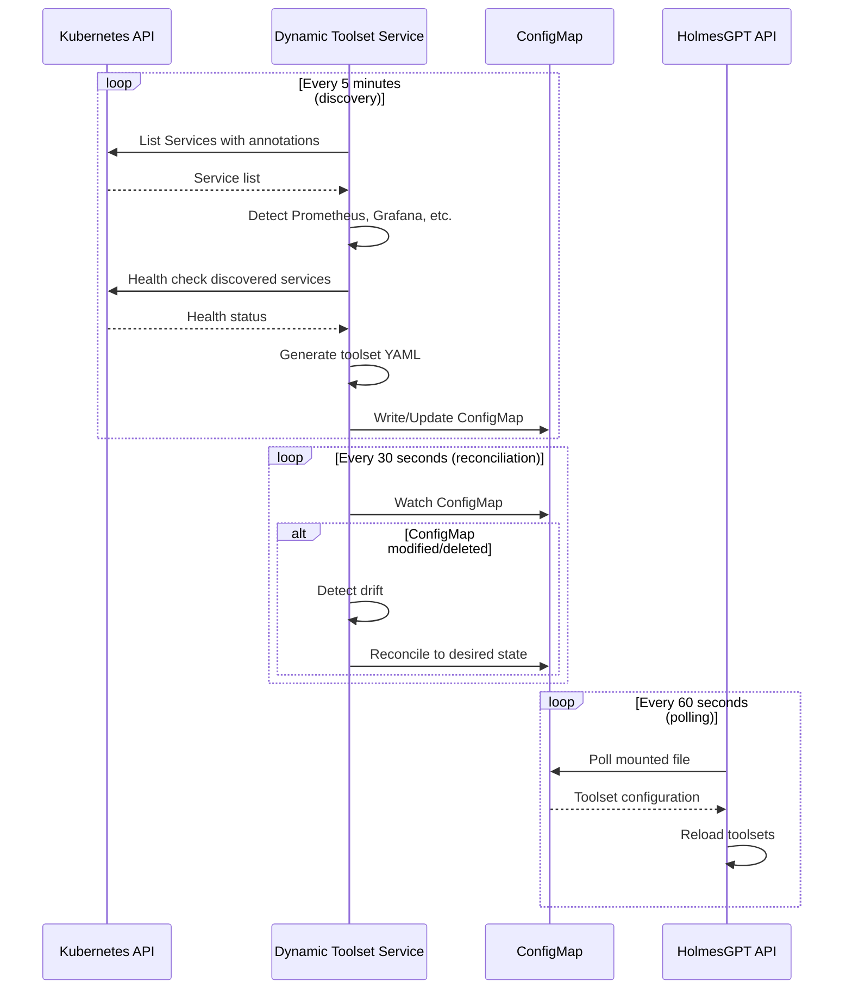
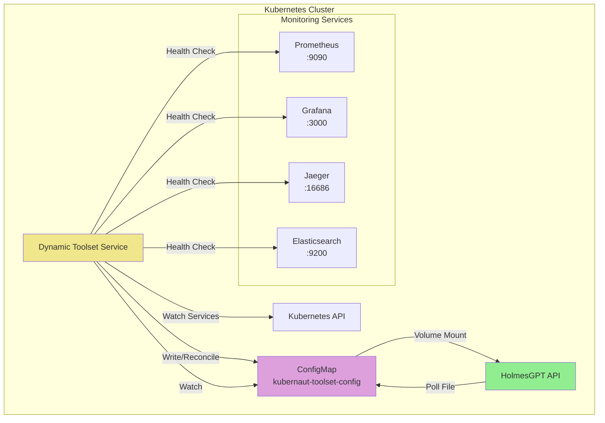

# Dynamic Toolset Service - Overview

**Version**: v1.0
**Last Updated**: October 6, 2025
**Status**: ✅ Design Complete
**Service Type**: Stateless HTTP API + Kubernetes Controller
**Port**: 8080 (REST API + Health), 9090 (Metrics)

---

## Table of Contents

1. [Purpose & Scope](#purpose--scope)
2. [Architecture Overview](#architecture-overview)
3. [Service Discovery Pipeline](#service-discovery-pipeline)
4. [ConfigMap Management](#configmap-management)
5. [Key Architectural Decisions](#key-architectural-decisions)
6. [V1 Scope Boundaries](#v1-scope-boundaries)
7. [System Context Diagram](#system-context-diagram)

---

## Purpose & Scope

### Core Purpose

Dynamic Toolset Service is the **intelligent service discovery** engine for HolmesGPT investigations. It provides:

1. **Automatic service discovery** in Kubernetes cluster
2. **Toolset configuration generation** for HolmesGPT SDK
3. **ConfigMap reconciliation** to prevent drift and deletion
4. **Health validation** for discovered services
5. **Manual override support** for admin-configured toolsets

### Why Dynamic Toolset Service Exists

**Problem**: Without Dynamic Toolset Service, operators would need to:
- **Manually configure** every toolset in HolmesGPT
- **Update configuration** every time a service is added/removed
- **Track service endpoints** across namespace changes
- **Validate service health** before investigations

**Solution**: Dynamic Toolset Service provides **automatic discovery** that:
- ✅ Discovers Prometheus, Grafana, Jaeger, Elasticsearch automatically
- ✅ Generates HolmesGPT toolset configurations dynamically
- ✅ Validates service health before including in toolsets
- ✅ Reconciles ConfigMap to prevent accidental deletion or drift
- ✅ Preserves manual overrides in `overrides` section

---

## Architecture Overview

### Service Characteristics

- **Type**: Hybrid (HTTP API + Kubernetes Controller)
- **Deployment**: Kubernetes Deployment with 1-2 replicas (leader election)
- **State Management**: ConfigMap-based (no database)
- **Integration Pattern**: Service Watch → Discovery → ConfigMap Write → HolmesGPT API polls

### Component Architecture

```
┌─────────────────────────────────────────────────────────────────┐
│               Dynamic Toolset Service                           │
│                                                                 │
│  ┌──────────────┐       ┌──────────────┐                      │
│  │   Service    │       │   ConfigMap  │                      │
│  │  Discovery   │       │ Reconciler   │                      │
│  │   Engine     │       │              │                      │
│  └──────┬───────┘       └──────┬───────┘                      │
│         │                      │                               │
│         │  ┌──────────────────────────────┐                   │
│         │  │  Service Detectors           │                   │
│         │  │  - Prometheus Detector       │                   │
│         │  │  - Grafana Detector          │                   │
│         │  │  - Jaeger Detector           │                   │
│         │  │  - Elasticsearch Detector    │                   │
│         │  │  - Custom Service Detector   │                   │
│         │  └───────────┬──────────────────┘                   │
│         │              │                                       │
│         └──────────────┴───────┐                               │
│                                │                               │
│                    ┌───────────▼──────────┐                    │
│                    │  Health Validator    │                    │
│                    │  - HTTP health check │                    │
│                    │  - Endpoint probe    │                    │
│                    └───────────┬──────────┘                    │
│                                │                               │
│                    ┌───────────▼──────────┐                    │
│                    │  Toolset Generator   │                    │
│                    │  - YAML generation   │                    │
│                    │  - Override merge    │                    │
│                    └───────────┬──────────┘                    │
│                                │                               │
│                                ▼                               │
│                      ConfigMap Write + Watch                   │
└─────────────────────────────────────────────────────────────────┘
         │                                    │
         │ Kubernetes API                     │ ConfigMap
         ▼                                    ▼
    ┌──────────┐                         ┌─────────────────┐
    │Services  │                         │kubernaut-toolset│
    │Prometheus│                         │-config          │
    │Grafana   │                         │(owned by        │
    │Jaeger    │                         │Dynamic Toolset) │
    │etc.      │                         └────────┬────────┘
    └──────────┘                                  │
                                                  │ Volume mount
                                                  ▼
                                         ┌─────────────────┐
                                         │HolmesGPT API    │
                                         │(file polling)   │
                                         └─────────────────┘
```

---

### High-Level Flow



---

## Service Discovery Pipeline

### 1. Service Detection

**Input**: Kubernetes Service objects
**Processing**: Match services by annotations and labels
**Output**: List of discovered services

**Detection Criteria**:

#### Prometheus Detection
```yaml
# Service must have:
labels:
  app: prometheus
ports:
- name: web
  port: 9090
```

#### Grafana Detection
```yaml
labels:
  app: grafana
ports:
- name: service
  port: 3000
```

#### Jaeger Detection
```yaml
labels:
  app: jaeger
ports:
- name: query
  port: 16686
```

#### Custom Service Detection
```yaml
# Admin-defined services:
annotations:
  kubernaut.io/toolset: "true"
  kubernaut.io/toolset-type: "custom"
  kubernaut.io/toolset-name: "my-service"
```

---

### 2. Health Validation

**Input**: Discovered service endpoint
**Processing**: HTTP health check
**Output**: Healthy/Unhealthy status

**Health Check Strategy**:
- **Timeout**: 5 seconds
- **Retry**: 3 attempts with 1-second interval
- **Success Criteria**: HTTP 200 OK or 204 No Content

**Example**:
```go
func (d *Detector) HealthCheck(ctx context.Context, endpoint string) error {
    ctx, cancel := context.WithTimeout(ctx, 5*time.Second)
    defer cancel()

    req, err := http.NewRequestWithContext(ctx, "GET", endpoint+"/health", nil)
    if err != nil {
        return err
    }

    resp, err := d.httpClient.Do(req)
    if err != nil {
        return err
    }
    defer resp.Body.Close()

    if resp.StatusCode != http.StatusOK && resp.StatusCode != http.StatusNoContent {
        return fmt.Errorf("unhealthy: status %d", resp.StatusCode)
    }

    return nil
}
```

---

### 3. Toolset Configuration Generation

**Input**: Validated services
**Processing**: Generate HolmesGPT toolset YAML
**Output**: ConfigMap data

**Example Output**:
```yaml
# ConfigMap: kubernaut-toolset-config
data:
  kubernetes-toolset.yaml: |
    toolset: kubernetes
    enabled: true
    config:
      incluster: true
      namespaces: ["*"]

  prometheus-toolset.yaml: |
    toolset: prometheus
    enabled: true
    config:
      url: "http://prometheus.monitoring:9090"
      timeout: "30s"

  grafana-toolset.yaml: |
    toolset: grafana
    enabled: true
    config:
      url: "http://grafana.monitoring:3000"
      apiKey: "${GRAFANA_API_KEY}"  # From Secret

  # Manual overrides preserved
  overrides.yaml: |
    custom-service:
      enabled: true
      config:
        url: "http://custom-service:8080"
```

---

## ConfigMap Management

### ConfigMap Ownership

**Owner**: Dynamic Toolset Service
**Name**: `kubernaut-toolset-config`
**Namespace**: `kubernaut-system`

**OwnerReference**:
```yaml
apiVersion: v1
kind: ConfigMap
metadata:
  name: kubernaut-toolset-config
  namespace: kubernaut-system
  ownerReferences:
  - apiVersion: apps/v1
    kind: Deployment
    name: dynamic-toolset
    controller: true
    blockOwnerDeletion: true
```

---

### Reconciliation Strategy

**Watch Interval**: 30 seconds
**Reconciliation Trigger**: ConfigMap modification or deletion

**Reconciliation Logic**:
1. **Drift Detection**: Compare current ConfigMap with desired state
2. **Override Preservation**: Merge `overrides.yaml` section
3. **Conflict Resolution**: Admin overrides take precedence
4. **Write-back**: Update ConfigMap to desired state

**Example**:
```go
func (r *Reconciler) Reconcile(ctx context.Context) error {
    // Get current ConfigMap
    currentCM, err := r.client.ConfigMaps("kubernaut-system").
        Get(ctx, "kubernaut-toolset-config", metav1.GetOptions{})

    if errors.IsNotFound(err) {
        // ConfigMap deleted → recreate
        return r.createConfigMap(ctx, r.desiredState)
    }

    // Detect drift
    if !r.isDesiredState(currentCM) {
        // Merge manual overrides
        merged := r.mergeOverrides(currentCM, r.desiredState)

        // Update ConfigMap
        return r.updateConfigMap(ctx, merged)
    }

    return nil
}
```

---

### Manual Override Support

**Admin Override Section**: `overrides.yaml`

**Example**:
```yaml
# Admin manually adds to ConfigMap
data:
  overrides.yaml: |
    custom-elasticsearch:
      enabled: true
      config:
        url: "http://elasticsearch.logging:9200"
        index: "logs-*"

    prometheus:
      enabled: false  # Temporarily disable
```

**Preservation Logic**:
- Dynamic Toolset Service **always preserves** `overrides.yaml` during reconciliation
- Admin changes to other sections are **overwritten** during reconciliation
- Admin must use `overrides.yaml` for permanent configuration changes

---

## Key Architectural Decisions

### Decision 1: Hybrid HTTP API + Controller

**Decision**: Dynamic Toolset Service runs as **both** HTTP API and Kubernetes Controller

**Rationale**:
- **Controller**: Watches services and reconciles ConfigMap (primary function)
- **HTTP API**: Manual toolset queries and health checks (secondary function)
- **Single Service**: Simplifies deployment and reduces resource usage

**Implications**:
- ✅ Single deployment for both functions
- ✅ Shared service discovery logic
- ✅ Simpler RBAC (one ServiceAccount)
- ⚠️ Requires leader election for multi-replica deployments

---

### Decision 2: File-Based ConfigMap Polling (HolmesGPT API)

**Decision**: HolmesGPT API polls **mounted ConfigMap file** instead of Kubernetes API watch

**Rationale**:
- **Simpler**: No Kubernetes client library in HolmesGPT API
- **No RBAC**: No ConfigMap read permissions needed
- **Efficient**: File system notifications (inotify) trigger reload
- **Acceptable Latency**: 60-120 seconds total latency for toolset changes

**Alternatives Considered**:
- ❌ **Kubernetes API Watch**: Complex, requires RBAC, Python Kubernetes client
- ❌ **HTTP Polling**: Dynamic Toolset Service would need HTTP API for toolsets
- ✅ **File-Based**: Simple, efficient, standard Kubernetes pattern

**Implications**:
- ✅ HolmesGPT API requires no Kubernetes API access
- ✅ ConfigMap changes reflect in 60-120 seconds (kubelet sync + file poll)
- ✅ Standard Kubernetes volume mount pattern

---

### Decision 3: ConfigMap Reconciliation (Not CRD)

**Decision**: Use **ConfigMap with reconciliation** instead of **Custom Resource Definition**

**Rationale**:
- **Simplicity**: ConfigMap is built-in, no CRD installation
- **Volume Mount**: Direct volume mount to HolmesGPT API pod
- **Admin Editable**: Admins can manually edit ConfigMap with `kubectl edit`
- **Reconciliation**: Protects against accidental deletion

**Alternatives Considered**:
- ❌ **CRD**: More complex, requires CRD installation, no direct volume mount
- ❌ **No Reconciliation**: ConfigMap could be deleted or corrupted
- ✅ **ConfigMap + Reconciliation**: Simple, protected, volume-mountable

**Implications**:
- ✅ Standard Kubernetes ConfigMap
- ✅ Admin-friendly (kubectl edit)
- ✅ Protected by reconciliation loop
- ⚠️ Manual edits outside `overrides.yaml` are overwritten

---

### Decision 4: 5-Minute Discovery Interval

**Decision**: Service discovery runs **every 5 minutes**

**Rationale**:
- **Infrequent Changes**: Services are added/removed infrequently
- **Resource Efficiency**: Avoid excessive Kubernetes API calls
- **Acceptable Delay**: 5 minutes is acceptable for new service availability

**Tunable**: Can be configured via environment variable if needed

**Implications**:
- ✅ Low Kubernetes API load
- ✅ Efficient resource usage
- ⚠️ New services take up to 5 minutes to be discovered

---

## V1 Scope Boundaries

### ✅ In Scope for V1

1. **Service Discovery**
   - Prometheus detection
   - Grafana detection
   - Jaeger detection (optional)
   - Elasticsearch detection (optional)
   - Custom service detection (annotations)

2. **Toolset Generation**
   - Kubernetes toolset (always enabled)
   - Prometheus toolset (auto-discovered)
   - Grafana toolset (auto-discovered)
   - Health validation

3. **ConfigMap Management**
   - ConfigMap creation
   - ConfigMap reconciliation (30s interval)
   - Manual override preservation
   - Owner reference protection

4. **REST API** (Optional)
   - GET /api/v1/toolsets (list discovered toolsets)
   - GET /api/v1/services (list discovered services)
   - POST /api/v1/discover (trigger manual discovery)

5. **Observability**
   - Prometheus metrics (discovery count, health status)
   - Structured logging
   - Health/readiness probes

---

### ❌ Out of Scope for V1

1. **Advanced Discovery**
   - Multi-cluster service discovery
   - External service discovery (outside Kubernetes)
   - Dynamic detector plugins

2. **Advanced Toolsets**
   - AlertManager toolset
   - Datadog toolset
   - AWS CloudWatch toolset
   - Custom toolset SDK

3. **UI/Dashboard**
   - Web UI for service discovery
   - Toolset configuration dashboard
   - Health monitoring dashboard

4. **Advanced Features**
   - Service dependency graph
   - Automatic toolset prioritization
   - A/B testing for toolsets
   - Toolset usage analytics

---

## System Context Diagram



---

## Service Configuration

### Port Configuration
- **Port 8080**: REST API and health probes (follows kube-apiserver pattern)
- **Port 9090**: Metrics endpoint
- **Authentication**: Kubernetes TokenReviewer API (validates ServiceAccount tokens)

### ServiceAccount
- **Name**: `dynamic-toolset`
- **Namespace**: `kubernaut-system`
- **Purpose**: Service discovery, ConfigMap management, TokenReviewer authentication

### RBAC Requirements
```yaml
apiVersion: rbac.authorization.k8s.io/v1
kind: ClusterRole
metadata:
  name: dynamic-toolset
rules:
# Service discovery
- apiGroups: [""]
  resources: ["services"]
  verbs: ["get", "list", "watch"]

# ConfigMap management
- apiGroups: [""]
  resources: ["configmaps"]
  verbs: ["get", "list", "watch", "create", "update", "patch"]
  resourceNames: ["kubernaut-toolset-config"]

# Health checks (optional - can use HTTP directly)
- apiGroups: [""]
  resources: ["pods", "endpoints"]
  verbs: ["get", "list"]
```

---

## Performance Characteristics

### Target SLOs

| Metric | Target | Notes |
|--------|--------|-------|
| **Availability** | 99.5% | Per replica |
| **Discovery Latency** | < 10s | From service deployment to detection |
| **Reconciliation Latency** | < 5s | From ConfigMap modification to reconciliation |
| **API Response Time (p95)** | < 200ms | Manual toolset queries |
| **Memory Usage** | < 128MB | Per replica |
| **CPU Usage** | < 0.1 cores | Average |

---

## Related Documentation

### Core Specifications
- [API Specification](./api-specification.md) - REST API endpoints
- [ConfigMap Schema](./configmap-schema.md) - Toolset configuration format
- [Service Detectors](./service-detectors.md) - Detection logic for each service type

### Architecture References
- [Dynamic Toolset Configuration Architecture](../../../../architecture/DYNAMIC_TOOLSET_CONFIGURATION_ARCHITECTURE.md) - Complete architecture
- [HolmesGPT API Overview](../holmesgpt-api/overview.md) - Consumer of toolsets
- [Service Dependency Map](../../../../architecture/SERVICE_DEPENDENCY_MAP.md)

---

**Document Status**: ✅ Complete
**Last Updated**: October 6, 2025
**Maintainer**: Kubernaut Architecture Team
**Version**: 1.0
