# Dynamic Toolset Service - Testing Strategy

**Version**: v1.0
**Last Updated**: October 6, 2025
**Service Type**: Stateless HTTP API + Kubernetes Controller
**Port**: 8080 (REST API + Health), 9090 (Metrics)

---

## 📋 Testing Pyramid

```
         /\
        /  \  E2E Tests (10-15%)
       /____\
      /      \  Integration Tests (>50%)
     /________\
    /          \  Unit Tests (70%+)
   /____________\
```

| Test Type | Target Coverage | Focus |
|-----------|----------------|-------|
| **Unit Tests** | 70%+ | Service detection logic, ConfigMap generation, health validation |
| **Integration Tests** | >50% | Kubernetes service discovery, ConfigMap reconciliation, cross-service integration |
| **E2E Tests** | 10-15% | Complete service discovery and toolset generation flow |

---

## 🔴 **TDD Methodology: RED → GREEN → REFACTOR**

**Per APDC-Enhanced TDD** (`.cursor/rules/00-core-development-methodology.mdc`):
- **DO-RED**: Write failing tests defining business contract (aim for 70%+ coverage)
- **DO-GREEN**: Define business interfaces and minimal implementation
- **DO-REFACTOR**: Enhance existing code with sophisticated logic

### **Example: Service Discovery (BR-TOOLSET-001)**

#### **Phase 1: 🔴 RED - Write Failing Test**

Write test that fails because implementation doesn't exist yet.

```go
// test/unit/toolset/service_discovery_test.go
package toolset_test

import (
    "context"
<<<<<<< HEAD
=======
    "net/http"
    "time"
>>>>>>> crd_implementation

    . "github.com/onsi/ginkgo/v2"
    . "github.com/onsi/gomega"

    "github.com/jordigilh/kubernaut/pkg/toolset"
)

var _ = Describe("Service Discovery (BR-TOOLSET-001)", func() {
    var discoverer *toolset.ServiceDiscoverer

    BeforeEach(func() {
        discoverer = toolset.NewServiceDiscoverer()  // DOESN'T EXIST YET
    })

    It("should discover Prometheus service", func() {
        services, err := discoverer.DiscoverServices(context.Background())

        Expect(err).ToNot(HaveOccurred())
        Expect(services).ToNot(BeEmpty())

        // Should find Prometheus
        prometheus := findService(services, "prometheus")
        Expect(prometheus).ToNot(BeNil())
        Expect(prometheus.Type).To(Equal("metrics"))
    })
})
```

**Run Tests**:
```bash
go test ./test/unit/toolset/...
# RESULT: FAIL - undefined: toolset.NewServiceDiscoverer
```

✅ **RED Phase Complete**: Test written and failing as expected.

---

#### **Phase 2: 🟢 GREEN - Minimal Implementation**

Implement ONLY enough code to make the test pass.

```go
// pkg/toolset/service_discoverer.go
package toolset

import "context"

type Service struct {
    Name string
    Type string
}

type ServiceDiscoverer struct{}

func NewServiceDiscoverer() *ServiceDiscoverer {
    return &ServiceDiscoverer{}
}

func (d *ServiceDiscoverer) DiscoverServices(ctx context.Context) ([]Service, error) {
    // Minimal implementation - just return Prometheus
    return []Service{
        {Name: "prometheus", Type: "metrics"},
    }, nil
}
```

**Run Tests**:
```bash
go test ./test/unit/toolset/...
# RESULT: PASS - all tests passing
```

✅ **GREEN Phase Complete**: Tests passing with minimal implementation.

---

#### **Phase 3: 🔧 REFACTOR - Enhanced Implementation**

Enhance implementation with real Kubernetes service discovery while keeping tests passing.

```go
// pkg/toolset/service_discoverer.go
package toolset

import (
    "context"
    "fmt"

    corev1 "k8s.io/api/core/v1"
    metav1 "k8s.io/apimachinery/pkg/apis/meta/v1"
    "k8s.io/apimachinery/pkg/labels"
    "k8s.io/client-go/kubernetes"
    "go.uber.org/zap"
)

type Service struct {
    Name      string
    Type      string
    Namespace string
    Port      int32
    Labels    map[string]string
}

type ServiceDiscoverer struct {
    logger    *zap.Logger
    k8sClient kubernetes.Interface
    namespaces []string
    selectors  map[string]labels.Selector
}

func NewServiceDiscoverer(logger *zap.Logger, k8sClient kubernetes.Interface, cfg *Config) *ServiceDiscoverer {
    return &ServiceDiscoverer{
        logger:     logger,
        k8sClient:  k8sClient,
        namespaces: cfg.MonitorNamespaces,
        selectors:  buildSelectors(cfg.ServiceLabels),
    }
}

func (d *ServiceDiscoverer) DiscoverServices(ctx context.Context) ([]Service, error) {
    var discovered []Service

    // Discover services in each monitored namespace
    for _, ns := range d.namespaces {
        d.logger.Debug("Discovering services", zap.String("namespace", ns))

        // List services with label selectors
        for serviceType, selector := range d.selectors {
            services, err := d.k8sClient.CoreV1().Services(ns).List(ctx, metav1.ListOptions{
                LabelSelector: selector.String(),
            })

            if err != nil {
                d.logger.Error("Failed to list services",
                    zap.Error(err),
                    zap.String("namespace", ns),
                    zap.String("type", serviceType))
                continue
            }

            // Process discovered services
            for _, svc := range services.Items {
                discovered = append(discovered, d.processService(&svc, serviceType))
            }
        }
    }

    d.logger.Info("Service discovery complete",
        zap.Int("discovered_count", len(discovered)))

    return discovered, nil
}

func (d *ServiceDiscoverer) processService(svc *corev1.Service, serviceType string) Service {
    // Extract primary port
    var port int32
    if len(svc.Spec.Ports) > 0 {
        port = svc.Spec.Ports[0].Port
    }

    return Service{
        Name:      svc.Name,
        Type:      serviceType,
        Namespace: svc.Namespace,
        Port:      port,
        Labels:    svc.Labels,
    }
}

func buildSelectors(labelConfig map[string]map[string]string) map[string]labels.Selector {
    selectors := make(map[string]labels.Selector)

    for serviceType, labelMap := range labelConfig {
        selector := labels.SelectorFromSet(labelMap)
        selectors[serviceType] = selector
    }

    return selectors
}
```

**Run Tests**:
```bash
go test ./test/unit/toolset/...
# RESULT: PASS - all tests still passing with enhanced implementation
```

✅ **REFACTOR Phase Complete**: Production-ready implementation with Kubernetes service discovery.

---

### **TDD Cycle Complete** ✅

**Result**:
- ✅ Tests written first (RED)
- ✅ Minimal implementation (GREEN)
- ✅ Enhanced with Kubernetes API, label selectors, multi-namespace discovery (REFACTOR)
- ✅ All tests passing
- ✅ Business requirement BR-TOOLSET-001 satisfied

**Key Principles Applied**:
- Kubernetes client-go for service discovery
- Label-based service identification
- Multi-namespace monitoring
- Structured logging for observability
- Error handling with graceful degradation

---

## 🧪 Unit Tests (70%+)

### **Test Framework**: Ginkgo + Gomega

### **1. Service Detection Tests**

```go
package discovery_test

import (
    "context"

    . "github.com/onsi/ginkgo/v2"
    . "github.com/onsi/gomega"

    "github.com/jordigilh/kubernaut/pkg/toolset/discovery"
)

var _ = Describe("Service Detection", func() {
    var detector *discovery.ServiceDetector

    BeforeEach(func() {
        detector = discovery.NewServiceDetector()
    })

    Context("Prometheus Detection", func() {
        It("should detect Prometheus service", func() {
            service := &corev1.Service{
                ObjectMeta: metav1.ObjectMeta{
                    Name:      "prometheus",
                    Namespace: "monitoring",
                    Labels: map[string]string{
                        "app": "prometheus",
                    },
                },
                Spec: corev1.ServiceSpec{
                    Ports: []corev1.ServicePort{
                        {Name: "web", Port: 9090},
                    },
                },
            }

            detected := detector.DetectServiceType(service)

            Expect(detected).To(Equal("prometheus"))
        })

        It("should not detect non-Prometheus service", func() {
            service := &corev1.Service{
                ObjectMeta: metav1.ObjectMeta{
                    Name:      "my-app",
                    Namespace: "default",
                },
            }

            detected := detector.DetectServiceType(service)

            Expect(detected).To(Equal(""))
        })
    })

    Context("Grafana Detection", func() {
        It("should detect Grafana service by label", func() {
            service := &corev1.Service{
                ObjectMeta: metav1.ObjectMeta{
                    Name:      "grafana",
                    Namespace: "monitoring",
                    Labels: map[string]string{
                        "app.kubernetes.io/name": "grafana",
                    },
                },
            }

            detected := detector.DetectServiceType(service)

            Expect(detected).To(Equal("grafana"))
        })

        It("should detect Grafana service by port", func() {
            service := &corev1.Service{
                ObjectMeta: metav1.ObjectMeta{
                    Name:      "my-grafana",
                    Namespace: "monitoring",
                },
                Spec: corev1.ServiceSpec{
                    Ports: []corev1.ServicePort{
                        {Name: "http", Port: 3000},
                    },
                },
            }

            detected := detector.DetectServiceType(service)

            Expect(detected).To(Equal("grafana"))
        })
    })
})
```

### **2. ConfigMap Generation Tests**

```go
package configmap_test

import (
    "context"

    . "github.com/onsi/ginkgo/v2"
    . "github.com/onsi/gomega"

    corev1 "k8s.io/api/core/v1"
    "github.com/jordigilh/kubernaut/pkg/toolset/configmap"
)

var _ = Describe("ConfigMap Generation", func() {
    var generator *configmap.ToolsetGenerator

    BeforeEach(func() {
        generator = configmap.NewToolsetGenerator()
    })

    Context("Toolset Generation", func() {
        It("should generate toolset from discovered services", func() {
            services := []discovery.DiscoveredService{
                {
                    Type:      "prometheus",
                    Name:      "prometheus",
                    Namespace: "monitoring",
                    Endpoint:  "http://prometheus.monitoring.svc.cluster.local:9090",
                    Healthy:   true,
                },
                {
                    Type:      "grafana",
                    Name:      "grafana",
                    Namespace: "monitoring",
                    Endpoint:  "http://grafana.monitoring.svc.cluster.local:3000",
                    Healthy:   true,
                },
            }

            toolset, err := generator.GenerateToolset(services)

            Expect(err).ToNot(HaveOccurred())
            Expect(toolset.Tools).To(HaveLen(2))
            Expect(toolset.Tools[0].Type).To(Equal("prometheus"))
            Expect(toolset.Tools[1].Type).To(Equal("grafana"))
        })

        It("should exclude unhealthy services from toolset", func() {
            services := []discovery.DiscoveredService{
                {
                    Type:      "prometheus",
                    Name:      "prometheus",
                    Namespace: "monitoring",
                    Endpoint:  "http://prometheus.monitoring.svc.cluster.local:9090",
                    Healthy:   true,
                },
                {
                    Type:      "grafana",
                    Name:      "grafana",
                    Namespace: "monitoring",
                    Endpoint:  "http://grafana.monitoring.svc.cluster.local:3000",
                    Healthy:   false, // Unhealthy
                },
            }

            toolset, err := generator.GenerateToolset(services)

            Expect(err).ToNot(HaveOccurred())
            Expect(toolset.Tools).To(HaveLen(1)) // Only Prometheus
            Expect(toolset.Tools[0].Type).To(Equal("prometheus"))
        })

        It("should preserve manual overrides", func() {
            services := []discovery.DiscoveredService{
                {
                    Type:      "prometheus",
                    Name:      "prometheus",
                    Namespace: "monitoring",
                    Endpoint:  "http://prometheus.monitoring.svc.cluster.local:9090",
                    Healthy:   true,
                },
            }

            overrides := map[string]interface{}{
                "custom_tool": map[string]string{
                    "endpoint": "http://custom-service:8080",
                },
            }

            toolset, err := generator.GenerateToolsetWithOverrides(services, overrides)

            Expect(err).ToNot(HaveOccurred())
            Expect(toolset.Tools).To(HaveLen(1))           // Auto-discovered
            Expect(toolset.Overrides).To(HaveKey("custom_tool")) // Manual override preserved
        })
    })
})
```

### **3. Health Validation Tests**

```go
package discovery_test

import (
    "context"
    "net/http"

    . "github.com/onsi/ginkgo/v2"
    . "github.com/onsi/gomega"

    "github.com/jordigilh/kubernaut/pkg/toolset/discovery"
)

var _ = Describe("Service Health Validation", func() {
    var healthChecker *discovery.ServiceHealthChecker

    BeforeEach(func() {
        healthChecker = discovery.NewServiceHealthChecker()
    })

    It("should validate healthy Prometheus service", func() {
        // Mock HTTP server
        server := httptest.NewServer(http.HandlerFunc(func(w http.ResponseWriter, r *http.Request) {
            if r.URL.Path == "/-/healthy" {
                w.WriteHeader(http.StatusOK)
            }
        }))
        defer server.Close()

        healthy, err := healthChecker.CheckHealth(context.Background(), "prometheus", server.URL)

        Expect(err).ToNot(HaveOccurred())
        Expect(healthy).To(BeTrue())
    })

    It("should detect unhealthy service", func() {
        // Mock HTTP server returning error
        server := httptest.NewServer(http.HandlerFunc(func(w http.ResponseWriter, r *http.Request) {
            w.WriteHeader(http.StatusServiceUnavailable)
        }))
        defer server.Close()

        healthy, err := healthChecker.CheckHealth(context.Background(), "prometheus", server.URL)

        Expect(err).ToNot(HaveOccurred())
        Expect(healthy).To(BeFalse())
    })

    It("should handle service timeout", func() {
        // Mock slow HTTP server
        server := httptest.NewServer(http.HandlerFunc(func(w http.ResponseWriter, r *http.Request) {
            time.Sleep(10 * time.Second) // Longer than timeout
        }))
        defer server.Close()

        ctx, cancel := context.WithTimeout(context.Background(), 1*time.Second)
        defer cancel()

        healthy, err := healthChecker.CheckHealth(ctx, "prometheus", server.URL)

        Expect(err).To(HaveOccurred())
        Expect(healthy).To(BeFalse())
    })
})
```

---

## 🔗 Integration Tests (>50%)

### **Why >50% for Microservices Architecture**

Dynamic Toolset Service is a critical component in Kubernaut's **microservices architecture**, requiring extensive integration testing for:
- **Kubernetes service discovery**: Real cluster service listing and watching
- **ConfigMap reconciliation**: Controller reconciliation with real ConfigMap operations
- **Cross-service integration**: HolmesGPT API polling ConfigMap changes
- **Leader election**: Multi-replica coordination in real cluster

**Per project spec** (`.cursor/rules/03-testing-strategy.mdc` line 72):
> "**Coverage Mandate**: **>50% of total business requirements due to microservices architecture**"

### **Test Framework**: Ginkgo + envtest (Kubernetes test environment)

### **1. Kubernetes Service Discovery Integration**

```go
package integration_test

import (
    "context"

    . "github.com/onsi/ginkgo/v2"
    . "github.com/onsi/gomega"

    corev1 "k8s.io/api/core/v1"
    metav1 "k8s.io/apimachinery/pkg/apis/meta/v1"
    "sigs.k8s.io/controller-runtime/pkg/client"

    "github.com/jordigilh/kubernaut/pkg/toolset"
    "github.com/jordigilh/kubernaut/pkg/testutil"
)

var _ = Describe("Kubernetes Service Discovery Integration", func() {
    var k8sClient client.Client
    var discoveryService *discovery.DiscoveryService

    BeforeEach(func() {
        // Setup envtest environment
        k8sClient = testutil.NewTestK8sClient()
        discoveryService = discovery.New(k8sClient)
    })

    It("should discover Prometheus service in monitoring namespace", func() {
        // Create Prometheus service in test cluster
        prometheusService := &corev1.Service{
            ObjectMeta: metav1.ObjectMeta{
                Name:      "prometheus",
                Namespace: "monitoring",
                Labels: map[string]string{
                    "app": "prometheus",
                },
            },
            Spec: corev1.ServiceSpec{
                Ports: []corev1.ServicePort{
                    {Name: "web", Port: 9090},
                },
            },
        }
        Expect(k8sClient.Create(context.Background(), prometheusService)).To(Succeed())

        // Discover services
        services, err := discoveryService.DiscoverServices(context.Background())

        Expect(err).ToNot(HaveOccurred())
        Expect(services).To(HaveLen(1))
        Expect(services[0].Type).To(Equal("prometheus"))
        Expect(services[0].Name).To(Equal("prometheus"))
    })

    It("should discover multiple service types", func() {
        // Create multiple services
        services := []*corev1.Service{
            {
                ObjectMeta: metav1.ObjectMeta{Name: "prometheus", Namespace: "monitoring", Labels: map[string]string{"app": "prometheus"}},
                Spec:       corev1.ServiceSpec{Ports: []corev1.ServicePort{{Name: "web", Port: 9090}}},
            },
            {
                ObjectMeta: metav1.ObjectMeta{Name: "grafana", Namespace: "monitoring", Labels: map[string]string{"app.kubernetes.io/name": "grafana"}},
                Spec:       corev1.ServiceSpec{Ports: []corev1.ServicePort{{Name: "http", Port: 3000}}},
            },
            {
                ObjectMeta: metav1.ObjectMeta{Name: "jaeger", Namespace: "tracing", Labels: map[string]string{"app": "jaeger"}},
                Spec:       corev1.ServiceSpec{Ports: []corev1.ServicePort{{Name: "query", Port: 16686}}},
            },
        }

        for _, svc := range services {
            Expect(k8sClient.Create(context.Background(), svc)).To(Succeed())
        }

        // Discover services
        discovered, err := discoveryService.DiscoverServices(context.Background())

        Expect(err).ToNot(HaveOccurred())
        Expect(discovered).To(HaveLen(3))
    })

    It("should watch for new services added", func() {
        // Start watching
        stopCh := make(chan struct{})
        defer close(stopCh)

        servicesAdded := make(chan discovery.DiscoveredService, 10)
        go discoveryService.WatchServices(context.Background(), stopCh, servicesAdded)

        // Add new service
        time.Sleep(100 * time.Millisecond) // Let watcher start

        newService := &corev1.Service{
            ObjectMeta: metav1.ObjectMeta{Name: "new-prometheus", Namespace: "monitoring", Labels: map[string]string{"app": "prometheus"}},
            Spec:       corev1.ServiceSpec{Ports: []corev1.ServicePort{{Name: "web", Port: 9090}}},
        }
        Expect(k8sClient.Create(context.Background(), newService)).To(Succeed())

        // Verify service was detected
        Eventually(servicesAdded).Should(Receive(And(
            HaveField("Type", "prometheus"),
            HaveField("Name", "new-prometheus"),
        )))
    })
})
```

### **2. ConfigMap Reconciliation Integration**

```go
package integration_test

import (
    "context"
    "time"

    . "github.com/onsi/ginkgo/v2"
    . "github.com/onsi/gomega"

    corev1 "k8s.io/api/core/v1"
    metav1 "k8s.io/apimachinery/pkg/apis/meta/v1"
    "sigs.k8s.io/controller-runtime/pkg/client"

    "github.com/jordigilh/kubernaut/pkg/toolset"
)

var _ = Describe("ConfigMap Reconciliation Integration", func() {
    var k8sClient client.Client
    var reconciler *controllers.ConfigMapReconciler

    BeforeEach(func() {
        k8sClient = testutil.NewTestK8sClient()
        reconciler = controllers.NewConfigMapReconciler(k8sClient)
    })

    It("should create ConfigMap if not exists", func() {
        req := reconcile.Request{
            NamespacedName: types.NamespacedName{
                Name:      "holmesgpt-toolset",
                Namespace: "kubernaut-system",
            },
        }

        // ConfigMap doesn't exist initially
        _, err := reconciler.Reconcile(context.Background(), req)

        Expect(err).ToNot(HaveOccurred())

        // Verify ConfigMap was created
        configMap := &corev1.ConfigMap{}
        err = k8sClient.Get(context.Background(), req.NamespacedName, configMap)
        Expect(err).ToNot(HaveOccurred())
        Expect(configMap.Data).To(HaveKey("toolset.yaml"))
    })

    It("should recreate ConfigMap after deletion", func() {
        // Create initial ConfigMap
        configMap := &corev1.ConfigMap{
            ObjectMeta: metav1.ObjectMeta{
                Name:      "holmesgpt-toolset",
                Namespace: "kubernaut-system",
            },
            Data: map[string]string{
                "toolset.yaml": "tools: []",
            },
        }
        Expect(k8sClient.Create(context.Background(), configMap)).To(Succeed())

        // Delete ConfigMap
        Expect(k8sClient.Delete(context.Background(), configMap)).To(Succeed())

        // Trigger reconciliation
        req := reconcile.Request{NamespacedName: types.NamespacedName{Name: "holmesgpt-toolset", Namespace: "kubernaut-system"}}
        _, err := reconciler.Reconcile(context.Background(), req)

        Expect(err).ToNot(HaveOccurred())

        // Verify ConfigMap was recreated
        recreated := &corev1.ConfigMap{}
        err = k8sClient.Get(context.Background(), req.NamespacedName, recreated)
        Expect(err).ToNot(HaveOccurred())
    })

    It("should preserve manual overrides during reconciliation", func() {
        // Create ConfigMap with manual overrides
        configMapWithOverrides := &corev1.ConfigMap{
            ObjectMeta: metav1.ObjectMeta{
                Name:      "holmesgpt-toolset",
                Namespace: "kubernaut-system",
            },
            Data: map[string]string{
                "toolset.yaml": `
tools:
  - type: prometheus
    endpoint: http://prometheus:9090
overrides:
  custom_tool:
    endpoint: http://custom:8080
`,
            },
        }
        Expect(k8sClient.Create(context.Background(), configMapWithOverrides)).To(Succeed())

        // Trigger reconciliation
        req := reconcile.Request{NamespacedName: types.NamespacedName{Name: "holmesgpt-toolset", Namespace: "kubernaut-system"}}
        _, err := reconciler.Reconcile(context.Background(), req)

        Expect(err).ToNot(HaveOccurred())

        // Verify overrides were preserved
        reconciled := &corev1.ConfigMap{}
        err = k8sClient.Get(context.Background(), req.NamespacedName, reconciled)
        Expect(err).ToNot(HaveOccurred())
        Expect(reconciled.Data["toolset.yaml"]).To(ContainSubstring("overrides"))
        Expect(reconciled.Data["toolset.yaml"]).To(ContainSubstring("custom_tool"))
    })
})
```

### **3. Cross-Service Integration**

```go
package integration_test

import (
    "context"
    "net/http"
    "net/http/httptest"

    . "github.com/onsi/ginkgo/v2"
    . "github.com/onsi/gomega"

    "github.com/jordigilh/kubernaut/pkg/toolset"
)

var _ = Describe("Cross-Service Integration", func() {
    It("should provide toolset discovery endpoint for HolmesGPT API", func() {
        // Simulate HolmesGPT API calling Dynamic Toolset Service
        headers := map[string]string{
            "Authorization": "Bearer <VALID_TOKEN>",
        }

        response, err := dynamicToolsetClient.GetCurrentToolset(headers)

        Expect(err).ToNot(HaveOccurred())
        Expect(response.Tools).ToNot(BeEmpty())
    })

    It("should update toolset when new service is discovered", func() {
        // Initial toolset
        initial, _ := dynamicToolsetClient.GetCurrentToolset(headers)
        initialCount := len(initial.Tools)

        // Add new Prometheus service
        newService := &corev1.Service{
            ObjectMeta: metav1.ObjectMeta{Name: "new-prometheus", Namespace: "monitoring", Labels: map[string]string{"app": "prometheus"}},
            Spec:       corev1.ServiceSpec{Ports: []corev1.ServicePort{{Name: "web", Port: 9090}}},
        }
        k8sClient.Create(context.Background(), newService)

        // Wait for discovery and ConfigMap update
        time.Sleep(10 * time.Second)

        // Verify toolset was updated
        updated, _ := dynamicToolsetClient.GetCurrentToolset(headers)
        Expect(len(updated.Tools)).To(BeNumerically(">", initialCount))
    })
})
```

---

## 🌐 E2E Tests (10-15%)

```go
package e2e_test

import (
    "context"
    "time"

    . "github.com/onsi/ginkgo/v2"
    . "github.com/onsi/gomega"

    corev1 "k8s.io/api/core/v1"
    metav1 "k8s.io/apimachinery/pkg/apis/meta/v1"
    "sigs.k8s.io/controller-runtime/pkg/client"

    "github.com/jordigilh/kubernaut/pkg/toolset"
    "github.com/jordigilh/kubernaut/test/e2e/helpers"
)

var _ = Describe("E2E: Complete Service Discovery and Toolset Generation", func() {
    It("should discover services and generate toolset end-to-end", func() {
        By("deploying Prometheus to test cluster")
        prometheusService := &corev1.Service{
            ObjectMeta: metav1.ObjectMeta{Name: "prometheus", Namespace: "monitoring", Labels: map[string]string{"app": "prometheus"}},
            Spec:       corev1.ServiceSpec{Ports: []corev1.ServicePort{{Name: "web", Port: 9090}}},
        }
        Expect(k8sClient.Create(context.Background(), prometheusService)).To(Succeed())

        By("starting Dynamic Toolset Service discovery")
        services, err := discoveryService.DiscoverServices(context.Background())
        Expect(err).ToNot(HaveOccurred())
        Expect(services).To(HaveLen(1))

        By("validating service health")
        for i := range services {
            healthy, err := healthChecker.CheckHealth(context.Background(), services[i].Type, services[i].Endpoint)
            Expect(err).ToNot(HaveOccurred())
            services[i].Healthy = healthy
        }

        By("generating toolset configuration")
        toolset, err := generator.GenerateToolset(services)
        Expect(err).ToNot(HaveOccurred())
        Expect(toolset.Tools).To(HaveLen(1))
        Expect(toolset.Tools[0].Type).To(Equal("prometheus"))

        By("writing toolset to ConfigMap")
        err = configMapWriter.WriteToolset(context.Background(), "kubernaut-system", "holmesgpt-toolset", toolset)
        Expect(err).ToNot(HaveOccurred())

        By("verifying ConfigMap was created")
        configMap := &corev1.ConfigMap{}
        err = k8sClient.Get(context.Background(), types.NamespacedName{Name: "holmesgpt-toolset", Namespace: "kubernaut-system"}, configMap)
        Expect(err).ToNot(HaveOccurred())
        Expect(configMap.Data).To(HaveKey("toolset.yaml"))

        By("verifying HolmesGPT API can read toolset")
        response, err := holmesGPTClient.LoadToolsetFromConfigMap()
        Expect(err).ToNot(HaveOccurred())
        Expect(response.Tools).To(HaveLen(1))
    })
})
```

---

## 🎯 Business Requirement Coverage

| Requirement | Unit Tests | Integration Tests | E2E Tests |
|------------|------------|-------------------|-----------|
| **BR-TOOLSET-001** (Service discovery) | ✅✅ | ✅✅✅ | ✅ |
| **BR-TOOLSET-002** (ConfigMap generation) | ✅✅✅ | ✅ | ✅ |
| **BR-TOOLSET-003** (Health validation) | ✅✅ | ✅✅ | ✅ |
| **BR-TOOLSET-004** (ConfigMap reconciliation) | ✅ | ✅✅✅ | ✅ |
| **BR-TOOLSET-005** (Manual overrides) | ✅✅ | ✅✅ | ✅ |

---

## 🧪 Test Execution

### **Unit Tests**
```bash
# Run all unit tests
go test ./pkg/dynamictoolset/... -v

# With coverage
go test ./pkg/dynamictoolset/... -coverprofile=coverage.out
go tool cover -html=coverage.out
```

### **Integration Tests**
```bash
# Requires envtest (Kubernetes test environment)
make test-integration

# Run specific integration suite
ginkgo -v ./test/integration/dynamictoolset/
```

### **E2E Tests**
```bash
# Requires Kind cluster
make test-e2e

# Setup test environment
make bootstrap-dev
```

---

## 📊 Test Quality Metrics

| Metric | Target | Current |
|--------|--------|---------|
| **Unit Test Coverage** | 70%+ | TBD |
| **Integration Test Coverage** | >50% | TBD |
| **E2E Test Coverage** | 10-15% | TBD |
| **Test Execution Time** | < 5 min | TBD |

---

## ✅ Test Checklist

- [ ] All business requirements have corresponding tests
- [ ] Service detection tested for all supported service types (Prometheus, Grafana, Jaeger, Elasticsearch)
- [ ] ConfigMap generation tested with multiple services
- [ ] Health validation tested with timeout scenarios
- [ ] ConfigMap reconciliation tested with deletion and modification
- [ ] Manual overrides preservation tested
- [ ] Leader election tested with multiple replicas
- [ ] Cross-service integration tests implemented
- [ ] E2E flow tests pass
- [ ] Coverage meets 70%+ unit / >50% integration / 10-15% E2E
- [ ] All tests pass in CI/CD pipeline

---

---

## 🎯 Test Level Selection: Maintainability First

**Principle**: Prioritize maintainability and simplicity when choosing between unit, integration, and e2e tests.

### Decision Framework

```mermaid
flowchart TD
    Start[New Toolset Test] --> Question1{Can test with<br/>mock K8s client?<br/>&lt;20 lines setup}

    Question1 -->|Yes| Question2{Testing discovery logic<br/>or ConfigMap<br/>persistence?}
    Question1 -->|No| Integration[Integration Test]

    Question2 -->|Discovery Logic| Question3{Test readable<br/>and maintainable?}
    Question2 -->|Persistence| Integration

    Question3 -->|Yes| Unit[Unit Test]
    Question3 -->|No| Integration

    Unit --> Validate1[✅ Use Unit Test]
    Integration --> Validate2{Complete service<br/>discovery + ConfigMap<br/>+ HolmesGPT read<br/>pipeline?}

    Validate2 -->|Yes| E2E[E2E Test]
    Validate2 -->|No| Validate3[✅ Use Integration Test]

    E2E --> Validate4[✅ Use E2E Test]

    style Unit fill:#90EE90
    style Integration fill:#87CEEB
    style E2E fill:#FFB6C1
```



### Test at Unit Level WHEN

- ✅ Scenario can be tested with **Fake K8s client** (sigs.k8s.io/controller-runtime/pkg/client/fake)
- ✅ Focus is on **service filtering logic** (label selectors, annotation parsing, service type detection)
- ✅ Setup is **straightforward** (< 20 lines of Fake K8s client configuration)
- ✅ Test remains **readable and maintainable** with mocking

**Dynamic Toolset Unit Test Examples**:
- Service filtering algorithms (label selectors, annotation matching)
- Toolset YAML generation logic (service → toolset structure conversion)
- Health check validation (HTTP endpoint validation, timeout calculations)
- ConfigMap merging logic (manual overrides preservation)
- Service type detection (Prometheus, Grafana, Jaeger pattern matching)

---

### Move to Integration Level WHEN

- ✅ Scenario requires **real K8s API Server** (envtest with controller-runtime)
- ✅ Validating **ConfigMap reconciliation** (watch events, controller reconcile loops)
- ✅ Unit test would require **excessive K8s API mocking** (>50 lines of fake client setup)
- ✅ Integration test is **simpler to understand** and maintain
- ✅ Testing **cross-namespace service discovery** (multiple namespaces with real API Server)

**Dynamic Toolset Integration Test Examples**:
- Complete ConfigMap reconciliation (watch → reconcile → ConfigMap update)
- Real K8s API service discovery (list services across namespaces with envtest)
- ConfigMap deletion recovery (controller watches ConfigMap, recreates on delete)
- Leader election coordination (multiple replicas with real K8s API)
- Service event handling (service added/updated → ConfigMap regenerated)

---

### Move to E2E Level WHEN

- ✅ Testing **complete service discovery pipeline** (K8s services → discovery → health check → ConfigMap → HolmesGPT)
- ✅ Validating **end-to-end toolset lifecycle** (all services + real K8s + ConfigMap + HolmesGPT read)
- ✅ Lower-level tests **cannot reproduce full integration** (discovery + validation + persistence + consumption)

**Dynamic Toolset E2E Test Examples**:
- Complete service discovery flow (K8s service deployed → Dynamic Toolset discovers → HolmesGPT loads)
- Multi-service discovery orchestration (Prometheus + Grafana + Jaeger discovered simultaneously)
- End-to-end toolset lifecycle (service added → discovered → ConfigMap created → HolmesGPT reads → service used)

---

## 🧭 Maintainability Decision Criteria

**Ask these 5 questions before implementing a unit test:**

### 1. Mock Complexity
**Question**: Will K8s API mocking be >40 lines?
- ✅ **YES** → Consider integration test with envtest
- ❌ **NO** → Unit test acceptable

**Dynamic Toolset Example**:
```go
// ❌ COMPLEX: 90+ lines of Fake K8s client setup for multi-namespace discovery
fakeClient := fake.NewClientBuilder().
    WithScheme(scheme).
    WithObjects(/* 90+ lines of service objects */).
    Build()
// BETTER: Integration test with envtest

// ✅ SIMPLE: Service filtering with Fake K8s client
fakeClient := fake.NewClientBuilder().WithObjects(service1, service2).Build()
filtered, err := serviceFilter.FilterByLabel(ctx, fakeClient, "app=prometheus")
Expect(err).ToNot(HaveOccurred())
Expect(filtered).To(HaveLen(1))
```

---

### 2. Readability
**Question**: Would a new developer understand this test in 2 minutes?
- ✅ **YES** → Unit test is good
- ❌ **NO** → Consider higher test level

**Dynamic Toolset Example**:
```go
// ✅ READABLE: Clear service type detection test
It("should detect Prometheus service by labels", func() {
    service := testutil.NewServiceWithLabels("prometheus", map[string]string{
        "app": "prometheus",
    })

    serviceType := detector.DetectType(service)

    Expect(serviceType).To(Equal("prometheus"))
    Expect(detector.IsMonitoringService(service)).To(BeTrue())
})
```

---

### 3. Fragility
**Question**: Does test break when ConfigMap structure changes?
- ✅ **YES** → Move to integration test (testing implementation, not behavior)
- ❌ **NO** → Unit test is appropriate

**Dynamic Toolset Example**:
```go
// ❌ FRAGILE: Breaks if we change internal YAML structure
Expect(configMapData).To(ContainSubstring("tools:\n  - type: prometheus"))

// ✅ STABLE: Tests discovery outcome, not YAML format
toolset, err := generator.GenerateToolset(services)
Expect(err).ToNot(HaveOccurred())
Expect(toolset.Tools).To(HaveLen(1))
Expect(toolset.Tools[0].Type).To(Equal("prometheus"))
Expect(toolset.Tools[0].Healthy).To(BeTrue())
```

---

### 4. Real Value
**Question**: Is this testing filtering logic or ConfigMap reconciliation?
- **Filtering Logic** → Unit test with Fake K8s client
- **ConfigMap Reconciliation** → Integration test with envtest

**Dynamic Toolset Decision**:
- **Unit**: Service filtering, health validation, YAML generation (pure logic)
- **Integration**: ConfigMap reconciliation, leader election, watch events (infrastructure)

---

### 5. Maintenance Cost
**Question**: How much effort to maintain this vs integration test?
- **Lower cost** → Choose that option

**Dynamic Toolset Example**:
- **Unit test with 100-line K8s mock**: HIGH maintenance (breaks on K8s API changes)
- **Integration test with envtest**: LOW maintenance (automatically adapts to K8s API evolution)

---

## 🎯 Realistic vs. Exhaustive Testing

**Principle**: Test realistic service discovery scenarios necessary to validate business requirements - not more, not less.

### Dynamic Toolset: Requirement-Driven Coverage

**Business Requirement Analysis** (BR-TOOLSET-001 to BR-TOOLSET-005):

| Discovery Dimension | Realistic Values | Test Strategy |
|---|---|---|
| **Service Types** | Prometheus, Grafana, Jaeger, Elasticsearch (4 types) | Test type detection |
| **Namespaces** | single, multi, all (3 discovery scopes) | Test namespace filtering |
| **Health States** | healthy, unhealthy, timeout (3 states) | Test health validation |
| **ConfigMap States** | exists, missing, modified (3 states) | Test reconciliation |

**Total Possible Combinations**: 4 × 3 × 3 × 3 = 108 combinations
**Distinct Business Behaviors**: 15 behaviors (per BR-TOOLSET-001 to BR-TOOLSET-005)
**Tests Needed**: ~32 tests (covering 15 distinct behaviors with edge cases)

---

### ✅ DO: Test Distinct Discovery Behaviors Using DescribeTable

**BEST PRACTICE**: Use Ginkgo DescribeTable for service type detection and health validation.

```go
// ✅ GOOD: Tests distinct service type detection using DescribeTable
var _ = Describe("BR-TOOLSET-001: Service Type Detection", func() {
    DescribeTable("Service type identification based on labels and annotations",
        func(labels map[string]string, annotations map[string]string, expectedType string, expectedDetected bool) {
            service := testutil.NewServiceWithLabelsAndAnnotations("test-service", labels, annotations)

            detectedType, detected := detector.DetectType(service)

            Expect(detected).To(Equal(expectedDetected))
            if detected {
                Expect(detectedType).To(Equal(expectedType))
            }
        },
        // BR-TOOLSET-001.1: Prometheus by standard label
        Entry("prometheus with app=prometheus label",
            map[string]string{"app": "prometheus"},
            map[string]string{},
            "prometheus", true),

        // BR-TOOLSET-001.2: Grafana by annotation
        Entry("grafana with grafana.integreatly.org/v1beta1 annotation",
            map[string]string{},
            map[string]string{"app.kubernetes.io/name": "grafana"},
            "grafana", true),

        // BR-TOOLSET-001.3: Jaeger by label
        Entry("jaeger with app=jaeger label",
            map[string]string{"app": "jaeger"},
            map[string]string{},
            "jaeger", true),

        // BR-TOOLSET-001.4: Elasticsearch by label
        Entry("elasticsearch with app=elasticsearch label",
            map[string]string{"app": "elasticsearch"},
            map[string]string{},
            "elasticsearch", true),

        // BR-TOOLSET-001.5: Unknown service (no matching labels)
        Entry("unrecognized service with custom labels",
            map[string]string{"app": "custom-app"},
            map[string]string{},
            "", false),

        // BR-TOOLSET-001.6: Multiple matching labels (priority)
        Entry("service with both prometheus and grafana labels → prometheus (priority)",
            map[string]string{"app": "prometheus", "grafana": "true"},
            map[string]string{},
            "prometheus", true),
    )
})
```

**Why DescribeTable is Better for Service Discovery Testing**:
- ✅ 6 detection scenarios in single test function (vs. 6 separate test functions)
- ✅ Change detection logic once, all service types tested
- ✅ Clear service type rules visible
- ✅ Easy to add new service types
- ✅ Perfect for testing pattern-matching matrices

---

### ❌ DON'T: Test Redundant Discovery Variations

```go
// ❌ BAD: Redundant tests that validate SAME detection logic
func TestPrometheusService1() {
    // Tests Prometheus detection for service1
}

func TestPrometheusService2() {
    // Tests Prometheus detection for service2
}

func TestPrometheusService3() {
    // Tests Prometheus detection for service3
}
// All 3 tests validate SAME detection logic with different service names
// BETTER: One test for detection logic, one for edge case (empty labels)

// ❌ BAD: Exhaustive namespace permutations
func TestDiscoveryInNamespace1() {}
func TestDiscoveryInNamespace2() {}
// ... 106 more combinations
// These don't test DISTINCT discovery logic
```

---

### Decision Criteria: Is This Dynamic Toolset Test Necessary?

Ask these 4 questions:

1. **Does this test validate a distinct discovery or reconciliation rule?**
   - ✅ YES: Health check timeout affects service inclusion (BR-TOOLSET-003.1)
   - ❌ NO: Testing different service names with same detection

2. **Does this discovery scenario actually occur in production?**
   - ✅ YES: Multiple services of same type (2 Prometheus instances)
   - ❌ NO: 100 Prometheus services in single namespace (unrealistic)

3. **Would this test catch a discovery bug the other tests wouldn't?**
   - ✅ YES: ConfigMap reconciliation preserves manual overrides
   - ❌ NO: Testing 20 different service names with same labels

4. **Is this testing discovery behavior or implementation variation?**
   - ✅ Discovery: Service label patterns determine type classification
   - ❌ Implementation: Internal data structure for storing services

**If answer is "NO" to all 4 questions** → Skip the test, it adds maintenance cost without discovery value

---

### Dynamic Toolset Test Coverage Example with DescribeTable

**BR-TOOLSET-003: Health Check Validation (7 distinct health scenarios)**

```go
var _ = Describe("BR-TOOLSET-003: Health Check Validation", func() {
    // ANALYSIS: 4 service types × 5 health states × 3 timeout values = 60 combinations
    // REQUIREMENT ANALYSIS: Only 7 distinct health behaviors per BR-TOOLSET-003
    // TEST STRATEGY: Use DescribeTable for 7 health scenarios + 2 edge cases

    DescribeTable("Health check results based on endpoint availability and timeout",
        func(serviceType string, endpoint string, timeout time.Duration, expectedHealthy bool, expectedError bool) {
            service := testutil.NewServiceWithType(serviceType, endpoint)

            healthy, err := healthChecker.CheckHealth(ctx, service, timeout)

            if expectedError {
                Expect(err).To(HaveOccurred())
            } else {
                Expect(err).ToNot(HaveOccurred())
            }
            Expect(healthy).To(Equal(expectedHealthy))
        },
        // Scenario 1: Healthy service with quick response
        Entry("healthy prometheus with 2s timeout → healthy",
            "prometheus", "http://prometheus:9090", 5*time.Second, true, false),

        // Scenario 2: Unhealthy service (connection refused)
        Entry("unreachable service with 2s timeout → unhealthy",
            "prometheus", "http://unreachable:9090", 2*time.Second, false, true),

        // Scenario 3: Slow service with short timeout
        Entry("slow service (3s response) with 1s timeout → timeout",
            "grafana", "http://slow-grafana:3000", 1*time.Second, false, true),

        // Scenario 4: Slow service with long timeout
        Entry("slow service (3s response) with 10s timeout → healthy",
            "grafana", "http://slow-grafana:3000", 10*time.Second, true, false),

        // Scenario 5: Service returns 500 error
        Entry("service returns HTTP 500 with 2s timeout → unhealthy",
            "jaeger", "http://failing-jaeger:16686", 2*time.Second, false, true),

        // Scenario 6: Service with self-signed certificate
        Entry("service with self-signed cert (skipVerify=true) → healthy",
            "elasticsearch", "https://elasticsearch:9200", 5*time.Second, true, false),

        // Scenario 7: Service behind network policy (blocked)
        Entry("service blocked by network policy → unhealthy",
            "prometheus", "http://blocked-prometheus:9090", 2*time.Second, false, true),

        // Edge case 1: Zero timeout (immediate failure)
        Entry("zero timeout → timeout error",
            "prometheus", "http://prometheus:9090", 0*time.Second, false, true),

        // Edge case 2: Very long timeout (practical limit)
        Entry("60 second timeout with healthy service → healthy",
            "prometheus", "http://prometheus:9090", 60*time.Second, true, false),
    )
})
```

**Benefits for Health Check Testing**:
- ✅ **9 health scenarios tested in ~15 lines** (vs. ~270 lines with separate functions)
- ✅ **Single health checker** - changes apply to all service types
- ✅ **Clear health rules** - timeout and error handling immediately visible
- ✅ **Easy to add service types** - new parameter for new service patterns
- ✅ **92% less maintenance** for complex health validation testing

---

## ⚠️ Anti-Patterns to AVOID

### ❌ OVER-EXTENDED UNIT TESTS (Forbidden)

**Problem**: Excessive Fake K8s client setup (>50 lines) makes discovery tests unmaintainable

```go
// ❌ BAD: 100+ lines of Fake K8s client setup for multi-namespace discovery
fakeClient := fake.NewClientBuilder().
    WithObjects(/* 100+ service objects across namespaces */).
    Build()
// THIS SHOULD BE AN INTEGRATION TEST

// BETTER: Integration test with envtest
```

**Solution**: Move to integration test with envtest

```go
// ✅ GOOD: Integration test with envtest (real K8s API Server)
var _ = Describe("Integration: Multi-Namespace Discovery", func() {
    It("should discover services across multiple namespaces", func() {
        // Deploy services to real envtest K8s
        k8sClient.Create(ctx, prometheusService)
        k8sClient.Create(ctx, grafanaService)

        // Test discovery
        services, err := discoverer.DiscoverAll(ctx, k8sClient)

        Expect(err).ToNot(HaveOccurred())
        Expect(services).To(HaveLen(2))
    })
})
```

---

### ❌ WRONG TEST LEVEL (Forbidden)

**Problem**: Testing ConfigMap reconciliation in unit tests

```go
// ❌ BAD: Testing controller reconciliation loop in unit test
func TestConfigMapReconciliation() {
    // Complex Fake K8s client with watch events
    // Real reconciliation loop - belongs in integration test
}
```

**Solution**: Use integration test for reconciliation

```go
// ✅ GOOD: Integration test for ConfigMap reconciliation
var _ = Describe("Integration: ConfigMap Reconciliation", func() {
    It("should recreate ConfigMap after deletion", func() {
        // Test with real K8s API Server and controller
    })
})
```

---

### ❌ REDUNDANT COVERAGE (Forbidden)

**Problem**: Testing same service filtering at multiple levels

```go
// ❌ BAD: Testing exact same service filtering at all 3 levels
// Unit test: Service label filtering
// Integration test: Service label filtering (duplicate)
// E2E test: Service label filtering (duplicate)
// NO additional value
```

**Solution**: Test filtering in unit tests, test DISCOVERY PIPELINE in higher levels

```go
// ✅ GOOD: Each level tests distinct aspect
// Unit test: Service label filtering correctness
// Integration test: Service label filtering + ConfigMap reconciliation
// E2E test: Service filtering + ConfigMap + HolmesGPT consumption
// Each level adds unique discovery value
```

---

**Document Maintainer**: Kubernaut Documentation Team
**Last Updated**: October 6, 2025
**Testing Framework**: Ginkgo + Gomega + envtest

