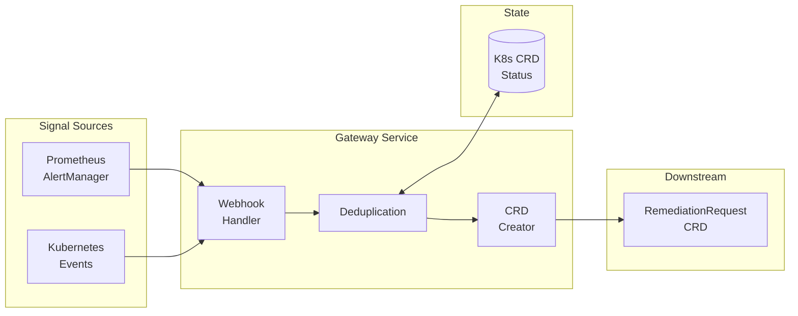

# Gateway Service - Documentation Hub

**Version**: v1.6 (Production Ready)
**Last Updated**: December 15, 2025
**Service Type**: Stateless HTTP API (Signal Ingestion & Deduplication)
**Status**: ✅ **PRODUCTION READY** - All 3 Testing Tiers Complete
**Test Coverage**: 442 tests passing (314 Unit + 104 Integration + 24 E2E)
**Priority**: **P0 - CRITICAL** (Entry point to entire system)
**HTTP Port**: 8080 (REST API + Health)
**Metrics Port**: 9090 (`/metrics`)

---

## Quick Reference

| Attribute | Value |
|-----------|-------|
| **API Port** | 8080 |
| **Health Port** | 8081 (`/healthz`, `/readyz`) |
| **Metrics Port** | 9090 (`/metrics` with auth) |
| **Namespace** | `kubernaut-system` |
| **Replicas** | 2-5 (horizontal scaling) |

### API Endpoints

| Endpoint | Method | Purpose |
|----------|--------|---------|
| `/api/v1/signals/prometheus` | POST | Prometheus AlertManager webhooks |
| `/api/v1/signals/kubernetes-event` | POST | Kubernetes Event ingestion |
| `/healthz` | GET | Liveness probe |
| `/readyz` | GET | Readiness probe |
| `/metrics` | GET | Prometheus metrics (authenticated) |

---

## 🗂️ Documentation Index

| Document | Purpose | Lines | Status |
|----------|---------|-------|--------|
| **[overview.md](./overview.md)** | Service architecture, decisions, diagrams | ~612 | ✅ Complete |
| **[BUSINESS_REQUIREMENTS.md](./BUSINESS_REQUIREMENTS.md)** | Complete BR catalog (BR-GATEWAY-*) | ~735 | ✅ Complete |
| **[BR_MAPPING.md](./BR_MAPPING.md)** | Test-to-BR traceability matrix | ~307 | ✅ Complete |
| **[api-specification.md](./api-specification.md)** | OpenAPI specification | ~1,182 | ✅ Complete |
| **[implementation.md](./implementation.md)** | HTTP handlers, processing pipeline | ~1,354 | ✅ Complete |
| **[implementation-checklist.md](./implementation-checklist.md)** | APDC-TDD phased checklist | ~302 | ✅ Complete |
| **[integration-points.md](./integration-points.md)** | CRD creation, Redis, upstream/downstream | ~324 | ✅ Complete |
| **[deduplication.md](./deduplication.md)** | Deduplication algorithm details | ~605 | ✅ Complete |
| **[crd-integration.md](./crd-integration.md)** | RemediationRequest CRD creation | ~333 | ✅ Complete |
| **[security-configuration.md](./security-configuration.md)** | RBAC, NetworkPolicy, Secrets | ~340 | ✅ Complete |
| **[observability-logging.md](./observability-logging.md)** | Structured logging, tracing | ~280 | ✅ Complete |
| **[metrics-slos.md](./metrics-slos.md)** | Prometheus metrics, SLI/SLO | ~228 | ✅ Complete |
| **[testing-strategy.md](./testing-strategy.md)** | Defense-in-depth testing approach | ~803 | ✅ Complete |

**Total**: ~7,405 lines across 13 core specification documents
**Status**: ✅ **100% Complete** - Production-ready Signal Ingestion Gateway

---

## 📁 File Organization

```
gateway-service/
├── 📄 README.md (you are here)              - Service index & navigation
├── 📘 overview.md                           - High-level architecture ✅ (612 lines)
├── 📋 BUSINESS_REQUIREMENTS.md              - 74 BRs with test mapping ✅ (735 lines)
├── 🔗 BR_MAPPING.md                         - Test-to-BR traceability ✅ (307 lines)
├── 🔧 api-specification.md                  - OpenAPI specification ✅ (1,182 lines)
├── ⚙️  implementation.md                    - HTTP handlers, pipeline ✅ (1,354 lines)
├── ✅ implementation-checklist.md           - APDC-TDD phases ✅ (302 lines)
├── 🔗 integration-points.md                 - CRD, Redis, integrations ✅ (324 lines)
├── 🧹 deduplication.md                      - Dedup algorithm details ✅ (605 lines)
├── 📝 crd-integration.md                    - RemediationRequest CRD ✅ (333 lines)
├── 🔒 security-configuration.md             - RBAC, NetworkPolicy ✅ (340 lines)
├── 📊 observability-logging.md              - Logging & tracing ✅ (280 lines)
├── 📈 metrics-slos.md                       - Prometheus metrics ✅ (228 lines)
├── 🧪 testing-strategy.md                   - Test patterns ✅ (803 lines)
├── 📁 implementation/                       - Implementation phase guides
│   ├── plans/                               - DD-GATEWAY-008, 009, 010 plans
│   ├── IMPLEMENTATION_PLAN_V2.28.md         - Current implementation plan
│   └── 00-HANDOFF-SUMMARY.md                - Handoff summary
├── 🧪 e2e-testing/                          - E2E test documentation
│   ├── GATEWAY_E2E_SUMMARY.md               - E2E test summary
│   └── GATEWAY_E2E_INFRASTRUCTURE_ASSESSMENT.md
└── 📁 archive/                              - Historical progress tracking
    ├── day-reports/                         - DAY1-DAY9 progress files
    ├── implementation-progress/             - PHASE, COMPLETE files
    ├── migration-status/                    - CHI migration files
    └── debug-reports/                       - Debug & troubleshooting files
```

**Legend**:
- ✅ = Complete documentation
- 📋 = Core specification document
- 🧪 = Test-related documentation
- 🔒 = Security-related documentation
- 📁 = Directory

---

## 🏗️ Implementation Structure

### **Binary Location**
- **Directory**: `cmd/gateway/`
- **Entry Point**: `cmd/gateway/main.go`
- **Build Command**: `go build -o bin/gateway ./cmd/gateway`

### **API Gateway Components**
- **Package**: `pkg/gateway/`
  - `server.go` - HTTP server and routing
  - `config/` - Configuration management
  - `adapters/` - Signal source adapters (Prometheus, K8s Events)
  - `processing/` - Core processing logic
    - `normalizer.go` - Signal normalization
    - `deduplication.go` - Status-based deduplication (DD-GATEWAY-011)
    - `classifier.go` - Environment classification
    - `crd_creator.go` - RemediationRequest CRD creation
  - `metrics/` - Prometheus metrics

### **Tests** ✅ ALL PASSING (2025-12-15)
- `test/unit/gateway/` - **314 specs** (7 test suites, business logic with external mocks)
- `test/integration/gateway/` - **104 specs** (96 main + 8 processing, real K8s API via envtest)
- `test/e2e/gateway/` - **24 specs** (Full Kind cluster deployment)

**Total**: **442 specs** - 100% pass rate across all tiers

**Test Infrastructure**:
- Unit: In-memory (Ginkgo/Gomega BDD framework)
- Integration: envtest + Data Storage + PostgreSQL
- E2E: Kind cluster (full Gateway deployment)

**See Also**: [cmd/ directory structure](../../../../cmd/README.md) for complete binary organization.

---

## 🎯 Service Purpose

Gateway Service is the **single entry point** for all external signals into the Kubernaut intelligent remediation system:

```
Prometheus AlertManager  ─┐
                         ├──► Gateway Service ──► RemediationRequest CRD
Kubernetes Events        ─┘
```

### Core Capabilities

1. **Signal Ingestion** - Prometheus AlertManager webhooks, Kubernetes Events
2. **Resource Validation** - Reject signals without Kubernetes resource info
3. **Deduplication** - Status-based fingerprinting (40-60% reduction, DD-GATEWAY-011)
4. **CRD Creation** - RemediationRequest with TargetResource, TargetType

### V1 Scope

✅ **Included**:
- Prometheus AlertManager webhook ingestion
- Kubernetes Event API ingestion
- Status-based deduplication with occurrence tracking (DD-GATEWAY-011)
- RemediationRequest CRD creation
- Resource validation (reject non-K8s signals)

❌ **Excluded (V2)**:
- Non-Kubernetes signals (AWS, Azure, Datadog)
- Multi-cluster aggregation

---

## 🏛️ Architecture



---

## 📊 Test Coverage - Production Ready ✅

| Test Type | Count | Coverage | Status |
|-----------|-------|----------|--------|
| **Unit Tests** | 314 specs | 70%+ | ✅ Passing |
| **Integration Tests** | 104 specs | 20% | ✅ Passing |
| **E2E Tests** | 24 specs | 10% | ✅ Passing |
| **TOTAL** | **442 specs** | **100%** | ✅ **Production Ready** |

### Running Tests

```bash
# Unit tests (7 suites, business logic with external mocks)
make test-unit-gateway
# Expected: 314 specs passing

# Integration tests (requires envtest + PostgreSQL)
make test-integration-gateway
# Expected: 104 specs passing (96 main + 8 processing)

# E2E tests (requires Kind cluster)
make test-e2e-gateway
# Expected: 24 specs passing (full deployment validation)

# All tests
make test-gateway
# Expected: 442 specs passing across all tiers
```

### Test Infrastructure

**Unit Tests**:
- Framework: Ginkgo/Gomega BDD
- Execution: In-memory, no external dependencies
- Coverage: Configuration, deduplication, normalization, CRD creation, error handling

**Integration Tests**:
- Framework: envtest (real Kubernetes API)
- Dependencies: PostgreSQL (Data Storage audit), Redis (deduplication cache)
- Coverage: CRD creation/update, status subresource, parallel execution safety

**E2E Tests**:
- Framework: Kind cluster (full Kubernetes deployment)
- Infrastructure: Shared build utilities (DD-TEST-001)
- Coverage: Full service deployment, webhook handling, RBAC, deduplication, fingerprint stability

---

## 🔗 Related Design Decisions

| Decision | Purpose |
|----------|---------|
| [DD-CATEGORIZATION-001](../../../architecture/decisions/DD-CATEGORIZATION-001-gateway-signal-processing-split-assessment.md) | Categorization delegation to SignalProcessing |
| [DD-GATEWAY-008](../../../architecture/decisions/DD-GATEWAY-008-storm-aggregation-first-alert-handling.md) | ❌ Superseded by DD-GATEWAY-015 (Storm detection removed) |
| [DD-GATEWAY-009](../../../architecture/decisions/DD-GATEWAY-009-state-based-deduplication.md) | State-based deduplication |
| [DD-GATEWAY-011](../../../architecture/decisions/DD-GATEWAY-011-shared-status-deduplication.md) | Status-based deduplication (Redis deprecated) |
| [DD-GATEWAY-015](../../../architecture/decisions/DD-GATEWAY-015-storm-detection-removal.md) | Storm detection removal |
| [DD-GATEWAY-NON-K8S-SIGNALS](../../../architecture/decisions/DD-GATEWAY-NON-K8S-SIGNALS.md) | Non-Kubernetes signal support (V1.x/V2.0) |

---

## 🎉 Recent Enhancements (V1.0 Production Ready)

### **GAP-8: Enhanced Configuration Validation** ✅ Complete
- **Purpose**: Structured error reporting for configuration issues
- **Implementation**: New `ConfigError` type with field-level diagnostics
- **Business Value**: Faster troubleshooting, reduced deployment failures
- **Documentation**: `pkg/gateway/config/errors.go`, `pkg/gateway/config/config.go`

### **GAP-10: Structured Error Wrapping** ✅ Complete
- **Purpose**: Comprehensive error context for CRD operations
- **Implementation**: `OperationError`, `CRDCreationError`, `DeduplicationError`, `RetryError`
- **Business Value**: Improved debuggability, better audit trails
- **Documentation**: `pkg/gateway/processing/errors.go`

### **DD-TEST-001: Shared Build Utilities Integration** ✅ Complete
- **Purpose**: Unique container image tags for E2E test isolation
- **Implementation**: Integrated `scripts/build-service-image.sh`
- **Business Value**: Parallel test execution, consistent build process
- **Documentation**: `test/infrastructure/gateway_e2e.go`

### **RBAC Fix: RemediationRequest Status Updates** ✅ Complete
- **Issue**: E2E test skipped due to missing `remediationrequests/status` permission
- **Fix**: Added status subresource verbs (`update`, `patch`) to ClusterRole
- **Impact**: All 24 E2E specs now passing
- **Documentation**: `test/e2e/gateway/gateway-deployment.yaml`

---

## 📝 Version History

### **v1.6** (2025-12-15) - **CURRENT - PRODUCTION READY**
- ✅ **Production Ready**: All 3 testing tiers complete (442 specs passing)
- ✅ **GAP-8 Implementation**: Enhanced configuration validation with structured errors
- ✅ **GAP-10 Implementation**: Structured error wrapping for CRD operations
- ✅ **DD-TEST-001 Integration**: Shared build utilities for E2E tests
- ✅ **RBAC Fix**: Added `remediationrequests/status` permissions
- ✅ **Test Count Verification**: Confirmed 314 unit + 104 integration + 24 E2E
- ✅ **E2E Infrastructure**: Full Kind cluster deployment with unique image tags
- 📋 **Handoff Ready**: Storm field removal documented for RO team

### **v1.5** (2025-12-03)
- ✅ **Documentation Standardization**: README restructured to match ADR-039 template
- ✅ **Documentation Index**: Added comprehensive doc catalog with line counts
- ✅ **File Organization**: Visual tree showing all documentation files
- ✅ **Implementation Structure**: Added binary/gateway/pkg location guide
- ✅ **Enhanced Navigation**: Consistent structure with all V1.0 services

### **v1.4** (2025-12-03)
- Added `TargetResource` field to RemediationRequest spec
- Added `TargetType` field for future non-K8s support
- Implemented resource validation (reject signals without K8s resource info)
- Added `gateway_signals_rejected_total` metric
- Fixed all integration test failures

### **v1.3** (2025-12-01)
- Aligned `DeduplicationInfo` with shared types
- Renamed `firstSeen/lastSeen` to `firstOccurrence/lastOccurrence`

### **v1.2** (2025-11-27)
- Delegated categorization to SignalProcessing
- Gateway now sets placeholder priority values

---

## 🚀 Production Readiness Checklist

- ✅ **Unit Tests**: 314 specs passing (70%+ coverage)
- ✅ **Integration Tests**: 104 specs passing (real K8s API)
- ✅ **E2E Tests**: 24 specs passing (full deployment)
- ✅ **Configuration Validation**: GAP-8 structured error reporting
- ✅ **Error Handling**: GAP-10 comprehensive error context
- ✅ **Build Process**: DD-TEST-001 unique image tags
- ✅ **RBAC**: Status subresource permissions configured
- ✅ **Documentation**: 7,405+ lines across 13 core documents
- ✅ **Deduplication**: Status-based fingerprinting (40-60% reduction)
- ✅ **CRD Integration**: RemediationRequest creation validated

**Status**: ✅ **READY FOR SEGMENTED E2E TESTING WITH RO TEAM**

**Pending Handoff**: Storm detection fields in `RemediationRequest.spec` (DD-GATEWAY-015) - See `docs/handoff/HANDOFF_RO_STORM_FIELDS_REMOVAL.md`

---

**Document Status**: ✅ Complete
**Last Updated**: 2025-12-15

---

## 📚 Handoff Documentation

### Production Ready Documents
- **[GATEWAY_ALL_WORK_COMPLETE_2025-12-15.md](../../../handoff/GATEWAY_ALL_WORK_COMPLETE_2025-12-15.md)** - Comprehensive work summary
- **[GATEWAY_FINAL_STATUS_PRE_RO_SEGMENTED_E2E.md](../../../handoff/GATEWAY_FINAL_STATUS_PRE_RO_SEGMENTED_E2E.md)** - Pre-RO testing status
- **[GATEWAY_ALL_TESTING_TIERS_COMPLETE.md](../../../handoff/GATEWAY_ALL_TESTING_TIERS_COMPLETE.md)** - Complete test verification

### Implementation Documents
- **[GATEWAY_GAP8_GAP10_IMPLEMENTATION_PLAN.md](../../../handoff/GATEWAY_GAP8_GAP10_IMPLEMENTATION_PLAN.md)** - GAP-8/GAP-10 implementation
- **[GATEWAY_RBAC_FIX_COMPLETE.md](../../../handoff/GATEWAY_RBAC_FIX_COMPLETE.md)** - RBAC permission fix
- **[TRIAGE_GATEWAY_E2E_SKIPPED_TEST.md](../../../handoff/TRIAGE_GATEWAY_E2E_SKIPPED_TEST.md)** - E2E test triage

### Cross-Team Handoff
- **[HANDOFF_RO_STORM_FIELDS_REMOVAL.md](../../../handoff/HANDOFF_RO_STORM_FIELDS_REMOVAL.md)** - RO team action item (DD-GATEWAY-015)
- **[CONFIDENCE_ASSESSMENT_RR_SPEC_IMMUTABILITY.md](../../../handoff/CONFIDENCE_ASSESSMENT_RR_SPEC_IMMUTABILITY.md)** - Spec immutability verification

---

## 📊 Summary

- **Service**: Gateway Service
- **Type**: Stateless HTTP API (Signal Ingestion & Deduplication)
- **Status**: ✅ **Production Ready** - All 3 testing tiers complete
- **Test Coverage**: 442 specs passing (314 Unit + 104 Integration + 24 E2E)
- **Key Features**: Prometheus/K8s Event ingestion, status-based deduplication, RemediationRequest CRD creation
- **Performance**: 40-60% signal reduction via deduplication
- **Dependencies**: Kubernetes API, Data Storage Service (audit), Redis (deduplication cache)
- **Documentation**: 7,405+ lines across 13 core specification documents
- **Priority**: P0 - Critical (system entry point)

**Next Step**: Segmented E2E testing with RO team

---

## 📞 Support

### Documentation Links

- **Parent**: [../README.md](../README.md) - All stateless services
- **Architecture**: [../../architecture/](../../architecture/)
- **Business Requirements**: [BUSINESS_REQUIREMENTS.md](./BUSINESS_REQUIREMENTS.md)

### Contact

- **Team**: Kubernaut Gateway Team
- **Slack**: #gateway-team
- **Issue Tracker**: GitHub Issues

---

**Document Maintainer**: Kubernaut Documentation Team
**Last Updated**: December 15, 2025
**Status**: ✅ Production Ready
**Version**: 1.6
