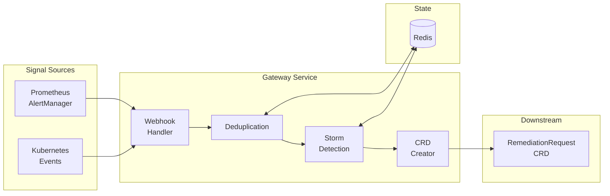

# Gateway Service

**Version**: v1.5
**Status**: ✅ Implementation Complete (95%)
**Service Type**: Stateless HTTP API
**Priority**: **P0 - CRITICAL** (Entry point to entire system)

---

## Quick Reference

| Attribute | Value |
|-----------|-------|
| **API Port** | 8080 |
| **Health Port** | 8081 (`/healthz`, `/readyz`) |
| **Metrics Port** | 9090 (`/metrics` with auth) |
| **Namespace** | `kubernaut-system` |
| **Replicas** | 2-5 (horizontal scaling) |

### API Endpoints

| Endpoint | Method | Purpose |
|----------|--------|---------|
| `/api/v1/signals/prometheus` | POST | Prometheus AlertManager webhooks |
| `/api/v1/signals/kubernetes-event` | POST | Kubernetes Event ingestion |
| `/healthz` | GET | Liveness probe |
| `/readyz` | GET | Readiness probe |
| `/metrics` | GET | Prometheus metrics (authenticated) |

---

## 🗂️ Documentation Index

| Document | Purpose | Lines | Status |
|----------|---------|-------|--------|
| **[overview.md](./overview.md)** | Service architecture, decisions, diagrams | ~612 | ✅ Complete |
| **[BUSINESS_REQUIREMENTS.md](./BUSINESS_REQUIREMENTS.md)** | Complete BR catalog (BR-GATEWAY-*) | ~735 | ✅ Complete |
| **[BR_MAPPING.md](./BR_MAPPING.md)** | Test-to-BR traceability matrix | ~307 | ✅ Complete |
| **[api-specification.md](./api-specification.md)** | OpenAPI specification | ~1,182 | ✅ Complete |
| **[implementation.md](./implementation.md)** | HTTP handlers, processing pipeline | ~1,354 | ✅ Complete |
| **[implementation-checklist.md](./implementation-checklist.md)** | APDC-TDD phased checklist | ~302 | ✅ Complete |
| **[integration-points.md](./integration-points.md)** | CRD creation, Redis, upstream/downstream | ~324 | ✅ Complete |
| **[deduplication.md](./deduplication.md)** | Deduplication algorithm details | ~605 | ✅ Complete |
| **[crd-integration.md](./crd-integration.md)** | RemediationRequest CRD creation | ~333 | ✅ Complete |
| **[security-configuration.md](./security-configuration.md)** | RBAC, NetworkPolicy, Secrets | ~340 | ✅ Complete |
| **[observability-logging.md](./observability-logging.md)** | Structured logging, tracing | ~280 | ✅ Complete |
| **[metrics-slos.md](./metrics-slos.md)** | Prometheus metrics, SLI/SLO | ~228 | ✅ Complete |
| **[testing-strategy.md](./testing-strategy.md)** | Defense-in-depth testing approach | ~803 | ✅ Complete |

**Total**: ~7,405 lines across 13 core specification documents
**Status**: ✅ **100% Complete** - Production-ready Signal Ingestion Gateway

---

## 📁 File Organization

```
gateway-service/
├── 📄 README.md (you are here)              - Service index & navigation
├── 📘 overview.md                           - High-level architecture ✅ (612 lines)
├── 📋 BUSINESS_REQUIREMENTS.md              - 74 BRs with test mapping ✅ (735 lines)
├── 🔗 BR_MAPPING.md                         - Test-to-BR traceability ✅ (307 lines)
├── 🔧 api-specification.md                  - OpenAPI specification ✅ (1,182 lines)
├── ⚙️  implementation.md                    - HTTP handlers, pipeline ✅ (1,354 lines)
├── ✅ implementation-checklist.md           - APDC-TDD phases ✅ (302 lines)
├── 🔗 integration-points.md                 - CRD, Redis, integrations ✅ (324 lines)
├── 🧹 deduplication.md                      - Dedup algorithm details ✅ (605 lines)
├── 📝 crd-integration.md                    - RemediationRequest CRD ✅ (333 lines)
├── 🔒 security-configuration.md             - RBAC, NetworkPolicy ✅ (340 lines)
├── 📊 observability-logging.md              - Logging & tracing ✅ (280 lines)
├── 📈 metrics-slos.md                       - Prometheus metrics ✅ (228 lines)
├── 🧪 testing-strategy.md                   - Test patterns ✅ (803 lines)
├── 📁 implementation/                       - Implementation phase guides
│   ├── plans/                               - DD-GATEWAY-008, 009, 010 plans
│   ├── IMPLEMENTATION_PLAN_V2.27.md         - Current implementation plan
│   └── 00-HANDOFF-SUMMARY.md                - Handoff summary
├── 🧪 e2e-testing/                          - E2E test documentation
│   ├── GATEWAY_E2E_SUMMARY.md               - E2E test summary
│   └── GATEWAY_E2E_INFRASTRUCTURE_ASSESSMENT.md
└── 📁 archive/                              - Historical progress tracking
    ├── day-reports/                         - DAY1-DAY9 progress files
    ├── implementation-progress/             - PHASE, COMPLETE files
    ├── migration-status/                    - CHI migration files
    └── debug-reports/                       - Debug & troubleshooting files
```

**Legend**:
- ✅ = Complete documentation
- 📋 = Core specification document
- 🧪 = Test-related documentation
- 🔒 = Security-related documentation
- 📁 = Directory

---

## 🏗️ Implementation Structure

### **Binary Location**
- **Directory**: `cmd/gateway/`
- **Entry Point**: `cmd/gateway/main.go`
- **Build Command**: `go build -o bin/gateway ./cmd/gateway`

### **API Gateway Components**
- **Package**: `pkg/gateway/`
  - `server.go` - HTTP server and routing
  - `config/` - Configuration management
  - `adapters/` - Signal source adapters (Prometheus, K8s Events)
  - `processing/` - Core processing logic
    - `normalizer.go` - Signal normalization
    - `deduplication.go` - Redis-based deduplication
    - `storm_detector.go` - Rate-based storm detection
    - `storm_aggregator.go` - Storm aggregation logic
    - `classifier.go` - Environment classification
    - `crd_creator.go` - RemediationRequest CRD creation
  - `metrics/` - Prometheus metrics

### **Tests**
- `test/unit/gateway/` - **333 unit tests**
- `test/integration/gateway/` - **145 integration tests**
- `test/e2e/gateway/` - E2E tests (pending Kind cluster infrastructure)

**See Also**: [cmd/ directory structure](../../../../cmd/README.md) for complete binary organization.

---

## 🎯 Service Purpose

Gateway Service is the **single entry point** for all external signals into the Kubernaut intelligent remediation system:

```
Prometheus AlertManager  ─┐
                         ├──► Gateway Service ──► RemediationRequest CRD
Kubernetes Events        ─┘
```

### Core Capabilities

1. **Signal Ingestion** - Prometheus AlertManager webhooks, Kubernetes Events
2. **Resource Validation** - Reject signals without Kubernetes resource info
3. **Deduplication** - Redis-based fingerprinting (40-60% reduction)
4. **Storm Detection** - Rate + pattern-based aggregation
5. **CRD Creation** - RemediationRequest with TargetResource, TargetType

### V1 Scope

✅ **Included**:
- Prometheus AlertManager webhook ingestion
- Kubernetes Event API ingestion
- Redis-based deduplication (5-minute window)
- Storm detection (rate + pattern based)
- RemediationRequest CRD creation
- Resource validation (reject non-K8s signals)

❌ **Excluded (V2)**:
- Non-Kubernetes signals (AWS, Azure, Datadog)
- ML-based storm detection
- Multi-cluster aggregation

---

## 🏛️ Architecture



---

## 📊 Test Coverage

| Test Type | Count | Coverage Target |
|-----------|-------|-----------------|
| **Unit Tests** | 333 | 70%+ |
| **Integration Tests** | 145 | 20% |
| **E2E Tests** | Pending | 10% |

### Running Tests

```bash
# Unit tests
make test-unit-gateway

# Integration tests (requires Redis, envtest)
make test-integration-gateway

# E2E tests (requires Kind cluster)
make test-e2e-gateway
```

---

## 🔗 Related Design Decisions

| Decision | Purpose |
|----------|---------|
| [DD-CATEGORIZATION-001](../../../architecture/decisions/DD-CATEGORIZATION-001-gateway-signal-processing-split-assessment.md) | Categorization delegation to SignalProcessing |
| [DD-GATEWAY-008](../../../architecture/decisions/DD-GATEWAY-008-storm-aggregation-first-alert-handling.md) | Storm aggregation window handling |
| [DD-GATEWAY-009](../../../architecture/decisions/DD-GATEWAY-009-state-based-deduplication.md) | State-based deduplication |
| [DD-GATEWAY-NON-K8S-SIGNALS](../../../architecture/decisions/DD-GATEWAY-NON-K8S-SIGNALS.md) | Non-Kubernetes signal support (V1.x/V2.0) |

---

## 📝 Version History

### **v1.5** (2025-12-03) - **CURRENT**
- ✅ **Documentation Standardization**: README restructured to match ADR-039 template
- ✅ **Documentation Index**: Added comprehensive doc catalog with line counts
- ✅ **File Organization**: Visual tree showing all documentation files
- ✅ **Implementation Structure**: Added binary/gateway/pkg location guide
- ✅ **Enhanced Navigation**: Consistent structure with all V1.0 services

### **v1.4** (2025-12-03)
- Added `TargetResource` field to RemediationRequest spec
- Added `TargetType` field for future non-K8s support
- Implemented resource validation (reject signals without K8s resource info)
- Added `gateway_signals_rejected_total` metric
- Fixed all integration test failures

### **v1.3** (2025-12-01)
- Aligned `DeduplicationInfo` with shared types
- Renamed `firstSeen/lastSeen` to `firstOccurrence/lastOccurrence`

### **v1.2** (2025-11-27)
- Delegated categorization to SignalProcessing
- Gateway now sets placeholder priority values

---

**Document Status**: ✅ Complete
**Last Updated**: 2025-12-03
