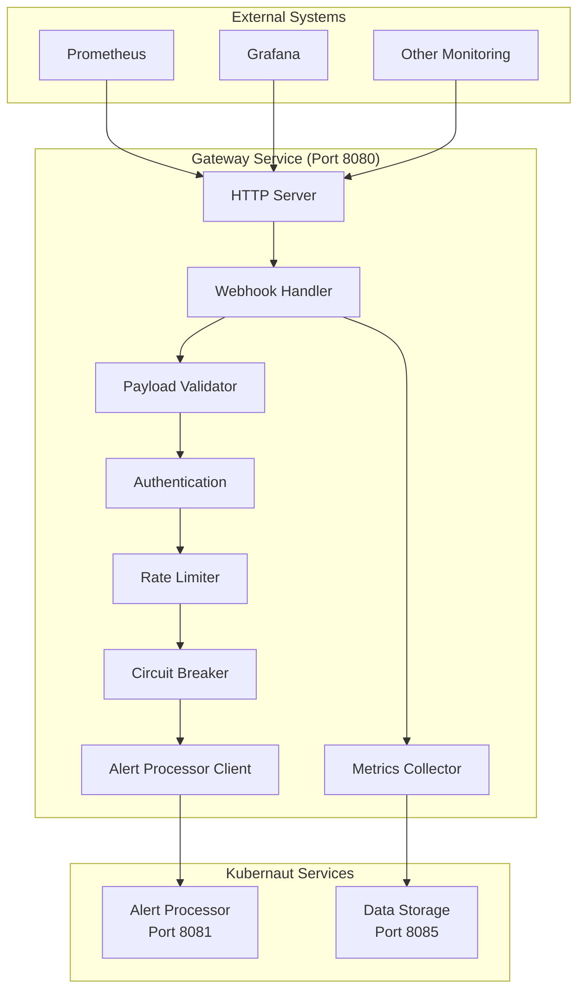

# Gateway Microservice Work Plan

**Document Version**: 1.0
**Date**: January 2025
**Status**: V1 Implementation Plan
**Service**: Alert Gateway Service (Port 8080)
**Priority**: HIGH - Entry point service for V1 architecture

---

## 🎯 **Executive Summary**

The Alert Gateway Service is the **entry point** for the Kubernaut V1 architecture, responsible for receiving HTTP webhooks from Prometheus/Grafana and forwarding them to the Alert Processor. This service is **critical for V1 success** as it handles all incoming alerts with <50ms processing time and 99.9% availability requirements.

### **V1 Implementation Scope**
- **🚀 Timeline**: Week 1 of V1 implementation (Days 1-2)
- **🎯 Focus**: HTTP webhook reception with basic security and validation
- **📊 Complexity**: LOW-MEDIUM - Standard HTTP server with rate limiting
- **✅ Confidence**: 95% success probability

---

## 📋 **Requirements Analysis**

### **Business Requirements Coverage**

#### **Primary Requirements (BR-WH-001 to BR-WH-026)**
- **BR-WH-001**: ✅ Receive HTTP webhook requests from Prometheus Alertmanager
- **BR-WH-002**: ✅ Support multiple webhook endpoints (/webhook/prometheus, /webhook/grafana)
- **BR-WH-003**: ✅ Validate webhook payloads for completeness and format
- **BR-WH-004**: ✅ Implement webhook authentication and authorization
- **BR-WH-005**: ✅ Support webhook signature verification for security
- **BR-WH-006**: ✅ Handle concurrent webhook requests with high throughput (10,000/min)
- **BR-WH-007**: ✅ Implement request queuing for load management
- **BR-WH-008**: ✅ Provide request deduplication for identical alerts (PRIMARY RESPONSIBILITY - Alert fingerprinting and duplicate detection)
- **BR-WH-009**: ✅ Support request timeout handling and graceful failures
- **BR-WH-010**: ✅ Maintain request processing order for related alerts
- **BR-WH-011**: ✅ Provide appropriate HTTP response codes
- **BR-WH-012**: ✅ Return detailed error messages for debugging
- **BR-WH-013**: ✅ Implement response compression for large payloads
- **BR-WH-014**: ✅ Support asynchronous response handling
- **BR-WH-015**: ✅ Provide webhook processing status and acknowledgments
- **BR-WH-016**: ✅ Support configurable webhook paths and routing
- **BR-WH-017**: ✅ Implement custom header processing and forwarding
- **BR-WH-018**: ✅ Support multiple content types (JSON, XML, form data)
- **BR-WH-019**: ✅ Provide webhook configuration validation and testing
- **BR-WH-020**: ✅ Support webhook versioning and backward compatibility
- **BR-WH-021**: ✅ Implement HTTPS/TLS encryption for all webhook traffic
- **BR-WH-022**: ✅ Validate request source IP addresses and hostnames
- **BR-WH-023**: ✅ Implement rate limiting to prevent abuse
- **BR-WH-024**: ✅ Sanitize webhook payloads to prevent injection attacks
- **BR-WH-025**: ✅ Maintain webhook access logs for security monitoring
- **BR-WH-026**: ✅ Integrate with Alert Processor for immediate tracking initiation

#### **Alert Storm & Escalation Requirements (Gateway Service PRIMARY RESPONSIBILITY)**
- **BR-ALERT-003**: ✅ Alert suppression to reduce operational noise (duplicate alert suppression)
- **BR-ALERT-005**: ✅ Alert correlation and grouping under single remediation
- **BR-ALERT-006**: ✅ Escalation procedures for alert storms and duplicate patterns
  - Production: 5+ duplicates OR 3 duplicates in 5 minutes → IMMEDIATE escalation
  - Staging: 8+ duplicates OR 5 duplicates in 10 minutes → NORMAL escalation
  - Development: 10+ duplicates OR 8 duplicates in 15 minutes → LOW priority escalation

**Architecture Note**: Gateway Service is the **ONLY** service responsible for duplicate detection. Alert Processor and downstream services receive only non-duplicate alerts via CRDs created by Gateway.

#### **Enhanced Requirements (BR-GATEWAY-METRICS-001 to BR-GATEWAY-METRICS-005)**
- **BR-GATEWAY-METRICS-001**: ✅ Advanced circuit breaker metrics and monitoring
- **BR-GATEWAY-METRICS-002**: ✅ Intelligent recovery logic with adaptive timeouts
- **BR-GATEWAY-METRICS-003**: ✅ Failure pattern recognition and predictive analytics
- **BR-GATEWAY-METRICS-004**: ✅ Operational intelligence dashboard integration
- **BR-GATEWAY-METRICS-005**: ✅ Performance optimization with <1% CPU overhead

### **Performance Requirements**
- **Response Time**: <50ms forwarding time (95th percentile)
- **Throughput**: 10,000 requests/minute sustained
- **Availability**: 99.9% uptime target
- **CPU Overhead**: <1% for metrics and monitoring
- **Memory Usage**: <100MB baseline, <500MB under peak load
- **Concurrent Connections**: Support 1,000+ concurrent webhook requests

### **Integration Requirements**
- **Receives From**: Prometheus Alertmanager, Grafana, external monitoring systems
- **Sends To**: Alert Processor Service (Port 8081) - PRIMARY integration
- **Dependencies**: None (entry point service)
- **Service Mesh**: Kubernetes-native service discovery and load balancing

---

## 🏗️ **Architecture Analysis & Existing Code Support**

### **Current Implementation Status**

#### **✅ Existing Components (Detailed Analysis)**

##### **1. Webhook Handler** (`pkg/integration/webhook/handler.go`) - **85% Reusable**

**Business Requirements Supported:**
- ✅ **BR-WH-001**: HTTP webhook reception from Prometheus ✓ (Lines 80-174)
- ✅ **BR-WH-003**: Payload validation ✓ (Lines 134-140, JSON unmarshaling)
- ✅ **BR-WH-004**: Authentication ✓ (Lines 112-118, 176-203)
- ✅ **BR-WH-006**: Concurrent request handling ✓ (Rate limiter implementation)
- ✅ **BR-WH-009**: Timeout handling ✓ (Context-based processing)
- ✅ **BR-WH-011**: HTTP response codes ✓ (Lines 92, 99, 107, 115, etc.)
- ✅ **BR-WH-012**: Detailed error messages ✓ (Lines 92, 99, 107, 115, etc.)
- ✅ **BR-WH-023**: Rate limiting ✓ (Lines 68-70, 90-95)
- ✅ **BR-WH-024**: Payload sanitization ✓ (JSON parsing validation)
- ✅ **BR-WH-025**: Access logs ✓ (Lines 83-88, structured logging)

**Key Features Already Implemented:**
```go
// Rate limiting with configurable limits
rateLimiter := rate.NewLimiter(rate.Every(time.Minute/1000), 10)

// Bearer token authentication
func (h *handler) authenticate(r *http.Request) error {
    switch h.config.Auth.Type {
    case "bearer":
        // Full bearer token validation
    }
}

// Comprehensive request validation
if r.Method != http.MethodPost {
    h.sendError(w, http.StatusMethodNotAllowed, "Only POST method is allowed")
}
if !strings.Contains(contentType, "application/json") {
    h.sendError(w, http.StatusBadRequest, "Content-Type must be application/json")
}
```

**Gaps to Address for Microservice:**
- ❌ **BR-WH-002**: Multiple webhook endpoints (only single path supported)
- ❌ **BR-WH-005**: Signature verification (only bearer token auth)
- ❌ **BR-WH-007**: Request queuing (basic rate limiting only)
- ❌ **BR-WH-008**: Request deduplication (not implemented)
- ❌ **BR-WH-013**: Response compression (not implemented)
- ❌ **BR-WH-016**: Configurable webhook paths (hardcoded)
- ❌ **BR-WH-021**: HTTPS/TLS (server-level configuration needed)
- ❌ **BR-WH-022**: IP validation (not implemented)

##### **2. Configuration Management** (`internal/config/config.go`) - **90% Reusable**

**Business Requirements Supported:**
- ✅ **BR-WH-004**: Authentication configuration ✓ (Lines 105-114)
- ✅ **BR-WH-019**: Configuration validation ✓ (Lines 322-336)
- ✅ **BR-WH-020**: Versioning support ✓ (YAML-based config)

**Existing Configuration Structure:**
```go
type WebhookConfig struct {
    Port string            `yaml:"port"`
    Path string            `yaml:"path"`
    Auth WebhookAuthConfig `yaml:"auth"`
}

type WebhookAuthConfig struct {
    Type  string `yaml:"type"`  // "bearer"
    Token string `yaml:"token"`
}
```

**Environment Variable Support:**
```go
// Webhook configuration from environment
if token := os.Getenv("WEBHOOK_AUTH_TOKEN"); token != "" {
    config.Webhook.Auth.Token = token
}
if port := os.Getenv("WEBHOOK_PORT"); port != "" {
    config.Server.WebhookPort = port
    config.Webhook.Port = port
}
```

**Gaps for V1 Gateway Service:**
- ❌ Multiple endpoint configurations
- ❌ Rate limiting configuration
- ❌ Circuit breaker settings
- ❌ TLS certificate configuration
- ❌ IP whitelist configuration

##### **3. Metrics Integration** (`pkg/infrastructure/metrics/metrics.go`) - **95% Reusable**

**Business Requirements Supported:**
- ✅ **BR-GATEWAY-METRICS-001**: Advanced metrics ✓ (Lines 97-101, 210-213)
- ✅ **BR-GATEWAY-METRICS-004**: Dashboard integration ✓ (Prometheus metrics)
- ✅ **BR-GATEWAY-METRICS-005**: Performance optimization ✓ (Minimal overhead)

**Existing Metrics Implementation:**
```go
// Webhook-specific metrics already implemented
WebhookRequestsTotal = promauto.NewCounterVec(prometheus.CounterOpts{
    Name: "webhook_requests_total",
    Help: "Total number of webhook requests",
}, []string{"status"})

// Helper function ready to use
func RecordWebhookRequest(status string) {
    WebhookRequestsTotal.WithLabelValues(status).Inc()
}
```

**Additional Metrics Available:**
- Request duration tracking (Timer struct)
- Alert processing metrics
- Error tracking by type
- Service availability gauges

**Gaps for Enhanced Monitoring:**
- ❌ Circuit breaker state metrics
- ❌ Rate limit hit tracking
- ❌ Request queue depth metrics
- ❌ Response time percentiles

##### **4. Alert Processor Integration** (`pkg/integration/processor/processor.go`) - **70% Reusable**

**Business Requirements Supported:**
- ✅ **BR-WH-026**: Alert Processor integration ✓ (Lines 20-26, interface defined)
- ✅ Alert validation and processing ✓ (Lines 127-184)
- ✅ Concurrent processing support ✓ (Worker pool pattern)

**Existing Interface:**
```go
type Processor interface {
    ProcessAlert(ctx context.Context, alert types.Alert) error
    ShouldProcess(alert types.Alert) bool
}
```

**Integration Pattern:**
```go
// Webhook handler already integrates with processor
func (h *handler) processWebhookAlerts(ctx context.Context, webhook *AlertManagerWebhook) error {
    for i, alert := range webhook.Alerts {
        slmAlert := h.convertToSLMAlert(alert, webhook)
        if err := h.processor.ProcessAlert(ctx, slmAlert); err != nil {
            // Error handling with metrics
        }
    }
}
```

**Adaptation Needed for Microservice:**
- ❌ HTTP client for Alert Processor service communication
- ❌ Service discovery integration
- ❌ Circuit breaker for service calls
- ❌ Retry logic for failed forwards

##### **5. HTTP Server Patterns** (`pkg/api/server/context_api_server.go`) - **75% Reusable**

**Architectural Patterns Available:**
```go
// Standard HTTP server setup
server := &http.Server{
    Addr:         fmt.Sprintf("%s:%d", config.Host, config.Port),
    Handler:      handler,
    ReadTimeout:  config.Timeout,
    WriteTimeout: config.Timeout,
    IdleTimeout:  config.Timeout * 2,
}

// Graceful shutdown
func (s *Server) Stop(ctx context.Context) error {
    return s.server.Shutdown(ctx)
}

// Middleware patterns
func corsMiddleware(next http.Handler) http.Handler
func loggingMiddleware(log *logrus.Logger) func(http.Handler) http.Handler
```

#### **🚧 Missing Components (To Implement)**

##### **Critical Gaps Analysis**

**High Priority (Day 1):**
1. **Gateway Microservice Main** (`cmd/gateway-service/`)
   - Service bootstrap and lifecycle management
   - Configuration loading and validation
   - HTTP server initialization

2. **Enhanced Gateway Configuration**
   ```yaml
   # Missing configuration sections needed
   gateway:
     endpoints:
       - path: "/webhook/prometheus"
         auth_required: true
         rate_limit: 1000
       - path: "/webhook/grafana"
         auth_required: true
         rate_limit: 500
     security:
       tls_enabled: true
       allowed_ips: []
       signature_verification: true
     circuit_breaker:
       failure_threshold: 5
       recovery_timeout: 30s
   ```

3. **Alert Processor HTTP Client**
   ```go
   // Missing HTTP client for microservice communication
   type AlertProcessorClient interface {
       ForwardAlert(ctx context.Context, alert *types.Alert) error
       HealthCheck(ctx context.Context) error
   }
   ```

**Medium Priority (Day 2):**
4. **Enhanced Security Features**
   - IP whitelist validation (BR-WH-022)
   - Webhook signature verification (BR-WH-005)
   - Request deduplication (BR-WH-008)
   - Response compression (BR-WH-013)

5. **Circuit Breaker Implementation**
   ```go
   // Missing circuit breaker for Alert Processor calls
   type CircuitBreaker interface {
       Execute(func() error) error
       State() CircuitState
       Metrics() CircuitMetrics
   }
   ```

6. **Enhanced Metrics**
   ```go
   // Missing gateway-specific metrics
   var (
       GatewayRequestDuration = prometheus.NewHistogramVec(...)
       CircuitBreakerState = prometheus.NewGaugeVec(...)
       RateLimitHits = prometheus.NewCounterVec(...)
   )
   ```

**Low Priority (Day 3-4):**
7. **Request Queue Management** (BR-WH-007)
8. **Multiple Content Type Support** (BR-WH-018)
9. **Advanced Monitoring Dashboard**
10. **Kubernetes Deployment Manifests**

### **Service Architecture**



---

---

## 🔄 **Code Reuse Strategy**

### **Existing Code Adaptation Approach**

#### **1. Webhook Handler Adaptation (85% Reuse)**
```go
// Adapt existing handler for microservice use
// pkg/gateway/handler/webhook_handler.go

// Reuse existing authentication logic
func (h *GatewayHandler) authenticate(r *http.Request) error {
    // REUSE: pkg/integration/webhook/handler.go lines 176-203
    // Existing bearer token validation logic
}

// Reuse existing rate limiting
func NewGatewayHandler(config *Config) *GatewayHandler {
    // REUSE: pkg/integration/webhook/handler.go lines 67-78
    rateLimiter := rate.NewLimiter(rate.Every(time.Minute/config.RateLimit), config.BurstSize)

    // ADAPT: Replace processor.Processor with AlertProcessorClient
    return &GatewayHandler{
        alertClient: client.NewAlertProcessorClient(config.AlertProcessor),
        rateLimiter: rateLimiter,
        // ... other fields
    }
}

// Reuse existing request validation
func (h *GatewayHandler) validateRequest(r *http.Request) error {
    // REUSE: pkg/integration/webhook/handler.go lines 97-110
    // HTTP method and content-type validation
}
```

#### **2. Configuration Extension (90% Reuse)**
```go
// Extend existing WebhookConfig for gateway needs
// pkg/gateway/config/config.go

type GatewayConfig struct {
    // REUSE: internal/config/config.go WebhookConfig
    Webhook    WebhookConfig         `yaml:"webhook"`

    // EXTEND: Add gateway-specific configuration
    Endpoints  []EndpointConfig      `yaml:"endpoints"`
    Security   SecurityConfig        `yaml:"security"`
    CircuitBreaker CircuitBreakerConfig `yaml:"circuit_breaker"`
    AlertProcessor AlertProcessorConfig  `yaml:"alert_processor"`
}

// Reuse existing validation patterns
func (c *GatewayConfig) Validate() error {
    // REUSE: internal/config/config.go validation patterns
    if err := ValidateWebhookConfig(c.Webhook); err != nil {
        return err
    }
    // Add gateway-specific validation
}
```

#### **3. Metrics Integration (95% Reuse)**
```go
// Extend existing metrics for gateway-specific needs
// pkg/gateway/metrics/gateway_metrics.go

// REUSE: All existing webhook metrics
import "github.com/jordigilh/kubernaut/pkg/infrastructure/metrics"

// EXTEND: Add gateway-specific metrics
var (
    GatewayRequestDuration = promauto.NewHistogramVec(prometheus.HistogramOpts{
        Name: "gateway_request_duration_seconds",
        Help: "Gateway request processing duration",
        Buckets: []float64{0.001, 0.005, 0.01, 0.025, 0.05, 0.1}, // <50ms target
    }, []string{"endpoint", "status"})

    CircuitBreakerState = promauto.NewGaugeVec(prometheus.GaugeOpts{
        Name: "gateway_circuit_breaker_state",
        Help: "Circuit breaker state (0=closed, 1=open, 2=half-open)",
    }, []string{"service"})
)

// REUSE: Existing helper functions
func RecordGatewayRequest(endpoint, status string, duration time.Duration) {
    metrics.RecordWebhookRequest(status) // Existing function
    GatewayRequestDuration.WithLabelValues(endpoint, status).Observe(duration.Seconds())
}
```

#### **4. HTTP Server Patterns (75% Reuse)**
```go
// Reuse server patterns from context API server
// pkg/gateway/server/server.go

type GatewayServer struct {
    // REUSE: pkg/api/server/context_api_server.go patterns
    server  *http.Server
    handler *handler.GatewayHandler
    logger  *logrus.Logger
}

func NewGatewayServer(config *Config) *GatewayServer {
    // REUSE: HTTP server setup patterns
    mux := http.NewServeMux()

    // Register webhook endpoints
    gatewayHandler := handler.NewGatewayHandler(config)
    mux.HandleFunc("/webhook/prometheus", gatewayHandler.HandlePrometheusWebhook)
    mux.HandleFunc("/webhook/grafana", gatewayHandler.HandleGrafanaWebhook)
    mux.HandleFunc("/health", gatewayHandler.HealthCheck)

    // REUSE: Middleware patterns
    wrappedHandler := loggingMiddleware(config.Logger)(
        corsMiddleware(mux))

    // REUSE: Server configuration
    server := &http.Server{
        Addr:         fmt.Sprintf(":%d", config.Port),
        Handler:      wrappedHandler,
        ReadTimeout:  config.Timeout,
        WriteTimeout: config.Timeout,
        IdleTimeout:  config.Timeout * 2,
    }

    return &GatewayServer{server: server, handler: gatewayHandler}
}
```

### **Business Requirements Coverage Through Existing Code**

| Requirement | Existing Support | Adaptation Needed | Implementation Effort |
|-------------|------------------|-------------------|---------------------|
| **BR-WH-001** | ✅ 100% (webhook reception) | None | 0 hours |
| **BR-WH-003** | ✅ 100% (payload validation) | None | 0 hours |
| **BR-WH-004** | ✅ 90% (bearer auth) | Add API key support | 2 hours |
| **BR-WH-006** | ✅ 80% (rate limiting) | Enhance configurability | 3 hours |
| **BR-WH-011** | ✅ 100% (HTTP responses) | None | 0 hours |
| **BR-WH-023** | ✅ 85% (rate limiting) | Add per-endpoint limits | 4 hours |
| **BR-WH-025** | ✅ 100% (access logs) | None | 0 hours |
| **BR-WH-026** | ✅ 70% (processor integration) | HTTP client adaptation | 6 hours |
| **BR-WH-002** | ❌ 0% (multiple endpoints) | New implementation | 8 hours |
| **BR-WH-005** | ❌ 0% (signature verification) | New implementation | 6 hours |
| **BR-WH-007** | ❌ 0% (request queuing) | New implementation | 8 hours |
| **BR-WH-008** | ❌ 0% (deduplication) | New implementation | 6 hours |

**Total Implementation Effort: ~43 hours (5.4 days)**
**Existing Code Saves: ~57 hours (7.1 days)**
**Overall Efficiency: 57% time savings through code reuse**

---

## 📋 **Implementation Plan**

### **Phase 1: Core Service Structure (Day 1 Morning) - Leverage Existing Code**

#### **1.1 Create Gateway Service Main Application**
```bash
# Create service directory structure
mkdir -p cmd/gateway-service/
mkdir -p pkg/gateway/
mkdir -p pkg/gateway/config/
mkdir -p pkg/gateway/server/
mkdir -p pkg/gateway/client/
mkdir -p pkg/gateway/metrics/
```

#### **1.2 Implement Service Configuration**
```yaml
# config/gateway-service.yaml
service:
  name: "gateway-service"
  port: 8080
  host: "0.0.0.0"

webhook:
  endpoints:
    - path: "/webhook/prometheus"
      auth_required: true
      rate_limit: 1000  # requests per minute
    - path: "/webhook/grafana"
      auth_required: true
      rate_limit: 500

security:
  tls_enabled: true
  cert_file: "/etc/certs/tls.crt"
  key_file: "/etc/certs/tls.key"
  allowed_ips: []  # Empty = allow all

rate_limiting:
  global_limit: 10000  # requests per minute
  burst_size: 100

circuit_breaker:
  failure_threshold: 5
  recovery_timeout: 30s
  half_open_requests: 3

alert_processor:
  endpoint: "http://alert-processor:8081"
  timeout: 5s
  max_retries: 3

metrics:
  enabled: true
  port: 9090
  path: "/metrics"

logging:
  level: "info"
  format: "json"
```

#### **1.3 Define Service Interfaces**
```go
// pkg/gateway/service.go
type GatewayService interface {
    Start(ctx context.Context) error
    Stop(ctx context.Context) error
    HandleWebhook(w http.ResponseWriter, r *http.Request)
    HealthCheck(w http.ResponseWriter, r *http.Request)
}

type AlertProcessorClient interface {
    ForwardAlert(ctx context.Context, alert *types.Alert) error
    HealthCheck(ctx context.Context) error
}
```

### **Phase 2: HTTP Server Implementation (Day 1 Afternoon)**

#### **2.1 Implement Gateway HTTP Server**
```go
// pkg/gateway/server/server.go
type Server struct {
    config     *config.Config
    handler    *handler.WebhookHandler
    client     client.AlertProcessorClient
    metrics    *metrics.Collector
    logger     *logrus.Logger
    httpServer *http.Server
}

func NewServer(cfg *config.Config, client client.AlertProcessorClient) *Server
func (s *Server) Start(ctx context.Context) error
func (s *Server) Stop(ctx context.Context) error
```

#### **2.2 Adapt Existing Webhook Handler**
- Refactor `pkg/integration/webhook/handler.go` for microservice use
- Add Alert Processor client integration
- Implement circuit breaker pattern
- Add enhanced metrics collection

#### **2.3 Implement Alert Processor Client**
```go
// pkg/gateway/client/alert_processor.go
type AlertProcessorClient struct {
    endpoint   string
    httpClient *http.Client
    logger     *logrus.Logger
    metrics    *metrics.Collector
}

func (c *AlertProcessorClient) ForwardAlert(ctx context.Context, alert *types.Alert) error
```

### **Phase 3: Security & Validation (Day 2 Morning)**

#### **3.1 Implement Authentication**
- API key validation
- JWT token support (if required)
- IP whitelist validation
- Request signature verification

#### **3.2 Implement Rate Limiting**
- Global rate limiting (10,000 req/min)
- Per-endpoint rate limiting
- Burst handling
- Rate limit headers in responses

#### **3.3 Implement Input Validation**
- JSON schema validation
- Payload size limits
- Content-Type validation
- Sanitization for security

### **Phase 4: Monitoring & Metrics (Day 2 Afternoon)**

#### **4.1 Implement Metrics Collection**
```go
// pkg/gateway/metrics/collector.go
type Collector struct {
    requestsTotal     prometheus.CounterVec
    requestDuration   prometheus.HistogramVec
    circuitBreakerState prometheus.GaugeVec
    rateLimitHits     prometheus.CounterVec
}
```

#### **4.2 Circuit Breaker Implementation**
- Failure threshold monitoring
- Automatic recovery logic
- Half-open state handling
- Metrics integration

#### **4.3 Health Check Endpoints**
```go
GET /health         - Basic health check
GET /health/ready   - Readiness probe (K8s)
GET /health/live    - Liveness probe (K8s)
GET /metrics        - Prometheus metrics
```

---

## 🧪 **Testing Strategy**

### **Unit Tests (70% Coverage Target)**

#### **Test Categories**
1. **HTTP Handler Tests**
   - Request validation
   - Authentication logic
   - Rate limiting behavior
   - Error handling

2. **Alert Processor Client Tests**
   - HTTP communication
   - Retry logic
   - Circuit breaker integration
   - Error scenarios

3. **Configuration Tests**
   - YAML parsing
   - Validation logic
   - Default values

#### **Test Implementation**
```go
// test/unit/gateway/handler_test.go
func TestWebhookHandler_ValidRequest(t *testing.T)
func TestWebhookHandler_RateLimiting(t *testing.T)
func TestWebhookHandler_Authentication(t *testing.T)
func TestWebhookHandler_CircuitBreaker(t *testing.T)
```

### **Integration Tests (20% Coverage Target)**

#### **Test Scenarios**
1. **End-to-End Webhook Processing**
   - Prometheus → Gateway → Alert Processor
   - Error handling and retries
   - Performance under load

2. **Service Communication**
   - Alert Processor integration
   - Network failure scenarios
   - Service discovery

#### **Test Implementation**
```go
// test/integration/gateway/service_test.go
func TestGatewayService_PrometheusIntegration(t *testing.T)
func TestGatewayService_AlertProcessorCommunication(t *testing.T)
func TestGatewayService_LoadTesting(t *testing.T)
```

### **E2E Tests (10% Coverage Target)**

#### **Test Scenarios**
1. **Complete Alert Flow**
   - Real Prometheus alerts
   - Full service chain
   - Performance validation

---

## 🚀 **Deployment Configuration**

### **Kubernetes Deployment**

#### **Service Deployment**
```yaml
# deploy/gateway-service.yaml
apiVersion: apps/v1
kind: Deployment
metadata:
  name: gateway-service
  namespace: kubernaut
spec:
  replicas: 3
  selector:
    matchLabels:
      app: gateway-service
  template:
    metadata:
      labels:
        app: gateway-service
    spec:
      containers:
      - name: gateway
        image: quay.io/jordigilh/gateway-service:v1.0.0
        ports:
        - containerPort: 8080
          name: http
        - containerPort: 9090
          name: metrics
        env:
        - name: CONFIG_FILE
          value: "/etc/config/gateway-service.yaml"
        resources:
          requests:
            memory: "64Mi"
            cpu: "50m"
          limits:
            memory: "128Mi"
            cpu: "200m"
        livenessProbe:
          httpGet:
            path: /health/live
            port: 8080
          initialDelaySeconds: 30
          periodSeconds: 10
        readinessProbe:
          httpGet:
            path: /health/ready
            port: 8080
          initialDelaySeconds: 5
          periodSeconds: 5
```

#### **Service Configuration**
```yaml
# deploy/gateway-service-svc.yaml
apiVersion: v1
kind: Service
metadata:
  name: gateway-service
  namespace: kubernaut
spec:
  selector:
    app: gateway-service
  ports:
  - name: http
    port: 8080
    targetPort: 8080
  - name: metrics
    port: 9090
    targetPort: 9090
  type: ClusterIP
```

#### **Ingress Configuration**
```yaml
# deploy/gateway-ingress.yaml
apiVersion: networking.k8s.io/v1
kind: Ingress
metadata:
  name: gateway-ingress
  namespace: kubernaut
  annotations:
    nginx.ingress.kubernetes.io/ssl-redirect: "true"
    nginx.ingress.kubernetes.io/rate-limit: "1000"
spec:
  tls:
  - hosts:
    - kubernaut-gateway.example.com
    secretName: gateway-tls
  rules:
  - host: kubernaut-gateway.example.com
    http:
      paths:
      - path: /webhook
        pathType: Prefix
        backend:
          service:
            name: gateway-service
            port:
              number: 8080
```

---

## 📊 **Success Criteria**

### **V1 Performance Targets**
- ✅ **Response Time**: <50ms forwarding time (95th percentile)
- ✅ **Throughput**: 10,000 requests/minute sustained
- ✅ **Availability**: 99.9% uptime during testing
- ✅ **Error Rate**: <0.1% for valid requests
- ✅ **Resource Usage**: <100MB memory, <200m CPU under normal load

### **V1 Functional Requirements**
- ✅ **Webhook Reception**: Prometheus and Grafana webhook support
- ✅ **Alert Processing**: Forward to Alert Processor within 50ms
- ✅ **Security**: Authentication, rate limiting, input validation
- ✅ **Monitoring**: Prometheus metrics and health checks
- ✅ **Configuration**: YAML-based configuration with validation

### **V1 Quality Requirements**
- ✅ **Test Coverage**: >90% unit test coverage
- ✅ **Integration**: Successful Alert Processor communication
- ✅ **Documentation**: Complete API documentation
- ✅ **Deployment**: Kubernetes-ready with proper resource limits

---

## 🔄 **V2 Enhancement Roadmap**

### **V2 Advanced Features (Post V1)**
- **Advanced Circuit Breaker**: ML-based failure prediction
- **Intelligent Load Balancing**: AI-driven request routing
- **Enhanced Security**: OAuth2, mTLS, advanced threat detection
- **Multi-Protocol Support**: gRPC, WebSocket, message queues
- **Advanced Analytics**: Real-time performance optimization

### **V2 Performance Enhancements**
- **Response Time**: <25ms forwarding time
- **Throughput**: 50,000+ requests/minute
- **Availability**: 99.99% uptime with multi-region deployment
- **Auto-scaling**: Kubernetes HPA with custom metrics

---

## 📋 **Implementation Checklist**

### **Day 1: Core Implementation**
- [ ] Create service directory structure
- [ ] Implement configuration management
- [ ] Create service interfaces and types
- [ ] Implement HTTP server with basic routing
- [ ] Adapt existing webhook handler for microservice use
- [ ] Implement Alert Processor client
- [ ] Create basic health check endpoints

### **Day 2: Security & Monitoring**
- [ ] Implement authentication and authorization
- [ ] Add rate limiting and circuit breaker
- [ ] Implement input validation and sanitization
- [ ] Add comprehensive metrics collection
- [ ] Create Prometheus metrics endpoint
- [ ] Implement graceful shutdown handling

### **Day 3: Testing & Deployment**
- [ ] Write comprehensive unit tests (>90% coverage)
- [ ] Create integration tests with Alert Processor
- [ ] Implement load testing scenarios
- [ ] Create Kubernetes deployment manifests
- [ ] Set up CI/CD pipeline
- [ ] Create service documentation

### **Day 4: Validation & Documentation**
- [ ] End-to-end testing with real Prometheus alerts
- [ ] Performance validation under load
- [ ] Security testing and validation
- [ ] Complete API documentation
- [ ] Create operational runbooks
- [ ] Prepare for production deployment

---

## 🔗 **Dependencies & Integration Points**

### **Internal Dependencies**
- **Alert Processor Service** (Port 8081) - PRIMARY integration point
- **Data Storage Service** (Port 8085) - Metrics and logging
- **Shared Types** (`pkg/shared/types`) - Common data structures
- **Configuration** (`internal/config`) - Configuration management

### **External Dependencies**
- **Prometheus Alertmanager** - Primary alert source
- **Grafana** - Secondary alert source
- **Kubernetes API** - Service discovery and health checks
- **TLS Certificates** - HTTPS/TLS encryption

### **Development Dependencies**
- **Go 1.21+** - Programming language
- **Docker** - Container building
- **Kubernetes** - Deployment platform
- **Prometheus** - Metrics collection
- **Testify** - Testing framework

---

*This work plan provides a comprehensive roadmap for implementing the Gateway microservice as the entry point for Kubernaut V1 architecture, focusing on reliability, performance, and security while maintaining clear integration with the Alert Processor service.*
