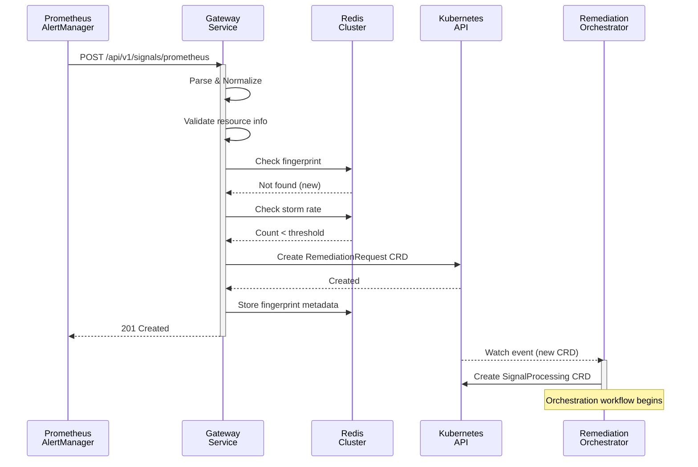

# Gateway Service - Integration Points

> **📋 Changelog**
> | Version | Date | Changes | Reference |
> |---------|------|---------|-----------|
> | v1.4 | 2026-02-18 | **Issue #91**: Removed `kubernaut.ai/signal-type` label from CRD example; use `spec.signalType`. `kubernaut.ai/severity` removed; use `spec.severity`. | - |
> | v1.3 | 2025-12-03 | Updated DeduplicationInfo to use firstOccurrence/lastOccurrence | [RemediationRequest CRD](../../../../api/remediation/v1alpha1/remediationrequest_types.go) |
> | v1.2 | 2025-12-03 | Added TargetResource and TargetType fields | [DD-GATEWAY-NON-K8S-SIGNALS](../../../architecture/decisions/DD-GATEWAY-NON-K8S-SIGNALS.md) |
> | v1.1 | 2025-11-27 | Removed ProviderData.resource (now in spec.targetResource) | API contract alignment |
> | v1.0 | 2025-10-05 | Initial design specification | - |

---

## Overview

Gateway Service integrates with multiple external systems and downstream services:

| Integration | Direction | Protocol | Purpose |
|-------------|-----------|----------|---------|
| **Prometheus AlertManager** | Inbound | HTTP webhook | Alert ingestion |
| **Kubernetes Event API** | Inbound | HTTP webhook / Watch | Event ingestion |
| **Redis Cluster** | Bidirectional | Redis protocol | Deduplication state |
| **Kubernetes API** | Outbound | Kubernetes client | CRD creation |
| **Remediation Orchestrator** | Downstream | CRD watch | Workflow orchestration |

---

## 📋 Authoritative CRD Schema

**IMPORTANT**: The RemediationRequest CRD schema is defined in:

**Authoritative Schema**: [`api/remediation/v1alpha1/remediationrequest_types.go`](../../../../api/remediation/v1alpha1/remediationrequest_types.go)

All field definitions in this document must match the authoritative schema.

---

## Upstream Integrations

### Prometheus AlertManager

**Endpoint**: `POST /api/v1/signals/prometheus`

**Request Format**:
```json
{
  "alerts": [{
    "status": "firing",
    "labels": {
      "alertname": "HighMemoryUsage",
      "severity": "critical",
      "namespace": "prod-payment-service",
      "pod": "payment-api-789"
    },
    "annotations": {
      "description": "Pod using 95% memory"
    },
    "startsAt": "2025-10-04T10:00:00Z"
  }]
}
```

**Response Format**:
```json
{
  "status": "created",
  "fingerprint": "a1b2c3d4...",
  "remediationRequestRef": "remediation-abc123",
  "environment": "prod",
  "priority": "P0"
}
```

**HTTP Status Codes**:
| Code | Meaning |
|------|---------|
| 201 Created | New signal accepted, CRD created |
| 202 Accepted | Duplicate detected, metadata updated |
| 400 Bad Request | Invalid format or missing resource info |
| 500 Internal Server Error | Transient error (retry) |

### Kubernetes Event API

**Endpoint**: `POST /api/v1/signals/kubernetes-event`

**Request Format**:
```json
{
  "event": {
    "type": "Warning",
    "reason": "OOMKilled",
    "message": "Container payment-api killed due to memory limit",
    "involvedObject": {
      "kind": "Pod",
      "name": "payment-api-789",
      "namespace": "prod-payment-service"
    },
    "firstTimestamp": "2025-10-04T10:00:00Z"
  }
}
```

---

## State Management: Redis

### Connection Configuration

```yaml
redis:
  address: "redis-cluster.kubernaut-system:6379"
  password: "${REDIS_PASSWORD}"
  db: 0
  poolSize: 100
  minIdleConns: 10
```

### Key Patterns

| Pattern | Purpose | TTL |
|---------|---------|-----|
| `alert:fingerprint:<hash>` | Deduplication metadata | 5 min |
| `alert:storm:rate:<alertname>` | Rate-based storm detection | 1 min |
| `alert:storm:pattern:<pattern>` | Pattern-based storm detection | 2 min |
| `alert:buffer:<window_id>` | Storm aggregation buffer | 2 min |

### Deduplication Metadata Structure

```go
type DeduplicationMetadata struct {
    Fingerprint     string    `redis:"fingerprint"`
    FirstOccurrence time.Time `redis:"firstOccurrence"`
    LastOccurrence  time.Time `redis:"lastOccurrence"`
    OccurrenceCount int       `redis:"occurrenceCount"`
    RemediationRef  string    `redis:"remediationRef"`
}
```

---

## Downstream Integration: RemediationRequest CRD

### CRD Creation

Gateway creates `RemediationRequest` CRDs that trigger the Remediation Orchestrator workflow:

```yaml
apiVersion: remediation.kubernaut.io/v1alpha1
kind: RemediationRequest
metadata:
  name: remediation-abc123
  namespace: kubernaut-system
  # Issue #91: kubernaut.ai/severity, kubernaut.ai/signal-type removed; use spec.severity, spec.signalType
  # Issue #166: kubernaut.ai/alert-name -> kubernaut.ai/signal-name
  labels:
    kubernaut.ai/signal-name: HighMemoryUsage
    kubernaut.ai/environment: prod
    kubernaut.ai/priority: P0
spec:
  # Core identification
  alertFingerprint: "a1b2c3d4e5..."
  signalName: "HighMemoryUsage"
  severity: "critical"

  # Placeholder values (finalized by SignalProcessing)
  environment: "prod"
  priority: "P0"

  # Target resource (REQUIRED in V1.0)
  targetResource:
    kind: Pod
    name: payment-api-789
    namespace: prod-payment-service

  # Target type (V1.0: always "kubernetes")
  targetType: "kubernetes"

  # Temporal data
  firingTime: "2025-10-04T10:00:00Z"
  receivedTime: "2025-10-04T10:00:05Z"

  # Deduplication metadata
  deduplication:
    isDuplicate: false
    firstOccurrence: "2025-10-04T10:00:00Z"
    lastOccurrence: "2025-10-04T10:00:00Z"
    occurrenceCount: 1

  # Source metadata (Issue #166: signalType="alert" for all adapters)
  signalType: "alert"

  # Provider-specific data (namespace, labels, etc.)
  providerData: |
    {"namespace":"prod-payment-service","labels":{"app":"payment-api"}}

status:
  phase: "Pending"  # Remediation Orchestrator updates this
```

### Storm Alert CRD

When storm detection triggers, the CRD includes aggregation metadata:

```yaml
apiVersion: remediation.kubernaut.io/v1alpha1
kind: RemediationRequest
metadata:
  name: remediation-storm-xyz
  namespace: kubernaut-system
  labels:
    kubernaut.ai/signal-name: PodOOMKilled
    kubernaut.ai/storm: "true"
spec:
  isStorm: true
  stormType: "rate"  # or "pattern"
  stormAlertCount: 15
  affectedResources:
    - kind: Pod
      name: web-app-789
      namespace: prod-ns-1
    - kind: Pod
      name: api-456
      namespace: prod-ns-2
  totalAffectedResources: 15
  # ... standard fields
```

---

## Integration Flow Diagram



---

## Error Handling

### Redis Outage

When Redis is unavailable:
1. **Deduplication**: Falls back to allowing all signals (duplicates may occur)
2. **Storm Detection**: Disabled (individual CRDs created)
3. **Metrics**: `gateway_redis_outage_total` counter incremented

### Kubernetes API Errors

| Error Type | Action |
|------------|--------|
| `Conflict` | Retry with exponential backoff |
| `NotFound` | Create new CRD |
| `ServerError` | Return 500, Alertmanager retries |
| `Forbidden` | Log error, return 500 |

### Graceful Degradation

```go
// Example: Redis outage handling
func (c *CRDCreator) checkDeduplication(ctx context.Context, fingerprint string) (bool, error) {
    metadata, err := c.redis.GetDeduplicationMetadata(ctx, fingerprint)
    if err != nil {
        if errors.Is(err, redis.ErrConnectionFailed) {
            // Redis outage: allow signal through (degraded mode)
            c.metrics.RedisOutageTotal.Inc()
            c.logger.Warn("Redis unavailable, skipping deduplication")
            return false, nil // Not a duplicate (allow through)
        }
        return false, err
    }
    return metadata != nil, nil
}
```

---

## Performance Requirements

| Metric | Target | Current |
|--------|--------|---------|
| Total response time (p95) | < 50ms | ~35ms |
| Redis lookup | < 5ms | ~2ms |
| CRD creation | < 20ms | ~15ms |
| Throughput | > 1000 signals/sec | TBD |

---

## Related Documents

- [overview.md](./overview.md) - Service architecture overview
- [deduplication.md](./deduplication.md) - Deduplication algorithm details
- [api-specification.md](./api-specification.md) - OpenAPI specification
- [DD-GATEWAY-008](../../../architecture/decisions/DD-GATEWAY-008-storm-aggregation-first-alert-handling.md) - Storm aggregation
- [DD-GATEWAY-NON-K8S-SIGNALS](../../../architecture/decisions/DD-GATEWAY-NON-K8S-SIGNALS.md) - Non-K8s signal support

