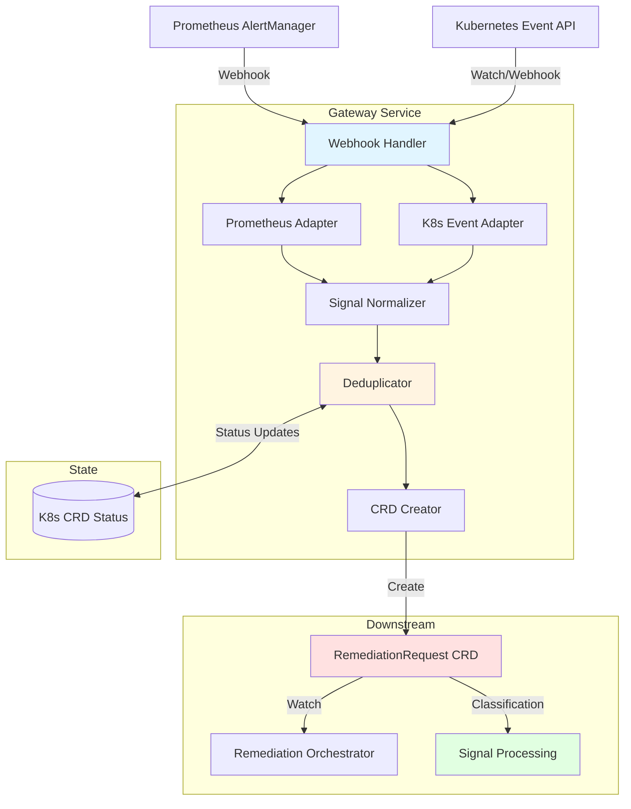
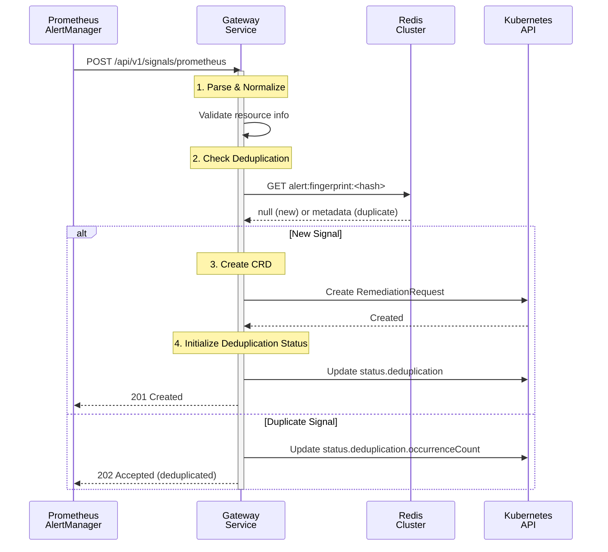

# Gateway Service - Overview

> **📋 Changelog**
> | Version | Date | Changes | Reference |
> |---------|------|---------|-----------|
> | v1.7 | 2025-12-07 | **ADR-049 Alignment**: RO owns RR schema; Gateway imports types from `api/remediation/v1alpha1/`. Updated `crd-integration.md`. Added DD-GATEWAY-011 status ownership. | [ADR-049](../../../architecture/decisions/ADR-049-remediationrequest-crd-ownership.md) |
> | v1.6 | 2025-12-06 | **RemediationPathDecider REMOVED**: Path decision logic removed from Gateway. SP owns risk_tolerance via Rego policies per DD-WORKFLOW-001. Updated package structure. | [DD-WORKFLOW-001](../../../architecture/decisions/DD-WORKFLOW-001-mandatory-label-schema.md) |
> | v1.5 | 2025-12-06 | **Classification REMOVED**: Environment/priority classification completely removed from Gateway (not placeholder). Updated architecture diagram, package structure, and examples. | [NOTICE_GATEWAY_CLASSIFICATION_REMOVAL](../../../handoff/NOTICE_GATEWAY_CLASSIFICATION_REMOVAL.md) |
> | v1.4 | 2025-12-03 | Added TargetResource, TargetType fields; resource validation rejects signals without K8s info | [DD-GATEWAY-NON-K8S-SIGNALS](../../../architecture/decisions/DD-GATEWAY-NON-K8S-SIGNALS.md) |
> | v1.3 | 2025-12-01 | DeduplicationInfo aligned with shared types (firstOccurrence/lastOccurrence) | [RemediationRequest CRD](../../../../api/remediation/v1alpha1/remediationrequest_types.go) |
> | v1.2 | 2025-11-27 | Categorization delegated to SignalProcessing; Gateway sets placeholder values | [DD-CATEGORIZATION-001](../../../architecture/decisions/DD-CATEGORIZATION-001-gateway-signal-processing-split-assessment.md) |
> | v1.8 | 2025-12-13 | **Storm Detection REMOVED**: Entire storm detection feature removed (redundant with deduplication). Status-based deduplication via DD-GATEWAY-011. | [DD-GATEWAY-015](../../../architecture/decisions/DD-GATEWAY-015-storm-detection-removal.md) |
> | v1.1 | 2025-11-19 | ❌ Superseded: Storm aggregation window (removed in v1.8) | [DD-GATEWAY-008](../../../architecture/decisions/DD-GATEWAY-008-storm-aggregation-first-alert-handling.md) |
> | v1.0 | 2025-10-04 | Initial design specification | - |

> **📋 Design Decision: DD-CATEGORIZATION-001 - Categorization Delegation**
> **Status**: ✅ **IMPLEMENTED** (2025-12-06) | **Confidence**: 95%
> **Impact on Gateway**: Classification code **completely removed** from Gateway. Signal Processing owns all environment/priority classification.
> **See**: [DD-CATEGORIZATION-001](../../../architecture/decisions/DD-CATEGORIZATION-001-gateway-signal-processing-split-assessment.md), [NOTICE_GATEWAY_CLASSIFICATION_REMOVAL](../../../handoff/NOTICE_GATEWAY_CLASSIFICATION_REMOVAL.md)

> **📋 Design Decision: DD-GATEWAY-NON-K8S-SIGNALS - Non-Kubernetes Signal Support**
> **Status**: ✅ V1.0 Decision: Kubernetes-only | **Future**: V1.x/V2.0 expansion
> **Impact**: V1.0 validates and rejects signals without Kubernetes resource information
> **See**: [DD-GATEWAY-NON-K8S-SIGNALS](../../../architecture/decisions/DD-GATEWAY-NON-K8S-SIGNALS.md)

---

**Purpose**: Single entry point for all external signals (Prometheus alerts, Kubernetes events) into the Kubernaut intelligent remediation system.

**Core Responsibilities**:
1. **Ingest** alerts from multiple sources (Prometheus AlertManager, K8s Events)
2. **Validate** signal completeness and resource information
3. **Deduplicate** repetitive alerts to prevent redundant processing (with occurrence tracking)
4. **Create** RemediationRequest CRDs for downstream orchestration

> **Note**: Environment/priority classification **removed from Gateway** (2025-12-06). Signal Processing service now owns all classification per [DD-CATEGORIZATION-001](../../../architecture/decisions/DD-CATEGORIZATION-001-gateway-signal-processing-split-assessment.md).

**V1 Scope - Signal Ingestion, Deduplication, CRD Creation**:
- **Signal Ingestion**: Prometheus AlertManager webhooks, Kubernetes Event API
- **Resource Validation**: Reject signals without Kubernetes resource information ([DD-GATEWAY-NON-K8S-SIGNALS](../../../architecture/decisions/DD-GATEWAY-NON-K8S-SIGNALS.md))
- **Deduplication**: Status-based with occurrence tracking ([DD-GATEWAY-011](../../../architecture/decisions/DD-GATEWAY-011-shared-status-deduplication.md))
- **CRD Creation**: RemediationRequest with TargetResource, TargetType fields

**Key Architectural Decisions**:
- Stateless HTTP server (horizontal scaling with 2-5 replicas)
- K8s CRD Status for shared deduplication state (Redis deprecated per DD-GATEWAY-011)
- CRD-based integration (no direct HTTP calls to downstream services)
- **Categorization delegated** to SignalProcessing ([DD-CATEGORIZATION-001](../../../architecture/decisions/DD-CATEGORIZATION-001-gateway-signal-processing-split-assessment.md))
- **Audit writes via Data Storage Service REST API** ([ADR-032](../../../architecture/decisions/ADR-032-data-access-layer-isolation.md))
- **Graceful shutdown** following [DD-007](../../../architecture/decisions/DD-007-kubernetes-aware-graceful-shutdown.md)

---

## Business Requirements Coverage

**Gateway Service** implements signal ingestion and preprocessing for Kubernetes remediation:

### V1 Scope: Signal Ingestion & Preprocessing (BR-GATEWAY-001 to BR-GATEWAY-092)

**Range**: BR-GATEWAY-001 to BR-GATEWAY-180
**V1 Active**: 25+ BRs (see [BUSINESS_REQUIREMENTS.md](./BUSINESS_REQUIREMENTS.md))
**V2 Reserved**: BR-GATEWAY-093 to BR-GATEWAY-180 (additional alert sources, ML-based detection)

**V1 Business Requirements Breakdown**:

#### Core Signal Ingestion (BR-GATEWAY-001 to BR-GATEWAY-023)
**Count**: 8 BRs
**Focus**: Alert ingestion, normalization, validation, and CRD creation

**Primary Functions**:
- Alert source adapters (Prometheus, K8s Events)
- Signal normalization to internal format
- Fingerprint-based deduplication
- RemediationRequest CRD creation

#### Environment & Priority ⚠️ **REMOVED (2025-12-06)**
**Status**: Classification functionality **completely removed** from Gateway
**Affected BRs**: BR-GATEWAY-007, BR-GATEWAY-014, BR-GATEWAY-015, BR-GATEWAY-016, BR-GATEWAY-017

**Note**: Environment/priority classification now owned by Signal Processing service. See [NOTICE_GATEWAY_CLASSIFICATION_REMOVAL](../../../handoff/NOTICE_GATEWAY_CLASSIFICATION_REMOVAL.md).

#### Resource Validation (BR-GATEWAY-TARGET-RESOURCE-VALIDATION)
**Count**: 1 BR
**Focus**: Validate signals contain Kubernetes resource information

**Implementation**: V1.0 rejects signals without `Kind` and `Name` in resource info. Future versions may support non-Kubernetes targets ([DD-GATEWAY-NON-K8S-SIGNALS](../../../architecture/decisions/DD-GATEWAY-NON-K8S-SIGNALS.md)).

#### GitOps & Notification Integration (BR-GATEWAY-071 to BR-GATEWAY-092)
**Count**: 4 BRs
**Focus**: CRD-driven workflows and escalation triggers

---

## Service Configuration

### Port Configuration
- **Port 8080**: HTTP API (signal ingestion endpoints)
- **Port 8081**: Health probes (`/healthz`, `/readyz`)
- **Port 9090**: Metrics endpoint (`/metrics`)
- **Format**: Prometheus text format
- **Authentication**: Kubernetes TokenReviewer API (validates ServiceAccount tokens)

### API Endpoints
| Endpoint | Method | Purpose |
|----------|--------|---------|
| `/api/v1/signals/prometheus` | POST | Prometheus AlertManager webhook |
| `/api/v1/signals/kubernetes-event` | POST | Kubernetes Event ingestion |
| `/healthz` | GET | Liveness probe |
| `/readyz` | GET | Readiness probe |
| `/metrics` | GET | Prometheus metrics (authenticated) |

### ServiceAccount
- **Name**: `gateway-sa`
- **Namespace**: `kubernaut-system`
- **Purpose**: CRD creation, Redis access, namespace label reading

---

## 📊 Visual Architecture

### Architecture Diagram



> **Note**: Storm detection removed (2025-12-13, DD-GATEWAY-015). Environment Classifier removed (2025-12-06). Classification now performed by Signal Processing service.

### Sequence Diagram - Signal Processing Flow



> **Note**: Storm detection removed (2025-12-13, DD-GATEWAY-015). "Classify Environment" step removed (2025-12-06). Classification now performed by Signal Processing after CRD creation.

---

## Package Structure

**Implemented Structure**: `{cmd,pkg}/gateway/`

Following Go idioms and codebase patterns, the Gateway service uses:

```
cmd/gateway/               → Main application entry point
  └── main.go

pkg/gateway/               → Business logic (PUBLIC API)
  ├── server.go               → HTTP server and routing
  ├── config/                 → Configuration management
  │   └── config.go
  ├── adapters/               → Signal source adapters
  │   ├── prometheus.go
  │   └── kubernetes_event.go
  ├── processing/             → Core processing logic
  │   ├── normalizer.go
  │   ├── deduplication.go
  │   ├── crd_creator.go
  │   └── crd_updater.go
  ├── errors/                 → RFC7807 error types
  │   └── rfc7807.go
  └── metrics/                → Prometheus metrics
      └── metrics.go

internal/gateway/          → Internal utilities (INTERNAL)
  └── (future internal types)
```

> **Note**: `classifier.go`, `priority.go`, and `remediation_path.go` removed (2025-12-06). Classification and path decision moved to Signal Processing service.

---

## Development Methodology

**Mandatory Process**: Follow APDC-Enhanced TDD workflow per [.cursor/rules/00-core-development-methodology.mdc](../../../.cursor/rules/00-core-development-methodology.mdc)

### APDC-TDD Workflow

```
┌─────────────────────────────────────────────────────────────┐
│ ANALYSIS → PLAN → DO-RED → DO-GREEN → DO-REFACTOR → CHECK  │
└─────────────────────────────────────────────────────────────┘
```

**ANALYSIS** (5-15 min): Comprehensive context understanding
  - Search existing implementations (`codebase_search "Gateway implementations"`)
  - Identify reusable components in `pkg/gateway/`
  - Map business requirements (BR-GATEWAY-XXX)

**PLAN** (10-20 min): Detailed implementation strategy
  - Define TDD phase breakdown (RED → GREEN → REFACTOR)
  - Plan integration points
  - Establish success criteria (< 50ms p95 response time)

**DO-RED** (10-15 min): Write failing tests FIRST
  - Unit tests defining business contract (70%+ coverage target)
  - Use FAKE K8s client (`sigs.k8s.io/controller-runtime/pkg/client/fake`)
  - Mock ONLY external dependencies (Redis, HTTP clients)
  - Map tests to business requirements (BR-GATEWAY-XXX)

**DO-GREEN** (15-20 min): Minimal implementation
  - Minimal code to pass tests
  - **MANDATORY integration in cmd/gateway/**
  - Verify CRD creation works

**DO-REFACTOR** (20-30 min): Enhance with sophisticated logic
  - **NO new types/interfaces/files** (enhance existing)
  - Optimize Redis operations

**CHECK** (5-10 min): Validation and confidence assessment
  - Business requirement verification
  - Test coverage validation (70%+ unit, 20% integration, 10% E2E)
  - Performance validation (< 50ms p95)

### Quick Decision Matrix

| Starting Point | Required Phase | Reference |
|----------------|---------------|-----------|
| **New adapter** | Full APDC workflow | New alert source pattern |
| **Enhance deduplication** | ANALYSIS → PLAN → DO-REFACTOR | Existing code well-understood |
| **Fix deduplication bugs** | ANALYSIS → DO-RED → DO-REFACTOR | Understand context first |
| **Add new tests** | DO-RED only | Write tests for existing logic |

**Testing Strategy Reference**: [testing-strategy.md](./testing-strategy.md)
  - Unit Tests (70%+): test/unit/gateway/ - Fake K8s client, mock Redis
  - Integration Tests (20%): test/integration/gateway/ - Real K8s (envtest), real Redis
  - E2E Tests (10%): test/e2e/gateway/ - Complete signal-to-CRD workflow

---

## Alert Processing Pipeline

### Step-by-Step Flow

#### 1. **Alert Ingestion** (5-10ms)

**Prometheus AlertManager** (to adapter-specific endpoint):
```http
POST /api/v1/signals/prometheus
Content-Type: application/json
Authorization: Bearer <k8s-serviceaccount-token>

{
  "alerts": [{
    "labels": {
      "alertname": "HighMemoryUsage",
      "severity": "critical",
      "namespace": "prod-payment-service",
      "pod": "payment-api-789"
    },
    "annotations": {
      "description": "Pod using 95% memory"
    },
    "startsAt": "2025-10-04T10:00:00Z"
  }]
}
```

#### 2. **Normalization** (1-2ms)

Both sources converted to `NormalizedSignal` format:
```go
type NormalizedSignal struct {
    Fingerprint   string             // SHA256(alertname:namespace:kind:name)
    AlertName     string             // "HighMemoryUsage"
    Severity      string             // "critical"
    Namespace     string             // "prod-payment-service"
    Resource      ResourceIdentifier // Pod/payment-api-789
    Labels        map[string]string  // Source labels
    Annotations   map[string]string  // Source annotations
    FiringTime    time.Time          // 2025-10-04T10:00:00Z
    ReceivedTime  time.Time          // 2025-10-04T10:00:05Z
    SourceType    string             // "prometheus" or "kubernetes-event"
    RawPayload    json.RawMessage    // Original for audit
}
```

#### 3. **Resource Validation** (1ms)

```go
// V1.0: Reject signals without Kubernetes resource info
if signal.Resource.Kind == "" || signal.Resource.Name == "" {
    metrics.SignalsRejectedTotal.WithLabelValues("missing_resource_info").Inc()
    return HTTP 400 Bad Request
}
```

**See**: [DD-GATEWAY-NON-K8S-SIGNALS](../../../architecture/decisions/DD-GATEWAY-NON-K8S-SIGNALS.md) for future non-K8s support.

#### 4. **Deduplication Check** (3-5ms Redis lookup)

```go
fingerprint := sha256("HighMemoryUsage:prod-payment-service:Pod:payment-api-789")
// Query Redis: GET alert:fingerprint:<fingerprint>

if exists {
    // Update metadata, return 202 Accepted (deduplicated)
    redis.HINCRBY("alert:fingerprint:<fingerprint>", "occurrenceCount", 1)
    redis.HSET("alert:fingerprint:<fingerprint>", "lastOccurrence", time.Now())
    return HTTP 202 with deduplication info
}
```

**Result**: 40-60% of alerts deduplicated (typical production)

#### 5. **RemediationRequest CRD Creation** (15-20ms K8s API)

```yaml
apiVersion: remediation.kubernaut.io/v1alpha1
kind: RemediationRequest
metadata:
  name: remediation-abc123
  namespace: kubernaut-system
  # Issue #91: kubernaut.ai/severity, kubernaut.ai/signal-type removed; use spec.severity, spec.signalType
  labels:
    kubernaut.ai/alert-name: HighMemoryUsage
spec:
  alertFingerprint: "a1b2c3d4..."
  alertName: "HighMemoryUsage"
  severity: "critical"
  targetResource:
    kind: Pod
    name: payment-api-789
    namespace: prod-payment-service
  targetType: "kubernetes"
  deduplication:
    isDuplicate: false
    firstOccurrence: "2025-10-04T10:00:00Z"
    lastOccurrence: "2025-10-04T10:00:00Z"
    occurrenceCount: 1
  sourceType: "prometheus"
status:
  phase: "Pending"
```

> **Note (2025-12-06)**: `environment` and `priority` labels/fields removed from Gateway CRD creation. Signal Processing service now adds these after classification.

#### 7. **Response** (Total: 30-50ms)

```http
HTTP/1.1 201 Created
Content-Type: application/json

{
  "status": "created",
  "fingerprint": "a1b2c3d4...",
  "remediationRequestRef": "remediation-abc123"
}
```

> **Note (2025-12-06)**: `environment` and `priority` removed from response. Classification owned by Signal Processing.

---

## Key Architectural Decisions

### Decision 1: Categorization Delegation to SignalProcessing ✅ **IMPLEMENTED**

**Choice**: Classification code **completely removed** from Gateway (2025-12-06). Signal Processing owns all environment/priority classification.

**Rationale** ([DD-CATEGORIZATION-001](../../../architecture/decisions/DD-CATEGORIZATION-001-gateway-signal-processing-split-assessment.md)):
- ✅ **Richer Context**: SignalProcessing has access to enriched K8s context
- ✅ **Single Responsibility**: Gateway focuses on ingestion, not business logic
- ✅ **Simpler Gateway**: Reduced complexity in critical path
- ✅ **No Duplication**: Classification logic exists in one place only

**Implementation**: [NOTICE_GATEWAY_CLASSIFICATION_REMOVAL](../../../handoff/NOTICE_GATEWAY_CLASSIFICATION_REMOVAL.md)

### Decision 2: Resource Validation (V1.0)

**Choice**: Reject signals without Kubernetes resource information

**Rationale** ([DD-GATEWAY-NON-K8S-SIGNALS](../../../architecture/decisions/DD-GATEWAY-NON-K8S-SIGNALS.md)):
- ✅ **V1.0 Scope**: Kubernetes-only signals for initial release
- ✅ **Clear Contract**: Downstream services can rely on resource info
- ✅ **Explicit Rejection**: Clear error feedback to alert sources
- 📋 **Future**: V1.x/V2.0 may add non-K8s support with `targetType` routing

### Decision 3: Redis Persistent Deduplication

**Choice**: Redis persistent storage (not in-memory)

**Rationale**:
- ✅ **Survives Gateway Restarts**: Deduplication state persists
- ✅ **HA Multi-Instance Deployments**: Shared state across 2-5 replicas
- ✅ **TTL Expiration**: Automatic cleanup (5-minute window)
- ✅ **Fast Lookups**: ~1ms including network latency

### Decision 4: Storm Detection ❌ **REMOVED**

**Status**: ❌ **REMOVED** (2025-12-13)

**Rationale** ([DD-GATEWAY-015](../../../architecture/decisions/DD-GATEWAY-015-storm-detection-removal.md)):
- ❌ **Redundant**: Deduplication with `occurrenceCount` already tracks signal persistence
- ❌ **No Consumers**: No downstream services used storm detection flags
- ❌ **No Added Value**: Boolean flag (`occurrenceCount >= 5`) provided no unique information
- ✅ **Migration**: Use Prometheus queries on `occurrenceCount >= 5` for observability

### Decision 5: Synchronous Error Handling

**Choice**: HTTP status codes (201/202/400/500), no message queue

**Rationale**:
- ✅ **Simpler Implementation**: No queue management
- ✅ **Clear Error Feedback**: HTTP status codes
- ✅ **Alertmanager Retry**: Built-in retry on 5xx
- ✅ **Lower Latency**: No queuing delay

**HTTP Status Codes**:
- `201 Created`: New alert accepted, CRD created
- `202 Accepted`: Duplicate detected, metadata updated
- `400 Bad Request`: Invalid alert format or missing resource info
- `500 Internal Server Error`: Transient error (Alertmanager retries)

---

## V1 Scope Boundaries

### Included in V1

✅ **Signal Sources**:
- Prometheus AlertManager webhook
- Kubernetes Event API (Warning/Error events)

✅ **Resource Validation**:
- Reject signals without Kubernetes resource information
- Populate `targetType: "kubernetes"` for all V1 signals

✅ **Deduplication with Occurrence Tracking**:
- Status-based fingerprinting (DD-GATEWAY-011)
- Occurrence count tracking for signal persistence
- Persistent in K8s CRD Status

❌ **Environment Classification** (REMOVED 2025-12-06):
- Classification code **completely removed** from Gateway
- Signal Processing service owns all classification (DD-CATEGORIZATION-001)

### Excluded from V1 (Deferred to V2)

❌ **Signal Sources**:
- Non-Kubernetes signals (AWS, Azure, GCP, Datadog)
- Grafana alerts (Prometheus covers most use cases)

❌ **Advanced Features**:
- Multi-cluster alert aggregation
- Alert silencing (Alertmanager handles this)

---

## Summary

**Gateway Service - V1 Design Specification**

### Core Purpose
Single entry point for external signals, providing intelligent preprocessing before downstream analysis.

### Key Responsibilities
1. **Signal Ingestion** - Prometheus + Kubernetes Events (90% coverage)
2. **Resource Validation** - Reject signals without K8s resource info
3. **Intelligent Deduplication** - 40-60% reduction in downstream load (with occurrence tracking)
4. **CRD Creation** - Clean interface for downstream services

### Integration Model
```
Prometheus/K8s Events → Gateway Service → RemediationRequest CRD
                                              ↓
                       RemediationOrchestrator watches CRD
                                              ↓
                       Creates SignalProcessing CRD (enrichment)
```

### Implementation Status
- **Core Processing**: Complete - deduplication with occurrence tracking, CRD creation (DD-GATEWAY-011)
- **Resource Validation**: Complete - rejects signals without K8s resource info
- **Metrics**: Complete - comprehensive Prometheus metrics
- **Tests**: Unit, Integration, E2E (storm detection tests removed per DD-GATEWAY-015)

### Next Steps
1. ✅ **Resource Validation** implemented (v1.4)
2. ✅ **TargetType field** added for future non-K8s support
3. **E2E Testing** - Requires Kind cluster infrastructure
4. **Production Deployment** - Final validation

**Design Specification Status**: Production-Ready (95% Confidence)

---

## Related Documents

- [BUSINESS_REQUIREMENTS.md](./BUSINESS_REQUIREMENTS.md) - Complete BR catalog
- [BR_MAPPING.md](./BR_MAPPING.md) - Test-to-BR traceability
- [testing-strategy.md](./testing-strategy.md) - Defense-in-depth testing approach
- [security-configuration.md](./security-configuration.md) - RBAC, NetworkPolicy, Secrets
- [observability-logging.md](./observability-logging.md) - Structured logging, tracing
- [metrics-slos.md](./metrics-slos.md) - Prometheus metrics, SLI/SLO
- [api-specification.md](./api-specification.md) - OpenAPI specification
- [crd-integration.md](./crd-integration.md) - RemediationRequest CRD details
- [deduplication.md](./deduplication.md) - Deduplication algorithm details
