# Gateway Service - Testing Strategy

**Version**: v1.0
**Last Updated**: October 4, 2025
**Status**: ✅ Design Complete

---

## ✅ Approved Integration Test Strategy

**Classification**: 🔴 **KIND Required** (Full Kubernetes Cluster)

Gateway Service requires **KIND cluster** for integration tests because it:
- ✅ **Writes CRDs** - Creates RemediationRequest custom resources
- ✅ **RBAC Required** - Uses ServiceAccount permissions to create CRDs
- ✅ **TokenReview Authentication** - Validates bearer tokens via Kubernetes TokenReview API
- ✅ **Real K8s Behavior** - Needs complete Kubernetes API surface including authentication

**Why NOT envtest or Fake Client**:
- ❌ envtest: No RBAC enforcement or TokenReview API
- ❌ Fake Client: No CRD support, no authentication

**Integration Test Environment**:
- **Kind Cluster**: `kubernaut-gateway-test`
- **Redis**: `redis.integration.svc.cluster.local:6379` (in-cluster)
- **CRDs**: `config/crd/bases/remediation.kubernaut.io_remediationrequests.yaml`
- **RBAC**: `config/rbac/gateway_role.yaml`

**Test Setup Helper**: `pkg/testutil/kind/` (Kind cluster integration test template)

**Reference**: [Stateless Services Integration Test Strategy](../INTEGRATION_TEST_STRATEGY.md#1-gateway-service--kind)

---

## APDC-Enhanced TDD Methodology

Gateway Service follows **APDC-Enhanced TDD** from `.cursor/rules/00-core-development-methodology.mdc`:

```
ANALYSIS → PLAN → DO-RED → DO-GREEN → DO-REFACTOR → CHECK
```

---

## Testing Pyramid

Following Kubernaut's defense-in-depth testing strategy:

- **Unit Tests (70%+)**: HTTP handlers, adapters, deduplication, storm detection, classification
- **Integration Tests (>50%)**: Redis integration, CRD creation, end-to-end webhook flow
- **E2E Tests (<10%)**: Prometheus → Gateway → RemediationRequest → Completion

---

## Unit Tests (70%+)

### Location

`test/unit/gateway/`

### Test Structure

```go
package gateway_test

import (
    "bytes"
    "context"
    "net/http"
    "net/http/httptest"
    "time"

    . "github.com/onsi/ginkgo/v2"
    . "github.com/onsi/gomega"

    "github.com/jordigilh/kubernaut/pkg/gateway/adapters"
    "github.com/jordigilh/kubernaut/pkg/gateway/processing"
)

var _ = Describe("BR-GATEWAY-001: Prometheus Adapter", func() {
    var (
        adapter *adapters.PrometheusAdapter
        ctx     context.Context
    )

    BeforeEach(func() {
        adapter = adapters.NewPrometheusAdapter()
        ctx = context.Background()
    })

    Context("when parsing valid webhook", func() {
        It("should convert to NormalizedSignal", func() {
            payload := []byte(`{...}`)
            alert, err := adapter.Parse(ctx, payload)

            Expect(err).ToNot(HaveOccurred())
            Expect(alert.AlertName).To(Equal("HighMemoryUsage"))
            Expect(alert.Fingerprint).ToNot(BeEmpty())
        })
    })
})
```

### Mock Strategy

| Component | Unit Tests | Rationale |
|-----------|------------|-----------|
| **Redis** | MOCK (miniredis) | Fast, predictable |
| **Kubernetes API** | FAKE K8s CLIENT | Compile-time safety |
| **HTTP Server** | REAL | Test actual handlers |
| **Adapters** | REAL | Core business logic |
| **Processing** | REAL | Deduplication, storm detection |

### Key Test Scenarios

**BR-GATEWAY-001 to BR-GATEWAY-005: Alert Parsing**
- Valid Prometheus webhook → NormalizedSignal
- Invalid JSON → error
- Missing required fields → validation error
- Kubernetes Event → NormalizedSignal

**BR-GATEWAY-006 to BR-GATEWAY-010: Deduplication**
- First occurrence → not duplicate
- Duplicate within 5-minute window → deduplicated
- Expired fingerprint (>5min) → new alert
- Redis failure → graceful degradation

**BR-GATEWAY-011 to BR-GATEWAY-015: Storm Detection**
- >10 alerts/min → rate-based storm
- >5 similar alerts → pattern-based storm
- Below thresholds → no storm

**BR-GATEWAY-051 to BR-GATEWAY-052: Environment Classification**
- Namespace label exists → use label
- No label + ConfigMap → use ConfigMap
- No label + no ConfigMap + alert label → use alert label
- No classification → "unknown"

---

## Integration Tests (>50%)

### Location

`test/integration/gateway/`

### Test Strategy

Use **Kind Cluster Test Template** for standardized integration tests:

**Documentation**: [Kind Cluster Test Template Guide](../../../testing/KIND_CLUSTER_TEST_TEMPLATE.md)

```go
package gateway_test

import (
    "context"
    "fmt"
    "time"

    . "github.com/onsi/ginkgo/v2"
    . "github.com/onsi/gomega"
    goredis "github.com/go-redis/redis/v8"

    "github.com/jordigilh/kubernaut/pkg/testutil/kind"
    "github.com/jordigilh/kubernaut/pkg/gateway"
    "github.com/jordigilh/kubernaut/internal/gateway/redis"
)

var suite *kind.IntegrationSuite

var _ = BeforeSuite(func() {
    // Use Kind template for standardized test setup
    // See: docs/testing/KIND_CLUSTER_TEST_TEMPLATE.md
    suite = kind.Setup("gateway-test", "kubernaut-system")
})

var _ = AfterSuite(func() {
    suite.Cleanup()
})

var _ = Describe("BR-GATEWAY-020: Redis Integration", func() {
    var (
        server      *gateway.Server
        redisClient *goredis.Client
    )

    BeforeEach(func() {
        // Connect to Redis in Kind cluster
        var err error
        redisClient, err = redis.NewClient(&redis.Config{
            Addr:     "redis.integration.svc.cluster.local:6379",
            DB:       15,
            PoolSize: 10,
        })
        Expect(err).NotTo(HaveOccurred())

        // Setup Gateway server
        server = setupGatewayServer(suite, redisClient)
    })

    It("should persist deduplication metadata in Redis", func() {
        // Send first alert
        resp1 := sendAlert(server, "HighMemoryUsage")
        Expect(resp1.Status).To(Equal("accepted"))

        // Send duplicate
        resp2 := sendAlert(server, "HighMemoryUsage")
        Expect(resp2.Status).To(Equal("deduplicated"))
        Expect(resp2.Count).To(Equal(2))

        // Verify Redis state
        key := fmt.Sprintf("alert:fingerprint:%s", resp1.Fingerprint)
        count, err := redisClient.HGet(suite.Context, key, "count").Int()
        Expect(err).ToNot(HaveOccurred())
        Expect(count).To(Equal(2))
    })
})
```

**Key Improvements**:
- ✅ **Kind template**: 15 lines vs 80+ custom setup
- ✅ **Complete imports**: All necessary imports included
- ✅ **Kind cluster DNS**: `redis.integration.svc.cluster.local:6379` (no port-forwarding)
- ✅ **Automatic cleanup**: `suite.Cleanup()` handles all resources
- ✅ **Consistent pattern**: Same as Dynamic Toolset, Data Storage services

### Key Integration Scenarios

**BR-GATEWAY-021: CRD Creation**
- Alert → RemediationRequest CRD created in K8s
- Storm → CRD with storm metadata
- CRD labels populated correctly

**BR-GATEWAY-022: End-to-End Webhook Flow**
- Prometheus webhook → parse → deduplicate → classify → prioritize → CRD
- Kubernetes Event → parse → deduplicate → classify → prioritize → CRD

**BR-GATEWAY-023: HA Multi-Instance**
- 2 Gateway instances sharing Redis → consistent deduplication

---

## E2E Tests (<10%)

### Location

`test/e2e/gateway/`

### Test Strategy

Complete workflow with real Prometheus:

```go
var _ = Describe("E2E: Prometheus to RemediationRequest", func() {
    It("should process alert end-to-end", func() {
        // 1. Configure Prometheus to send alert
        alertRule := createPrometheusAlertRule("HighMemoryUsage")
        deployPrometheusWithRule(alertRule)

        // 2. Wait for alert to fire
        Eventually(func() bool {
            alerts := getPrometheusActiveAlerts()
            return len(alerts) > 0
        }, "2m", "10s").Should(BeTrue())

        // 3. Verify RemediationRequest CRD created
        Eventually(func() bool {
            var crList remediationv1.RemediationRequestList
            err := k8sClient.List(ctx, &crList)
            return err == nil && len(crList.Items) > 0
        }, "1m", "5s").Should(BeTrue())

        // 4. Verify CRD fields populated correctly
        cr := getRemediationRequest("HighMemoryUsage")
        Expect(cr.Spec.AlertName).To(Equal("HighMemoryUsage"))
        Expect(cr.Spec.Environment).To(Equal("dev"))
        Expect(cr.Spec.Priority).To(Equal("P2"))
    })
})
```

---

## Performance Testing

### Load Testing

**Tool**: `vegeta` or `k6`

```bash
# 100 alerts/second for 1 minute
echo "POST http://gateway:8080/api/v1/alerts/prometheus" | \
  vegeta attack -rate=100 -duration=60s -body=alert.json | \
  vegeta report
```

**SLO Validation**:
- p95 < 50ms
- p99 < 100ms
- Error rate < 0.1%

---

## Test Coverage Requirements

### Business Requirement Mapping

| BR Category | Coverage | Test Type |
|-------------|----------|-----------|
| **BR-GATEWAY-001 to BR-GATEWAY-010** | Webhook handling | Unit + Integration |
| **BR-GATEWAY-011 to BR-GATEWAY-015** | Storm detection | Unit |
| **BR-GATEWAY-016 to BR-GATEWAY-020** | Deduplication | Unit + Integration |
| **BR-GATEWAY-051 to BR-GATEWAY-053** | Environment classification | Unit + Integration |
| **BR-GATEWAY-071 to BR-GATEWAY-072** | (Environment field enables GitOps) | Integration |

### Anti-Patterns to AVOID

**❌ NULL-TESTING**:
```go
// BAD
Expect(alert).ToNot(BeNil())
Expect(count).To(BeNumerically(">", 0))
```

**✅ BUSINESS OUTCOME TESTING**:
```go
// GOOD
Expect(alert.AlertName).To(Equal("HighMemoryUsage"))
Expect(alert.Environment).To(Equal("prod"))
Expect(response.RemediationRequestRef).To(MatchRegexp(`^remediation-[a-z0-9]+$`))
```

---

## 🎯 Test Level Selection: Maintainability First

**Principle**: Prioritize maintainability and simplicity when choosing between unit, integration, and e2e tests.

### Decision Framework

```mermaid
flowchart TD
    Start[New Gateway Test] --> Question1{Can test with<br/>mock Redis?<br/>&lt;15 lines setup}

    Question1 -->|Yes| Question2{Testing HTTP logic<br/>or Redis/K8s<br/>persistence?}
    Question1 -->|No| Integration[Integration Test]

    Question2 -->|HTTP Logic| Question3{Test readable<br/>and maintainable?}
    Question2 -->|Persistence| Integration

    Question3 -->|Yes| Unit[Unit Test]
    Question3 -->|No| Integration

    Unit --> Validate1[✅ Use Unit Test]
    Integration --> Validate2{Complete Prometheus<br/>to CRD pipeline<br/>with real alerting?}

    Validate2 -->|Yes| E2E[E2E Test]
    Validate2 -->|No| Validate3[✅ Use Integration Test]

    E2E --> Validate4[✅ Use E2E Test]

    style Unit fill:#90EE90
    style Integration fill:#87CEEB
    style E2E fill:#FFB6C1
```



### Test at Unit Level WHEN

- ✅ Scenario can be tested with **mock Redis** (miniredis for in-memory deduplication)
- ✅ Focus is on **HTTP handler logic** (parsing, validation, classification, storm detection)
- ✅ Setup is **straightforward** (< 15 lines of mock configuration)
- ✅ Test remains **readable and maintainable** with mocking

**Gateway Service Unit Test Examples**:
- Alert parsing (Prometheus webhook → NormalizedSignal)
- Input validation (missing fields, invalid JSON)
- Storm detection algorithms (rate-based, pattern-based thresholds)
- Environment classification rules (label precedence, ConfigMap lookup)
- Priority calculation (environment + severity mapping)
- Fingerprint generation (alert uniqueness logic)

---

### Move to Integration Level WHEN

- ✅ Scenario requires **real Redis persistence** (actual deduplication with Redis operations)
- ✅ Validating **real CRD creation** with K8s API
- ✅ Unit test would require **excessive Redis mocking** (>40 lines of Redis operation mocks)
- ✅ Integration test is **simpler to understand** and maintain
- ✅ Testing **multi-instance HA scenarios** (shared Redis state)

**Gateway Service Integration Test Examples**:
- Complete webhook flow (HTTP → parse → deduplicate → CRD creation)
- Real Redis deduplication (fingerprint storage, TTL expiration, count increment)
- CRD creation with K8s API (RemediationRequest with labels and metadata)
- HA multi-instance coordination (2 gateway pods sharing Redis)
- Storm metadata propagation (CRD fields populated from storm detection)
- Real environment classification (K8s ConfigMap and namespace label lookup)

---

### Move to E2E Level WHEN

- ✅ Testing **complete Prometheus integration** (real alert firing → CRD creation)
- ✅ Validating **actual alert manager webhook** (not just HTTP POST simulation)
- ✅ Lower-level tests **cannot reproduce real Prometheus behavior** (alert timing, grouping)

**Gateway Service E2E Test Examples**:
- Complete Prometheus workflow (alert rule → firing → webhook → CRD → remediation)
- Real alert manager grouping and throttling
- Production-like alert scenarios (multiple Prometheus instances sending alerts)
- End-to-end SLO validation (alert firing to CRD creation latency)

---

## 🧭 Maintainability Decision Criteria

**Ask these 5 questions before implementing a unit test:**

### 1. Mock Complexity
**Question**: Will Redis mock setup be >25 lines?
- ✅ **YES** → Consider integration test with real Redis
- ❌ **NO** → Unit test acceptable

**Gateway Service Example**:
```go
// ❌ COMPLEX: 60+ lines of Redis operation mocking
mockRedis.On("HGet", "alert:fingerprint:abc123", "count").Return(redis.NewIntResult(1, nil))
mockRedis.On("HSet", "alert:fingerprint:abc123", "count", 2).Return(redis.NewIntResult(0, nil))
mockRedis.On("Expire", "alert:fingerprint:abc123", 5*time.Minute).Return(redis.NewBoolResult(true, nil))
// ... 50+ more lines for deduplication logic
// BETTER: Integration test with real Redis (miniredis or testcontainers)
```

---

### 2. Readability
**Question**: Would a new developer understand this test in 2 minutes?
- ✅ **YES** → Unit test is good
- ❌ **NO** → Consider higher test level

**Gateway Service Example**:
```go
// ✅ READABLE: Clear HTTP handler test with miniredis
It("should detect storm based on rate threshold", func() {
    // Simple setup with miniredis
    redisClient := testutil.NewMockRedis()
    stormDetector := processing.NewStormDetector(redisClient)

    // Send 11 alerts in 1 minute
    for i := 0; i < 11; i++ {
        alert := testutil.NewAlert("HighMemoryUsage")
        stormDetector.CheckStorm(ctx, alert)
    }

    // Verify storm detected
    Expect(stormDetector.IsStorm("HighMemoryUsage")).To(BeTrue())
    Expect(stormDetector.StormType()).To(Equal("rate-based"))
})
```

---

### 3. Fragility
**Question**: Does test break when internal HTTP handler implementation changes?
- ✅ **YES** → Move to integration test (testing implementation, not behavior)
- ❌ **NO** → Unit test is appropriate

**Gateway Service Example**:
```go
// ❌ FRAGILE: Breaks if we change internal parsing implementation
Expect(handler.parseCallCount).To(Equal(3))

// ✅ STABLE: Tests HTTP response behavior, not implementation
Expect(response.Status).To(Equal("accepted"))
Expect(response.RemediationRequestRef).To(MatchRegexp(`^remediation-[a-z0-9]+$`))
```

---

### 4. Real Value
**Question**: Is this testing HTTP logic or Redis/K8s operations?
- **HTTP Logic** → Unit test with mock Redis
- **Redis/K8s Operations** → Integration test with real services

**Gateway Service Decision**:
- **Unit**: Parsing, validation, classification, storm detection algorithms (HTTP logic)
- **Integration**: Deduplication persistence, CRD creation, multi-instance coordination (infrastructure)

---

### 5. Maintenance Cost
**Question**: How much effort to maintain this vs integration test?
- **Lower cost** → Choose that option

**Gateway Service Example**:
- **Unit test with 70-line Redis mock**: HIGH maintenance (breaks on Redis client API changes)
- **Integration test with real Redis**: LOW maintenance (automatically adapts to Redis behavior)

---

## 🎯 Realistic vs. Exhaustive Testing

**Principle**: Test realistic webhook scenarios necessary to validate business requirements - not more, not less.

### Gateway Service: Requirement-Driven Coverage

**Business Requirement Analysis** (BR-GATEWAY-001 to BR-GATEWAY-072):

| Gateway Dimension | Realistic Values | Test Strategy |
|---|---|---|
| **Alert Sources** | Prometheus, Kubernetes Events, Custom webhooks (3 sources) | Test distinct parsers |
| **Deduplication Windows** | 5min, 15min, 1hour (3 windows) | Test time-based logic |
| **Storm Types** | rate-based (>10/min), pattern-based (>5 similar), none (3 types) | Test detection algorithms |
| **Environment Sources** | namespace label, ConfigMap, alert label, unknown (4 sources) | Test classification precedence |

**Total Possible Combinations**: 3 × 3 × 3 × 4 = 108 combinations
**Distinct Business Behaviors**: 18 behaviors (per BR-GATEWAY-001 to BR-GATEWAY-072)
**Tests Needed**: ~30 tests (covering 18 distinct behaviors with edge cases)

---

### ✅ DO: Test Distinct HTTP Behaviors Using DescribeTable

**BEST PRACTICE**: Use Ginkgo's `DescribeTable` for environment classification and storm detection testing.

```go
// ✅ GOOD: Tests distinct environment classification using data table
var _ = Describe("BR-GATEWAY-052: Environment Classification", func() {
    DescribeTable("Environment classification with precedence rules",
        func(namespaceLabel string, configMapValue string, alertLabel string, expectedEnv string, minConfidence float64) {
            // Single test function handles all classification sources
            namespace := testutil.NewNamespaceWithLabel("environment", namespaceLabel)
            if configMapValue != "" {
                testutil.CreateConfigMap("env-classification", "default-env", configMapValue)
            }
            alert := testutil.NewAlertWithLabel("environment", alertLabel)

            classifier := processing.NewEnvironmentClassifier(fakeK8sClient)
            result := classifier.Classify(ctx, alert, namespace)

            Expect(result.Environment).To(Equal(expectedEnv))
            Expect(result.Confidence).To(BeNumerically(">=", minConfidence))
        },
        // BR-GATEWAY-052.1: Namespace label takes precedence (highest confidence)
        Entry("namespace label present → use namespace label with high confidence",
            "production", "staging", "dev", "production", 0.95),

        // BR-GATEWAY-052.2: ConfigMap used if namespace label missing
        Entry("no namespace label → use ConfigMap with medium confidence",
            "", "staging", "dev", "staging", 0.80),

        // BR-GATEWAY-052.3: Alert label used if ConfigMap missing
        Entry("no namespace label, no ConfigMap → use alert label with lower confidence",
            "", "", "dev", "dev", 0.60),

        // BR-GATEWAY-052.4: Unknown environment if all sources missing
        Entry("no classification sources → unknown with low confidence",
            "", "", "", "unknown", 0.30),

        // ❌ REMOVED: BR-GATEWAY-052.5 and 052.6 (Pattern matching)
        // Pattern matching (e.g., "prod-webapp" → "production") was explicitly removed per user request
        // See overview.md:410 - "No Pattern Matching: Removed per user request"
        // Environment classification uses EXACT label values for dynamic configuration

        // BR-GATEWAY-052.5: Conflicting sources → namespace label wins
        Entry("conflicting labels → namespace label takes precedence",
            "production", "dev", "staging", "production", 0.95),
    )
})
```

**Why DescribeTable is Better for Gateway Testing**:
- ✅ 7 classification scenarios in single function (vs. 7 separate It blocks)
- ✅ Change classification logic once, all sources tested
- ✅ Clear precedence rules visible
- ✅ Easy to add new environment sources
- ✅ Perfect for testing input variation with consistent logic

---

### ❌ DON'T: Test Redundant Webhook Variations

```go
// ❌ BAD: Redundant tests that validate SAME parsing logic
It("should parse alert with severity=critical", func() {})
It("should parse alert with severity=warning", func() {})
It("should parse alert with severity=info", func() {})
// All 3 tests validate SAME parsing algorithm (just different field values)
// BETTER: One test for valid parse, one for each validation rule

// ❌ BAD: Exhaustive namespace name variations
It("should classify prod-webapp as production", func() {})
It("should classify prod-api as production", func() {})
It("should classify prod-database as production", func() {})
// ... 105 more combinations
// These don't test DISTINCT classification logic
```

---

### Decision Criteria: Is This Gateway Test Necessary?

Ask these 4 questions:

1. **Does this test validate a distinct HTTP handler behavior or classification rule?**
   - ✅ YES: Environment classification precedence (namespace > ConfigMap > alert)
   - ❌ NO: Testing different alert names with same parsing logic

2. **Does this webhook scenario actually occur in production?**
   - ✅ YES: Missing required field validation
   - ❌ NO: 100-character alert name (unrealistic)

3. **Would this test catch an HTTP processing bug the other tests wouldn't?**
   - ✅ YES: Storm detection threshold boundary (exactly 10 alerts/min)
   - ❌ NO: Testing 20 different namespace names with same classification

4. **Is this testing HTTP behavior or implementation variation?**
   - ✅ HTTP: Environment source precedence affects classification confidence
   - ❌ Implementation: Internal parsing function call count

**If answer is "NO" to all 4 questions** → Skip the test, it adds maintenance cost without HTTP value

---

### Gateway Service Test Coverage Example with DescribeTable

**BR-GATEWAY-013: Storm Detection (6 distinct detection scenarios)**

```go
Describe("BR-GATEWAY-013: Storm Detection", func() {
    // ANALYSIS: 10 alert rates × 5 pattern counts × 3 time windows = 150 combinations
    // REQUIREMENT ANALYSIS: Only 6 distinct storm detection behaviors per BR-GATEWAY-013
    // TEST STRATEGY: Use DescribeTable for 6 storm scenarios + 2 edge cases

    DescribeTable("Storm detection based on rate and pattern thresholds",
        func(alertRate int, timeWindow time.Duration, patternCount int, expectedStorm bool, expectedType string) {
            // Single test function for all storm detection
            detector := processing.NewStormDetector(mockRedis)
            alert := testutil.NewAlert("HighMemoryUsage")

            // Simulate alert rate within time window
            for i := 0; i < alertRate; i++ {
                detector.RecordAlert(ctx, alert)
                time.Sleep(timeWindow / time.Duration(alertRate))
            }

            result := detector.CheckStorm(ctx, alert)

            if expectedStorm {
                Expect(result.IsStorm).To(BeTrue())
                Expect(result.StormType).To(Equal(expectedType))
            } else {
                Expect(result.IsStorm).To(BeFalse())
            }
        },
        // Scenario 1: Rate-based storm (>10 alerts/min)
        Entry("11 alerts in 1 minute triggers rate-based storm",
            11, 1*time.Minute, 0, true, "rate-based"),

        // Scenario 2: Below rate threshold (no storm)
        Entry("9 alerts in 1 minute does not trigger storm",
            9, 1*time.Minute, 0, false, ""),

        // Scenario 3: Pattern-based storm (>5 similar alerts)
        Entry("6 similar alerts triggers pattern-based storm",
            6, 5*time.Minute, 6, true, "pattern-based"),

        // Scenario 4: Below pattern threshold (no storm)
        Entry("4 similar alerts does not trigger storm",
            4, 5*time.Minute, 4, false, ""),

        // Scenario 5: Rate threshold exactly met (boundary)
        Entry("exactly 10 alerts in 1 minute does not trigger storm",
            10, 1*time.Minute, 0, false, ""),

        // Scenario 6: Pattern threshold exactly met (boundary)
        Entry("exactly 5 similar alerts does not trigger storm",
            5, 5*time.Minute, 5, false, ""),

        // Edge case 1: Very high rate (>100/min) still detected
        Entry("150 alerts in 1 minute triggers rate-based storm",
            150, 1*time.Minute, 0, true, "rate-based"),

        // Edge case 2: Rate just above threshold
        Entry("11 alerts in 1 minute triggers storm at threshold boundary",
            11, 1*time.Minute, 0, true, "rate-based"),
    )

    // Result: 8 Entry() lines cover 6 storm detection scenarios + 2 edge cases
    // NOT testing all 150 combinations - only distinct threshold behaviors
    // Coverage: 100% of storm detection requirements
    // Maintenance: Change detection logic once, all scenarios adapt
})
```

**Benefits for Gateway HTTP Testing**:
- ✅ **8 storm scenarios tested in ~12 lines** (vs. ~200 lines with separate Its)
- ✅ **Single detection engine** - changes apply to all scenarios
- ✅ **Clear threshold matrix** - detection rules immediately visible
- ✅ **Easy to add thresholds** - new Entry for new storm types
- ✅ **90% less maintenance** for complex threshold testing

---

## ⚠️ Anti-Patterns to AVOID

### ❌ OVER-EXTENDED UNIT TESTS (Forbidden)

**Problem**: Excessive Redis operation mocking (>40 lines) makes HTTP tests unmaintainable

```go
// ❌ BAD: 80+ lines of Redis deduplication mock setup
var _ = Describe("Complex Multi-Alert Deduplication", func() {
    BeforeEach(func() {
        // 80+ lines of Redis HGET, HSET, EXPIRE, ZADD operations
        mockRedis.On("HGet", key1, "count").Return(redis.NewIntResult(1, nil))
        mockRedis.On("HSet", key1, "count", 2).Return(redis.NewIntResult(0, nil))
        // ... 70+ more lines
        // THIS SHOULD BE AN INTEGRATION TEST
    })
})
```

**Solution**: Move to integration test with real Redis (miniredis or testcontainers)

```go
// ✅ GOOD: Integration test with real Redis
var _ = Describe("BR-INTEGRATION-GATEWAY-010: Multi-Alert Deduplication", func() {
    It("should deduplicate 10 alerts with real Redis persistence", func() {
        // 20 lines with real Redis - much clearer
        redisClient := testutil.NewRealRedis()
        gateway := NewServer(redisClient, fakeK8sClient)

        for i := 0; i < 10; i++ {
            alert := testutil.NewAlert("HighMemoryUsage")
            response := gateway.ProcessAlert(ctx, alert)

            if i == 0 {
                Expect(response.Status).To(Equal("accepted"))
            } else {
                Expect(response.Status).To(Equal("deduplicated"))
                Expect(response.Count).To(Equal(i + 1))
            }
        }
    })
})
```

---

### ❌ WRONG TEST LEVEL (Forbidden)

**Problem**: Testing real Prometheus alert manager in unit tests

```go
// ❌ BAD: Testing actual Prometheus webhook delivery in unit test
It("should receive webhook from Prometheus", func() {
    // Complex mocking of Prometheus alert manager webhook format
    // Real integration - belongs in E2E test
})
```

**Solution**: Use E2E test for real Prometheus integration

```go
// ✅ GOOD: E2E test for Prometheus webhook delivery
It("should process alert fired from real Prometheus", func() {
    // Test with real Prometheus instance - validates actual behavior
})
```

---

### ❌ REDUNDANT COVERAGE (Forbidden)

**Problem**: Testing same parsing logic at multiple levels

```go
// ❌ BAD: Testing exact same alert parsing at all 3 levels
// Unit test: Parse Prometheus webhook JSON
// Integration test: Parse Prometheus webhook JSON (duplicate)
// E2E test: Parse Prometheus webhook JSON (duplicate)
// NO additional value
```

**Solution**: Test parsing logic in unit tests, test INTEGRATION in higher levels

```go
// ✅ GOOD: Each level tests distinct aspect
// Unit test: Parsing logic correctness (with mock Redis)
// Integration test: Parsing + Redis deduplication + CRD creation (real Redis + K8s)
// E2E test: Parsing + integration + real Prometheus alert firing
// Each level adds unique HTTP processing value
```

---

**Confidence**: 85%
