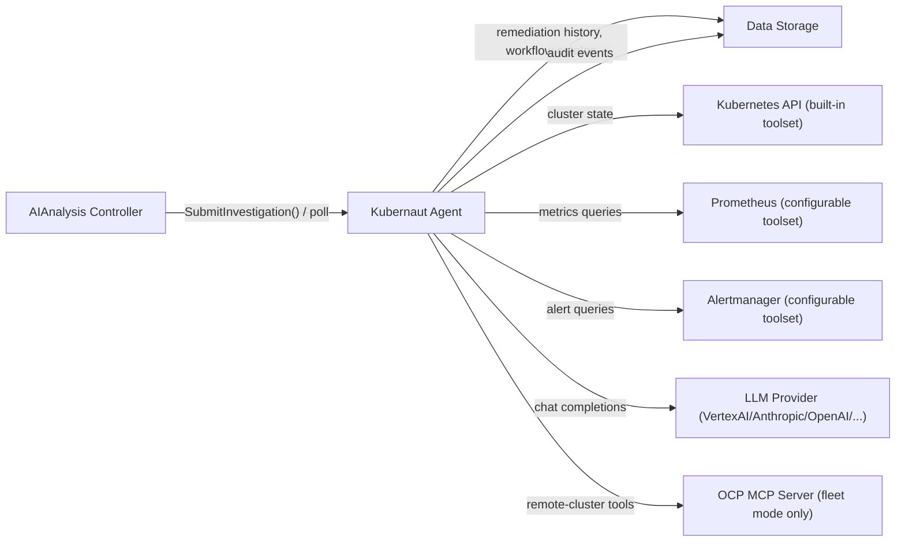

# Kubernaut Agent (KA) - Overview

**Version**: 1.0
**Last Updated**: 2026-08-02
**Status**: ✅ Current (Go implementation, `main`)
**Service Type**: Stateless HTTP/MCP service

---

## Table of Contents

- [Purpose & Scope](#purpose--scope)
- [Architecture Overview](#architecture-overview)
- [API Pattern: Async Session-Based Investigation](#api-pattern-async-session-based-investigation)
- [System Context Diagram](#system-context-diagram)
- [Key Architectural Decisions](#key-architectural-decisions)
- [Service Configuration](#service-configuration)
- [Known Gaps & Deviations](#known-gaps--deviations)
- [Related Documentation](#related-documentation)

---

## Purpose & Scope

Kubernaut Agent (KA) is the AI-powered root cause analysis (RCA) and remediation-workflow-selection
engine for Kubernaut. Given a Kubernetes signal (alert, event) and its enrichment context, KA drives
an LLM-based investigation loop that:

1. Performs root cause analysis using live cluster state (Kubernetes, Prometheus, Alertmanager tools)
2. Determines the actual remediation target (which may differ from the signal's original resource —
   see [DD-KA-006](../../../architecture/decisions/DD-KA-006-remediation-target-in-rca.md))
3. Discovers and selects a remediation workflow from the operator-declared workflow catalog
4. Validates the LLM's proposed workflow/parameters against catalog constraints, self-correcting
   via re-prompt on failure (no LLM tool-calling involved — see
   [BR-KA-191](../../../requirements/BR-KA-191-workflow-parameter-validation.md))

KA is a **native Go service** — the entire investigation stack (LLM clients, tool execution, MCP
server, sanitization) was rewritten from an earlier Python/HolmesGPT-SDK-based design. See
[DD-KA-019](../../../architecture/decisions/DD-KA-019-go-rewrite-design/DD-KA-019-go-rewrite-design.md)
for the full rewrite rationale (framework selection, toolset re-implementation, security
architecture).

**Sole caller**: the AIAnalysis controller, via `SubmitInvestigation()`. KA has no other production
callers; API Frontend (AF) never calls KA directly.

---

## Architecture Overview

KA's investigation loop is composed of several cooperating subsystems, each with its own design
decision/business-requirement backing:

| Subsystem | Responsibility | Reference |
|---|---|---|
| **LLM Client Layer** | Direct SDK/HTTP clients (not `langchaingo`) for VertexAI, Anthropic, Gemini, OpenAI, Azure OpenAI, Ollama, vLLM, LlamaStack, Mistral, HuggingFace TGI, DeepSeek. Hot-swappable tuning parameters (endpoint, temperature, timeouts, headers) via a watched ConfigMap; LLM **identity** (provider/model) changes require a process restart. | [DD-LLM-008](../../../architecture/decisions/DD-LLM-008-restart-required-llm-identity-lock.md), [configuration-reference.md §6](./configuration-reference.md) |
| **Per-Phase LLM Overrides** | Independently configurable provider/model/reasoning-effort for the RCA, workflow-discovery, and validation phases of an investigation. | [configuration-reference.md](./configuration-reference.md) |
| **Admission Control** | Goroutine-per-investigation with an active-investigation-count check (no fixed worker pool). | `internal/kubernautagent/config` (`maxConcurrent`) |
| **Shadow Agent (Alignment Check)** | Parallel security auditor monitoring LLM responses, tool outputs, and signal context for prompt injection. `enforce`/`monitor` modes, canary integrity checks, circuit breaker. | [ADR-KA-001](../../../architecture/decisions/ADR-KA-001-shadow-agent-alignment-check.md), [shadow-agent-configuration.md](./shadow-agent-configuration.md) |
| **Interactive MCP Mode** | Stateful, human-in-the-loop conversational investigation mode backed by Kubernetes Leases for session ownership; supports operator takeover mid-investigation. | `internal/kubernautagent/mcp` |
| **Fleet / Multi-Cluster Tool Discovery** | Direct KA-to-OCP MCP Server contact for remote-cluster tool access (superseding an earlier MCP-Gateway-hop design). | [ADR-064](../../../architecture/decisions/ADR-064-multi-cluster-mcp-gateway.md) |
| **Remediation Target Validation** | Validates/overrides the LLM-proposed remediation target against the Kubernetes-verified owner-reference chain. | [DD-KA-006](../../../architecture/decisions/DD-KA-006-remediation-target-in-rca.md), [BR-KA-212](../../../requirements/BR-KA-212-rca-target-resource.md) |
| **Infrastructure Label Detection** | Detects 12 infrastructure characteristics of the root-owner resource (including CNV/KubeVirt-aware detections) for workflow-catalog filtering. | [DD-KA-018](../../../architecture/decisions/DD-KA-018-detected-labels-detection-specification.md) |
| **Workflow Discovery** | Three-step catalog protocol: `list_available_actions` → `list_workflows` → `get_workflow`, followed by LLM selection. | [DD-KA-017](../../../architecture/decisions/DD-KA-017-three-step-workflow-discovery-integration.md) |
| **Workflow Response Validation** | Validates the LLM's *returned* workflow selection/parameters programmatically in Go and re-prompts on failure — not an LLM-invoked tool. | [DD-KA-001](../../../architecture/decisions/DD-KA-001-workflow-response-validation-architecture.md) |
| **Remediation History Enrichment** | Fetches tiered history from DataStorage: Tier 1 (24h, detailed, used for RO blocking + prompt context) and Tier 2 (90d, summarized, used for prompt warnings). | [DD-KA-016](../../../architecture/decisions/DD-KA-016-remediation-history-context.md) |
| **LLM Input Sanitization** | Multi-stage pipeline redacting credentials/secrets before any data reaches the LLM. | [DD-KA-005](../../../architecture/decisions/DD-KA-005-llm-input-sanitization.md), [DD-KA-019-003](../../../architecture/decisions/DD-KA-019-go-rewrite-design/DD-KA-019-003-security-architecture.md) |
| **Confidence Scoring** | Currently 100% LLM self-reported (see [Known Gaps](#known-gaps--deviations)). | [DD-KA-004](../../../architecture/decisions/DD-KA-004-v1-confidence-scoring.md) |

**Toolsets**: Kubernetes (built-in, read-only + limited event writes), Prometheus (configurable),
Alertmanager (configurable). Grafana is **not** implemented despite being mentioned in some older
design-phase documents.

---

## API Pattern: Async Session-Based Investigation

KA does not expose a synchronous "analyze and return" endpoint. AIAnalysis submits an investigation
and polls for progress/results:

```
POST /api/v1/incident/analyze          -> 202 Accepted, { "session_id": "<uuid>" }
GET  /api/v1/incident/session/{id}              -> session status
GET  /api/v1/incident/session/{id}/result        -> final result (once complete)
GET  /api/v1/incident/session/{id}/snapshot      -> in-progress snapshot
GET  /api/v1/incident/session/{id}/stream        -> streaming updates
POST /api/v1/incident/session/{id}/cancel        -> cancel an in-flight investigation
```

See [api-specification.md](./api-specification.md) for the full request/response schemas.

---

## System Context Diagram



---

## Key Architectural Decisions

| ID | Subject |
|---|---|
| [DD-KA-001](../../../architecture/decisions/DD-KA-001-workflow-response-validation-architecture.md) | Workflow response validation architecture (Go validate-then-reprompt, not LLM tool-calling) |
| [DD-KA-002](../../../architecture/decisions/DD-KA-002-custom-labels-auto-append.md) | Custom labels workflow-matching architecture |
| [DD-KA-003](../../../architecture/decisions/DD-KA-003-mandatory-openapi-client-usage.md) | Mandatory OpenAPI client usage |
| [DD-KA-004](../../../architecture/decisions/DD-KA-004-v1-confidence-scoring.md) | V1.0 confidence scoring methodology |
| [DD-KA-005](../../../architecture/decisions/DD-KA-005-llm-input-sanitization.md) | LLM input sanitization |
| [DD-KA-006](../../../architecture/decisions/DD-KA-006-remediation-target-in-rca.md) | Remediation target in root cause analysis |
| [DD-KA-016](../../../architecture/decisions/DD-KA-016-remediation-history-context.md) | Remediation history context enrichment |
| [DD-KA-017](../../../architecture/decisions/DD-KA-017-three-step-workflow-discovery-integration.md) | Three-step workflow discovery integration |
| [DD-KA-018](../../../architecture/decisions/DD-KA-018-detected-labels-detection-specification.md) | DetectedLabels detection specification |
| [DD-KA-019](../../../architecture/decisions/DD-KA-019-go-rewrite-design/) | Go rewrite design (framework selection, toolset implementation, security architecture) |
| [ADR-KA-001](../../../architecture/decisions/ADR-KA-001-shadow-agent-alignment-check.md) | Shadow Agent alignment check (prompt injection guardrails) |

---

## Service Configuration

KA listens on three ports — see [configuration-reference.md](./configuration-reference.md) for the
authoritative field-by-field breakdown:

| Port | Purpose |
|---|---|
| `8080` (default) | Main API (`/api/v1/incident/*`) |
| `8081` | Health / OpenAPI / admin endpoints |
| `9090` | Prometheus `/metrics` |

Configuration is split across a static YAML file (`-config`, requires restart) and a hot-reloadable
LLM runtime YAML file (`-llm-runtime`, file-watcher reload except for LLM identity fields).

---

## Known Gaps & Deviations

- **3-port architecture**: KA's 3-port setup (API/health/metrics) deviates from the documented
  2-port stateless-services standard, with no design decision on file justifying the deviation.
  See `docs/architecture/STATELESS_SERVICES_PORT_STANDARD.md`.
- **Confidence scoring**: [DD-KA-004](../../../architecture/decisions/DD-KA-004-v1-confidence-scoring.md)
  originally rejected pure LLM self-assessment as a confidence source, but the current implementation
  is 100% LLM self-reported (no computed semantic-similarity/label-matching component). Tracked by
  [Issue #1826](https://github.com/jordigilh/kubernaut/issues/1826) (KA-side investigation-outcome
  confidence bands) and [Issue #1828](https://github.com/jordigilh/kubernaut/issues/1828)
  (AIAnalysis-side hardcoded 0.7 floor).

---

## Related Documentation

- [BUSINESS_REQUIREMENTS.md](./BUSINESS_REQUIREMENTS.md) — BR catalog
- [BR_MAPPING.md](./BR_MAPPING.md) — BR-to-test traceability
- [api-specification.md](./api-specification.md) — REST API contract
- [integration-points.md](./integration-points.md) — upstream/downstream dependencies
- [security-configuration.md](./security-configuration.md) — RBAC, ServiceAccount, network posture
- [configuration-reference.md](./configuration-reference.md) — full configuration reference
- [shadow-agent-configuration.md](./shadow-agent-configuration.md) — Shadow Agent operational guide
- [security/AUDIT_EVENT_CATALOG.md](./security/AUDIT_EVENT_CATALOG.md) — audit event catalog
- [testing-strategy.md](./testing-strategy.md) — test pyramid and strategy
- [metrics-slos.md](./metrics-slos.md) — SLIs/SLOs and Prometheus metrics
- [observability-logging.md](./observability-logging.md) — structured logging and correlation IDs
