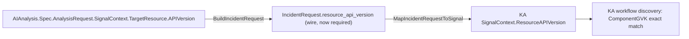

# Test Plan: AIAnalysis→KA `IncidentRequest` Wire Contract Carries No `apiVersion`

**Issue**: [#2064](https://github.com/jordigilh/kubernaut/issues/2064) (`v1.5.6`, `release/v1.5`)
**Clone**: [#2065](https://github.com/jordigilh/kubernaut/issues/2065) (`v1.6`, `main`)
**Related**: [#2061](https://github.com/jordigilh/kubernaut/issues/2061) (Track 1, interactive-session analog), [#2066](https://github.com/jordigilh/kubernaut/issues/2066) (Track 3, the upstream Gateway-side gap that this fix depends on to be fully load-bearing)
**Branch**: `fix/2061-2064-ka-apiversion-propagation` (off `origin/release/v1.5`)
**Created**: 2026-08-10
**Status**: Implementation complete — build/vet/targeted UT+IT suites green

---

## 1. Purpose

Every autonomous KA investigation (not just interactive/MCP sessions) begins with `AIAnalysis` (AA)
building an `IncidentRequest` and POSTing it to KA's `POST /api/v1/incident/analyze` endpoint. The
`IncidentRequest` OpenAPI schema had **no field at all** for the target resource's `apiVersion` —
unlike `resource_kind`/`resource_namespace`/`resource_name`, which are all present and required.
This meant `SignalContext.ResourceAPIVersion` was empty at the start of *every* autonomous
investigation, regardless of whether the upstream `RemediationRequest`/`AIAnalysis` CRDs already had
a correct value, and KA's workflow-discovery component filter (`ComponentGVK()`) depended entirely
on the LLM's optional, best-effort RCA-phase backfill (`DD-KA-006`) to ever populate it.

This is a **larger, more fundamental defect** than Track 1's one-line CRD-fallback omission: Track 1
only affects the interactive-session-resume edge case; this affects the wire contract used by every
single autonomous investigation.

### Root Cause

`internal/kubernautagent/api/openapi.json`'s `IncidentRequest` schema was missing a
`resource_api_version` property entirely — not optional-and-unset, structurally absent. Both sides
of the contract independently had no field to read or write:

- `pkg/aianalysis/handlers/request_builder.go`'s `BuildIncidentRequest` mapped
  `resource_namespace`/`resource_kind`/`resource_name` from
  `AIAnalysis.Spec.AnalysisRequest.SignalContext.TargetResource` but had no line for `APIVersion` —
  there was no generated field to assign it to.
- `internal/kubernautagent/server/handler.go`'s `MapIncidentRequestToSignal` built KA's internal
  `SignalContext` from the decoded `IncidentRequest` with the same gap, for the same reason.

## 2. Fix Design

### Design Decision: `resource_api_version` is REQUIRED, not nullable/optional

AA always sends the key; it is an empty string only when the upstream `TargetResource.APIVersion`
is itself empty (which, once Track 3 lands, should be rare/nonexistent for K8s-Event- and
unambiguous-Prometheus-sourced signals). This matches how `resource_kind`/`resource_namespace`/
`resource_name` are already modeled — plain required Go fields, not `OptString` — simpler code, no
`.Get()`/`.SetTo()` needed. Per explicit direction, rolling-deploy wire-compatibility was
deliberately not relitigated as a blocking concern for this required-field addition.



1. `internal/kubernautagent/api/openapi.json`: added `resource_api_version` (`{"type": "string"}`) to
   `IncidentRequest.properties` **and** to `required`; bumped `info.version` to `1.6.0`. Regenerated
   `pkg/agentclient` via `go generate ./pkg/agentclient/` (ogen).
2. `pkg/aianalysis/handlers/request_builder.go`: `ResourceAPIVersion: spec.TargetResource.APIVersion,`
   — plain field assignment, same pattern as the three fields already there.
3. `internal/kubernautagent/server/handler.go`: `ResourceAPIVersion: req.ResourceAPIVersion,` — plain
   field assignment, same pattern.

### Ripple containment: `ogen` required-field enforcement

`ogen`'s generated `Decode` methods enforce required-field presence via a bitmask/XOR check
(`pkg/agentclient/oas_json_gen.go`) — any hand-rolled JSON fixture missing the new key would fail to
decode. A repo-wide grep for the `resource_namespace` JSON-key literal pattern (the sibling required
field, used as a proxy for "hand-rolled `IncidentRequest`-shaped JSON") found exactly one such
fixture: `test/integration/kubernautagent/server/http_contract_test.go`'s `validIncidentJSON()`
helper — updated to include `"resource_api_version": ""`. `pkg/apifrontend/ka/integration_test.go`
uses the generated client struct, not raw JSON, so it needed no change (the field serializes as
`""` automatically).

## 3. FedRAMP Control Mapping

| Control | Title | Relevance |
|---|---|---|
| **SI-10** | Information Input Validation | `resource_api_version` becomes a required, validated field on the AA→KA wire contract, closing a structural gap where the target resource's API group was entirely unrepresentable on the wire. |
| **AU-2** | Auditable Events Defined | No new audit event type — this closes a data-completeness gap on an already-audited request path (KA's existing incident-analyze audit trail already records `resource_kind`/`resource_namespace`/`resource_name`; `resource_api_version` now travels alongside them). |

## 4. Pyramid Invariant — Test Scenario Inventory

| ID | Tier | Business-Level Behavior Description | Control / BR | Test File |
|---|---|---|---|---|
| UT-AA-2064-001 | Unit | `BuildIncidentRequest` maps a populated `TargetResource.APIVersion` to `IncidentRequest.ResourceAPIVersion` | SI-10, BR-WORKFLOW-004 | `pkg/aianalysis/request_builder_test.go` |
| UT-AA-2064-002 | Unit | `BuildIncidentRequest` sends an empty string (not an omitted/nullable field) when `TargetResource.APIVersion` is itself unknown — proves the "required, empty-when-unknown" contract, not silent omission | SI-10, BR-WORKFLOW-004 | `pkg/aianalysis/request_builder_test.go` |
| UT-KA-2064-001 | Unit | `MapIncidentRequestToSignal` maps `IncidentRequest.ResourceAPIVersion` to `SignalContext.ResourceAPIVersion`, including the empty-string case | SI-10, BR-WORKFLOW-004 | `internal/kubernautagent/server/interactive_signal_test.go` |
| IT-SRV-008 | Integration | A real HTTP POST to `/api/v1/incident/analyze` with `"resource_api_version": "apps/v1"` in the JSON body round-trips through `ogen`'s decode → `MapIncidentRequestToSignal` → the `SignalContext` a stub investigator observes — proves the full wire-to-internal-type path, not just the two halves independently | SI-10, BR-WORKFLOW-004, BR-INTERACTIVE-010 | `test/integration/kubernautagent/server/http_contract_test.go` |

### Tier Coverage Rationale

- **UT (AA side)** proves `BuildIncidentRequest`'s mapping logic, including the empty-string
  contract (not `.Get()`/`OptString`).
- **UT (KA side)** proves `MapIncidentRequestToSignal`'s mapping logic independently of AA.
- **IT** proves the two halves compose correctly through the actual HTTP+`ogen` decode boundary — a
  gap neither UT can close alone, since each UT calls its own side's Go function directly and never
  exercises JSON (de)serialization or `ogen`'s required-field bitmask check.
- **E2E**: not added. No new user-facing journey; this closes a data-completeness gap in an
  existing, already-E2E-covered autonomous-investigation request path.

## 5. Wiring Manifest

| Component | Production Entry Point | Wiring Code Location | Test ID |
|---|---|---|---|
| `RequestBuilder.BuildIncidentRequest` | Called from `pkg/aianalysis/handlers/investigating.go` (unchanged) | `pkg/aianalysis/handlers/request_builder.go:86` | UT-AA-2064-001, UT-AA-2064-002 |
| `server.MapIncidentRequestToSignal` | Called from `Handler.IncidentAnalyzeEndpointAPIV1IncidentAnalyzePost` (`internal/kubernautagent/server/handler.go:75`) | `internal/kubernautagent/server/handler.go:384` | UT-KA-2064-001, IT-SRV-008 |
| `IncidentRequest.resource_api_version` schema field | Regenerated into `pkg/agentclient` via `go generate ./pkg/agentclient/` | `internal/kubernautagent/api/openapi.json` | Proven transitively by all rows above (each exercises the generated type) |

**No new wiring points**: both fixed functions were already called from production before this fix
— this is a field-mapping completion on two already-wired components plus a schema extension, not a
new component or a new production caller.

## 6. CHECKPOINT W Evidence

```bash
$ grep -n "ResourceAPIVersion" pkg/aianalysis/handlers/request_builder.go
pkg/aianalysis/handlers/request_builder.go:86:		ResourceAPIVersion: spec.TargetResource.APIVersion, // #2064: was omitted, KA never received it

$ grep -n "ResourceAPIVersion" internal/kubernautagent/server/handler.go
internal/kubernautagent/server/handler.go:384:		ResourceAPIVersion: req.ResourceAPIVersion, // #2064: was omitted, KA's SignalContext never got apiVersion from the wire

$ grep -n "resource_api_version" internal/kubernautagent/api/openapi.json
internal/kubernautagent/api/openapi.json:1109:          "resource_api_version": {
internal/kubernautagent/api/openapi.json:1318:          "resource_api_version",
```

## 7. Build Validation

```bash
$ go generate ./pkg/agentclient/ && git diff --stat pkg/agentclient   # regeneration deterministic, diff limited to the new field
$ go build ./...                                                     # exit 0
$ go vet ./...                                                       # exit 0
$ go test ./pkg/aianalysis/... ./internal/kubernautagent/server/...  # PASS
$ go test ./test/integration/kubernautagent/server/...              # PASS (envtest)
```

## 8. Coverage Summary

| Metric | Target | Actual |
|---|---|---|
| BR/Control coverage (SI-10, AU-2, BR-WORKFLOW-004, BR-INTERACTIVE-010) | 100% | ✅ (Sections 3, 4) |
| Wiring Manifest rows with passing IT/UT evidence | 100% | ✅ (Section 5) |
| CHECKPOINT W (no orphaned code, both mapping functions confirmed pre-wired) | Pass | ✅ (Section 6) |
| Build + `ogen` regeneration determinism | Pass | ✅ (Section 7) |
| Full wire (HTTP+JSON+`ogen`) round-trip proof, not just Go-level UT | Required | ✅ (IT-SRV-008) |

## 9. Out of Scope

- **Track 1** (`#2061`, MCP interactive-session CRD-fallback): a narrower, different code path — see
  [`docs/testing/2061/TEST_PLAN.md`](../2061/TEST_PLAN.md).
- **Track 3** (`#2066`, Gateway discarding/never capturing `apiVersion` for webhook-originated
  signals): this fix makes the AA→KA wire contract *capable* of carrying `apiVersion`, but Gateway
  itself must still populate `RemediationRequest.Spec.TargetResource.APIVersion` correctly for
  autonomous/webhook-originated investigations to actually benefit — see
  [`docs/testing/2066/TEST_PLAN.md`](../2066/TEST_PLAN.md).
- **KA-internal RCA-to-workflow-discovery propagation**: already correctly implemented
  (`apiVersionValidationGate`, #1044/#1051) — this fix improves that machinery's *input*, not its
  own logic.
- **Rolling-deploy wire-compatibility for the newly-required field**: explicitly not relitigated per
  direction; revisit only if a real regression surfaces.
- **Backport/cherry-pick to `main`/`v1.6`**: tracked separately via the cloned issue
  [#2065](https://github.com/jordigilh/kubernaut/issues/2065), not performed in this branch.

## 10. Sign-off

| Role | Name | Date | Signature |
|---|---|---|---|
| Author | AI Assistant | 2026-08-10 | ⏸️ |
| Reviewer | Jordi Gil | | ⏸️ |
| Approver | | | ⏸️ |
