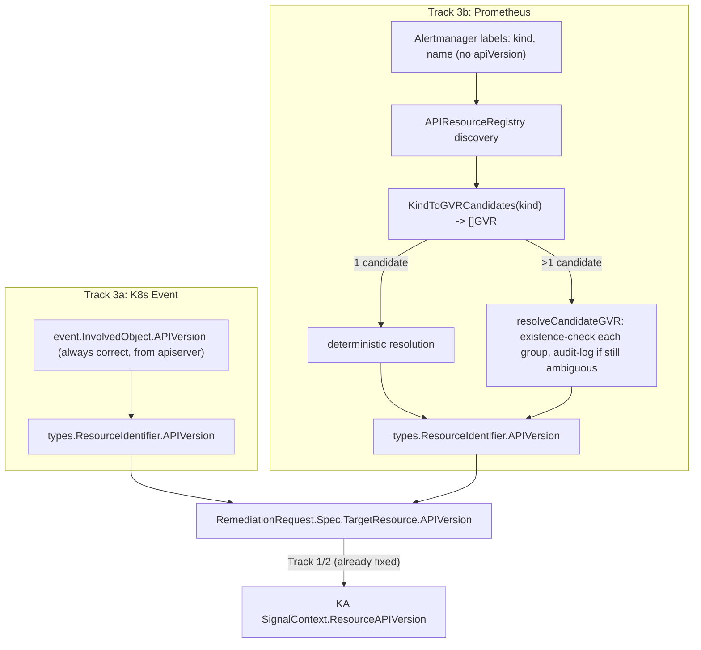

# Test Plan: Gateway Discards/Never Captures `apiVersion` for Webhook-Originated Signals

**Issue**: [#2066](https://github.com/jordigilh/kubernaut/issues/2066) (`v1.5.6`, `release/v1.5`)
**Clone**: [#2067](https://github.com/jordigilh/kubernaut/issues/2067) (`v1.6`, `main`)
**Related**: [#2061](https://github.com/jordigilh/kubernaut/issues/2061) (Track 1), [#2064](https://github.com/jordigilh/kubernaut/issues/2064) (Track 2 — the AA→KA wire contract this fix now has real data to carry)
**Branch**: `fix/2061-2064-ka-apiversion-propagation` (off `origin/release/v1.5`)
**Created**: 2026-08-10
**Status**: Implementation complete — build/vet/targeted UT+IT suites green

---

## 1. Purpose

Tracks 1 and 2 fixed KA's and AA's failure to *propagate* an already-known `apiVersion` value. This
track addresses the earliest point in the pipeline: **Gateway itself never captured or discarded
`apiVersion` in the first place** for webhook-originated signals, so there was no correct value to
propagate for any Kubernetes-Event- or Prometheus-Alertmanager-sourced `RemediationRequest` (RR) —
i.e. the vast majority of autonomous, non-interactive investigations.

Two independent sub-defects, one per adapter:

- **Track 3a (Kubernetes Event adapter)**: `involvedObject.apiVersion` is present, correct (sourced
  directly from the K8s API server), and already parsed into the adapter's internal event struct —
  but was never copied into `types.ResourceIdentifier`, because that struct had no `APIVersion`
  field at all.
- **Track 3b (Prometheus adapter)**: Prometheus/Alertmanager labels never carry `apiVersion` (only
  `kind`+`name`, sometimes `namespace`). The adapter's `APIResourceRegistry` already performs
  Kubernetes API discovery internally to resolve label keys to GVRs, but
  `extractTargetResource`/`APIResourceRegistry.KindToGVR` only ever surfaced a single,
  first-seen-wins GVR per Kind, silently guessing wrong whenever a Kind existed in more than one API
  group (e.g. `Route` in both `route.openshift.io/v1` and `serving.knative.dev/v1`).

### Root Cause

- Track 3a: `pkg/gateway/types/types.go`'s `ResourceIdentifier` struct had no `APIVersion` field, so
  `kubernetes_event_adapter.go` had nowhere to put the value it had already parsed, and
  `crd_creator.go`'s `buildTargetResource` had nothing to copy into the RR CRD's `TargetResource`.
- Track 3b: `resource_registry.go`'s `registrySnapshot.kindToGVR` was `map[string]GVR` (single
  value) instead of `map[string][]GVR` (candidate list) — discovery results for a Kind in multiple
  groups overwrote each other during `buildSnapshot`, and there was no ambiguity signal for callers
  to act on.

## 2. Fix Design



### Track 3a

1. `pkg/gateway/types/types.go`: added `APIVersion string` to `ResourceIdentifier`.
2. `pkg/gateway/adapters/kubernetes_event_adapter.go`: `APIVersion: event.InvolvedObject.APIVersion`
   in the existing `types.ResourceIdentifier{...}` literal — a straight copy-through of a value
   already parsed and already correct (sourced from the K8s API server itself, not from a label or
   heuristic).
3. `pkg/gateway/processing/crd_creator.go`'s `buildTargetResource`: `APIVersion:
   signal.Resource.APIVersion` in the existing `remediationv1alpha1.ResourceIdentifier{...}` literal.

### Track 3b

1. `pkg/gateway/adapters/resource_registry.go`: `registrySnapshot.kindToGVR` (single value) is
   supplemented with `kindToGVRCandidates map[string][]schema.GroupVersionResource` (multi-value);
   `buildSnapshot` appends a GVR to a Kind's candidate list **only if that GVR's Group is not
   already present** for that Kind — this deliberately collapses multiple *versions* of the same
   API group (e.g. `apps/v1` vs. a hypothetical `apps/v1beta1`) into one candidate, so only genuine
   cross-group ambiguity (different `Group`, same `Kind`) is surfaced. New method
   `KindToGVRCandidates(kind string) ([]schema.GroupVersionResource, bool)` exposes this list. The
   existing single-value `KindToGVR` is left untouched as a regression guard / back-compat surface.
2. `pkg/gateway/adapters/prometheus_adapter.go`: `extractTargetResource` now returns
   `(kind, name, apiVersion string)` (previously `(kind, name string)`) and takes a `logr.Logger`.
   New helper `resolveCandidateGVR(ctx, kind, name, namespace, registry, logger) string`:
   - 0 candidates → `""` (unknown kind, unchanged behavior).
   - 1 candidate → deterministic resolution, **no existence check** (this was the corrected design
     — see Section on rejected alternative below).
   - >1 candidate → existence-checks each candidate GVR via `registry.CheckExistence`; exactly one
     exists → resolve to that GVR; zero or more-than-one exist → `""` **plus an audit log entry**
     recording the ambiguous kind, name, namespace, and all candidate GVRs (SI-10/AU-2 evidence
     trail for the "we genuinely couldn't tell" case).
   - New helper `formatAPIVersion(gvr schema.GroupVersionResource) string` formats a GVR into a
     Kubernetes `apiVersion` string (`"group/version"`, or bare `"version"` for the core group).
3. Call sites in `Parse` and `ParseBatch` updated to pass `a.logger` and thread the returned
   `apiVersion` into `types.ResourceIdentifier`.

### Rejected alternative (spike finding)

The original GREEN design would have existence-checked **every** resolution, even for unambiguous
Kinds, to defensively confirm the resource actually exists before trusting the resolved `apiVersion`.
This was rejected: it would make Gateway's per-signal latency dependent on a live K8s API call for
the overwhelmingly common unambiguous case, and a transient API error on that call would silently
degrade `apiVersion` to empty even when the Kind was never actually ambiguous. Corrected to match
KA's existing `#1051` pattern: deterministic resolution when there's truly only one candidate;
existence checks reserved for the case that actually needs them (genuine multi-group ambiguity).

## 3. FedRAMP Control Mapping

| Control | Title | Relevance |
|---|---|---|
| **SI-10** | Information Input Validation | `apiVersion` is now captured/resolved at signal-ingestion time (the earliest point it can be known correctly) instead of never, for both webhook adapter types. |
| **AU-2** | Auditable Events Defined | Genuinely ambiguous-kind resolutions (Track 3b, >1 candidate GVR, existence check inconclusive) now emit a structured audit log entry — a new auditable event for an input-disambiguation failure that was previously silent (first-seen-wins, no signal to operators). |
| **AU-12** | Audit Generation | The ambiguity audit log entry is generated inline in the resolution path (`resolveCandidateGVR`), not bolted on after the fact — it fires exactly when the ambiguous condition is detected. |

## 4. Pyramid Invariant — Test Scenario Inventory

| ID | Tier | Business-Level Behavior Description | Control / BR | Test File |
|---|---|---|---|---|
| UT-GW-2066-K8SEVT-001 | Unit | Kubernetes Event adapter copies `involvedObject.apiVersion` into `NormalizedSignal.Resource.APIVersion` | SI-10, BR-GATEWAY-001 | `pkg/gateway/k8s_event_adapter_test.go` |
| UT-GW-2066-001 | Unit | `APIResourceRegistry.KindToGVRCandidates("Route")` returns both `route.openshift.io/v1` and `serving.knative.dev/v1` for a genuinely ambiguous kind | SI-10, BR-GATEWAY-001 | `pkg/gateway/adapters/resource_registry_test.go` |
| UT-GW-2066-002 | Unit (regression guard) | `KindToGVRCandidates("Deployment")` returns exactly one candidate for an unambiguous kind — proves same-group/multi-version collapsing works | SI-10, BR-GATEWAY-001 | `pkg/gateway/adapters/resource_registry_test.go` |
| UT-GW-2066-003 | Unit (regression guard) | Pre-existing `KindToGVR("Route")` still returns exactly one (first-seen) GVR — proves the new multi-candidate path doesn't regress the old single-value API's callers | SI-10, BR-GATEWAY-001 | `pkg/gateway/adapters/resource_registry_test.go` |
| UT-GW-2066-004 | Unit | `KindToGVRCandidates` on an unknown kind returns `(nil, false)` | SI-10, BR-GATEWAY-001 | `pkg/gateway/adapters/resource_registry_test.go` |
| UT-GW-2066-EXTRACT-001 | Unit (regression guard) | `extractTargetResource` resolves `apiVersion` deterministically for an unambiguous kind with **no** existence check performed (proves the corrected, non-defensive design) | SI-10, BR-GATEWAY-001 | `pkg/gateway/adapters/resource_extraction_test.go` |
| UT-GW-2066-EXTRACT-002 | Unit | `extractTargetResource` resolves `apiVersion` for a genuinely ambiguous kind when exactly one candidate GVR's resource actually exists in-cluster | SI-10, BR-GATEWAY-001 | `pkg/gateway/adapters/resource_extraction_test.go` |
| UT-GW-2066-EXTRACT-003 | Unit | `extractTargetResource` leaves `apiVersion` empty **and emits an audit log entry** when an ambiguous kind's existence check is inconclusive (0 or >1 matches) | SI-10, AU-2, AU-12, BR-GATEWAY-001 | `pkg/gateway/adapters/resource_extraction_test.go` |
| IT-GW-2066-001 | Integration | A real Kubernetes Event ingested through the full Gateway pipeline (adapter → `CRDCreator`) produces a `RemediationRequest` whose `Spec.TargetResource.APIVersion` matches `involvedObject.apiVersion` — proves end-to-end propagation through the real CRD-creation path, not just the adapter in isolation | SI-10, BR-GATEWAY-001, BR-GATEWAY-005 | `test/integration/gateway/adapters_integration_test.go` |
| IT-GW-2066-002 | Integration | A real Prometheus alert for an unambiguous Kind (`Deployment`), ingested through the full Gateway pipeline against a real envtest API server, produces a `RemediationRequest` whose `Spec.TargetResource.APIVersion` is discovery-resolved correctly | SI-10, BR-GATEWAY-001, BR-GATEWAY-005 | `test/integration/gateway/adapters_integration_test.go` |

> **Footnote on BR-GATEWAY-005 for Track 3b**: BR-GATEWAY-005 ("Signal Metadata Extraction ...
> without transformation or interpretation") is cited for both sub-tracks, but Track 3b's
> discovery + existence-check disambiguation (`resolveCandidateGVR`) is, strictly, a form of
> *interpretation* — it infers `apiVersion` from cluster state rather than copying a value present
> in the raw signal (unlike Track 3a's pure copy-through). This is not a new class of behavior:
> Gateway's `APIResourceRegistry.KindToGVR` discovery-based resolution already runs on every
> Prometheus alert today to resolve `kind`+`name` labels to a GVR before this fix existed. Track 3b
> extends an existing discovery-resolution responsibility to also disambiguate cross-group
> ambiguity, rather than introducing discovery/interpretation as a new responsibility. Flagged here
> for transparency rather than silently asserting a clean BR fit.

### Tier Coverage Rationale

- **UT** covers both adapters' resolution logic in isolation, including the ambiguity-audit-log
  side effect (Track 3b) and the deliberate absence of a defensive existence check for the
  unambiguous case (regression guard against reintroducing the rejected design).
- **IT** proves the resolved `apiVersion` actually survives the full adapter→`CRDCreator`→real
  envtest-API-server round trip into the persisted `RemediationRequest` CRD — a fake/mocked
  dynamic client in a UT would not catch a structural-schema issue or a wiring gap between the
  adapter's `NormalizedSignal` and `CRDCreator`'s `buildTargetResource`.
- **E2E**: not added net-new. This closes a data-completeness gap in Gateway's existing,
  already-E2E-covered signal-ingestion pipeline (BR-GATEWAY-001/005 suites); no new user-facing
  journey is introduced. Full-stack proof that this data reaches KA's workflow discovery is already
  covered by Tracks 1/2's IT-KA-DISC-011 and IT-SRV-008, which consume the CRD/wire fields this
  track now populates correctly.

## 5. Wiring Manifest

| Component | Production Entry Point | Wiring Code Location | Test ID |
|---|---|---|---|
| `ResourceIdentifier.APIVersion` (type) | Populated by both adapters below; read by `CRDCreator` | `pkg/gateway/types/types.go:109` | UT-GW-2066-K8SEVT-001, IT-GW-2066-001, IT-GW-2066-002 |
| `KubernetesEventAdapter.Parse`/`ParseBatch` APIVersion copy-through | `cmd/gateway/main.go:168` (`adapters.NewKubernetesEventAdapter`) | `pkg/gateway/adapters/kubernetes_event_adapter.go:209` | UT-GW-2066-K8SEVT-001, IT-GW-2066-001 |
| `CRDCreator.buildTargetResource` APIVersion copy-through | `CreateRemediationRequest` (`pkg/gateway/processing/crd_creator.go:286`), itself called from Gateway's HTTP ingestion handler | `pkg/gateway/processing/crd_creator.go:575` | IT-GW-2066-001, IT-GW-2066-002 |
| `APIResourceRegistry.KindToGVRCandidates` | `cmd/gateway/main.go:130` (`adapters.NewAPIResourceRegistry`) constructs the registry consumed by `resolveCandidateGVR` | `pkg/gateway/adapters/resource_registry.go:298` | UT-GW-2066-001, UT-GW-2066-002, UT-GW-2066-003, UT-GW-2066-004 |
| `resolveCandidateGVR` / `formatAPIVersion` (disambiguation helpers) | `extractTargetResource`, called from `PrometheusAdapter.Parse`/`ParseBatch` (`cmd/gateway/main.go:159`, `adapters.NewPrometheusAdapter`) | `pkg/gateway/adapters/prometheus_adapter.go:478`, `:512` | UT-GW-2066-EXTRACT-001, UT-GW-2066-EXTRACT-002, UT-GW-2066-EXTRACT-003, IT-GW-2066-002 |

## 6. CHECKPOINT W Evidence

```bash
$ grep -n "NewAPIResourceRegistry\|NewPrometheusAdapter\|NewKubernetesEventAdapter" cmd/gateway/main.go
cmd/gateway/main.go:130:	apiRegistry, err := adapters.NewAPIResourceRegistry(
cmd/gateway/main.go:159:	prometheusAdapter := adapters.NewPrometheusAdapter(ownerResolver, apiRegistry, logger)
cmd/gateway/main.go:168:	k8sEventAdapter := adapters.NewKubernetesEventAdapter(ownerResolver)

$ grep -n "APIVersion" pkg/gateway/adapters/kubernetes_event_adapter.go pkg/gateway/processing/crd_creator.go
pkg/gateway/adapters/kubernetes_event_adapter.go:209:		APIVersion: event.InvolvedObject.APIVersion,
pkg/gateway/processing/crd_creator.go:575:		APIVersion: signal.Resource.APIVersion,

$ grep -n "func.*KindToGVRCandidates\|func resolveCandidateGVR\|func formatAPIVersion" pkg/gateway/adapters/*.go
pkg/gateway/adapters/prometheus_adapter.go:478:func resolveCandidateGVR(ctx context.Context, kind, name, namespace string, registry *APIResourceRegistry, logger logr.Logger) string {
pkg/gateway/adapters/prometheus_adapter.go:512:func formatAPIVersion(gvr schema.GroupVersionResource) string {
pkg/gateway/adapters/resource_registry.go:298:func (r *APIResourceRegistry) KindToGVRCandidates(kind string) ([]schema.GroupVersionResource, bool) {
```

No orphaned code: every new/changed symbol above has a production caller already listed in the
"Production Entry Point" column, and every row has at least one passing UT and/or IT.

## 7. Build Validation

```bash
$ go build ./...                                                    # exit 0
$ go vet ./...                                                      # exit 0
$ go test ./pkg/gateway/...                                        # PASS
$ KUBEBUILDER_ASSETS="$(setup-envtest use -p path)" \
    go test ./test/integration/gateway/... -run TestGatewayAdapters  # PASS (envtest)
```

## 8. Coverage Summary

| Metric | Target | Actual |
|---|---|---|
| BR/Control coverage (SI-10, AU-2, AU-12, BR-GATEWAY-001, BR-GATEWAY-005) | 100% | ✅ (Sections 3, 4) |
| Wiring Manifest rows with passing IT/UT evidence | 100% | ✅ (Section 5) |
| CHECKPOINT W (no orphaned code, all new symbols have production callers) | Pass | ✅ (Section 6) |
| Build (`go build ./...`, `go vet ./...`) | Pass | ✅ (Section 7) |
| Envtest-backed end-to-end CRD-persistence proof (not adapter-only UT) | Required | ✅ (IT-GW-2066-001, IT-GW-2066-002) |
| Audit-log evidence for genuinely-ambiguous, unresolvable case | Required | ✅ (UT-GW-2066-EXTRACT-003) |

## 9. Out of Scope

- **Track 1** (`#2061`) and **Track 2** (`#2064`): downstream propagation fixes in KA and AA — see
  [`docs/testing/2061/TEST_PLAN.md`](../2061/TEST_PLAN.md) and
  [`docs/testing/2064/TEST_PLAN.md`](../2064/TEST_PLAN.md). This track supplies the correct input
  those fixes now propagate.
- **KA's "preflight" concern for ambiguous kinds** (raised during risk review: should KA
  double-check the resolved `apiVersion` before investigating?): KA's existing
  `apiVersionValidationGate` (#1044/#1051) already performs post-RCA validation/auto-resolution:
  no new KA-side work identified as part of this track's spike.
- **Ambiguous-kind resolution via anything beyond existence-check** (e.g. asking the LLM to
  disambiguate, or preferring a configured "default group" per kind): not attempted here — when
  existence-check is inconclusive, `apiVersion` is deliberately left empty (matches DD-KA-006's
  "absence is not an error" philosophy) with an audit trail, rather than guessing.
- **Backport/cherry-pick to `main`/`v1.6`**: tracked separately via the cloned issue
  [#2067](https://github.com/jordigilh/kubernaut/issues/2067), not performed in this branch.

## 10. Sign-off

| Role | Name | Date | Signature |
|---|---|---|---|
| Author | AI Assistant | 2026-08-10 | ⏸️ |
| Reviewer | Jordi Gil | | ⏸️ |
| Approver | | | ⏸️ |
