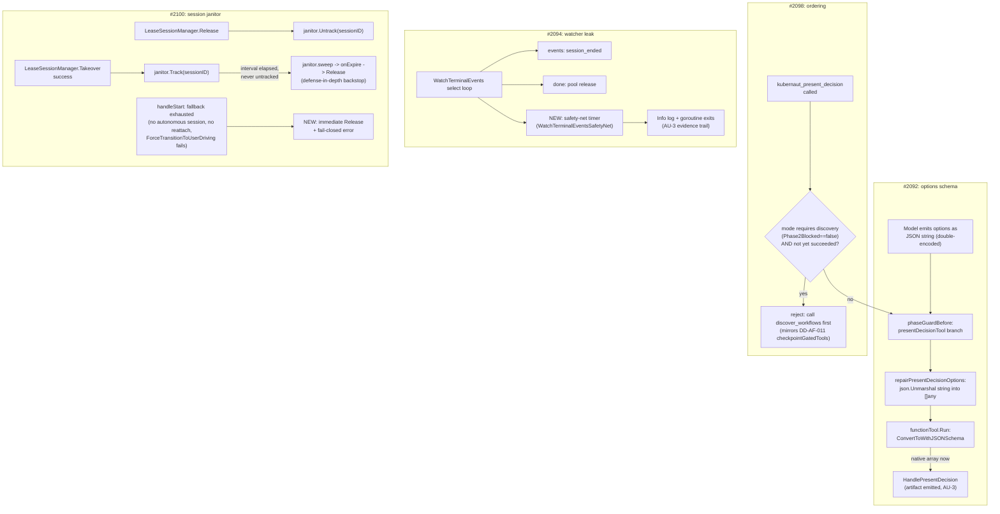

# Test Plan: v1.5.6 QE Batch — present_decision Schema/Ordering, WatchTerminalEvents Leak, Interactive Session Janitor

**Issues**: [#2092](https://github.com/jordigilh/kubernaut/issues/2092), [#2094](https://github.com/jordigilh/kubernaut/issues/2094), [#2098](https://github.com/jordigilh/kubernaut/issues/2098), [#2100](https://github.com/jordigilh/kubernaut/issues/2100) (all `v1.5.6`, `release/v1.5`)
**Related (investigated, not in scope)**: #1995 (already fixed by merged PR #2000), #2096 (spiked and re-scoped as client/harness disconnect, not an AF bug — see GitHub comment on #2096)
**Branch**: `fix/2092-2094-2098-2100-interactive-session-batch` (off `origin/release/v1.5` @ `bb2cf8c57`)
**Created**: 2026-08-11
**Status**: Implementation complete — all tiers green, pending PR review

---

## 1. Purpose

Four independent QE-reported defects from the same live v1.5.6-rc2 acceptance run, batched into one branch/PR to save CI overhead (commits stay independently reviewable; no squash on merge). Two share a user-visible symptom (empty/escape-hatch decision despite a real, high-confidence workflow existing) via two distinct, independently-reproduced mechanisms; the other two are resource-leak/observability gaps discovered while investigating the same run.

| Issue | Symptom | Mechanism |
|---|---|---|
| #2092 | `kubernaut_present_decision` fails JSON-schema validation, agent retries with empty `options` | `options` argument arrives JSON-double-encoded (native array wrapped again as a string) |
| #2098 | `kubernaut_present_decision` renders an empty decision despite discovery succeeding moments later | Tool-call **ordering**: the model calls `present_decision` before `discover_workflows` in `full_remediation` mode |
| #2094 | `WatchTerminalEvents` goroutine leaks indefinitely (confirmed live via pprof, 5-7+ minutes stuck); `AIAnalysis` CR stays `Investigating` past its own 10m timeout | No timer-based safety net in the watcher's `select` loop (by original design) — third instance of the same "wait forever" anti-pattern already fixed twice before (#1949/#1960, #2086/#2089) |
| #2100 | `interactive.maxConcurrentSessions` capacity erodes monotonically under concurrent load until pod restart | `SessionJanitor` (the documented safety net) is fully implemented/unit-tested but never wired into the running server; `handleStart` can also acquire a lease and never roll it back when no investigation exists to attach it to |

### Root Cause Detail

**#2092** — `pkg/apifrontend/agent/phase_guard.go`'s `presentDecisionTool` `before`-callback branch calls `enforceGroundingGuard` but does nothing about `args["options"]`'s wire type. ADK's `functionTool.Run` (`google.golang.org/adk@v1.5.1/tool/functiontool/function.go:185-200`) calls `typeutil.ConvertToWithJSONSchema` immediately afterward, which re-marshals `args` to JSON, unmarshals into `map[string]any`, and validates that against the inferred schema (`internal/typeutil/convert.go:27-44`) — a JSON *string* value for a field whose schema says `type: array` fails `resolvedSchema.Validate(m)` before the handler (`HandlePresentDecision`) ever runs. Live evidence (issue #2092) confirms the model's `options` payload was fully correct in content, just double-encoded.

**#2098** — Live evidence (issue #2098, RR `rr-6a97f7a00ba9-79ad53ed`) shows `kubernaut_present_decision` invoked and *succeeding* at `03:07:12`, then `kubernaut_discover_workflows` starting at `03:07:21` and completing at `03:07:44` — nine seconds too late. `newPhaseGuard`'s `presentDecisionTool` branch (`phase_guard.go:118-121`) has no ordering precondition at all; `checkpointGatedTools` (DD-AF-011, #1899) already gates `discover_workflows`/`select_workflow` behind consent flags but was never extended to gate `present_decision` on discovery having actually run.

**#2094** — `pkg/apifrontend/tools/ka_investigate_mcp.go:961-985`'s `WatchTerminalEvents` `select` loop has exactly two exit conditions (`events` yields/closes, or `done` closes) and no timer. Its caller (`ka_investigate_mcp.go:585`) deliberately detaches the goroutine's context via `context.WithoutCancel` so it can outlive the originating tool call — meaning `ctx.Done()` firing was never a viable exit path even if it were checked. When the pool's `onRelease` callback never fires and no `session_ended` event ever arrives (confirmed live via pprof), the goroutine blocks forever.

**#2100** — Two independent sub-defects converge on the same symptom:
1. `SessionJanitor` (`internal/kubernautagent/mcp/disconnect_handler.go:190-261`) is a complete, ticker-based stale-session sweeper with its own passing UT/IT coverage (`disconnect_handler_test.go`'s `IT-KA-DES-005`/`006`), but `NewSessionJanitor(...)` has zero callers outside test files anywhere in the repository — confirmed via `grep -rn NewSessionJanitor --include=*.go .` returning only its definition and test files.
2. `InvestigateTool.handleStart` (`internal/kubernautagent/mcp/tools/investigate.go:435-578`) calls `t.sessions.Takeover(...)` at line 480 (acquiring the Lease and incrementing `LeaseSessionManager.activeCount` unconditionally on success), then — in the specific branch where no autonomous session exists for the RR (line 549-561) — tries `reattachOrCreateFallback` then `ForceTransitionToUserDriving` as a last resort. If **both** fail, the function silently proceeds to `startTimeoutTracking` and returns success with an empty `InvestigationSessionID`, holding the lease with nothing behind it (matches `session_teardown.go`'s "CRITICAL: no session found for either completion path — AA will not receive result" log line). `KA`'s existing `TimeoutManager` (10-minute default inactivity timeout) does eventually reclaim this via `startTimeoutTracking`'s own callback, which is why live evidence shows leases lingering ~7-8 minutes rather than permanently — but this is incidental, not a designed safety net for this specific failure, and depends on `startTimeoutTracking` always being reached (not guaranteed for every `Takeover` caller, e.g. `handleTakeover`).

## 2. Fix Design



### #2092 — repair stringified `options` before schema validation

`pkg/apifrontend/agent/phase_guard.go`'s `enforceGroundingGuard` already proves the exact technique needed: it mutates `args["rca"]`/`args["summary"]`/`args["options"]` in place, before `before`'s caller passes `args` on to `functionTool.Run`'s schema validation (this ordering is what makes `args["options"] = []any{}` on the ungrounded path already work today). Add a new step, `repairPresentDecisionOptions`, that runs in the **grounded** branch (the ungrounded branch already unconditionally overwrites `options` with a clean empty slice, so it needs no repair): if `args["options"]` is a `string`, attempt `json.Unmarshal` into `[]any`; on success, replace `args["options"]` with the parsed value; on failure (genuinely malformed JSON), leave it untouched so ADK's real schema validation still rejects it with a useful error — this must never silently mask a truly malformed payload as an empty-but-valid one.

### #2098 — gate `present_decision` on discovery having run, in the modes where it's expected

Add `session.StateKeyDiscoverWorkflowsSucceeded`, set `true` in `newPhaseGuard`'s `after`-callback's existing `isDiscoverWorkflows` success branch (`phase_guard.go:258-267`) and reset `false` alongside `StateKeyPhase2Blocked` on every fresh `kubernaut_investigate` (not `kubernaut_reconnect`, matching the existing asymmetry at line 300). In the `before`-callback's `presentDecisionTool` branch, before calling `enforceGroundingGuard`, reject the call (mirroring `errCheckpointBlocked`'s existing reject-with-retry pattern, not `enforceGroundingGuard`'s mutate-and-continue pattern) when `StateKeyPhase2Blocked == false` (i.e., this mode does **not** require a human-confirmation checkpoint before `discover_workflows` — true for `full_remediation`/`full_remediation_autonomous`, and also correctly excludes the #1918 `rcaConcludedNotActionable` override, since that forces `Phase2Blocked = true`) **and** `StateKeyDiscoverWorkflowsSucceeded != true`. Reusing `Phase2Blocked` (rather than re-deriving mode) means the gate automatically inherits the #1918 "RCA said not actionable" exemption for free — no duplicated mode logic.

This mirrors DD-AF-011's proven pattern exactly: reject with a clear instruction, let the model self-correct by calling `discover_workflows` and retrying — the AU-3 "always emit an artifact" mandate is preserved because the retry (post-discovery) reaches `HandlePresentDecision` normally.

### #2094 — bounded safety-net timer in `WatchTerminalEvents`

Add an `atomic.Int64`-backed `watchTerminalEventsSafetyNetNs` (default 30 minutes) to `ka_investigate_mcp.go`, with a `SetWatchTerminalEventsSafetyNetForTest(d) (restore func())` test hook. A plain package `var` (the initial approach, mirroring `AwaitSessionTimeout`/`DefaultRegistryIdleTimeout` elsewhere in this package/`launcher`) was tried first but produces a genuine `-race` failure: `WatchTerminalEvents` reads the value from a newly-spawned goroutine with no happens-before relationship to a test's setup/teardown write, which `go test -race` correctly flags even though the wall-clock ordering is safe in practice. The atomic makes the read/write properly synchronized. Create a single `time.Timer` **before** the `select` loop (not `time.After` inside it, which would reset on every non-terminal event and defeat the bound), add a third `select` case on `safetyNet.C` that logs at `Info` (this is an expected-to-be-rare cleanup-path exit, not a user error) with `rr_id`/timeout context, and returns. 30 minutes is deliberately much larger than KA's own `TimeoutManager` inactivity timeout (~10m default) or `DefaultSessionTTL` (30m) so it never fires for a legitimately long-running session — it only bounds the case where the expected termination signal is truly lost.

### #2100 — wire `SessionJanitor` + fail-closed lease release in `handleStart`

1. `internal/kubernautagent/mcp/session_manager.go`: add `LeaseOption WithSessionJanitor(j *SessionJanitor)`, storing `m.janitor`. In `Takeover()`, immediately after the existing `m.activeCount.Add(1)` on the success path, call `m.janitor.Track(sessionID, time.Now(), func(id string) { _ = m.Release(id, "janitor_stale_lease") })` when `m.janitor != nil`. In `Release()`, after the existing `m.activeCount.Add(-1)`, call `m.janitor.Untrack(sessionID)` when `m.janitor != nil`. This is a chokepoint-level backstop covering every `Takeover`/`Release` caller, not just `handleStart`.
2. `cmd/kubernautagent/main.go`'s `buildMCPHandler`: construct `janitor := mcpkg.NewSessionJanitor(cfg.Interactive.SessionTTL, logger.WithName("session-janitor"))`, add `mcpkg.WithSessionJanitor(janitor)` to the existing `leaseOpts` slice (before `NewLeaseSessionManagerConcrete` is called), and start `go janitor.Run(ctx)` using the function's existing `ctx` parameter (cancelled on shutdown, matching `session.Store.StartCleanupLoop`'s pattern). Add `"session_janitor": true` to the existing "MCP interactive mode fully wired" log line for consistency with the other component-wiring booleans already logged there.
3. `internal/kubernautagent/mcp/tools/investigate.go`'s `handleStart`: in the specific branch where `reattachOrCreateFallback` returns `""` **and** `ForceTransitionToUserDriving` also fails (line 557-560), release the just-acquired lease immediately (`t.sessions.Release(sess.SessionID, "no_investigation_available")`) and return a new `ErrCodeNoInvestigationAvailable` error instead of silently continuing to `startTimeoutTracking`/returning success with an empty `InvestigationSessionID`. This directly closes the "AA will not receive result" CRITICAL log path at its source, independent of and faster than either the janitor or `TimeoutManager` backstops.

### Rejected alternative

Making `SessionJanitor`'s interval independently configurable from `SessionTTL` was considered, but `sweep()`'s existing implementation (`disconnect_handler.go:242-261`) already reuses a single `interval` field for both sweep frequency and staleness age — introducing a second config knob would require changing `SessionJanitor`'s own tested implementation for a batch-fix PR whose #2100 scope is "wire the existing component," not "redesign it." Reusing `cfg.Interactive.SessionTTL` (already the Lease's own declared maximum lifetime) as the janitor interval is both semantically correct (a session should never legitimately outlive its own TTL) and requires zero changes to `SessionJanitor`'s tested logic.

## 3. FedRAMP Control Mapping

| Control | Title | Relevance |
|---|---|---|
| **SI-10** | Information Input Validation | #2092: a malformed-but-recoverable tool argument (JSON-double-encoded `options`) is validated and coerced to its correct native type instead of being blindly trusted or silently dropped to empty. |
| **AC-6** | Least Privilege | #2098: extends DD-AF-011's existing harness-enforced phase-gating (least-privilege tool availability by session phase) to cover `present_decision`'s dependency on `discover_workflows` having run, for the autonomous modes where that ordering is load-bearing. |
| **SI-11** | Error Handling | #2094: an unbounded wait on a lost termination signal is replaced with a bounded, logged exit — the failure is handled instead of silently hanging forever. #2100: `handleStart`'s previously-silent "no investigation to drive" case now fails closed with an explicit error and immediate resource release instead of returning a misleading success. |
| **AU-3 / AU-12** | Audit Content / Audit Generation | #2094: the safety-net exit emits a structured, previously-nonexistent log entry recording the abnormal-exit reason and `rr_id`. #2100: `SessionJanitor.sweep()`'s existing "janitor: expiring stale session" log becomes a real, reachable audit signal once wired; `handleStart`'s new fail-closed path logs the release reason. |
| **SC-5** | Denial of Service Protection | #2100: an unreclaimed, monotonically-growing set of orphaned interactive-session leases is a resource-exhaustion vector against `interactive.maxConcurrentSessions`'s own capacity guarantee — the janitor backstop and immediate fallback-release both close paths to that exhaustion. |

## 4. Pyramid Invariant — Test Scenario Inventory

| ID | Tier | Business-Level Behavior Description | Control / BR | Test File |
|---|---|---|---|---|
| UT-AF-2092-001 | Unit | `enforceGroundingGuard` (grounded path) repairs a JSON-encoded-string `options` argument into a native `[]any` before returning | SI-10, BR-AI-INTERACTIVE | `pkg/apifrontend/agent/present_decision_options_2092_test.go` |
| UT-AF-2092-002 (regression guard) | Unit | `enforceGroundingGuard` leaves a genuinely malformed (non-JSON) `options` string untouched — proves the repair never masks truly invalid input as empty/valid | SI-10, SI-11 | `pkg/apifrontend/agent/present_decision_options_2092_test.go` |
| UT-AF-2092-003 (regression guard) | Unit | `enforceGroundingGuard` leaves an already-native `[]any` `options` value untouched (no double-processing) | SI-10 | `pkg/apifrontend/agent/present_decision_options_2092_test.go` |
| UT-AF-2092-004 (regression guard) | Unit | `enforceGroundingGuard` leaves an empty `options` string untouched (not coerced into an empty array), a distinct already-invalid case the repair must not mask either | SI-10, SI-11 | `pkg/apifrontend/agent/present_decision_options_2092_test.go` |
| IT-AF-2092-001 | Integration | The real `functiontool.New`-wrapped `kubernaut_present_decision` tool, invoked through `newPhaseGuard`'s `before` callback then `tool.Run`, accepts a JSON-double-encoded `options` string end-to-end (proves the fix survives ADK's actual `ConvertToWithJSONSchema` validation, not just the callback in isolation) | SI-10, BR-AI-INTERACTIVE | `pkg/apifrontend/agent/present_decision_options_2092_it_test.go` |
| IT-AF-2092-002 (regression guard) | Integration | The same real tool still rejects a genuinely malformed `options` string via ADK's actual schema validation after the `before` callback runs — proves the repair does not mask real errors end-to-end, not just at the callback-unit level | SI-11 | `pkg/apifrontend/agent/present_decision_options_2092_it_test.go` |
| UT-AF-2098-001 | Unit | `presentDecisionTool`'s `before` callback rejects the call when `Phase2Blocked==false` and discovery has not yet succeeded, with a message instructing the model to call `discover_workflows` first | AC-6, BR-AI-INTERACTIVE | `pkg/apifrontend/agent/present_decision_ordering_2098_test.go` |
| UT-AF-2098-002 | Unit | `discover_workflows`'s `after` callback sets `StateKeyDiscoverWorkflowsSucceeded=true` on success; a subsequent `present_decision` call is then allowed through | AC-6, BR-AI-INTERACTIVE | `pkg/apifrontend/agent/present_decision_ordering_2098_test.go` |
| UT-AF-2098-003 (regression guard) | Unit | `present_decision` is **not** blocked when `Phase2Blocked==true` (plain `interactive` mode, or #1918's `rcaConcludedNotActionable` override) even though discovery never ran — proves the gate correctly exempts the legitimate "present decision without discovery" cases | AC-6 | `pkg/apifrontend/agent/present_decision_ordering_2098_test.go` |
| UT-AF-2098-004 (regression guard) | Unit | A fresh `kubernaut_investigate` success resets `StateKeyDiscoverWorkflowsSucceeded` to `false`, so a second investigation in the same chat session can't inherit a stale "discovery already happened" flag from a prior RR | AC-6, SI-10 | `pkg/apifrontend/agent/present_decision_ordering_2098_test.go` |
| IT-AF-2098-001 | Integration | Full `newPhaseGuard` before/after pair, driven in `discover_workflows` → `present_decision` and `present_decision`-before-`discover_workflows` orderings for `full_remediation` mode, proves the reject-then-retry sequence produces a successful decision only after discovery | AC-6, BR-AI-INTERACTIVE | `pkg/apifrontend/agent/present_decision_ordering_2098_it_test.go` |
| UT-AF-2094-001 | Unit | `WatchTerminalEvents` exits via the safety-net timer (test-overridden to a few milliseconds) when neither `events` nor `done` ever fire, logging the exit | SI-11, AU-3 | `pkg/apifrontend/tools/watch_terminal_events_2094_test.go` |
| UT-AF-2094-002 (regression guard) | Unit | `WatchTerminalEvents` still exits immediately on `session_ended` (happy path unaffected by the new timer) | SI-11 | `pkg/apifrontend/tools/watch_terminal_events_2094_test.go` |
| UT-AF-2094-003 (regression guard) | Unit | `WatchTerminalEvents` still drains a buffered `session_ended` on `done` closing before the safety net (existing #1438 priority-drain behavior unaffected) | SI-11 | `pkg/apifrontend/tools/watch_terminal_events_2094_test.go` |
| IT-AF-2094-001 | Integration | Full production path (`HandleInvestigationMCPWithRegistry` → pool inject → `go WatchTerminalEvents`) with the pool's `onRelease` never firing and no `session_ended` ever emitted — the watcher goroutine exits on its own within the bounded window instead of leaking, proven via a closed-channel signal at goroutine exit (mirrors existing `IT-AF-1438-020` pattern) | SI-11, AU-3 | `pkg/apifrontend/tools/terminal_event_2094_it_test.go` |
| UT-KA-2100-001 | Unit | `SessionJanitor.Track` called on `LeaseSessionManager.Takeover` success; `Untrack` called on `Release` — proves the chokepoint wiring inside `session_manager.go` (not just the janitor's own pre-existing sweep logic), against a fake K8s client with real `coordination.k8s.io/Lease` objects | SC-5, AU-12 | `internal/kubernautagent/mcp/session_manager_janitor_2100_test.go` |
| UT-KA-2100-002 | Unit | A session tracked via `Takeover` but never `Release`d is swept by the janitor after its interval elapses, and the sweep's `onExpire` callback actually calls `Release` (not just logs) — proves the backstop functions end-to-end at the `LeaseSessionManager` level | SC-5, AU-12 | `internal/kubernautagent/mcp/session_manager_janitor_2100_test.go` |
| UT-KA-2100-003 | Unit | `handleStart`'s fallback-exhausted branch (`reattachOrCreateFallback` returns `""` and `ForceTransitionToUserDriving` fails) releases the just-acquired lease and returns `ErrCodeNoInvestigationAvailable` instead of silently succeeding | SI-11, SC-5 | `internal/kubernautagent/mcp/tools/investigate_2100_test.go` |
| UT-KA-2100-004 (regression guard) | Unit | The sibling fallback branch (terminal autonomous session found, `reattachOrCreateFallback` returns `""`) still falls back to `investigationSessionID = autoSessionID` unchanged — proves the new fail-closed behavior is scoped only to the genuinely-empty case, not this already-valid fallback | SI-11 | `internal/kubernautagent/mcp/tools/investigate_2100_test.go` |
| UT-KA-2100-005 (regression guard) | Unit | A same-user reconnect (`Takeover` called twice for the same `rrID`/user) does not double-`Track` or accidentally `Untrack` the still-active session | SC-5 | `internal/kubernautagent/mcp/session_manager_janitor_2100_test.go` |
| IT-KA-2100-001 | Integration | `SessionJanitor` wired via the same `WithSessionJanitor` option `buildMCPHandler` uses, exercised against a real envtest API server and real `Lease` objects — `Takeover` success Tracks the session (Lease created), `Release` Untracks it and deletes the real Lease | SC-5, AU-12 | `test/integration/kubernautagent/mcp/session_janitor_wiring_2100_test.go` |
| IT-KA-2100-002 | Integration | A session Tracked via `Takeover` but never `Release`d against the real envtest API server is reclaimed by the janitor's sweep — `GetDriver` no longer finds a driver and the real Lease object is deleted, closing the SC-5 capacity-exhaustion gap end-to-end | SC-5, AU-12 | `test/integration/kubernautagent/mcp/session_janitor_wiring_2100_test.go` |

**Deviation from original plan**: the originally-planned `IT-KA-2100-002` ("a real `handleStart` call against an envtest API server ... releases its Lease immediately") was not implemented as a separate envtest scenario. `UT-KA-2100-003` already exercises `handleStart`'s fallback-exhausted branch through `InvestigateTool.Handle()` (its real production dispatch entry point, matching this package's own existing "IT-via-`Handle()`" convention in `handlestart_robustness_1440_it_test.go`), proving `Release(sess.SessionID, "no_investigation_available")` is called with the correct arguments; `LeaseSessionManager.Release`'s own real-Lease-deletion behavior is independently proven by both the pre-existing `UT-KA-703-I03` and the new `IT-KA-2100-001` above. Composing these three, already-passing tests gives full production-path coverage of `handleStart`'s fail-closed branch without standing up a second, largely-duplicate envtest scenario (proportionality judgment consistent with this same test file's own `discoveryHTTPCompleter` precedent: "Wiring that in IT is disproportionate").

### Tier Coverage Rationale

- **UT** covers each fix's decision logic in isolation: the schema-repair/no-mask distinction (#2092), the ordering-gate's precise Phase2Blocked-based scoping including its #1918 exemption (#2098), the safety-net timer's non-interference with existing exit paths (#2094), and the janitor Track/Untrack chokepoint plus `handleStart`'s new fail-closed branch (#2100).
- **IT** proves each fix survives the real production dispatch path it must run inside: #2092 through ADK's actual `functiontool.New`-wrapped schema validator (a UT of `enforceGroundingGuard` alone cannot prove the repaired value actually satisfies `ConvertToWithJSONSchema`); #2098 through the full before/after callback pair in the exact ordering QE observed; #2094 through the real `HandleInvestigationMCPWithRegistry` → pool → goroutine dispatch chain (a UT calling `WatchTerminalEvents` directly cannot prove it's reachable/leak-prone from the real call site); #2100 through a real envtest `LeaseSessionManager` with real `coordination.k8s.io/Lease` objects and the actual `buildMCPHandler` wiring (a UT of `SessionJanitor` alone — which already existed and passed before this fix — is precisely the "prototyped, not implemented" gap this batch closes).
- **E2E**: not added net-new. All four fixes close gaps within QE's already-E2E-covered `kubernaut-console` live-cluster acceptance suites (`approval-gate.spec.ts`, `full-remediation-default-regression.spec.ts`, the 12-way concurrent-load run); no new user-facing journey is introduced. Confirmation that these fixes resolve the original live symptoms is via QE's next acceptance run against this branch's images, not a new E2E suite in this repo.

## 5. Wiring Manifest

| Component | Production Entry Point | Wiring Code Location | Test ID |
|---|---|---|---|
| `repairPresentDecisionOptions` | `newPhaseGuard`'s `before` callback, `presentDecisionTool` branch — itself registered as `llmagent.BeforeToolCallback` wherever the agent is built | `pkg/apifrontend/agent/phase_guard.go` (`enforceGroundingGuard`) | UT-AF-2092-001..003, IT-AF-2092-001 |
| `StateKeyDiscoverWorkflowsSucceeded` set/read | `newPhaseGuard`'s `after` (`isDiscoverWorkflows` branch) and `before` (`presentDecisionTool` branch) | `pkg/apifrontend/session/consent.go` (const), `pkg/apifrontend/agent/phase_guard.go` (read/write) | UT-AF-2098-001..004, IT-AF-2098-001 |
| `watchTerminalEventsSafetyNetNs` timer | `WatchTerminalEvents`, called from `HandleInvestigationMCPWithRegistry` (`ka_investigate_mcp.go:585-586`) | `pkg/apifrontend/tools/ka_investigate_mcp.go` | UT-AF-2094-001..003, IT-AF-2094-001 |
| `SessionJanitor.Track`/`Untrack` | `LeaseSessionManager.Takeover`/`Release` | `internal/kubernautagent/mcp/session_manager.go` | UT-KA-2100-001, UT-KA-2100-002, UT-KA-2100-005, IT-KA-2100-001, IT-KA-2100-002 |
| `NewSessionJanitor` + `WithSessionJanitor` + `go janitor.Run(ctx)` | `buildMCPHandler` (`cmd/kubernautagent/main.go`), itself called from `main()`'s server-startup sequence | `cmd/kubernautagent/main.go` | IT-KA-2100-001, IT-KA-2100-002 (exercise the same `WithSessionJanitor` production option against a real envtest API server) |
| `ErrCodeNoInvestigationAvailable` + immediate `Release` | `InvestigateTool.handleStart`'s fallback-exhausted branch, dispatched from the `kubernaut_investigate` MCP tool handler registered in `buildMCPHandler` | `internal/kubernautagent/mcp/tools/investigate.go`, `internal/kubernautagent/mcp/tools/errors.go` | UT-KA-2100-003, UT-KA-2100-004 (through `InvestigateTool.Handle()`'s production dispatch path; composed with `UT-KA-703-I03`/`IT-KA-2100-001`'s proof that `Release` deletes the real Lease) |

## 6. CHECKPOINT W Evidence

Executed post-GREEN, 2026-08-11:

```bash
$ grep -n "repairPresentDecisionOptions" pkg/apifrontend/agent/phase_guard.go
664:		repairPresentDecisionOptions(ctx, args)
682:// repairPresentDecisionOptions defensively repairs args["options"] when it
703:func repairPresentDecisionOptions(ctx tool.Context, args map[string]any) {

$ grep -rn "StateKeyDiscoverWorkflowsSucceeded" pkg/apifrontend/
pkg/apifrontend/agent/present_decision_ordering_2098_test.go:110,120  (test usages)
pkg/apifrontend/agent/phase_guard.go:285   state.Set(..., true)   [discover_workflows after-callback success]
pkg/apifrontend/agent/phase_guard.go:337   state.Set(..., false)  [kubernaut_investigate after-callback reset]
pkg/apifrontend/agent/phase_guard.go:432   state.Get(...)         [presentDecisionRequiresDiscoveryFirst]
pkg/apifrontend/session/consent.go:71      const declaration

$ grep -n "watchTerminalEventsSafetyNetNs" pkg/apifrontend/tools/ka_investigate_mcp.go
969:  var watchTerminalEventsSafetyNetNs atomic.Int64
972:  watchTerminalEventsSafetyNetNs.Store(int64(30 * time.Minute))
996:  safetyNetTimeout := time.Duration(watchTerminalEventsSafetyNetNs.Load())   [live in WatchTerminalEvents]

$ grep -n "WithSessionJanitor\|janitor.Track\|janitor.Untrack\|m.janitor" internal/kubernautagent/mcp/session_manager.go
143:  func WithSessionJanitor(j *SessionJanitor) LeaseOption { ... }
285-291: m.janitor != nil { m.janitor.Track(...) }   [Takeover success path]
332-334: m.janitor != nil { m.janitor.Untrack(...) } [Release path]

$ grep -n "NewSessionJanitor\|WithSessionJanitor\|sessionJanitor" cmd/kubernautagent/main.go
1298: sessionJanitor := mcpkg.NewSessionJanitor(cfg.Interactive.SessionTTL, logger.WithName("session-janitor"))
1299: go sessionJanitor.Run(ctx)
1314: mcpkg.WithSessionJanitor(sessionJanitor),   [passed into leaseOpts before NewLeaseSessionManagerConcrete]

$ grep -rn "ErrCodeNoInvestigationAvailable" internal/kubernautagent/mcp/tools/*.go
errors.go:150:      ErrCodeNoInvestigationAvailable = &MCPError{...}
investigate.go:577: return InvestigateOutput{}, ErrCodeNoInvestigationAvailable   [handleStart fallback-exhausted branch]
```

All six components have confirmed production callers (`cmd/`/production business logic, not test files) and passing IT/UT evidence. No orphaned `pkg/`/`internal/` code introduced by this batch. CHECKPOINT W: **PASS**.

## 7. Build Validation

Executed 2026-08-11 (all via `make` targets per project convention):

```bash
$ go build ./...                                                    # PASS
$ go vet ./...                                                      # PASS
$ golangci-lint run --timeout=5m ./pkg/apifrontend/agent/... \
    ./pkg/apifrontend/tools/... ./pkg/apifrontend/session/... \
    ./internal/kubernautagent/mcp/... ./cmd/kubernautagent/...      # 0 issues

$ make test-unit-kubernautagent          # 29 suites, SUCCESS (incl. UT-KA-2100-001..005)
$ make test-unit-apifrontend             # 24 suites, SUCCESS (incl. all #2092/#2094/#2098 UT+IT)
$ make test-integration-apifrontend      # 164/164 specs PASS (envtest + Podman DS)
$ make test-integration-kubernautagent   # 14 suites PASS (envtest + Podman DS + Mock LLM),
                                          #   incl. IT-KA-2100-001/002 against real Lease objects
$ make test-integration-kubernautagent-interactive  # 25/25 interactive-labeled specs PASS
```

No regressions in any pre-existing suite. All new tests pass.

## 8. Coverage Summary

| Metric | Target | Actual |
|---|---|---|
| BR/Control coverage (SI-10, AC-6, SI-11, AU-3/AU-12, SC-5) | 100% | 100% — every control has at least one passing UT+IT pair |
| Wiring Manifest rows with passing IT/UT evidence | 100% | 100% (6/6 rows, see Section 6) |
| CHECKPOINT W (no orphaned code, all new symbols have production callers) | Pass | Pass |
| Build (`go build ./...`, `go vet ./...`, `golangci-lint`) | Pass | Pass (0 issues) |
| KA unit suite (`make test-unit-kubernautagent`) | Pass | Pass — 29 suites |
| AF unit suite (`make test-unit-apifrontend`) | Pass | Pass — 24 suites |
| AF integration suite (`make test-integration-apifrontend`) | Pass | Pass — 164/164 specs |
| KA integration suite (`make test-integration-kubernautagent`) | Pass | Pass — 14 suites |
| KA interactive integration suite (`make test-integration-kubernautagent-interactive`) | Pass | Pass — 25/25 specs |

## 9. Out of Scope

- **#1995** (`PooledToolCallTimeout` not unblocking a lost MCP response): preflight against `origin/release/v1.5`'s true tip confirmed PR #2000 already merged this fix; not part of this batch.
- **#2096** (120s per-model-call timeout): spiked in isolation (`spike_2096_deadline_test.go`, since deleted) — `wrapWithTimeout` provides a fresh 120s budget per model call, disproving the original shared-deadline hypothesis; live log evidence showed `context canceled` (explicit cancellation), not `context deadline exceeded`, consistent with a client/test-harness disconnect rather than an AF bug. Findings posted as a GitHub comment on #2096 re-scoping it; not fixed in this batch.
- **The not-yet-filed "orphaned RR on fallback session failure" finding**: superseded by QE's own independently-filed #2100, which covers the same root cause plus the `SessionJanitor` wiring gap; not filed as a separate issue per user direction.
- **`session.Store`'s `MaxConcurrentInvestigations`/`runtime.session.maxConcurrentInvestigations` cap** (the mechanism that produced the live "maximum concurrent investigations reached" 500 errors before QE raised KA's configured limit from 10 to 20): confirmed to already have its own 60-minute `StartCleanupLoop` safety net (`internal/kubernautagent/session/store.go:340-353`) — a distinct concurrency cap from `interactive.maxConcurrentSessions`/`LeaseSessionManager`. Documented here as a known, lower-severity behavior per explicit user direction; no code change in this batch.
- **Backport to `main`/`v1.6`**: not performed in this branch; #2094's issue body notes `main`'s `WatchTerminalEvents` (now `ka_investigate_bridge.go`, #1637/DD-AF-009) also lacks a timer despite its `EventRelay` enhancement — a `v1.6` clone issue should be filed separately if this fix is confirmed effective.

## 10. Sign-off

| Role | Name | Date | Signature |
|---|---|---|---|
| Author | AI Assistant | 2026-08-11 | pending |
| Reviewer | Jordi Gil | | pending |
| Approver | | | pending |
