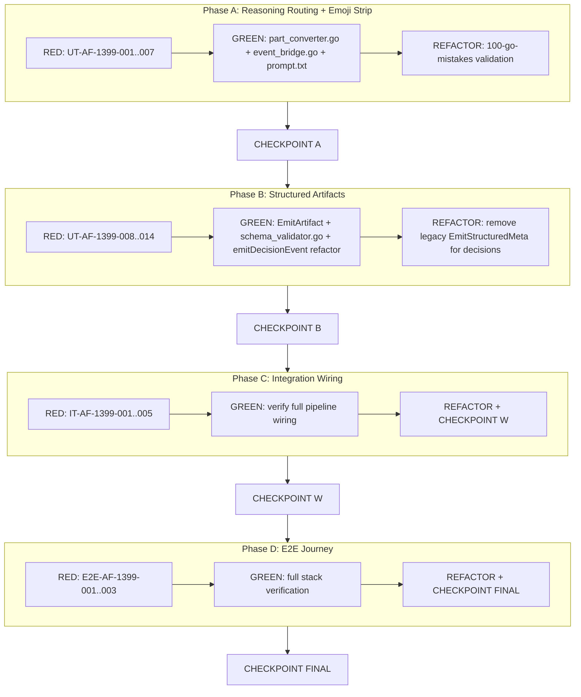

# Test Plan: A2A Streaming — Separate Thinking from Final Output

> **Template Version**: 2.0 — Hybrid IEEE 829-2008 + Kubernaut

**Test Plan Identifier**: TP-1399-v1
**Feature**: Separate thinking events from final output and provide structured data via A2A-compliant artifacts
**Version**: 1.0
**Created**: 2026-06-11
**Author**: AI Agent
**Status**: Draft
**Branch**: `feat/structured-decision-payload`

---

## 1. Introduction

### 1.1 Purpose

This test plan validates the two-phase implementation of A2A streaming separation:
1. **Phase 1 (Reasoning Routing)**: ALL non-final LLM text (thoughts, tool call announcements, tool responses) routes to `TaskStatusUpdateEvent` with `metadata.type="reasoning"` for the ThinkingPanel. Final output is emoji-free.
2. **Phase 2 (Structured Artifacts)**: Final structured results (`investigation_summary`) are emitted as A2A v1.0-compliant `TaskArtifactUpdateEvent` with multi-part content (`DataPart` + `TextPart` fallback), not as status-updates with JSON-as-string.

### 1.2 Objectives

1. **Reasoning isolation**: Thoughts, FunctionCalls (non-decision), and FunctionResponses (non-decision) are emitted as `metadata.type="reasoning"` — not visible in the main artifact bubble
2. **Emoji suppression**: Final LLM text output has emoji codepoints stripped before delivery
3. **A2A artifact compliance**: Structured results use `TaskArtifactUpdateEvent` with `a2a.DataPart` (native JSON) + `a2a.TextPart` (human fallback), per A2A v1.0 spec
4. **Schema validation**: Outbound structured payloads validate against co-located JSON Schema before emission
5. **Backward compatibility**: Existing Kagenti rendering (which consumes text artifacts) continues to work unchanged
6. **No regression**: Existing `UT-AF-1189-*` part converter tests remain valid or are explicitly updated

### 1.3 Success Metrics

| Metric | Target | Measurement |
|--------|--------|-------------|
| Unit test pass rate | 100% | `go test ./pkg/apifrontend/launcher/... -run "UT-AF-1399"` |
| Integration test pass rate | 100% | `go test ./test/integration/apifrontend/... -run "IT-AF-1399"` |
| E2E test pass rate | 100% | `make test-e2e-apifrontend` (streaming focus) |
| Unit-testable code coverage | >=80% | `go test -coverprofile` on part_converter, event_bridge |
| Integration-testable code coverage | >=80% | `go test -coverprofile` on launcher wiring |
| Backward compatibility | 0 unintentional regressions | Existing `UT-AF-1189-*` updated with new expected behavior |
| A2A compliance | DataPart in artifact | Artifact event contains `kind:"data"` part |
| Schema compliance | 0 invalid payloads | JSON Schema validation passes for all emitted structured payloads |

---

## 2. References

### 2.1 Authority

- Issue #1399: A2A streaming — separate thinking events from final output and provide structured data
- Issue #1396: AF: Emit structured RCA and extended workflow options in present_decision payload (existing infrastructure)
- Issue #1395: EventBridge sanitizeBridgeText truncates structured JSON payloads at 512 runes
- [A2A v1.0 Specification](https://a2a-protocol.org/dev/topics/key-concepts/) — TaskArtifactUpdateEvent, Part.data
- Console team alignment: [#1399 comment thread](https://github.com/jordigilh/kubernaut/issues/1399)

### 2.2 Cross-References

- [Testing Strategy](../../.cursor/rules/03-testing-strategy.mdc)
- [Wiring Verification](../../.cursor/rules/10-wiring-verification.mdc)
- [100 Go Mistakes](https://github.com/teivah/100-go-mistakes) — refactoring validation
- `a2a-go v0.3.15` library source: `Part` interface, `DataPart`, `TextPart`, `TaskArtifactUpdateEvent`
- ADK `google.golang.org/adk@v1.2.0`: `GenAIPartConverter`, `eventProcessor`, `artifactMaker`

### 2.3 FedRAMP Control Objectives

| Control | NIST Intent | Application to This Feature |
|---------|-------------|----------------------------|
| **AU-3** | Audit records contain sufficient detail | Structured artifact contains full investigation summary with RCA, options, confidence |
| **SI-4** | Real-time monitoring | `metadata.type="reasoning"` classification enables ThinkingPanel routing vs final output separation |
| **SI-10** | Input validation/sanitization | Emoji strip + control-char sanitization on final output; JSON Schema validation on structured payloads |
| **SI-17** | Fail-safe on error | Schema validation failure degrades gracefully to text-only artifact; nil-safe EmitArtifact |
| **SC-7** | Boundary protection | Secrets redacted before crossing AF->client boundary; emoji stripped to prevent rendering injection |
| **AC-6** | Least privilege / structured disclosure | Structured data exposes only business-relevant fields (no internal IDs, no raw tool output) |

---

## 3. Risks & Mitigations

| ID | Risk | Impact | Probability | Affected Tests | Mitigation |
|----|------|--------|-------------|----------------|------------|
| R1 | Reasoning routing hides useful progress from non-ThinkingPanel clients | Users miss tool call context | Medium | UT-AF-1399-001..003 | Keep `present_decision` and `kubernaut_watch` as visible events (user-facing decisions, not thinking) |
| R2 | ADK executor emits duplicate artifact alongside our direct EmitArtifact | Double artifact for decision events | High | IT-AF-1399-004 | `emitDecisionEvent` returns `nil` from converter (ADK skips), then emits its own artifact via EventBridge |
| R3 | Emoji stripping removes valid Unicode (math, currency) | Data corruption in edge cases | Low | UT-AF-1399-005..006 | Target only Unicode emoji presentation sequences (So category with specific ranges), not all symbols |
| R4 | Schema validation dependency adds latency to streaming | Perceptible delay on artifact emission | Low | UT-AF-1399-012 | Compile schema once at startup; validation is <1ms for typical payloads |
| R5 | Existing tests assert `"Analyzing..."` for Thought parts | Test failures | Certain | UT-AF-1189-131, UT-AF-1189-167 | Explicitly update these tests to expect `metadata.type="reasoning"` with forwarded thought content |
| R6 | Console needs migration to read DataPart instead of status text | Temporary rendering gap | Medium | E2E-AF-1399-002 | Phase 2 emits both DataPart (structured) + TextPart (fallback) in same artifact — old clients use text |

### 3.1 Risk-to-Test Traceability

- **R1** (Medium): UT-AF-1399-001..003 (verify correct routing decisions)
- **R2** (High): IT-AF-1399-004 (converter returns nil for decision parts)
- **R3** (Low): UT-AF-1399-005..006 (emoji stripping correctness)
- **R4** (Low): UT-AF-1399-012 (schema compilation + validation)
- **R5** (Certain): UT-AF-1399-001, explicit update of UT-AF-1189-131/167
- **R6** (Medium): E2E-AF-1399-002 (multi-part artifact delivery)

---

## 4. Scope

### 4.1 Features to be Tested

- **Reasoning routing** (`pkg/apifrontend/launcher/part_converter.go`): Thought, FunctionCall (non-decision), FunctionResponse (non-decision) emit as `metadata.type="reasoning"`
- **Emoji suppression** (`pkg/apifrontend/launcher/event_bridge.go`): `stripEmoji` helper removes emoji from final text output
- **EmitArtifact** (`pkg/apifrontend/launcher/event_bridge.go`): New method emitting `TaskArtifactUpdateEvent` with multi-part `DataPart` + `TextPart`
- **Decision event refactor** (`pkg/apifrontend/launcher/part_converter.go`): `emitDecisionEvent` uses `EmitArtifact` instead of `EmitStructuredMeta`
- **Schema validation** (`pkg/apifrontend/launcher/schema_validator.go`): Validates structured payloads against embedded JSON Schema
- **Prompt update** (`pkg/apifrontend/agent/prompt.txt`): No-emoji instruction

### 4.2 Features Not to be Tested

- **Console ThinkingPanel rendering**: Separate repo (`kubernaut-demo-console`)
- **ADK executor internals**: Upstream library; we test our converter output
- **LLM behavior with no-emoji instruction**: LLM compliance is best-effort; code strips emoji regardless
- **Other structured event types** (approval_request, output): Remain as status-updates for now (follow-up)

### 4.3 Design Decisions

| Decision | Rationale |
|----------|-----------|
| Forward actual thought text (not "Analyzing...") | ThinkingPanel shows live agent reasoning — placeholder defeats purpose |
| FunctionCall/Response as reasoning (not status) | Cursor model: ONLY final answer in bubble; everything else is thinking |
| Emoji strip via Unicode range (not regex) | Faster, no regex compilation; targets presentation sequences only |
| Multi-part artifact (DataPart + TextPart) | A2A v1.0 content negotiation — structured clients pick data, text clients pick text |
| Schema validation as defense-in-depth | Emit text fallback on validation failure (SI-17 graceful degradation) |

---

## 5. Approach

### 5.1 Coverage Policy

- **Unit**: >=80% of unit-testable code (part routing logic, emoji strip, schema validation, artifact construction)
- **Integration**: >=80% of integration-testable code (converter + EventBridge wiring, artifact event in queue)
- **E2E**: >=80% of full service code exercised through Kind cluster (SSE stream delivers reasoning + structured artifact)

### 5.2 Pyramid Invariant

> UT proves logic. IT proves wiring. E2E proves the journey.

Every business requirement covered by UT + IT minimum. E2E provides journey assurance.

### 5.3 Pass/Fail Criteria

**PASS**:
1. All P0 tests pass (0 failures)
2. All P1 tests pass or have documented exceptions
3. Per-tier code coverage >=80%
4. No regressions in existing test suites (updated `UT-AF-1189-*` pass)
5. Structured artifact contains `DataPart` with valid JSON matching `investigation_summary` schema
6. Reasoning events carry `metadata.type="reasoning"` and actual content (not placeholder)

**FAIL**:
1. Any P0 test fails
2. Per-tier coverage below 80%
3. Final artifact contains emoji characters
4. Structured artifact uses `TextPart` with JSON-as-string (violates A2A v1.0)
5. ADK executor produces duplicate artifact for decision parts

### 5.4 Suspension & Resumption Criteria

**Suspend**: `a2a-go` library breaks `DataPart` API; ADK changes `GenAIPartConverter` signature
**Resume**: Library compatibility restored; signature validated

---

## 6. Test Items

### 6.1 Unit-Testable Code (pure logic, no I/O)

| File | Functions/Methods | Lines (approx) |
|------|-------------------|-----------------|
| `pkg/apifrontend/launcher/part_converter.go` | `emitPartViaBridge` routing changes, emoji strip integration | ~20 |
| `pkg/apifrontend/launcher/event_bridge.go` | `stripEmoji`, `EmitArtifact` | ~40 |
| `pkg/apifrontend/launcher/schema_validator.go` (NEW) | `ValidatePayload`, `compileSchema` | ~50 |
| `schemas/a2a/investigation_summary.v1.schema.json` (NEW) | JSON Schema definition | ~80 |

### 6.2 Integration-Testable Code (I/O, wiring, cross-component)

| File | Functions/Methods | Lines (approx) |
|------|-------------------|-----------------|
| `pkg/apifrontend/launcher/part_converter.go` | `buildStreamingPartConverter` + `emitDecisionEvent` (artifact emission wiring) | ~30 |
| `pkg/apifrontend/launcher/event_bridge.go` | `EmitArtifact` → `queue.Write` | ~15 |

---

## 7. BR Coverage Matrix

| BR/Issue | Description | Priority | Tier | Test ID | Status |
|----------|-------------|----------|------|---------|--------|
| #1399 | Thought parts route to reasoning channel | P0 | Unit | UT-AF-1399-001 | Pending |
| #1399 | FunctionCall (non-decision) routes to reasoning | P0 | Unit | UT-AF-1399-002 | Pending |
| #1399 | FunctionResponse (non-decision) routes to reasoning | P0 | Unit | UT-AF-1399-003 | Pending |
| #1399 | present_decision FunctionCall still returns nil (no ADK artifact) | P0 | Unit | UT-AF-1399-004 | Pending |
| #1399 | stripEmoji removes common emoji from text | P0 | Unit | UT-AF-1399-005 | Pending |
| #1399 | stripEmoji preserves non-emoji Unicode (math, currency, CJK) | P0 | Unit | UT-AF-1399-006 | Pending |
| #1399 | Final LLM text output has emoji stripped | P0 | Unit | UT-AF-1399-007 | Pending |
| #1399 | EmitArtifact constructs TaskArtifactUpdateEvent with DataPart + TextPart | P0 | Unit | UT-AF-1399-008 | Pending |
| #1399 | EmitArtifact sets artifact.metadata.type from caller | P1 | Unit | UT-AF-1399-009 | Pending |
| #1399 | EmitArtifact nil-safe (no bridge in context) | P0 | Unit | UT-AF-1399-010 | Pending |
| #1399 | emitDecisionEvent uses EmitArtifact (not EmitStructuredMeta) | P0 | Unit | UT-AF-1399-011 | Pending |
| #1399 | Schema validation passes for valid investigation_summary | P0 | Unit | UT-AF-1399-012 | Pending |
| #1399 | Schema validation fails for missing required field (rca) | P1 | Unit | UT-AF-1399-013 | Pending |
| #1399 | Schema validation failure -> graceful degradation (text-only) | P0 | Unit | UT-AF-1399-014 | Pending |
| #1399 | Reasoning event carries actual thought content | P0 | Integration | IT-AF-1399-001 | Pending |
| #1399 | Final artifact has no emoji after full converter pipeline | P0 | Integration | IT-AF-1399-002 | Pending |
| #1399 | Structured decision emits TaskArtifactUpdateEvent to queue | P0 | Integration | IT-AF-1399-003 | Pending |
| #1399 | Decision part returns nil from converter (no ADK duplicate) | P0 | Integration | IT-AF-1399-004 | Pending |
| #1399 | Artifact DataPart matches investigation_summary schema | P0 | Integration | IT-AF-1399-005 | Pending |
| #1399 | SSE stream delivers reasoning events with type=reasoning | P0 | E2E | E2E-AF-1399-001 | Pending |
| #1399 | SSE stream delivers structured artifact with DataPart for investigation | P0 | E2E | E2E-AF-1399-002 | Pending |
| #1399 | Final artifact text in SSE has no emoji characters | P1 | E2E | E2E-AF-1399-003 | Pending |

---

## 8. Test Scenarios

### Test ID Naming Convention

Format: `{TIER}-{SERVICE}-{ISSUE}-{SEQUENCE}`
- **TIER**: `UT` (Unit), `IT` (Integration), `E2E` (End-to-End)
- **SERVICE**: `AF` (ApiFrontend)
- **ISSUE**: `1399`
- **SEQUENCE**: Zero-padded 3-digit

### Tier 1: Unit Tests (Phase A + Phase B)

| ID | Business Outcome Under Test | FedRAMP | Phase |
|----|----------------------------|---------|-------|
| `UT-AF-1399-001` | SI-4: Thought parts emit as `metadata.type="reasoning"` with forwarded text content (not placeholder) | SI-4 | A |
| `UT-AF-1399-002` | SI-4: FunctionCall (non-decision) emits as `metadata.type="reasoning"` with tool context | SI-4 | A |
| `UT-AF-1399-003` | SI-4: FunctionResponse (non-decision) emits as `metadata.type="reasoning"` with summary | SI-4 | A |
| `UT-AF-1399-004` | AC-6: `present_decision` FunctionCall returns nil from converter (no ADK artifact duplication) | AC-6 | A |
| `UT-AF-1399-005` | SI-10: `stripEmoji` removes emoji codepoints (U+1F600..U+1F64F, U+1F300..U+1F5FF, U+2600..U+26FF, etc.) | SI-10 | A |
| `UT-AF-1399-006` | SI-10: `stripEmoji` preserves valid Unicode: math symbols, currency, CJK, accented Latin | SI-10 | A |
| `UT-AF-1399-007` | SC-7: Final LLM text artifact has emoji stripped before delivery to client | SC-7 | A |
| `UT-AF-1399-008` | AU-3: `EmitArtifact` constructs `TaskArtifactUpdateEvent` with `DataPart{Data: payload}` + `TextPart{Text: fallback}` | AU-3 | B |
| `UT-AF-1399-009` | SI-4: `EmitArtifact` sets `artifact.metadata` from caller-supplied map (type, schema, schema_version) | SI-4 | B |
| `UT-AF-1399-010` | SI-17: `EmitArtifact` with nil queue returns nil (no panic) | SI-17 | B |
| `UT-AF-1399-011` | AU-3: `emitDecisionEvent` calls `EmitArtifact` (not legacy `EmitStructuredMeta`) producing artifact-update | AU-3 | B |
| `UT-AF-1399-012` | SI-10: `ValidatePayload("investigation_summary", validData)` returns nil | SI-10 | B |
| `UT-AF-1399-013` | SI-10: `ValidatePayload("investigation_summary", invalidData)` returns error with field path | SI-10 | B |
| `UT-AF-1399-014` | SI-17: Schema validation failure -> `EmitArtifact` emits text-only fallback + logs warning | SI-17 | B |

### Tier 2: Integration Tests (Phase C)

| ID | Business Outcome Under Test | FedRAMP | Phase |
|----|----------------------------|---------|-------|
| `IT-AF-1399-001` | SI-4: Full converter pipeline with Thought part -> fakeQueue has `TaskStatusUpdateEvent` with `metadata.type="reasoning"` carrying actual thought text | SI-4 | C |
| `IT-AF-1399-002` | SC-7: Full converter pipeline with emoji-laden LLM text -> returned `TextPart` has emoji stripped | SC-7 | C |
| `IT-AF-1399-003` | AU-3: Streaming converter with `present_decision` FunctionCall -> fakeQueue has `TaskArtifactUpdateEvent` with `DataPart` containing investigation_summary | AU-3 | C |
| `IT-AF-1399-004` | AC-6: Streaming converter with `present_decision` returns nil to ADK (no double artifact emission) | AC-6 | C |
| `IT-AF-1399-005` | SI-10: Artifact `DataPart.Data` validates against `investigation_summary` JSON Schema | SI-10 | C |

### Tier 3: E2E Tests (Phase D)

| ID | Business Outcome Under Test | FedRAMP | Phase |
|----|----------------------------|---------|-------|
| `E2E-AF-1399-001` | SI-4: A2A SSE stream during investigation delivers status-update frames with `metadata.type="reasoning"` carrying non-placeholder text | SI-4 | D |
| `E2E-AF-1399-002` | AU-3, AC-6: A2A SSE stream delivers `artifact-update` frame with multi-part artifact (`data` + `text` parts) for investigation summary | AU-3, AC-6 | D |
| `E2E-AF-1399-003` | SC-7: Final artifact text in SSE stream contains no emoji characters | SC-7 | D |

**Infrastructure**: Existing `test/e2e/apifrontend/` cluster (AF+mock-LLM+DEX), mock-LLM with `af_structured_decision` scenario (from #1396), SSE frame scanner helpers.

---

## 9. Test Cases

### UT-AF-1399-001: Thought parts route to reasoning channel

**Priority**: P0
**Type**: Unit
**File**: `pkg/apifrontend/launcher/part_converter_test.go`

**Test Steps**:
1. **Given**: A `genai.Part` with `Thought=true` and `Text="I should check node utilization next."`
2. **When**: `convert(ctx, nil, part)` is called with EventBridge context
3. **Then**: Returns nil (no artifact); fakeQueue has 1 event with `metadata.type="reasoning"` and text containing the thought content

**Expected Results**:
1. Converter returns nil (not a TextPart — thought is not final output)
2. Queue event is `TaskStatusUpdateEvent` with `metadata["type"] = "reasoning"`
3. Event `Status.Message.Parts[0].(TextPart).Text` contains "check node utilization" (actual content)
4. Event text is NOT "Analyzing..." (placeholder removed)

**Acceptance**: Replaces existing `UT-AF-1189-131` / `UT-AF-1189-167` behavior

---

### UT-AF-1399-005: stripEmoji removes emoji codepoints

**Priority**: P0
**Type**: Unit
**File**: `pkg/apifrontend/launcher/event_bridge_test.go`

**Test Steps**:
1. **Given**: Input strings containing emoji: `"Hello 🚀 world"`, `"Status: ✅ Done"`, `"Alert ⚠️ critical"`
2. **When**: `stripEmoji(input)` is called
3. **Then**: Returns strings with emoji removed: `"Hello  world"`, `"Status:  Done"`, `"Alert  critical"`

**Expected Results**:
1. All emoji codepoints (U+1F600-1F64F, U+1F300-1F5FF, U+2600-26FF, U+2700-27BF, U+FE00-FE0F, U+1F900-1F9FF) removed
2. Surrounding text preserved exactly (no extra trim)

---

### UT-AF-1399-008: EmitArtifact constructs multi-part artifact

**Priority**: P0
**Type**: Unit
**File**: `pkg/apifrontend/launcher/event_bridge_test.go`

**Test Steps**:
1. **Given**: An EventBridge with fakeQueue; `data = map[string]any{"type": "investigation_summary", "rca": {...}}`, `textFallback = "Investigation complete..."`, `meta = map[string]any{"type": "investigation_summary", "schema_version": "1.0"}`
2. **When**: `bridge.EmitArtifact(ctx, data, textFallback, meta)` is called
3. **Then**: fakeQueue contains 1 `TaskArtifactUpdateEvent` with 2 parts

**Expected Results**:
1. Event type is `*a2a.TaskArtifactUpdateEvent`
2. `event.Artifact.Parts[0]` is `a2a.DataPart` with `Data["type"] == "investigation_summary"`
3. `event.Artifact.Parts[1]` is `a2a.TextPart` with `Text == "Investigation complete..."`
4. `event.Artifact.Metadata["type"] == "investigation_summary"`
5. `event.LastChunk == true`
6. `event.TaskID` and `event.ContextID` match bridge configuration

---

### IT-AF-1399-003: Decision FunctionCall emits TaskArtifactUpdateEvent

**Priority**: P0
**Type**: Integration
**File**: `pkg/apifrontend/launcher/part_converter_test.go`

**Test Steps**:
1. **Given**: Streaming part converter with EventBridge context; `genai.Part` with `FunctionCall{Name: "kubernaut_present_decision", Args: {session_id, summary, rca, options}}`
2. **When**: `convert(ctx, nil, part)` is called
3. **Then**: Converter returns nil; fakeQueue contains a `TaskArtifactUpdateEvent` (not `TaskStatusUpdateEvent`)

**Expected Results**:
1. Converter return value is nil (no ADK artifact emission)
2. Queue has exactly 2 events: one `TaskStatusUpdateEvent` ("Presenting decision...") + one `TaskArtifactUpdateEvent`
3. Artifact event has `DataPart` with investigation_summary data
4. Artifact event has `TextPart` with human-readable fallback
5. No `TaskStatusUpdateEvent` with `metadata.type="decision"` (legacy path removed)

---

### E2E-AF-1399-001: SSE stream delivers reasoning events

**Priority**: P0
**Type**: E2E
**File**: `test/e2e/apifrontend/structured_decision_e2e_test.go` (extended)

**Test Steps**:
1. **Given**: Kind cluster with AF running, DEX token for `sre` persona, mock-LLM with `af_structured_decision` scenario
2. **When**: A2A invoke with keyword triggering investigation flow (Thought parts + tool calls)
3. **Then**: SSE stream contains status-update frames with `metadata.type="reasoning"` carrying non-placeholder text

**Expected Results**:
1. At least 1 SSE frame parses to `TaskStatusUpdateEvent` with `metadata.type="reasoning"`
2. Event text is NOT "Analyzing..." — contains actual reasoning/tool context
3. Final artifact frame has no `metadata.type="reasoning"` (reasoning is separate from output)

---

## 10. Environmental Needs

### 10.1 Unit Tests
- Go 1.22+, Ginkgo v2, Gomega
- `a2a-go v0.3.15` (DataPart, TextPart, TaskArtifactUpdateEvent)
- `github.com/santhosh-tekuri/jsonschema/v5` (schema validation)

### 10.2 Integration Tests
- All of 10.1 plus fakeQueue, `launcher.WithEventBridge`
- `google.golang.org/genai` (Part, FunctionCall construction)

### 10.3 E2E Tests
- Kind cluster (`apifrontend-e2e`), AF binary, mock-LLM, DEX
- SSE frame parsing helpers (existing in `test/e2e/apifrontend/`)
- `af_structured_decision` mock-LLM scenario (from #1396 implementation)

---

## 11. Dependencies & Schedule

### 11.1 Blocking Dependencies

| Dependency | Status | Impact if Missing |
|------------|--------|-------------------|
| `a2a-go v0.3.15` DataPart type | Available | Cannot construct structured artifacts |
| `EmitStructuredMeta` (from #1395) | Merged | Phase 2 replaces it; Phase 1 uses EmitReasoning |
| `GenAIPartConverter` ADK interface | Stable (v1.2.0) | Converter signature change would break all tests |
| Console team schema agreement | Confirmed (#1399 thread) | Cannot finalize investigation_summary schema |
| `jsonschema/v5` in go.mod | Available | Need to verify; may need `go get` |

### 11.2 TDD Execution Order (Phased)

---

## 12. 100-Go-Mistakes Validation Checklist (Refactor Phases)

| # | Mistake | Applicable Code | Check |
|---|---------|-----------------|-------|
| #28 | Maps and memory leaks | `stripEmoji` — no map accumulation | Verify pure function, no state |
| #36 | Unnecessary type conversions | `DataPart.Data` is `map[string]any` — no redundant cast | Verify direct assignment |
| #54 | Not using test helpers | Reuse `partConverterBridgeCtx`, `statusEventTextAt` | Verify helper reuse |
| #60 | Not using table-driven tests | Emoji strip test cases, schema validation cases | Use table-driven |
| #78 | JSON handling | `DataPart` handles JSON natively via a2a-go marshal | No manual JSON encode for data |
| #89 | Writing inaccurate benchmarks | N/A (no benchmarks in scope) | — |
| #97 | Context misuse | `EmitArtifact` accepts `context.Context` for cancellation | Verify ctx passed through |

---

## 13. Wiring Manifest

| Component | Production Entry Point | Wiring Code Location | IT Test ID |
|-----------|----------------------|---------------------|------------|
| Reasoning routing | `buildStreamingPartConverter()` | `part_converter.go:emitPartViaBridge` | IT-AF-1399-001 |
| Emoji strip | `emitPartViaBridge` default case | `part_converter.go:332` | IT-AF-1399-002 |
| EmitArtifact | `emitDecisionEvent()` | `event_bridge.go:EmitArtifact` | IT-AF-1399-003 |
| Schema validation | `emitDecisionEvent()` pre-emit | `schema_validator.go:ValidatePayload` | IT-AF-1399-005 |
| investigation_summary schema | `//go:embed` in validator | `schemas/a2a/investigation_summary.v1.schema.json` | UT-AF-1399-012 |
