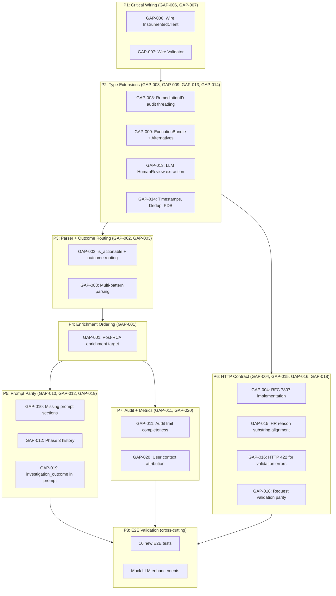

# Test Plan: TP-433-ADV — HAPI-KA Adversarial Parity Gap Closure

> **Template Version**: 2.0 — Hybrid IEEE 829-2008 + Kubernaut
>
> Based on IEEE 829-2008 with Kubernaut-specific extensions for TDD phase tracking,
> business requirement traceability, and per-tier coverage policy.

**Test Plan Identifier**: TP-433-ADV-v1.0
**Feature**: Close 20 adversarial audit gaps between HAPI (Python, `origin/main`) and KA (Go, `development/v1.3`)
**Version**: 1.0
**Created**: 2026-03-04
**Author**: Kubernaut Team
**Status**: Approved
**Branch**: `development/v1.3`

---

## 1. Introduction

### 1.1 Purpose

This test plan closes the 20 behavioral gaps identified by the adversarial audit comparing
HAPI (`origin/main`, Python) against KA (`development/v1.3`, Go). The audit compared every
behavioral surface: request handling, response construction, prompt building, LLM interaction,
result parsing, enrichment, audit trail, and error handling.

The plan ensures KA is a **drop-in replacement** for HAPI at the HTTP API boundary, producing
identical business outcomes for every scenario the AIAnalysis controller depends on.

Extends: [TP-433-PARITY](TP-433-PARITY.md) (integration test parity, completed)

### 1.2 Objectives

1. **Outcome parity**: All 15 Mock LLM scenarios produce identical `IncidentResponse` fields
   (within tolerance) between HAPI and KA
2. **Contract compliance**: All responses match the OpenAPI schema in
   `internal/kubernautagent/api/openapi.json` (6 endpoints, 8 `HumanReviewReason` enum values,
   RFC 7807 error format)
3. **Observability parity**: LLM metrics (`aiagent_api_llm_*`) appear on `/metrics` after
   investigation; audit events contain token usage, prompt preview, and correlation IDs
4. **E2E assurance**: 16 new E2E tests validate full-stack behavior in Kind cluster, exceeding
   HAPI's E2E coverage with additional outcome routing, metrics, and audit trail scenarios

### 1.3 Success Metrics

| Metric | Target | Measurement |
|--------|--------|-------------|
| Unit test pass rate | 100% | `go test ./test/unit/kubernautagent/...` |
| Integration test pass rate | 100% | `go test ./test/integration/kubernautagent/...` |
| E2E test pass rate | 100% | `go test ./test/e2e/kubernautagent/...` |
| Unit-testable code coverage | >=80% | `go test -coverprofile` on parser, types, prompt, audit |
| Integration-testable code coverage | >=80% | `go test -coverprofile` on handler, investigator, main |
| E2E coverage (full service) | >=80% | 62 E2E tests across 10+ files |
| Backward compatibility | 0 regressions | Existing 46 E2E + all UT/IT pass without modification |

---

## 2. References

### 2.1 Authority (governing documents)

- **BR-HAPI-433**: Go language migration — Kubernaut Agent replaces Python HAPI
- **BR-HAPI-002**: Incident analysis request/response schema
- **BR-HAPI-197**: Human review field contract
- **BR-HAPI-200**: RFC 7807 error response standard
- **BR-AUDIT-005**: Audit event persistence for compliance
- **ADR-054**: Proactive signal mode classification
- **ADR-056**: DetectedLabels computed post-RCA
- **DD-HAPI-002 v1.2**: Workflow response validation and self-correction
- **DD-AUTH-006**: User attribution for LLM cost tracking
- **DD-HAPI-019-001**: LLM framework selection (JSONMode requirement)

### 2.2 Cross-References

- [TP-433-PARITY](TP-433-PARITY.md) — Integration test parity (completed, prerequisite)
- [TP-433 TEST_PLAN](TEST_PLAN.md) — Original KA rewrite test plan
- [Testing Guidelines](../../development/business-requirements/TESTING_GUIDELINES.md)
- [Testing Strategy](../../../.cursor/rules/03-testing-strategy.mdc)
- [OpenAPI Spec](../../../internal/kubernautagent/api/openapi.json) — Source of truth for HTTP contract
- [Mock LLM Business Requirements](../../services/test-infrastructure/mock-llm/BUSINESS_REQUIREMENTS.md)
- GitHub Issue #624 — JSONMode / section-header structured output (GAP-005)

---

## 3. Risks & Mitigations

| ID | Risk | Impact | Probability | Affected Tests | Mitigation |
|----|------|--------|-------------|----------------|------------|
| R-ADV-1 | Phase 4 enrichment reordering breaks PARITY tests | Investigation results change | Medium | All P4, TP-433-PARITY | CHECKPOINT-4 full regression; `resolveEnrichmentTarget()` falls back to signal |
| R-ADV-2 | Parser changes conflict with #624 structured output | Parsing failures | Low | P3 parser tests | Multi-pattern is additive; JSONMode produces Pattern 1 (clean JSON) |
| R-ADV-3 | RFC 7807 handler conflicts with ogen defaults | Error responses break | Low | P6 HTTP tests | ogen `ErrorHandler` option; spec already defines `HTTPError` schema |
| R-ADV-4 | Prompt changes alter Mock LLM deterministic behavior | E2E test failures | Low | P5 prompt, P8 E2E | Mock LLM matches keywords, not prompt structure; changes are context additions |
| R-ADV-6 | Mock LLM response field additions break existing E2E | 46 existing E2E fail | Low | All E2E | Fields are **additive only**; existing tests parse only their expected fields |
| R-ADV-7 | InvestigationResult type changes break ogen serialization | Compile errors or wrong JSON | Medium | P2 type tests | Only add fields; JSON round-trip unit tests; never rename existing |

### 3.1 Risk-to-Test Traceability

- **R-ADV-1** → `UT-KA-433-ENR-001..004`, CHECKPOINT-4
- **R-ADV-2** → `UT-KA-433-PRS-001..015`, CHECKPOINT-3
- **R-ADV-7** → `UT-KA-433-TYP-001..008`, CHECKPOINT-2

### 3.2 Documentation Impact

<!-- kubernaut-docs: The following changes require external documentation updates -->

> **@kubernaut-docs team**: The following behavioral changes introduced in TP-433-ADV
> may need to be reflected in public-facing documentation:
>
> 1. **GAP-007 / DD-HAPI-002 v1.5**: KA enforces **fail-closed startup** when DataStorage
>    is configured but the workflow catalog cannot be fetched. KA will refuse to start
>    (exit code 1) rather than silently bypass workflow validation. This affects
>    deployment runbooks and troubleshooting guides — operators need to know that
>    DataStorage must be reachable before KA can start.
>
> 2. **GAP-006 / LLM Metrics**: KA now exposes `aiagent_api_llm_requests_total`,
>    `aiagent_api_llm_request_duration_seconds`, and `aiagent_api_llm_tokens_total`
>    on the `/metrics` endpoint via `InstrumentedClient`. Monitoring dashboards
>    and alerting docs may need updating.

---

## 4. Scope

### 4.1 Features to be Tested

- **Parser** (`internal/kubernautagent/parser/parser.go`): Multi-pattern extraction, outcome routing, balanced JSON, `is_actionable`/`needs_human_review`/`human_review_reason` population
- **Types** (`internal/kubernautagent/types/types.go`): New fields matching OpenAPI contract
- **Investigator** (`internal/kubernautagent/investigator/investigator.go`): Post-RCA enrichment ordering, `remediation_id` audit threading
- **Prompt** (`internal/kubernautagent/prompt/`): Severity rubric, Phase 3 history, JSON schema instructions
- **Server** (`internal/kubernautagent/server/handler.go`): RFC 7807 errors, response field mapping, HR reason alignment
- **Wiring** (`cmd/kubernautagent/main.go`): `InstrumentedClient` wrapping, `Validator` pipeline
- **Audit** (`internal/kubernautagent/audit/`): Event completeness (tokens, prompts, correlation IDs, user context)
- **Mock LLM** (`test/services/mock-llm/`): Response field extensions (remediation_target, execution_bundle)
- **E2E** (`test/e2e/kubernautagent/`): 16 new full-stack validation tests

### 4.2 Features Not to be Tested

- **GAP-017 (Post-execution endpoint)**: NOT in OpenAPI spec. Python code deferred (DD-017/v1.1). Removed from plan.
- **GAP-005 (JSONMode / section-headers)**: Addressed by #624. KA already sets `JSONMode: true`.
  Section-header fallback is additive (P3 parser) but prompt JSON schema is out of scope per #624.
- **OpenAPI spec changes**: The spec is authoritative. KA implements the spec; we do not modify it.

### 4.3 Design Decisions

| Decision | Rationale |
|----------|-----------|
| Phase 8 removed (GAP-017 post-exec) | `/postexec/analyze` not in OpenAPI spec; Python router deferred DD-017/v1.1 |
| Outcome routing via `is_actionable` + `needs_human_review` + `human_review_reason` | OpenAPI `IncidentResponse` has no `investigation_outcome` field; state is expressed through these 3 fields |
| `execution_bundle` inside `selected_workflow` object | OpenAPI defines `selected_workflow` as `additionalProperties: true`; `execution_bundle` is a nested key |
| `remediation_id` threaded through audit, not response | `IncidentResponse` has no `remediation_id` field; it's `IncidentRequest`-only for correlation |
| E2E as final Phase 8 (not per-phase) | E2E requires Kind cluster (~10 min setup); consolidated for efficiency |
| Mock LLM enhancements documented in BR-MOCK | Changes extend test infrastructure; documented in authoritative `BUSINESS_REQUIREMENTS.md` |

---

## 5. Approach

### 5.1 Coverage Policy

**Authority**: `03-testing-strategy.mdc` — Per-Tier Testable Code Coverage.

- **Unit**: >=80% of unit-testable code (parser, types, prompt builder, audit emitter, validator)
- **Integration**: >=80% of integration-testable code (handler, investigator, main wiring)
- **E2E**: >=80% of full KA service code (62 E2E tests covering all 15 Mock LLM scenarios + error paths + metrics + audit)

### 5.2 Two-Tier Minimum

Every GAP is covered by at least 2 test tiers:
- **Unit**: Catch logic errors (parser patterns, type serialization, prompt rendering)
- **E2E**: Catch wiring/integration errors (full stack through Kind cluster)
- **Integration**: Where applicable (handler HTTP, main.go wiring)

### 5.3 Business Outcome Quality Bar

Tests validate business outcomes:
- "When LLM says problem resolved, AIAnalysis sees `is_actionable=false`" (not "parser calls function X")
- "When validation fails 3 times, operator sees `human_review_reason=llm_parsing_error`" (not "retry count equals 3")
- "After investigation, Prometheus has `llm_requests_total > 0`" (not "InstrumentedClient.Chat was called")

### 5.4 Pass/Fail Criteria

**PASS** — all of:
1. All ~82 tests pass (55 UT + 11 IT + 16 E2E)
2. Zero regressions in existing 46 KA E2E tests
3. Per-tier coverage >=80%
4. `go build ./cmd/kubernautagent/...` succeeds
5. `go vet ./internal/kubernautagent/... ./pkg/kubernautagent/... ./cmd/kubernautagent/...` clean

**FAIL** — any of:
1. Any P0 test fails
2. Any existing E2E test regresses
3. Coverage below 80% on any tier

### 5.5 Suspension & Resumption Criteria

**Suspend**: #624 not landed and P5 prompt changes conflict; Kind cluster infra broken; build failures
**Resume**: Blocking dependency resolved; infra restored

---

## 6. Test Items

### 6.1 Unit-Testable Code (pure logic)

| File | Functions/Methods | Lines (approx) |
|------|-------------------|-----------------|
| `internal/kubernautagent/parser/parser.go` | `Parse`, `extractJSON`, `applyOutcomeRouting`, `extractBalancedJSON` | ~300 |
| `internal/kubernautagent/types/types.go` | `InvestigationResult`, `SignalContext`, `RemediationTarget` | ~70 |
| `internal/kubernautagent/prompt/builder.go` | `RenderInvestigation`, `RenderWorkflowSelection` | ~200 |
| `internal/kubernautagent/audit/emitter.go` | `NewEvent`, `StoreBestEffort` | ~80 |
| `internal/kubernautagent/parser/validator.go` | `Validate`, `NewValidator` | ~100 |
| `pkg/kubernautagent/llm/instrumented_client.go` | `Chat`, metrics registration | ~60 |

### 6.2 Integration-Testable Code (I/O, wiring)

| File | Functions/Methods | Lines (approx) |
|------|-------------------|-----------------|
| `cmd/kubernautagent/main.go` | `main`, wiring builders | ~200 |
| `internal/kubernautagent/server/handler.go` | `HandleAnalyze`, `mapResponse`, `mapHumanReviewReason` | ~250 |
| `internal/kubernautagent/investigator/investigator.go` | `Investigate`, `runRCA`, `runWorkflowSelection` | ~350 |
| `internal/kubernautagent/enrichment/enricher.go` | `Enrich`, enrichment target resolution | ~200 |
| `internal/kubernautagent/audit/ds_store.go` | `Store` | ~60 |

### 6.3 E2E-Testable Code (full service)

| Component | What is validated | Infra needed |
|-----------|-------------------|--------------|
| KA container | Full HTTP contract, response fields, error format | Kind + Mock LLM + DataStorage |
| Mock LLM | Enhanced responses with `remediation_target`, `execution_bundle` | Kind deployment |
| `/metrics` | Prometheus LLM counters after investigation | HTTP scrape |
| DataStorage | Audit events with token usage, correlation IDs | Authenticated DS client |

---

## 7. Gap-to-Phase Mapping

### 7.1 Phase Dependency Graph



### 7.2 Excluded GAPs

| GAP | Reason | Disposition |
|-----|--------|-------------|
| GAP-005 | JSONMode / section-headers addressed by #624 | Parser fallback added in P3; prompt schema out of scope |
| GAP-017 | Post-exec endpoint not in OpenAPI spec | Deprecated; deferred to v1.4 if needed |

---

## 8. BR Coverage Matrix

| GAP | BR ID | Description | Priority | Tiers | Test IDs |
|-----|-------|-------------|----------|-------|----------|
| GAP-006 | BR-HAPI-433 | Wire InstrumentedClient in main.go | P0 | IT, E2E | IT-KA-433-WIR-001, E2E-KA-433-ADV-008/009 |
| GAP-007 | BR-HAPI-433, DD-HAPI-002 v1.5 | Wire Pipeline.Validator — **fail-closed startup** when DS configured but catalog unreachable (see DD-HAPI-002 v1.5) | P0 | IT | IT-KA-433-WIR-002/003 |
| GAP-008 | BR-AUDIT-001, DD-WORKFLOW-002 | RemediationID audit threading | P0 | UT, E2E | UT-KA-433-TYP-001/002, E2E-KA-433-ADV-012 |
| GAP-009 | ADR-045, BR-HAPI-002 | ExecutionBundle + AlternativeWorkflows | P0 | UT, E2E | UT-KA-433-TYP-003..005, E2E-KA-433-ADV-010/011 |
| GAP-013 | BR-HAPI-197 | LLM needs_human_review extraction | P0 | UT | UT-KA-433-TYP-006/007 |
| GAP-014 | BR-HAPI-002 | Timestamps, dedup, PDB in signal | P1 | UT | UT-KA-433-TYP-008 |
| GAP-002 | BR-HAPI-197, BR-HAPI-002 | Outcome routing (is_actionable) | P0 | UT, E2E | UT-KA-433-OUT-001..006, E2E-KA-433-ADV-001..003 |
| GAP-003 | BR-HAPI-433 | Multi-pattern JSON parsing | P0 | UT | UT-KA-433-PRS-001..009 |
| GAP-001 | ADR-056 | Post-RCA enrichment ordering | P0 | UT, IT, E2E | UT-KA-433-ENR-001..004, IT-KA-433-ENR-001/002, E2E-KA-433-ADV-004 |
| GAP-010 | BR-AI-084, BR-HAPI-433 | Missing prompt sections | P1 | UT | UT-KA-433-PRM-001..004 |
| GAP-012 | DD-HAPI-002 | Phase 3 remediation history | P1 | UT | UT-KA-433-PRM-005/006 |
| GAP-019 | BR-HAPI-433 | investigation_outcome in Phase 3 prompt | P1 | UT | UT-KA-433-PRM-007/008 |
| GAP-004 | BR-HAPI-200 | RFC 7807 error implementation | P0 | UT, IT, E2E | UT-KA-433-HTTP-001..004, IT-KA-433-HTTP-001..003, E2E-KA-433-ADV-005/006 |
| GAP-015 | BR-HAPI-197 | HR reason substring alignment | P0 | UT, E2E | UT-KA-433-HTTP-005/006, E2E-KA-433-ADV-015/016 |
| GAP-016 | BR-HAPI-200 | HTTP 422 for validation errors | P0 | UT, E2E | UT-KA-433-HTTP-007/008, E2E-KA-433-ADV-006 |
| GAP-018 | BR-HAPI-200 | Request validation parity | P1 | UT | UT-KA-433-HTTP-009/010 |
| GAP-011 | BR-AUDIT-005 | Audit trail completeness | P0 | UT, IT, E2E | UT-KA-433-AUD-001..004, IT-KA-433-AUD-001/002, E2E-KA-433-ADV-012..014 |
| GAP-020 | DD-AUTH-006 | User context for audit attribution | P1 | UT, E2E | UT-KA-433-AUD-005/006, E2E-KA-433-ADV-014 |

---

## 9. Test Scenarios

### Test ID Naming Convention

Format: `{TIER}-KA-433-{GAP_ABBREV}-{SEQ}`

**Tier**: `UT` (Unit), `IT` (Integration), `E2E` (End-to-End)
**Abbreviations**: WIR (wiring), TYP (types), PRS (parser), OUT (outcome), ENR (enrichment), PRM (prompt), HTTP (http contract), AUD (audit), ADV (E2E adversarial)

---

### Tier 1: Unit Tests (~55 tests)

#### P1: Wiring (GAP-006, GAP-007)

| ID | Business Outcome Under Test | Phase |
|----|----------------------------|-------|
| `UT-KA-433-WIR-001` | InstrumentedClient wraps base LLM client (metrics are live) | Pending |
| `UT-KA-433-WIR-002` | Pipeline.Validator is non-nil when DataStorage is configured | Pending |

#### P2: Type Extensions (GAP-008, GAP-009, GAP-013, GAP-014)

| ID | Business Outcome Under Test | Phase |
|----|----------------------------|-------|
| `UT-KA-433-TYP-001` | SignalContext carries RemediationID for audit correlation | Pending |
| `UT-KA-433-TYP-002` | InvestigationResult JSON round-trip preserves all fields | Pending |
| `UT-KA-433-TYP-003` | InvestigationResult.ExecutionBundle populated from parser output | Pending |
| `UT-KA-433-TYP-004` | InvestigationResult.AlternativeWorkflows populated (empty list default) | Pending |
| `UT-KA-433-TYP-005` | AlternativeWorkflow struct matches OpenAPI AlternativeWorkflow schema | Pending |
| `UT-KA-433-TYP-006` | InvestigationResult.HumanReviewReason from LLM JSON extraction | Pending |
| `UT-KA-433-TYP-007` | is_actionable nil when LLM does not assess actionability | Pending |
| `UT-KA-433-TYP-008` | SignalContext carries FiringTime, ReceivedTime, IsDuplicate, OccurrenceCount | Pending |

#### P3: Parser + Outcome Routing (GAP-002, GAP-003)

| ID | Business Outcome Under Test | Phase |
|----|----------------------------|-------|
| `UT-KA-433-PRS-001` | extractBalancedJSON extracts first complete JSON object from markdown | Pending |
| `UT-KA-433-PRS-002` | extractBalancedJSON handles nested braces correctly | Pending |
| `UT-KA-433-PRS-003` | extractBalancedJSON returns empty on malformed input | Pending |
| `UT-KA-433-PRS-004` | Pattern 2A: raw dict with `root_cause_analysis` key parsed | Pending |
| `UT-KA-433-PRS-005` | Pattern 2B: section header `# root_cause_analysis` content parsed | Pending |
| `UT-KA-433-PRS-006` | Fallback chain: Pattern 1 (fenced JSON) → 2A → 2B → balanced brace | Pending |
| `UT-KA-433-PRS-007` | `execution_bundle` extracted into `selected_workflow` | Pending |
| `UT-KA-433-PRS-008` | `alternative_workflows` extracted from LLM JSON array | Pending |
| `UT-KA-433-PRS-009` | LLM-provided `needs_human_review` and `human_review_reason` extracted | Pending |
| `UT-KA-433-OUT-001` | `actionable=false` in LLM JSON → `is_actionable=false`, `needs_human_review=false` | Pending |
| `UT-KA-433-OUT-002` | Self-resolved language ("problem resolved") → `is_actionable=false`, no workflow | Pending |
| `UT-KA-433-OUT-003` | No workflow + no RCA phrase → `needs_human_review=true`, `human_review_reason=investigation_inconclusive` | Pending |
| `UT-KA-433-OUT-004` | LLM explicit `needs_human_review=true` with reason → preserved in result | Pending |
| `UT-KA-433-OUT-005` | Confidence floor: non-actionable scenarios get `confidence=0.0` | Pending |
| `UT-KA-433-OUT-006` | Workflow present + valid → `is_actionable=true`, `needs_human_review=false` | Pending |

#### P4: Enrichment Ordering (GAP-001)

| ID | Business Outcome Under Test | Phase |
|----|----------------------------|-------|
| `UT-KA-433-ENR-001` | Enrichment runs after RCA, not before | Pending |
| `UT-KA-433-ENR-002` | Enrichment target is RCA RemediationTarget, not signal resource | Pending |
| `UT-KA-433-ENR-003` | When RCA target is empty, enrichment falls back to signal resource | Pending |
| `UT-KA-433-ENR-004` | DetectedLabels reflect enrichment target namespace, not signal namespace | Pending |

#### P5: Prompt Parity (GAP-010, GAP-012, GAP-019)

| ID | Business Outcome Under Test | Phase |
|----|----------------------------|-------|
| `UT-KA-433-PRM-001` | Severity rubric (CRITICAL/HIGH/MEDIUM/LOW descriptions) in Phase 1 prompt | Pending |
| `UT-KA-433-PRM-002` | Priority descriptions in Phase 1 prompt | Pending |
| `UT-KA-433-PRM-003` | Risk guidance in Phase 1 prompt | Pending |
| `UT-KA-433-PRM-004` | Guardrails section present in rendered prompt | Pending |
| `UT-KA-433-PRM-005` | Phase 3 prompt includes full remediation history (not abbreviated) | Pending |
| `UT-KA-433-PRM-006` | Phase 3 prompt includes effectiveness scoring when history exists | Pending |
| `UT-KA-433-PRM-007` | Phase 3 prompt includes `investigation_outcome` in expected JSON schema | Pending |
| `UT-KA-433-PRM-008` | Timestamps and dedup fields rendered when present in signal | Pending |

#### P6: HTTP Contract (GAP-004, GAP-015, GAP-016, GAP-018)

| ID | Business Outcome Under Test | Phase |
|----|----------------------------|-------|
| `UT-KA-433-HTTP-001` | Error response has RFC 7807 fields: type, title, detail, status, instance | Pending |
| `UT-KA-433-HTTP-002` | Error content-type is `application/problem+json` | Pending |
| `UT-KA-433-HTTP-003` | Error `type` URL follows `https://kubernaut.ai/problems/` prefix | Pending |
| `UT-KA-433-HTTP-004` | 500 error includes `request_id` when available | Pending |
| `UT-KA-433-HTTP-005` | `"required"` validation error → `human_review_reason=parameter_validation_failed` | Pending |
| `UT-KA-433-HTTP-006` | `"type"` validation error → `human_review_reason=parameter_validation_failed` | Pending |
| `UT-KA-433-HTTP-007` | Missing required field → HTTP 422 (not 400) | Pending |
| `UT-KA-433-HTTP-008` | Invalid enum value → HTTP 422 | Pending |
| `UT-KA-433-HTTP-009` | Empty `incident_id` rejected with field name in error detail | Pending |
| `UT-KA-433-HTTP-010` | Response includes `execution_bundle` inside `selected_workflow` when present | Pending |

#### P7: Audit + Metrics (GAP-011, GAP-020)

| ID | Business Outcome Under Test | Phase |
|----|----------------------------|-------|
| `UT-KA-433-AUD-001` | LLM request audit event includes prompt preview (truncated to 500 chars) | Pending |
| `UT-KA-433-AUD-002` | LLM response audit event includes token totals (prompt, completion) | Pending |
| `UT-KA-433-AUD-003` | Tool call audit event includes tool name and arguments | Pending |
| `UT-KA-433-AUD-004` | Response complete event includes correlation_id = remediation_id | Pending |
| `UT-KA-433-AUD-005` | Audit event includes user context (ServiceAccount name) when present | Pending |
| `UT-KA-433-AUD-006` | Audit event user context is "anonymous" when no auth header | Pending |

### Tier 2: Integration Tests (~11 tests)

| ID | Business Outcome Under Test | Phase |
|----|----------------------------|-------|
| `IT-KA-433-WIR-001` | main.go builds LLM client as InstrumentedClient (not bare) | Pending |
| `IT-KA-433-WIR-002` | main.go sets Pipeline.Validator from DataStorage client | Pending |
| `IT-KA-433-WIR-003` | main.go registers RFC 7807 error handler with ogen | Pending |
| `IT-KA-433-ENR-001` | Investigator enriches using RCA target (mocked K8s + DS) | Pending |
| `IT-KA-433-ENR-002` | Investigator falls back to signal resource when RCA target empty | Pending |
| `IT-KA-433-HTTP-001` | POST /analyze with missing fields returns 422 + RFC 7807 body | Pending |
| `IT-KA-433-HTTP-002` | POST /analyze with valid request returns 202 | Pending |
| `IT-KA-433-HTTP-003` | GET /session/{bad_id} returns 404 + RFC 7807 body | Pending |
| `IT-KA-433-AUD-001` | Audit store receives events with prompt preview field | Pending |
| `IT-KA-433-AUD-002` | Audit store receives events with token usage data | Pending |
| `IT-KA-433-AUD-003` | Audit store receives correlation_id matching remediation_id | Pending |

### Tier 3: E2E Tests (16 tests)

**File**: `test/e2e/kubernautagent/adversarial_parity_e2e_test.go`
**Infrastructure**: Kind cluster + Mock LLM (enhanced) + DataStorage + KA

| ID | GAP | Business Outcome Under Test | Mock LLM Scenario | Phase |
|----|-----|----------------------------|-------------------|-------|
| `E2E-KA-433-ADV-001` | GAP-002 | `problem_resolved` → `is_actionable=false`, `needs_human_review=false`, no workflow | `problem_resolved` | Pending |
| `E2E-KA-433-ADV-002` | GAP-002 | `predictive_no_action` → `is_actionable=false`, no workflow selected | `predictive_no_action` | Pending |
| `E2E-KA-433-ADV-003` | GAP-002 | `problem_resolved_contradiction` → `needs_human_review=true`, correct HR reason | `problem_resolved_contradiction` | Pending |
| `E2E-KA-433-ADV-004` | GAP-001 | Enrichment targets RCA resource — `detected_labels` reflect Deployment, not Pod | `oomkilled` + Kind resources | Pending |
| `E2E-KA-433-ADV-005` | GAP-004 | Invalid request → RFC 7807 response with `type`, `title`, `detail`, `status`, `instance` | N/A (error path) | Pending |
| `E2E-KA-433-ADV-006` | GAP-016 | Missing required fields → HTTP 422 (not 400) with RFC 7807 body | N/A (error path) | Pending |
| `E2E-KA-433-ADV-007` | GAP-018 | Empty `incident_id` → validation error with field name in detail | N/A (error path) | Pending |
| `E2E-KA-433-ADV-008` | GAP-006 | After investigation, `/metrics` has `aiagent_api_llm_requests_total{status="success"} > 0` | `oomkilled` | Pending |
| `E2E-KA-433-ADV-009` | GAP-006 | After investigation, `/metrics` has `aiagent_api_llm_tokens_total{type="prompt"} > 0` | `oomkilled` | Pending |
| `E2E-KA-433-ADV-010` | GAP-009 | Successful investigation → `selected_workflow` contains `execution_bundle` | `oomkilled` (enhanced) | Pending |
| `E2E-KA-433-ADV-011` | GAP-009 | Low-confidence → `alternative_workflows` non-empty with `rationale` | `low_confidence` | Pending |
| `E2E-KA-433-ADV-012` | GAP-011 | Audit events include token usage data (`prompt_tokens > 0`) | `oomkilled` | Pending |
| `E2E-KA-433-ADV-013` | GAP-011 | Audit events include non-empty prompt preview | `oomkilled` | Pending |
| `E2E-KA-433-ADV-014` | GAP-020 | Audit events include user context (ServiceAccount identity) | `oomkilled` | Pending |
| `E2E-KA-433-ADV-015` | GAP-015 | `no_workflow_found` → `human_review_reason` = `no_matching_workflows` (enum) | `no_workflow_found` | Pending |
| `E2E-KA-433-ADV-016` | GAP-015 | `rca_incomplete` → `human_review_reason` = `rca_incomplete` (enum) | `rca_incomplete` | Pending |

---

## 10. Phase Details

### Phase 1: Critical Wiring (GAP-006, GAP-007) — `main.go`

**Rationale**: Highest ROI. GAP-006 is 1 line (wrap `llmClient` with `InstrumentedClient`). GAP-007 wires `Pipeline.Validator`. Both are dead code until wired.

**Files**: `cmd/kubernautagent/main.go`
**Test tier**: Integration (wiring is I/O — must verify actual binary startup)
**Tests**: `UT-KA-433-WIR-001/002`, `IT-KA-433-WIR-001..003`

- **P1-RED**: Tests assert `InstrumentedClient` wraps the LLM client and `Pipeline.Validator` is non-nil
- **P1-GREEN**: Wrap `llmClient` with `llm.NewInstrumentedClient()` in `main.go`; set `Pipeline.Validator`
- **P1-REFACTOR**: Extract `buildLLMClient()` helper encapsulating provider options + instrumentation
- **CHECKPOINT-1**: `go build ./cmd/kubernautagent/...`, `go vet`, full UT suite

### Phase 2: Type Extensions (GAP-008, GAP-009, GAP-013, GAP-014)

**Rationale**: Extend types before parser/handler logic depends on them. All new fields are additive.

**Files**: `internal/kubernautagent/types/types.go`, `internal/kubernautagent/server/handler.go`
**Test tier**: Unit (pure type + serialization)
**Tests**: `UT-KA-433-TYP-001..008`

**Key corrections from due diligence**:
- `RemediationID` added to `SignalContext` (input, not output)
- `ExecutionBundle` is `string` inside `selected_workflow` map, not a top-level InvestigationResult field
- `AlternativeWorkflows` is `[]AlternativeWorkflow` with schema matching OpenAPI `AlternativeWorkflow`
- `is_actionable` already exists as `*bool` — no type change needed, just population logic

- **P2-RED**: Tests asserting new fields exist, JSON round-trip preserves values, zero-value defaults
- **P2-GREEN**: Add fields to structs; new `AlternativeWorkflow` type
- **P2-REFACTOR**: Group fields with doc comments referencing OpenAPI schema
- **CHECKPOINT-2**: Build, vet, full UT regression

### Phase 3: Parser + Outcome Routing (GAP-002, GAP-003)

**Rationale**: Core business logic. Directly affects workflow selection and human review decisions.

**Files**: `internal/kubernautagent/parser/parser.go`, new `parser/json_utils.go`
**Test tier**: Unit (pure string-in, struct-out)
**Tests**: `UT-KA-433-PRS-001..009`, `UT-KA-433-OUT-001..006`

**GAP-003 (multi-pattern parsing)**:
- **P3a-RED**: Tests for balanced JSON extraction, Pattern 2A (raw dict), Pattern 2B (section headers)
- **P3a-GREEN**: Implement `extractBalancedJSON`; add patterns to extraction fallback chain
- **P3a-REFACTOR**: Unify into ordered strategy chain

**GAP-002 (outcome routing)**:

Outcome routing maps LLM output to these OpenAPI response fields:
- `is_actionable` (nullable bool) — LLM's actionability assessment
- `needs_human_review` (bool) — system escalation flag
- `human_review_reason` (HumanReviewReason enum, 8 values) — structured reason

State machine (mirroring HAPI `result_parser.py`):

| LLM Output | `is_actionable` | `needs_human_review` | `human_review_reason` |
|------------|-----------------|---------------------|----------------------|
| `actionable=false` | `false` | `false` | nil |
| Self-resolved language | `false` | `false` | nil |
| No workflow + RCA present | nil | `true` | `no_matching_workflows` |
| No workflow + no RCA | nil | `true` | `investigation_inconclusive` |
| LLM explicit `needs_human_review=true` | nil | `true` | from LLM reason |
| Workflow present + valid | `true` | `false` | nil |

- **P3b-RED**: Tests for each row of the state machine
- **P3b-GREEN**: Implement `applyOutcomeRouting()` in parser.go
- **P3b-REFACTOR**: Extract outcome state machine with named constants
- **CHECKPOINT-3**: Build, vet, full parser + investigator test suite, 0 regressions

### Phase 4: Enrichment Ordering (GAP-001)

**Rationale**: Architectural fix. Must come after Phase 3 (parser) because post-RCA enrichment depends on `RemediationTarget`.

**Files**: `internal/kubernautagent/investigator/investigator.go`, `enrichment/enricher.go`
**Test tier**: Unit + Integration
**Tests**: `UT-KA-433-ENR-001..004`, `IT-KA-433-ENR-001/002`

- **P4-RED**: Test that enrichment target is RCA `RemediationTarget`, not signal
- **P4-GREEN**: Restructure `Investigate()`: (1) runRCA, (2) extract target, (3) enrich with target, (4) runWorkflowSelection
- **P4-REFACTOR**: Extract `resolveEnrichmentTarget()` with signal fallback
- **CHECKPOINT-4**: Build, vet, **CRITICAL** full regression including TP-433-PARITY tests

### Phase 5: Prompt Parity (GAP-010, GAP-012, GAP-019)

**Rationale**: Prompt quality affects LLM reasoning. GAP-005 excluded (handled by #624).

**Files**: `internal/kubernautagent/prompt/builder.go`, `prompt/templates/*.tmpl`
**Test tier**: Unit (template rendering)
**Tests**: `UT-KA-433-PRM-001..008`

- **P5-RED**: Tests asserting severity rubric, Phase 3 full history, `investigation_outcome` in expected format
- **P5-GREEN**: Update templates and builder
- **P5-REFACTOR**: Extract HAPI constants into `prompt/constants.go`
- **CHECKPOINT-5**: Build, vet, full prompt UT suite

### Phase 6: HTTP Contract (GAP-004, GAP-015, GAP-016, GAP-018)

**Rationale**: API compatibility. OpenAPI already defines RFC 7807 `HTTPError` schema — KA must implement it.

**Files**: `internal/kubernautagent/server/handler.go`, new `server/error_handler.go`, `cmd/kubernautagent/main.go`
**Test tier**: Unit + Integration
**Tests**: `UT-KA-433-HTTP-001..010`, `IT-KA-433-HTTP-001..003`

**OpenAPI contract** (already defined, KA must match):
```json
{
  "type": "string",        // e.g. "https://kubernaut.ai/problems/validation-error"
  "title": "string",       // e.g. "Unprocessable Entity"
  "detail": "string",      // e.g. "Missing required field: 'namespace'"
  "status": 422,           // integer
  "instance": "string",    // e.g. "/api/v1/incident/analyze"
  "request_id": "string|null"
}
```

- **P6-RED**: Tests for RFC 7807 shape, 422 status, HR reason substring alignment
- **P6-GREEN**: Implement error handler; register with ogen; align `mapHumanReviewReason` substrings
- **P6-REFACTOR**: Consolidate error handler with existing middleware pattern
- **CHECKPOINT-6**: Build, vet, full server UT suite

### Phase 7: Audit + Metrics (GAP-011, GAP-020)

**Rationale**: Observability and compliance. Required for SOC2 audit trail.

**Files**: `internal/kubernautagent/investigator/investigator.go`, `audit/emitter.go`, `audit/ds_store.go`, `cmd/kubernautagent/main.go`
**Test tier**: Unit + Integration
**Tests**: `UT-KA-433-AUD-001..006`, `IT-KA-433-AUD-001..003`

- **P7-RED**: Tests asserting audit events contain prompt preview, token totals, tool call details, correlation IDs, user context
- **P7-GREEN**: Populate event `Data` maps; thread correlation IDs; wire user context from auth middleware
- **P7-REFACTOR**: Extract `auditPromptPreview()` and `auditToolCall()` helpers
- **CHECKPOINT-7**: Build, vet, full audit + investigator UT suite

### Phase 8: E2E Validation (Cross-cutting)

**Rationale**: Full-stack validation in Kind cluster. Validates integrated behavior of P1-P7 changes against real Mock LLM + DataStorage.

**Prerequisites**: P1-P7 complete; Mock LLM enhancements deployed
**Test tier**: E2E (Kind cluster)
**Tests**: `E2E-KA-433-ADV-001..016`
**File**: `test/e2e/kubernautagent/adversarial_parity_e2e_test.go`

#### P8-PREP: Mock LLM Enhancements

Extend Mock LLM `buildAnalysisText()` and `MockScenarioConfig` to emit:

1. **`remediation_target`** — for scenarios with `ResourceKind`/`ResourceNS`/`ResourceName`:
   ```json
   "remediation_target": {
     "kind": "Deployment",
     "namespace": "production",
     "name": "api-server",
     "api_version": "apps/v1"
   }
   ```

2. **`execution_bundle`** — inside `selected_workflow` for scenarios with `WorkflowID`:
   ```json
   "execution_bundle": "oci://registry.kubernaut.ai/workflows/<workflow_name>:1.0.0"
   ```

3. **`alternative_workflows`** — for `low_confidence` scenario:
   ```json
   "alternative_workflows": [
     {"workflow_id": "<alt_id>", "confidence": 0.20, "rationale": "Less specific but broader scope"}
   ]
   ```

**Files modified**:
- `test/services/mock-llm/scenarios/types.go` — Add `InvestigationOutcome`, `AlternativeWorkflows` fields
- `test/services/mock-llm/response/openai.go` — Extend `buildAnalysisText` to include new JSON fields
- Individual scenario configs — Set new fields for relevant scenarios
- `docs/services/test-infrastructure/mock-llm/BUSINESS_REQUIREMENTS.md` — Document new BRs

**Impact on existing tests**: None — fields are additive; existing E2E tests parse only their expected fields.

#### P8-RED → P8-GREEN → P8-REFACTOR

- **P8-RED**: Write 16 E2E tests; they fail because Mock LLM doesn't emit new fields yet
- **P8-GREEN**: Deploy enhanced Mock LLM to Kind; E2E tests pass with P1-P7 code
- **P8-REFACTOR**: Extract shared E2E helpers:
  - `scrapePrometheusMetric(url, metricName)` — parse Prometheus text format
  - `assertRFC7807(resp)` — validate RFC 7807 error shape
  - `queryAuditEventByType(dsClient, correlationID, eventType)` — audit event retrieval

- **CHECKPOINT-8**: Full KA E2E regression (existing 46 + new 16 = 62 tests)

---

## 11. Test Count Summary

| Phase | GAPs | Unit | Integration | E2E | Total |
|-------|------|------|-------------|-----|-------|
| P1: Wiring | 006, 007 | 2 | 3 | 0 | 5 |
| P2: Types | 008, 009, 013, 014 | 8 | 0 | 0 | 8 |
| P3: Parser + Outcome | 002, 003 | 15 | 0 | 0 | 15 |
| P4: Enrichment | 001 | 4 | 2 | 0 | 6 |
| P5: Prompt | 010, 012, 019 | 8 | 0 | 0 | 8 |
| P6: HTTP Contract | 004, 015, 016, 018 | 10 | 3 | 0 | 13 |
| P7: Audit + Metrics | 011, 020 | 6 | 3 | 0 | 9 |
| P8: E2E Validation | Cross-cutting | 0 | 0 | 16 | 16 |
| **Total** | **19 GAPs** | **~53** | **~11** | **16** | **~80** |

---

## 12. Environmental Needs

### 12.1 Unit Tests

- **Framework**: Ginkgo/Gomega BDD (mandatory)
- **Mocks**: `dynamicfake.NewSimpleDynamicClient` for K8s, mock `llm.Client` for LLM
- **Location**: `test/unit/kubernautagent/`

### 12.2 Integration Tests

- **Framework**: Ginkgo/Gomega BDD
- **Mocks**: ZERO mocks (envtest, httptest)
- **Infrastructure**: `envtest` for K8s, `httptest` for HTTP endpoints
- **Location**: `test/integration/kubernautagent/`

### 12.3 E2E Tests

- **Framework**: Ginkgo/Gomega BDD
- **Infrastructure**: Kind cluster (`kubernaut-agent-e2e`), Podman, Mock LLM container, DataStorage container, KA container
- **Config**: `test/infrastructure/kind-kubernautagent-config.yaml`
- **Ports**: KA 8088 (NodePort 30088), DataStorage 8089 (NodePort 30089), Mock LLM 8080 (ClusterIP)
- **Location**: `test/e2e/kubernautagent/`
- **Auth**: ServiceAccount `kubernaut-agent-e2e-sa` token

### 12.4 Tools & Versions

| Tool | Minimum Version | Purpose |
|------|-----------------|---------|
| Go | 1.22 | Build and test |
| Ginkgo CLI | v2.x | Test runner |
| Podman | 4.x | Kind and container builds |
| Kind | 0.20.x | E2E cluster |

---

## 13. Execution

```bash
# Unit tests
go test ./test/unit/kubernautagent/... -ginkgo.v

# Integration tests
go test ./test/integration/kubernautagent/... -ginkgo.v

# E2E tests (requires Kind cluster)
go test ./test/e2e/kubernautagent/... -ginkgo.v -timeout=30m

# Specific phase (e.g., parser tests)
go test ./test/unit/kubernautagent/parser/... -ginkgo.focus="UT-KA-433-PRS"

# Coverage
go test ./test/unit/kubernautagent/... -coverprofile=coverage.out
go tool cover -func=coverage.out
```

---

## 14. Existing Tests Requiring Updates

| Test ID / Location | Current Assertion | Required Change | Reason |
|-------------------|-------------------|-----------------|--------|
| `test/unit/kubernautagent/parser/parser_test.go` | Tests only fenced JSON pattern | Add multi-pattern test entries | GAP-003 extraction strategy chain |
| `test/e2e/kubernautagent/incident_analysis_test.go:E2E-HAPI-001` | `human_review_reason=no_matching_workflows` | No change needed | Already correct enum value |
| TP-433-PARITY enrichment tests | Assume pre-RCA enrichment timing | May need adjustment | GAP-001 enrichment reordering (CHECKPOINT-4 validates) |

---

## 15. Due Diligence Findings (Pre-Execution)

### Gaps Closed

| ID | Finding | Resolution |
|----|---------|-----------|
| G1 | GAP-017 (post-exec) not in OpenAPI spec | Removed Phase 8 (old); E2E is now Phase 8 |
| G2 | `investigation_outcome` not in `IncidentResponse` schema | Reclassified as prompt-internal only (Phase 5) |
| G3 | `remediation_id` in `IncidentRequest` only, not response | Threaded through audit (Phase 7), not response mapping |
| G4 | `execution_bundle` inside `selected_workflow` object | Corrected Phase 2/6 to populate within selected_workflow |
| G5 | RFC 7807 already in OpenAPI spec (HTTPError schema) | Phase 6 is implementation-only |

### Inconsistencies Resolved

| ID | Finding | Resolution |
|----|---------|-----------|
| I1 | Outcome routing via `is_actionable` + `needs_human_review` + `human_review_reason` | Corrected Phase 3 state machine; no `investigation_outcome` in response |
| I2 | `alternative_workflows` already in OpenAPI with schema | Phase 2 populates existing schema |
| I3 | `HumanReviewReason` has 8 enum values | E2E tests validate against full enum set |

---

## 16. Changelog

| Version | Date | Changes |
|---------|------|---------|
| 1.0 | 2026-03-04 | Initial plan: 19 GAPs, 8 phases, ~80 tests (53 UT + 11 IT + 16 E2E). Phase 8 (post-exec) removed — not in OpenAPI. E2E phase added as P8. Due diligence findings integrated. |
