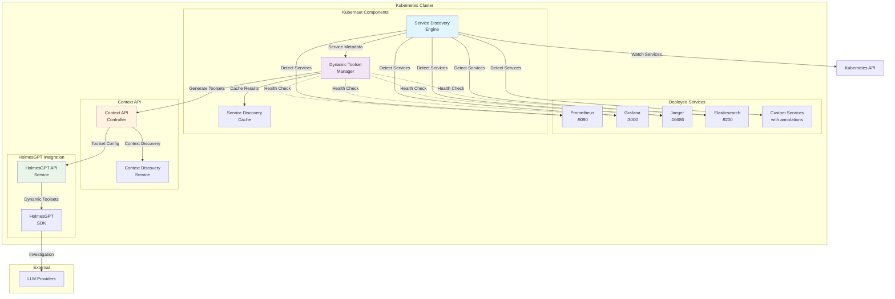
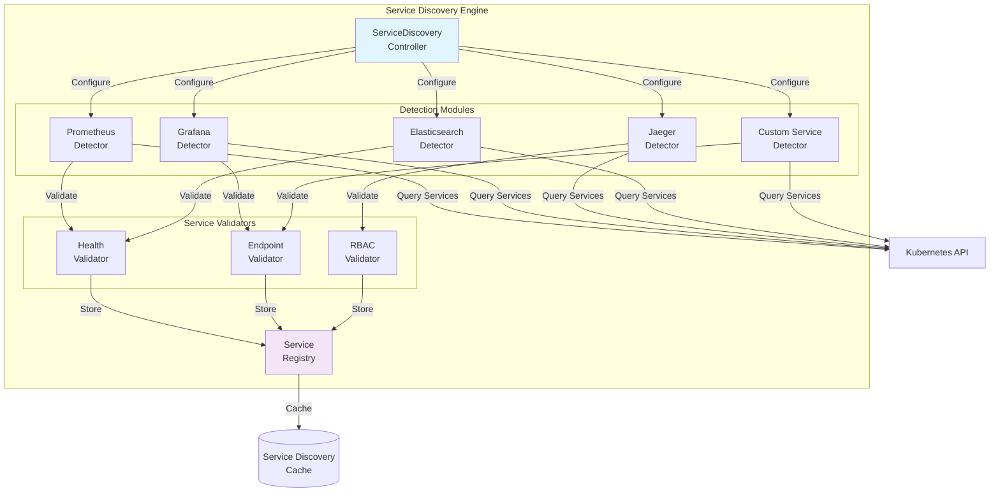
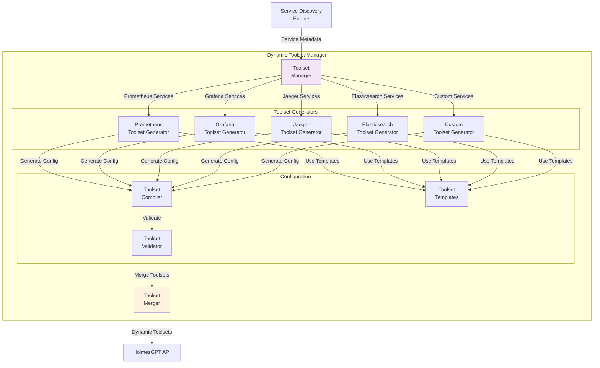
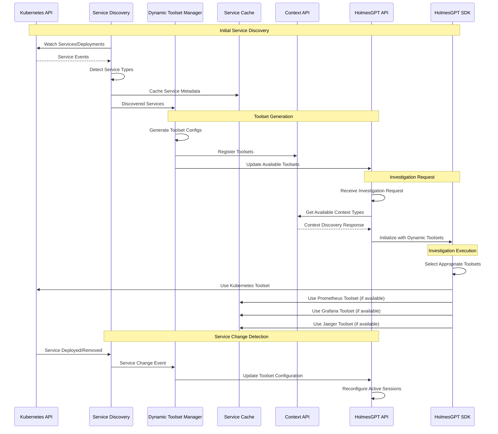
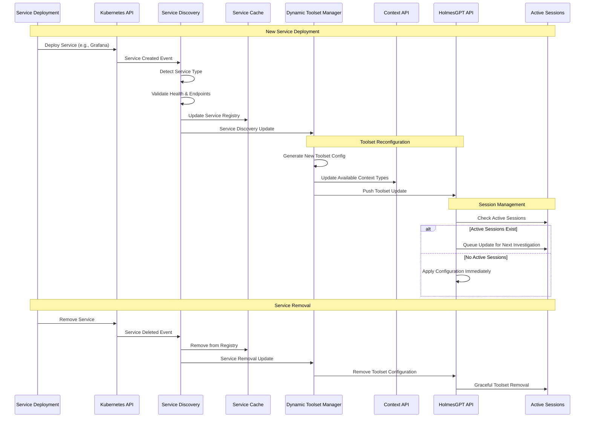

# Dynamic Toolset Configuration Architecture

**Document Version**: 1.0
**Date**: January 2025
**Status**: Architecture Design Specification
**Module**: Dynamic Toolset Configuration (`pkg/ai/holmesgpt/`, `pkg/platform/k8s/`, `pkg/api/context/`)

---

## 1. Overview

The Dynamic Toolset Configuration architecture enables automatic discovery and configuration of HolmesGPT toolsets based on services deployed in the Kubernetes cluster. This eliminates manual toolset configuration and ensures HolmesGPT investigations leverage all available observability and monitoring tools.

## 2. High-Level Architecture



## 3. Component Architecture

### 3.1 Service Discovery Engine



### 3.2 Dynamic Toolset Manager



### 3.3 HolmesGPT Integration Flow



## 4. Service Detection Patterns

### 4.1 Well-Known Service Detection

```mermaid
graph TB
    subgraph "Prometheus Detection"
        P1[Label Selector:<br/>app.kubernetes.io/name=prometheus]
        P2[Label Selector:<br/>app=prometheus]
        P3[Service Name:<br/>prometheus*]
        P4[Port Detection:<br/>9090]
        P5[Health Check:<br/>/api/v1/status/buildinfo]
    end

    subgraph "Grafana Detection"
        G1[Label Selector:<br/>app.kubernetes.io/name=grafana]
        G2[Service Name:<br/>grafana*]
        G3[Port Detection:<br/>3000]
        G4[Health Check:<br/>/api/health]
    end

    subgraph "Jaeger Detection"
        J1[Label Selector:<br/>app.kubernetes.io/name=jaeger]
        J2[Service Name:<br/>jaeger-query*]
        J3[Port Detection:<br/>16686]
        J4[Health Check:<br/>/api/services]
    end

    subgraph "Custom Service Detection"
        C1[Annotation:<br/>kubernaut.io/toolset=custom]
        C2[Annotation:<br/>kubernaut.io/endpoints]
        C3[Annotation:<br/>kubernaut.io/capabilities]
        C4[Custom Health Check]
    end

    SD[Service Discovery<br/>Engine]

    P1 --> SD
    P2 --> SD
    P3 --> SD
    P4 --> SD
    P5 --> SD

    G1 --> SD
    G2 --> SD
    G3 --> SD
    G4 --> SD

    J1 --> SD
    J2 --> SD
    J3 --> SD
    J4 --> SD

    C1 --> SD
    C2 --> SD
    C3 --> SD
    C4 --> SD
```



### 4.2 Toolset Template System

```mermaid
graph TB
    subgraph "Toolset Template Engine"
        subgraph "Base Templates"
            KT[kubernetes.yaml<br/>Base K8s Toolset]
            PT[prometheus.yaml<br/>Metrics Toolset]
            GT[grafana.yaml<br/>Dashboard Toolset]
            JT[jaeger.yaml<br/>Tracing Toolset]
            ET[elasticsearch.yaml<br/>Search Toolset]
        end

        subgraph "Template Variables"
            SN[${SERVICE_NAME}]
            NS[${NAMESPACE}]
            EP[${ENDPOINTS}]
            CAP[${CAPABILITIES}]
            HC[${HEALTH_CHECK}]
        end

        subgraph "Generated Toolsets"
            GK[Kubernetes Toolset<br/>(Always Available)]
            GP[Prometheus Toolset<br/>(If Detected)]
            GG[Grafana Toolset<br/>(If Detected)]
            GJ[Jaeger Toolset<br/>(If Detected)]
            GE[Elasticsearch Toolset<br/>(If Detected)]
        end
    end

    SD[Service Discovery<br/>Results]
    DTM[Dynamic Toolset<br/>Manager]

    %% Input Flow
    SD -->|Service Metadata| DTM

    %% Template Selection
    DTM -->|Always| KT
    DTM -->|If Prometheus| PT
    DTM -->|If Grafana| GT
    DTM -->|If Jaeger| JT
    DTM -->|If Elasticsearch| ET

    %% Variable Substitution
    KT -->|Substitute| SN
    PT -->|Substitute| NS
    GT -->|Substitute| EP
    JT -->|Substitute| CAP
    ET -->|Substitute| HC

    %% Generation
    SN -->|Generate| GK
    NS -->|Generate| GP
    EP -->|Generate| GG
    CAP -->|Generate| GJ
    HC -->|Generate| GE

    style DTM fill:#f3e5f5
    style GK fill:#e8f5e8
    style GP fill:#fff3e0
    style GG fill:#f3e5f5
    style GJ fill:#e1f5fe
    style GE fill:#fff8e1
```

## 5. Data Flow Architecture

### 5.1 Service Discovery Data Flow

```mermaid
graph LR
    subgraph "Discovery Phase"
        K8S[Kubernetes<br/>API Events]
        SD[Service<br/>Discovery]
        FILTER[Service<br/>Filtering]
        VALIDATE[Service<br/>Validation]
    end

    subgraph "Processing Phase"
        CACHE[(Discovery<br/>Cache)]
        DTM[Dynamic Toolset<br/>Manager]
        TEMPLATE[Template<br/>Engine]
        MERGE[Toolset<br/>Merger]
    end

    subgraph "Integration Phase"
        CAPI[Context<br/>API]
        HAPI[HolmesGPT<br/>API]
        CONFIG[Toolset<br/>Configuration]
    end

    subgraph "Investigation Phase"
        HGPT[HolmesGPT<br/>SDK]
        TOOLS[Dynamic<br/>Toolsets]
        RESULT[Investigation<br/>Results]
    end

    %% Discovery Flow
    K8S -->|Service Events| SD
    SD -->|Filter by Type| FILTER
    FILTER -->|Health Check| VALIDATE
    VALIDATE -->|Store| CACHE

    %% Processing Flow
    CACHE -->|Service Data| DTM
    DTM -->|Generate| TEMPLATE
    TEMPLATE -->|Combine| MERGE

    %% Integration Flow
    MERGE -->|Register| CAPI
    MERGE -->|Configure| HAPI
    HAPI -->|Update| CONFIG

    %% Investigation Flow
    CONFIG -->|Initialize| HGPT
    HGPT -->|Execute| TOOLS
    TOOLS -->|Produce| RESULT

    style SD fill:#e1f5fe
    style DTM fill:#f3e5f5
    style HAPI fill:#e8f5e8
    style HGPT fill:#fff3e0
```



### 5.2 Configuration Update Flow



## 6. Implementation Components

### 6.1 Service Discovery Engine (`pkg/platform/k8s/service_discovery.go`)

```go
type ServiceDiscovery struct {
    client          *UnifiedClient
    cache          *ServiceCache
    detectors      map[string]ServiceDetector
    validators     []ServiceValidator
    eventChannel   chan ServiceEvent
    logger         *logrus.Logger
}

type DetectedService struct {
    Name         string                 `json:"name"`
    Namespace    string                 `json:"namespace"`
    ServiceType  string                 `json:"service_type"`
    Endpoints    []ServiceEndpoint      `json:"endpoints"`
    Labels       map[string]string      `json:"labels"`
    Annotations  map[string]string      `json:"annotations"`
    Available    bool                   `json:"available"`
    HealthStatus ServiceHealthStatus    `json:"health_status"`
    LastChecked  time.Time             `json:"last_checked"`
}
```

### 6.2 Dynamic Toolset Manager (`pkg/ai/holmesgpt/dynamic_toolset_manager.go`)

```go
type DynamicToolsetManager struct {
    serviceDiscovery *ServiceDiscovery
    templateEngine   *ToolsetTemplateEngine
    configCache      *ToolsetConfigCache
    generators       map[string]ToolsetGenerator
    logger           *logrus.Logger
}

type ToolsetConfig struct {
    Name          string                 `json:"name"`
    ServiceType   string                 `json:"service_type"`
    Description   string                 `json:"description"`
    Version       string                 `json:"version"`
    Endpoints     map[string]string      `json:"endpoints"`
    Capabilities  []string              `json:"capabilities"`
    Tools         []HolmesGPTTool       `json:"tools"`
    HealthCheck   HealthCheckConfig     `json:"health_check"`
    Priority      int                   `json:"priority"`
    Enabled       bool                  `json:"enabled"`
}
```

### 6.3 HolmesGPT Integration (`docker/holmesgpt-api/src/services/dynamic_toolset_service.py`)

```python
class DynamicToolsetService:
    """Dynamic toolset configuration based on cluster services"""

    def __init__(self, k8s_client, context_api_client):
        self.k8s_client = k8s_client
        self.context_api = context_api_client
        self.toolset_cache = {}
        self.last_discovery = None

    async def discover_and_configure_toolsets(self) -> List[Toolset]:
        """Discover services and generate dynamic toolset configuration"""

    async def handle_service_change_event(self, event: ServiceChangeEvent):
        """Handle real-time service changes"""

    async def validate_toolset_availability(self, toolset: Toolset) -> bool:
        """Validate toolset service availability"""
```

## 7. Configuration Examples

### 7.1 Service Detection Configuration

```yaml
# config/dynamic-toolset-discovery.yaml
service_discovery:
  enabled: true
  discovery_interval: "5m"
  cache_ttl: "10m"

  # Well-known service patterns
  prometheus:
    enabled: true
    selectors:
      - app.kubernetes.io/name: prometheus
      - app: prometheus
    service_names: ["prometheus", "prometheus-server"]
    required_ports: [9090]
    health_check:
      endpoint: "/api/v1/status/buildinfo"
      timeout: "2s"

  grafana:
    enabled: true
    selectors:
      - app.kubernetes.io/name: grafana
    service_names: ["grafana"]
    required_ports: [3000]
    health_check:
      endpoint: "/api/health"
      timeout: "2s"

  jaeger:
    enabled: true
    selectors:
      - app.kubernetes.io/name: jaeger
    service_names: ["jaeger-query"]
    required_ports: [16686]
    health_check:
      endpoint: "/api/services"
      timeout: "2s"

  # Custom service detection
  custom:
    enabled: true
    annotation_key: "kubernaut.io/toolset"
    endpoints_key: "kubernaut.io/endpoints"
    capabilities_key: "kubernaut.io/capabilities"
```

### 7.2 Generated Toolset Example

```yaml
# Generated toolset configuration for detected Prometheus
name: "prometheus"
service_type: "prometheus"
description: "Prometheus metrics analysis tools for monitoring.prometheus.svc.cluster.local"
version: "1.0.0"
endpoints:
  query: "http://prometheus.monitoring.svc.cluster.local:9090/api/v1/query"
  query_range: "http://prometheus.monitoring.svc.cluster.local:9090/api/v1/query_range"
  targets: "http://prometheus.monitoring.svc.cluster.local:9090/api/v1/targets"
capabilities:
  - "query_metrics"
  - "alert_rules"
  - "time_series"
  - "resource_usage_analysis"
  - "threshold_analysis"
tools:
  - name: "prometheus_query"
    description: "Execute PromQL queries against Prometheus"
    command: "curl -s '${endpoints.query}?query=${query}'"
  - name: "prometheus_range_query"
    description: "Execute range queries for time series data"
    command: "curl -s '${endpoints.query_range}?query=${query}&start=${start}&end=${end}'"
health_check:
  endpoint: "/api/v1/status/buildinfo"
  interval: "30s"
  timeout: "2s"
  retries: 3
priority: 80
enabled: true
```

## 8. Operational Characteristics

### 8.1 Performance Targets

| **Operation** | **Target** | **Measurement** |
|---------------|------------|-----------------|
| **Service Discovery** | < 5s | Initial cluster scan completion |
| **Toolset Update** | < 30s | Configuration propagation to HolmesGPT |
| **Health Check** | < 2s | Per-service endpoint validation |
| **Cache Hit Rate** | > 90% | Repeated toolset configuration queries |
| **Concurrent Operations** | 10+ | Simultaneous service discovery operations |

### 8.2 Reliability Features

| **Feature** | **Implementation** | **Benefit** |
|-------------|-------------------|-------------|
| **Service Caching** | Redis/In-memory with TTL | Reduced discovery latency |
| **Health Monitoring** | Periodic endpoint checks | Service availability validation |
| **Graceful Degradation** | Baseline toolsets maintained | Investigation continuity |
| **Configuration Versioning** | Toolset version tracking | Rollback capability |
| **Circuit Breaker** | Failed service detection bypass | System stability |

### 8.3 Monitoring & Observability

```yaml
# Metrics exposed for monitoring
metrics:
  - kubernaut_service_discovery_total{service_type, status}
  - kubernaut_toolset_configurations_active{service_type}
  - kubernaut_service_health_check_duration_seconds{service, endpoint}
  - kubernaut_toolset_update_propagation_seconds{target}
  - kubernaut_service_discovery_cache_hit_ratio
```

## 9. Security Considerations

### 9.1 RBAC Requirements

```yaml
# Required Kubernetes RBAC for service discovery
apiVersion: rbac.authorization.k8s.io/v1
kind: ClusterRole
metadata:
  name: kubernaut-service-discovery
rules:
- apiGroups: [""]
  resources: ["services", "endpoints"]
  verbs: ["get", "list", "watch"]
- apiGroups: ["apps"]
  resources: ["deployments", "statefulsets"]
  verbs: ["get", "list", "watch"]
- apiGroups: ["monitoring.coreos.com"]
  resources: ["servicemonitors"]
  verbs: ["get", "list"]
```

### 9.2 Service Access Control

- **Network Policies**: Restrict service discovery traffic
- **Service Authentication**: Validate service identity before configuration
- **Endpoint Validation**: Sanitize discovered service endpoints
- **Configuration Signing**: Sign toolset configurations for integrity

---

**Architecture Review**:
- Technical Architect: _________________ Date: _______
- Security Architect: _________________ Date: _______
- Platform Engineer: _________________ Date: _______
