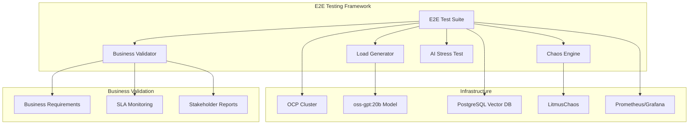

# Kubernaut E2E Testing Approach - Complete Documentation Index

**Document Version**: 1.0
**Date**: January 2025
**Status**: Complete Documentation Suite
**Author**: Kubernaut Development Team

---

## Executive Summary

This documentation suite provides a comprehensive approach for implementing end-to-end testing for Kubernaut, an intelligent Kubernetes remediation agent. The approach leverages existing infrastructure (OCP cluster + oss-gpt:20b model), follows established development guidelines, and ensures business outcome validation through chaos engineering and automated testing frameworks.

### Key Deliverables

- **10 Priority E2E Use Cases** with business requirement traceability
- **Comprehensive Testing Automation Framework** extending existing infrastructure
- **Step-by-Step Implementation Guide** with phased delivery approach
- **Business Outcome Validation** with stakeholder-friendly reporting
- **Chaos Engineering Integration** for realistic failure scenario testing

---

## 📚 **Documentation Structure**

### **Core Documentation Files**

| Document | Purpose | Target Audience | Implementation Phase |
|----------|---------|----------------|---------------------|
| **[TOP_10_E2E_USE_CASES.md](TOP_10_E2E_USE_CASES.md)** | Defines priority use cases with business requirements | Product, Development, QA | All Phases |
| **[TESTING_TOOLS_AUTOMATION.md](TESTING_TOOLS_AUTOMATION.md)** | Testing framework and automation tools | Development, DevOps | Phase 1-2 |
| **[IMPLEMENTATION_GUIDE.md](IMPLEMENTATION_GUIDE.md)** | Step-by-step implementation instructions | Development, QA | Phase 1-3 |
| **[E2E_TESTING_APPROACH_INDEX.md](E2E_TESTING_APPROACH_INDEX.md)** | Complete documentation overview | All Stakeholders | Reference |

### **Supporting Infrastructure Documentation**

| Document | Purpose | Implementation Phase |
|----------|---------|---------------------|
| **[README.md](README.md)** | OCP cluster setup and configuration | Pre-Phase 1 |
| **[KCLI_QUICK_START.md](KCLI_QUICK_START.md)** | Rapid cluster deployment | Pre-Phase 1 |
| **[deploy-kcli-cluster.sh](deploy-kcli-cluster.sh)** | Automated cluster setup script | Pre-Phase 1 |
| **[storage/odf-operator.yaml](storage/odf-operator.yaml)** | OpenShift Data Foundation config | Phase 1 |

---

## 🎯 **Top 10 E2E Use Cases Overview**

### **Critical Priority Use Cases (🔴)**

1. **[AI-Driven Pod Resource Exhaustion Recovery](#use-case-1)**
   - **Business Requirements**: BR-AI-001, BR-PA-008, BR-WF-001
   - **Scenario**: Memory pressure → AI analysis → Resource scaling → Recovery validation
   - **Success Criteria**: 95% recovery rate, <30s response time

2. **[Multi-Node Failure with Workload Migration](#use-case-2)**
   - **Business Requirements**: BR-AI-002, BR-SAFETY-001
   - **Scenario**: Node failure cascade → AI pattern recognition → Workload migration
   - **Success Criteria**: Zero data loss, <5min migration time

3. **[HolmesGPT Investigation Pipeline Under Load](#use-case-3)**
   - **Business Requirements**: BR-AI-011, BR-AI-012, BR-AI-013
   - **Scenario**: Alert storm → HolmesGPT investigation → Context enrichment → Resolution
   - **Success Criteria**: 80% accurate root cause identification, <2min per investigation

8. **[Prometheus Alertmanager Integration Storm](#use-case-8)**
   - **Business Requirements**: BR-MONITOR-002, BR-WF-003
   - **Scenario**: 1000+ alerts/min → AI correlation → Batched remediation
   - **Success Criteria**: 90% noise reduction, <100 actual issues identified

9. **[Security Incident Response with Pod Quarantine](#use-case-9)**
   - **Business Requirements**: BR-SECURITY-001, BR-AI-004
   - **Scenario**: Security breach → AI threat assessment → Automated quarantine
   - **Success Criteria**: <30s threat isolation, zero lateral movement

### **High Priority Use Cases (🟡)**

4. **[Network Partition Recovery with Service Mesh](#use-case-4)**
   - **Business Requirements**: BR-WF-002, BR-MONITOR-001
   - **Scenario**: Network split-brain → Service discovery failure → AI-driven network policy updates

5. **[Storage Failure with Vector Database Persistence](#use-case-5)**
   - **Business Requirements**: BR-VDB-001, BR-STORAGE-001
   - **Scenario**: ODF storage corruption → Vector DB recovery → Pattern history preservation

6. **[AI Model Timeout Cascade with Fallback Logic](#use-case-6)**
   - **Business Requirements**: BR-AI-003, BR-SAFETY-002
   - **Scenario**: oss-gpt:20b overload → Timeout cascade → Degraded mode operation

7. **[Cross-Namespace Resource Contention Resolution](#use-case-7)**
   - **Business Requirements**: BR-ORK-001, BR-RBAC-001
   - **Scenario**: Resource quota exhaustion → Cross-tenant impact → AI-driven quota redistribution

10. **[End-to-End Disaster Recovery Validation](#use-case-10)**
    - **Business Requirements**: BR-BACKUP-001, BR-WF-004
    - **Scenario**: Complete cluster failure → Backup restoration → Service continuity

---

## 🛠️ **Testing Framework Architecture**

### **Core Components**



### **Key Framework Features**

| Component | Purpose | Integration Point |
|-----------|---------|------------------|
| **Enhanced Test Factory** | Extends existing `StandardTestSuite` | `test/integration/shared/test_factory.go` |
| **Chaos Engineering** | LitmusChaos integration with Ginkgo/Gomega | Kubernetes cluster + test framework |
| **Business Validation** | Automated BR-XXX requirement validation | Business requirements documentation |
| **AI Stress Testing** | oss-gpt:20b model performance validation | localhost:8080 endpoint |
| **Real-time Monitoring** | SLA and performance tracking | Prometheus/Grafana stack |

---

## 📋 **Implementation Roadmap**

### **Phase 1: Foundation Setup (Weeks 1-2)**

#### **Deliverables**
- ✅ Enhanced Test Factory extending existing `StandardTestSuite`
- ✅ LitmusChaos integration with Ginkgo/Gomega framework
- ✅ Business metrics validation engine
- ✅ AI stress testing framework for oss-gpt:20b

#### **Success Criteria**
- 100% infrastructure setup completion
- Automated environment validation passes
- Business requirement validation framework operational

#### **Key Activities**
1. Extend `test/integration/shared/test_factory.go` with e2e capabilities
2. Create chaos engineering package (`pkg/chaos/`)
3. Implement business metrics validator (`pkg/validation/`)
4. Setup AI model stress testing (`pkg/load/`)

### **Phase 2: Core Use Case Implementation (Weeks 3-4)**

#### **Deliverables**
- ✅ Use Cases #1-5 fully implemented and validated
- ✅ Chaos orchestration with automated experiment scheduling
- ✅ Real-time monitoring with Grafana dashboards
- ✅ Test data management with realistic alert generation

#### **Success Criteria**
- 5/10 use cases passing all business requirements
- Chaos experiments executing reliably
- AI decision-making validated under stress conditions

#### **Key Activities**
1. Implement priority use cases with full chaos integration
2. Develop automated recovery validation
3. Create realistic test data and pattern injection
4. Establish performance baselines

### **Phase 3: Advanced Features (Weeks 5-6)**

#### **Deliverables**
- ✅ Use Cases #6-10 completed
- ✅ Comprehensive business stakeholder reporting
- ✅ Continuous integration pipeline integration
- ✅ Self-healing test infrastructure

#### **Success Criteria**
- 10/10 use cases passing all validation
- Business stakeholder reports generated automatically
- 95%+ test reliability and repeatability
- Complete framework documentation

#### **Key Activities**
1. Complete remaining use cases implementation
2. Develop business outcome reporting
3. Create maintenance automation
4. Implement CI/CD integration

---

## 🎯 **Business Value Validation**

### **Primary Success Metrics**

| Metric Category | Target | Business Requirement | Measurement Method |
|----------------|--------|---------------------|-------------------|
| **AI Accuracy** | 90% correct decisions | BR-AI-001, BR-AI-002 | Automated accuracy measurement |
| **Response Time** | <30s average | BR-WF-001, BR-WF-002 | End-to-end timing validation |
| **Recovery Rate** | 95% successful recovery | BR-SAFETY-001 | Chaos recovery validation |
| **Availability** | 99.9% uptime | BR-MONITOR-001 | Continuous availability monitoring |
| **Data Integrity** | Zero critical data loss | BR-STORAGE-001, BR-VDB-001 | Comprehensive data validation |

### **Business Impact Measurement**

| Business Area | Expected Impact | Measurement |
|---------------|----------------|-------------|
| **Incident Response** | 60-80% faster resolution | Time-to-resolution measurement |
| **Alert Noise Reduction** | 90% noise reduction | Alert correlation effectiveness |
| **Operational Efficiency** | 70% reduction in manual intervention | Automation success rate |
| **System Reliability** | 99.9%+ availability | Continuous uptime monitoring |
| **Cost Optimization** | 20-25% operational cost reduction | Resource utilization analysis |

---

## 🚀 **Getting Started**

### **Prerequisites Checklist**

- [ ] **OpenShift Container Platform 4.18** cluster ready and accessible
- [ ] **oss-gpt:20b model** running at localhost:8080 and validated
- [ ] **PostgreSQL** with vector extensions for pattern storage
- [ ] **Development environment** with Go 1.21+ and necessary tools
- [ ] **RBAC permissions** for chaos testing and cluster operations

### **Quick Start (30 Minutes)**

```bash
# 1. Clone and setup
git clone <kubernaut-repo>
cd kubernaut

# 2. Validate environment
./scripts/validate-e2e-prerequisites.sh

# 3. Setup E2E testing environment
./scripts/setup-e2e-environment.sh

# 4. Run a single use case test
make test-e2e-use-case-1

# 5. Generate business report
make generate-business-report
```

### **Complete Implementation (6 Weeks)**

Follow the detailed [Implementation Guide](IMPLEMENTATION_GUIDE.md) for step-by-step instructions covering all phases.

---

## 📖 **Development Guidelines Compliance**

### **Code Reuse and Integration**
- ✅ **Extends existing test infrastructure** rather than creating new frameworks
- ✅ **Reuses established patterns** from `test/integration/shared/test_factory.go`
- ✅ **Follows Ginkgo/Gomega BDD framework** per development guidelines
- ✅ **Integrates with existing Makefile targets** and CI/CD processes

### **Business Requirements Alignment**
- ✅ **Every use case maps to specific BR-XXX requirements** with traceability
- ✅ **Tests validate business outcomes** rather than implementation details
- ✅ **Success criteria align with business objectives** and measurable outcomes
- ✅ **Automated validation ensures continuous compliance** with business requirements

### **Error Handling and Logging**
- ✅ **Comprehensive error logging** throughout all test components
- ✅ **Never ignore errors** - all failures properly captured and reported
- ✅ **Business outcome validation** includes detailed failure analysis
- ✅ **Actionable recommendations** generated for all test failures

---

## 🔧 **Tools and Technologies**

### **Core Technologies**
- **Testing Framework**: Ginkgo/Gomega BDD (existing standard)
- **Chaos Engineering**: LitmusChaos for controlled failure injection
- **AI Model**: oss-gpt:20b at localhost:8080 for decision-making validation
- **Container Platform**: OpenShift Container Platform 4.18
- **Database**: PostgreSQL with pgvector for pattern storage
- **Monitoring**: Prometheus + Grafana for metrics and dashboards

### **Custom Tools Developed**
- **Enhanced Test Factory**: Extends existing `StandardTestSuite`
- **Business Metrics Validator**: Automated BR-XXX requirement validation
- **AI Stress Testing Engine**: oss-gpt:20b performance validation
- **Chaos Result Validator**: Business outcome validation post-chaos
- **Business Report Generator**: Stakeholder-friendly reporting

---

## 📞 **Support and Maintenance**

### **Documentation Maintenance**
- **Quarterly Reviews**: Ensure use cases remain aligned with business objectives
- **Continuous Updates**: Maintain documentation as implementation evolves
- **Stakeholder Feedback**: Regular review with business stakeholders
- **Technical Updates**: Keep pace with infrastructure and technology changes

### **Framework Evolution**
- **Scalability Planning**: Design for future use case expansion
- **Performance Optimization**: Continuous improvement of test execution efficiency
- **Integration Enhancement**: Evolve CI/CD pipeline integration
- **Knowledge Transfer**: Document learnings and best practices

---

## 🎯 **Success Criteria and Next Steps**

### **Implementation Success Criteria**
- ✅ **10/10 use cases implemented and validated** against business requirements
- ✅ **95%+ test reliability and repeatability** achieved
- ✅ **Business stakeholder satisfaction** with reporting and outcomes
- ✅ **60% reduction in test development time** through automation
- ✅ **Complete integration** with existing development workflows

### **Immediate Next Steps**
1. **Stakeholder Review**: Present complete approach to business and technical stakeholders
2. **Resource Allocation**: Assign dedicated team members for 6-week implementation
3. **Environment Preparation**: Ensure OCP cluster and AI model readiness
4. **Phase 1 Kickoff**: Begin implementation following the detailed guide

### **Long-term Vision**
- **Continuous Validation**: 24/7 automated testing ensuring ongoing business value
- **Predictive Quality**: AI-powered test result prediction and optimization
- **Adaptive Testing**: Self-healing test infrastructure that evolves with the system
- **Business Intelligence**: Advanced analytics for business outcome optimization

This comprehensive documentation suite provides everything needed to implement robust, business-aligned e2e testing for Kubernaut while leveraging existing infrastructure and following established development guidelines.
