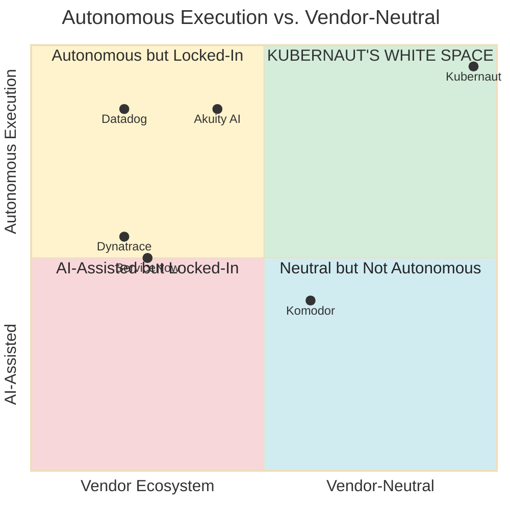

# Kubernaut

**Kubernetes AIOps Platform for Remediation**

*Kubernetes-native • Open Source • V1 Estimated Q4 2025*

::: notes
**Time: 30 seconds**

Opening: "Kubernaut is the first open source, Kubernetes-native AIOps platform purpose-built for remediation."

One sentence each:
- "Kubernetes-native: Built using CRDs, not external agents"
- "Open Source: Apache 2.0, transparent and community-driven"
- "Production-ready: Built on Tekton Pipelines (CNCF graduated)"

Transition: "Let me show you the market opportunity..."
:::

---

# The 2025 Market Reality

**3 autonomous execution platforms exist:**

| **Platform** | **Execution Model** | **Critical Limitation** |
|--------------|---------------------|-------------------------|
| **Datadog** | ✅ Autonomous (curated catalog) | Datadog ecosystem lock-in ($50K-$200K/yr) |
| **Akuity AI** | ✅ Autonomous (GitOps sync) | GitOps-bound (runtime ops gaps) |
| **→ Kubernaut** | ✅ Autonomous (AI-generated) | **ONLY open source, vendor-neutral** |

**AI-assisted platforms (Dynatrace, ServiceNow, Komodor)** = Recommendations/PRs, require human approval

**Market:** $12.7B AIOps → $87.6B by 2035, 65% controlled by top 5 vendors [5]

::: notes
**Time: 2 minutes**

Lead with market research findings (30 seconds):
"Act 2 has detailed market research. Bottom line: 3 autonomous EXECUTION platforms exist in 2025. Dynatrace is AI-assisted (recommendations), not autonomous (execution). Clear white space opportunity."

Walk through autonomous platforms (60 seconds, 20 sec each):

1. **Datadog**: "$2B+ ARR. Bits AI launched Q1 2025 (PREVIEW). Autonomous execution BUT curated catalog only: CrashLoopBackOff, OOMKilled. Lock-in: Requires Datadog ecosystem. $50K-$200K/year."

2. **Akuity AI**: "$20M funded. GitOps-native, autonomous sync to Git state. Handles app drift. BUT: Runtime ops gaps - can't fix memory leaks, resource exhaustion. Requires Argo CD ecosystem."

3. **Kubernaut**: "ONLY open source, vendor-neutral autonomous option. Apache 2.0. Works with Prometheus (40-50% of K8s). HolmesGPT AI-generated fixes for novel incidents, not curated catalog."

AI-assisted tools clarification (30 seconds):
"Dynatrace Davis AI: AI-powered diagnosis and recommendations. Creates pull requests and runbooks. Requires human approval to execute. 'Here's what to do' not 'I did it for you'."
"ServiceNow, Turbonomic, Komodor: ITSM, cost optimization, configuration management. Different use cases from autonomous K8s incident remediation."

Market consolidation (10 seconds):
"65% of $12.7B AIOps market controlled by top 5 vendors. This validates the market but shows consolidation risk." [5]

Transition: "So why hasn't autonomous remediation solved the problem yet?"
:::

---

# Five Critical Gaps (Act 2 Research)

**Why manual ops still dominates despite automation:**

| **Gap** | **Impact** | **Who Has This Gap** |
|---------|------------|----------------------|
| **#1: Vendor Lock-In** | Replace $50K-$200K monitoring stack | Datadog, Dynatrace |
| **#2: Limited Scope** | Curated fixes, can't handle novel incidents | Datadog (catalog), Dynatrace (templates) |
| **#3: GitOps-Bound** | Fixes app drift, NOT runtime ops | Akuity AI |
| **#4: Multi-Tool Sprawl** | Need 3-5 tools ($150K-$470K/year) | All platforms (fragmented) |
| **#5: Commercial Only** | No open source, transparency, or flexibility | All 3 competitors |

**Result:** 45-60 min MTTR, $300K-$540K per hour persists [2]

::: notes
**Time: 2 minutes**

Frame: "Act 2 identifies 5 critical gaps that keep manual ops dominant." (15 seconds)

Walk through gaps efficiently (90 seconds, 18 sec each):

**Gap #1 - Vendor Lock-In:**
"Datadog/Dynatrace solve the problem BUT require ecosystem replacement. If you have Prometheus/Grafana ($0 open source), adopting Datadog means $50K-$200K/year PLUS migration cost. That's a non-starter for many."

**Gap #2 - Limited Scope:**
"Curated catalogs and templates work for KNOWN issues. Datadog's Bits AI: CrashLoopBackOff, OOMKilled - great. But novel incidents? Complex cascading failures? Memory leak + resource contention? Back to manual."

**Gap #3 - GitOps-Bound:**
"Akuity brilliantly fixes Git drift. Pod crashes? Sync back to Git state. BUT: Runtime operational issues aren't Git problems. Memory leak requires ANALYSIS and fix generation, not Git sync."

**Gap #4 - Multi-Tool Sprawl:**
"Act 2 shows customers need 3-5 tools to get complete coverage: Turbonomic (cost), CAST AI (security), incident management, remediation. Total: $150K-$470K/year. Fragmented, expensive."

**Gap #5 - Commercial Only:**
"All 3 competitors (Datadog, Dynatrace, Akuity) are commercial. No open source option exists. That means: No code transparency, no self-hosting for data sovereignty, no community contributions, vendor lock-in risk."

Bottom line (15 seconds):
"Despite $12.7B AIOps market and 4 autonomous platforms, manual ops dominates. MTTR: 45-60 minutes. Downtime: $300K-$540K per hour. The gaps are real."

Transition: "What changed to make these gaps solvable?"
:::

---

# Why Now? The LLM Breakthrough

**Three convergent factors:**

**1. LLM Reasoning (2023+)**
- Context understanding, not pattern matching
- HolmesGPT: Open source K8s investigation framework
- Multi-LLM support (OpenAI, Anthropic, local models)

**2. Kubernetes Maturity**
- 96% enterprise adoption [1]
- CRD-based extensibility proven at scale
- Tekton Pipelines (CNCF graduated project)

**3. Open Source AIOps Gap**
- Observability is open source (Prometheus, Grafana)
- Remediation has been proprietary black boxes
- **→ Kubernaut: First open source remediation platform**

::: notes
**Time: 2 minutes**

Factor 1 - LLM Breakthrough (45 seconds):
"Pre-2023: Rule-based automation. Brittle."
"Post-GPT-4: LLMs can REASON about problems, not just match patterns."
"HolmesGPT: Open source investigation framework for Kubernetes."
"The key: AI can understand CONTEXT and adapt to novel scenarios."

Factor 2 - Kubernetes Maturity (30 seconds):
"Kubernetes is 10 years old. 96% enterprise adoption."
"CRDs are THE way to extend Kubernetes."
"Tekton Pipelines: CNCF graduated, enterprise-trusted execution."

Factor 3 - Open Source Gap (30 seconds):
"Observability stack is open: Prometheus, Grafana."
"But remediation? All proprietary: Datadog, Moogsoft."
"Kubernaut: Apache 2.0. Transparent. Community-driven."
"Like Terraform for provisioning, Kubernaut for remediation."

Timing argument (15 seconds):
"18 months into LLM era - early enough to lead, proven enough to trust."

Transition: "What does this mean for the market?"
:::

---

# Kubernaut's White Space (Act 2)

**Key:** Kubernaut = ONLY platform in top-right (autonomous + vendor-neutral)
**Market:** Prometheus users (40-50% of K8s), $400M TAM estimate

::: notes
**Time: 1.5 minutes**

Walk through the quadrant chart visually (75 seconds):

**Point to top-right (Quadrant 1 - Kubernaut):**
"This is Kubernaut's white space. Top-right: Fully autonomous AND vendor-neutral."
"We're the ONLY platform in this quadrant." (10 seconds)

**Point to top-left (Quadrant 2 - Datadog, Akuity, ServiceNow):**
"Datadog, Akuity - they're autonomous BUT vendor-locked."
"Autonomous: Yes. Vendor-neutral: No."
"Datadog requires Datadog ecosystem ($50K-$200K)."
"Akuity requires Argo CD ecosystem." (20 seconds)

**Point to bottom-right (Quadrant 4 - Komodor):**
"Komodor - vendor-neutral BUT assistive, not autonomous."
"Requires human approval for every action."
"Neutral: Yes. Autonomous: No." (15 seconds)

**Point to middle-left (Quadrant 3 - Dynatrace, ServiceNow):**
"Dynatrace Davis AI - AI-powered diagnosis and recommendations."
"BUT: Creates pull requests and runbooks, requires human approval to execute."
"AI-assisted 'here's what to do', NOT autonomous 'I did it for you'."
"Vendor-locked to Dynatrace platform ($60K-$250K)." (20 seconds)

**Back to top-right (Kubernaut):**
"This white space exists because:"
"- Datadog/Akuity CAN'T be vendor-neutral (business model requires ecosystem)"
"- Dynatrace/Komodor are AI-assisted, NOT autonomous execution"
"- We're the ONLY platform with autonomous execution AND vendor-neutral." (15 seconds)

Market opportunity (15 seconds):
"Prometheus users (40-50% of K8s deployments) have NO vendor-neutral autonomous option."
"Act 2 estimates: $400M TAM."

Transition: "Act 3 shows how we deliver this, Act 4 shows the business model."
:::

---

# References

**Market Data:**
1. CNCF Survey 2023 - cncf.io/reports/cncf-annual-survey-2023
2. Gartner / Atlassian - atlassian.com/incident-management/kpis/cost-per-incident
3. Google SRE Book - sre.google/sre-book/eliminating-toil
4. Datadog State of Monitoring - datadoghq.com/state-of-monitoring
5. MarketGenics AIOps Report 2025-2035 - openpr.com/news/4203387

**Technology:**
- Tekton Pipelines - tekton.dev (CNCF Graduated)
- HolmesGPT - github.com/robusta-dev/holmesgpt
- Kubernaut - github.com/jordigilh/kubernaut

::: notes
**Time: 0 seconds (reference only, not presented)**

Keep this slide available for Q&A.

If someone asks "where did you get that number?", you have the sources ready.

All public sources - no paywalled research needed for validation.
:::

