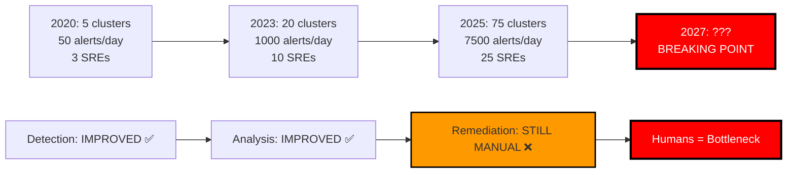
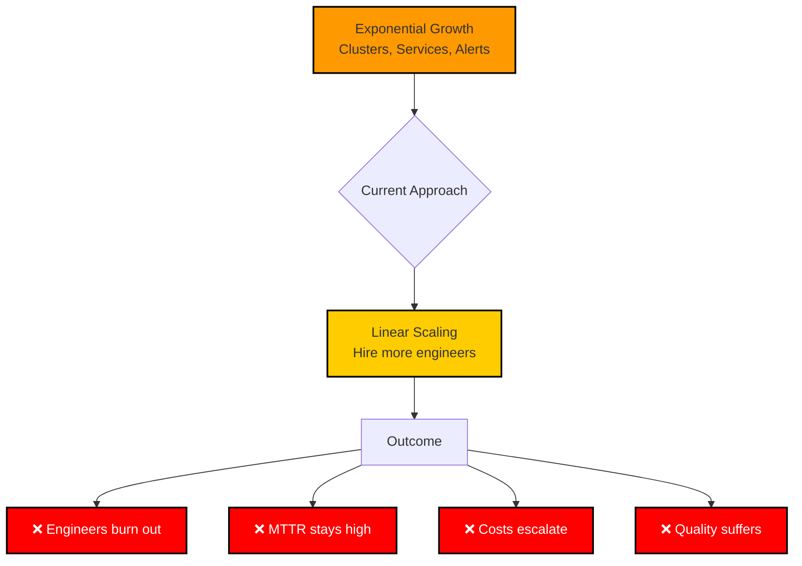

# Slide 2: The Scaling Wall

**Act**: 1 - Customer Pain
**Theme**: "Manual Operations Don't Scale"

---

## 🎯 Slide Goal

**Demonstrate the exponential growth problem** - Detection improved, but remediation is still manual.

---

## 📖 Content

### Title
**"The Kubernetes Operations Scaling Wall"**

### Subtitle
*"Why hiring more engineers isn't the answer"*

---

## 📊 The Scaling Wall Data

| **Metric** | **2020** | **2023** | **2025** | **Trend** |
|---|---|---|---|---|
| **Clusters per Org** | 3-5 | 15-25 | **50-100+** | 📈 20x growth |
| **Alerts per Day** | 50-100 | 500-1,000 | **5,000-10,000** | 📈 100x growth |
| **Mean Time to Detect** | 10 min | 5 min | **30 seconds** | ✅ Improved (AI/observability) |
| **Mean Time to Resolve** | **60 min** | **60 min** | **Still 60 min** | ⚠️ **NO IMPROVEMENT** |
| **SRE Team Size** | 2-3 | 8-12 | **20-30** | 📈 Linear scaling (unsustainable) |

### Sources
- Cluster growth: [CNCF Annual Survey 2024](https://www.cncf.io/reports/cncf-annual-survey-2024/) 🆓
- MTTR: Industry observability platforms 🆓

---

## 📉 The Problem Visualized

---

## 🔍 The Gap Analysis

### ✅ What Improved (2020 → 2025)
- **Detection**: AI-powered anomaly detection (Datadog, Dynatrace)
- **Analysis**: AI root cause analysis (K8sGPT, Davis AI)
- **Visibility**: Better observability platforms

### ❌ What Didn't Improve
- **Remediation**: Still requires human intervention
- **MTTR**: Stuck at 60 minutes for 5+ years
- **Scalability**: Linear hiring can't keep up with exponential growth

---

## 💡 What Customers Try Today

| **Approach** | **Reality** | **Result** |
|---|---|---|
| **📚 Runbooks** | Outdated, incomplete, not followed at 3 AM | ❌ Doesn't scale |
| **📊 More Observability** | Tells you WHAT broke, not HOW to fix it | ❌ Still manual |
| **👥 Hire More Engineers** | Expensive, burnout risk, can't hire fast enough | ❌ Unsustainable |
| **🤖 Rule-Based Automation** | Brittle scripts, breaks on novel incidents | ❌ Not adaptive |

---

## 🎯 The Core Problem

---

## 💬 Key Insight

> **"Customers need autonomous, intelligent remediation that adapts to novel incidents, not just predefined playbooks."**

---

## 🎯 Key Takeaway

> **"Detection and analysis improved thanks to AI. Remediation is still manual. That's the bottleneck. That's the opportunity."**

---

## ➡️ Transition to Next Slide

*"The good news? Customers know they need this. The market is ready. Let's look at the signals..."*

→ **Slide 3: Market Readiness**

