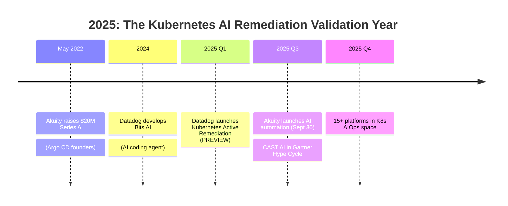
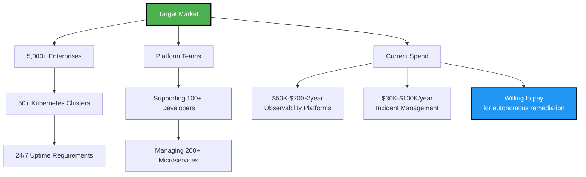
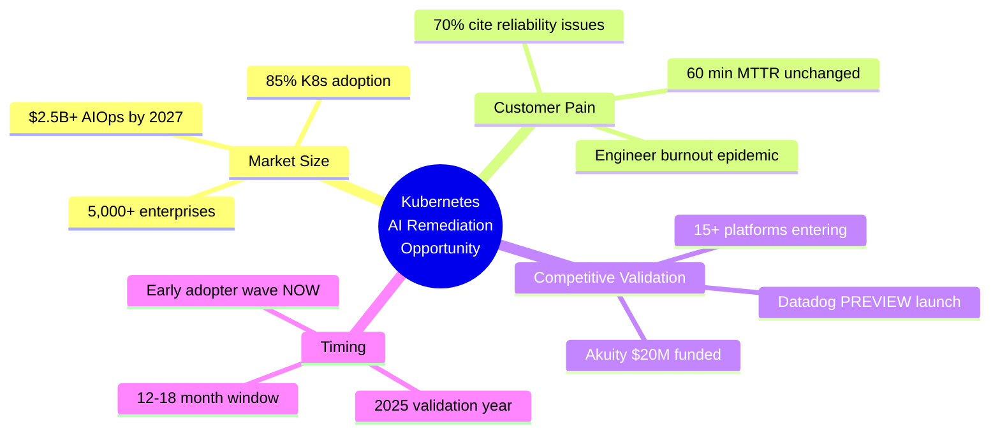

# Slide 3: Market Readiness

**Act**: 1 - Customer Pain
**Theme**: "The Market Is Ready - Customers Are Asking for This Today"

---

## 🎯 Slide Goal

**Prove market validation** through industry data + competitive activity (customers are desperate and willing to pay).

---

## 📖 Content

### Title
**"The Market Is Ready: Customers Are Asking for This Today"**

### Subtitle
*"Industry data + competitive validation = proven demand"*

---

## 📊 Industry Data (Market Signals)

### Signal 1: Customer Pain is Widespread
- **70%+ of organizations** cite scalability/reliability as top K8s pain points
- **Source**: theCUBE Research (2025), cited in [SiliconANGLE - Akuity article](https://siliconangle.com/2025/09/30/akuitys-newest-ai-automations-quickly-identify-triage-remediate-kubernetes-application-incidents/) 🆓

### Signal 2: Kubernetes Adoption is Massive
- **85% of enterprises** using Kubernetes in production
- **Source**: [CNCF Annual Survey 2024](https://www.cncf.io/reports/cncf-annual-survey-2024/) 🆓

### Signal 3: AIOps Market is Growing
- **$2.5B+ AIOps market** projected by 2027
- **Source**: Gartner Market Guide for AIOps Platforms 💰 PAYWALLED

---

## 🚀 Competitive Validation (2025)

### Why Competitive Activity PROVES Demand

> **"When multiple well-funded companies enter a space simultaneously, it's not crowded - it's validated."**

---

## 🏆 Competitor Activity Breakdown

| **Company** | **Activity** | **What It Proves** |
|---|---|---|
| **Akuity** | $20M Series A (May 2022) AI automation launch (Sept 30, 2025) | GitOps + AI remediation has VC backing |
| **Datadog** | Bits AI + K8s Active Remediation (PREVIEW 2025) | Observability leaders moving to remediation |
| **CAST AI** | Gartner Hype Cycle 2025 | Autonomous K8s optimization is mainstream |
| **15+ platforms** | Entering K8s AIOps space | Market is validated, not crowded |

### Sources
- Akuity: [SiliconANGLE article](https://siliconangle.com/2025/09/30/akuitys-newest-ai-automations-quickly-identify-triage-remediate-kubernetes-application-incidents/) 🆓
- Gartner Hype Cycle: Gartner 2025 💰 PAYWALLED

---

## 💬 Customer Pain Quotes (Synthesized from Research)

### Quote 1: Observability Isn't Enough
> *"We tried Datadog, Dynatrace, and PagerDuty. **Great at observability, terrible at autonomous action.** We still wake up at 3 AM."*

### Quote 2: GitOps Has Limits
> *"GitOps is great for deployments, but what about runtime operational incidents? **That's where we're bleeding.**"*

### Quote 3: Engineering Burnout
> *"We spend more time firefighting than building features. We need AI that doesn't just tell us what's wrong — **it needs to fix it.**"*

---

## 🎯 The Target Market

---

## 📈 Market Readiness Indicators

### ✅ Demand Indicators (All Present)
- ✅ **Pain is widespread** (70%+ cite K8s reliability issues)
- ✅ **Adoption is massive** (85% enterprises use K8s)
- ✅ **Willingness to pay** (already spending $80K-$300K/year on tools)
- ✅ **Competitive validation** (15+ platforms, VC-backed)
- ✅ **Technology maturity** (AI, K8s, GitOps all production-ready)

---

## 🔥 The Opportunity

---

## 🎯 Key Takeaway

> **"Customers are desperate. Competitors are emerging and validating the need. But there's a gap: No one offers open-source, vendor-neutral, autonomous operational remediation."**
>
> **"That's where Kubernaut comes in."**

---

## ➡️ Transition to Act 2

*"The market is ready. But what does the competitive landscape actually look like? Let's map it out..."*

→ **Act 2: The Market Opportunity**
→ **Slide 4: Market Segmentation**

