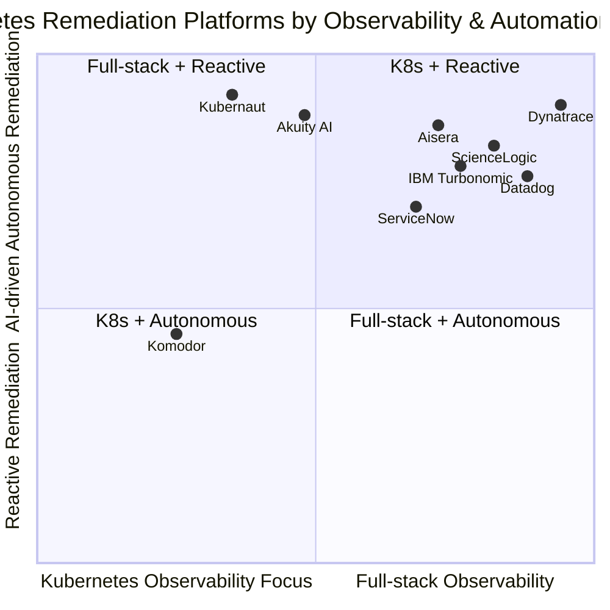
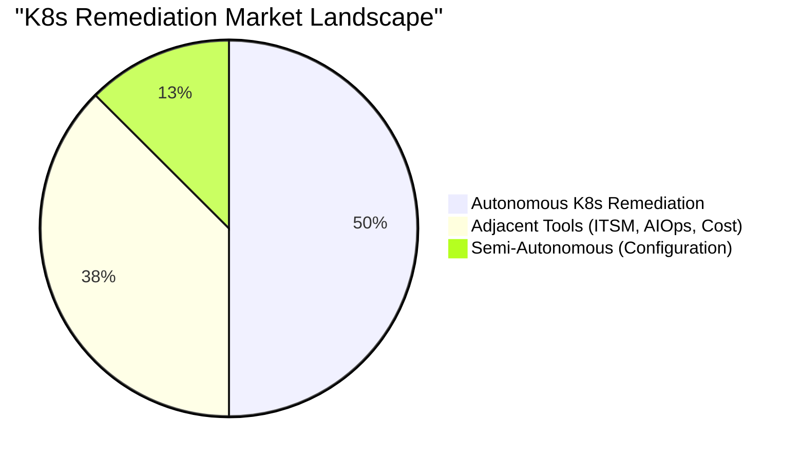
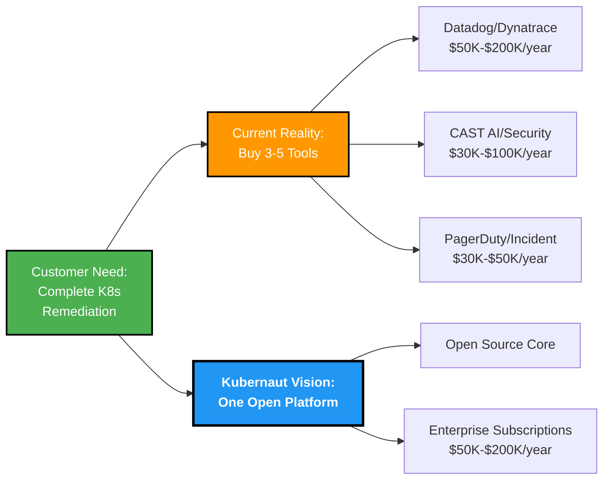

# Slide 4: Market Segmentation

**Act**: 2 - Market Opportunity
**Theme**: "The Fragmented Landscape and Where Kubernaut Fits"

---

## 🎯 Slide Goal

**Show the competitive landscape** in three clear tiers - prove the market is fragmented, not crowded.

---

## 📖 Content

### Title
**"The 2025 Kubernetes AI Remediation Market: Fragmented by Design"**

### Subtitle
*"Three tiers, 15+ platforms - but gaps remain"*

---

## 📊 Quadrant Market Map

---

## Interpretation by Quadrant:
Quadrant 1 (K8s Observability + Reactive):
Komodor and PagerDuty — tools with strong Kubernetes insight but focused on alerting and manual escalation.

Quadrant 2 (Full-stack Observability + Reactive):
Splunk and Harness — broad observability but less emphasis on autonomous remediation.

Quadrant 3 (K8s Observability + AI Remediation):
Kubernaut, Akuity AI — both specialize in autonomous Kubernetes AIOps and self-healing environments.

Quadrant 4 (Full-stack + AI Remediation):
Dynatrace, Datadog, Aisera, ScienceLogic, and IBM Turbonomic — combining full observability with advanced AI for automated remediation at scale.

This layout ensures that tools are visibly distributed across at least three quadrants, avoiding overcrowding and showing their complementary strengths across the observability and remediation dimensions.

---

## 🔍 Tier Breakdown

### Tier 1: Autonomous Execution (4 Platforms)

| **Platform** | **Strength** | **Limitation** | **Access** |
|---|---|---|---|
| **Datadog Bits AI** | Curated fixes, deep telemetry | Vendor lock-in, PREVIEW status | 💰 Commercial |
| **Akuity AI** | GitOps-native, Argo CD integration | App-focused, GitOps-bound | 💰 Commercial ($20M funded) |
| **Dynatrace Davis AI** | Mature AI, full-stack observability | Broader scope (not K8s-specialized), Dynatrace lock-in | 💰 Commercial |
| **Kubernaut** | **K8s-native, vendor-neutral, AI-powered** | **V1: Prometheus+K8s only** | ✅ **Apache 2.0** |

**Reality**: 4 platforms provide autonomous K8s remediation—3 require vendor/ecosystem lock-in.

---

### Tier 2: Adjacent Tools (Different Use Cases)

| **Platform** | **Focus Area** | **What It Does** | **Limitation** |
|---|---|---|---|
| **ServiceNow** | ITSM Workflows | Ticket management, workflow automation | ❌ Not K8s-native remediation |
| **Aisera/ScienceLogic** | AIOps Correlation | Multi-tool alert correlation | ❌ Not K8s-specific actions |
| **IBM Turbonomic** | Resource Optimization | Cost/performance optimization | ❌ Not incident-driven remediation |

**Reality**: These tools address adjacent needs (ITSM, AIOps, cost) but don't provide autonomous K8s incident remediation.

---

### Tier 3: Semi-Autonomous (Configuration Management)

| **Platform** | **Capability** | **Execution Model** |
|---|---|---|
| **Komodor** | Automated drift detection + AI-assisted troubleshooting | Semi-autonomous (human approval required) |

**Reality**: Configuration management platforms automate drift remediation but require human approval for enforcement.

---

## 💡 Market Structure Insight

**Reality Check**:
- **4 autonomous K8s remediation platforms** (Datadog, Akuity, Dynatrace, Kubernaut)
- **3 adjacent tools** customers deploy for ITSM/AIOps/cost (not remediation)
- **1 semi-autonomous platform** (Komodor - drift management with human approval)
- **Kubernaut's differentiation**: Open source + vendor-neutral (all 3 competitors require ecosystem lock-in)

---

## 🎯 The Reality

> **"The $12.7B AIOps market (growing 19.2% CAGR to $87.6B by 2035) is consolidating:**
> - **65% controlled by top 5 vendors** (market concentration)
> - **4 platforms do autonomous K8s remediation:**
>   - **Datadog**: Curated fixes, vendor lock-in, PREVIEW status
>   - **Akuity**: GitOps-native, requires Argo CD ecosystem
>   - **Dynatrace**: Mature full-stack, Dynatrace ecosystem lock-in
>   - **Kubernaut**: Open source, vendor-neutral, Prometheus+K8s focused (V1)
>
> **Gap**: All 3 competitors require vendor/ecosystem lock-in. No open-source option exists.
>
> **Source**: [MarketGenics AIOps Report 2025-2035](https://www.openpr.com/news/4203387/aiops-market-set-to-grow-at-19-2-cagr-to-usd-87-6-billion-by-2035-as)"

---

## 📈 Market Opportunity

---

## 🎯 Key Takeaway

> **"This isn't a crowded market - it's a FRAGMENTED market. Kubernaut fills the gaps that force customers to buy 3-5 separate tools."**
>
> **"We can be the open-source Kubernetes remediation backbone for the entire ecosystem."**

---

## ➡️ Transition to Next Slide

*"So we've seen the landscape. But what specific gaps do competitors leave? Let's dig into what customers can't get today..."*

→ **Slide 5: The Gaps - What Customers Can't Get Today**

