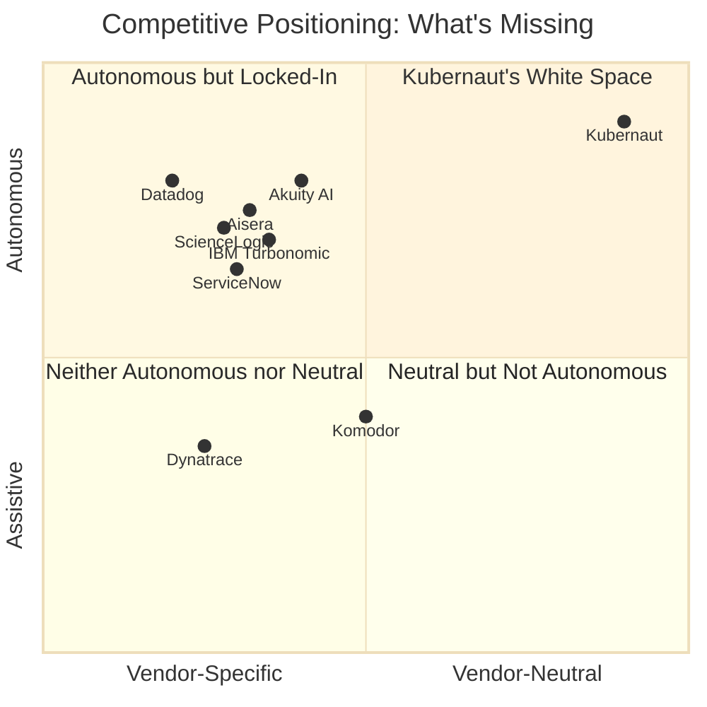
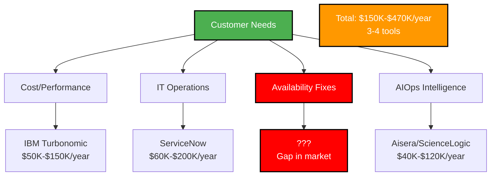
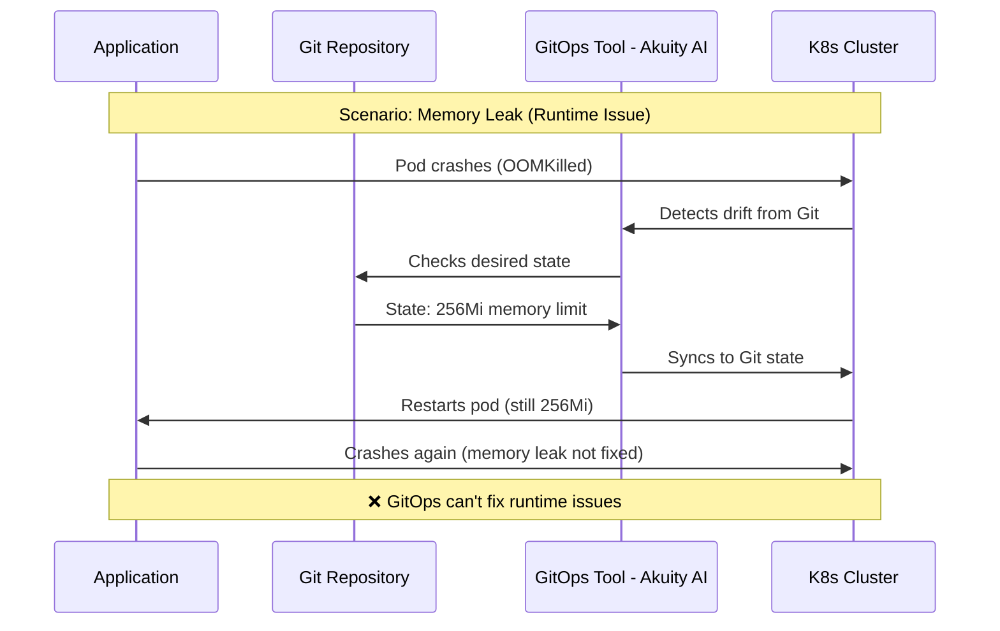

# Slide 5: The Gaps

**Act**: 2 - Market Opportunity
**Theme**: "What Customers Can't Get Today"

---

## 🎯 Slide Goal

**Identify specific gaps** in competitor offerings that Kubernaut fills.

---

## 📖 Content

### Title
**"The Market Gaps: Why Customers Need Kubernaut"**

### Subtitle
*"Five critical gaps in the current landscape"*

---

## 📊 Competitive Gap Analysis Matrix

---

## 🔍 Gap #1: Vendor Lock-In

### The Problem
**Observability platforms require full ecosystem investment**

| **Platform** | **Lock-In Mechanism** | **Annual Cost** |
|---|---|---|
| **Datadog** | Requires Datadog agents across all infrastructure | $50K-$200K/year |
| **Dynatrace** | Requires Dynatrace agents + platform license | $60K-$250K/year |
| **Akuity** | Requires Argo CD + Kargo adoption | $50K-$150K/year (est.) |

### Kubernaut Solution
✅ **Works with ANY monitoring tool**
- Prometheus AlertManager ✅
- CloudWatch Alarms ✅
- Grafana ✅
- Custom webhooks ✅
- **No agent lock-in** ✅

---

## 🔍 Gap #2: Operational Scope

### The Problem
**Specialized tools require multiple vendors**

### Kubernaut Solution
✅ **Kubernetes-native remediation platform** (integrates with your existing stack)
- **V1 Focus**: Availability (pod restarts, rollbacks, scaling)
- **V1 Focus**: Performance (resource optimization, autoscaling)
- **Roadmap (V2+)**: Cost optimization, security compliance
- **Signal Sources**: Prometheus alerts + K8s events (extensible architecture)

---

## 🔍 Gap #3: AI-Generated vs. Predefined

### The Problem

| **Platform** | **Remediation Approach** | **Limitation** |
|---|---|---|
| **Datadog** | Curated catalog (CrashLoopBackOff, OOMKilled) | ❌ Only handles known issues |
| **Akuity AI** | GitOps sync (restore to Git state) | ❌ Only fixes Git drift |
| **Dynatrace** | Manifest generation (templates) | ❌ Requires external execution |
| **ServiceNow/Aisera** | Workflow-based automation | ❌ Predefined runbooks |

### Kubernaut Solution
✅ **AI-generated dynamic remediations**
- HolmesGPT analyzes incident root cause
- Generates appropriate action on-the-fly
- Adapts to **novel incidents** (not just known issues)
- **Example**: Memory leak → AI recommends increase limits + rolling restart (not in catalog)

---

## 🔍 Gap #4: GitOps Integration

### The Problem
**GitOps tools can't handle runtime operational incidents**

### Kubernaut Solution
✅ **GitOps-Aware (complements, not replaces)**
- Handles **runtime operational incidents** (what GitOps can't fix)
- Optionally creates PRs for persistent changes
- Works WITH GitOps tools (Argo CD, Flux)
- **Example**: Fixes memory leak immediately, THEN creates PR to update Git

---

## 🔍 Gap #5: Open Source

### The Problem
**ALL autonomous platforms are commercial**

| **Platform** | **Type** | **Lock-In Risk** |
|---|---|---|
| Datadog | Commercial SaaS | ⚠️ High (ecosystem lock-in) |
| Dynatrace | Commercial SaaS | ⚠️ High (ecosystem lock-in) |
| Akuity AI | Commercial | ⚠️ Moderate (Argo CD dependency) |
| ServiceNow | Commercial SaaS | ⚠️ High (ITSM platform) |
| Aisera/ScienceLogic | Commercial SaaS | ⚠️ Moderate (AIOps platforms) |

### Kubernaut Solution
✅ **Open Source (Apache 2.0)**
- Full transparency (audit the code)
- Community-driven innovation
- Self-hosted option (data sovereignty)
- Extensible (custom actions, AI models)
- **No vendor lock-in**

---

## 📊 Gap Summary Table

| **Customer Need** | **Datadog** | **Dynatrace** | **Akuity AI** | **ServiceNow** | **Aisera** | **Kubernaut** |
|---|---|---|---|---|---|---|
| **Autonomous Execution** | ✅ (curated) | ✅ (full-stack) | ✅ (GitOps) | ⚠️ (workflows) | ⚠️ (general IT) | ✅ **K8s-specialized** |
| **Multi-Vendor Signals** | ❌ (Datadog only) | ❌ (Dynatrace only) | ⚠️ (GitOps) | ⚠️ (limited) | ⚠️ (limited) | ⚠️ **Prometheus+K8s** (extensible) |
| **AI Root Cause Analysis** | ✅ (Bits AI) | ✅ (Davis AI) | ✅ (agents) | ⚠️ (limited) | ✅ (AIOps) | ✅ **HolmesGPT** |
| **K8s Remediation Scope** | ⚠️ (common issues) | ⚠️ (full-stack broader) | ⚠️ (apps only) | ⚠️ (workflows) | ⚠️ (IT ops) | ✅ **K8s-native** (10-15 V1) |
| **GitOps Integration** | ❌ No | ⚠️ (workflows) | ✅ **Required** | ❌ No | ❌ No | ✅ **Aware** (optional) |
| **Open Source** | ❌ Commercial | ❌ Commercial | ❌ Commercial | ❌ Commercial | ❌ Commercial | ✅ **Apache 2.0** |
| **Vendor Lock-In** | ⚠️ High | ⚠️ High | ⚠️ Moderate | ⚠️ High | ⚠️ Moderate | ✅ **None** |

---

## 💰 Market Opportunity Sizing

### **Total Addressable Market (TAM)**
- **Global AIOps**: $12.7B (2025) → $87.6B (2035) @ 19.2% CAGR
- **Infrastructure management**: $5.6B (44% of $12.7B - largest AIOps segment)
- **Kubernetes market**: $2.57B (2025) → $7.07B (2030) @ 22.4% CAGR

### **Serviceable Addressable Market (SAM)**
- **North America AIOps**: $8.5B (67.2% of global, most mature region)
- **K8s infrastructure remediation**: ~$3.7B (44% of North America AIOps)

### **Serviceable Obtainable Market (SOM)**
- **Prometheus users**: ~40-50% of K8s deployments (market standard)
- **Autonomous remediation adopters**: Early adopters (5-10% in 2025)
- **Initial SOM**: ~$185-370M (Prometheus + autonomous remediation segment)

**Source**: [MarketGenics AIOps Report 2025-2035](https://www.openpr.com/news/4203387/aiops-market-set-to-grow-at-19-2-cagr-to-usd-87-6-billion-by-2035-as)

---

## 🎯 Key Takeaway

> **"The $12.7B AIOps market (65% controlled by top 5 vendors) has 4 autonomous K8s remediation platforms—Datadog, Dynatrace, Akuity, and Kubernaut. All 3 competitors require vendor/ecosystem lock-in.**
>
> **Kubernaut targets a $3.7B North America K8s infrastructure market (44% of $8.5B) with the ONLY open-source, vendor-neutral option for Prometheus users."**
>
> **Sources**: [MarketGenics AIOps Report](https://www.openpr.com/news/4203387/aiops-market-set-to-grow-at-19-2-cagr-to-usd-87-6-billion-by-2035-as)"

---

## ➡️ Transition to Next Slide

*"We've seen the gaps. Now let's visualize exactly where Kubernaut sits in the market landscape..."*

→ **Slide 6: Kubernaut's White Space**

