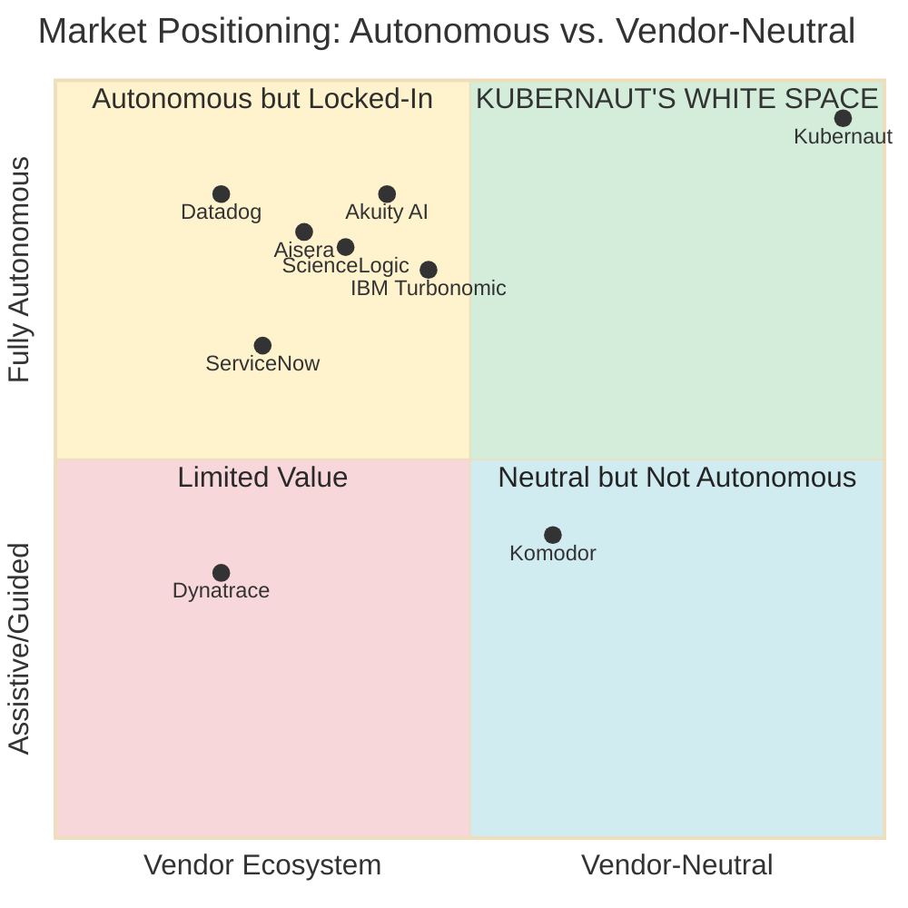
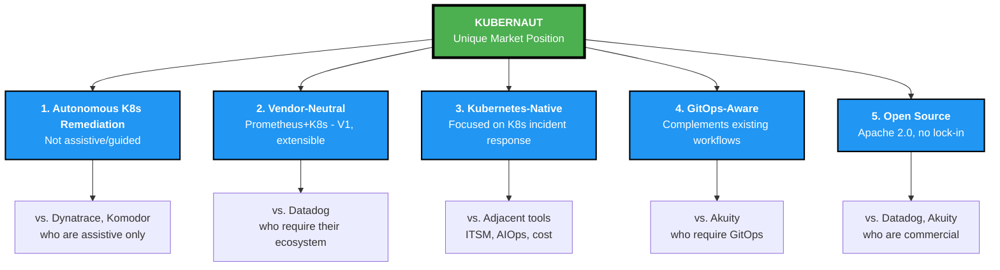
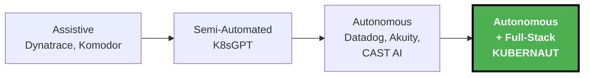
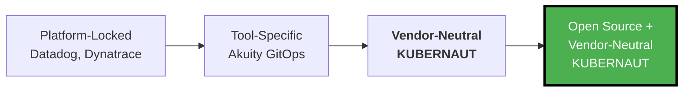
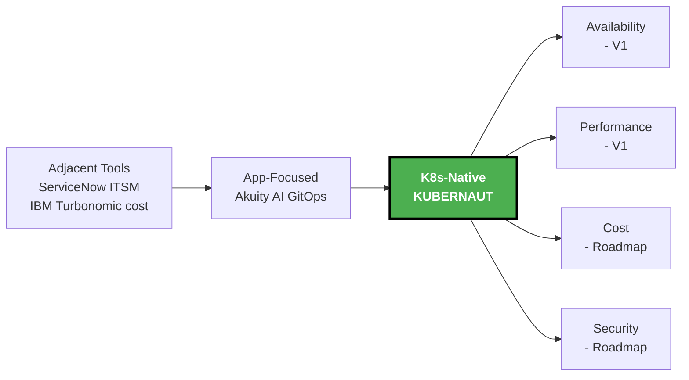
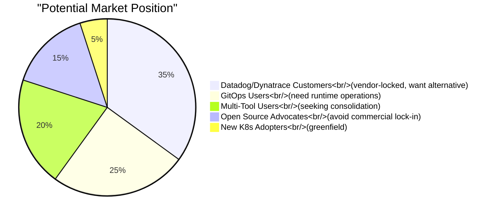
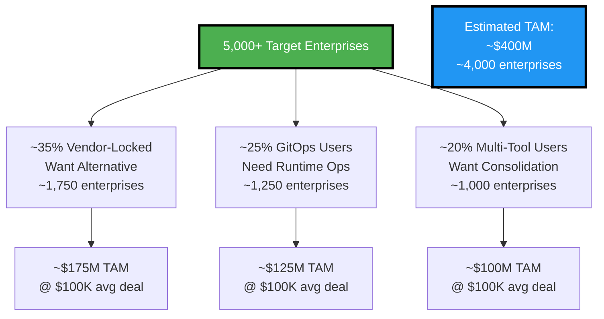

# Slide 6: Kubernaut's White Space

**Act**: 2 - Market Opportunity
**Theme**: "Kubernaut's Unique Market Position"

---

## 🎯 Slide Goal

**Visualize Kubernaut's unique position** in the competitive landscape.

---

## 📖 Content

### Title
**"Kubernaut Occupies Unique White Space in the Market"**

### Subtitle
*"The only open-source, autonomous, vendor-neutral, full-stack platform"*

---

## 📊 Market Positioning Map

---

## 🎯 Kubernaut's Unique Position

### The Five-Dimensional Advantage

---

## 🔍 Competitive Comparison by Dimension

### Dimension 1: Execution Model

### Dimension 2: Vendor Dependency

### Dimension 3: Operational Scope

---

## 💡 The White Space Explained

### Why This Position Is Defensible

| **Dimension** | **Why It Matters** | **Barrier to Entry** |
|---|---|---|
| **Autonomous K8s Remediation** | Customers want action, not just alerts | Requires AI + K8s expertise + safety validation |
| **Vendor-Neutral** | Works with Prometheus (no $50K-$200K lock-in) | Multi-signal architecture (V1: Prometheus+K8s) |
| **Kubernetes-Native Scope** | Focused K8s incident response | AI-powered K8s actions (V1: 10-15, extensible) |
| **GitOps-Aware** | Complements existing workflows | Runtime fixes + optional GitOps integration |
| **Open Source** | Transparency, community, no lock-in | Apache 2.0 licensing |

---

## 📊 Market Share Opportunity

**Target**: Capture **20-30% of enterprises** looking for vendor-neutral, open-source remediation

---

## 🎯 The Business Opportunity (Market Segmentation Estimates)

**Note**: Market segmentation percentages are estimates based on industry trends and competitive analysis.

---

## 🎯 Honest Positioning Statement

> **"Kubernaut fills the gap for Prometheus users:**
>
> **What V1 Delivers:**
> - ✅ Autonomous K8s incident remediation (not assistive)
> - ✅ Works with Prometheus + K8s events (not ecosystem-locked)
> - ✅ AI-generated workflows via HolmesGPT (not curated catalog)
> - ✅ Kubernetes-native focus (availability + performance)
> - ✅ GitOps-aware (complements existing workflows)
> - ✅ Open source Apache 2.0 (not commercial)
>
> **V1 Limitations:**
> - ⚠️ Prometheus + K8s events only (extensible architecture for V2+)
> - ⚠️ Cost/security optimization on roadmap (V2+)
>
> **The Gap We Fill:** Datadog/Akuity require ecosystem lock-in. Kubernaut is vendor-neutral."

---

## 📈 Market Trend Validation

> **"Autonomous agents that act (not just advise) are changing the value proposition: automated root-cause remediation, self-healing workflows reduce manual toil and scale operational expertise programmatically."**
>
> **Source**: [MarketGenics AIOps Report 2025-2035](https://www.openpr.com/news/4203387/aiops-market-set-to-grow-at-19-2-cagr-to-usd-87-6-billion-by-2035-as)

**Kubernaut's Alignment with #1 AIOps Trend**:
- ✅ AI-generated workflows (HolmesGPT) = **autonomous agents**
- ✅ Self-healing K8s remediation = **automated root-cause remediation**
- ✅ Explainable AI = **scales operational expertise programmatically**

**Market is moving toward Kubernaut's approach** (autonomous execution, not assistive tools)

---

## 🎯 Key Takeaway

> **"The $12.7B AIOps market has 4 autonomous K8s remediation platforms:**
> - Datadog (vendor lock-in, PREVIEW, curated catalog)
> - Dynatrace (vendor lock-in, full-stack broader scope)
> - Akuity (GitOps ecosystem required, Argo CD-bound)
> - **Kubernaut (open source, vendor-neutral, Prometheus-native)**
>
> **All 3 competitors are part of the 65% market consolidation (top 5 vendors).**
>
> **"Kubernaut is the ONLY open-source, vendor-neutral option serving Prometheus users who need autonomous K8s incident remediation."**
>
> **Source**: [MarketGenics AIOps Report](https://www.openpr.com/news/4203387/aiops-market-set-to-grow-at-19-2-cagr-to-usd-87-6-billion-by-2035-as)"

---

## ➡️ Transition to Act 3

*"We've identified the white space. Now let's show HOW Kubernaut uniquely fills it with our architecture and approach..."*

→ **Act 3: The Kubernaut Solution**
→ **Slide 7: The Architecture**

