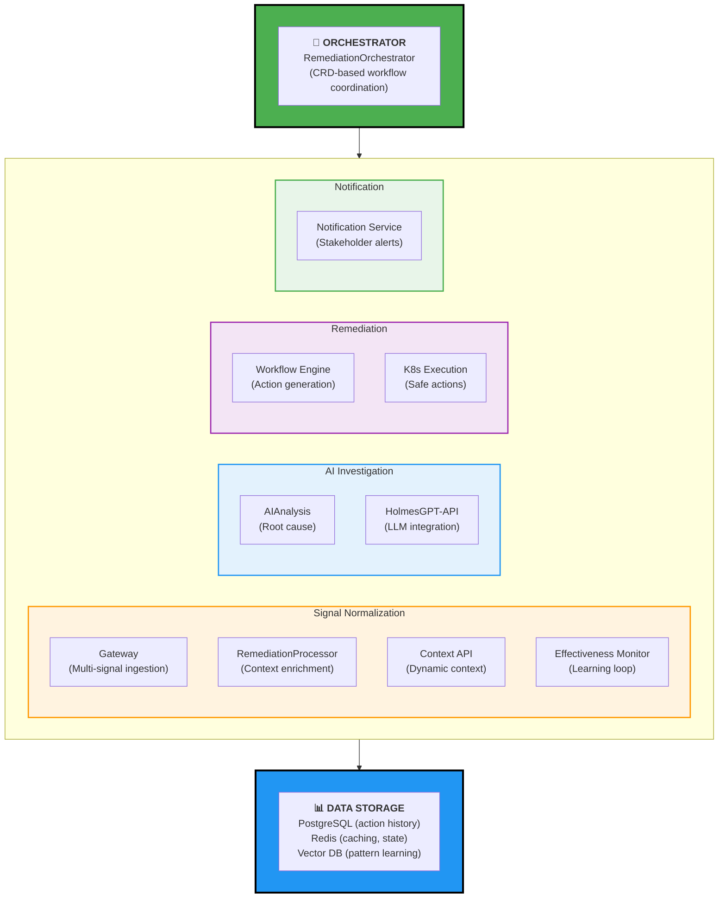
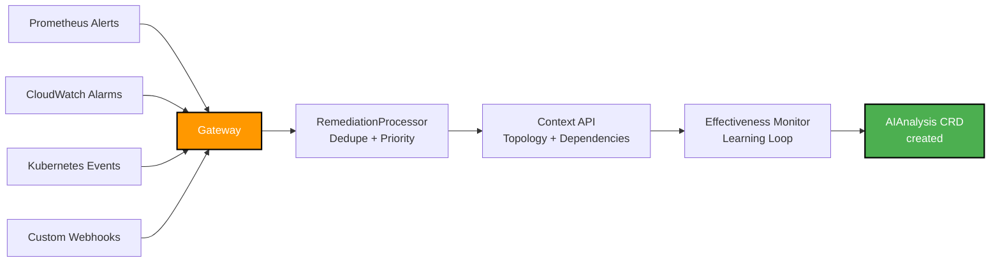
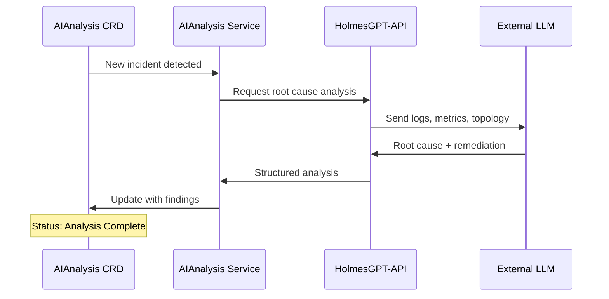
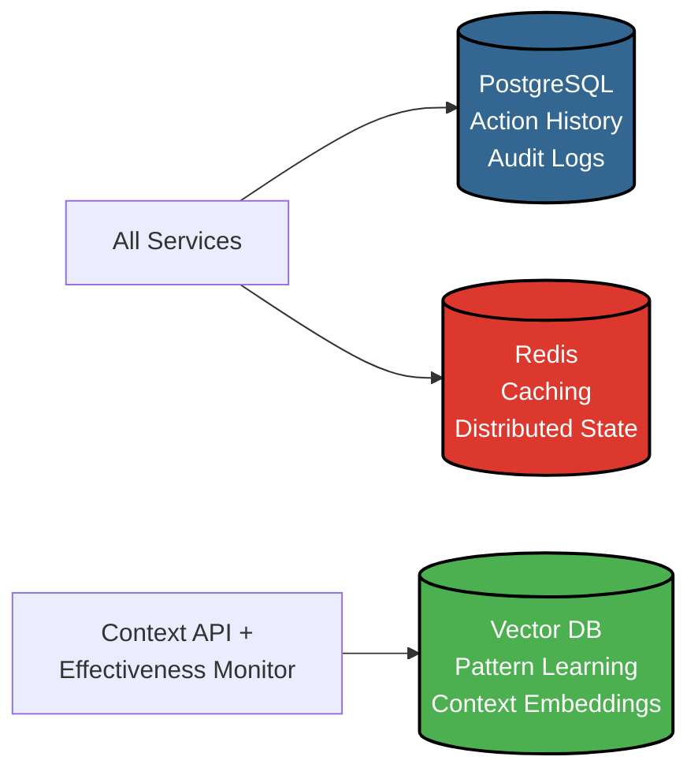

# Slide 7: The Kubernaut Architecture

**Act**: 3 - The Solution  
**Theme**: "How Kubernaut Delivers Autonomous Remediation"

---

## 🎯 Slide Goal

**Show the "hamburger" architecture** - prove engineering depth + CRD-native design.

---

## 📖 Content

### Title
**"Kubernaut V1 Architecture: Kubernetes-Native by Design"**

### Subtitle
*"12 microservices, CRD-based orchestration, AI-powered intelligence"*

---

## 🏗️ The Hamburger Architecture



---

## 🔍 Layer Breakdown

### Top Layer: Orchestrator
**RemediationOrchestrator (CRD Controller)**

**What It Does**:
- Watches for `AIAnalysis` CRDs (incident detection)
- Creates `WorkflowExecution` CRDs (remediation tasks)
- Monitors `KubernetesExecution` (DEPRECATED - ADR-025) CRDs (action status)
- Tracks remediation lifecycle end-to-end

**Key Features**:
- ✅ CRD-native (no external message bus required)
- ✅ Kubernetes-native orchestration
- ✅ Built-in state management via etcd
- ✅ Audit trail via CRD events

---

### Middle Layer - Section 1: Signal Normalization
**Multi-Signal Ingestion & Context Enrichment**



**Key Features**:
- **Gateway**: Ingests from ANY monitoring tool (vendor-neutral)
- **RemediationProcessor**: Deduplication, correlation, prioritization
- **Context API**: Dynamic topology discovery (what's connected to what)
- **Effectiveness Monitor**: Learns from past remediations (feedback loop)

---

### Middle Layer - Section 2: AI Investigation
**Root Cause Analysis via AI**



**Key Features**:
- **AIAnalysis Service**: Orchestrates AI investigation
- **HolmesGPT-API**: Multi-LLM integration (OpenAI, Anthropic, Local LLMs)
- **Context-Aware**: Uses topology, history, patterns from Context API
- **Structured Output**: Generates actionable remediation recommendations

---

### Middle Layer - Section 3: Remediation Execution
**Workflow Generation & Safe Execution**

```mermaid
graph TB
    Analysis[AIAnalysis CRD<br/>with recommendations] --> Workflow[Workflow Engine]
    
    Workflow --> Gen[Generate Actions<br/>pod restart, scale, rollback, etc.]
    Gen --> Safety[Safety Validation<br/>RBAC, quotas, dry-run]
    
    Safety --> Execute[K8s Execution Service]
    Execute --> K8s[Kubernetes API]
    
    K8s --> Status[KubernetesExecution (DEPRECATED - ADR-025) CRD<br/>Status: Running/Complete/Failed]
    
    style Workflow fill:#9C27B0,stroke:#000,stroke-width:2px,color:#fff
    style Safety fill:#FF9800,stroke:#000,stroke-width:2px,color:#fff
    style Execute fill:#4CAF50,stroke:#000,stroke-width:2px,color:#fff
```

**Key Features**:
- **Workflow Engine**: Converts AI recommendations to executable steps
- **Safety Validation**: RBAC checks, resource quotas, dry-run testing
- **K8s Execution**: Safe, auditable Kubernetes API operations
- **25+ Action Types**: Pods, deployments, scaling, rollbacks, nodes, storage, network, etc.

---

### Middle Layer - Section 4: Notification
**Stakeholder Communication**

**Notification Service**:
- Sends alerts to Slack, PagerDuty, email, webhooks
- Provides remediation summaries
- Links to audit trails and logs

---

### Bottom Layer: Data Storage
**Persistence, State, Learning**



---

## 🎯 Key Architectural Advantages

### 1. CRD-Native Communication
✅ **No external message bus** (Kafka, RabbitMQ)  
✅ **Kubernetes-native orchestration** (etcd state)  
✅ **Built-in audit trail** (CRD events)  
✅ **Standard Kubernetes tooling** (kubectl, kustomize)

### 2. Multi-Signal Ingestion
✅ **Vendor-neutral** (works with any monitoring tool)  
✅ **Multi-cloud** (AWS, GCP, Azure, on-prem)  
✅ **Extensible** (custom webhook support)

### 3. AI-Powered Intelligence
✅ **Multi-LLM support** (not locked to one provider)  
✅ **Context-aware** (topology, history, patterns)  
✅ **Continuous learning** (effectiveness feedback loop)

### 4. Safety-First Design
✅ **RBAC validation** (respects Kubernetes permissions)  
✅ **Dry-run testing** (preview before execution)  
✅ **Audit trail** (full remediation history)

---

## 🎯 Key Takeaway

> **"Kubernaut's architecture is Kubernetes-native by design. No external dependencies. No vendor lock-in. Just 12 microservices orchestrated via CRDs, powered by AI, and built for production safety."**

---

## ➡️ Transition to Next Slide

*"This architecture enables something powerful: transforming the engineer experience. Let's see what that looks like..."*

→ **Slide 8: The User Experience Transformation**

