# Slide 8: The User Experience Transformation

**Act**: 3 - The Solution
**Theme**: "From 45 Minutes to 2 Minutes: The Kubernaut Experience"

---

## 🎯 Slide Goal

**Show the dramatic UX transformation** - make it tangible with before/after.

---

## 📖 Content

### Title
**"The Kubernaut Experience: 45 Minutes → 2 Minutes"**

### Subtitle
*"Same incident. Radically different outcome."*

---

## 📊 Before & After Timeline

### Without Kubernaut (Manual Operations)

### With Kubernaut (Autonomous Remediation)

---

## 🔍 Step-by-Step Comparison

| **Step** | **Without Kubernaut** | **With Kubernaut** | **Time Saved** |
|---|---|---|---|
| **Detection** | Engineer receives page, wakes up | Automated ingestion | **~8 min saved** |
| **Context Gathering** | Manual dashboards, logs, Git | Context API enrichment | **~25 min saved** |
| **Root Cause Analysis** | Engineer investigates manually | HolmesGPT AI analysis | **~15 min saved** |
| **Remediation** | Engineer applies fix manually | Workflow Engine executes | **~5 min saved** |
| **Verification** | Engineer monitors manually | Automated health check | **~2 min saved** |
| **Total MTTR** | **Industry avg: 60 min** | **Target: 5 min avg** | **✅ 91% reduction** |

### **Kubernaut Target MTTR by Scenario Type**

| **Scenario** | **Manual MTTR** | **Kubernaut Target** | **Improvement** |
|---|---|---|---|
| **Configuration Drift** | 30-45 min | **2 min** | **93-95%** |
| **Memory Leak Detection** | 60-90 min | **4 min** | **93-96%** |
| **Cascading Failure** | 45-60 min | **5 min** | **89-92%** |
| **Node Resource Pressure** | 45-60 min | **3 min** | **93-95%** |
| **Database Deadlock** | 60-95 min | **7 min** | **88-92%** |
| **Alert Storm Correlation** | 90-120 min | **8 min** | **87-93%** |
| **Average** | **60 min** | **5 min** | **91%** |

**Source**: [Kubernaut Value Proposition](../../../docs/value-proposition/EXECUTIVE_SUMMARY.md) - Validated scenario targets

---

## 💰 Impact on Downtime Cost

### Example Scenario: Large E-commerce Platform

**Assumptions**:
- Industry average MTTR: 60 min (observability platform data)
- Target Kubernaut MTTR: 5 min average
- Downtime cost: $5,000-$9,000/min (Gartner: large e-commerce)
- Monthly critical incidents: 10 (high-volume environment)

| **Metric** | **Current State** | **With Kubernaut (Target)** | **Potential Savings** |
|---|---|---|---|
| **MTTR** | 60 min (average) | 5 min (target avg) | 55 min reduction (91%) |
| **Downtime Cost** | $7,000/min (mid-range) | $7,000/min | — |
| **Cost per Incident** | **$420K** (60 min) | **$35K** (5 min) | **$385K saved** |
| **Monthly Incidents** | 10 incidents | 10 incidents | — |
| **Monthly Savings** | — | — | **$3.85M** |

**Example Annual Savings**: **$18M-$23M** (revenue protection + cost reduction)

**Components**:
- **Revenue Protection**: $15M-$20M/year (faster incident resolution)
- **Cost Savings**: $2.5M/year (reduced downtime)
- **SRE Productivity**: 40% capacity reclaimed (automation vs. manual)

**Note**: Actual savings vary by incident frequency, severity, and business impact.

### Sources
- Downtime cost: Gartner Research 💰 PAYWALLED / Atlassian 🆓
- MTTR: Industry observability platforms (Datadog, Dynatrace) 🆓
- ROI calculations: [Kubernaut Value Proposition](../../../docs/value-proposition/README.md) 🆓

---

## 👤 Engineer Experience Transformation

### Before Kubernaut (Manual Operations)

**Result**: Burnout, toil, low morale

---

### After Kubernaut (Autonomous Operations)

**Result**: Engineers focus on innovation, not toil

---

## 📊 What Engineers Get Back

### Example Time Savings per Week (High-Incident Environment)

| **Activity** | **Current State** | **With Kubernaut (Target)** | **Potential Reclaimed** |
|---|---|---|---|
| **Incident Response** | 15-25 hours/week | <5 hours/week | **~15-20 hours** |
| **Post-Mortems** | 3-5 hours/week | 1-2 hours/week | **~3 hours** |
| **Toil Reduction** | Significant (Google SRE: toil = repetitive manual work) | Minimal | **Significant time back** |

**Result**: Engineers shift from reactive firefighting to proactive development

**Source**: Google SRE Book defines toil as manual, repetitive, automatable operational work 🆓

---

## 💬 Customer Testimonial (Projected)

> *"Kubernaut transformed our on-call experience. Our engineers reclaimed 40% of their time from firefighting to feature development. MTTR dropped 91% from 60 minutes to 5 minutes average. **It's like having a senior SRE with perfect memory on every incident, 24/7.**"*
>
> — VP Engineering, Large E-commerce Company (Target Beta User)

---

## 🎯 The Experience Transformation

```mermaid
graph LR
    A[Manual Operations] --> B[Engineer Woken<br/>60 min MTTR avg<br/>$420K/incident<br/>High toil 40%]

    C[Kubernaut Autonomous] --> D[Engineer Sleeps<br/>5 min MTTR target<br/>$35K/incident<br/>Low toil reclaimed]

    B --> E[❌ Burnout<br/>❌ $18M-$23M lost<br/>❌ Slow Recovery]

    D --> F[✅ 40% Capacity Reclaimed<br/>✅ $18M-$23M Saved<br/>✅ 91% Faster Recovery]

    style A fill:#ff0000,stroke:#000,stroke-width:2px,color:#fff
    style B fill:#ff9900,stroke:#000,stroke-width:2px,color:#fff
    style E fill:#ff0000,stroke:#000,stroke-width:2px,color:#fff

    style C fill:#4CAF50,stroke:#000,stroke-width:2px,color:#fff
    style D fill:#2196F3,stroke:#000,stroke-width:2px,color:#fff
    style F fill:#4CAF50,stroke:#000,stroke-width:2px,color:#fff
```

---

## 🎯 Key Takeaway

> **"Kubernaut doesn't just reduce MTTR - it transforms the engineer experience:**
>
> **"60 min → 5 min average (91% reduction). 40% engineering capacity reclaimed. $18M-$23M annual value."**
>
> **"From 3 AM firefighting to next-morning review. From repetitive toil to innovation time. From burnout to trust."**

---

## ➡️ Transition to Next Slide

*"We've shown the experience transformation. Now let's prove why Kubernaut's approach is uniquely defensible..."*

→ **Slide 9: The Differentiation**

