# Slide 9: The Differentiation

**Act**: 3 - The Solution
**Theme**: "Why Kubernaut's Approach Is Uniquely Defensible"

---

## 🎯 Slide Goal

**Prove the differentiation** with specific technical and strategic advantages.

---

## 📖 Content

### Title
**"Seven Reasons Kubernaut Is Uniquely Defensible"**

### Subtitle
*"Not just features - strategic advantages"*

---

## 🎯 Differentiation Matrix

| **Advantage** | **Kubernaut** | **Datadog** | **Akuity** | **CAST AI** | **Dynatrace** |
|---|---|---|---|---|---|
| **1. CRD-Native** | ✅ Yes | ❌ No | ⚠️ Argo CRDs | ❌ No | ❌ No |
| **2. Multi-Signal** | ✅ Any tool | ❌ Datadog only | ⚠️ GitOps | ❌ Cost metrics | ❌ Dynatrace only |
| **3. AI-Generated** | ✅ Dynamic | ⚠️ Curated | ⚠️ GitOps sync | ❌ Rule-based | ⚠️ Templates |
| **4. Full-Stack Scope** | ✅ 25+ actions | ⚠️ Common issues | ⚠️ Apps only | ⚠️ Cost/security | ❌ RCA only |
| **5. GitOps-Aware** | ✅ Complements | ❌ No | ✅ **Required** | ❌ No | ⚠️ PRs only |
| **6. Open Source** | ✅ Apache 2.0 | ❌ Commercial | ❌ Commercial | ❌ Commercial | ❌ Commercial |
| **7. No Lock-In** | ✅ Vendor-neutral | ❌ Platform-locked | ⚠️ Argo-locked | ⚠️ Moderate | ❌ Platform-locked |

---

## 🔍 Differentiation Deep Dive

### 1. CRD-Native Architecture

**Why It Matters**: Kubernetes-native orchestration without external dependencies

```mermaid
graph TB
    subgraph Competitors["Competitors (External Orchestration)"]
        C1[Monitoring Tool] --> C2[Message Bus<br/>Kafka, RabbitMQ]
        C2 --> C3[Orchestrator]
        C3 --> C4[K8s API]
    end

    subgraph Kubernaut["Kubernaut (CRD-Native)"]
        K1[Monitoring Tool] --> K2[Gateway<br/>creates CRD]
        K2 --> K3[Orchestrator<br/>watches CRD]
        K3 --> K4[K8s API<br/>via CRD]
    end

    Competitors --> Issues["❌ External dependencies<br/>❌ Separate state management<br/>❌ Complex deployment"]

    Kubernaut --> Benefits["✅ No external message bus<br/>✅ etcd-native state<br/>✅ Standard kubectl tooling"]

    style Competitors fill:#ff9900,stroke:#000,stroke-width:2px
    style Kubernaut fill:#4CAF50,stroke:#000,stroke-width:2px,color:#fff
    style Issues fill:#ff0000,stroke:#000,stroke-width:2px,color:#fff
    style Benefits fill:#4CAF50,stroke:#000,stroke-width:2px,color:#fff
```

**Advantage**: Simpler deployment, no external infrastructure, Kubernetes-native by design

---

### 2. Multi-Signal Ingestion (Vendor-Neutral)

**Why It Matters**: Works with ANY monitoring tool, no ecosystem lock-in

```mermaid
flowchart LR
    subgraph Signals["Multi-Signal Sources"]
        S1[Prometheus]
        S2[CloudWatch]
        S3[Grafana]
        S4[Custom Webhooks]
    end

    subgraph Kubernaut["Kubernaut Gateway"]
        Gateway[Vendor-Neutral<br/>Ingestion]
    end

    subgraph Competitors["Competitor Lock-In"]
        D[Datadog<br/>Datadog agents only]
        DT[Dynatrace<br/>Dynatrace agents only]
    end

    Signals --> Gateway
    Gateway --> Freedom["✅ No vendor lock-in<br/>✅ Use existing tools<br/>✅ Multi-cloud support"]

    Competitors --> Locked["❌ $50K-$200K/year<br/>❌ Replace existing tools<br/>❌ Ecosystem lock-in"]

    style Gateway fill:#4CAF50,stroke:#000,stroke-width:2px,color:#fff
    style Freedom fill:#4CAF50,stroke:#000,stroke-width:2px,color:#fff
    style Competitors fill:#ff9900,stroke:#000,stroke-width:2px
    style Locked fill:#ff0000,stroke:#000,stroke-width:2px,color:#fff
```

**Advantage**: Customers keep existing $50K-$200K/year monitoring investments

---

### 3. AI-Generated (Not Curated/GitOps-Bound)

**Why It Matters**: Adapts to novel incidents, not just known issues

| **Approach** | **Platform** | **Limitation** | **Example** |
|---|---|---|---|
| **Curated Catalog** | Datadog | Only handles known issues | CrashLoopBackOff, OOMKilled |
| **GitOps Sync** | Akuity | Only fixes Git drift | Restores to declared state |
| **Rule-Based** | CAST AI | Static patterns | Cost optimization rules |
| **AI-Generated** | **Kubernaut** | ✅ **Adapts dynamically** | Memory leak → AI recommends resource increase + rolling restart |

**Advantage**: Handles **novel incidents** competitors can't (e.g., complex multi-service cascading failures)

---

### 4. Full-Stack Operational Scope

**Why It Matters**: One platform vs. 3-5 specialized tools

**Advantage**: **$170K-$220K annual savings** by consolidating 3-5 tools into one

---

### 5. GitOps-Aware (Complements, Not Replaces)

**Why It Matters**: Fills gap GitOps can't handle (runtime operational incidents)

```mermaid
sequenceDiagram
    participant App as Application
    participant K8s as Kubernetes
    participant Kubernaut as Kubernaut
    participant Git as Git Repository

    Note over App,Git: Scenario: Memory Leak (Runtime Issue)

    App->>K8s: Pod crashes (OOMKilled)
    K8s->>Kubernaut: Alert detected
    Kubernaut->>Kubernaut: AI analysis:<br/>Memory leak detected
    Kubernaut->>K8s: Immediate fix:<br/>Increase memory limit<br/>Rolling restart
    K8s->>App: Service restored

    Note over Kubernaut,Git: Optional: Persistent Change

    Kubernaut->>Git: Create PR:<br/>Update resource limits
    Git->>K8s: GitOps sync:<br/>Long-term fix

    Note over App,Git: ✅ Runtime fix (Kubernaut)<br/>✅ GitOps sync (persistent)
```

**Advantage**: **Complements GitOps workflows** (not compete), handles runtime incidents GitOps can't

---

### 6. Open Source (Apache 2.0)

**Why It Matters**: Transparency, community, no vendor lock-in

| **Benefit** | **Impact** |
|---|---|
| **Audit the Code** | Security teams can review remediation logic |
| **Self-Hosted** | Data sovereignty for regulated industries |
| **Community-Driven** | Custom actions, AI models, integrations |
| **No Lock-In** | Fork, extend, or contribute back |

**Advantage**: **Trust + transparency** commercial platforms can't offer

---

### 7. No Vendor Lock-In

**Why It Matters**: Freedom to choose best-of-breed tools

```mermaid
graph TD
    subgraph Locked["Vendor Lock-In (Datadog/Dynatrace)"]
        L1[Monitoring Platform<br/>$50K-$200K/year] --> L2[Must use their agents]
        L2 --> L3[Replace existing tools]
        L3 --> L4[❌ Ecosystem lock-in]
    end

    subgraph Kubernaut["Kubernaut Freedom"]
        K1[Keep Existing Tools] --> K2[Prometheus, Grafana,<br/>CloudWatch, etc.]
        K2 --> K3[Add Kubernaut<br/>$50K-$150K/year]
        K3 --> K4[✅ No lock-in<br/>✅ Best-of-breed stack]
    end

    style L4 fill:#ff0000,stroke:#000,stroke-width:2px,color:#fff
    style K4 fill:#4CAF50,stroke:#000,stroke-width:2px,color:#fff
```

**Advantage**: **Lower switching cost** (customers can start without replacing existing tools)

---

## 🎯 Competitive Moat Summary

---

## 🔧 Kubernaut vs. OpenShift Built-In Self-Healing

### **"Enhancing, Not Replacing OpenShift"**

**Key Positioning**: Kubernaut **enhances** OpenShift's existing capabilities with AI-powered intelligence and broader scope.

| **Feature** | **OpenShift Self-Healing** | **Kubernaut** | **Value-Add** |
|---|---|---|---|
| **Scope** | Basic pod restarts, liveness probes | 25+ remediation actions across full stack | ✅ **10x broader coverage** |
| **Intelligence** | Rule-based health checks | AI-powered root cause analysis (HolmesGPT) | ✅ **71-86% validated accuracy** |
| **Multi-Signal** | Kubernetes events only | Prometheus, CloudWatch, webhooks, custom | ✅ **Vendor-neutral ingestion** |
| **Remediation** | Pod restarts, container kills | Scaling, rollbacks, storage, network, security | ✅ **Comprehensive actions** |
| **Learning** | Static rules (no adaptation) | Effectiveness learning loop (V2) | ✅ **Continuous improvement** |
| **GitOps** | No GitOps awareness | Optional PR generation | ✅ **GitOps-compatible** |
| **Observability** | Basic Kubernetes events | Full audit trail, effectiveness metrics | ✅ **Deep analytics** |

---

### **How Kubernaut Complements OpenShift**

**Key Insight**: OpenShift handles simple, transient issues (pod crashes). Kubernaut handles complex, persistent problems (root cause + comprehensive fix).

---

### **Why This Matters for Red Hat**

1. **✅ No Replacement Risk**: Kubernaut doesn't compete with OpenShift core features
2. **✅ Value Addition**: Makes OpenShift more powerful without changing existing behavior
3. **✅ Customer Win**: Existing OpenShift customers get enhanced capabilities
4. **✅ Upsell Opportunity**: Premium feature for Platform Plus tier
5. **✅ Competitive Defense**: Positions OpenShift as "most intelligent K8s platform"

**Customer Message**: *"OpenShift is great at keeping pods alive. Kubernaut makes it great at solving complex operational problems automatically."*

---

## 🛡️ Defensive Moats: Why Competitors Can't Catch Up Easily

### **1. HolmesGPT Integration Depth**
**Moat**: 6+ months of integration work, 71-86% validated accuracy
**Competitor Challenge**: Requires deep AI expertise + Kubernetes domain knowledge + benchmark validation (12+ months)

### **2. CRD-Native Architecture**
**Moat**: 12 microservices, CRD-based orchestration, etcd-native state
**Competitor Challenge**: Existing platforms (Datadog, Dynatrace) require complete re-architecture (18-24 months)

### **3. Open Source Community**
**Moat**: Apache 2.0, GitHub community, contribution ecosystem
**Competitor Challenge**: Commercial vendors cannot open-source existing platforms without cannibalization

### **4. Red Hat Exclusive Partnership**
**Moat**: Lightspeed KB Agent access (proprietary Red Hat knowledge)
**Competitor Challenge**: AWS, Google, Azure cannot access OpenShift-specific knowledge

### **5. Multi-Signal Ingestion**
**Moat**: Vendor-neutral by design, works with any monitoring tool
**Competitor Challenge**: Datadog/Dynatrace built around proprietary agents (cannot easily become vendor-neutral)

### **6. First-Mover Validated Market**
**Moat**: Datadog, Akuity validated market in Q1 2025 (Kubernaut ready Q4 2025)
**Competitor Challenge**: Late entrants face "why switch?" barrier + established customer base

---

### **Competitive Timeline Analysis**

**Key Insight**: By the time competitors replicate Kubernaut's current capabilities (2027), Kubernaut will be on V2 with effectiveness learning and pattern recognition.

---

## 🎯 Key Takeaway

> **"Kubernaut's differentiation isn't just features - it's strategic positioning:**
>
> **CRD-native + multi-signal + AI-generated + full-stack + GitOps-aware + open source + no lock-in**
>
> **PLUS: Enhances OpenShift without replacing it. Defensible moats competitors can't easily replicate."**

---

## ➡️ Transition to Next Slide

*"Differentiation is great, but can we prove it? Let's look at the proof points..."*

→ **Slide 10: The Proof Points**

