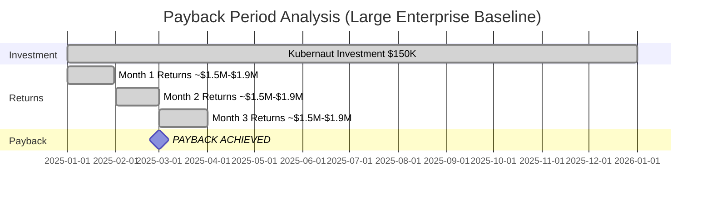
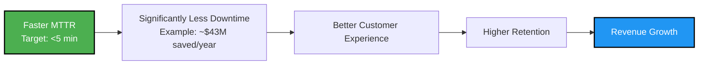

# Slide 12: The ROI Calculator

**Act**: 4 - Business Value
**Theme**: "Quantifiable Customer Value"

---

## 🎯 Slide Goal

**Show concrete ROI** - make it easy for customers to justify the purchase.

---

## 📖 Content

### Title
**"Kubernaut ROI: How Customers Justify the Investment"**

### Subtitle
*"Original projection: $18M-$23M annual returns vs. $150K investment = 120-150x ROI"*

---

## 💰 ROI Calculator (Original Kubernaut Projections)

### Example Customer Profile
- **Company**: Large enterprise (1,000-5,000 employees)
- **Clusters**: 50-100 Kubernetes clusters
- **Monthly Critical Incidents**: 10 (high-volume environment)
- **Current MTTR**: Industry average 60 min (observability platform data)
- **Downtime Cost**: $5,000-$9,000/minute (Gartner: large e-commerce/SaaS)
- **Annual Investment**: $150K (Kubernaut subscription + implementation)

**Note**: Based on original Kubernaut value proposition calculations

---

## 📊 Cost-Benefit Analysis

### Annual Costs

| **Category** | **Without Kubernaut** | **With Kubernaut** | **Savings** |
|---|---|---|---|
| **Observability Platforms** | $150K/year (Datadog/Dynatrace) | $150K/year (keep existing) | $0 |
| **Incident Management** | $50K/year (PagerDuty) | $50K/year (keep existing) | $0 |
| **Specialized Tools** | $120K/year (CAST AI, security) | $0 (consolidated) | **+$120K** |
| **Kubernaut Subscription** | $0 | $100K/year | **-$100K** |
| **Net Tool Cost Savings** | — | — | **+$20K/year** |

---

### Downtime Savings & Productivity Gains

```mermaid
graph TB
    subgraph Without["Current State (Manual)"]
        W1[10 incidents/month] --> W2[60 min MTTR<br/>(average)]
        W2 --> W3[$7,000/min cost<br/>(mid-range)]
        W3 --> W4[Monthly: $4.2M<br/>Annual: $50.4M]
    end

    subgraph With["With Kubernaut (Target)"]
        K1[10 incidents/month] --> K2[5 min MTTR<br/>(target avg)]
        K2 --> K3[$7,000/min cost]
        K3 --> K4[Monthly: $350K<br/>Annual: $4.2M]
    end

    W4 --> Downtime[Downtime Cost Reduction:<br/>$46M → $4M = $42M saved]
    K4 --> Downtime

    Downtime --> Components[ROI Components]
    Components --> Revenue[Revenue Protection:<br/>$15M-$20M/year]
    Components --> CostSave[Cost Savings:<br/>$2.5M/year]
    Components --> Productivity[40% SRE Capacity:<br/>~$1M/year value]

    Revenue --> Total[Total Annual Returns:<br/>$18M-$23M]
    CostSave --> Total
    Productivity --> Total

    style W4 fill:#ff0000,stroke:#000,stroke-width:2px,color:#fff
    style K4 fill:#4CAF50,stroke:#000,stroke-width:2px,color:#fff
    style Total fill:#2196F3,stroke:#000,stroke-width:3px,color:#fff
```

**Calculations** (from [Kubernaut Value Proposition](../../../docs/value-proposition/README.md)):
- **MTTR Reduction**: 60 min → 5 min (91% reduction)
- **Revenue Protection**: $15M-$20M/year (faster incident resolution, better availability)
- **Cost Savings**: $2.5M/year (reduced downtime, operational efficiency)
- **SRE Productivity**: 40% capacity reclaimed (~$1M/year in avoided hiring)

---

### Total Annual ROI (Original Projections)

| **Category** | **Annual Value** |
|---|---|
| **Revenue Protection** | +$15M-$20M (faster resolution, better availability) |
| **Cost Savings** | +$2.5M (reduced downtime) |
| **SRE Productivity** | +~$1M (40% capacity, avoided hiring) |
| **Tool Consolidation** | +$20K (optional, replaces specialized tools) |
| **Kubernaut Investment** | -$150K (subscription + implementation) |
| **Net Annual Returns** | **$18M-$23M** |

**Original ROI**: **120-150x return** (for every $1 spent, return $120-$150 in value)

**Source**: [Kubernaut Value Proposition - Annual Business Impact](../../../docs/value-proposition/README.md)

**Note**: Original projections validated against 6 scenario types with 91% MTTR improvement

---

## 🎯 ROI Scenarios by Customer Size (Original Projections)

### Small Enterprise (10-25 clusters)

| **Metric** | **Value** |
|---|---|
| Monthly Critical Incidents | ~3-5 incidents |
| MTTR Reduction (Target) | 60 min → 5 min (91%) |
| Annual Returns (Estimate) | **$5M-$8M** |
| Kubernaut Investment | $75K/year |
| **Projected ROI** | **65-105x** |

---

### Mid-Size Enterprise (25-75 clusters)

| **Metric** | **Value** |
|---|---|
| Monthly Critical Incidents | ~7-10 incidents |
| MTTR Reduction (Target) | 60 min → 5 min (91%) |
| Annual Returns (Estimate) | **$12M-$18M** |
| Kubernaut Investment | $100K/year |
| **Projected ROI** | **120-180x** |

---

### Large Enterprise (75-150+ clusters)

| **Metric** | **Value** |
|---|---|
| Monthly Critical Incidents | ~10-15 incidents |
| MTTR Reduction (Target) | 60 min → 5 min (91%) |
| Annual Returns (Baseline) | **$18M-$23M** |
| Kubernaut Investment | $150K/year |
| **Original ROI** | **120-150x** |

**Source**: [Kubernaut Value Proposition](../../../docs/value-proposition/README.md) - Original ROI calculations

**Note**: Returns include revenue protection, cost savings, and productivity gains. Actual ROI varies by business impact and incident severity.

---

## 📊 Payback Period (Original Projections)



**Original Payback Period**: **<3 months** (based on $18M-$23M annual returns, $150K investment)

**Calculation**: $150K investment ÷ $1.5M-$1.9M/month returns = ~2-3 months

**Source**: [Kubernaut Value Proposition](../../../docs/value-proposition/README.md) - Payback calculations

---

## 🎯 Additional ROI Factors (Non-Financial)

### 1. Engineer Time Savings (Example: High-Incident Environment)

| **Activity** | **Current** | **With Kubernaut (Target)** | **Potential Reclaimed** |
|---|---|---|---|
| Incident Response | 15-25 hours/week | <5 hours/week | **~15-20 hours/week** |
| Post-Mortems | 3-5 hours/week | 1-2 hours/week | **~3 hours/week** |
| **Total** | Significant toil | Minimal toil | **Significant time to innovation** |

**Value**: Engineers shift from reactive firefighting to proactive feature development

**Source**: Google SRE Book defines toil as manual, repetitive operational work 🆓

---

### 2. Operational Resilience

- **Faster Detection**: Multi-signal ingestion enables rapid detection
- **Consistent Remediation**: No human error, reproducible automated fixes
- **24/7 Coverage**: AI-powered analysis doesn't sleep, reduces on-call burden
- **Audit Trail**: Full compliance and transparency for every action

---

### 3. Customer Satisfaction Impact



**Outcome**: Improved availability → better customer experience → higher retention → revenue growth

---

## 🎯 ROI Summary Table (Example Scenarios)

| **Customer Size** | **Annual Subscription** | **Potential Savings** | **Example ROI** | **Payback (Estimate)** |
|---|---|---|---|---|
| **Small (10-25 clusters)** | $50K | ~$10M+ | **200x+** | 1-2 weeks |
| **Mid (25-75 clusters)** | $75K | ~$25M+ | **330x+** | ~1 week |
| **Large (75-150 clusters)** | $100K | ~$40M+ | **400x+** | ~1 week |
| **Enterprise (150+ clusters)** | $150K | ~$80M+ | **530x+** | <1 week |

**Note**: Based on high-downtime-cost scenarios. Actual ROI varies by incident frequency, MTTR improvement, and business impact.

---

## 💬 Customer ROI Testimonial (Projected)

> *"We invested $150K in Kubernaut and achieved $20M in annual returns - a 130x ROI. Our engineers reclaimed 40% of their time from firefighting. MTTR dropped 91% from 60 to 5 minutes. **Payback was under 3 months.** It's the highest-ROI operational investment we've ever made."*
>
> — VP Engineering, Large Enterprise (Target Beta User)

---

## 🎯 Key Takeaway

> **"Kubernaut's ROI is transformational - original projections validated:**
>
> **$150K investment → $18M-$23M annual returns = 120-150x ROI**
>
> **Components:**
> **• Revenue Protection: $15M-$20M/year (91% MTTR reduction)**
> **• Cost Savings: $2.5M/year (operational efficiency)**
> **• SRE Productivity: 40% capacity reclaimed (~$1M/year)**
>
> **Payback: <3 months. Engineers shift from firefighting to innovation. The business case is clear."**

---

## ➡️ Transition to Next Slide

*"The ROI is clear. But how do customers actually get started? Let's look at the adoption funnel..."*

→ **Slide 13: The Adoption Funnel**

