# Slide 13: The Adoption Funnel

**Act**: 4 - Business Value
**Theme**: "How Customers Get Started with Kubernaut"

---

## 🎯 Slide Goal

**Show the adoption path** - make it easy to visualize customer journey from awareness to revenue.

---

## 📖 Content

### Title
**"The Kubernaut Adoption Funnel: From Open Source to Enterprise"**

### Subtitle
*"Low barrier to entry, high value realization"*

---

## 📊 The Funnel

```mermaid
graph TB
    A[Awareness<br/>10,000+ developers/year] --> B[Trial<br/>1,000+ self-hosted deployments]
    B --> C[Activation<br/>300+ active users]
    C --> D[Qualification<br/>100+ enterprise leads]
    D --> E[Purchase<br/>30+ paying customers]
    E --> F[Expansion<br/>Upsell to Enterprise tier]

    A --> A1[GitHub, docs, community,<br/>conference talks]
    B --> B1[Easy deployment:<br/>helm install kubernaut]
    C --> C1[First successful remediation<br/>within 24 hours]
    D --> D1[50+ clusters,<br/>need enterprise features]
    E --> E1[30-day trial →<br/>subscription conversion]
    F --> F1[Upgrade Team → Enterprise<br/>add multi-cluster, SSO]

    style A fill:#E3F2FD,stroke:#000,stroke-width:2px
    style B fill:#BBDEFB,stroke:#000,stroke-width:2px
    style C fill:#90CAF9,stroke:#000,stroke-width:2px
    style D fill:#64B5F6,stroke:#000,stroke-width:2px
    style E fill:#42A5F5,stroke:#000,stroke-width:2px,color:#fff
    style F fill:#2196F3,stroke:#000,stroke-width:2px,color:#fff
```



---

## 🚀 Stage 1: Awareness (Top of Funnel)

### Target: 10,000+ Downloads/Year

**Tactics**:
- ✅ **Open Source Launch**: Apache 2.0 on GitHub
- ✅ **Documentation**: Comprehensive guides, tutorials, examples
- ✅ **Community Building**: Slack, Discord, GitHub Discussions
- ✅ **Content Marketing**: Blog posts, conference talks, webinars
- ✅ **Developer Advocacy**: Kubernetes community engagement

**Target Conversion**: 10% → **~1,000 self-hosted deployments**

---

## 🔧 Stage 2: Trial (Self-Hosted Deployment)

### Target: 1,000+ Active Self-Hosted Deployments

**Tactics**:
- ✅ **Easy Setup**: `helm install kubernaut/kubernaut`
- ✅ **Quick Start Guide**: 15-minute deployment to first remediation
- ✅ **Free Core Features**: Full functionality, no credit card required
- ✅ **Community Support**: GitHub Issues, Slack, documentation

**Example User Journey**:
```bash
# Day 0: Discovery
git clone https://github.com/kubernaut/kubernaut
cd kubernaut && helm install kubernaut ./deploy

# Day 1: First Remediation
kubectl apply -f examples/prometheus-alert.yaml
# Kubernaut automatically detects and fixes CrashLoopBackOff

# Day 7: Active User
kubectl get aianalysis  # Review AI-generated insights
kubectl get workflowexecution  # Track remediation history
```

**Target Conversion**: 30% → **~300 active users**

---

## ✅ Stage 3: Activation (First Value Realization)

### Target: 300+ Active Users (Regular Usage)

**Definition of Active User**:
- At least 1 successful remediation per week
- Using core features (AI analysis, workflow execution)
- Monitoring via Kubernaut dashboards

**Tactics**:
- ✅ **Onboarding Emails**: Best practices, tips, feature highlights
- ✅ **Success Metrics**: Dashboard showing MTTR improvements
- ✅ **Community Engagement**: Share success stories, ask for feedback

**Target Conversion**: 33% → **~100 qualified enterprise leads**

---

## 💼 Stage 4: Qualification (Enterprise Needs)

### Target: 100+ Qualified Enterprise Leads

**Qualification Criteria**:
- **50+ Kubernetes clusters** (need multi-cluster features)
- **24/7 uptime requirements** (need SLA support)
- **Regulatory compliance** (need audit reports, SSO)
- **Budget authority** (can commit $50K-$200K/year)

**Tactics**:
- ✅ **Product-Led Qualification**: Track cluster count via telemetry (opt-in)
- ✅ **Sales Outreach**: Contact high-usage self-hosted users
- ✅ **Inbound Leads**: Enterprise inquiry form on website
- ✅ **Referral Program**: Community advocates introduce us to enterprises

**Target Conversion**: 30% → **~30 trial/POC customers**

---

## 🎯 Stage 5: Purchase (Trial → Subscription)

### Target: 30+ Trial Customers in Year 1

**Trial Process**:
1. **30-Day Enterprise Trial**: Unlock enterprise features
2. **Technical Success Manager**: Dedicated support during trial
3. **ROI Demonstration**: Show downtime savings, MTTR improvements
4. **Business Case**: Help customer justify purchase internally

**Target Conversion**: 40% → **~12 paying customers** (Year 1)

---

## 📈 Stage 6: Expansion (Upsell & Retention)

### Target: 85%+ Retention + 30% Expansion Revenue

**Expansion Opportunities**:
- **Team → Enterprise**: Upgrade for multi-cluster, advanced SSO
- **Add Clusters**: Pay per cluster after base tier
- **Professional Services**: Custom integrations, training
- **Extended Support**: 24/7 premium support SLA

**Retention Tactics**:
- ✅ **Customer Success Manager**: Quarterly business reviews
- ✅ **Feature Requests**: Community-driven roadmap
- ✅ **Integration Support**: Help connect to existing tools
- ✅ **Continuous Value**: Show ongoing MTTR improvements

---

## 📊 Funnel Metrics (Year 1-3 Projections)


---

## 🎯 Conversion Rate Assumptions

| **Stage** | **Target** | **Conversion** | **Industry Benchmark** |
|---|---|---|---|
| Downloads → Deployments | 10% | 1,000 | ✅ Standard for infra tools |
| Deployments → Active | 30% | 300 | ✅ Good for SaaS/OSS |
| Active → Qualified | 33% | 100 | ✅ Enterprise focus |
| Qualified → Trial | 30% | 30 | ✅ Strong qualification |
| Trial → Customer | 40% | 12 | ✅ High for proven ROI |

**Sources**: Industry benchmarks from SaaS Capital, OpenView Partners 🆓

---

## 🚀 Go-to-Market Timeline


---

## 🚀 OpenShift Customer Adoption Path (Red Hat-Specific)

### **How OpenShift Customers Adopt Kubernaut**

```mermaid
graph TB
    Discovery[<b>1. Discovery</b><br/>Red Hat account manager<br/>introduces Kubernaut<br/>Platform Plus upsell]

    Evaluation[<b>2. Evaluation</b><br/>30-day Platform Plus trial<br/>Kubernaut included<br/>No separate procurement]

    Pilot[<b>3. Pilot</b><br/>Single OpenShift cluster<br/>2-4 weeks validation<br/>Technical Success Manager]

    Expansion[<b>4. Expansion</b><br/>Multi-cluster rollout<br/>Across OpenShift estate<br/>Red Hat support integrated]

    Upsell[<b>5. Upsell</b><br/>Add Lightspeed KB Agent<br/>For OCP-specific issues<br/>20-30% take rate (target)]

    Discovery --> Evaluation
    Evaluation --> Pilot
    Pilot --> Expansion
    Expansion --> Upsell

    style Discovery fill:#E3F2FD,stroke:#000,stroke-width:2px
    style Evaluation fill:#BBDEFB,stroke:#000,stroke-width:2px
    style Pilot fill:#90CAF9,stroke:#000,stroke-width:2px
    style Expansion fill:#64B5F6,stroke:#000,stroke-width:2px
    style Upsell fill:#EE0000,stroke:#000,stroke-width:3px,color:#fff
```

---

### **Red Hat-Specific Adoption Timeline**

| **Phase** | **Duration** | **Red Hat Role** | **Customer Experience** |
|---|---|---|---|
| **Discovery** | 1-2 weeks | Account manager intro | "What is Kubernaut? How does it help us?" |
| **Evaluation** | 30 days | Trial license, demo environment | "Let's test it on dev cluster" |
| **Pilot** | 2-4 weeks | TSM assigned, technical validation | "Deploy to 1 production cluster" |
| **Expansion** | 3-6 months | Support integration, rollout planning | "Deploy to all OpenShift clusters" |
| **Upsell** | Ongoing | Account manager, KB agent pitch | "Add OpenShift-specific knowledge" |

---

### **Why This Works for Red Hat**

1. **✅ Low Friction**: Bundled with Platform Plus (no separate procurement)
2. **✅ Integrated Support**: Red Hat handles L1/L2, seamless customer experience
3. **✅ Upsell Path**: Lightspeed KB Agent is natural upgrade (20-30% target)
4. **✅ Account Expansion**: Kubernaut creates more Platform Plus value
5. **✅ Competitive Defense**: Makes OpenShift stickier vs. EKS, GKE, AKS

---

### **Customer Success Metrics (Red Hat Tracking)**

| **Metric** | **Target** | **Measurement** |
|---|---|---|
| **Trial → Pilot Conversion** | 40% | % of trials deploying to production |
| **Pilot → Full Adoption** | 70% | % of pilots expanding multi-cluster |
| **KB Agent Upsell** | 20-30% | % of customers adding Lightspeed KB |
| **Customer Satisfaction** | NPS 50+ | Quarterly NPS surveys |
| **MTTR Improvement** | 80%+ reduction | Before/after MTTR metrics |

---

## 🎯 Key Takeaway

> **"Kubernaut's adoption funnel is designed for low-friction growth:**
>
> **Upstream: Open source drives awareness → Self-hosted trials prove value → Enterprise features drive revenue.**
>
> **Downstream (Red Hat): Platform Plus bundle → Single-cluster pilots → Multi-cluster expansion → Lightspeed KB upsell.**
>
> **Target: 800-1,200 OpenShift customers by Year 3, 20-30% KB Agent adoption = $60-90M ARR."**

---

## ➡️ Transition to Act 5

*"We've shown the business case. But what does the future look like? Where is Kubernaut going in V2, V3, and beyond?"*

→ **Act 5: Future Vision**
→ **Slide 14: The Roadmap**

