# Slide 14: The Roadmap

**Act**: 5 - Future Vision
**Theme**: "V1 → V2 → V3: The Evolution of Autonomous Operations"

---

## 🎯 Slide Goal

**Show the product evolution** - prove Kubernaut has a vision beyond V1.

---

## 📖 Content

### Title
**"The Kubernaut Roadmap: V1 → V2 → V3"**

### Subtitle
*"From reactive remediation to predictive operations"*

---

## 🚀 Three-Phase Evolution

```mermaid
timeline
    title Kubernaut Evolution: V1 → V2 → V3
    2025 Q1-Q2 : V1 Launch
               : Reactive Remediation
               : 12 microservices, 25+ actions
               : HolmesGPT AI, CRD-native
    2025 Q3-Q4 : V2 Development
               : Intelligent Learning
               : Pattern recognition
               : Effectiveness feedback loop
               : Custom community actions
    2026 Q1-Q4 : V3 Development
               : Predictive Operations
               : Fix issues before they happen
               : Multi-cloud native
               : Cost optimization AI
```

---

## 📊 V1: Reactive Remediation (Current)

### Status: ✅ Production-Ready (Q1 2025)

**Core Capabilities**:
- ✅ **12 Microservices**: Full CRD-based architecture
- ✅ **25+ Remediation Actions**: Availability, performance, cost, security
- ✅ **HolmesGPT Integration**: AI-powered root cause analysis
  - **Validated Performance**: [71-86% success rate](https://holmesgpt.dev/development/evaluations/latest-results/) (105 real-world K8s scenarios)
- ✅ **Multi-Signal Ingestion**: Prometheus, CloudWatch, custom webhooks
- ✅ **GitOps-Aware**: Optional PR generation
- ✅ **Safety Framework**: RBAC, dry-run, audit trail
- ✅ **OCP KB Agent**: OpenShift Lightspeed KB integration (Red Hat proprietary)

**Customer Value**: **Target MTTR: 5 min average (2-8 min by scenario)** vs. industry average 60 min (91% reduction)

---

## 🧠 V2: Intelligent Learning (2025 H2 - 2026 H1)

### Goal: Learn from Every Incident

**New Capabilities**:

### 1. Vector Database Integration
**Purpose**: Pattern recognition across all incidents

**Impact**: **Target 80%+ accuracy** on novel incidents through pattern matching (learning from history)

---

### 2. Effectiveness Learning Loop
**Purpose**: Continuous improvement based on remediation success

| **Metric** | **V1 (Validated)** | **V2 (Target)** |
|---|---|---|
| **Remediation Success Rate** | **71-86%** ([validated](https://holmesgpt.dev/development/evaluations/latest-results/)) | **Target 85-92%** (learned patterns) |
| **Time to First Fix** | <5 minutes | **Target <2 minutes** (pattern match) |
| **Repeat Incidents** | Unknown baseline | **Target <10%** (learned fixes) |

**How It Works**:
1. Track every remediation outcome (success/failure)
2. Store effectiveness scores in vector DB
3. Weight similar incidents by past success
4. Prioritize high-confidence remediations

**Impact**: +5-10% success rate improvement through continuous learning from production incidents

---

### 3. Community-Contributed Actions
**Purpose**: Extensible remediation catalog

- ✅ **Custom Action SDK**: Community can contribute new remediation types
- ✅ **Action Marketplace**: Curated library of community actions
- ✅ **Testing Framework**: Automated validation of custom actions
- ✅ **Versioning**: Track action effectiveness over time

**Example Community Actions**:
- Database query optimization (PostgreSQL, MySQL)
- Redis cache warming strategies
- Kafka consumer lag remediation
- Elasticsearch index optimization

---

### 4. **Dynamic Toolset Framework** ⭐ NEW
**Purpose**: Load KB Agent toolsets at runtime without recompilation

**Implementation**:
- **Toolset Registry API**: RESTful API for toolset registration
- **Plugin Loader**: Dynamic loading from configuration files
- **Toolset Marketplace**: Community repository of KB agent toolsets
- **Configuration Management**: Enable/disable toolsets per customer

**Example Toolsets (V2)**:
- ✅ OCP KB Agent (included with Platform Plus, V1)
- 🔄 AWS KB Agent (+$15K-$25K/year add-on, V2)
- 🔄 Azure KB Agent (+$15K-$25K/year add-on, V2)
- 🔄 Custom KB Agent (+$30K-$50K/year, customer-specific, V2)
- 🔄 Community Toolsets (open source, free, V2)

**Impact**: Enable 50%+ faster time-to-market for new KB agents, unlock community innovation

---

### V2 Value Proposition

> **"V2 doesn't just fix incidents - it learns from them. Every remediation makes Kubernaut smarter. Every pattern makes the next fix faster."**
>
> **"V2 also enables dynamic toolset loading - add KB agents at runtime without recompilation, unlocking customer-specific and community-contributed knowledge."**

---

## 🔮 V3: Predictive Operations (2026 H2+)

### Goal: Fix Issues Before They Happen

**New Capabilities**:

### 1. Predictive Remediation
**Purpose**: Detect issues before they cause downtime

**Impact**: **Target: Prevent 50-60% of incidents** before they cause downtime

---

### 2. Cost Optimization AI
**Purpose**: Proactive efficiency recommendations

| **Optimization** | **Approach** | **Target Savings** |
|---|---|---|
| **Right-Sizing** | Analyze usage patterns, recommend resource adjustments | 20-30% cost reduction |
| **Cluster Efficiency** | Identify underutilized nodes, suggest consolidation | 15-25% cost reduction |
| **Storage Optimization** | Detect unused PVs, recommend cleanup | 10-20% storage savings |

**Target Annual Savings**: **$500K-$2M** for large enterprises (varies by infrastructure size)

---

### 3. Multi-Cloud Native
**Purpose**: Consistent remediation across AWS, GCP, Azure

**Value**: **Single platform** for multi-cloud Kubernetes remediation

---

### 4. Advanced Enterprise Features

| **Feature** | **Purpose** | **Target Customer** |
|---|---|---|
| **Custom AI Models** | Fine-tune LLMs on customer's incident history | Large enterprises (500+ clusters) |
| **Federated Multi-Cluster** | Policy sync across 100+ clusters | Global enterprises |
| **Advanced Compliance** | SOC 2, HIPAA, PCI-DSS audit reports | Regulated industries |
| **White-Label** | Resell Kubernaut as partner solution | Cloud providers, SIs |

---

### V3 Value Proposition

> **"V3 transforms Kubernaut from reactive to predictive. Don't just fix incidents - prevent them. Don't just save costs - optimize proactively. Don't just manage one cloud - orchestrate them all."**

---

## 📊 Evolution Summary

---

## 🎯 Timeline

| **Version** | **Release** | **Status** | **Key Features** |
|---|---|---|---|
| **V1** | **Q1 2025** | ✅ Production-Ready | Reactive remediation, 25+ actions, HolmesGPT AI |
| **V2** | **Q4 2025** | 🚧 In Development | Vector DB, effectiveness learning, custom actions |
| **V3** | **Q3 2026** | 📋 Planned | Predictive ops, cost AI, multi-cloud native |

---

## 🎯 Key Takeaway

> **"Kubernaut isn't just a product - it's a vision:**
>
> **V1: 5 min MTTR (91% reduction), $18M-$23M annual returns, 120-150x ROI**
> **V2: <2 min MTTR (pattern learning), incremental value growth**
> **V3: 50-60% incidents prevented (predictive), $500K-$2M+ cost savings**
>
> **We're building the future of autonomous Kubernetes operations, one validated milestone at a time."**

---

## ➡️ Transition to Next Slide

*"This roadmap is ambitious. But why does timing matter? Why is NOW the right time to invest in Kubernaut?"*

→ **Slide 15: The Urgency - Why Now?**

