# Slide 15: The Urgency

**Act**: 5 - Future Vision  
**Theme**: "Why NOW Is the Time to Invest"

---

## 🎯 Slide Goal

**Create urgency** - prove why 2025 is the validation year and window of opportunity.

---

## 📖 Content

### Title
**"Why NOW? The 12-18 Month Window of Opportunity"**

### Subtitle
*"2025 is the validation year - early movers win"*

---

## ⏰ The Market Timing Factors

### 1. Technology Maturity (The Convergence)

**Why Now**: All three technologies (Kubernetes, AI/LLM, GitOps) are **production-ready simultaneously** for the first time.

---

### 2. Competitive Validation (The Race is On)

**Why Now**: Competitors are validating the market **RIGHT NOW** (Sept 2025 = Akuity launch, Datadog PREVIEW). The 12-18 month window is **closing**.

---

### 3. Customer Pain is Peaking

**Why Now**: Customers are **desperate**. They're hitting the scaling wall and willing to pay for autonomous solutions **today**.

---

### 4. Open Source Opportunity (The Market Gap)

| **Market Segment** | **Current State** | **Opportunity** |
|---|---|---|
| **Observability** | Datadog, Dynatrace (commercial, locked-in) | ✅ Vendor-neutral open source remediation |
| **GitOps** | Akuity (commercial, GitOps-bound) | ✅ Runtime operations beyond Git sync |
| **Specialized** | CAST AI, SentinelOne (single-domain) | ✅ Full-stack operational scope |
| **Open Source** | K8sGPT (assistive, alpha) | ✅ **Production-ready autonomous platform** |

**Why Now**: **NO open-source, production-ready, autonomous platform exists**. Kubernaut can own this category **before competitors build open-source clones**.

---

## 🚨 The Risks of Waiting

### Scenario 1: Competitors Launch Open Source Clones

**Risk**: Lose first-mover advantage, become "yet another" platform instead of category leader.

---

### Scenario 2: Customer Lock-In Deepens

```mermaid
graph LR
    A[Customer Adopts<br/>Datadog/Dynatrace<br/>2025] --> B[Deep Integration<br/>2026]
    B --> C[Switching Cost:<br/>$200K+<br/>6-12 months]
    C --> D[❌ Too expensive<br/>to switch]
    
    style D fill:#ff0000,stroke:#000,stroke-width:2px,color:#fff
```

**Risk**: If customers commit to commercial platforms **now**, switching costs become prohibitive by 2026.

---

### Scenario 3: Market Fragments

**Risk**: **Early movers consolidate** by 2027. Late entrants struggle to differentiate.

---

## 🚀 The First-Mover Advantages

### 1. Category Leadership
- **Define the narrative**: "Open-source autonomous Kubernetes remediation"
- **Own the search terms**: SEO, developer mindshare, community
- **Set the standards**: Other platforms measured against Kubernaut

### 2. Community Momentum
- **Contributors**: Early developers become advocates
- **Integrations**: Community builds ecosystem around Kubernaut
- **Network Effects**: More users → more custom actions → more value

### 3. Customer Lock-In (The Good Kind)
- **Operational Dependency**: Customers rely on Kubernaut daily
- **Data Moat**: Vector DB learns from customer's incident history
- **Integration Depth**: Custom actions, workflows, integrations

### 4. Competitive Moat
- **Brand Recognition**: "Kubernaut = Kubernetes remediation"
- **Talent Attraction**: Best engineers want to work on category-defining products
- **Partnership Leverage**: Cloud providers, SIs, tool vendors want to integrate

---

## 📊 The 12-18 Month Window

**The Math**:
- **12-18 months** (Q2 2025 → Q4 2026) = **prime window**
- **Launch by Q2 2025** = **capture early adopter wave**
- **Delay beyond Q3 2025** = **risk first-mover advantage**

---

## 🎯 What "NOW" Means for Kubernaut

### Q1 2025: Launch
- ✅ Open source V1 release (Apache 2.0)
- ✅ Documentation, community, GitHub
- ✅ First 100 deployments

### Q2-Q3 2025: Validation
- ✅ 1,000+ deployments
- ✅ First enterprise trials
- ✅ Product-market fit confirmation

### Q4 2025 - Q2 2026: Scale
- ✅ 30+ paying customers
- ✅ $3M+ ARR
- ✅ Category leadership

---

## 💬 The Competitive Reality Check

> **"In 2022, there were 3-4 Kubernetes incident response platforms.**
> 
> **By 2025, there are 15+.**
>
> **The market is validating the need RIGHT NOW.**
>
> **The question isn't IF autonomous remediation will win - it's WHO will lead the category.**
>
> **Kubernaut can be that leader - but only if we move NOW."**

---

## 🎯 Key Takeaway

> **"2025 is the validation year. Competitors are launching (Akuity Sept 2025, Datadog PREVIEW). Customers are desperate. Technology is ready."**
>
> **"The 12-18 month window is open. Early movers capture mindshare, customers, and category leadership."**
>
> **"We have a choice: Lead the category as first-mover, or scramble to differentiate as late-entrant."**
>
> **"The time to invest is NOW."**

---

## ➡️ Transition to Closing

*"We've shown the problem, the opportunity, the solution, and the urgency. Now let's close with the promise..."*

→ **Closing: The Kubernaut Promise**

