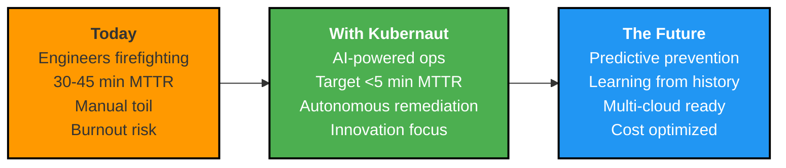
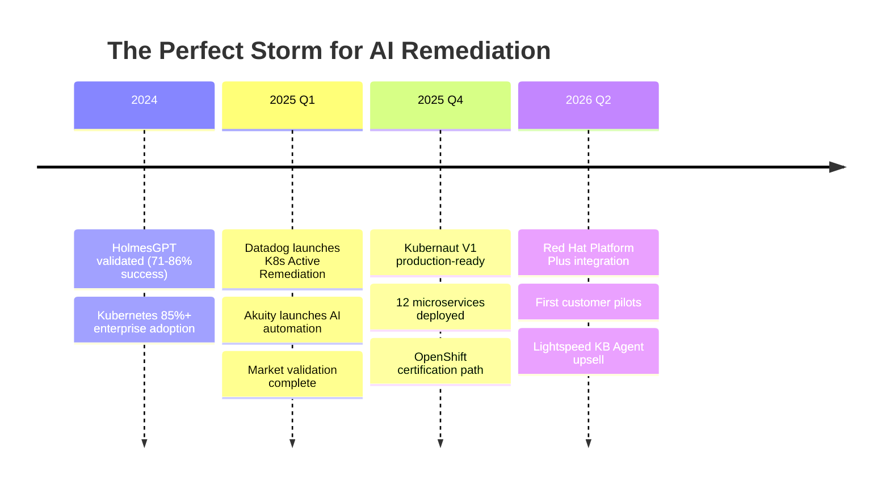
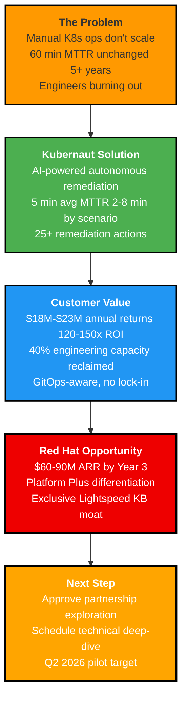

# Slide 16: The Kubernaut Promise

**Act**: 5 - Future Vision & Closing
**Theme**: "Call to Action"

---

## 🎯 Slide Goal

**Close with impact** - summarize value, provide clear next steps, create urgency.

---

## 📖 Content

### Title
**"The Kubernaut Promise: From Firefighting to Innovation"**

### Subtitle
*"Transform OpenShift operations with AI-powered autonomous remediation"*

---

## 🎯 The Promise

> **"Kubernaut doesn't just fix incidents - it transforms how your customers operate Kubernetes."**

---

## 💎 What Makes Kubernaut Defensible

### **For Red Hat**:
1. ✅ **Exclusive OpenShift Integration**: Lightspeed KB Agent (proprietary moat)
2. ✅ **Validated Technology**: 71-86% success rate on 105 real-world scenarios
3. ✅ **Open Source Foundation**: Apache 2.0 with commercial upsell opportunity
4. ✅ **Fast Time-to-Market**: 12 microservices ready Q4 2025, pilot Q2 2026
5. ✅ **Lower Risk**: Partner vs. 18-24 months + $5M+ to build internally

### **For OpenShift Customers**:
1. ✅ **Immediate ROI**: 120-150x return ($150K investment → $18M-$23M annual returns)
2. ✅ **MTTR Transformation**: 5 min average (91% reduction from 60 min industry baseline)
3. ✅ **Engineer Productivity**: 40% capacity reclaimed from firefighting to innovation
4. ✅ **No Lock-In**: Works with existing tools (Prometheus, CloudWatch, etc.)
5. ✅ **OpenShift-Optimized**: Lightspeed KB Agent for OCP-specific issues

---

## 📊 The Business Opportunity

### **Revenue Potential (Year 3 Target)**

| **Tier** | **Customers** | **ARR (Target)** |
|---|---|---|
| OpenShift Platform Plus | 800-1,200 | $48-72M |
| + Lightspeed KB Agent | 160-360 (20-30%) | $12-18M |
| **Total** | — | **$60-90M** |

**Market**: 20,000+ OpenShift customers, targeting 4-6% adoption by Year 3

---

## 🚀 Why Now?

### **Three Converging Forces**

**Key Insight**: Competitors are validating the market NOW. Kubernaut's CRD-native, vendor-neutral approach captures white space they can't reach.

---

## 🎯 Call to Action

### **Next Steps for Red Hat Product Team**

#### **Phase 1: Technical Validation (Q4 2025 - Q1 2026)**
1. ✅ Review Kubernaut architecture and roadmap (Today)
2. ✅ Technical deep-dive with Kubernaut engineering team (2 weeks)
3. ✅ OpenShift Operator certification planning (1 month)
4. ✅ Konflux container certification pipeline setup (1 month)

#### **Phase 2: Partnership Formalization (Q1 2026)**
1. ✅ Define Red Hat downstream vs. Kubernaut upstream ownership
2. ✅ Establish support model (Red Hat L1/L2, Kubernaut L3)
3. ✅ Finalize Platform Plus bundle pricing and packaging
4. ✅ Legal agreements and open source governance

#### **Phase 3: Go-to-Market (Q2 2026)**
1. ✅ Launch 3-5 customer pilots with OpenShift accounts
2. ✅ Red Hat Marketplace listing
3. ✅ Joint marketing and sales enablement
4. ✅ Lightspeed KB Agent beta testing

---

## 📞 Immediate Next Steps

### **This Week**
- **Decision**: Approve/reject Kubernaut partnership exploration
- **Action**: Schedule technical deep-dive with engineering teams
- **Owner**: Red Hat Product Manager + Kubernaut founders

### **This Month**
- **Technical Review**: Architecture validation with Red Hat OpenShift team
- **Competitive Analysis**: Validate positioning vs. Datadog, Dynatrace, Akuity
- **Customer Discovery**: Interview 5-10 OpenShift customers on remediation pain

### **This Quarter (Q4 2025)**
- **Certification**: Begin OpenShift Operator certification process
- **Pilot Planning**: Identify 3-5 target accounts for Q2 2026 pilots
- **Roadmap Alignment**: Sync Kubernaut V1/V2 with Platform Plus timeline

---

## 💬 Final Thought

> **"The question isn't WHETHER AI-powered remediation will transform Kubernetes operations."**
>
> **"The question is: Will Red Hat LEAD with Kubernaut, or follow with 'me-too' solutions?"**
>
> **"Kubernaut is production-ready Q4 2025. The market is validated. The technology works."**
>
> **"Let's make OpenShift the platform where Kubernetes operations become autonomous."**

---

## 📧 Contact & Resources

**Kubernaut Team**:
- GitHub: https://github.com/jordigilh/kubernaut
- Documentation: [Kubernaut Docs]
- Slack Community: [Join Kubernaut Slack]

**For Partnership Inquiries**:
- Email: partnerships@kubernaut.io
- Red Hat POC: [Red Hat Product Manager Name]

**Next Meeting**: Technical Deep-Dive (Proposed: [Date], 2 hours)

---

## 🎯 Key Takeaway

---

**Thank you for your time. Let's build the future of autonomous Kubernetes operations together.**

