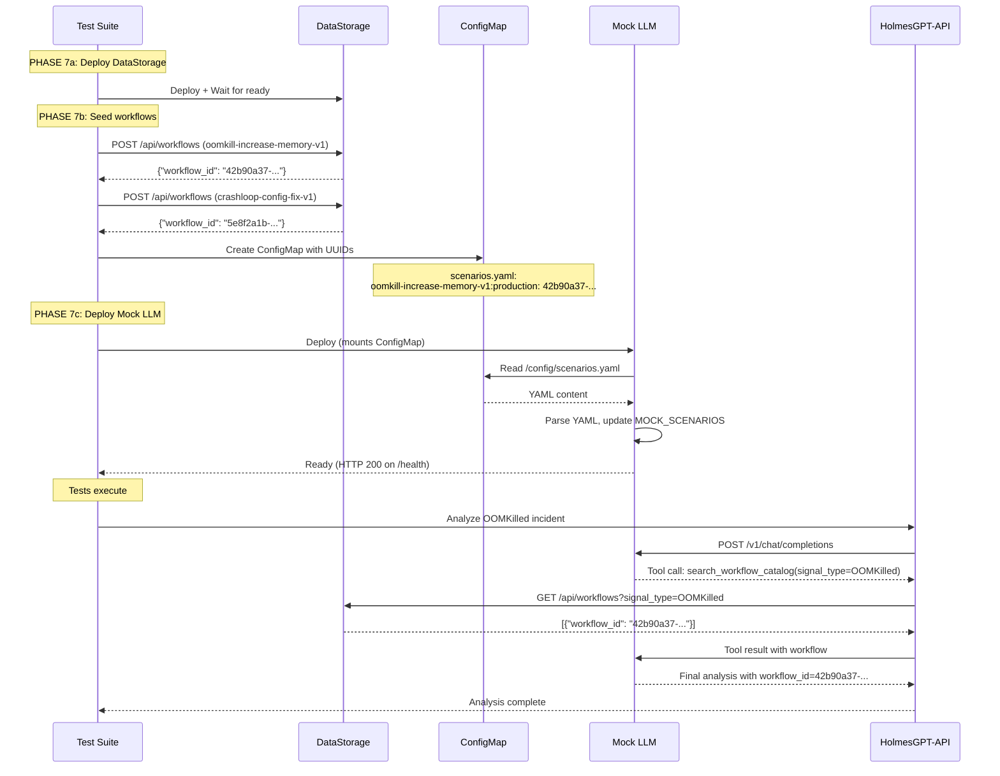

# Mock LLM Service

**Version**: 2.0
**Pattern**: File-Based Configuration (DD-TEST-011 v2.0)
**Purpose**: Deterministic LLM responses for integration and E2E testing

---

## 📋 **Overview**

The Mock LLM service provides a predictable, OpenAI-compatible LLM endpoint for testing HolmesGPT-API and AIAnalysis workflows without requiring real LLM infrastructure.

### **Key Features**

- ✅ **File-Based Configuration**: Scenarios loaded from YAML file
- ✅ **Deterministic Responses**: Predictable output for test assertions
- ✅ **Tool Call Support**: Validates `search_workflow_catalog` and other tool usage
- ✅ **Multi-Turn Conversations**: Handles initial requests and tool result callbacks
- ✅ **Environment Agnostic**: Works in local dev, integration tests, and E2E

---

## 🏗️ **Architecture**

### **Configuration Pattern (DD-TEST-011 v2.0)**

Mock LLM uses a **file-based configuration** system:

```
┌─────────────────────┐
│ scenarios.yaml      │  ← Configuration file (YAML)
│  - workflow UUIDs   │
│  - scenario configs │
└─────────────────────┘
          │
          ├─ Local Dev:        Direct file path
          ├─ Integration:      Direct file path
          └─ E2E (Kubernetes): Mounted via ConfigMap
```

**Key Principle**: The configuration is always a **file**. E2E deployment happens to mount it via ConfigMap, but the Mock LLM only knows about reading a YAML file.

---

## 📁 **Configuration File Format**

### **Basic Structure**

```yaml
scenarios:
  # Format: "workflow_name:environment" → "workflow_uuid"
  oomkill-increase-memory-v1:production: "42b90a37-0d1b-5561-911a-2939ed9e1c30"
  crashloop-config-fix-v1:production: "5e8f2a1b-3c7d-4e0f-9a6b-1d2c3e4f5a6b"
  node-drain-reboot-v1:production: "6f9a3b2c-4d8e-5f1a-0b7c-2e3f4a5b6c7d"

  # Test environment variants
  oomkill-increase-memory-v1:test: "1a2b3c4d-5e6f-7a8b-9c0d-1e2f3a4b5c6d"
  crashloop-config-fix-v1:test: "2b3c4d5e-6f7a-8b9c-0d1e-2f3a4b5c6d7e"
```

### **Full Example**

```yaml
scenarios:
  # Production workflows (real UUIDs from DataStorage)
  oomkill-increase-memory-v1:production: "42b90a37-0d1b-5561-911a-2939ed9e1c30"
  crashloop-config-fix-v1:production: "5e8f2a1b-3c7d-4e0f-9a6b-1d2c3e4f5a6b"
  node-drain-reboot-v1:production: "6f9a3b2c-4d8e-5f1a-0b7c-2e3f4a5b6c7d"
  memory-optimize-v1:production: "7a0b4c3d-5e9f-6a2b-1c8d-3e4f5a6b7c8d"
  generic-restart-v1:production: "8b1c5d4e-6f0a-7b3c-2d9e-4f5a6b7c8d9e"
  no-workflow-found-v1:production: "9c2d6e5f-7a1b-8c4d-3e0f-5a6b7c8d9e0f"

  # Staging workflows (for pre-production testing)
  oomkill-increase-memory-v1:staging: "a0d37f6e-8b2c-9d5e-4f1a-6b7c8d9e0f1a"
  crashloop-config-fix-v1:staging: "b1e48g7f-9c3d-0e6f-5a2b-7c8d9e0f1a2b"

  # Test workflows (for integration testing)
  oomkill-increase-memory-v1:test: "1a2b3c4d-5e6f-7a8b-9c0d-1e2f3a4b5c6d"
  crashloop-config-fix-v1:test: "2b3c4d5e-6f7a-8b9c-0d1e-2f3a4b5c6d7e"
```

### **Key Matching Logic**

The Mock LLM matches incoming requests to scenarios based on:
1. **Signal Type**: Extracted from alert/incident description
2. **Environment**: Defaults to "production" if not specified
3. **Workflow Name**: Maps to internal scenario using `workflow_name` field

```python
# Example: OOMKilled alert → "oomkilled" scenario → workflow_name="oomkill-increase-memory-v1"
# Looks up: "oomkill-increase-memory-v1:production" → UUID "42b90a37..."
```

---

## 🚀 **Usage Patterns**

### **1. Local Development**

```bash
# Create local config file
cat > /tmp/mock-llm-scenarios.yaml <<EOF
scenarios:
  oomkill-increase-memory-v1:production: "test-uuid-123"
  crashloop-config-fix-v1:production: "test-uuid-456"
EOF

# Run Mock LLM
export MOCK_LLM_CONFIG_PATH=/tmp/mock-llm-scenarios.yaml
python -m src
```

### **2. Integration Tests (Go)**

```go
// test/integration/aianalysis/suite_test.go
func setupMockLLM() {
    // Write scenarios to temp file
    scenariosYAML := `
scenarios:
  oomkill-increase-memory-v1:production: "42b90a37-0d1b-5561-911a-2939ed9e1c30"
  crashloop-config-fix-v1:production: "5e8f2a1b-3c7d-4e0f-9a6b-1d2c3e4f5a6b"
`
    configPath := "/tmp/mock-llm-config.yaml"
    os.WriteFile(configPath, []byte(scenariosYAML), 0644)

    // Start Mock LLM with config
    cmd := exec.Command("python", "-m", "src")
    cmd.Env = append(os.Environ(),
        "MOCK_LLM_CONFIG_PATH="+configPath,
        "MOCK_LLM_PORT=8080",
    )
    cmd.Start()
}
```

### **3. E2E Tests (Kubernetes)**

**Step 1**: Test suite creates ConfigMap with workflow UUIDs

```go
// test/infrastructure/aianalysis_e2e.go
func createMockLLMConfigMap(workflowUUIDs map[string]string) {
    yamlContent := "scenarios:\n"
    for key, uuid := range workflowUUIDs {
        yamlContent += fmt.Sprintf("  %s: %s\n", key, uuid)
    }

    manifest := fmt.Sprintf(`
apiVersion: v1
kind: ConfigMap
metadata:
  name: mock-llm-scenarios
  namespace: kubernaut-system
data:
  scenarios.yaml: |
%s
`, indentYAML(yamlContent, 4))

    kubectl.Apply(manifest)
}
```

**Step 2**: Mock LLM Deployment mounts ConfigMap

```yaml
apiVersion: apps/v1
kind: Deployment
metadata:
  name: mock-llm
spec:
  template:
    spec:
      containers:
      - name: mock-llm
        image: kubernaut/mock-llm:e2e
        env:
        - name: MOCK_LLM_CONFIG_PATH
          value: "/config/scenarios.yaml"
        volumeMounts:
        - name: scenarios-config
          mountPath: /config
          readOnly: true
      volumes:
      - name: scenarios-config
        configMap:
          name: mock-llm-scenarios
```

**Step 3**: Mock LLM reads file at startup

```python
# test/services/mock-llm/src/__main__.py
config_path = os.getenv("MOCK_LLM_CONFIG_PATH", "/config/scenarios.yaml")
if os.path.exists(config_path):
    load_scenarios_from_configmap(config_path)  # Reads YAML file
```

---

## 🧪 **Testing**

### **Unit Tests**

```python
# test/services/mock-llm/tests/test_config_loading.py
import tempfile
import yaml
from src.server import load_scenarios_from_configmap, MOCK_SCENARIOS

def test_load_scenarios_from_file():
    """Test loading scenarios from YAML file."""
    with tempfile.NamedTemporaryFile(mode='w', suffix='.yaml', delete=False) as f:
        yaml.dump({
            'scenarios': {
                'oomkill-increase-memory-v1:production': 'test-uuid-123',
                'crashloop-config-fix-v1:production': 'test-uuid-456',
            }
        }, f)
        config_path = f.name

    # Load scenarios
    load_scenarios_from_configmap(config_path)

    # Verify scenarios updated
    assert MOCK_SCENARIOS['oomkilled'].workflow_id == 'test-uuid-123'
    assert MOCK_SCENARIOS['crashloop'].workflow_id == 'test-uuid-456'
```

### **Integration Tests**

Integration tests validate file reading + HTTP endpoint behavior:

```python
def test_mock_llm_with_custom_config(mock_llm_server):
    """Test Mock LLM with custom scenario configuration."""
    # Mock LLM already started with config file

    # Send request
    response = requests.post(
        f"{mock_llm_server}/v1/chat/completions",
        json={
            "messages": [{"role": "user", "content": "OOMKilled in production"}],
            "tools": [{"type": "function", "function": {"name": "search_workflow_catalog"}}]
        }
    )

    # Verify tool call with correct UUID
    tool_call = response.json()["choices"][0]["message"]["tool_calls"][0]
    assert tool_call["function"]["name"] == "search_workflow_catalog"
    # UUID matches config file
```

---

## 📊 **Scenario Structure**

### **Pre-defined Scenarios**

Mock LLM comes with 7 built-in scenarios:

| Scenario Name | Signal Type | Workflow Name | Default UUID |
|---|---|---|---|
| `oomkilled` | OOMKilled | oomkill-increase-memory-v1 | 21053597-2865-572b-... |
| `crashloop` | CrashLoopBackOff | crashloop-config-fix-v1 | 30152a85-3975-682c-... |
| `nodenotready` | NodeNotReady | node-drain-reboot-v1 | 47261b96-4086-793d-... |
| `memory_optimize` | OOMKilled | memory-optimize-v1 | 58372ca7-5197-804e-... |
| `generic_restart` | Unknown | generic-restart-v1 | 69483db8-62a8-915f-... |
| `no_workflow` | NoMatch | no-workflow-found-v1 | 70594ec9-73b9-026g-... |
| `low_confidence` | OOMKilled | (no workflow) | (confidence < 0.5) |

### **Scenario Configuration Fields**

```python
@dataclass
class MockScenario:
    name: str                  # Scenario identifier
    signal_type: str           # Expected signal type (OOMKilled, CrashLoopBackOff, etc.)
    severity: str              # Severity level (critical, high, medium, low)
    workflow_name: str         # Workflow name for UUID lookup
    workflow_id: str           # UUID of selected workflow (overridden by config file)
    workflow_title: str        # Human-readable workflow title
    confidence: float          # Analysis confidence (0.0-1.0)
    root_cause: str            # Root cause analysis text
    rca_resource_kind: str     # Kubernetes resource kind
    rca_resource_namespace: str # Kubernetes namespace
    rca_resource_name: str     # Resource name
    parameters: Dict[str, str] # Workflow parameters
```

---

## 🔧 **Environment Variables**

| Variable | Default | Description |
|---|---|---|
| `MOCK_LLM_HOST` | `0.0.0.0` | Bind address |
| `MOCK_LLM_PORT` | `8080` | HTTP port |
| `MOCK_LLM_CONFIG_PATH` | `/config/scenarios.yaml` | Path to configuration file |
| `MOCK_LLM_FORCE_TEXT` | `false` | Force text responses (skip tool calls) |

---

## 🏛️ **Architecture Decision (DD-TEST-011)**

### **Why File-Based Configuration?**

**Problem**: E2E tests need dynamic workflow UUIDs from DataStorage, but Mock LLM starts before UUIDs are known.

**Evaluated Alternatives**:
1. ❌ **REST API sync**: Mock LLM pulls UUIDs from DataStorage at startup (timing issues)
2. ✅ **File-Based Config**: Test suite writes file, Mock LLM reads it (deterministic)
3. ❌ **Self-Discovery**: Mock LLM queries DataStorage (complex, timing-sensitive)

**Decision**: **Alternative 2 - File-Based Configuration**

**Rationale**:
- ✅ **Deterministic ordering**: Test suite controls when file is created
- ✅ **No network dependencies**: File system access is fast and reliable
- ✅ **Environment agnostic**: Works in local dev, integration, E2E
- ✅ **Simple implementation**: Read YAML file, parse, update scenarios
- ✅ **Kubernetes-friendly**: ConfigMaps mount as files automatically

### **Evolution from v1.0 (HTTP Self-Discovery)**

**v1.0 Issue**: Mock LLM attempted to query DataStorage at startup, but:
- DataStorage might not be ready yet
- Workflows might not be seeded yet
- Retry logic complicated startup
- Readiness probes timed out

**v2.0 Solution**: Test orchestration ensures deterministic ordering:
```
PHASE 7a: Deploy DataStorage → Wait for ready
PHASE 7b: Seed workflows → Create ConfigMap with UUIDs
PHASE 7c: Deploy Mock LLM → Mounts ConfigMap → Reads file → Starts serving
```

---

## 📚 **Related Documentation**

- **DD-TEST-011**: Mock LLM Fixture Provisioning Pattern (Architecture Decision)
- **DD-API-001**: OpenAPI Client Usage (HolmesGPT-API integration)
- **DD-WORKFLOW-002**: Workflow UUID Generation (DataStorage security)
- **E2E Test Infrastructure**: `test/infrastructure/aianalysis_e2e.go`

---

## 🔄 **Maintenance**

### **Adding New Scenarios**

1. **Update `server.py`** with new scenario:
```python
MOCK_SCENARIOS["new_scenario"] = MockScenario(
    name="new_scenario",
    workflow_name="new-workflow-v1",
    signal_type="NewSignalType",
    workflow_id="default-uuid",  # Overridden by config file
    # ... other fields
)
```

2. **Update E2E workflow seeding** in `test/infrastructure/aianalysis_workflows.go`:
```go
{
    WorkflowID:  "new-workflow-v1",
    Name:        "New Workflow",
    SignalType:  "NewSignalType",
    // ...
}
```

3. **Config file automatically updated** by E2E infrastructure.

### **Version History**

- **v2.0 (Current)**: File-based configuration via ConfigMap
- **v1.0 (Deprecated)**: HTTP self-discovery from DataStorage

---

## 🐛 **Troubleshooting**

### **Problem**: Mock LLM uses default UUIDs instead of config file

**Diagnosis**:
```bash
# Check if config file exists in pod
kubectl exec -n kubernaut-system deploy/mock-llm -- ls -la /config/

# Check Mock LLM logs for config loading
kubectl logs -n kubernaut-system deploy/mock-llm | grep "Loading workflow UUIDs"
```

**Solution**:
- Verify ConfigMap created: `kubectl get configmap mock-llm-scenarios -n kubernaut-system`
- Verify volume mount in Deployment spec
- Check `MOCK_LLM_CONFIG_PATH` environment variable

### **Problem**: Workflows not found in catalog

**Diagnosis**:
```bash
# Check DataStorage has workflows
curl http://datastorage:8080/api/workflows | jq '.[] | {workflow_name, workflow_id}'
```

**Solution**:
- Verify E2E PHASE 7b completed (workflow seeding)
- Check ConfigMap content matches DataStorage UUIDs
- Verify environment matches (production vs test)

---

## 📖 **Example: Complete E2E Flow**



---

## 🎯 **Summary**

**Mock LLM** provides deterministic LLM responses for testing using a **file-based configuration pattern**:
- ✅ Configuration is always a **YAML file**
- ✅ E2E tests mount it via **ConfigMap** (Kubernetes deployment detail)
- ✅ Integration tests use **direct file path** (simpler)
- ✅ Enables **100% reproducible tests** with dynamic workflow UUIDs

**Key Insight**: ConfigMap is just the **delivery mechanism** in E2E. The core pattern is **file-based configuration**.
